# P122：3-非线性核函数介绍 - 程序大本营 - BV1KL411z7WA

咱们先回到咱们的代码当中，我们呢一起来看一下咱们和函数它所对应的。

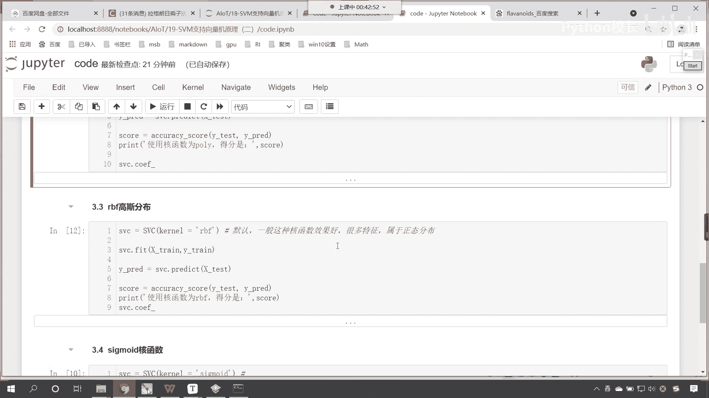

它所对应的这个方程是怎样的啊，那我们的这个课程呢，咱们如果要从上从上往下讲，我们首先讲到的都是一系列的算法，这个比较枯燥，所以咱们现在呢把课程当中的内容，咱们进行一个拆解，我们先看核函数。

因为这个呢是比较简单的啊，好我们刚才呢讨论区里边呢，有一个小伙伴问了一个问题，那怎么确定用哪种参数呢，啊我们在训练模型的时候。

你看咱们是不是都有这个模型评估呀，对不对，你看这个iqc sc它是不是就是模型评估，你看这个是不是模型评估呀，咱们根据模型评估的结果，咱们来确定使用哪种参数，那分数越高，那我们是不是就选择用哪种参数呀。

对于我们这个案例而言，咱们就能够发现我们的线性和函数，它的得分是不是很高呀，看到了吧，是0。97，那么对于我们葡萄酒分类这个案例而言，咱们支持向量机所选的核函数是不是就是linear，对不对。

各种核函数都有存在的必要，所以说呢咱们就需要花时间去调整参数是吧，这个时候才能够得到一个啊，比较好的一个结果哈。

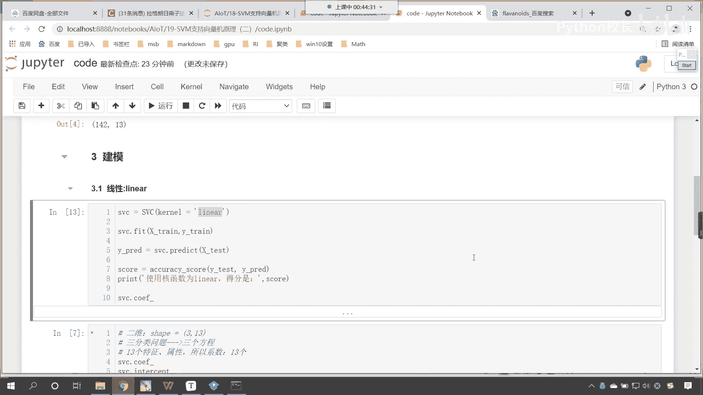

来现在呢我们对于这个核函数呢，咱们进行一个介绍啊，那么咱们所提供的多项式和函数，咱们所提供的这个呃高斯分布的核函数，它其实呢都叫做非线性的核函数，那线性的和函数比较容易理解。

线性的和函数是不是就是咱们的线性方程呀，对不对，对不对，转换成了线性方程之后，然后进行概率的转换，最后的话我们进行了类别的一个划分，那么大家看这个图，你看看这个图，我们有两类点，一个是红色的。

一个是蓝色的，请问我们能用一条直线把这两类点给它分开吗，很显然是不行的。

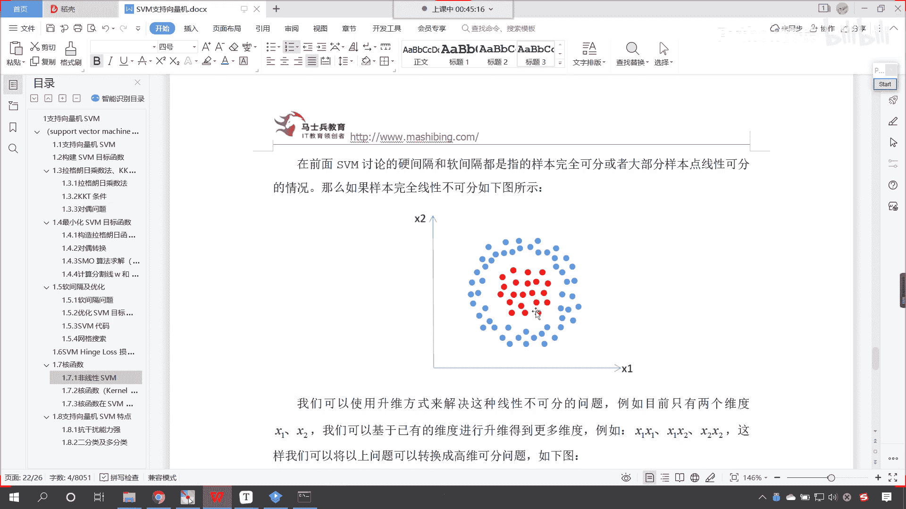

对不对，看到了吧，很显然是不行的，你想一想是不是很显然不行的。

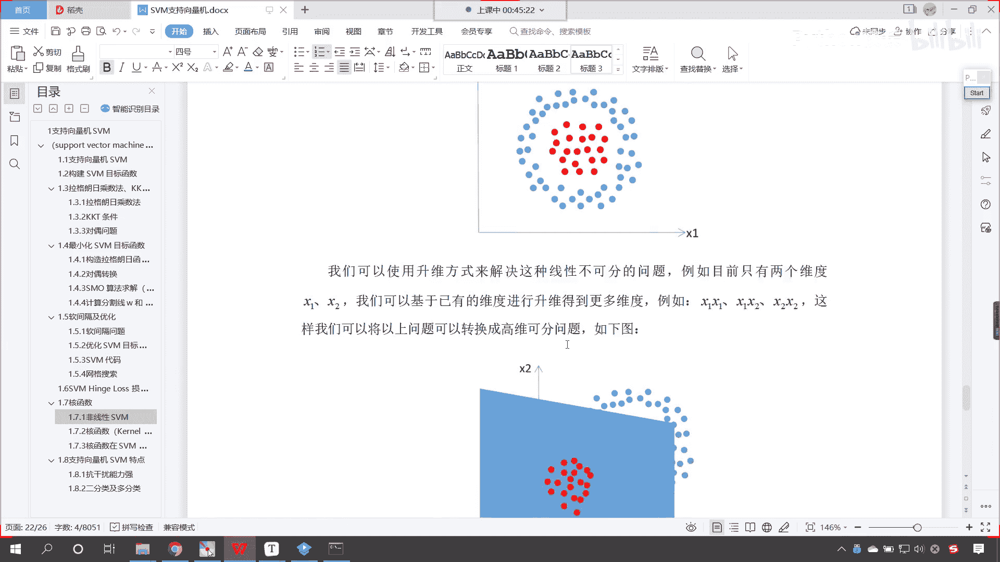

所以这个时候，咱们就得需要用什么样的和函数呀。

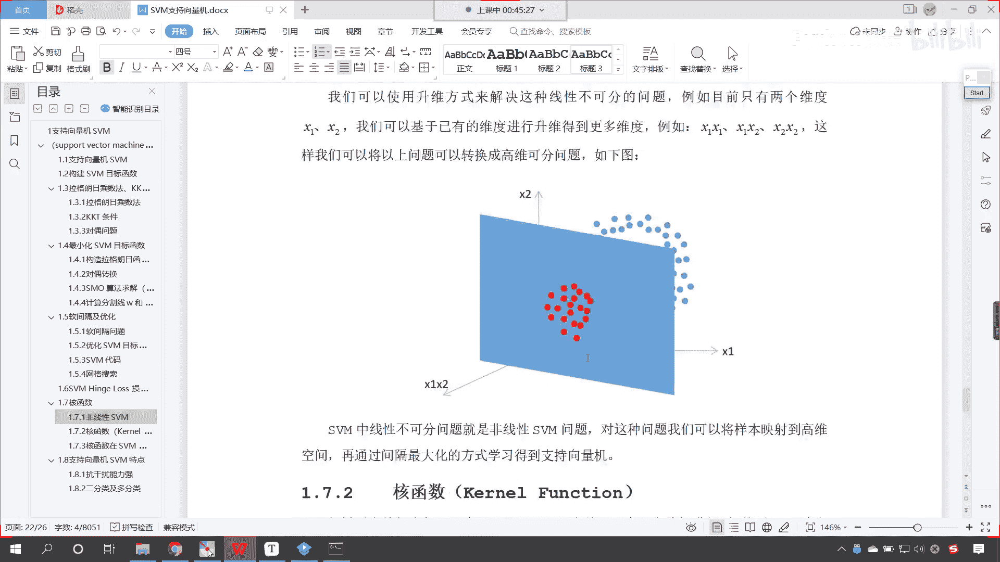

那你比如说啊，我现在呢咱们在代码当中。

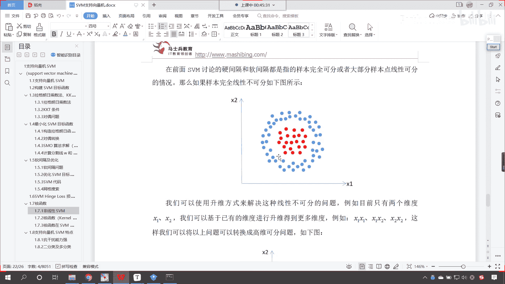

咱们做一个操作，做一个演示啊，来回到代码当中好。

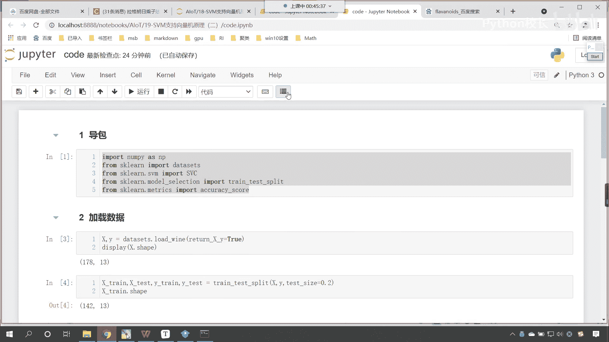

那么我们首先咱们在上面插入一行，咱们来一个二级标题，这个呢就是s v c和函数嗯，现在大家就能够看到是吧。

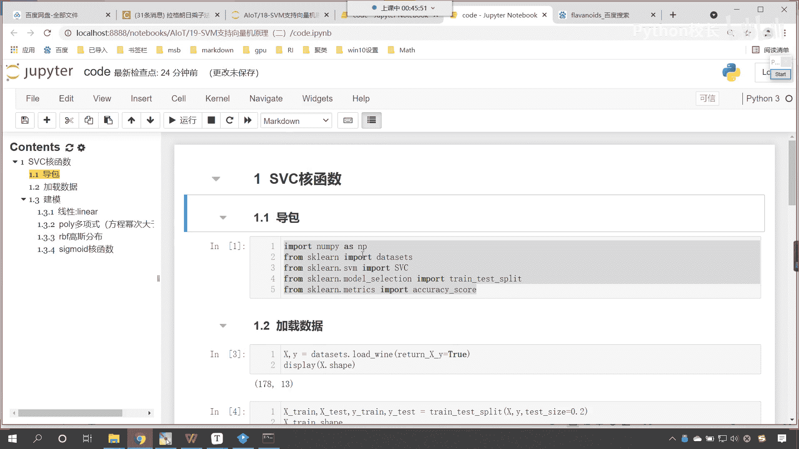

咱们这个层次结构就出来了，好那么嗯接下来呢咱们再插入一行，我们再来一个二级标题好，那么接下来呢咱们就介绍一下，这叫做非线性和函数，那此时呢我为你创造一些数据啊，看此时咱们创造一些数据。

那我们能够看到是吧。

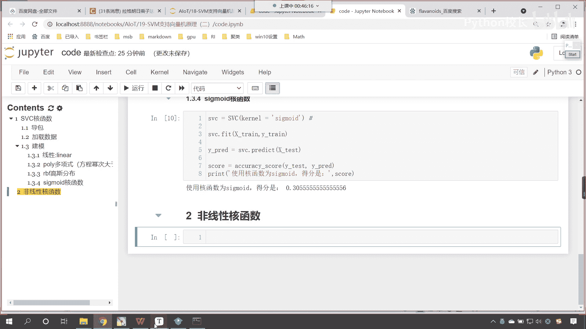

咱们这个数据是这样的，是不是啊，那咱们就创造一下啊。

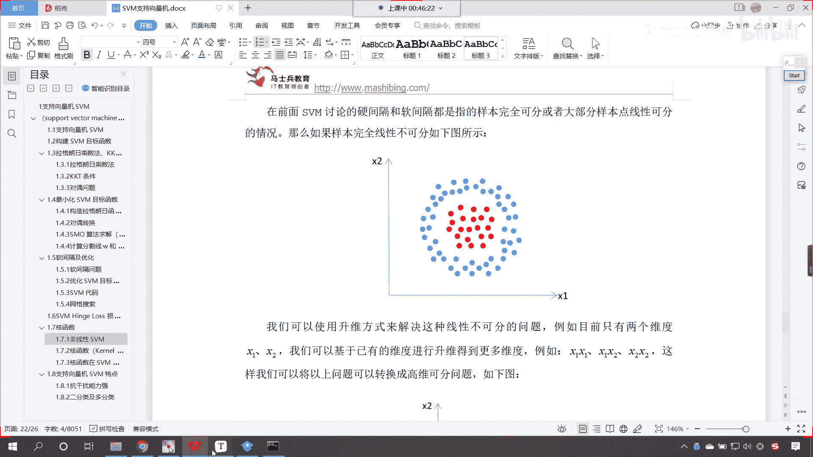

看一下这个数据来，现在呢咱们就回到代码当中，咱们创建一个和它类似的调用data sets，咱们make m a k e里边有一个方法叫做make circle，circle是不是就有圆圈的意思呀。

对不对，那么它会生成多少个数据呀，它会生成100个，那对应的参数呢，咱们给他声明一下，n sample，它是100个，里边还有一个参数叫factor，这个factor呢就是我们圆圈的大和小。

咱们给它调整成0。7，那么得到这个数据之后，我们会得到x会得到y嗯，现在呢咱们将这个画图画出来，大家就知道它是什么样的了，想要画图，咱们将mat plot lip导进来。

piplot as plt执行一下这个代码，那么嗯对于咱们所生成的xy它长什么样，咱们display查看一下它的形状，然后y。ship，这个时候你就能够发现，你看咱们的数据是不是100和二。

然后给了个100呀，那y长什么样呢，你看一执行它是1010，这个时候是不是意味着咱们的y是两两个类别。

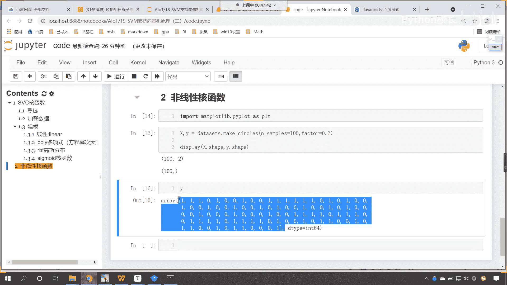

那么我们把它画画出来啊，那就是p t，咱们调用scanner来一个小括号scatter，我们给一个横坐标，横坐标呢咱们选择它的第一列，再来一个纵坐标，纵坐标的话冒号咱们选择它的第二列。

然后呢我们给一个颜色c呢，就对应咱们的y对应咱们的类别，这个时候你看过一执行唉，现在你就能够发现，你看这个数据是不是就有了呀，嗯大家看这个数据是不是就有了，那么这个颜色呢咱们也可以给它调一下啊。

我们调成一个这个蓝色，调成一个红色，现在你能够发现，你看这个画的是不是不是圈圈呀，对吧，没关系，咱们可以调整尺寸的大小，把它变圆，p t。figure，这个时候呢咱们给一个这个figure size。

我们让它是五和五，这个时候你看嗯是不是就变成一个圆了呀，好那么变成了一个圆之后呢，咱们这个数据呢，我们可以给它稍微加点噪声了哈，大家看看咱们加点噪声，那x我们让它加等np一点，咱们调用random。

咱们调用run这个呢就是一个正态分布，咱们也来一个100来一个二，这个时候你看我一执行，大家看咱们家的这个噪声是不是有点大，那我们让它乘以多少呀，咱们让它乘以0。1，你看这个时候你看再来执行嗯。

这个还是有点大，是不是我们再来一个0。01，这个时候你来看是吧，0。01这个又有点微小了是吧，再执行啊，咱们给它加一个0。03，这个时候你来看好，现在你就能够看到我们创造了这样的数据。

那么咱们对于这个数据我们进行一个划分，好不好看，咱们对于这个数据咱们进行一个划分，咱们刚才说呢，我们想要给它调整颜色对吧，咱们调整颜色呢，我们可以给一个c map是吧，我们把它调整成什么颜色呀。

调整成一个红色，调整成一个蓝色，那这个时候咱们就得需要导包啊，咱们就from，它里边有一个这个color，咱们从colors当中，咱们导import一个对象叫list color map。

把这个导包导进来，看到的是这个，那么我们就给他创建一个，给他创建一个这个color map啊，就叫做c map，就等于listed color map，那这个里边儿呢咱们就给它填充颜色就可以了。

那我们就给一个colours，咱们这让这个colors等于多少呢，我们给他一个red，然后呢咱们给一个blue，有了这个颜色，咱们将c map进行赋值，c map就等于c map。

这个时候你看过一执行这个颜色，是不是就有了呀，如果你想要让里面是红色的，那么我们将red和blue咱们调一下顺序，这个时候就可以了啊，大家看啊，这个blue，然后逗号咱们来一个。

第二个呢咱们给一个red，这个时候你看我一执行，现在这个颜色是不是就有了呀，好那么有了这个之后呢，咱们就使用咱们的核函数是吧，我们进行一个操作啊。

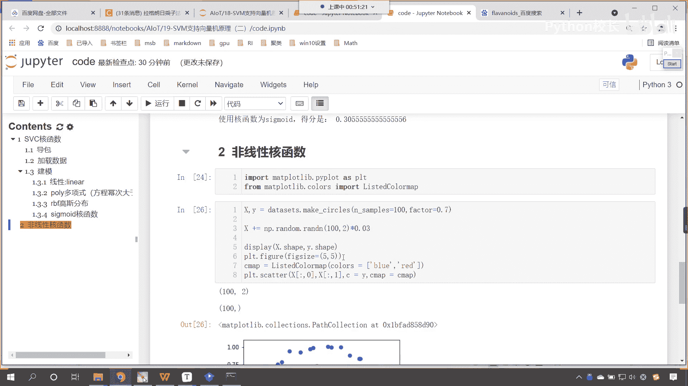

来在这里的话，咱们来一个这个三级标题，上面呢是咱们创造数据，对不对呀，啊这个就是创造数据，那我们这个呢咱们就使用线性核函数，咱们看一下它的分类情况怎么样，那在我们第一个案例当中，咱们使用支持向量机。

我们对于葡萄酒的分类使用线性核函数，效果很好，对不对，接下来咱们使用s v c，那么声明一个s vc里边呢，咱们给一个kernel，这个kernel呢我们首先给linear，然后呢咱们就svc点。

咱们调用feat这个函数，将x和y放进去，然后呢s v c一点scr一下啊，咱们将x和y放进去，这个时候你看我一直行，大家看此时这个准确率只有多少，是不是只有0。51呀，你看为啥。

因为嗯我如果给你这样的一个数据，让你用一条线把它分开，你想可能吗，能不能分开，它就不可能分开，对不对，所以这个时候你看这个线性和函数，它是不是就黔驴技穷了，对不对，线性有的时候呢它是低维的。

它解决不了这个问题，那接下来呢咱们使用多项式的啊，咱们使用多项式polly，那这个多项式polly它表示什么呢，它表示升为，这啥是升维呢，你看什么是升维啊，哎就是维度给变多了啊，那我们看一下它怎么样啊。

来咱们将上面这个复制一下，ctrl c在这儿来一个粘贴，你思考一下这个效果会好吗，来我们在讨论区是吧，咱们呢可以回复一下哈，这个效果比咱们的线性回归好还是不好，来认为好的是吧，咱们这个回复一个六啊。

认为不好的，咱们回复一个零，看看你的感觉啊啊怎么样啊，你看我一直行，哎大家现在就能够看到那polly多项式，它是不是就变成0。69了是吧，那么如果我们使用polly多项式。

既然是多项式里边有一个参数叫degree，你知道这个degree表示什么吗，我们配眼镜的时候，这个degree就表示度数啊，就表示维度，就表示咱们是几次幂，默认情况下它是三次幂，那咱们可以怎么样呀。

看咱们可以给它改成二次幂，我们执行看一下诶，大家看效果怎么样，我改成二次幂之后，你就发现是不是逆天的好呀。

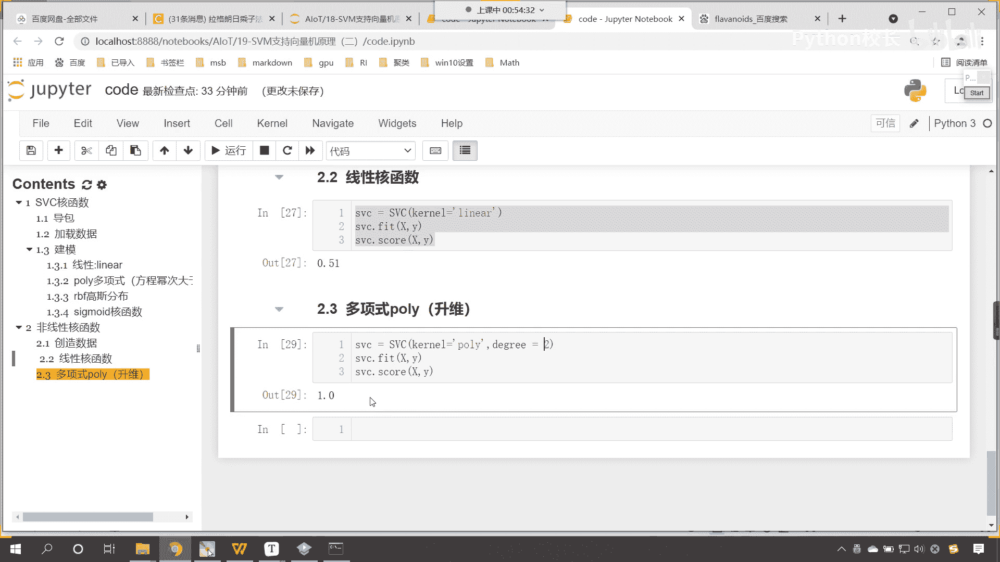

你知道为什么吗，你知道为什么改成二次幂，它的效果非常好吗，来咱们看一下咱们这个数据啊，你看这个数据它是不是一个圆环呀，对吧，它是一个圆环，那我我怎么才能把这个数据分开呢，你想咱们是不是这样画一个圈儿。

它是不是就可以分开，对不对，画一个圈儿是不是就可以将这个数据分开啊，那么你知道咱们所画的这个圈，它所对应的方程是什么样的吗，它所对应的方程，那我告诉你它所对应的方程是什么啊。

看它所对应的方程是不是就是f，它是不是就等于x的平方，咱们假设说他的这个圆心是原点，是不是就是x的平方加y方，看到了吧，他就是就是x的平方加y方，是不是，所以说你看这个是不是就是二次幂对吧。

那我在使用polly多项式和函数的时候。

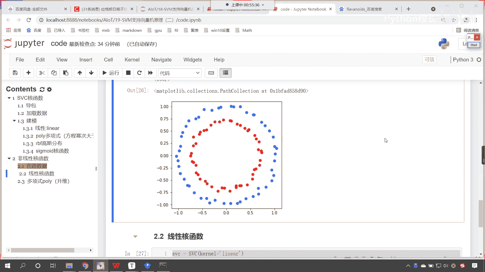

我给一个二，你看效果是不是一下子就非常好了呀，二次幂变成一个面儿是吧，它进行了这个相应的切开啊，将咱们这个数据嗯给切开了。

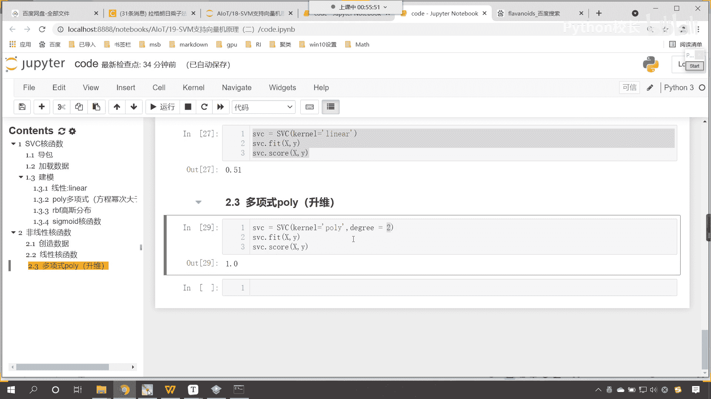

好那么我们来一个四次幂呢，你看四次幂也比较好是吧，咱们来一个这个五次幂，看五次幂就不行了，咱们来一个三次幂呢，你看一执行，这就是0。69是吧，那来一个一次幂呢，你看来一个一次幂，看到了吧，来一个一次幂。

这个时候你能够发现一次幂怎么样了，看到了吧，一次幂怎么样了，一次幂和咱们上面这个0。51，是不是就一样了，因为这个一次幂呢啊，因为咱们这个一次幂和咱们上面的线性核函数，它呢就是等价了哈。

看咱们来一个六次幂啊，看六次幂是不是也是一点呀，其实这个更高的次幂呢，对他这个影响呢是一样的哈，哎我们执行一下啊，这个时候咱们就发现你看哎它就变成一点了，这个呢就是咱们的这个这个数据的一个情况好。

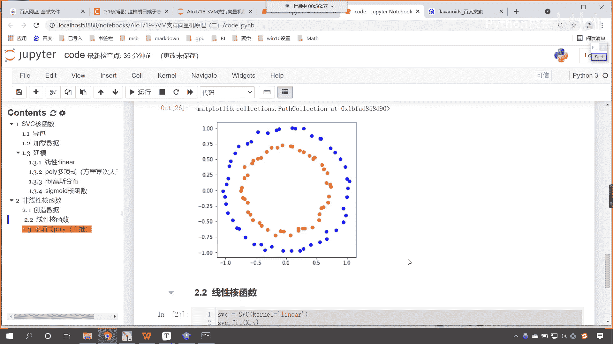

那么我们接下来继续往下看，咱们复制一下，我们再来一个三级标题好，那么我们使用r b f这个呢就是高斯核函数。

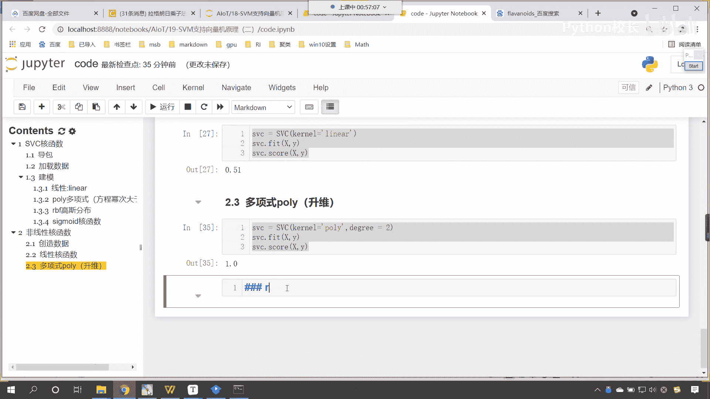

咱们看一下它这个怎么样，rbf，那么如果要是r b f，咱们这个degree这个参数就没用了，这个degree这个参数看degree这个参数，它呢只针对于polly多项式，现在你看我一执行。

你有没有发现咱们的高斯核函数，准确率是不是也高呀，那通过这个案例，我们就发现咱们的非线性核函数是吧，对于我们非线性的数据，是不是起到非常至关重要的作用呀。

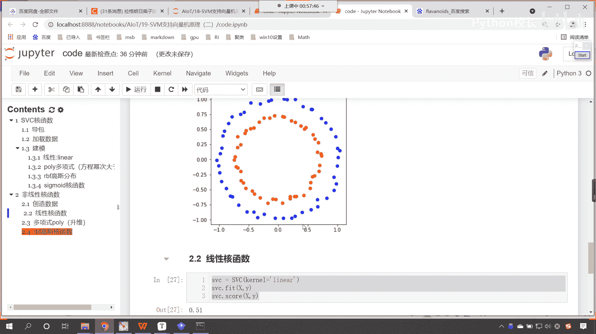