# P123：4-核函数对应数学公式 - 程序大本营 - BV1KL411z7WA

继续往下看。

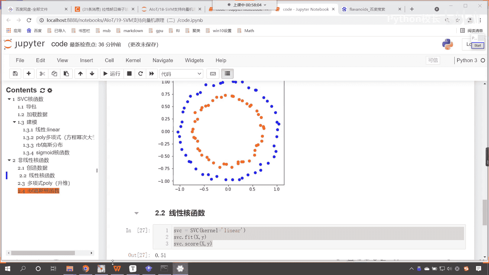

咱们呢回到咱们的这个课程大纲当中。

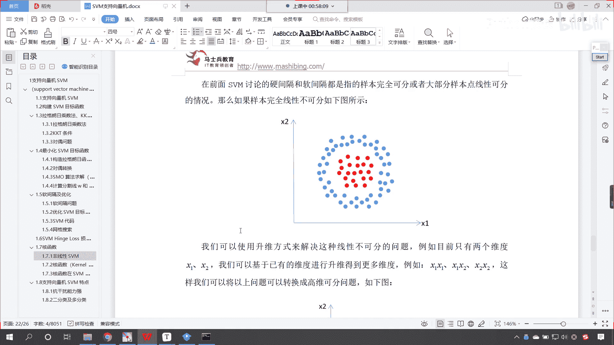

现在呢你就能够看到啊，那么这个地方呢他给了一个升维，看这个地方给了一个升维，我们可以使用升维方式来解决，这种线性不可分的问题，假如说目前只有两个v维度xy，那么我们可以基于已有的维度，咱们对它进行演变。

变成更多的维度，那这个时候其实就是x一乘以x1 ，x一乘以二，x2 ，x2 乘以这个x2 。

通过这种演变之后，你就能够看到咱们的维度变多了之后，你看这个红色的点和咱们蓝色的点，你就能够发现它是不是就有一个这个位置的，一个移动啊，看它就会有一个这个位置的这个移动了。

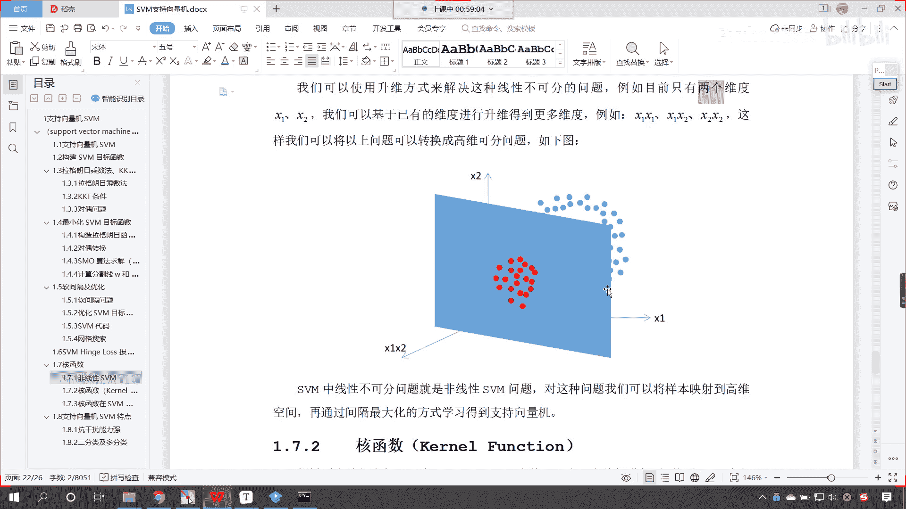

好那么有了有了咱们这个知识向量机。

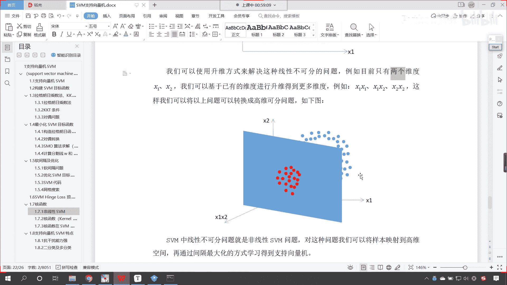

他的这个多项式，它的这个数据升维，那么我们就发现是吧，咱们这个数据呢就可以分开了。

因为我们给它增加一个维度。

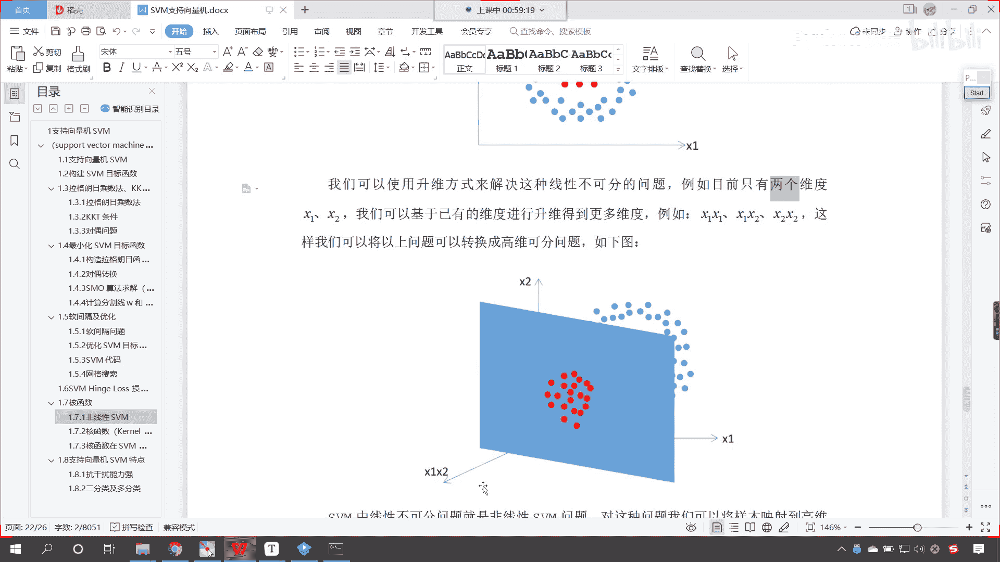

那么它呢就发生了一定的这个变化，看给它增加一个维度，这个数据呢它就发生了一个改变。

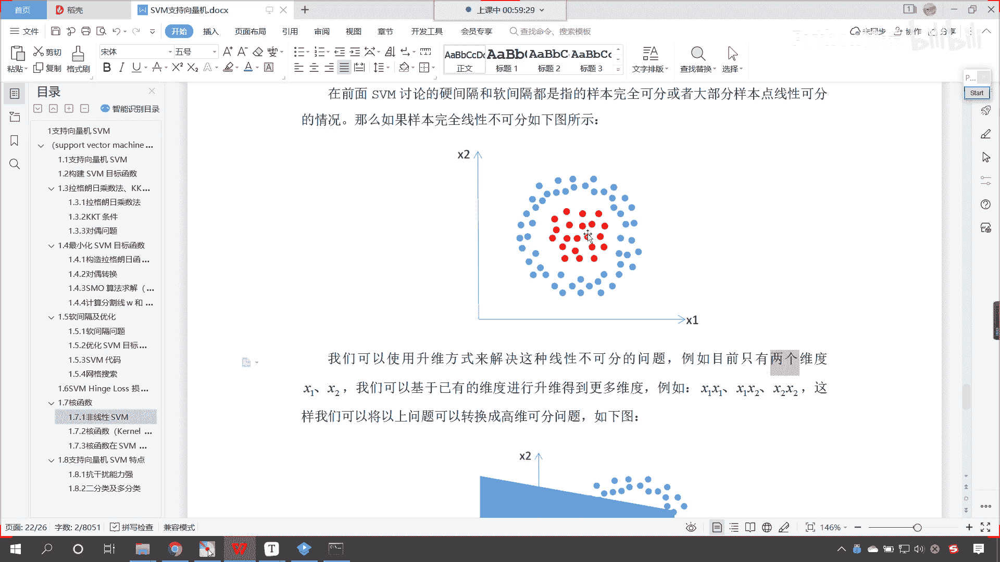

好那么接下来呢咱们再来看啊，这个我们的核函数呢更高的维度呢。

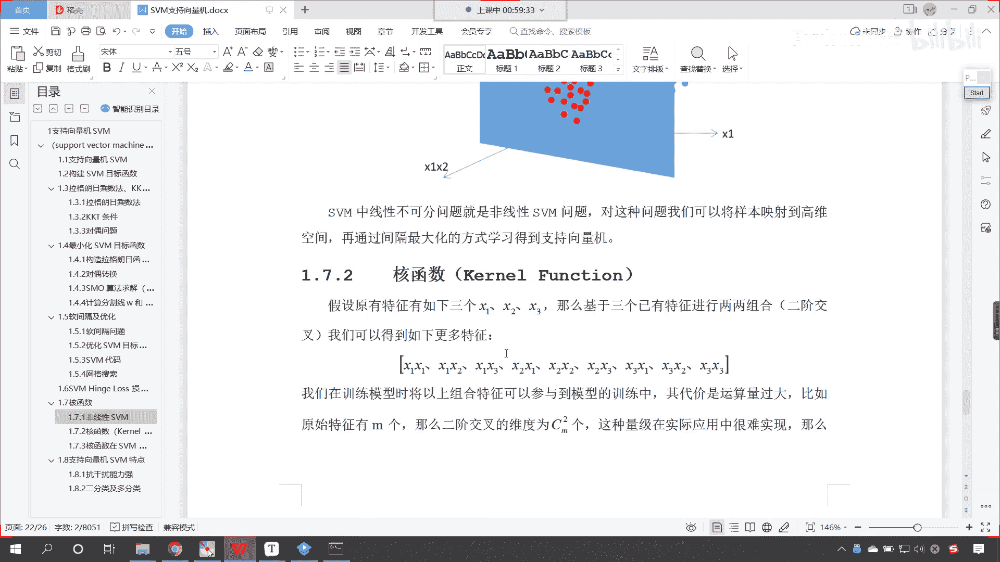

你看这个更高的维度呢，比如说这个平方呀，立方呀，哎他都是可以的，那上面咱们介绍了多项式和函数，接下来这个线性核函数呢，哎咱们就这个一笔带过了啊，你看这个线性和函数唉，就是其实呢就是咱们的矩阵乘法。

那么我们的多项式和函数，看这个里边为什么涉及到这个矩阵乘法了呀，看x i t乘以x i g，是不是你想一下咱们之前所讲的线性回归，咱们所讲的正规方程里面，是不是就用到了相应的一个矩阵运算呀。

那看一下咱们的多项式和函数啊，你能够看到这啥是多项式和函数呀，我们参数当中是不是有一个degree呀，看到了吧，参数当中有一个degree，那这个degree表，那这个d表示什么。

这个d是不是就是表示咱们的几次幂，就是咱们参数当中的嗯，这个嗯degree他呢就表示几次密好，那么下面呢还有一个高斯核函数，你能够看到这个高斯核函数呢，哎你看它进行了这样的一个转变。

这个这个sigma呢哎就是咱们的这个标准差啊，西格玛就是标准差，它上面呢是xi减x g平方，那这个高斯核函数嗯，里边呢就涉及到咱们高斯核函数的，这个概率密度分布啊，它就涉及到相应的概率密度分布。

所以说咱们现在所看到的这几种核函数，它所对应的数学公式就是咱们所看到的，这样我们能够看到，如果说这个d等于零，看啊这个d等于零，它会怎么样呀，看在这咱们就假设一下这个d等于零会怎么样，d等于零之后啊。

这个d等于一，咱们说错了啊，d等于一是不是就表示它是一次幂呀，对不对，看啊d等于一是不是就表示一次幂，那这个一次幂你就能够发现它，是不是就和上面咱们的这个线性核函数，是不是就一样了呀，看到了吧。

如果你的d等于一，是不是和上面就类似，就一样了，所以说这个多项式和函数，其实就是在咱们线性核函数的基础上，咱们是不是给它加了个次幂呀，对不对，仅此而已，而高斯核函数呢这个变化就比较大了。

这个变化它考虑了我们数据的特征分布，那你可以去，你可以去查一下这个高斯核函数是吧，它的这个概率密度分布。

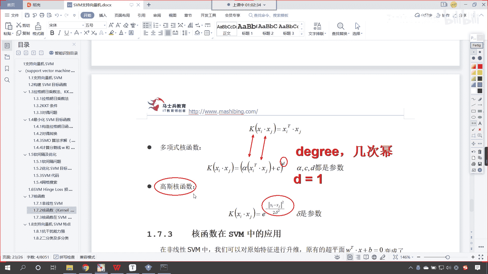

我们只要一搜，咱们就能够找到相应的这个数据。

你看我搜一个高斯分布，咱们就能够看到百度百科里边儿。

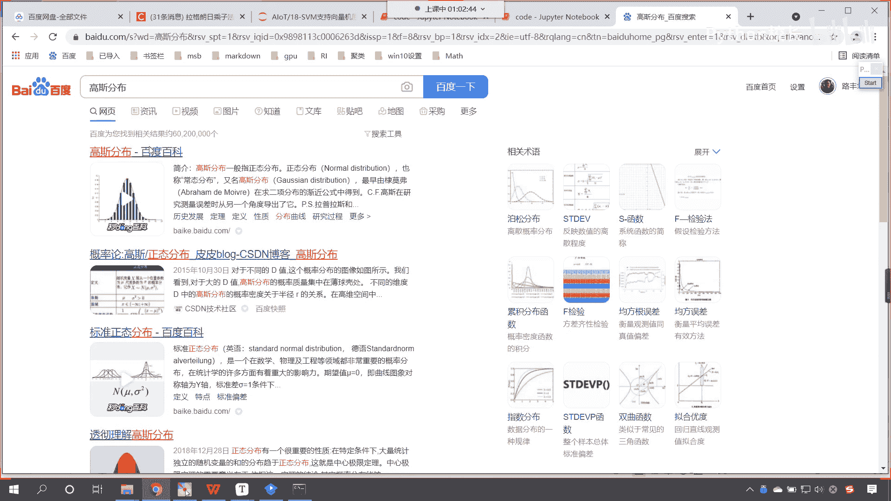

它有相应的这个概率密度的这个计算。

在这儿你就能够看到，你看啊我们这个概率是如何算的，唉你能够看到它的前面是不是一个常量呀，后面是不是ex p看到了吧，e x p，然后负的二的西格玛平方x减mu的平方，你看和咱们公式当中所讲到的。

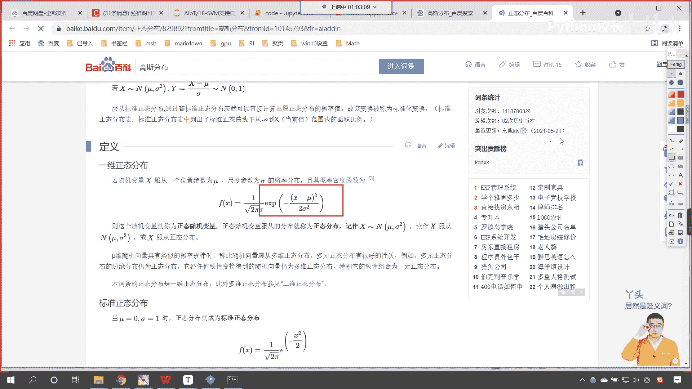

你看一样不一样，这个是不是e x p看到了吗，e e x p这个函数是不是就是e的多少次幂呀，大家仔细观察啊，看啊这里边有一个-1啊，看到了吧，这里边有一个-12西格玛平方，看到了吗。

竖杠竖杠右上角是不是带着一个平方呀，看到了吧，右上角这是带着一个平方的啊，所以说呢这个就是咱们高斯核函数，那我们刚才呢已经在代码当中，咱们是不是进行了相应的展示呀，那啊我们文档当中。

咱们给的事例呢是袁文花的事例，咱们在代码当中，咱们给的示例是不是葡萄酒的示例呀，同时咱们在代码当中还给各位演示了。

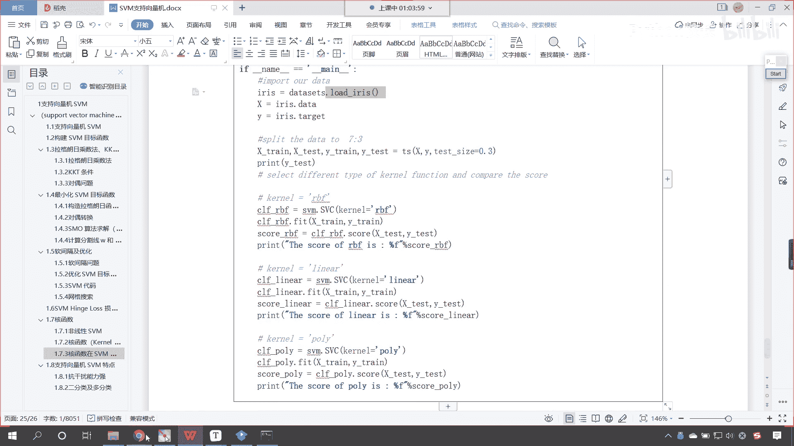

咱们的这个非线性和函数，它的一个应用是吧，对于这样的数据，那我们使用非线性核函数。

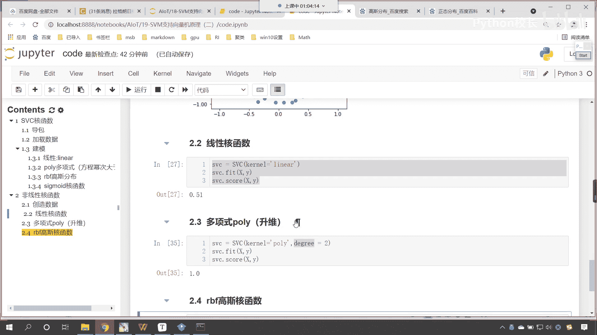

它的效果就比线性核函数要好很多好。

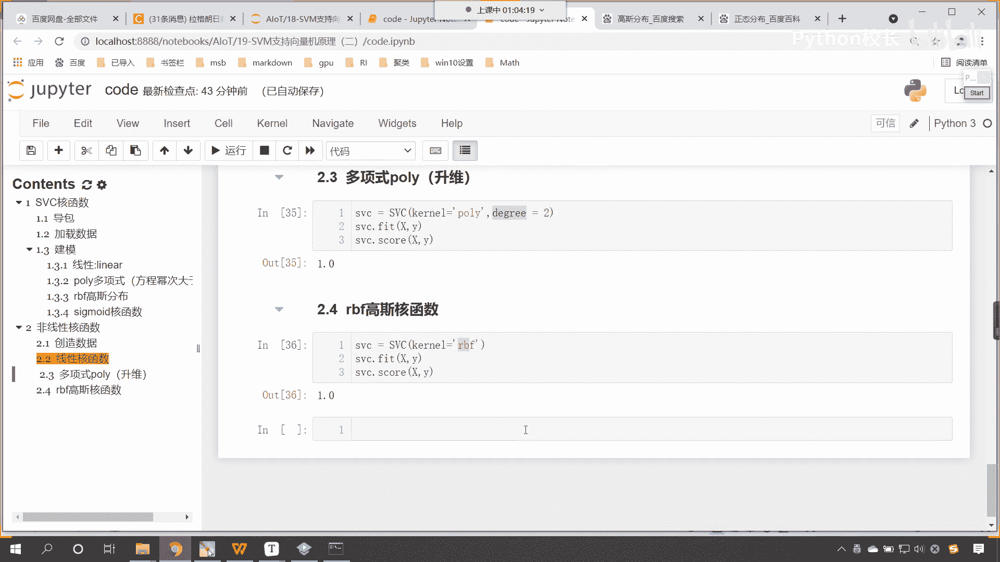