# P126：7-SVR支持向量机回归拟合天猫双十一销量方程 - 程序大本营 - BV1KL411z7WA

嗯之前呢我们是不是介绍过天猫数据呀，对不对，来那么现在的话咱们来一个二级标题，这就是天猫双11它的销量数据预测。

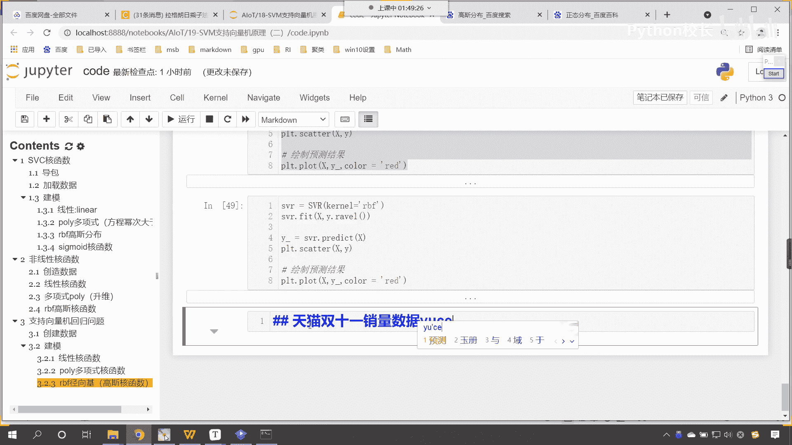

那么我先把这个数据呢先给各位发过去。

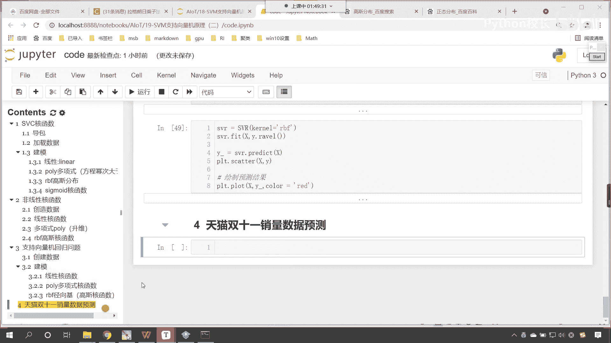

这个数据y呢，就是它的销量放到咱们的讨论区当中来。

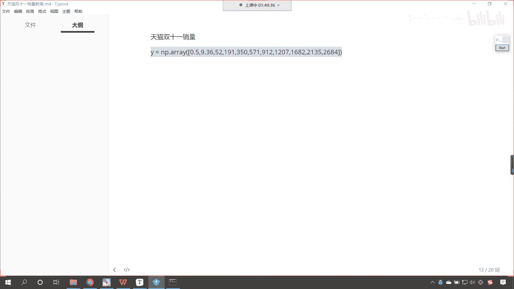

现在的话咱们首先呢创建一下数据，那我们给一个xx就等于np点，咱们调用arrange，2009年开始，一直到2020，左臂右开，2020取不到，我们的年份呢这个绝对数据比较大，咱们现在进行一个操作。

我们都让他减去2008啊，统一减去2008，这个时候x有了，然后我们给一个y y呢，就等于咱们刚才复制的第1年是0。5亿，第2年9。36，2019年呢，它是2684亿，我们画一个图画出来，prt sc。

咱们将x放进去，y放进去看，这个时候我们给一个颜色color，我们让它是red，现在你就能够看到是不是就有这样的一条曲线，那么请问这条曲线好，请问这条曲线是什么样的一个规律呀，我们一眼就能瞅出来。

咱们这个数据它是不是一个，看它是不是一个这个抛物线，对不对，那这个抛物线咱们可以使用二次幂，三次幂都可以进行拟合，三次幂的话它是局部拟合，对不对，你看二次幂，三次幂都可以形成这样的一个拐弯，好。

那么咱们现在呢就操作一下啊，上面x数据咱们是一维的，那我们训练的时候这个数据是可以调的啊，是可以改的来。

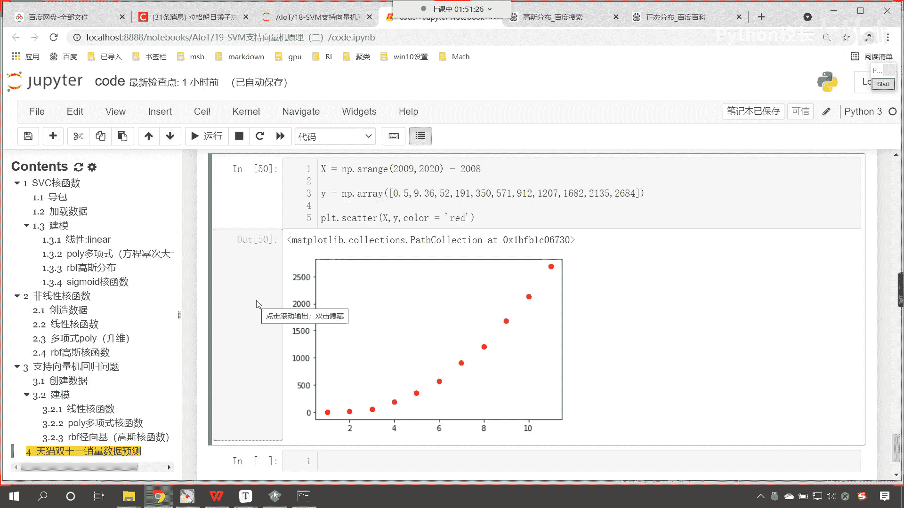

现在的话咱们就操作一下，使用咱们的sv，那svr就等于svr，你想一下这个核函数，咱们如果使用linear，你想一下行不行，肯定是不行的，是不是啊，咱们feat xy x这个时候是一维的。

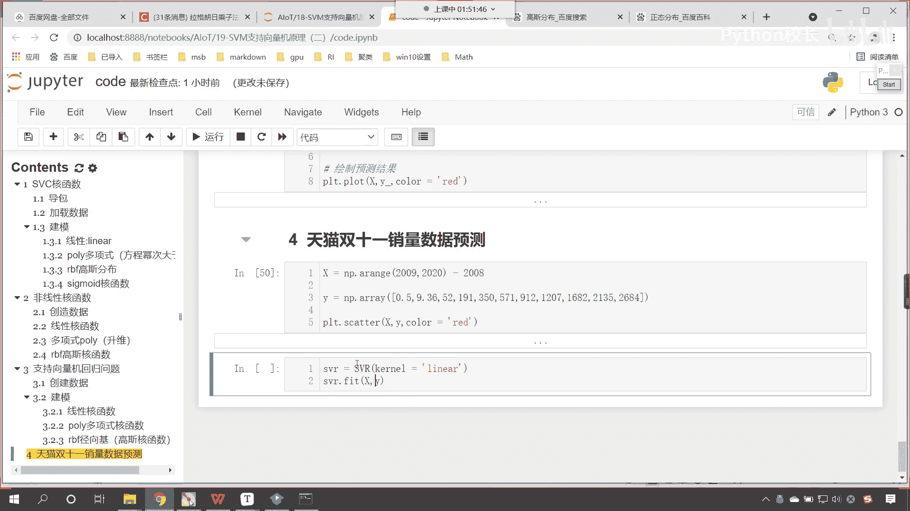

你看我一直行，是不是就报错了，报了个什么错。

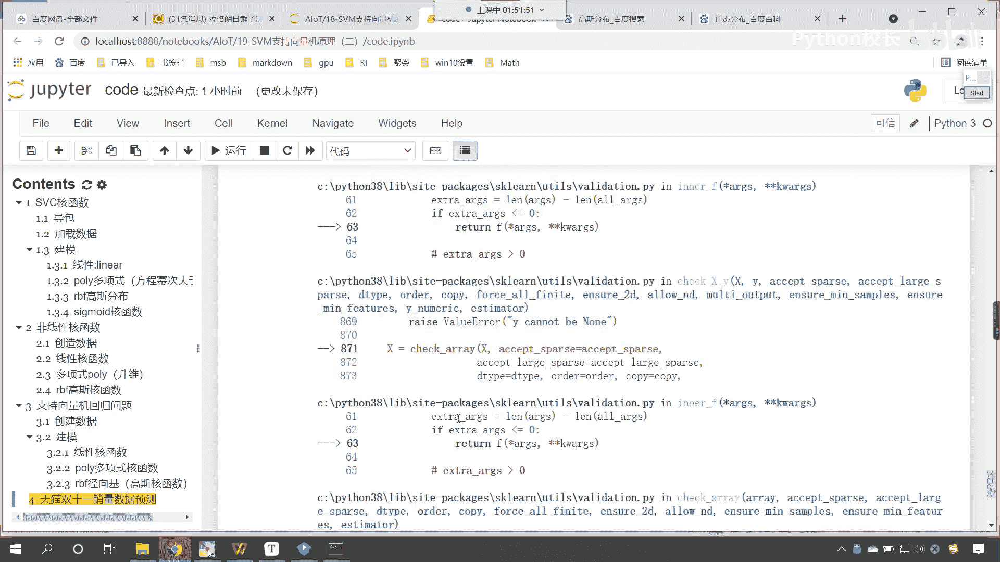

看啊你的expect 2 d瑞，got diarray instead，就是我要的是二维数据，但是你给了我个一维的，你怎么办，reshape-11告诉你答案了吧，以后大家写代码报错了，仔细看他的提示啊。

叫reshape your data either。

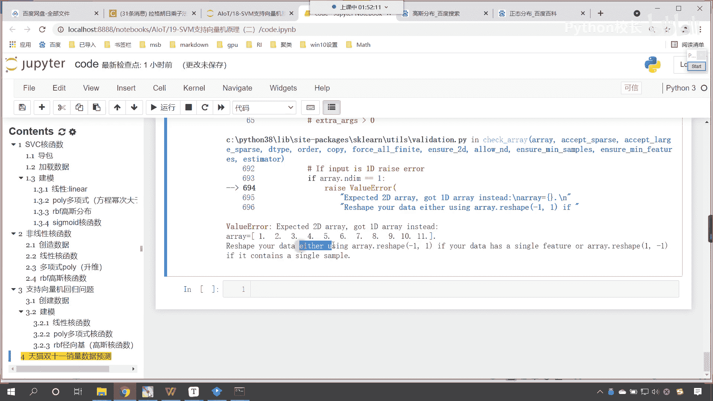

using reshape是吧，那咱们就往上滑，x不是数据不合格吗，咱们根据它的提示，reshape-1和一，这个时候你看我一直想看，下面的是不是feat这个地方咱们调用点reshape。

咱们给一个-1和一，这个时候你看我一执行没毛病，是不是就可以了，好那么接下来呢咱们就预测一下啊，咱们的数据x呢进行了一个操作，减去了2008，咱们使用svr点，我们调用predict。

咱们呢就将这个数据有点稀，你知道吧，一共11个，现在呢我们给他一个x test，在上面插入一行x下划线，test等于np。lin space，我们依然让他从2009到咱们的2020。

那这个line space他在切数据的时候是左臂右臂，所以说咱们也给一个2019，我们把它分成多少份啊，分成100份，然后对它进行一个reshape，那就是-1和一，你看现在我们同样是在这个范围内。

但是咱们划分的份数是不是多了，看咱们划分的份数多，那为什么要划分这么多份儿啊，咱们画图的时候，咱们这个曲线呢它更加的柔和，知道吗，哎所以执行来，现在对于xy的一个数据进行了拟合，那么就会有一个方程。

咱们就使用s v r点对它进行predict，将咱们数据x test放进去，返回一个结果就叫y盖，那有了这个数据之后呢，咱们现在就画图展示一下吧，把上面这个画图是吧，scatter粘贴过来。

然后呢咱们plt。plot，看我要画线，画线的时候，如果你的点不够密集，那你画出来的这个就不够，就不够平滑啊，哎我们用这个词来形容更加准确，是不是好，那咱们就plot一下。

咱们呢就将x下划线这个test放进去，然后y盖放进去，大家注意，此时咱们的x test它是二维的，所以咱们调用什么ral把它变成一维的，这个时候我们给它一个颜色啊，那我们预测值画出来这个颜色。

咱们让它是grin，这个时候你看我一执行，唉，大家现在就能够看到得到的数据是这样的，是不是这个看这个是不是咱们的这些点儿，这个右上角是不是是不是这条线，为什么，因为我们没有减去2008。

现在呢咱们减去2008，统一减2008是吧，执行，现在你看画出来这条线是不是就是这样的呀，因为是因为我们要画直线，是不是啊，所以这就相当于是上边和下边儿取了一个平均，是不是这个线就是斜着的。

很显然效果不好，那我们再来来我们复制一下ctrl c，咱们在这儿来一个粘贴，我们把这个linear是吧，我们给它改成r b f。

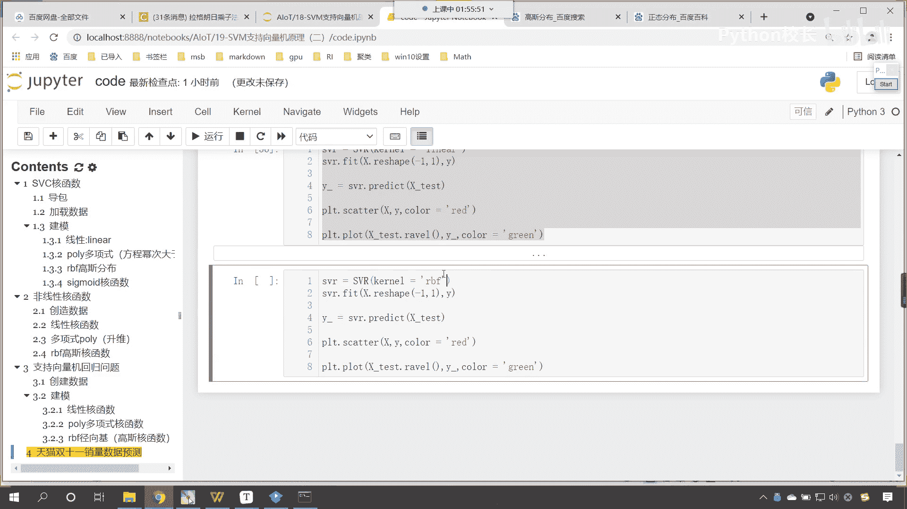

唉现在你来看改成rbf，这个是不是就是高斯核函数呀，也不行，看到了吧也不行。

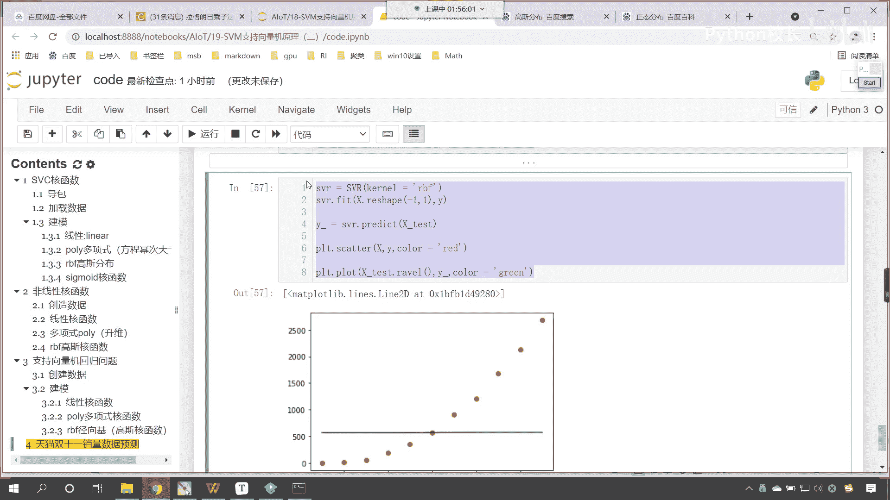

然后再来复制一下好，那我们知道之前我们解这个方程。

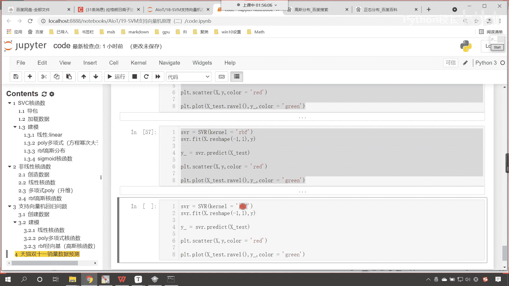

咱们知道它是一个多项式，现在你看我使用这个多项式，你看效果是不是一下子就好很多了呀，看到了吧，此时的这个效果一下子就好很多了，那这个里边的参数呢咱们是可以调的啊，好我们可以调谁呢，可以调咱们的。

咱们可以调咱们的这个扣一，看到了吧，可以调扣100。

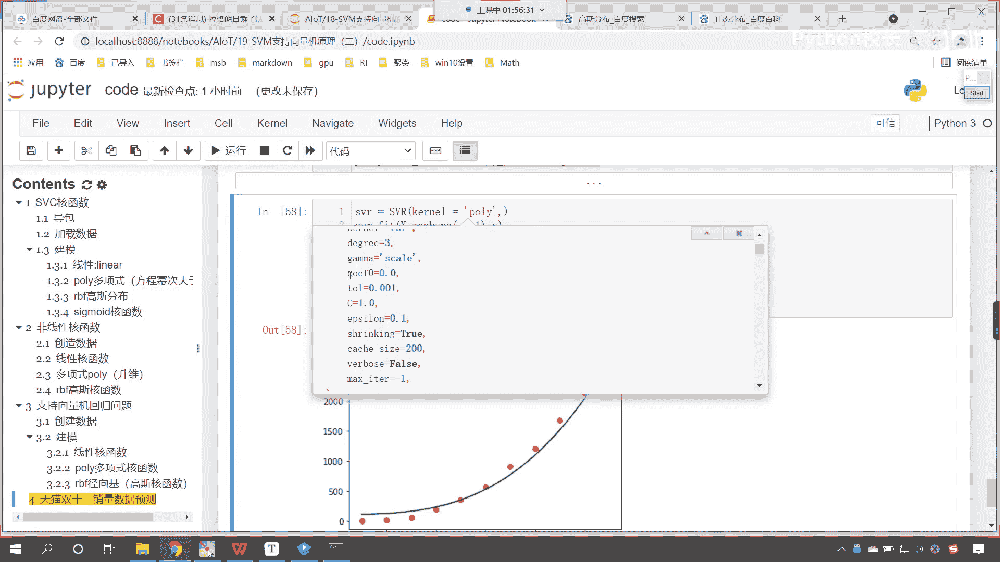

那个扣一零表示什么，回到咱们的课件当中，你看这个多项式回归看到了吗，多项式和函数，你能够看到这个里边是不是有一个c呀，现在我们已经知道这个d表示什么了，这个d是不是就表示它的幂次呀。

那这里边还有一个c呢，这个c表示什么，这个c呢是不是就是表示咱们的截距呀，看到了吧，这个c是一个常数，阿尔法呢是不是也带了一个系数呀，来回到咱们代码当中。

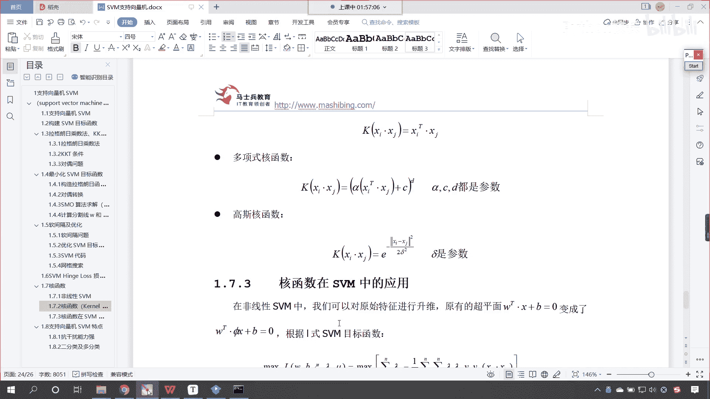

咱们对它进行一个调节啊，来回到代码当中，你看这里边就有一个这个call if，那我们就调一下咱们的call if，来ceo call if 0，咱们给一个200执行一下。

现在你能够发现我们调整call if的时候，这条线拟合的效果是不是就很好了呀，原来这个扣一是零，我给你看一下啊，你不写。

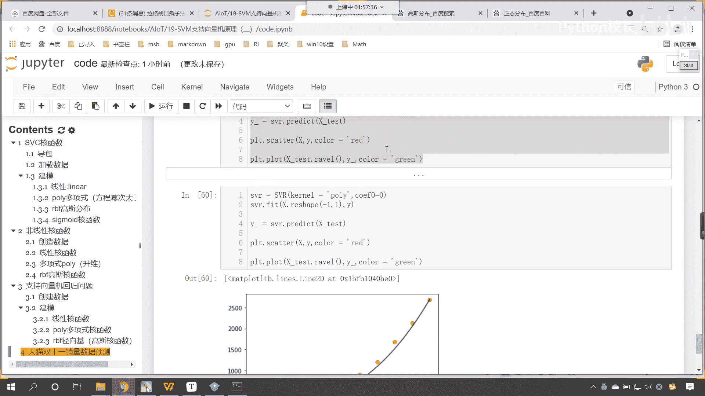

默认它就是零，现在你能够看到，如果要是零，咱们拟合的效果是不是就不是特别好呀，你看这几个点是不是就下边这三个点。

是不是就这条线没有经过他，那我们调整call if给它是200。

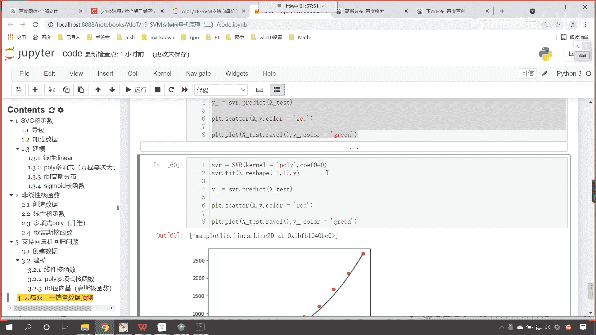

这个时候你看我一直行，你看结果是不是就拟合的比较好了呀。

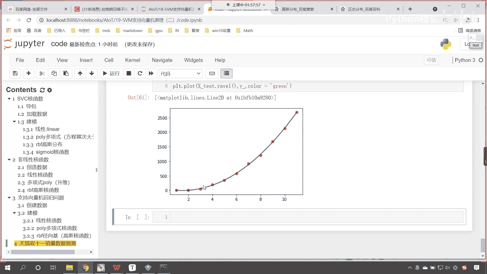

对不对，看到了吧，所以说呢嗯咱们svr是吧，它不同的核函数它其实是用于解决不同的问题。

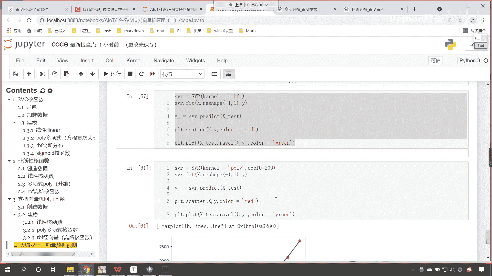

好那么我们对于每一个函和函数，咱们找一下他的q if看啊这个是线性的。

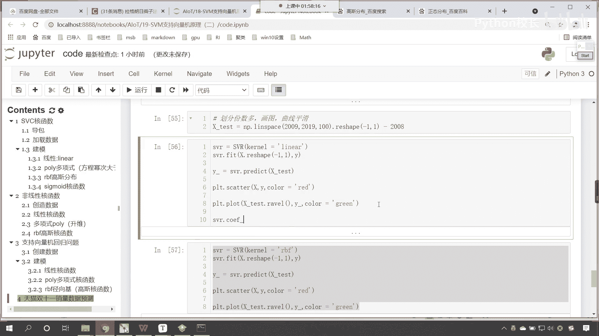

你看我一直行，咱们是不是能够找到它的扣一呀，看到了吧，是30，那么对于高斯核函数，咱们能不能找到他的q if呢，你看一直行，是不是就报错了，没有啊，那多项式呢也没有，知道吧。

你看啊执行一下s v r点扣if，你看一执行也报错了，他说只有咱们的核函数是线性的时候，咱们呢才存在才存在咱们的这个系数，所以说呢这个是没有的，ctrl加反斜杠把它注掉。

上面也是ctrl加反斜杠注调是吧，再执行，这个时候这个就会画出来，这个就会画出来图形了。

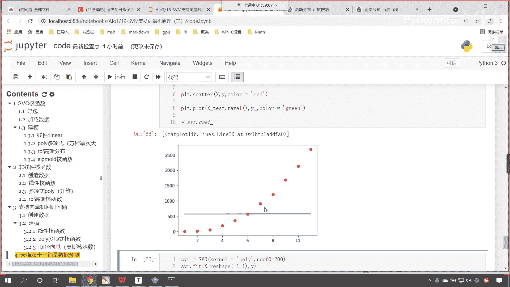