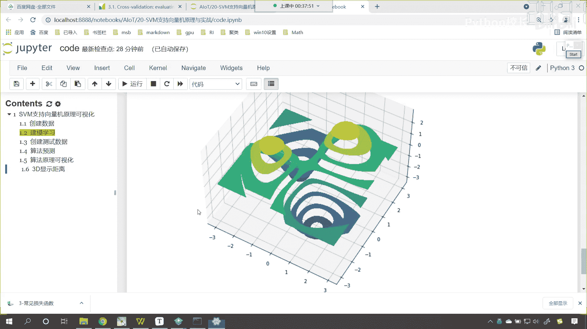
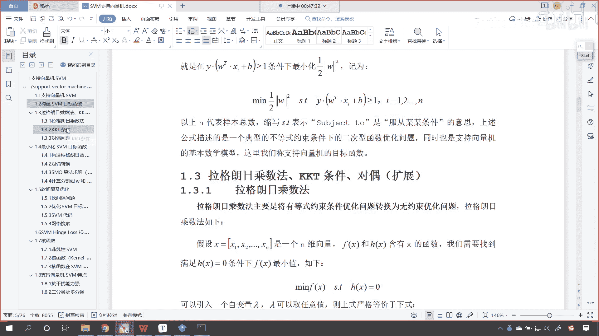
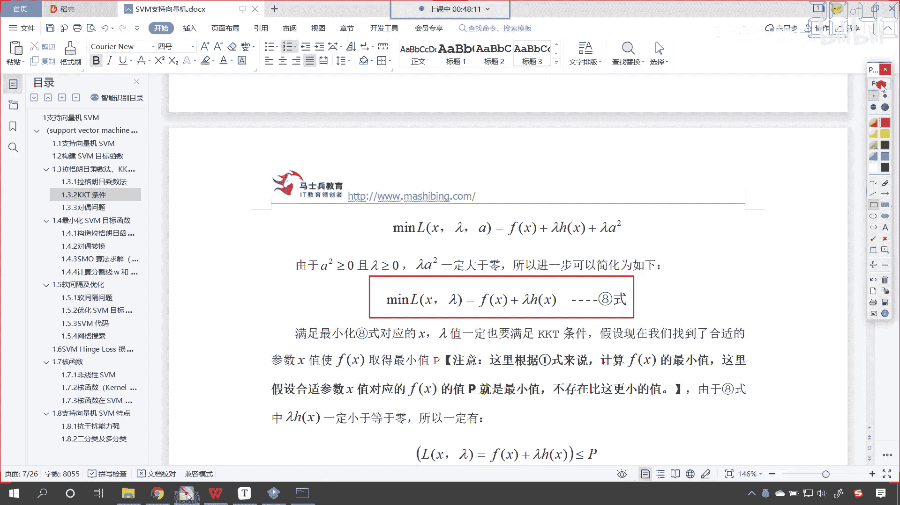
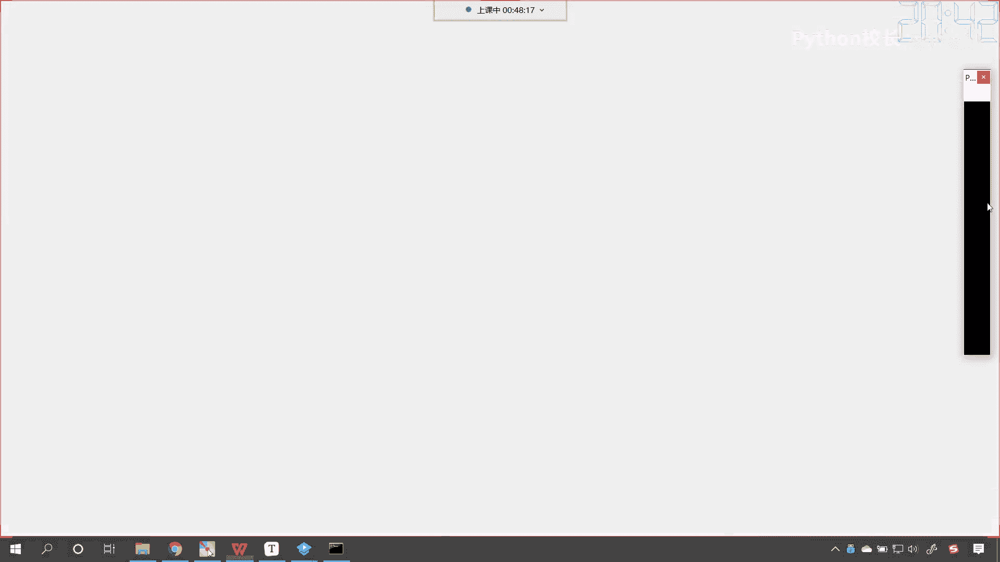
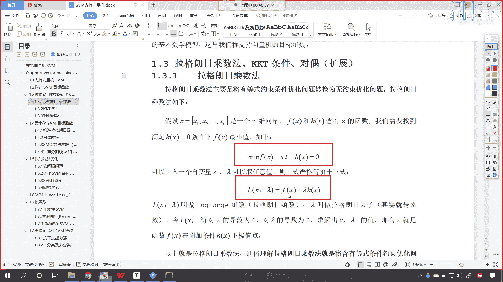
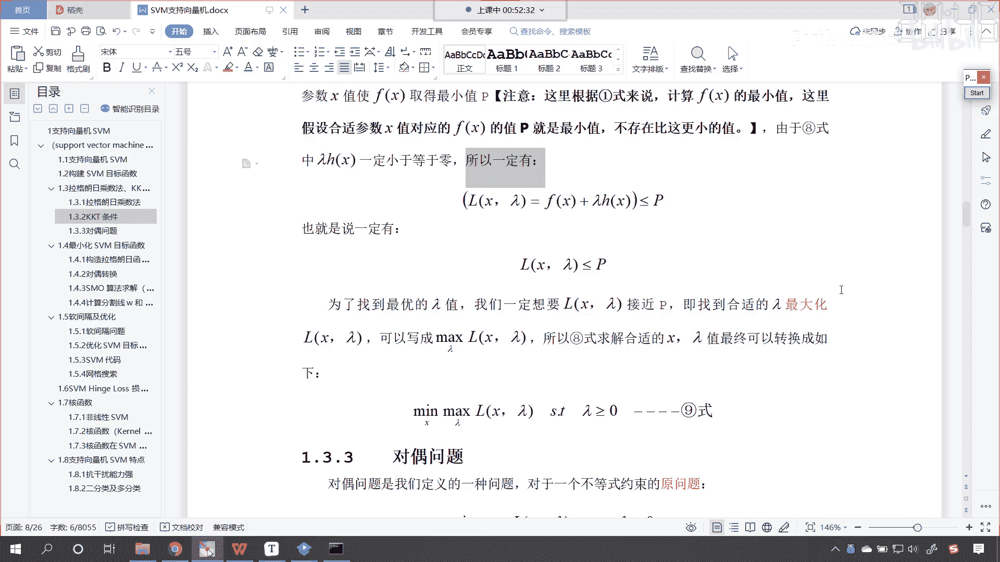

# P128：2-SVM支持向量机KKT条件详解 - 程序大本营 - BV1KL411z7WA

好那么我们写了写了一部分代码了，接下来我们就看理论啊，嗯在上一节课咱们讲了著名的kk t条件，对不对是吧，我们讲了著名的kk t条件，也就是说我们的约束条件，无论是等于也好，还是大于等于也好。

无论它是等式约束也好，还是不等式约束也好，我们都可以对这个问题进行一个求解，那么根据咱们上一节课，我们对于不等式约束的一个呃，一个这个变量的添加，我们添加了阿尔法，那么它就变成了等式约束，对不对，好。

我们给它加上这个阿尔法的平方，它就变成了等式约束，到了这儿之后呢，咱们呢就继续往下走，各位你就能够看到，那么其实我们是不是就是最小化，咱们这个损失函数呀，这里的l它往往表示损失啊。

看这里的l它就表示损失，那就是x拉姆达阿尔法，那就是fx加上拉姆达hx加阿尔法的平方，那么我们上一节课已经说明了，咱们这个拉姆达怎么样是大于等于零的，对不对，看了吧，它呢是大于等于零的。

那么我们对于上对于上述的公式呢，咱们进行一个拆分，是不是就变成了fx，你看他呢就变成了这种形式，看到了吧，你把它乘开，是不是就变成了朗姆达h x，加上朗姆达阿尔法的平方呀，因为因为阿尔法的平方大于零。

拉姆达的平方，拉姆达大于零，所以说这个拉姆达乘以阿尔法的平方，一定是大于零的，这个没问题吧，所以咱们进一步化简呢，我们就可以把上面这个数值呢给它去掉对吧，因为我要我要求这个最小值。

而你上面这个一定是大于零的对吧，所以说我就可以把这个数据呢给他约掉啊，看到了吧，对不对，因为你是一定大于零的，你想你加了一个大于零的数，对于我求最小值有关系吗，是不是没有关系。

也就是说你加上这个朗姆达阿尔法的平方啊，你想一下看啊，这这个数一定是一个正数，对不对，看到了吧，这个数一定是一个正数，对不对，这个数一定是一个正数好，那么假设说啊看啊，假设说咱们现在看这是一个嗯。

那这个点是是最小值点，那你想如果这个函数它统一加上了一个，看他统一加上一个正数是吧，比如说它往上挪了一点是吧，假如他往上挪了一点，我们往上挪啊，看咱们假设说它往上挪，那你想他加了一个正数。

它是不是向上平移，往上挪了呀，对不对，你看那我们求解出来的这个横坐标的值，你看是不是还一样呀对吧，因为你只是整体向上挪了，当我在求最小值的时候，你看我求的是谁啊，我求的是x看到了吧，我求的是横坐标。

你你纵坐标整体向上移，所以说对他没有影响，所以我们可以怎么样，哎咱们就可以把这个给他约掉啊，好咱们就可以给他满足，把这个给他约掉好，那么到现在呢我们就我们就得到了80，看满足最小化巴士对应的x拉姆达。

一定也要满足kk t条件，对不对，你看啊，我们之所以能够写成上面这个公式，是不是就必须满足kkt条件，看假设我们找到了合适的参数，x fx取得最小值p看到了吧，我们现在呢我们就假设最小值是p。

你想这个最小值一定是存在的，对不对，是不是也就是说看啊，那不存在比这个更小的值了，因为我们就令它是最小，所以说就不存在比它更小的值了，对不对，是不是啊，那么由于巴士拉姆达h看。

由于咱们巴士拉姆达h呢一定是小于等于零，所以说呢所以说一定有下面这个公式，看一定有下面这个公式，为什么朗大h小于等于零，看为什么这个兰姆达h小于小于等于零呢，因为kk t条件呀，你往上看看到了吗。

往上看看到了吧，这个h x小于等于零，朗姆达h等于零，朗姆达h x等于零，这个朗姆达是大于等于零的，是不是，所以说咱们的看，所以说咱们得到的这个结果啊，所以说咱们得到的这个结果啊。

所以咱们h x是小于零，小于等于零的，而咱们的兰姆达是大于等于零的，他俩如果要相乘，看他俩如果要相乘，它是不是小于等于零呀，对不对，所以呢我们刚才定义的fx这个目标函数，也就是说我们的损失函数。

我们令它的最小值小于最小值小于p，而咱们的lx拉姆达嗯，他呢就等于fx加上拉姆达h x，所以说你看你加了一个负数，加了一个小于等于零的值，所以说小于等于p，你看这个是不是成立的，看到了吧。

小于等于p成立的，没问题吧，也就是说一定有l x拉姆达小于等于p，看啊存在这样的一个这个公式，因为我们的损失函数当中有x有朗姆达，那么为了找到最优的朗姆达值，我们一定要使看，为了找到最优的朗姆达值。

我们一定要使l x拉姆达接近p，也就是说你越接近于p，当你等于p的时候，是不是说明咱们就找到最优解了，看到了吧，为了找到最优的拉姆达值，我们一定要想想方设法，让咱们的lx拉姆达接近p。

既找到合适的拉姆达，最大化咱们的这个l x拉姆达，你要注意啊，这个拉姆达是咱们拉格朗日乘子，也就是说我们像咱们原来的方程当中，咱们多引入了一个系数，就是朗达，所以我们要写成什么呀。

所以我们要写成看到了吗，max拉姆达，lx拉姆达，那这个时候你看怎么就变成求最大了呢，看这个时候怎么就变成求最大了，因为我们想要求解x其实咱们是分步求解，是先求拉姆达再求x你要注意啊。

这个x和拉姆达是吧，它是分开的啊，所以咱们巴士求解合适的x和拉姆达值，最终可以转换成如下公式，看最终可以转换成如下公式，我们先找到合适的拉姆达，这个就是拉格朗日乘子，使咱们里面这个方程让它最大啊。

让里面这个方程最大，你里面这个方程最大啊，里面这个方程最大，是不是就是一点一点接近这个p呀，然后呢再怎么样mix让我们的这个方程，让咱们这个关于x的这个损失函数让它最小，那听到这儿。

各位小伙伴有可能这个有点迷糊好，那么咱们再往上啊，我们看一下咱们所构建的损失函数，看咱们现在呢看一下咱们的损失函数，现在你就能够看到，你看这个是不是就是咱们的损失函数呀，看到了吧。

是不是咱们的损失函数我们期望怎么样，咱们是不是期望它越小越好呀，看来我们希望这个me是不是越小越好，对不对啊，那这个其实就对应着咱们的看到了吧，这个m2 分之1w，它呢就对应着咱们刚才所写到的这个fx。

看它就对应着这个fx，但是这个方程呢是在有约束条件下的方程，你没法直接求，知道吧，没法直接求，那所以我们才会怎么样才会有拉格朗日乘子法，才这个拉格朗日乘子法是等式约束，现在呢你看这个上边是不等式约束。

对不对，看到了吧，上面是不等式约束怎么办，想要把不等式约束进行拉格朗日乘子的转换，那么你就必须满足kk t条件，那满足kkt条件之后，看满足kk t条件之后，我们怎么转化了，咱们往下滑。

看满足kk t条件之后呢，你看咱们怎么进行了一个转化，往下滑啊，你看我们是不是就得到了巴士呀，看到了吧，咱们就得到了巴士，那得到的这个巴士，你能够看到这个里边我们写方程，咱们是写成了fx。

你要注意这个fx是不是就是要求咱们呃，方程当中这个系数w呀，对不对，那看到了吧，我们为了方便我们把它写成了这个fx，看写成了f x，因为这个是根据拉格朗日乘子法。

咱们来的，因为你看拉格朗日乘子法是什么。

看它叫mf x s。t h x等于零，看到了吧，他是这样，那根据拉格朗日乘子法，咱们就可以写成这样，叫做l x逗号兰姆达等于f x加上拉姆达h x，你根据这个你就可以求解出来这个x的最小值。

那么这个里边的fx就相当于什么，你看这个里边的fx是不是就相当于咱们这个呀，看到了吧，他和这个fx你想一下是不是等价的，看到了吧，他俩是等价的，只不过我们在进行公式推导的时候。

咱们统一就用fx来表示了哈，大家明白吗，所以说呢看所以说咱们的k k t条件，我们经过转换之后是吧，咱们就得到了80啊，就得到了巴士，那么得到这个巴士呢，他说你这个fx求最小值。

你是加了一个朗姆达h x，对不对，你加了一个朗姆达h x，那你加的这个兰姆达h x呢，它是小于等于零的，所以呢就一定有fx加上拉姆达hx小于等于p，因为我们规定了是吧，咱们fx取得最小值p是吧。

我们就规定它的最小值是p，所以说存在这个小于等于这个等式，那么我们方程当中呢，看咱们的方程当中，这个新的方程咱们是构造出来的，大家注意啊，这个损失函数lc塔啊，这个lx拉姆达是我们构造出来的。

由两部分组成，一个呢是这个fx，另一个呢是朗姆达这个h x，那么我们得到了这样的一个看，得到了这样的一个公式之后呢，我们说为了找到最优的朗姆达，我们一定要想。

我们一定想要咱们这个l theta是不是接近p啊，你如果等于p，你看你如果等于p说明什么，说明咱们所求解的fx是不是就是最小值呀，对不对，你看你等于p呢，就说明它就是我们的最优解。

所以说呢咱们想要找最优的拉姆达，我们一定要让这个l x拉姆达接近p，因为它小，所以说这个时候呢咱们就希望它怎么样呢，沿着朗姆达的这个方向让它一点一点变大，变到什么呢，和p一模一样，这个时候呢就最好了。

既找到合适的拉姆达，最大化咱们的l x拉姆达，那么既然是最大，我们就可以写成什么样，但既然最大，那么那么我们就可以写成max，看到了吗，就是这一部分对于朗姆达这一部分，咱们希望他越大越好，越来越靠近p。

所以咱们巴士求解合适的，看咱们上面那个巴士求解合适的x拉姆达，我们就可以写成如下这种公式，看到了吧，那这个是什么意思呢，就是对于咱们的函数l x拉姆达，我们先我们先沿着拉姆达的方向求它的最大值。

然后求完之后，其实就相当于固定了朗姆达，固定了这个拉格朗日橙子，那你想这里边是不是还有咱们的啊这个x呀，然后我们再去求什么好，然后呢咱们再去求咱们的这个x，也就是说先求最大，先沿着朗姆达。

我们把其他的都当成咱们的常量，先沿着朗姆达的方向让它最大，你即使最大，你是不是也只能到咱们的这个p呀，对不对，最大也只能到p，那到了p之后，说明这个拉姆达就合适了，那接下来我们再分步去求解咱们的x。

让它一点一点降低是吧，最后的这个条件，限制条件就是朗姆达大于等于零，那当然还包含咱们的k k t条件啊。

