# P129：3-SVM支持向量机对偶问题转化 - 程序大本营 - BV1KL411z7WA

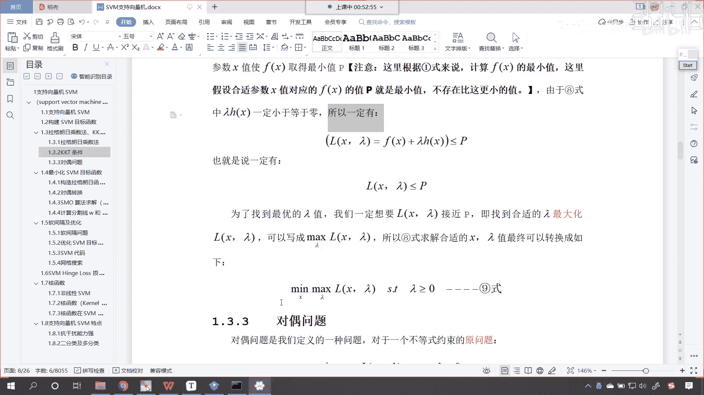

好那么得到了这个之后呢，它不太好求，因为你先求先求这个拉姆达的最大值不太好求。

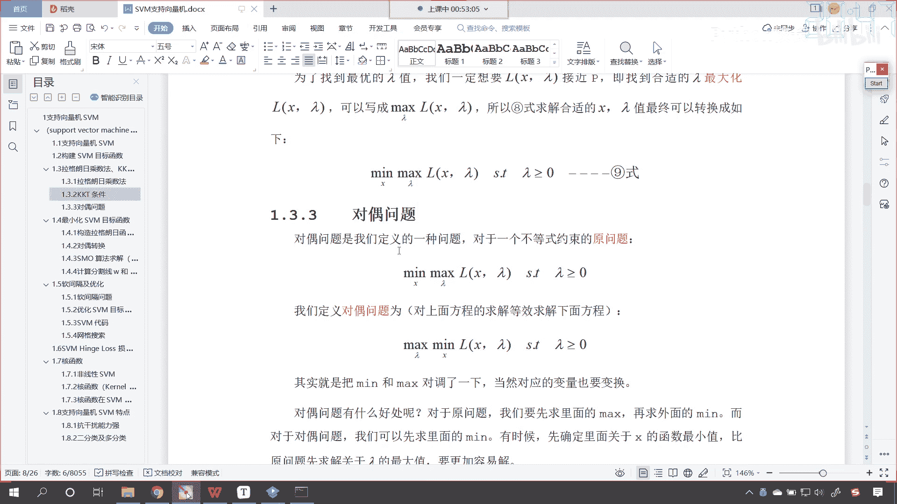

那么我们现在定义一个对偶问题，那这个对偶问题你看一听都有问题，咱们就感觉这个好高大上呀，是不是，那啥是队友问题呢，它其实就是一个定义，你看咱们上面是不是得到了九式呀，看到了吗，我得到了九式，对不对。

那我怎么样呢，你里边是max，外边是me，我把它对调一下，看到了对调一下max拉姆达mx这个就叫对偶问题，也就是说都有问题，我求下面这个方程，求下面这个方程求解起来更简单，因为先求最小是吧。

咱们求导数就可以了，然后再求max，那下面这个更简单，求上面这个唉它就复杂一点，那现在你想一下，那这两个方程，你看我们把它反过来是吧，me max反过来这样写成立吗，看到了吧。

这就相当于把他们对调了一下，能不能对调呢是吧，那这个就是对有问题啊，啊那下面呢在队伍问题这个里边儿。

唉我们就介绍了一下，我们这样写是可以的，数学上呢是可以证明的，我们把咱们通过kkt条件推导出来这个方程，我们把它叫做圆问题，我们把max和min颠倒过来，我们把它叫做对偶问题。

有的时候这个原问题不好求解，那对偶问题呢唉容易求解，你看啊，对于原问题我们是对于原问题，我们是先求里面的max，再求外面的me，而对于对偶问题，我们是先求里面的me是吧。

那有时候呢，咱们先确定里面关于x函数的最小值，比原问题先求解，关于兰姆达的最大值更容易求解，那么这个呢咱们也不做证明啊，我的水平有限，我也没有办法证明啊，大家知道就行，以后你出去进行面试的时候是吧。

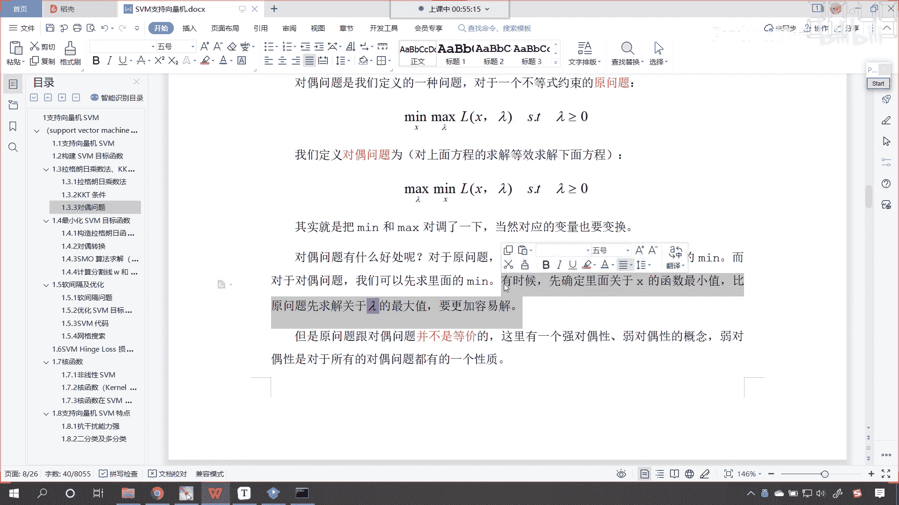

你讲到这一层也就可以了，好那么但是原问题跟队友问题并不等价。

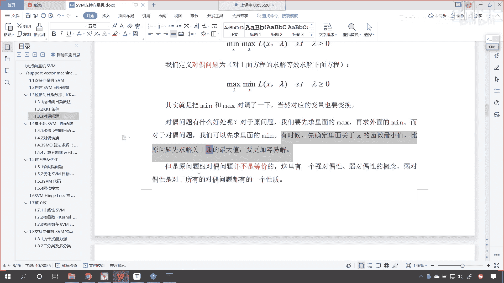

就是说你你原来是里边是最大，外边是最小，现在你外边儿最大，里边最小。

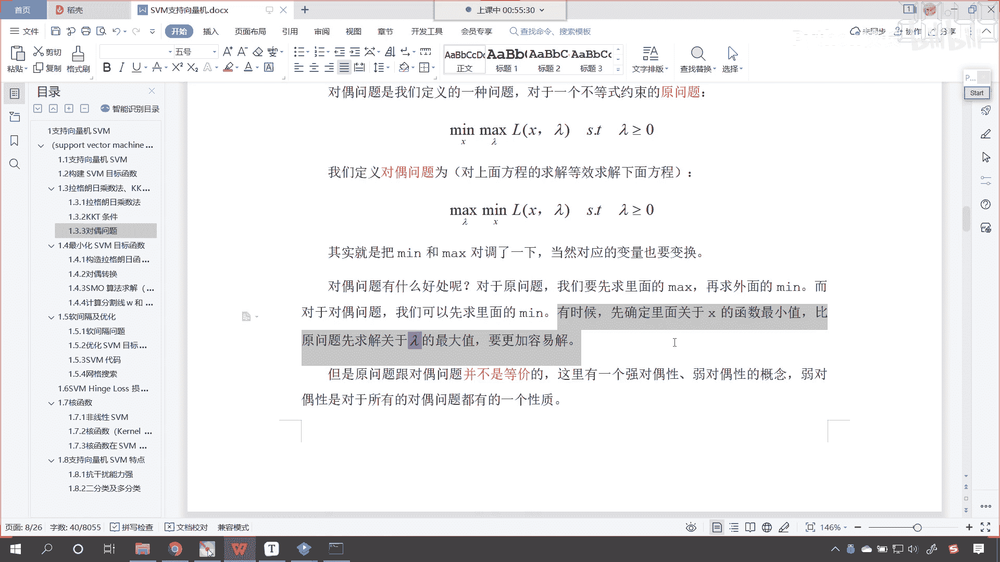

它俩等价吗，那么这个里边呢有一个强对偶性，弱对偶性的概念，弱对偶性对于所有的队伍问题是吧。

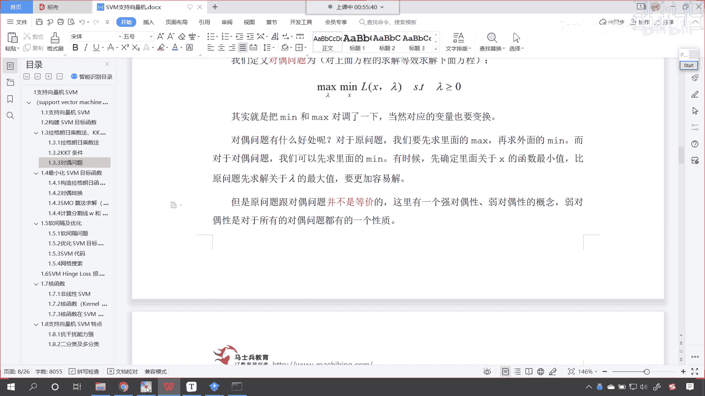

这个弱对偶性对于所有的都有问题，都有一个性质，看就是下面这个性质，我们先说弱对偶性啊，啥是这个对偶性呢。

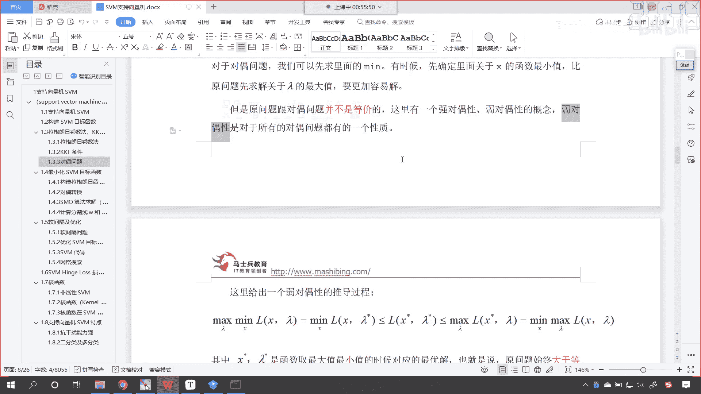

啥是强队友呢，这个强队友呢就是你转换之后求解，得到的答案完全一样，这就叫强队友，你这个弱队友呢，就是你翻转之后求解出来的结果不太一样是吧。

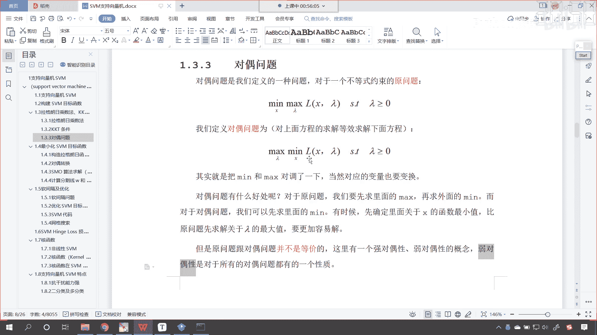

这就叫做弱队友，那我们看一下啊，弱队友对于所有的队伍问题都有一个性质。

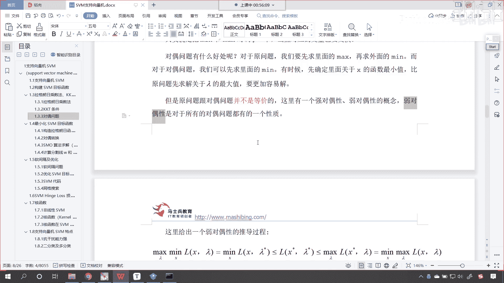

是什么样的性质呢，看那么你看它有一个我们原问题呃。

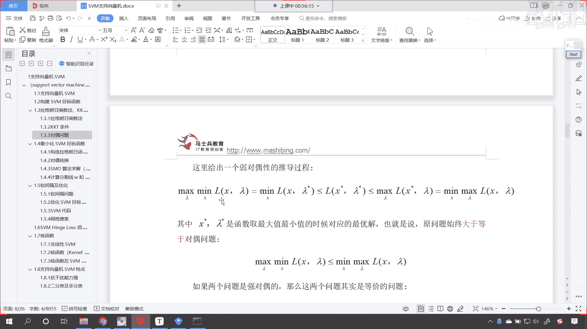

呃大家看一下啊，这个后面这个mix max拉姆达，这个是不是咱们的原问题，那么右边是圆问题，左边是咱们的队伍问题，那么我们队伍问题，它呢是小于等于小于等于咱们的圆问题，那为什么是这样呢。

那为什么是这样呢，看啊对于x星号和拉姆达星号，那这个表示什么呢，是函数取最大值最小值时对应的最优解，也就是说我们把拉姆达星号啊，咱们将拉姆达星号带到咱们这个方程当中，我们所求解出来的。

然后咱们将这个拉姆达星号带进去，那么我们所求解出来的啊，咱们所求解出来的就是它的这个最大值，那看这个星号呢就是最优解嗯，星号就是最优解，那这个地方也是以符号来表示啊，这个地方也是以符号来表示。

也就是说原问题呢始终是大于等于对偶问题，那为什么呢，看啊下面呢我们会有一个这个说明啊。

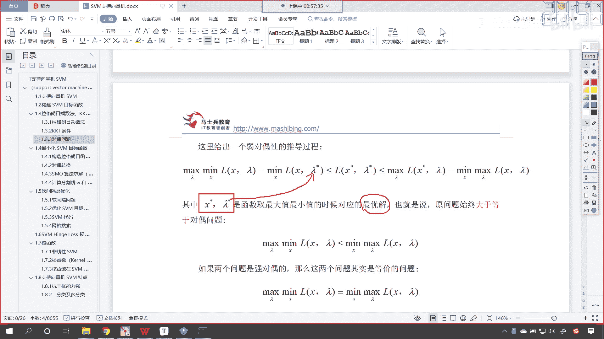

如如果咱们的问题是强队有，那么两边就完全相同是吧，那为什么会是上面这个公式呢，为什么是这个队伍问题，它是小于等于小于等于呢。

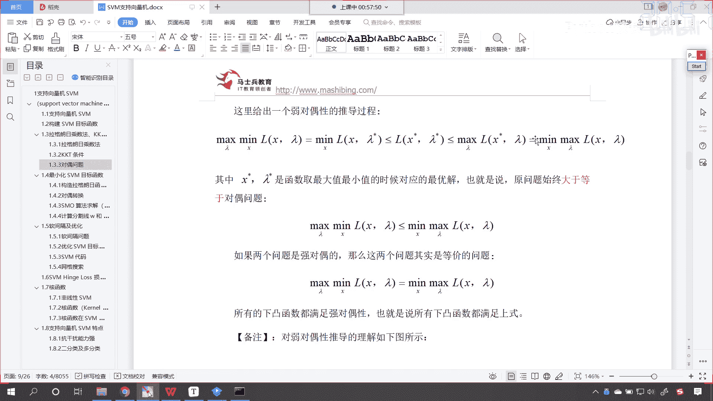

唉咱们看一下它的这个推导过程啊，啊我们不用看推导过程，咱们你想一下就行了，你看我们现在呢是不是有有一些点呀，咱们上面这个公式是吧，从两侧我们从左侧来看，你看啊拉姆达值合适的情况下。

咱们是不是就看朗姆大值合适的情况下，咱们是不是就找到了这个最小值呀，看拉姆达值合适的情况下，咱们就找到了最小值，那这个是什么意思呀，就是从一堆小的当中，我们呢找到最大的值，看到了吗，因为你看你能够发现。

看我们里面是不是在求最小值呀，看到了叫做me，那么你外面有一个max，这个表示什么，是不是从一堆小的当中咱们找最大值呀，你看你max我们把这个当成一个整体，是不是就相当于从一堆小的当中找最大值。

那从一堆小的咱们就排吧，排排排排排，你看到这之后是吧，是不是我们就找到了，那么中间这个咱们就相当于从一堆小的当中，我们就找到了最大值，因为你看啥叫max呢，max是不是说明它最大，对不对。

那所以说就是从一堆小的当中咱们找见最大值，那我们从右侧看呢，看了咱们从右侧看，你现在就能够发现啊，也就是说x值合适的情况下，看x值合适的情况下，咱们找到了最大值，看这个呢是从一堆大的当中。

咱们是不是找最小值呀，你看你看啊，从一堆大的当中找最小值，因为你就就能够发现，你看这个符号，咱们是不是max呀，看了mix，你mix后面跟的这个叫什么，看后面跟的这个是不是叫max啊。

后面这个就跟着这个是max，那就是从一堆大的当中找什么找最小值，所以说你看中间这个，它就是从一堆大的当中找了一个最小值，就是从这一堆大的当中我们找了一个最小值，那么从一堆大的当中找了一个最小值。

所以说咱们就所以说咱们的这个关系呢，看他就是从小到大。

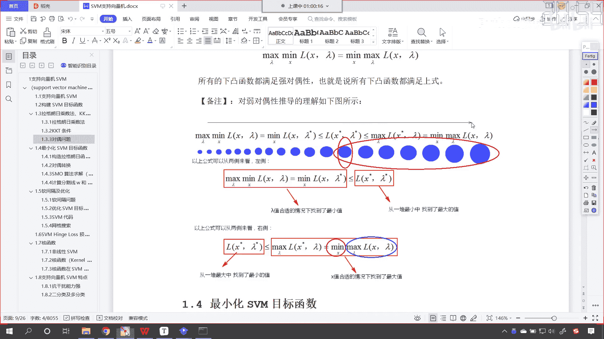

那么我们这个队有问题。

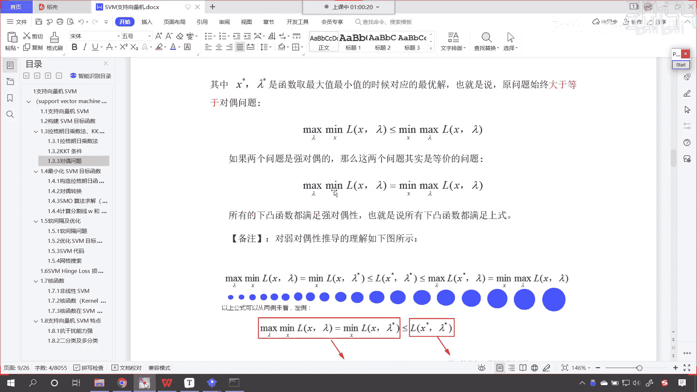

看看咱们的这个队友问题呢，那么就是呃都有问题，它小于等于咱们的这个圆问题呃。

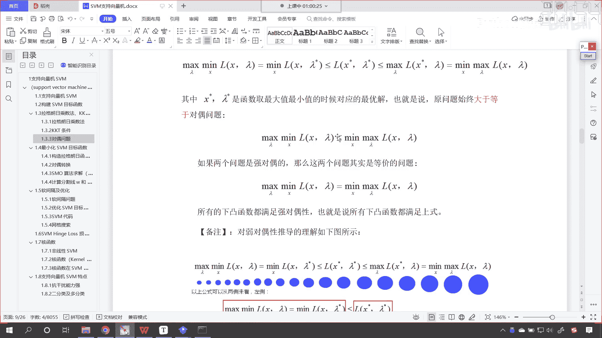

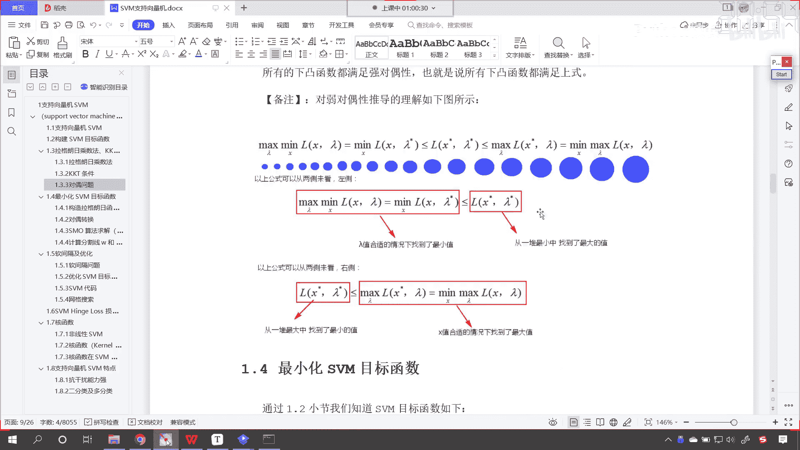

所以说呢咱们可以通过队伍问题，将咱们的原问题来进行一个转化啊，通过它来进行一个转化，那因为我们的这个队伍问题看到了，因为咱们的队友问题，是不是比咱们的原问题小呀，看到这个问题比咱们的原问题小。

所以你想我们所求解出来的这个x，是不是和咱们的原问题也是一点一点趋近呀。

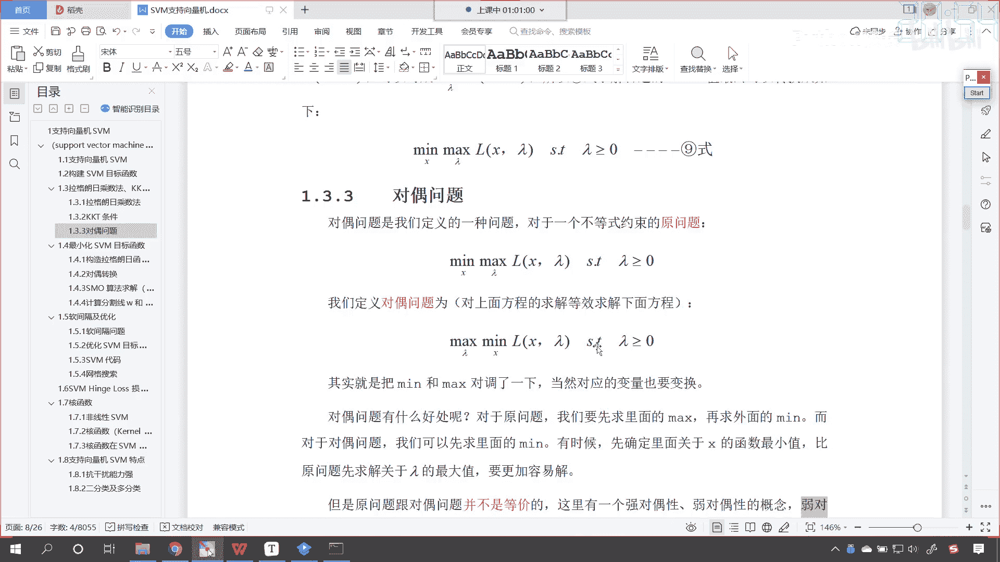

对不对，你看就是说咱们的这个，那我们在最终呢咱们都是要去求解谁呀，哎最终都是要去求解它是吧，你这个原问题呢是从一堆大的嗯，找咱们的小的，我们的这个队伍问题呢是从一堆小的，找咱们的大的，最后都怎么样。

殊途同归，看最后呢我们所求解的这个最优解，他们呢是一致的，这个呢就是咱们的这个对偶问题啊。

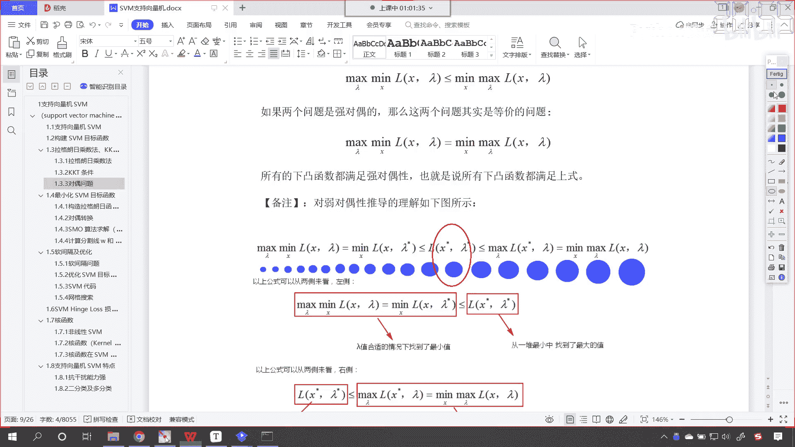

就是在对有问题这个地方。

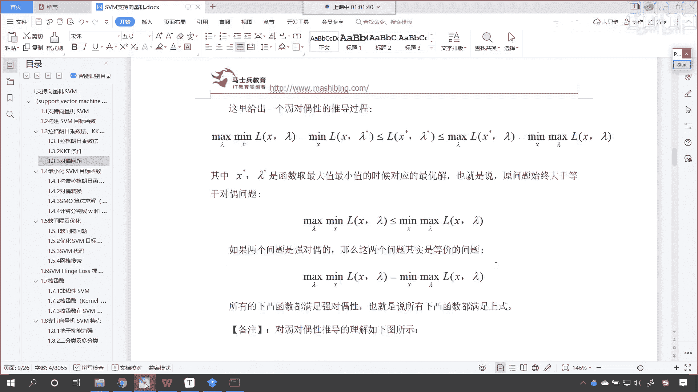

我们就介绍了一下，我们原问题为什么可以写成对有问题。

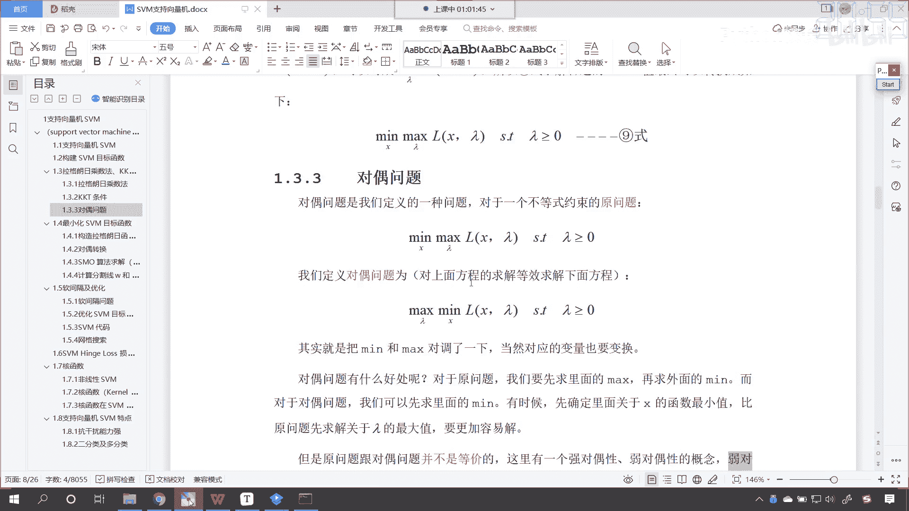

因为呢嗯它有这样的一个这个小于等于的。

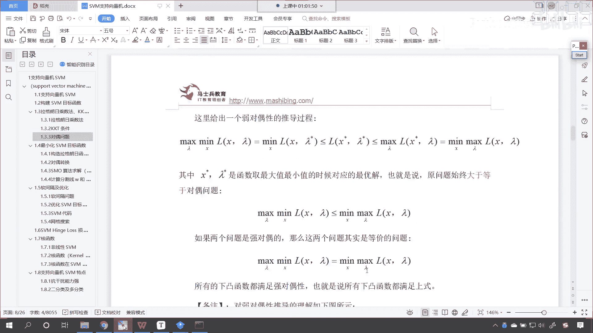

这样的一个关系，那我们将原问题写成对。

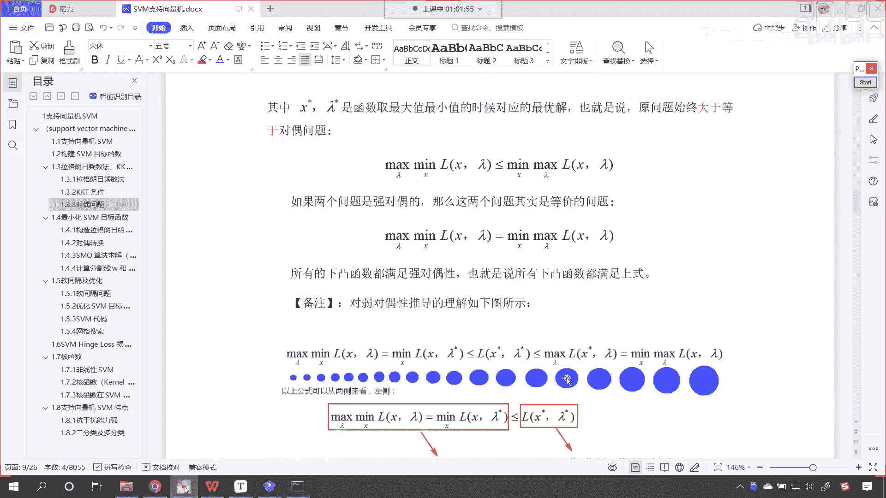

有问题之后。

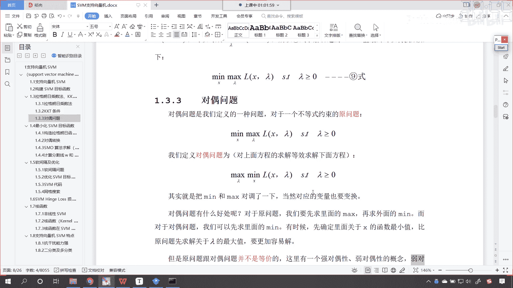