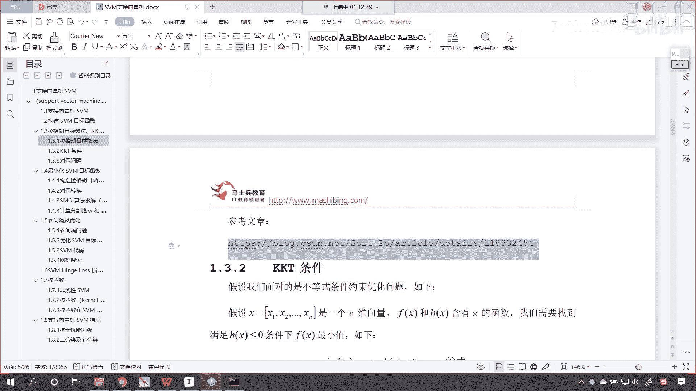
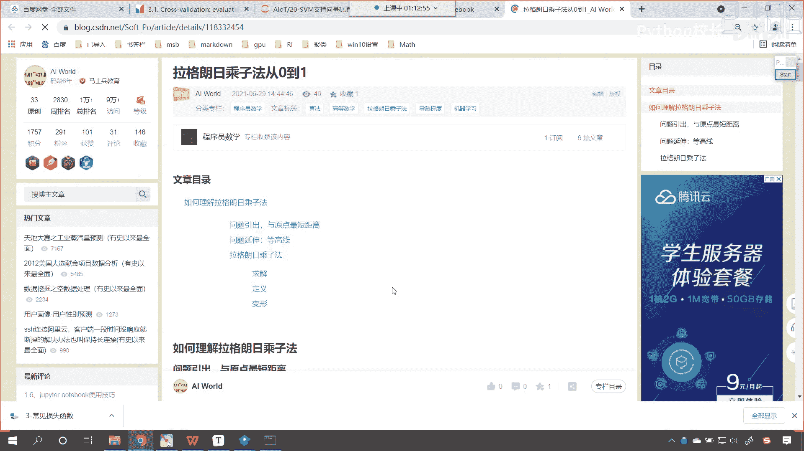
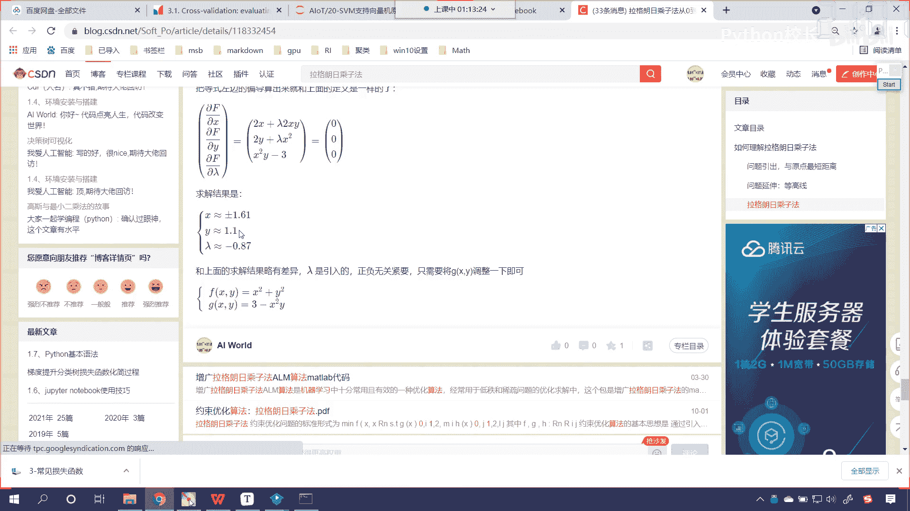
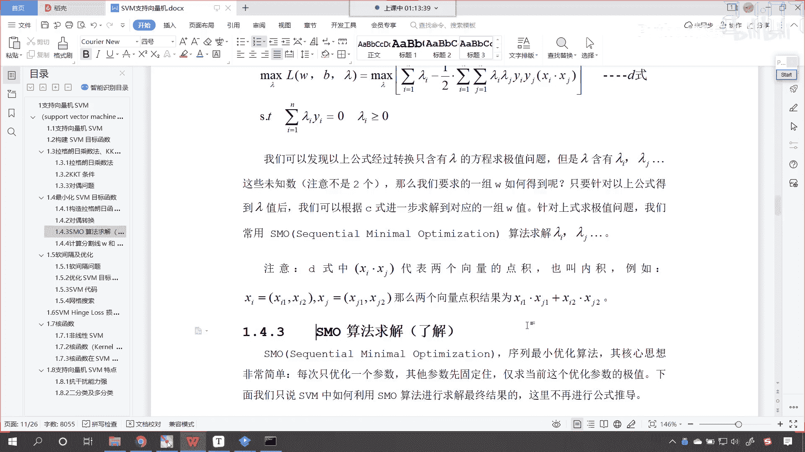

# P130：4-SVM支持向量机目标函数构建 - 程序大本营 - BV1KL411z7WA

对于咱们的这个s v m，我们对它的函数呢咱们进行一个构造，我们对它进行一个这个最优化好，那么到这儿呢我们稍微慢一点，你看咱们最小化svm的目标函数，根据咱们之前所讲的，是不是就是他呀，对不对，就是它。

那我们就根据拉格朗日乘子法，根据kk t条件，根据队伍问题，我们就可以按照如下步骤来计算svm，目标函数当中的w了，只要我们能够求解出w，那么这个问题就求解了好，那么接下来呢我们就构造拉格朗日函数，诶。

现在你能够看到，那我就构建一下啊，来看你看，那我在构建的时候，你看上面是不是原函数，那么这个是不是咱们的约束呀，那我怎么构建，你看我是不是给一个朗姆达呀，看到了这个地方，我是不是给一个朗姆达，看到了吗。

那这个地方我是不是来了一个求和，对不对，那我让这个兰姆达乘以谁呢，是不是乘以咱们的约束呀，对不对，那最后呢咱们这个s t呢我们是限制一下，要让咱们的朗姆达i大于等于零，这个咱们已经证明过了嗯。

你现在就能够发现我们的公式，看我们的公式从这到这个地方，你看从这儿到这个地方，你现在能够知道，你看为什么可以写成这种形式吗，那从这儿到这儿，我们是不是就构建了拉格朗日函数呀，对不对。

那构建拉格朗日函数的时候，你看是不是就让它乘以，是不是就是让他乘以一个朗姆达呀，对不对，拉姆达乘以咱们约束条件的个方程，对不对，因为我们是有多个嗯多个这个数据，所以说这个拉姆达呢它也是有多个啊。

拉姆达一拉姆达二，一直到拉姆达n好，那么你现在就能够看到，那我们如果想要对它进行优化啊，我们在这儿是不是来了一个max拉姆达，然后在这来了一个mw和b对不对啊，因为我们是要求谁的最小值呀。

我们是不是要求它的最小值，对不对，看我们要求它的最小值，现在呢我们给这个方程加入了一项，你看咱们加入的这一项有什么样的特征呢，朗姆达是大于等于零的，而咱们一减去y w t x a加上b。

它是不是小于等于零，一个大于等于零的数乘以一个小于等于零的数，那你想它这个值是不是一定是小于零的呀，它是向下的，是不是啊，所以说咱们为了让咱们这个模型是吧，有一个最优解，咱们给了一个什么max。

因为你这个损失是吧，你这个损失加了一个负的，那不行，咱们得怎么样呀，找到合适的朗姆达，让咱们这个是吧，尽量往上走，让它尽量最大，你大到一定程度不就相当于这一堆都是零的吗，是不是你想你大到一定程度。

这一堆都是零，是不是和咱们原来的损失函数，是不是就一致了呀，对不对，唉所以说你看它有一个这样的逻辑啊，好，那么我们构造的这个构造，上面的这个损失函数呢，它必须得满足以下的kk t条件好了。

那就是一减去y a是吧，小于等于零，lambda大于等于零，然后lambda乘以一减去y让它呢得等于零，好那么上面的损失函数我们构建了，那不好求呀，怎么办，咱们进行队伍转换，那我们在进行队伍转换的时候。

你看其实就是max在里面，现在你看我们是不是把它放到外面了呀，看到了吧，这个时候你看队友转换之后，咱们就放到外面了，在这里你只需要知道我们可以进行队友转换，唉就ok了，我们是可以进行队伍转换。

因为我们在上面是不是对队友转换问题，进行了一个讨论呀对吧，那进行完队友转换之后呢，看得到了b式，针对b式，我们假设参数拉姆达固定，那这个假设朗姆达参数固定，是不是就是把拉姆达当成一个常量。

咱们在这个地方是不是求了偏导呀，你看我们在这是不是求了偏导，看没问题吧，看我们在这儿呢求了偏导，对不对啊，因为你求偏导是吧，你这个拉姆达就可以当成常量吗，好那么我们在这儿呢就求了偏导啊，咱们求了偏导数。

嗯对不对好，那么有了这个偏导数之后呢，看我们令这个偏导数等于零，咱们就可以得到一个关系，看我们得到什么样的一个关系呢，你看啊，在这儿呢我们就可以得到这样的一个关系，大家仔细听啊，注意听。

你看因为你等于零，那我是不是就可以由上面的偏导数，是不是就可以得出下面的这个值呀，看到了吗，你的w是不是咱们要求解方程的系数，没问题吧，那这个w等于谁，是不是就等于咱们的朗姆达i乘以x2 。

再乘以y i啊，对不对，没问题吧，是不是我们要求解的方程的系数，是不是有xi和yi，是不是咱们的数据呀，对不对，x是数据，y是不是目标值，拉姆达是谁，lambda是不是咱们的拉格朗日乘子呀，对不对。

然后呢，你看朗姆达i yi等于零，是不是好，那么那我们也就知道了，原来咱们的方程的系数呢是由朗姆达i，x i和y i他们共同决定的，我们按照方程组的思想，我们现在将上面计算得到的结果，代入到咱们的b式。

看，我们将这个代入到b式看了吧，好那么我们带进去之后是吧，你看现在呢我们把它带进去，带进去之后，你现在就能够看到我们经过一堆计算是吧，咱们就可以得到这样的一个结果，看啊那带进去之后。

你就发现这个方程当中还有w还有b吗，看到了吗，带进去之后，这个当中是不是就没有w也没有b了，那我们就发现咱们原来要求解的问题，还有w还有b，现在我们将问题转化成什么了，现在咱们是不是将问题转换成了。

只有朗姆达方程的求极值问题啊，对不对，看这就是非常巧妙的一个转变，那大家要注意啊，咱们的朗姆达我们是含有朗姆达i，朗姆达j省略号，注意咱们的未知数呢，它不是两个啊，这个时候这个未知数不是两个。

那么我们要求的一组w如何得到呢，只要针对以上公式，我们能够得到拉姆达的值之后，你想lamba的值你要是能得到啊，对于这一堆数据，只要你能够求解出来lambda，那么咱们求解w是不是就易如反掌了呀。

你再往上看啊，我们往上滑，你看咱们的w等于谁，是不是就等于朗姆达a乘以xi加上yi，是不是就等于他看没问题吧，看就等于上面的这个，那现在的问题你看咱们就进行了一个转化，是不是，那么我们要求的一组w。

咱们就可以根据求解拉姆达之后，咱们进行求解，那么如何求解朗姆达呢，看现在的问题又出来了是吧，如何去求解朗姆达呢，我们常用的方法是sm叫sequential mini mile，optimization。

来求解，咱们兰姆达a拉姆达j各种各样的这个朗姆达，各种各样的拉格朗日橙子，注意啊，在咱们地势当中的，看我们上面有一个这个地势，你看abcd，咱们找一下咱们的地势。

你能够看到在地势当中是不是有一个xxx点，xg对吧，中间是点，那这个点表示什么呀，这个点就表示咱们的矩阵乘法，它呢就表示内积，我给你举一个例子，比如说xi等于xi 1 xi 2。

x j呢就等于x g1 x g2 ，那么两个向量点的内积呢，就是x i一乘以x g1 ，是不是行乘一列呀，对不对，哎这就是行乘以列好，那么到这儿之后呢，你看咱们的问题，本来我们是要求w和b。

现在咱们的问题是不是就变成了求解拉姆达呀，请问这个朗姆达是谁，这个朗姆达是不是就是咱们的拉格朗日乘子呀，对不对，看这个朗姆达就是拉格朗日乘子，那么之前我们在介绍拉格朗日乘子法的时候。

我们为大家进行过相应的推导，你如果要有忘记再看我写的这篇文章啊。

在这篇文章当中看。

我们就介绍了这个拉格朗日橙子，它是如何构造的啊，一点儿一点儿，我这个前戏很长是吧，一直一直引出到最后是吧，才下了一个定义，我们呢构造拉格朗日乘子法，咱们构造拉格朗，构造拉格朗日乘子法，然后对它进行求解。

最终呢我们就可以得到咱们想要求解的，x和y的值。

看到了吧，最终就可以求解这个值，所以说呢这些呢都是一步一步来进行关联的啊，啊这些都是一步一步进行关联的好。

