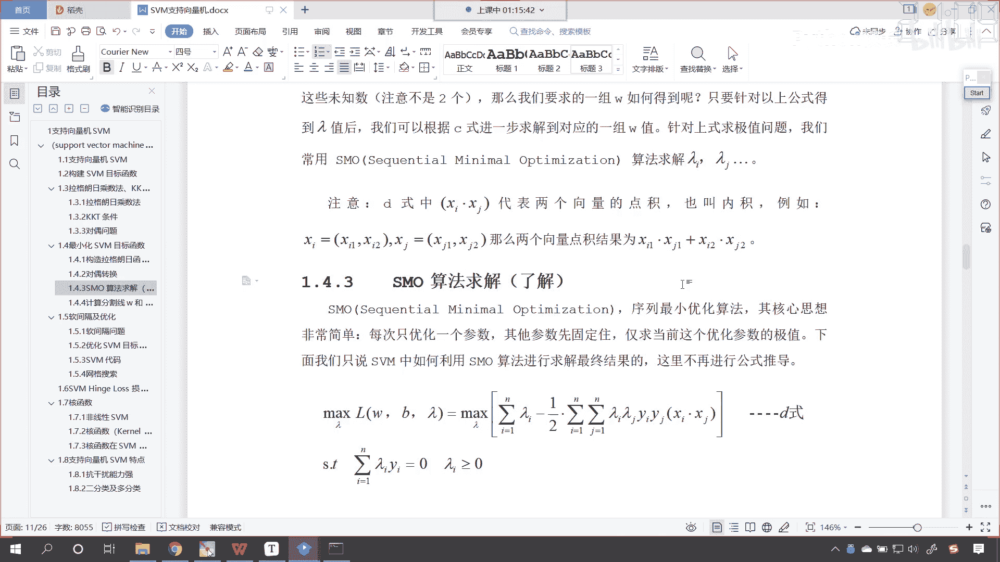
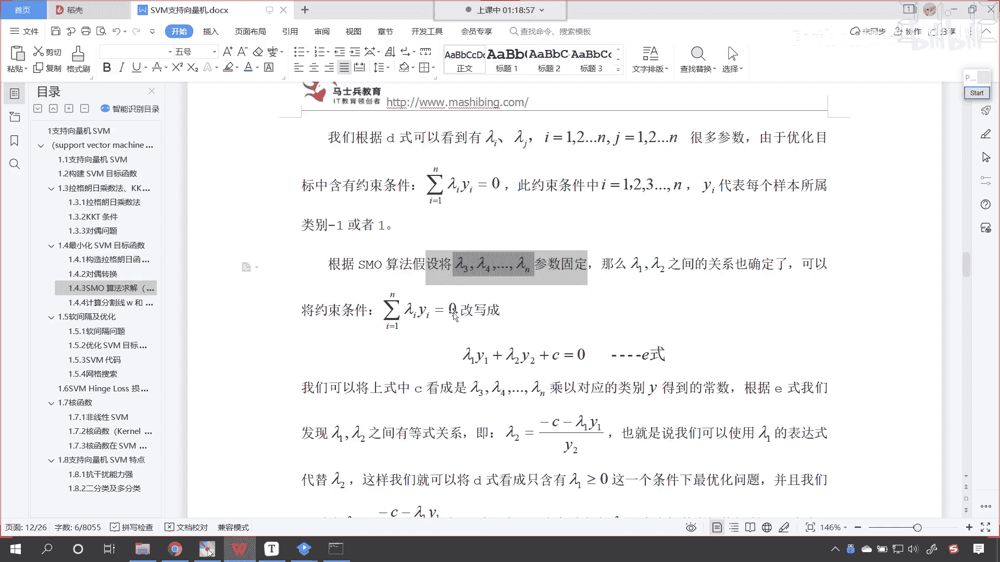
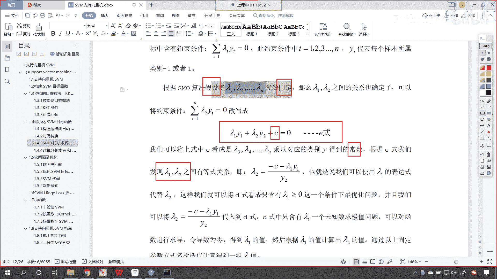
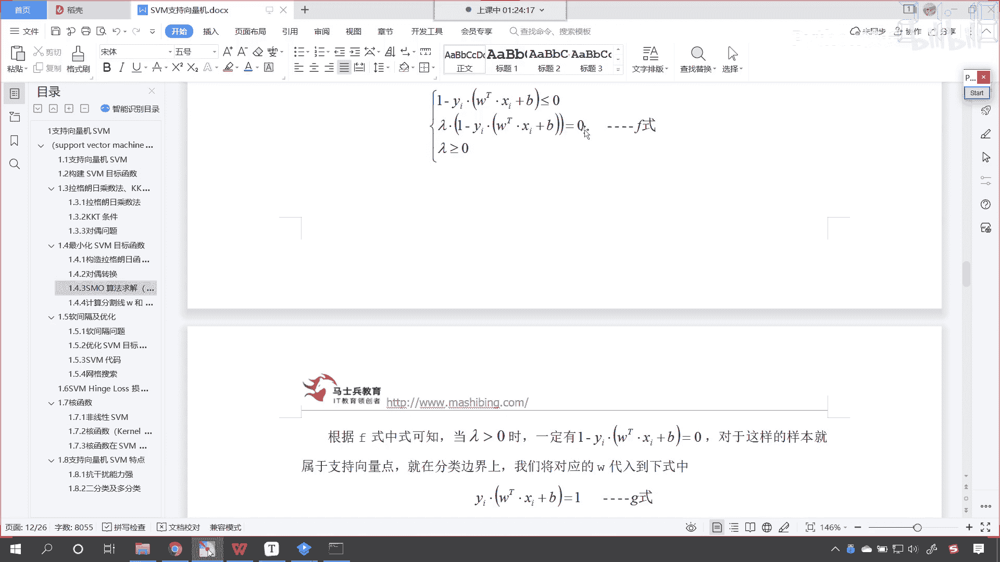
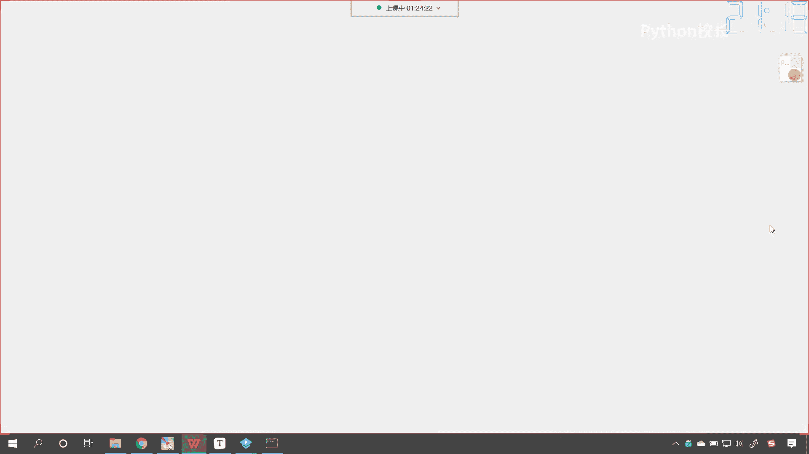
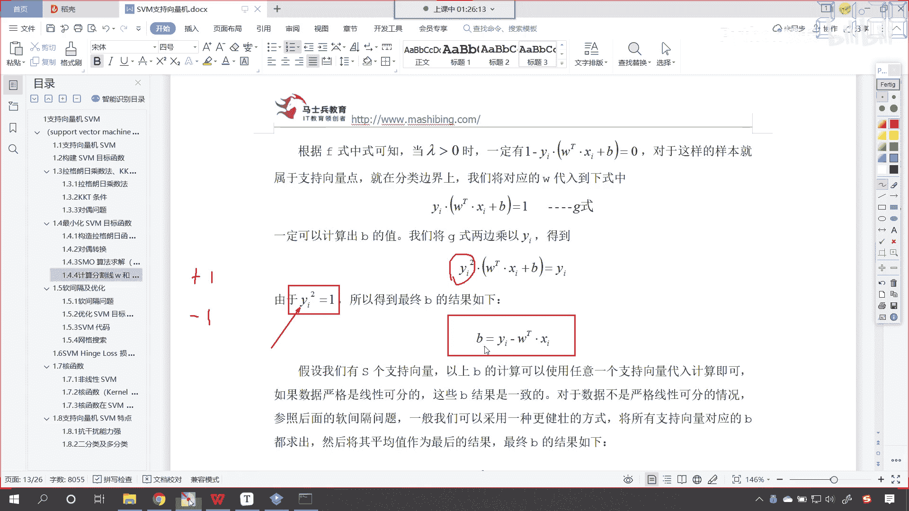
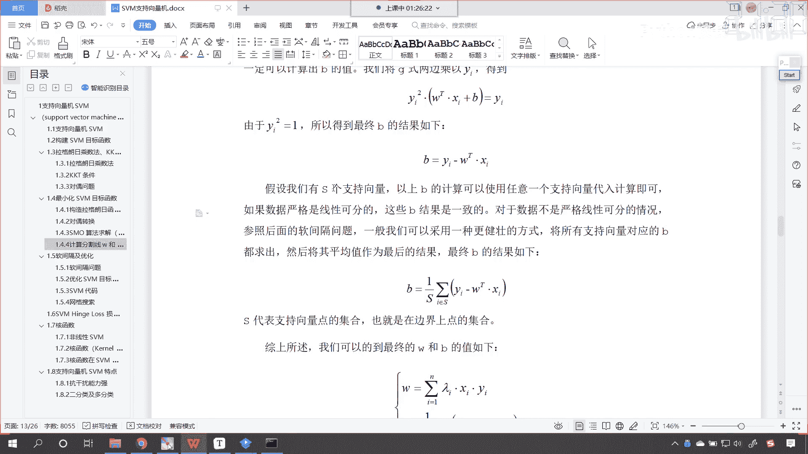
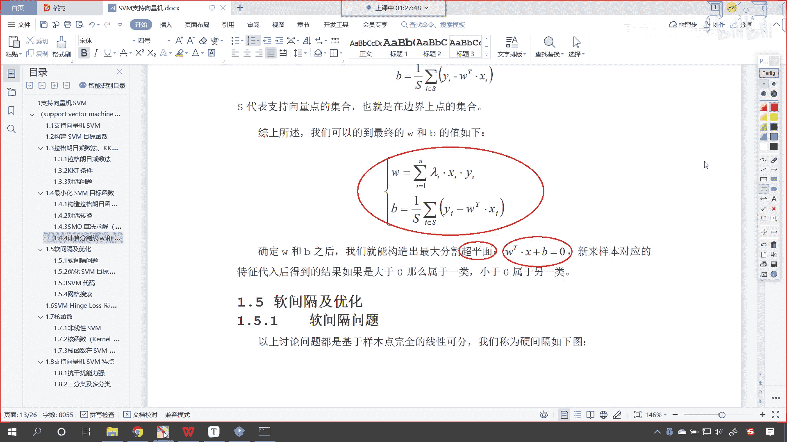

# P131：5-SVM支持向量机损失函数SMO求解过程 - 程序大本营 - BV1KL411z7WA

大家看啊，咱们这个sm算法，这个是我们了解的部分，那么我也带着大家，咱们一起过一遍，让大家心里边呢有一个数，那你知道就是这个svm支持向量机是吧，这个这篇文档写下来花了多长时间吗，花了一周知道吗。

才把它捋顺搞清楚，弄明白，所以那你在看的时候是吧，你得花一点时间，咱们课堂上对你进行讲解的时候，那有可能呢你一遍没听懂没关系，你就根据这个顺序往下走，搞懂一部分，然后你再去看是吧。

那你就一点儿一点儿就明白了。

那这个s m o呢，翻译成中文叫做序列最小优化算法，其核心思想非常简单，每次只优化一个参数，其他参数先固定，仅求当前这个优化参数的极值，下面我们只说svm当中，如何利用sm算法进行求解是吧。

那我们看一下啊，咱们这里呢就不做公式的推导了，现在你看我们所有的问题，是不是都落在他身上了呀，求它的最大值，只要咱们求解出来了是吧，它的这个最大值嗯所对应的拉姆达，那么我们所要求解的w。

所要求解的截距b是不是就迎刃而解了，对吧好，那么他该如何求解呢，看我们根据d咱们可以看到是吧，咱们的拉姆达i是吧，多个拉姆达，多个拉格朗日乘子是吧，它呢是有很多参数，由于咱们的优化目标当中的约束条件。

你看就只有这一个叫做拉姆达i y i等于零，那这个是怎么来的呢，看看这个是怎么来的，来咱们画出来图是吧，先把它框起来是吧，这个是怎么来的呀，是不是我们上面求导数得到的呀，你看我往上滑啊。

来咱们找到它是怎么来的啊，你看看在这儿呢，看到了吧，在这儿呢啊我们对于谁进行了求导数，看咱们是不是对b求偏导，是不是就得到它了，看到了吗，这是一个很重要的条件，也就是说我们的拉格朗日乘子法。

乘以咱们的目标乘以咱们的目标值，它所有的结果得到的是不是应该是零呀，对不对，看到了吧，他是这样的啊，好那么来咱们接下来呢我们有这个条件之后呢，那么我们就充分利用一下啊。

因为我们在讲解这个支持向量机的时候呢，咱们这个令yi它所代表的样本，它属于是-1或一，看它属于是-1或一，那你知道咱们呃其他的这个案例当中，其他的这个项目当中，我们的y目标值有的时候是不是012啊。

对不对，有的时候是0123，这个都没关系啊，你要知道这个没关系，这个-1和一，它是不是就是一个数字的一个表示呀，我们为了能够更清楚地讲明白他，所以说我们给了个-1和一，所以说你看这个支持向量机是吧。

咱们给了红色的底，给了蓝色的底，红色的点是正的，那么蓝色的点就是负的啊，哎它正他是这么个意思啊，好那么那根据s m o算法，我们假设是吧，朗姆达三兰姆达斯朗姆达n这个参数固定，其实一开始的时候。

咱们想要求解兰姆达一拉姆达二，一直到拉姆达n，我们不知道它是多少，那怎么办，我们先随机给它这个创建一个，知道吧，随机创建一系列的这个数据，那么我们先假设这些值固定，那么朗姆达一。

拉姆达二之间的关系也就确定了啊，因为他们总的和是不是等于零。

所以你看我是不是就可以写成这个公式呀，因为他们总的和是零，所以我是不是就可以写成这个意识，那其中这个c等于c，c是谁呀，c就是咱们朗姆达三兰姆达四，兰姆达n这所有的这个和是吧，我们看啊，这叫先什么。

先假设看到了，因为这个函数因为这个变量太多，但是方程太少，看到了吗，变量太多，方程方程太少，那想要求解这样的方程，没办法知道吧，你不能求导数，没办法，所以说我们就只能假设是吧，假设他们参数固定。

先求谁呢，咱们先求拉姆达一，拉姆达二，这叫各个击破是不是好，那么乘以对应的类别y你看得到常数，根据意识，我们可以发现，咱们这个拉姆达一和朗姆达尔之间，它是有等式关系的。

你看你根据意识进行化简，是不是就能够得到这个等式关系啊，在这咱们就不做这个细说了啊，也就是说我们可以使用拉姆达一的表达式，来代替朗姆达二，你看对不对，你看因为这个朗姆达二呢是不是完全可以用的。

用咱们的朗姆达一来表示呀，那这样我们就可以将d是看成只含有lambda 1，大于等于零这个条件下的最优化问题，看这样我们就可以将d是那啥是d，是咱们往上滑看什么是dish，你看这个是地势，看到了吧。

看了这个是d是那地势当中，因为有朗姆达一，拉姆达二，一直到一直到朗姆达n太多了对吧，怎么办呢，咱们把其他的参数都固定，你固定成多少，这个无所谓，知道吧，全把它固定一下，那么我们经过只保留朗姆达一。

拉姆达二，我们朗姆达二呢又可以用朗姆达一来表示，所以这个时候呢就只有拉姆达一了，那这个方程当中只有拉姆达一，那么我们嗯你看地势当中只含有拉姆达一，一个未知数，求极值问题，我们是不是就可以求导呀，求导。

然后令导数为零，咱们是不是就可以得到朗姆达一的值呀，然后根据朗姆达一的值，咱们计算朗姆达二的值，通过以上固定参数，多次迭代计算得到一组拉姆达，你看多次迭代计算得到一组拉姆达。

这种方式是不是就有点瞎蒙的感觉呀，看到了吧，参数太多，这这种时候是不是有一种，就有一种瞎蒙的感觉啊，哎确实是有啊，他这个时候确实就有一种瞎蒙的感觉，因为我们计算机嘛它可以进行for循环多次执行。

因为我们刚才也说了，你看咱们这个方程是吧，它有一个方程，这个方程有多个系数，但是呢只有一个条件，看到了吗，兰姆达i y等于零，那这个条件不够，也就是说僧多肉少，那怎么办，那我们就得这个先让方丈吃饱。

是不是啊，然后呢再想办法是吧，方丈去化缘，再让其他的小和尚吃饱，一个一个的去解决，你如果说要是这个大家抢的话，最后谁也吃不饱饭是吧，都得饿死，所以说呢这个sm算法就是序列最小化。

这个方式呢就是各个击破是吧，一个一个来最终呢就可以求解出，最终就可以求解出一组拉姆达值，所以说它是多次循环来求解好，那么只要我们求解了朗姆大值，那么是吧，咱们是不是就可以根据c是呀。

我们说这个w和朗姆达什么关系，是不是就是朗姆达i乘以x i，再乘以y i，是不是就得到w呀，那此时你的w只要有了朗姆达，那么你的w方程的系数就可以求解了啊，有了这个方程的系数求解之后呢。

看啊我们再看kk t条件是吧，你的kk t条件是，你看这个拉姆达乘以咱们的一减去y a，它是不是等于零呀，对不对，那么根据f是嗯，看根据这个f是可食，可知当朗姆达大于零时，看当咱们朗姆达大于零时。

一定有一减去yi wt加b等于零，看一定有它，那么如果我们的兰姆达大于零，那这个时候呢咱们就找见了支持向量，看这个时候咱们就找见了支持向量，如果你拉姆达大于零，那么一定有它等于零。

你看为什么你看我们再往上稍微滑一点啊，你看啊，因为一减去y1 ，因为一减去y乘以w tx i加b，这个是不是小于零，拉姆达是不是大于零，而咱们的拉姆达乘以，它是不是得保证它等于零呀。

那如果你朗姆达要大于零，你看你朗姆达大于零，那你怎么保证中间这个式子等于零呢。

是不是括号里边这个必须得等于零呀，哎不就是它吗。

对不对，你看就是它是不是一定有它等于零，这样你才能保证中间这个是不是等于零呀，那么只要咱们对应的兰姆达大于零，那么这个点儿它就对应的支持向量啊，它就对应着支持向量，如果拉姆达等于零。

那么它就那么它呢就是不重要的点，它呢一分就被分开了，你看因为我们想要对这些数据划分开，你看我们想要对这些数据划分开，你像你这条虚线外面的这些点儿，它是不是一分就分开了。

它呢其实对于我们的算法不是特别重要，哪些才重要呢，就是咱们这条线上的底，看线上的底，线上的点又叫支持向量，那这个支持向量是吧，哎它所对应的栏目呢就是大于零的，这样你看啊。

那么我们就知道了这样的一个关系是吧，那咱们就带进去看到了吧。

对它进行化简，化简之后，你看你的b咱们的结局看是不是就出来了，看到了吧，b是不是就等于y减w t x i啊，你不就是上面这个方程吗，是不是看我们左右两边同时乘以yi到了吧。

yi的平方它就等于y那因为y a的平方是吧，它一定等于多少，一定等于一，你知道咱们的y i是什么吧，y是不是就是咱们的目标值，我们现在所举例子，咱们的目标值它是不是正一和-1呀，对不对。

你看咱们的目标值它是正一和-1，所以无论还是正一和-1，你只要平方一下，是不是得到一，那这个是不是就可以划掉呀，看到了吧，这个就可以划掉，划掉之后呢，那这个b是不是就求解出来了。

那么假设说我们有四个支持向量是吧，如果要是只有一个支持向量的话，那这个结局就求解出来了，如果要是有s和支持向量。

我们可以求什么啊，咱们可以求平均，看到了吧，b呢就等于x分之一是吧，把它都求和求平均，因为呢如果咱们的数据要是严格划分，那么这个b是一致的啊，你就好比看咱们之前讲这个我们所举的例子。

你看这个p一点和p2 点，他俩所对应的截距是不是都一样呀，因为在一条线上对不对啊，但是有的情况呢它复杂一些，如果要复杂的，如果要复杂一些是吧，那我们可以通过求平均值是吧，唉来得到一个平均的结局。

所以看啊经过我们转换之后，经过咱们这个只经过咱们啊拉格朗日乘子法，k k d条件转换，s mo算法求解，我们最终是不是就可以得到咱们的w和b了，有了w和b之后，是不是就构造出了分割的这个超平面呀。

看到了分割的超平面，就是咱们这个方程，那么我们把数据代入到这个方程当中，如果大于零，那么它属于一类，如果小于零，那么它就属于另一类，到此为止，看到此为止，咱们sm算法唉。

