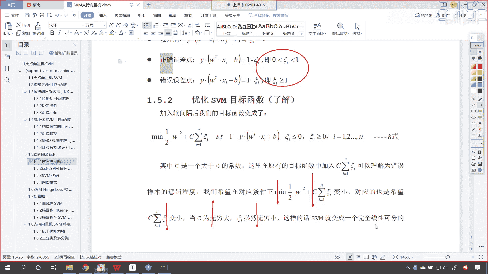
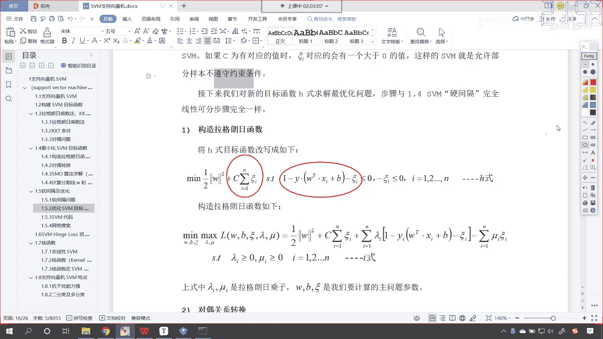
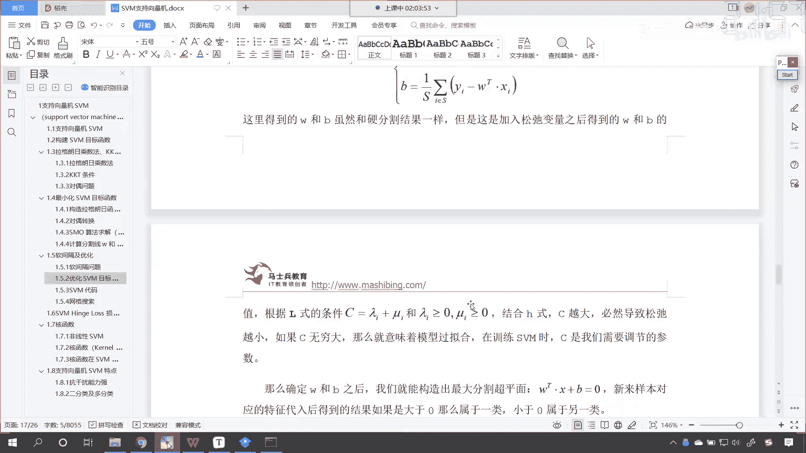
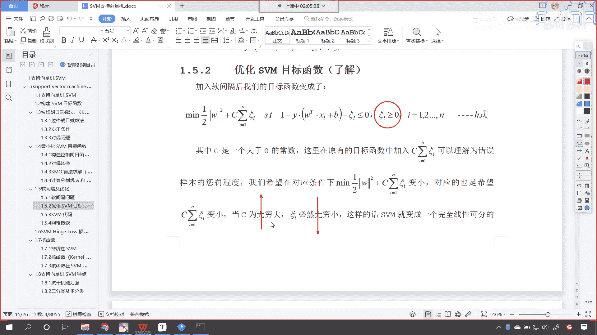
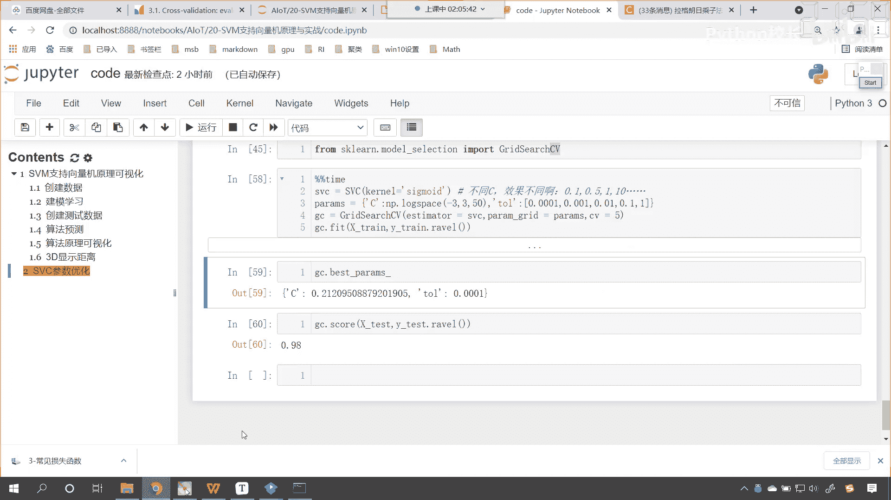
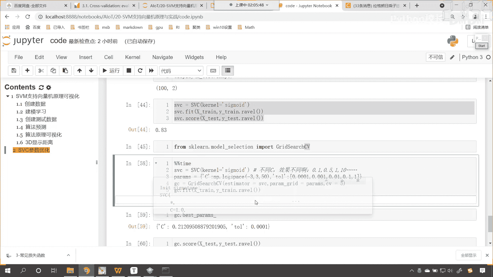
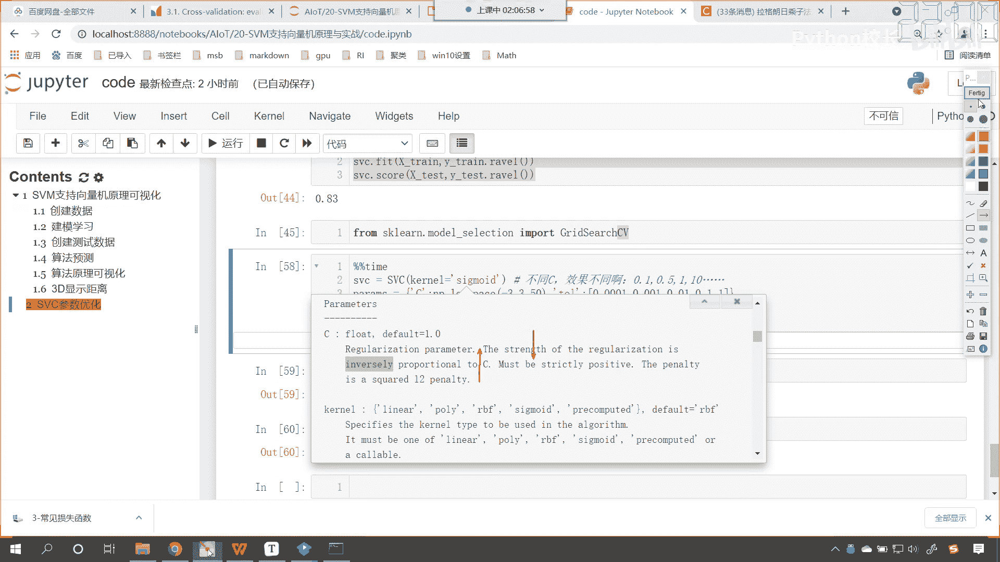
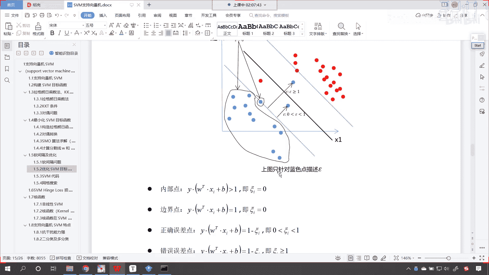
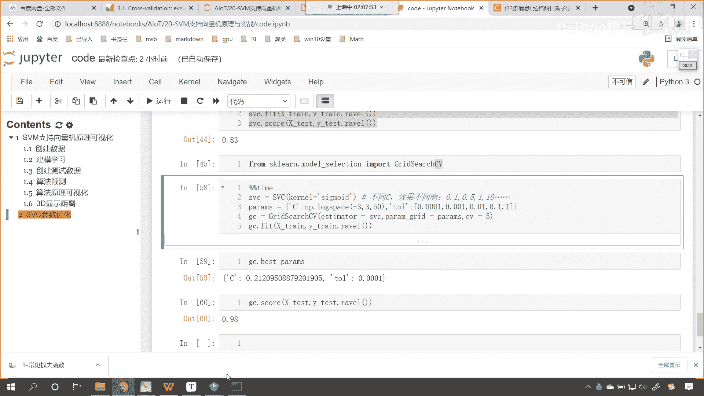
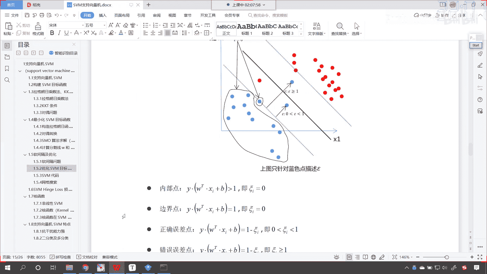

# P133：7-SVM软间隔及优化 - 程序大本营 - BV1KL411z7WA

好那这个c是什么呀，来我们通过软间隔咱们进行一个优化，在这里咱们就可以引出咱们的c表示什么，那什么是软间隔呢，嗯这什么是软中华呀，软中华抽起来是不是更好一些呀，是不是更软是吧，劲儿更小。

看以上讨论的问题，看都是基于样本点的线性可分，就是我们上面讨论的都是完全可分是吧，我们称为硬间隔，看就是这种情况，看到了一分就分开了，但是你的数据都是那么完美吗，你看这看这种情况，你就能够发现。

你看是不是咱们这个红色的点儿，跑到蓝色这个区域了，咱们蓝色的这个点儿是不是跑到红色区域了，你怎么分，你是不是都分不开呀，对不对，这种情况呢我们就得有舍有得，那你像你这个红色的底和这个蓝色的点。

那我把我把你判断错了，是不是也没关系啊，对不对，那么这个时候呢我们就得需要用软间隔了，那相比于咱们硬间隔呢，条件比较苛刻，必须得分开软件歌呢，咱们怎么样看，我们允许看到了吧。

允许个别样本点出现在间隔袋里边，你看到了吧，嗯看下面这个划分，看下面这个划分，那中间这一条黑色的线，咱们就将数据划分开了，这个时候你就发现你能够看到这个点儿，是不是没有划分好，这个点是不是划分错了。

这个点看到了吗，这个点虽然把它分对了，但是看它在哪里，看它是不是在咱们支持向量机的上面呀，你看这就是他所说的啊，允许某个个别样本底出现在间隔袋里面是吧，所以说呢这个时候误差是不是就存在了。

这个是不可避免的，是不是啊，即我们允许部分样本点不满足约束条件看啊，这一点很关键，看到了吧，如果我们所有的样本点要都满足这个条件，这个是不是就是硬间隔，你如果所有的样本点都满足这个条件。

那咱们是不是就可以把数据分开呀对吧，但是呢数据呢嗯这个总有一些噪声是吧，像这种情况，这种情况，这种情况你无论怎么找，你是不是都找不到一个合适的方程，能够把它分开呀，明白吗，看到了吗。

就是说我们出现了这些点，这些点和这些点，就是说无论你怎么找，你是不是都找不到这样的方程，能够完美的把它们分开呀，对不对，好，那这个时候呢我们就得退而求其次是吧，咱们允许是吧，他们有一定的误差。

那为了度量这个间隔软到何种程度，是吧，我们为每个样本引入了一个松弛变量是吧，你可以松一点是吧，这个叫什么可c看这个叫可c，可c呢是大于等于零的，加入松弛变量之后，我们的约束条件就变成这个。

就是咱们这个方程就变成了大于等于一减coc，就是说你不一定非得大于等于一了是吧，你大于0。5也可以是吧，这样不等式就不那么严格了啊，嗯不等式呢就不会那么严格了，看那这个可c呢。

每一个样本和每一个样本还不一样，那你如果说是这个点看到了吗，如果说到这个点，那么它的可c就大一些，看到了吗，为啥呀，你都分错了，看到了吗，你本来属于是蓝色的底，但是呢你跑到是不是身在曹营，心在汉。

是不是看到了你的心都跑到人家这边了是吧，那这个时候呢他的可c呢就大一些是吧，你看如果你要在这个地方看，大家看啊，如果要在这个地方，就是你在这个分割线和咱们的这个边界中间，那么这个可c就是大于零小于一。

那如果说我们要再看，如果说我们要正好在这儿呢啊，正好在这儿呢，咱们的可c就等于零，看你要正好在边界上，那么可c等于零，还有你如果要在这个边在咱们的边界外面是吧，那么可c也是等于零的。

是因为这个时候完全分开了对吧，那你看啊咱们再问一个问题啊，这个红色的点它的可c是多少呀，红色的点红色的点是不是来各位小伙伴，那请问这个红色的点它的可c大于零，大于一吗，大于一是吧。

唉因为呢红色的这个点和咱们蓝色的这个点，你看它俩是一样的，是不是跑的是不是都比较偏呀对吧，因为你只有把这个可c给它加大，它才能跑到这边，是不是哎所以说呢你看内部的点可c等于零，看到了吧，就是蓝色的点。

咱们就举例了，红色的点也一样是吧，内部的点可c等于零，边界上的点coc也等于零，咱们正确的误差点，看什么叫正确的误差点呢，我这条黑色的线把这个点分类，是不是分类正确了。

你看也就是说你在咱们分类边界和咱们的这个，看在咱们的分类线和边界之间，这个叫做正确的误差点，它依然叫误差点儿，根据咱们硬间隔的标准来看，它就是误差点，因为如果说我们要能够找到一条线是吧，根据咱们硬间隔。

你就应该画到这一堆里边儿，但是呢嗯事不与愿违，是不是你就应该在这，但是呢他偏偏在这，那怎么样，哎他呢就是大于零，小于一是吧，那错误的误差点呢看到了吗，这什么叫错误呀，错误的误差点。

就表示咱们这个红色的点和这个蓝色的点是吧，这个就是错误的误差点，错误的误差点呢，唉你就偏离的有点大了，知道吧，我们说的正确呢就是分类给分正确了是吧，虽然你有一定的误差，但是呢这个嗯在一定的误差范围内。

那么我依然认为你是，这依然依然认为你是蓝色的这一类点好，大家看啊，有了这之后呢，我们接下来就优化咱们s v m的目标函数，那你看这个时候看这个时候咱们就有了个什么，看这个时候我们是不是就有了个c呀。

你知道咱们刚才在代码当中，我们说的那个c是什么了吧，看到了吗，那个c是什么呀，那个c是不是就是他呀，看其中的c呢是一个大于零的常数，这里在原有目标函数当中，我们加了一个c。

这个求和可c可以理解为错误的惩罚程度，我们希望对应条件下嗯是吧，这个这个m2 分之1w的平方加上c可c变小，你看我们同样也是希望它变小，你知道为什么吗，因为你加了这个乘法将它变小，是不是。

你看因为我们知道你看正确的误差点，错误的误差点，他们这个可c是不是都越来越大呀，你看到了吧，你只要就是说有偏差，那么这个可c一定是越来越大的，是不是，那我们构建构建了惩罚项。

我们同样也希望他俩求和越来越小，那么对应的也是希望它变小，那么如果我们的c无穷大啊，c无穷大，那么这个符号看看，如果这个c无穷大，那么咱们这个可c必然是不是无穷小呀，对不对，如果说你给的c很大很大。

那你想你这个可c是不是就是很小呀对吧，因为我们要让总体的这个是不是很小，你c系数变大了，你这个可c是不是就得小一点对吧，因为我们求的是最小值，是不是，这样的话，s vm就变成了一个完全线性可分的。

看完全线性可分的svm，那当然你看如果咱们这个c越小，那么这个可c是不是就越大，你看到了吧，看你想一下，如果我们的c是吧，它这个越小，那这个可c是不是就可以相对来说大一点呀，你可c要是大会怎么样。

这个是不是就是咱们的软件歌那个系数呀，你可c要是大说明什么问题，看可惜要是大，是不是说明咱们的误差会多一些，对不对，看可c要是大，就说明咱们的误差多，你再往上看看啊，可c要是大误差多，分群就不明显。

对不对，唉大家的悟性都很高啊，所以说呢如果c为有对应的值，那可c对应会有一个大于零的值，这样的话，svm就允许部分样本不遵守，咱们的约束条件是吧，那接下来呢唉我们一起来看一下啊，构造拉格朗日函数。

看到了吧，这个构造拉格朗日函数和咱们刚才呢是一样的，其实呢就是多了一项什么，就是多了个他嘛，对不对，看就是多了个他一样的，看这多了这一项是吧。

那这个就稍微更复杂一些，是不是啊，稍微更复杂，那多了咱们这个可c之后求解也一样啊，求解也一样，联立方程是吧，这个大家根据咱们刚才我们对于svm，目标函数的这个构建，你自己走一下，多了咱们的多了。

咱们的可c过程一模一样，知道吗，多了这个它过程一模一样，所以说呢经过这个转变，经过这个计算是吧，经过这个计算，我们求解的结果也是一样的啊。

求解的结果是一样的，好大家看啊，c越大，看这个c越大，必然导致这个松弛越小，c越大，必然导致咱们的松弛越小，也就是咱们的可c就越小，如果c无穷大，这就意味着模型过拟合，那你看你这个c无穷大是吧。

你也就意味着这个时候你的条件是非常苛刻的，因为啥呀，你追求的是什么，你想你这个c无穷大，你追求的是什么，你这个c是吧，我们往上看啊，再看咱们这个公式，咱们还按照这个公式来说看啊，就这个地方看。

如果我们的c无穷大，可c是不是就是无穷小特别特别小，那无穷小对于咱们的可c而言，因为这个可c是不是大于零的，你无穷小是不是就相当于零，对不对，无穷小是不是越来越接近于零，咱们就会想方设法。

把咱们所有的数据都给它分开，你都给它分开，这个时候容易过拟合，为啥呀，因为你有一些点，你就不应该把它分开，所以说你如果追求这个c无穷大，那么这个可c无穷小，这样的话就会怎么样呀，这样的话就会变成一个嗯。

这个就会出现过拟合的情况，因为你通过各种各样的方式，你将咱们的数据训练数据给划分开了，但是你对于新的数据测试数据效果就不好了，因为你给了这个c无穷大，导致你没有找到合适的划分规律。

现在呢咱们再回到代码当中。

我们再看一下这个c，看来咱们shift tab进入这个方法当中。

我们看一下这个c，看他是怎么说的啊，这个c是什么，regular ization parameter，是不是正则化的系数呀，the strength of the regular arization。

看就是说正则化的强度，inverse，proportional to c，正则化的强度是不是跟c成反比呀，versely就是反比的意思啊，那反比是啥意思啊，反比是不是就是就是说你这个c越大。

你的正则化强度是不是就越小呀，对不对，你看是不是这个意思啊，看正则化越大，咱们的这个嗯强度就越小，好来我们其他小伙伴也反映一下，咱们的屏幕有没有动呀，屏幕有没有动啊，看这个c越大是吧，然后c越大。

咱们的strength就越小，那你看我们课件当中讲到的。

你看你这个c越大，可c越小，看这个c越大，这个可c越小，可c越小，咱们的这个嗯可c越小的话，是不是就说明他分得越开呀，对不对，看可惜越可可c越小，分的越开，这个时候正则化的这个强度是不是就越弱，对不对。

这个时候我们本来希望把这个异常点给它找到，对吧，红色这个红色的点和这个蓝色的点，但是呢你如果要是调大c，那么这个可c就小，可c就小，这个时候呢你就找不到这个异常指点了。

所以说呢c是什么意思，大家现在明白它是什么意思了吧，好那么这里呢我们就介绍了一下。

看这里呢我们就介绍了一下。

