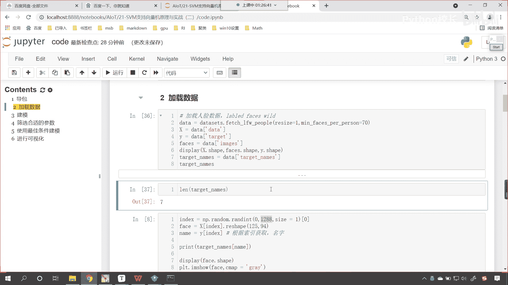
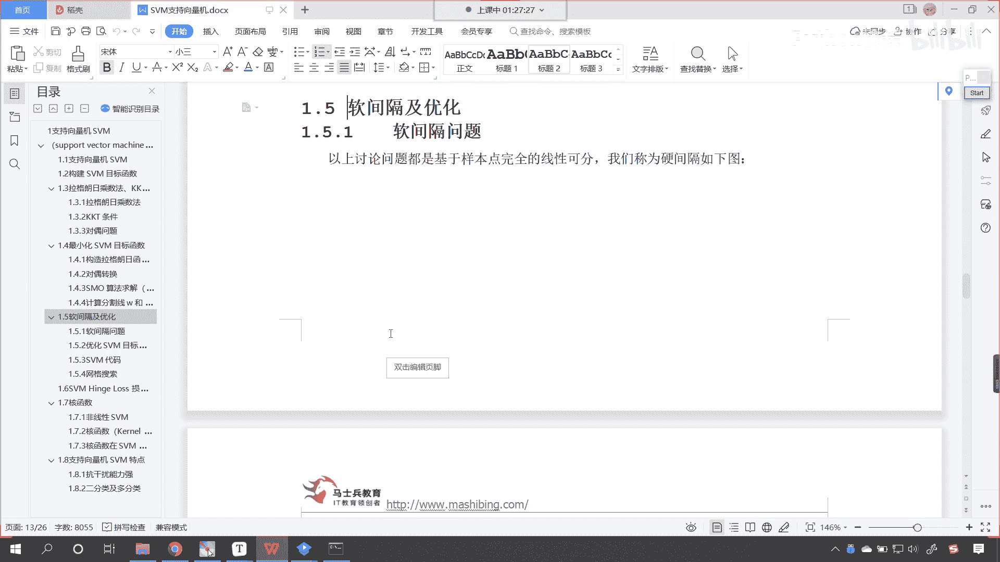
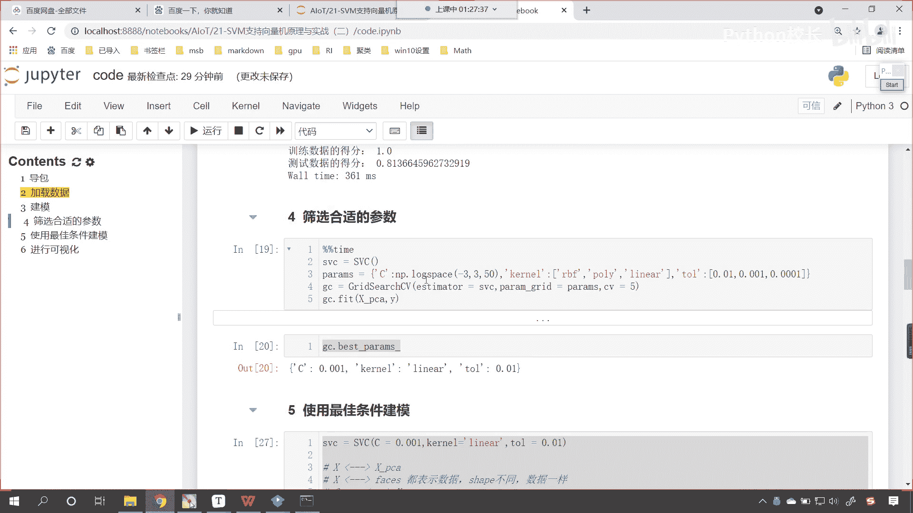
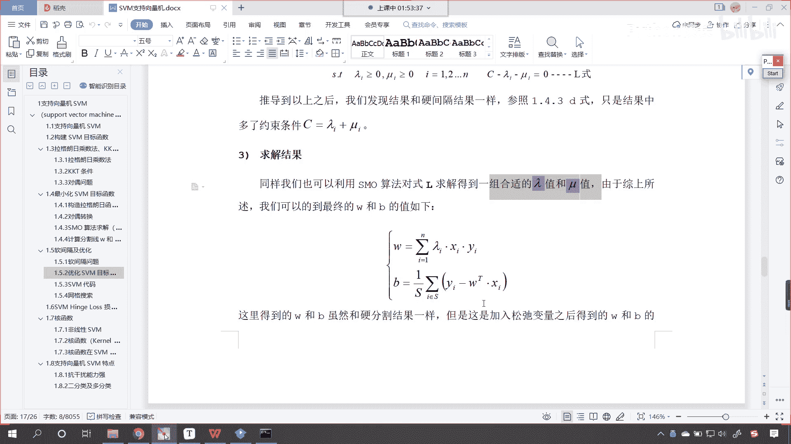

# P137：4-SVM支持向量机软间隔与优化目标函数构建 - 程序大本营 - BV1KL411z7WA

来来来，各位小伙伴，咱们接下来继续啊，接下来继续，刚才呢我们有小伙伴说了一下，咱们这个数据是吧，其实你这个mean faces，如果你这个参数你要不填是吧，你比如说你给个零是吧。

那那也就意味着所有的图片都会加载进来，这个时候我给你执行一下，它会加载1万多张图片是吧，那这个加载的图片多，那么它耗费的时间就会长嗯，这个时候呢我们稍微等一下，看一下咱们这个数据是吧。

会呈现一个什么样的状态，刚才的时候我们是1288，现在你看这个星号是吧，还在执行，你知道我们计算机操作什么的时候，花费的时间比较长吗，叫i o操作，这个i o呢它是两个英语单词的缩写，一个叫input。

一个叫output，这个叫读写操作，我们在进行联网的时候，联网请求访问其他网站的时候，那他耗时是吧，这个也是因为io操作哎比较慢啊，也是因为i o操作，特别是你比如说你下一个电影是吧，你看你下一个电影。

你发现这个速度是吧，嗯跟你的网速有一定关系是吧，你下一个电影现在我们4g4 g的时代是吧，你总得需要几分钟，是不是，那假如说你要是固态硬盘，你从自己的电脑上拷到另一台电脑上，那可能就会很快，是不是啊。

这个几秒钟是吧，就十几秒钟就考完了，为啥呀，因为固态硬盘它的速度快是吧，所以这个就是一个这个读写操作耗时，你看现在呢我把所有的数据都加载进来了，你就能够发现你看咱们有多少人呀，咱们有多少张图片呀。

13233张图片是吧，所以说那这个时候是吧，他就慢了，所以我们得给他加一定的限制，就是说咱们在加载这个图片数据的时候，你每一个人是吧，每一个人你得这个至少还有70张图片，这样的话我在进行训练的时候。

那你想一个人有70张图片，那咱们这个算法是不是，就可以从这个图片当中去找到规律呀，对不对，样本多了啊，那我们有多少人呢是吧，我们如果要全把这个数据加载进来，他有多少人呢，咱们就可以查看一下length。

我们将targets放进去，你看是不是有5749人呀，有的人只有一张图片啊啊有的人，那我们给70个啊，限定一下条件，这个时候你就会发现是不是很快啊，看到了吧，速度很快是吧，出来了。

这个时候有多少有几个人呀是吧，只有七个人，这七个人都是世界级的政治上的大佬好，那么我们知识计算机呢。

嗯今天呢是我们讲的最后一节内容，那知识向量机呢，咱们一共花了三节课来对它进行介绍，那么最后这段时间呢，我们会对于支持向量机的算法，做一个整体的介绍，那我们呢嗯这个先看一下咱们的软件哥好不好。

咱们先看一下软件歌，上一节课呢我们介绍了软件歌的知识点，但是呢咱们没有深入，详细的对于软件歌进行介绍，大家现在也知道了，咱们支持向量机当中的那个参数。

c看我们支持向量机当中的这个参数，c是不是就跟咱们的软间隔有一定的关系呀。

对不对呀，c就是咱们的惩罚项，那么现在呢咱们一起来看一下啊，这个软间隔有有软间隔，也有硬间隔，是不是啊，你看软的话，咱们这个条件你看柔软是吧，软这个软的话给你的感觉是什么呀，不那么生硬。

是不是这个软件歌，那它和硬间隔是相对应的，我们看到的这个图是吧，咱们的数据比较好是吧，那这样的话我们对于这个数据的划分，咱们就比较省心是吧，一这个一条线一个分离，超平面就可以把这个数据分开。

但是现实生活当中哪有这样的好事儿呀是吧，往往是没有的啊，你所遇到的问题是吧，往往都是这个各种各样的难题，就得需要你发挥聪明才智才能够解决是吧，你替别人解决了问题，最后呢你是不是才能够挣到大钱呀。

对不对呀，我我也希望咱们的各位小伙伴是吧，抱着这样的一个心态是吧，多增加自己的这个才能技能，多为别人解决问题，这样的话你一定能够挣到钱好，那么这种情况我们说比较少，真实世界当中它往往是这样的是吧。

他没有这个啊，没有你想没有完全的对和错是吧，孔子就说了，说呃这个君子求诸己，小人求诸人，其实呢他所说的君子和小人都是一种状态，你就孔子而言，你说他没有小人的状态吗，当然不是。

只不过孔孔子大部分时候他都是君子的状态，能以君子的要求是吧，能以君子的标准来要求自己而已，好那么我们看一下咱们这个数据，那么这个数据无论你怎么划分，看到了无论怎么划分，你都找不到一条合适的分离超平面。

将这两个分开是吧，它总有异常指点，总有错误点，那这个时候怎么办呢，那对于这些异常指点啊，对于这个点儿，对于这个点咱们就睁一只眼闭一只眼是吧，把他们呢咱们就认为你总会出错，你想你考试的时候考了这么多次。

考了这么多次，是有几次你都是满分啊，你看我考了这么多次试是吧，我能记得的满分是吧，嗯这个屈指可数啊，也就两三次吧是吧，到了高中之后，到了高中之后，数学就从来没有得过满分是吧，都是这个140多是吧。

好那么咱们往下看啊，那遇到了这种问题，我们该怎么去解决呢是吧，那这个时候咱们就得需要软间隔，你看啥是软件歌呢，我们在分这条线的时候是吧，咱们允许它误差存在上面，这个硬间隔。

就是咱们要求就是把所有的点都分开是吧，嗯是黑就是这个红色就是红色，是蓝色，就是蓝色，那我们有了软间隔之后呢，咱们这个时候条件就宽松了是吧，如果怎么分也分怎么分是吧，也也不能够把你分开。

那怎么样我们可以让它出错是吧，咱们这个时候就有软间隔了，好那么软件歌咱们用这个官方的这个术语是吧，用咱们机器学习当中的话来描述，就是我们允许部分样本点不满足约束条件，看到了吧。

因为我们的约束条件就是y乘以wt，xi加b是不是大于等于一啊，这个是我们最早一开始推导出来的这个条件，那我们允许它不满足，你看啊，来我给你看一下啊，咱们在哪里啊，你看就是最一开始咱们介绍的。

你看往下往下滑看往下滑嗯，你看啊是不是推导出来这个了是吧，你如果要是y等于一的话，你是一个类别，y等于-1的话，是另一个类别，那这两个公式可以合到一起，合到一起之后，你看是不是就是咱们这种形式呀。

看到了吗，嗯是吧，y乘以w t x加b大于等于一，不就是咱们现在所讲到的这个软件歌，他这里所所说的这个条件吗，是不是啊，你看它怎么样呀，允许你看这就是软是吧，嗯这个部分要点不满足是吧。

我们在我们要考虑大部分的情况下是吧，考虑大部分的情况下，咱们允许一部分点不满足，那这这个时候是吧，咱们就更加灵活了，我们所训练出来的模型就会更加的适用，就会更加的朴实是吧，放之四海而皆准。

那咱们看一下它具体是怎么做的，他说为梁为了度量这个软件割的程度，我们这个时候呢就引入了一个松弛变量，这个松弛变量就是可c，那我们看一下这个松弛变量，它的这个具体描述啊，现在你就能够看到啊。

有了这个松弛变量是吧，你现在发现咱们在右侧啊，现在你就发现我们的公式，是不是就进行了一定的修改呀，我们原来是大于等于一，这个条件比较苛刻，现在怎么样，我们让它大于等于一减可c那啥意思呀。

你的可c呢是大于零的，那也就意味着是吧，你不一定比如说这个cos等于一的话，你是不是，你前面这个公式是不是就是大于等于零，你看所以说这个就相当于给降低了，看到了吧，降低了降低的话，那我们的条件就宽松了。

条件宽松的话，也就意味着有一些点可能就会画错位置，看就不那么严格了，宽松了是吧，好那你比如说你看这个看到了，看咱们这个点嗯，好那我们这个红色的点我们一划分怎么样。

这个红色的点是不是就划归到蓝色这个点了呀，很显然这个就划划归错了是吧，你甭管人家红色的点在哪里啊，注意啊，你不要管人家红色的点在哪里，但是人家呢就是归为红色的点，你比如说现在美国是世界上是吧。

这个霸权主义国家，你想夏威夷岛离他本土有多远呀，那老远了，是不是啊，这个1万 1万 10000km，但是呢他就把这个夏威夷岛是不是给占了，他说是他的，那就是他的是吧。

他在全世界各地是不是都有军事基地啊是吧，离那么远，但是呢军事基那块地方就是它的，所以说呢我们在我们在看，在这个分离的时候是吧，我们在分类的时候，咱不能说这个红色点距离是吧，距离你这个蓝色点近。

就把它分成一类，人家数据归的是哪一类，那么它就是哪一类好，那么内部的点儿呢，你看就是这个内部的点，那很显然可c等于零，边界上的点也等于零，你看他所说的边界的点，就是这两条虚线刚好满足是吧，也等于零。

接下来呢就是咱们的正误差点，看这叫做正确误差点，正确误差点呢，就是在咱们黑色的这条线和这个呃虚线边界的，这些点是吧，你要注意啊，看注意啊，这个叫什么叫正确误差点啊，这个叫正确误差点，咱们换一个颜色。

这个点叫什么，这个点就叫做错误差点，因为如果说你这个蓝色点在这条线的下面，还有情可原，将将就能够把你算作是黄色的呃，这个蓝色的点，但是如果你是分到上面了，你想这个蓝色的点，是不是就嗯。

划归到咱们红色这个点的类别当中了，所以说呢你看你错误的越严重越离谱，那么我们这个可c是不是就会越大呀，看到了吗，他们就会越大啊，所以说呢它是这样的一个规律好，那么接下来呢我们看一下。

咱们优化这个s v m这个目标函数啊，那加入软间隔后，咱们的目标函数就会有一个改变，现在呢我们的方程呢就变成了，1/2 w的平方加上c，然后可c那为什么咱们的coc它是一个累加和。

因为呢每一个样本对应着一个可c，所以说呢是嗯这个累加和i等于一，一直到n，那我们当然也有，咱们当然呢也有这个判断条件，也有约束条件，这个约束条件呢就是嗯一减去y是吧，减减去这个coc小于等于零是吧。

这不就是咱们上面公式演化而来的吗，然后coc呢怎么样，它得是大于等于零的啊，这个值诶对它有个约束，那么这个呢就是咱们的h是，你看你到这儿能够看明白吗，到这儿能够看明白吗。

就为什么这个地方加了一个c乘以coc呢，你看为什么加了一个这个呢，你看啊其中c是一个大于零的常数项，这个其实就是在原来的目标函数当中，是不是就加入了个他呀对吧，那我们这个叫损失函数是吧。

我们是不是当然希望它越小越好，对不对，原来的函数咱们没有加这个的时候，我们也希望它越小越好，现在加了它了，我们是不是也希望它越小越好对吧，我们希望找到合适的可c，为每一个样本都找到合适的可c是吧。

那这个时候不就刚刚好了吗，对吧，你越小，你看你当这个点错误的时候怎么样，这个可c是不是比较大，如果我们能找到合适的可c，咱们是不是就减少错误差点呀，你如果要减以自己最大的努力减少了这个错误。

错误差点儿是不是就说明你的算法就合适了呀，对不对，所以你看这个目标函数就变成了，在原目标函数的基础上，咱们就加了一个c可c你看到这儿，各位小伙伴能理解吗，看到了吗，那这个我们就把它叫做这个惩罚项。

我们希望呢咱们新的这个方程它变小，你想一下极端的情况看，如果说咱们所加的这个乘法项它变成零了，看假设说它变成零了，这是一种什么情况呀，那如果它要变成零了，是不是，就说明咱们这个函数和原来的那个函数。

是一样的呀，那你要是变成零了，咱们这个函数是不是就是完全线性可分呀，对不对呀，那你完你这个变成零了，看你这个变成零了，那巴不得呢是吧，我们巴不得解决问题解决的透彻一些是吧，解决问题解决的这个漂亮一些。

不就是这种情况吗是吧，完全分开了，对不对呀，所以说呢你看啊，所以说咱们这个地方是吧，如果它要变成零了是吧，哎那这就说明这个很好，完全分开，彻底分开了，但是这个天不遂人愿，那如果说你要变不成零怎么办。

你变不成零也没关系，我希望你尽量小，因为你越小说明呢越好是吧，咱们也是希望这个变小，那c它是一个参数呀，咱们是可以调整c的大小的，看如果这个c要无穷大，很多时候这个数学家举例是吧。

他没有办法一次性给你说明白是吧，他给你举一个极端，说这个c无穷大，你想你在这个条件要变小的情况下是吧，因为你要对它优化呀，如果你给的c很大，咱们找的结果是不是只能如果你这个c很大啊，你看啊。

如果你这个c很大是吧，就就好比咱们给参数c，咱们给了个1000，给了个1万是吧，你这个很大，那你这个可c是不是无穷小呀对吧，因为你只有特别特别小特别特别小是吧，才能够保证这个整体是不是变小呀对吧。

那那这个时候会怎么样呀，这样的话s v m就变成了一个完全线性可分的，你看你嗯越来越小，你这个coc变得无穷小，它就相当于是这个和原来的这个，和原来咱们的这个优化条件就就类似了啊，这个时候会怎么样呀。

看它完全线性可分，你完全线性可分，这个时候就会出现过拟合的情况，那么过你和咱们之前在讲线性回归，这个领回归，还有螺丝回归的时候，我们对于现对于这个过拟合欠拟合，咱们都有相应概念的介绍，怎么样。

大家对于过拟合还有一定的认识吗，来还记得过拟合的各位小伙伴，在我们的讨论区里边扣一个666啊，来我们其他小伙伴呢，好很棒啊，你们还对于我们的这个过拟合，欠拟合还有一定的了解是吧，那已经很棒了。

好那么如果c有相对应的值，那么可c对应的嗯，他一定是一个大于零的值，这样的话咱们的s v m就允许内部这个分样本，不遵守这个约束的条件，那这个时候就宽松了是吧，这样的话我们只要调整合适的c。

咱们就可以防止过拟合，接下来嗯咱们在有这个参数的情况下，我们构造一下拉格朗日乘子法啊，那这个构造的拉格朗日函数，其实和咱们上面的是一模一样的啊，我们看一下它到底是怎么构造的啊。

现在你就能够看到这个方程就稍微复杂一点了，这个是我们增加了惩罚项的，那么它的约束条件呢有两个，看到了吗，约束条件有两个，这是一个这又是一个，你看我们在这儿，因为我们的约束条件往往是谁。

有有一个方程让它怎么样小于等于零，我们的可c咱们是不是说它大于等于零呀，但是如果说我们要把方向调整的话，这来一个负号，这个零你加负号加正号是不是都一样，是不是都表示它所以说负的可c怎么样。

是不是小于等于零好，那么你看你有两个条件，有两个条件如何去构造拉格朗日乘子法呢，啊这个是前面的那一部分，怎么构造，你现在就能够发现它很巧妙啊，看到了吧，嗯加上了一个什么，是不是兰姆达i，然后又怎么样。

看到了吧，是不是又有一项就是mi c啊，因为它是一一对应的，就是咱们上面这一部分这个条件，还有这个条件构造了，也就是说我们的约束条件如果要多有多个，那么我们构造的拉格朗日函数是吧，咱们就增加嗯。

有多个咱们就增加多项，有一个咱们就增加一项嗯，所以说它是这样一一对应的好，那么有了这样的一个函数，咱们呢，接下来呢就对它里边的这个参数进行一个说明，你比如朗姆达i miui就是咱们的拉格朗日橙子。

咱们的wb可c是我们要计算的主要问题参数，我们有了这个软件歌，是不是就多了个coc呀，看到了吧，多了个coc啊，接下来咱们进行对偶关系转换，一样的这个方程稍微复杂了一些是吧，咱们有原来里面求最大。

咱们现在变成了里面求最小，那转换之后这个方程还不变，只要咱们这个队友关系是吧，只要满足kk t条件，是不是就可以看看这就是k k d条件，看到了吧，这就是咱们的k k d条件，只要它满足k k d条件。

那么咱们方程呢就可以继续嗯去进行，一步一步向下走好，那么你看这个还是上面的啊，还是上面的咱们的拉格朗日乘子好，那么我们怎么样求导是吧，求偏导令导数为零是吧，我们求w求b求可c那么对于这个偏导是吧。

对于这个偏导他呢就是满足这样的公式，满足这样的规律啊，这个求偏导的话，我们其实就是之前咱们所讲到的偏呃，求导数的基本规律，如果导数是复合函数，那么我们求偏导的时候，咱们根据的规则是链式求导法则。

一层一层球是吧，好那么得到了这个之后呢，看得到了这个导数之后呢，咱们继续往下化简，w就等于这个那朗姆达y i呢就等于零，这个c呢就等于兰姆达i加上miui，因为你看一旦我们对于可c求偏导的时候。

你要注意啊，可c是有多个的啊，看coc是有多个的，我们求偏导一化简，这个时候呢就是c朗姆达i，c减去朗姆达i减去mi等于零，看你注意啊，这求偏导是一个一个求的啊，求偏导是一个一个求的。

可c呢它是一个样本，对应着一个这个嗯软间隔，看一个样本，对应着一个软件歌，那对于咱们内部的这些点看到了吧，内部这些点，那它有很多呀，内部的这些点不就是咱们红色的这一区域，还有这个蓝色的这一区域吗。

它们所求解出来的可c就都是零，知道了都是零，好，那么看啊，就到这里之后呢，我们经过队友转换，然后呢我们求导求导之后呢，我们就会得到一些规律，得到一些这个等式关系，看到了吗，这就是等式关系。

有了这个等式关系，那我们就把怎么样以上的关系咱们就带进去，咱们原来这个方程看到了吧，我们把它带进去，这个方程不就是咱们刚才写写的那个，损失函数吗，看到了吗，这个方程就是咱们刚才写的啊，你不要怕麻烦。

也不要看这个公式复杂，你就把它带进去就可以了啊，你看啊我们带进去，这是不是有个w对吧，那个w是不是可以带进去对吧，你看看咱们是怎么带的啊，w看到了吧，这个时候是不是就乘开了呀。

看到了兰姆达a兰姆达g兰姆达i，兰姆达j x i x j是不是就变了，为什么这个点乘的时候，这个得把它写开呀，因为我们是矩阵运算啊，所以说就得写开好，这个时候你看see是吧，到了吧，c乘以coc。

你这个c等于什么，c是不等于朗姆达i加上miui啊，这个时候你看乘开看到了吧，是不是他后面的也一样，咱们就不不做一一详细的展示了啊，我希望咱们各位小伙伴仔细看咱们这个文档，你仔细找错啊，找错了是吧。

你就直接发给我，或者直接发到咱们群里边，希望你睁大眼睛是吧，看咱们的公式是吧，比较复杂，这个都是一个一个写的啊，如果能找到错是吧，那说明你相当厉害啊，一般这个一般情况下，我们是没有错的啊。

但是鼓励各位小伙伴找错，所以经过化简之后呢，最后就简化了，看到了吗，就简化变成这样了，虽然我们的公式看着极其复杂，但是简化之后呢，你发现这个里边只剩下谁了，是不是只剩下狼么大了呀。

是不是只剩下兰姆达了对吧，原来还有谁，还有w还有c是吧，还有mu简化之后只剩下只剩下朗姆达，这事就好办了对吧，这事就好办，你这个方程当中只有拉姆达，那就可以怎么样，咱们是不是就可以根据之前的s m o。

是不是进行对它进行求解呀对吧，当然我们转换之后是吧，大家看啊，是有相应的条件约束的，是不是有条相应条件约束的，朗姆达i大于等于零，mi大于等于零，这个是不是都是咱们拉格朗日乘子呀，对不对。

是我们引入的系数，为什么这个地方必须是正呢，你还记得为什么这个拉姆达i和这个mi，必须得是正的吗对吧，你看我们的kk t条件，那篇博客文章里面就说的非常清楚是吧，里面说的非常清楚啊，就讲到了。

为什么这个兰姆达i必须得大于等于零是吧，我们从这个咱们从导数是吧，从梯度的方向上哎我们进行了说明和介绍，嗯最后呢如果说我们找到了最优解，那么它们的方向一定是相反的，所以说我们必须得让朗姆达i大于等于零。

才可以，这时候还有一个条件，就是c减去拉姆达i减mu啊，是不是也得等于零呀，这不就是咱们上边计算求导，计算出来的等式条件嘛，所以说嗯这也有一个等式条件，哎我们就发现啊。

你看经过咱们上面对于max lambda mu，对于这个复合函数进行求导是吧，咱们发现与mu没关系是吧，但是为什么可以消掉，是因为这个c等于兰姆达i加上m，所以在约束条件当中一定有此条件是吧。

那所以呢我们得到最终的目标函数，是不是就可以写成这样，就可以写成这个，看到了吧，咱们就可以写成这个，这就是咱们最终的目标函数，那么推导以上推导已得到这个公式，我们就发现了软间隔和这个硬间隔结果一样。

硬间隔呢是咱们1。4。3，d是这个是我们得到的l式，那我们看一下来对比一下啊，看一下咱们1。4。3好，你看一下这个地势，你就会发现这个是我们最一开始的时候，给各位小伙伴介绍的，咱们的这个损失函数。

你能够发现这个里边是不是也只有lambda呀，看到了吗，只有lambda，我们的约束条件是什么样的，是不是朗姆达i大于等于零，兰姆达i乘以y是不是等于零，看咱们现在这个软间隔的啊，看他们软间隔的。

你看这个软件歌的，咱们得到的这个损失函数l它也类似，你看到了吗，看到了吗，它也类似，你就能够发现是吧，我们这儿是不是多了一个c减去朗姆达i，减mu i这个约束条件啊，是不是啊。

当然我们l式当中呢也有约束条件，那这个约束条件是不是也是朗姆达i y，是不是也得等于零呀对吧，兰姆达i y它的累加和也得等于零啊，和上面那简直就是一模一样，所以说呢，你看因为咱们这就是加了一个软件歌嘛。

就是一部分我们让一部分点是吧，符合这个条件，另一部分点呢可以不符合这个条件，其实就是在原来的基础上进行的一点点变化，那么你想你基本原理没变，所以说你的这个目标函数，是不是也不会发生特别大的一个变化呀。

对不对，那我们求结果是吧，我们同样也可以使用s m o算法是吧，对于咱们上面的l式进行求解，我们得到一组合适的拉姆达和缪是吧，我们就可以进行求解了，求解咱们所求解得到的w和b一样，和原来的公式是吧。

没有区别，和原来的是一样的啊，好那么大家看啊，这个就是咱们软间隔这个介绍以及它的优化，还有呢它公式的一系列推导，好，那么你看啊，到这里看到咱们1。5，这里是吧，咱们就将知识下载机当中那个重要的参数。

c是什么是吧。

