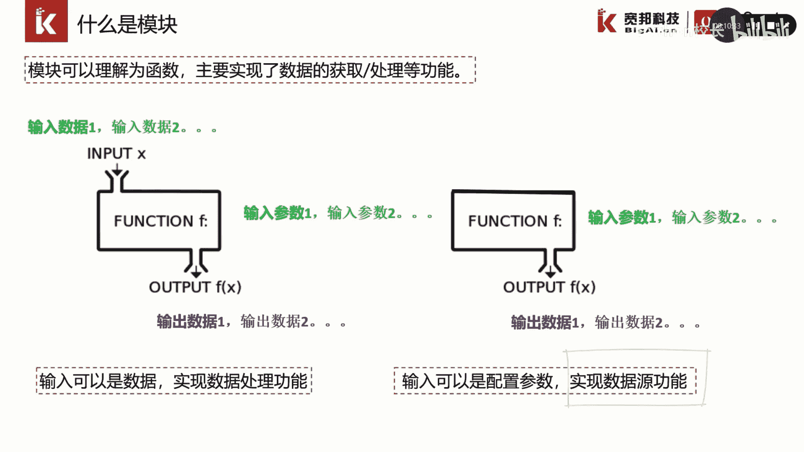
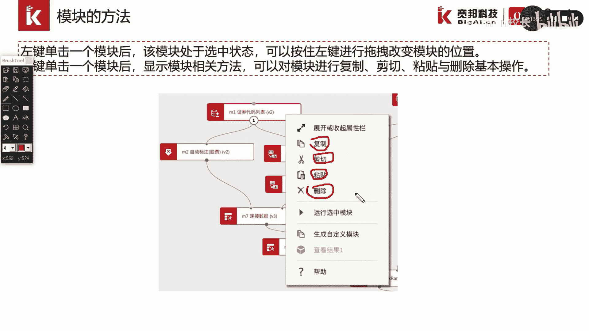
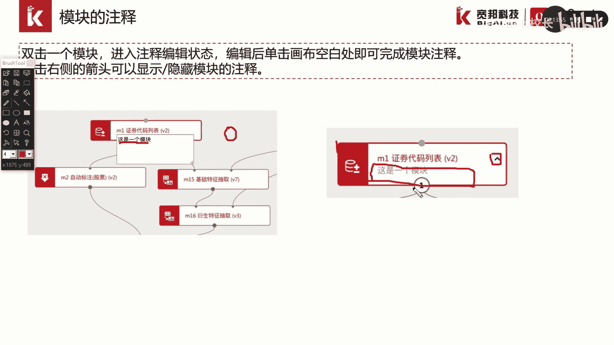

# P14：2.3.1-可视化模块 - 程序大本营 - BV1KL411z7WA

这一部分我们介绍一下可视化模块，首先我们介绍一下什么是模块，模块可以理解为函数，主要实现了数据的获取以及数据处理等功能，模块按照是否有输入数据，可以进行分类，对于有输入数据。

输输入参数以及输出数据的模块，通常我们是实现数据处理的功能，而对于没有输入数据，只有输入参数和输入数据，输出数据的模块，通常是实现数据源功能。

在画布中，每一个模块都注明了一个以m开头的模块代号，例如m一来表示模块的在画布中的唯一代码，模块上还显示了模块的名称，例如证券代码列表，模块是画布的基本构成单元，我们可以通过模块的名称。

在模块列表中进行搜索，找到这个模块，我们还可以发现模块的名称，后面有一个以v开头的标识得标标记在括号内，这个标识表表示了该模块的版本，每一个模块拥有不同的版本号，通常情况来说。

我们的模块列表中显示的是最新版的模块。

每一个模块是一个矩形的框，矩形框的上边界和下边界有实心空心的小圆圈，这些小圆圈称为节点模块的连接，就是通过小圆点之间的连线完成，其中上边界的小圆圈连接的是输入，下边界的小圆圈，连接的是输出。

空心的圆圈呢表示是这个模块必须的输入或者，输出节点而实行的，实行圆圈表示的是可选的输入和输出节点，可以看到模块的右侧有一个红色的感叹号，这个感叹号表示没有连接输入，输入数据或者模块参数的配置不全。

我们需要在模块的属性栏中填入，指定需要输入的参数。

我们通过左键单击一个模块，可以将模块设置为选中状态，通过左键进行拖拽来改变模块在画布中的位置，我们通过右键单击一个模块，可以显示模块的相关方法，例如图中的右键证券代码列表模块。

我们可以通过选择对应的选项，来实现模块的复制剪切，粘贴与删除操作。

此外我们还可以对模块进行注释，我们双击一个模块就可以进入注释编辑状态，我们在空白处输入该模块的注释信息，编辑后我们点击画布的空白处，即可以完成画布的注释，可以看到这个模块多了一个，我们输入的注释信息。

我们通过点击右侧的箭头。

