# P141：4-聚类算法的划分标准 - 程序大本营 - BV1KL411z7WA

那么接下来我们继续啊，那么你看我们上面说到它在进行无监督的时候。

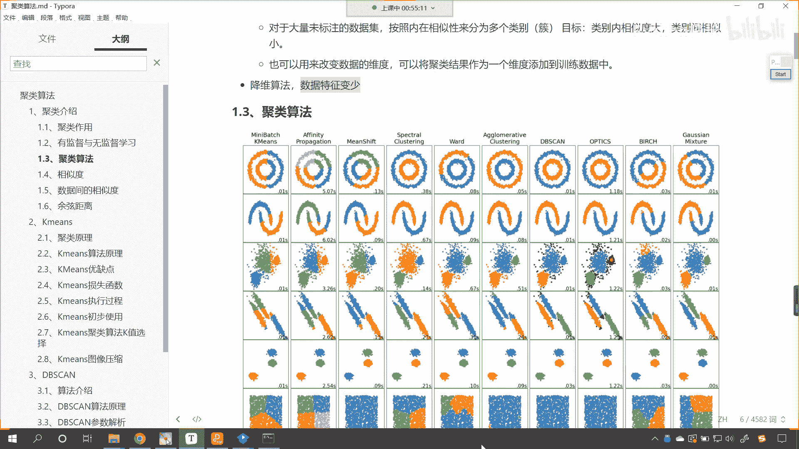

我们希望呢类别内的相似度大，我们希望类别间的相似度小，这个各位小伙伴应该都能理解是吧，因为我们是不是也经常进行类别的划分呀，对不对，我们也经常把自己划划归到某一类当中，是不是好，那么如何衡量呢。

对不对啊，如何衡量你的相似度大，如何衡量你的相似度小呢，接下来咱们就看一下它它的这个度量标准好。

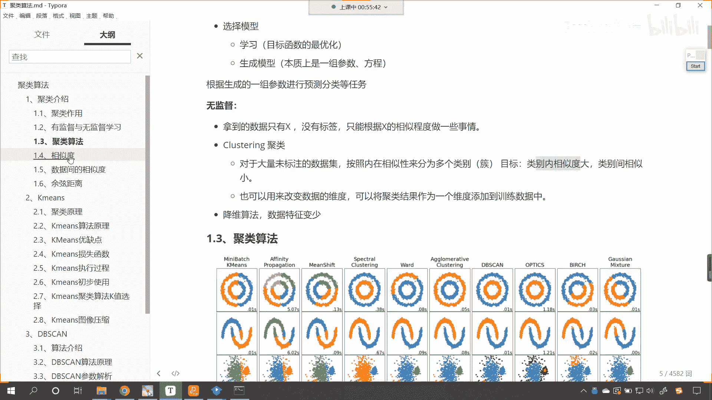

那你比如说你看这个左边这张图片，和右边这张图片，你看一下它有没有相似度呀，看有没有相似度是吧，现在我们能够清楚的看出来是吧，哎这边是一个美女是吧，这边是不是这边是不是就是一个这个狗头呀，对吧。

你看还是很像的，是不是看到了吧，神似对不对呀，如果我们要把这个颜色调调浅一些是吧，或者说我们让一个80岁的老太太，眼眼花的老太太，让她去看，有可能他就识别不出来了，是不是。

好那么请问你看这两张图片既然有相似度，那请问它们相似在哪里呀，首先是不是相似的，相似在颜色上呀，其次他俩是不是相似在形状上呀，对吧，你看这个发型是不是也是类似的呀，对不对，你看这个眼睛是吧。

哎左右这个左右对称，还有鼻子也是左右对称，所以说这张图片是吧，这两张图片它是有相似度的，对不对好，那么我们是用肉眼看，咱们肉眼获取了这个数据之后，数据传到我们的大脑当中，我们经过计算，我们就看出来了。

那么对于计算机该如何辨识，该如何操作呢是吧，计算机当中它的相似度指的是什么呀，有没有一个度量标准呢，唉这个问题是吧，是我们每一个人该思考的是吧，好那么我们回答一下刚才的问题是吧，那就是相似度是吧。

数据间的相似度，咱们呢可以用欧式距离来表示你距离近，说明呢你就这个相似好，那么近朱者赤，近墨者黑，是不是和咱们聚类是不是一个意思呀，对不对好，那么我们就看一下欧式距离，那欧式距离咱们在二维空间看到了吧。

就是x一减x2 y一减y2 的平方，三维空间是不是就是x一减x2 ，y一减y2 ，z一到z2 的平方，是不是再来一个开根号呀对吧，你看这就是距离，我们高中我们初中阶段是吧，咱们就学过距离了。

接下来咱们再看一下明可夫斯基啊，距离的表达方式有多种好，那么我们的闵可夫斯基距离呢，你能够看到这有一个公式哎，有看到吧，这是不是有一个公式呀，这个公式你看它是p次幂，然后他是不是开了个p次方呀。

那么我们的闵可夫斯基距离，就是这个明可夫司机他总结出来的一种距离，那么这种距离根据你p的不同，咱们可以进行不同的变换，p等于一啊，p如果要等于一，那么就表示曼哈顿距离，那你能你能想到这个曼哈顿距离。

它有哪些具体的实际的应用场景吗，你想一下，你看如果p等于一的话，咱把p等于一带入到上面这个方程当中，是不是就是咱们这个公式呀，在我们实际生活当中，p等于这个曼哈顿距离，它有这样的一个应用。

比如说我们出租车司机拉了一个乘客a，我们希望把它运送到这个，我们希望把它运送到咱们的这个w点好，那你知道城市当中，是不是盖了各种各样的房子呀，他是不是有各种各样的街区呀。

那我们知道如果这个乘客a他在b点，我们要把它送到w点，那么b到w是不是有一个直线距离呀对吧，这个直线距离肯定是最近的，但是呢这个直线距离呀，他中间盖了各种各种各样的房子，你没有办法直接穿过去。

这个时候你想出租车走的路线是什么样的呀，是不是拐弯呀，对不对呀，看出租车走的路线，咱们画一个图来给你表示一下是吧，你比如说啊咱们的乘客呢想要从我们的乘客呢，想要从这个点，假如说到这个点。

但是这个中间有障碍物是吧，那这个司机他不能这么走，看到了吧，司机呢他不能这么走是吧，为什么，因为有障碍物对吧，咱们画一个红色的叉啊，因为有障碍物，所以说他不能这么走，那么司机该怎么走呢，看到了吧。

先直着走，拐弯是吧，然后呢再往上拐是吧，然后再拐弯，你看他走的都是什么，如果城市这个规划比较好的话是吧，哎那它就是这样的一个形状是吧，最后我们是不是就到这个点儿了，好那么咱们所画的这个阶梯的形状。

它就是什么，它呢就是明可他呢就是曼哈顿距离，那么它就是曼哈顿距离，所以说你看明可夫斯基他所提出来这个公式，是不是就是大而全的呀是吧，因为我是p不同的p它呢有不同的含义，它都有现实生活当中的一些应用好。

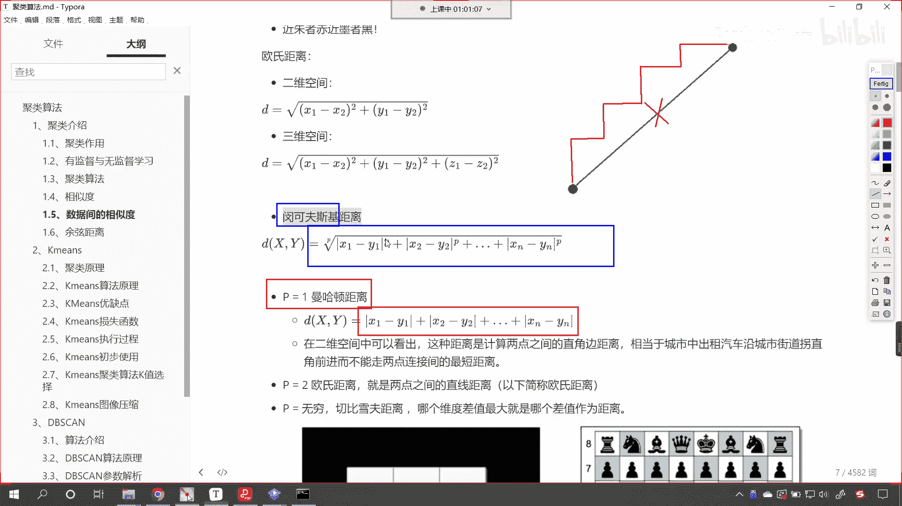

那么我们看一下p等于二啊。

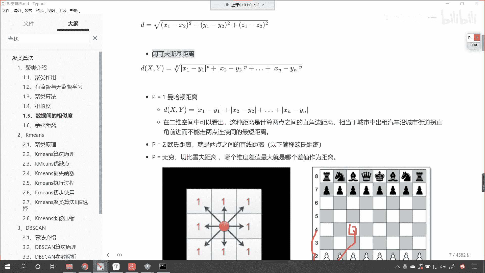

p等于二是我们最熟悉熟悉的，是不是就是欧式距离呀，对不对，还有p等于无穷。

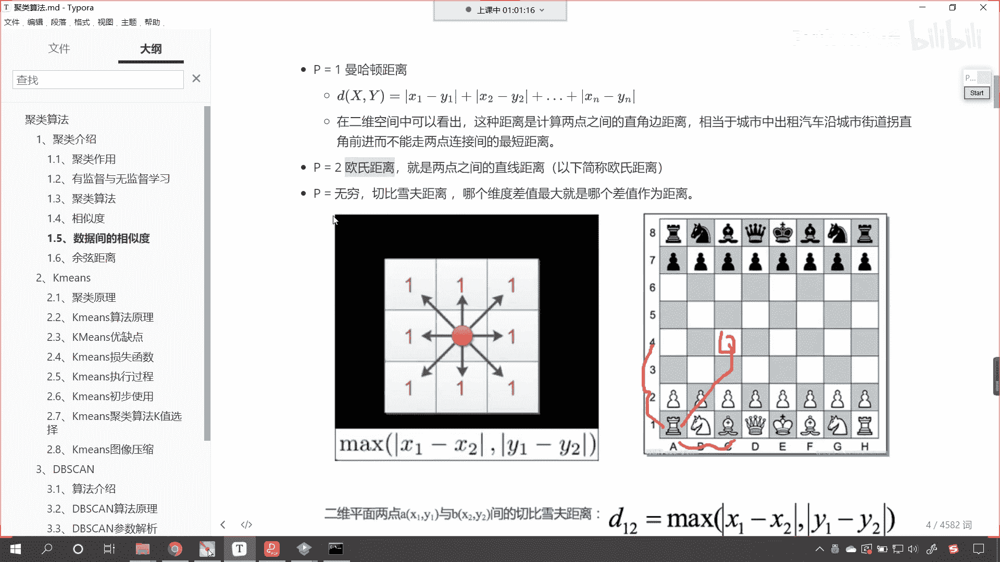

看到了吧，你这个p一般情况下就取p等于一，p等于二，p等于无穷，上面两个我通过举例子，你已经搞明白。

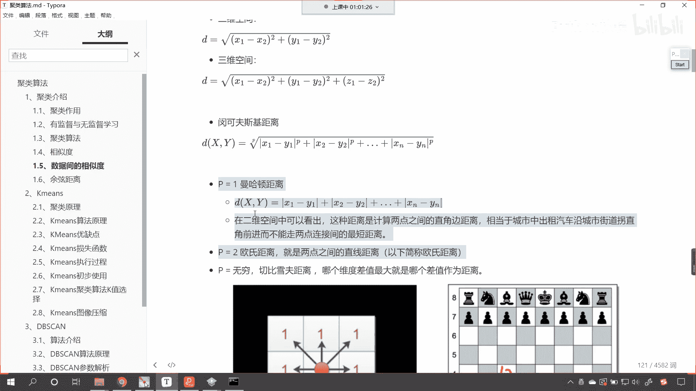

弄清楚了好，我们看一下p等于无穷啊，这个p等于无穷，它表示的是切切比雪夫距离，这也是一个人好，那么它表示的是什么含义呢，就是哪个维度差最大，就是哪个差，我们就用那个差值作为咱们的距离，咱们将哪个是吧。

最后这个我们改把它改成那个是吧，就是哪个维度它的差值最大，那么咱们的距离呢就是那个差值，它的距离，那它有什么真实的含义呢，看到了吗。

它有什么真实的含义呢，看我在这儿呢给你贴了这样的一个图。

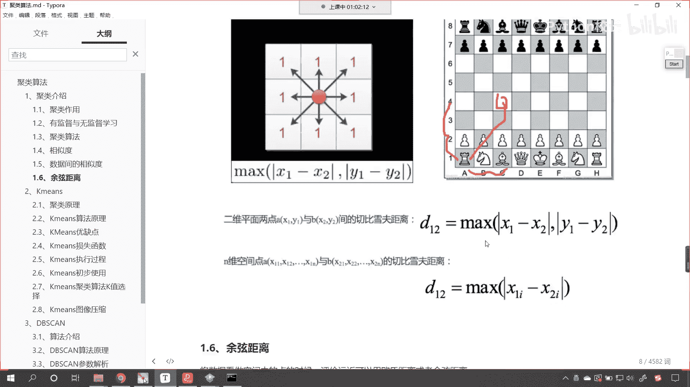

这个呢是我们的国际象棋，看到这个是咱们的国际象棋好，那么对于我们的这个国际象棋呢，比如说咱们这个你看这个这个棋子是吧，他怎么着才能走到，看他怎么着才能走到这个点呢，他以最快的速度走是吧，它可以横着走。

它呢可以竖着走，就是有一些啊有一些游戏，它的规则呢嗯和咱们这个是不太一样的啊，你比如说我们中国的象棋是马走日象飞田，是不是好，那炮呢隔着打是不是啊，那你看这就是不同游戏当中的规则。

那我们这个呢看看咱们这个咱们这个游戏呢。

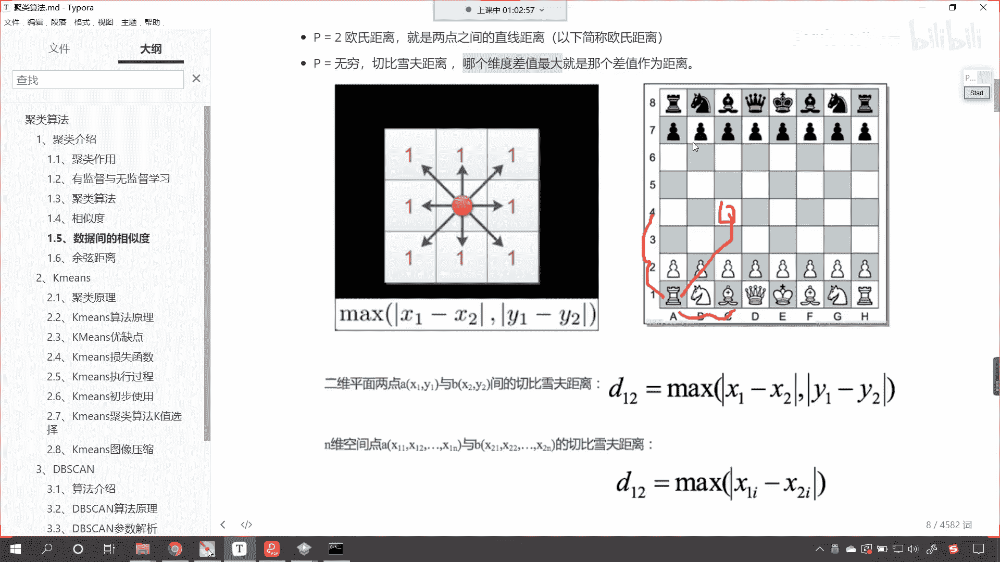

就是你从这个这个点到这个点，你数值是不是走四下，你水平走几下，水平是不是走三下，所以说咱们这个啊，所以说咱们这个子儿他从这到这，那么它最小走的步骤就是三步，就是他水平的。

所以这就是我们切比雪夫距离它的真实当中，它在现实生活当中，它所对应的这个含义，为什么我们p等于无穷，它可以表示哪个维度差最大。

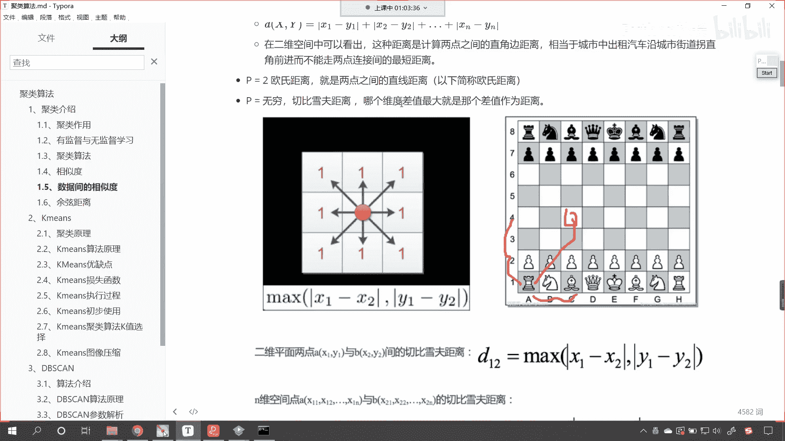

就用它作为距离呢，你看一下咱们的公式。

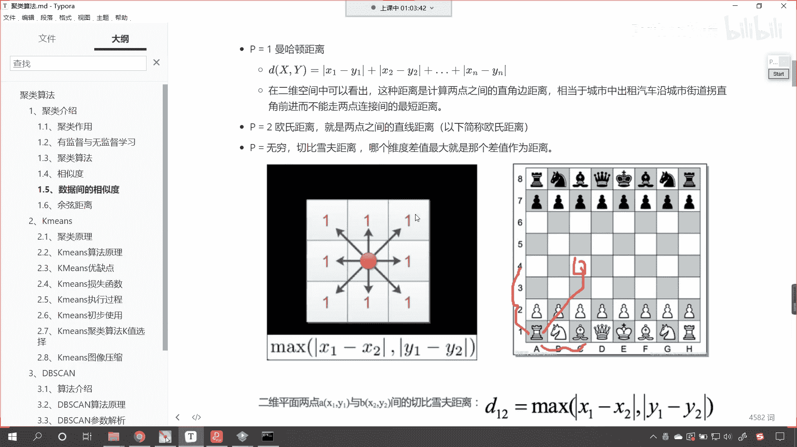

看我们x一减y1 x2 y2 ，那么这个绝对值里边儿，咱们是不是做了一个差呀，对不对，做了一个差，然后咱们进行了什么运算，上面是不是来了一个p啊，p是不是就是它的名词呀，看如果要是无穷啊，如果要是无穷。

那么我们的数据呢会无限放大，无限放大，最后我们是不是又来了一个开平方呀对吧，你看我们又来了一个开平方，那么这个时候呢，因为你是无权无限放大，这个也是无限放大，这个也是无限放大。

但是我们的数据之间是有对比的，看你比如说如果这个是看，如果咱们这个是三，咱们这个是二，那么这个是一他们在进行无限运算的时候，根据数学极限公式是吧，那么你这个二和咱们的一它相对于三来说是吧。

它就远远小于三，看到他就远远小于咱们三的这个无穷次幂，你看这个无穷次幂，是不是就可以用这个来表示呀，看到了吗，无穷次幂它就远远小于三的无穷次幂，无穷次幂，那么我们这个二合一他呢就可以被划掉。

就可以被干掉，知道吗，他们就可以被干掉，最后就只剩下三，那我们只剩下这个三，咱们再开它的p次幂，那是不是就是三呀，看到了吧，它就是三，这个时候你看那个切比雪夫距离，它表示的是什么，哪个维度差最大。

就是那个差值作为距离，看到了你其他的距离只要不大，那么你就突出不出来是吧，只要我一进行无穷运算是吧，你和咱们最大值有一定的差距，你看你是不是就不行了，我就再给你举一个例子哈，东京奥运会是不是刚刚结束。

对不对，看东京奥运会刚刚结束，你就是说你跑得特别快是吧，你你你跑得特别快，或者说你特别厉害是吧，但是在进行颁奖的时候，是不是只有三名运动员会得奖呀，是不是金牌银牌铜牌呀，其他的运动员是不是也特别优秀呀。

对不对，请看其他的运动员也特别优秀，但是呢这个时候你只要得到了金牌，全世界是不是就都认识你了，广告费呀，是不是各种各样的费用全来了，你想你得到了金牌，你所拿到的这个收入和你没有得奖牌，拿到的收入。

那是不是一个天上一个地下呀，对不对啊，所以说你的维度你的差值最大是吧，它就被无限的放大，无限的放大你得到的这个收入是吧，就越来越多越来越多，所以说这是咱们p等于无穷，这个切比雪夫距离它的含义好。

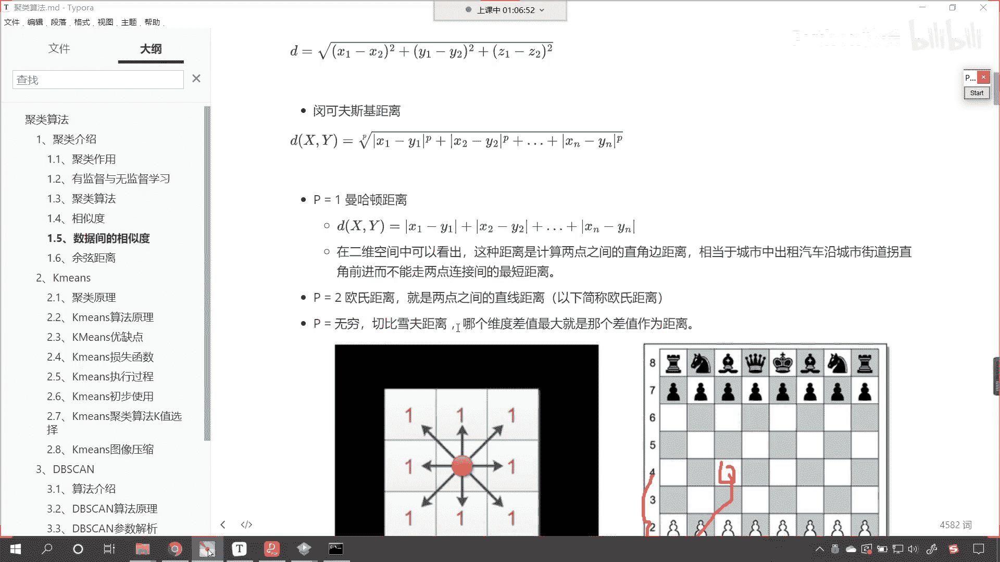

那么我们接下来再看啊，咱们在进行度量距离的时候，我们除了欧式距离外，咱们还有一个余弦相似度，这个是不是就涉及到咱们的三角函数了，对不对，你看这啥是余弦相似度呀，咱们画两个向量，看到了吧，看这两个向量。

你看这两个向量之间是不是就有一个角度，那这个角度我们就把它表示成c塔啊，这个角度就是c塔，那余弦相似度，咱们就可以计算一下我们的cos theta，看了余弦相似度就可以计算cos theta。

那么你想一下，什么时候这两条线它是完全一样呀，看咱们这个取值范围，它是从-一到正一，你想当这个c塔它越来越小的时候，看当这个c塔越来越小，那最小是不是就是零呀，对不对，你看如果这个theta等于零。

那么我们cos 0等于多少，cos 0等于多少，看咱们cos 0等于多少，来学过数学的举手啊，学过数学的好，我们有小伙伴在讨论区里边儿是吧，回复了好，那么它的答案就是一啊，大家看这个一。

那你看这个cos cos 0等于一，cos theta等于一，这表示什么呢，表示什么样的含义呢，是不是他就表示嗯咱们这两条线看，表示是不是咱们这两个向量它完全重合呀，看到了吧，完全重合，你完全重合。

那么它的相似度是不是就比较高呀，那你既然完全重合了，那你想它的相似度怎么样，是不是就是高看，对不对，大家明白这个道理吗，看你明白我所画的图，明白我所说的，我们在讨论区里边来扣一波996啊。

好那么这就是它存在的意义，那么我们呃刚才那个那个度量是吧，咱们是通过距离看，很多时候呢看很多时候呢，这个使用距离呢呃它不太合适啊，你比如说这个文章，你看啊我们有很多写的文章看到了吧，比如说文章的相似度。

这个时候是不是就涉及到咱们的文学了，我们在写文章，在写文学作品的时候，里面是不是都是汉字啊，是不是啊，你看里面都是汉字，那我们怎么去度量它们的相似程度呢，这个时候呢咱们就使用距离哎。

这个时候呢就不太合适了，我们使用这个嗯，我们使用这个余弦相似度，那这个文本文章的操作呢，它涉及到嗯，涉及到我们的向量转化，我们需要把汉字给它转换成向量是吧，我们把需要把汉字给它量化是吧。

你比如说这个我爱你，我们需要把我爱和你对应的这个文本给它，转换成相应的数值，相应的数字，因为计算机它只能对于数字进行加减乘除是吧，各种各种各样的运算，它对于汉字，对于中文它呢只有一个操作。

那就只能进行拼接操作，简单的拼接操作好，那么余弦相似度呢我们可以看成空间当中的点，咱们将数据看成空间当中的点，咱们评价远近呢可以使用欧式距离，或者说使用余弦距离，那这个余弦距离咱们有相应的这个计算公式。

这个cos theta是吧，你看就是a向量乘以b向量，a向量的模，b向量的模，看到了吧，那么展开公式呢就是x1 x2 加上y1 y2 ，然后x一的平方，y一的平方开根号x2 x2 的平方。

y2 的平方开根号，这个就是咱们余弦相似度，那么我们取值范围呢它是从-一到正一是吧，因为这是三角函数，我们知道cos theta是不是从-一到正一对吧，那么咱们这个越缺越趋近于一，它就表示越相似。

越趋近于-1就表示相反，零呢是不是就代表正交呀，这个正交是不是就是直角90度，cos 90度，是不是刚好等于零对吧，我们的余弦相似度，它的应用呢可以来评价咱们文章的相似度，从而咱们对于文章来进行分类。

你像今日头条，现在越来越多的新闻app，他们是不是可以实现对文章的自动分类啊，因为现在的文章是吧，每一个人都可以自媒体都成为自媒体，你可以写越来越多的文章，这个时候我们写的文章比咱们20年前。

30年前写的文章，那就不是一个数量级了，我们没有那么多的工作人员，对于文章进行类别划分，这种事儿呢咱们都交给计算机，都交给算法来完成好，那么呃在这一段课程当中呢。

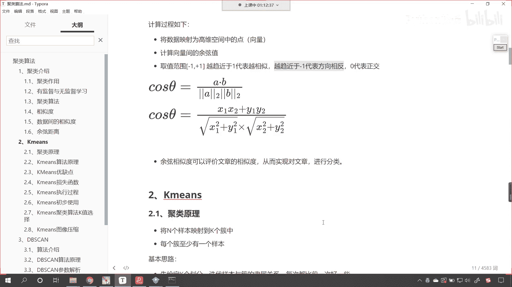