# P142：5-Kmeans算法原理和流程 - 程序大本营 - BV1KL411z7WA

来那么我们接下来继续看啊，咱们这个度量标准，它所对应的算法是不是也很简单呀对吧，这我们之前都学过啊，来接下来我们继续看k means，我们已经使用了k means了，那我们刚才问的问题是。

它到底是怎样的一个原理是吧，我们先看一下k means聚类原理，它呢是将n个样本映射到k个处当中，每个处至少有一个样本，那基本思路就是先给定k和划分，迭代样本与醋的隶属关系，就是你到底划分为哪一类呀。

第一类，第二类还是第三类呀是吧，每次都比前一次要好，迭代若干次，我们就能够得到比较好的，就能够得到比较好的结果，那我们这里所说的迭代其实就是for循环，那具体咱们看一下啊，这k means算法。

它的原理选择k个初始的这个促中心，看怎么选呢，随机选看看咱们随机选，然后逐个计算每个样本到促中心的距离，我们将样本归属到距离较小的那个簇，中心的簇中，每个簇内咱们计算平均值更新促中心。

然后呢我们就进行迭代，现在你就能够看到这儿呢有一个gif动图，大家看看，咱们从头看啊，看从头看我们这里边是不是有三个叉号呀，你看啊这三个叉号你看一开始它是随机选的，哎现在你看一下是吧，一步二步是吧。

你看你有没有发现，咱们这个叉号是不是在移动呀，最后的话我们是不是划分成了红色，是不是划分成了蓝色，还划分成了绿色呀，看到了吧，所以说一开始这三个叉号它是随机给定，啊你看它的循环到底是如何操作的。

刚好是数据的中心是吧，为什么可以是数据的中心呢，因为每个簇内咱们计算了平均值，咱们计算的这个平均值就可以保证，咱们这个这个叉号是吧，它就可以进行相应的移动，所以说你看k means这个算法比较简单。

但是呢它对于数据进行划分的时候，这个功能是很强大的哈，好那么聚类的过程呢如下，咱们刚才看这个动图，你得看好几遍才能够找到规律，看到了吗，看看他一共是12张图片，从零开始看到了吧。

然后一点点是不是移动看到了一点点，移动看到了吧，移动移动移动是吧，哎类别划分开了，那我们看一下它具体的过程如下啊，看a一开始我们就发现你看没有划分是吧，一开始没有划分，那没有划分的话。

我们所有的点都是同一个颜色，接下来呢咱们就选了一个红色的点，选了一个蓝色的点，选了红色蓝色的点之后，接下来我们就开始计算距离，上面咱们有一个文字描述，看到了吧，叫做逐个计算，每个样本点到促中心的距离。

看了一个一个算啊，所以这就是麻烦事儿，看一个一个算，如果距离离他近，咱们呢就划分成红色，如果你这有一些点距离离咱们的黄，这个蓝色的叉号近，那么就把它标成蓝色，你看这个时候是不是第一第一次划分呀。

这第一次划分我们就怎么样，是不是求所有点的平均距离呀，平均距离，这个时候你就会发现这个红色的叉，它是不是就移动到这儿了，看到了吗，红色的叉它就移动到这个位置了，然后我们重复操作，哎你聚类中心发生变化了。

接下来呢咱们重复看到了重复操作，重复操作，这个时候呢我们继续找他最近的地，那你就会发现上面这一类，是不是就变成蓝色了啊，大家看啊，仔细观察，你看你原来这个地方这个点儿是不是红色。

到了这儿他为什么变成蓝色了呀，因为这些点距离咱们新的蓝色的距离中心，是不是比它距离红色聚类中心，这个叉号要要近呀对吧，因为它距离咱们蓝色的这个叉号要近，所以说所以说呢根据距离演进，根据距离远近。

咱们是不是就可以进行类别的重新划分呀是吧，你划分之后，然后再怎么样再一次去移动它的聚类中心，你看你原来这个聚类中心在这儿，现在怎么样，是不是又向中心进行了移动呀，红色的叉号也是看到了吗。

红色的叉号原来在这儿，你看现在是不是移动到这了，所以它越来越他经过这样的这个for循环，一次一次的去移动，一次一次的去重新计算，到最后看到最后他就计算不动了，到最后呢咱们这个类别也就刚好划分成功了。

看到图你是不是就知道它的原理是怎么样了呀，这就叫意图顶千言来，那我那么我们接下来继续看啊，咱们呢看一下咱们这个k means它的优缺点，优点呢简单效果不错，缺点呢它对于异常值敏感，对于初始值敏感。

对于某些分布聚类效果不好。

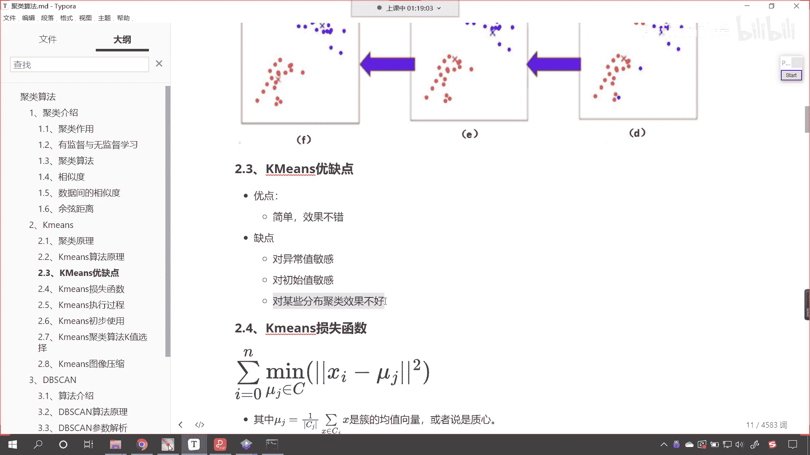

你呃你能够发现，咱们刚才在代码当中执行代码的时候。

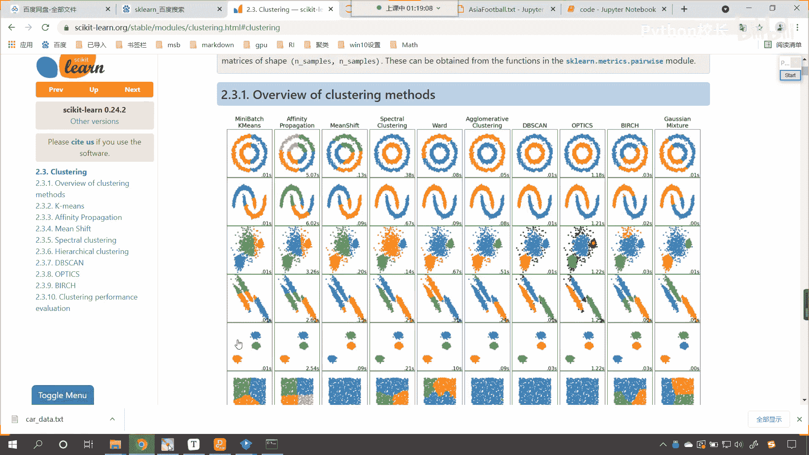

我们这个地方说再次执行，咱们所执行出来的结果，是不是就和我们第一次执行出来的结果，不太一样呀，你想一下为什么。

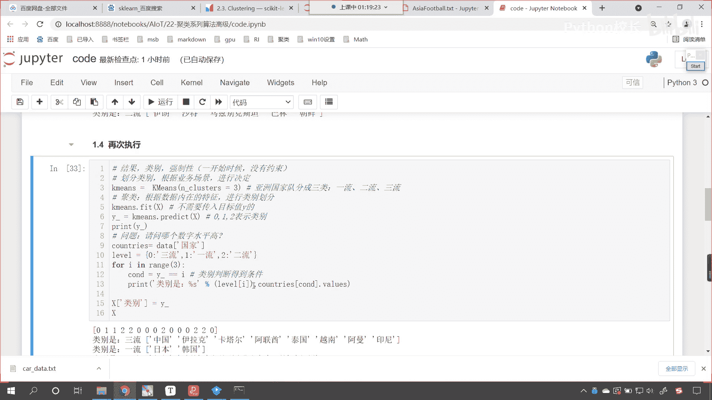

是不是就因为咱们在进行聚类的时候，我们是不是给它随机选择了它的聚类中心呀，所以它带有一定的随机性，那带有一定的随机性，就会导致咱们的结果唉会发生变化，还有呢它对于异常值比较敏感。

那你看我们k means，咱们是进行聚类是吧，那这个时候如果要是有一个异常值，你想一下，这个时候如果要是有一个异常值，咱们假设说这个异常值离得老远了啊，在这儿呢啊。

你想这个异常值是不是就会影响咱们的平均呀，那么有可能我们红色的这个差，看它会跑到哪儿呀，你看他是不是就可能会跑到这儿呀，看到这个红色的叉就有可能跑跑到这儿，因为你看你有一个异常值。

这个异常值是不是在这个位置看到了吗，这个异常值它在这个位置，所以说这个异常值呢，就会影响咱们聚类中心的位置，所以这是他所说的这个对某些分布是吧，聚类效果呃，这个异常值敏感，还有呢对某些分布它的效果不好。

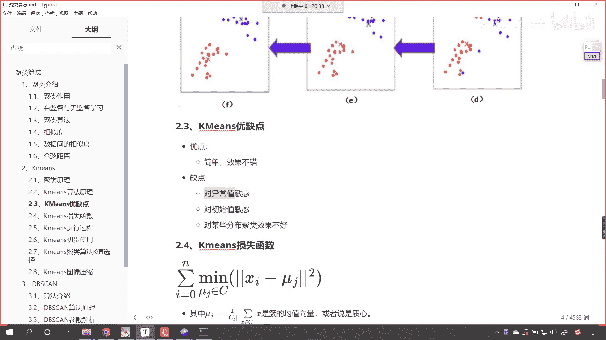

那我们就进入sk learn的官网，我们现在就能够发现，它对于这样的分类效果不好，你看啊，他对于这种如果我们要对于这种数据，咱们进行类别划分的话，你能够看到里边儿是不是一个活儿呀。

右边这个外边是不是也是一个活，那你看我们划分是不是，就是左半部分是一个类别，右半部分是一个类别，你看啊，咱们的db scan就可以很好的对这种数据划分，就是外边这一圈是一类，里边这一圈呢是一类。

是不是啊，所以说嗯咱们课件当中所说到的。

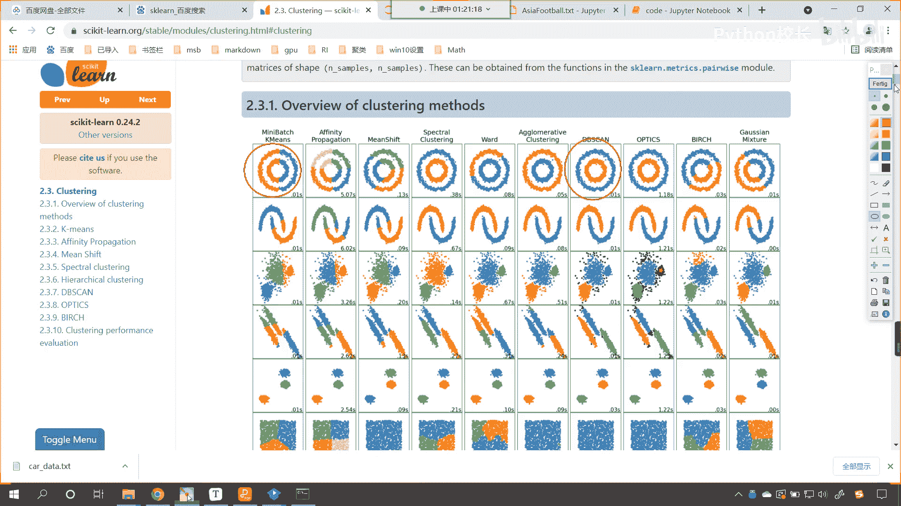

它对于某些分布聚类效果不好好，那么咱们接下来再看一下咱们k means，他的这个损失函数啊，它的损失函数呢，我们就是xi减去mu g这个mg是什么，就是咱们簇的均值向量，我们可以把它叫做智新。

就是咱们上面看到的这个图这个叉号的位置，红色叉号的位置是吧，那这个就是咱们的meal，那咱们怎么才算是把这个类别很好地划分了呢，嗯看怎么才算是把类别很好的划分了，每一个样本减去咱们的嗯这个质心是吧。

它的平方，这个我们求了绝对值，让它最小，它让它最小就是所有的数据是吧，分完类之后让它最小，这个时候呢，这个时候嗯就说明咱们的效果最好了啊，就是xi就是你看xi代表每一个样本，mj呢就代表你的聚类中心。

如果你的聚类效果比较好，那你想这个样本它是不是距离所有的样本，它是不是正好在中间，是不是就比较均匀，那比较均匀的话，这个时候咱们的分类效果就会好好。

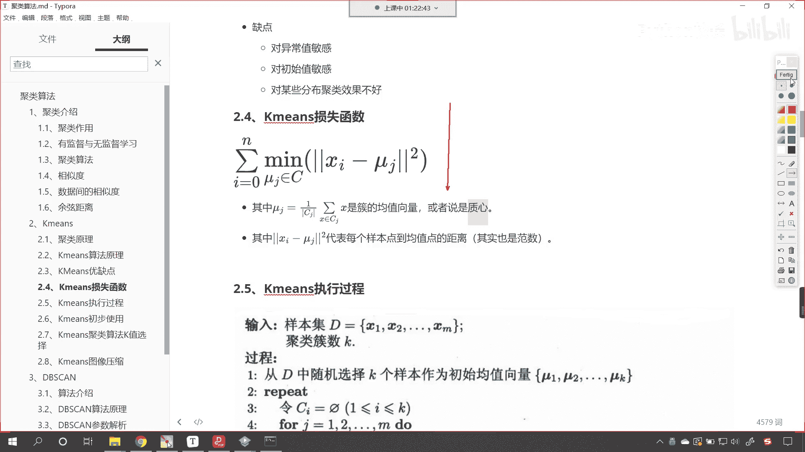

那么接下来咱们继续往下看啊，好那么这个根据咱们上面所介绍的聚类原理，它的优缺点，这个算法的原理。

那么我们k means它相应的执行过程呢，大家看就是咱们这张图片所描述的。

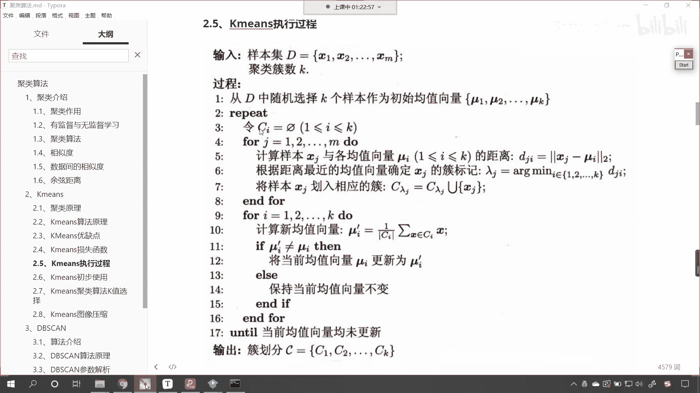

它的执行过程好，那你比如说我们给定了样本及d看到了吧，x1 x2 x m是吧，咱们给定了聚类的聚类的这个分类。

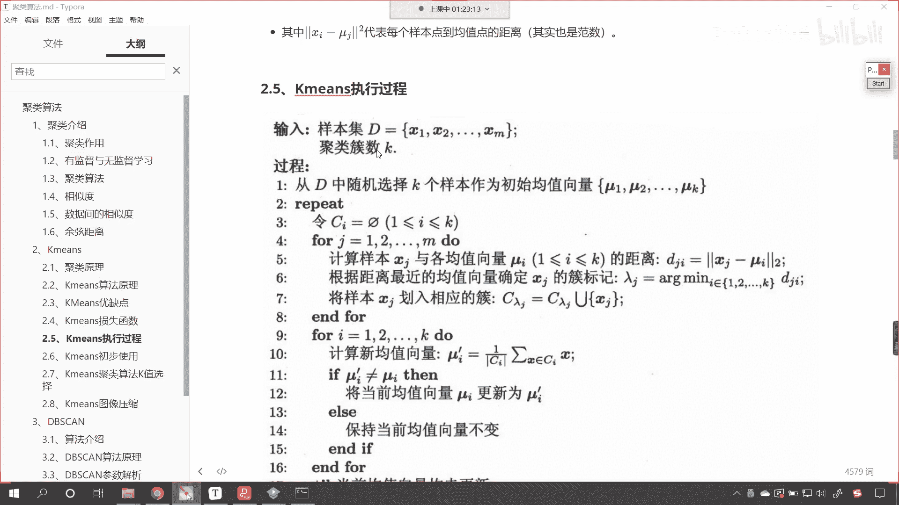

要把它分成k类，那是怎样的一个过程呢，他从d当中随机选择k个样本作为初始的均，作为初始的均值向量m1 m2 mk，然后接下来呢咱们就进行repeat，这个repeat其实就是for循环是吧。

然后呢我们你看进行了一个for循环是吧，121直到m咱们怎么样，这个时候是不是就开始计算距离了，你看到了吗，这个for循环就怎么样，看到了吗，计算距离你距离近，咱们就把它划归到相应的处当中是吧。

其实不就是比大小吗，计算出来的距离比大小，然后呢看啊咱们再一次进行for循环，大家注意两次for循环，上面这次for循环它的作用是什么，看上面这次for循环，咱们呢是为了化归类别。

看是不是为了划归类别呀对吧，然后接下来又有一个for循环，这个for循环是什么，是不是咱们重新计算它的质心呀，看重新计算质心嗯对吧，也就是相当于是这个我们叫做移动，咱们的聚类中心啊。

这叫移动聚类中心是吧，这是移动积累中心啊，你看我们这儿呢有一个退出条件，咱们这个退出条件大家仔细找一下啊，看这个退出条件是不是就是if ui，它不等于你看if ui是吧，撇不等u i z。

我们将当前的均值是不是更新为咱们的ui啊，对吧，你看最后呢就是当所有的均值向量均未更新，所有的均值向量均未更新，这个时候，就说明你找到的这个聚类中心就最合适，那我们就可以停下来了。

看了那咱们就可以停下来了。

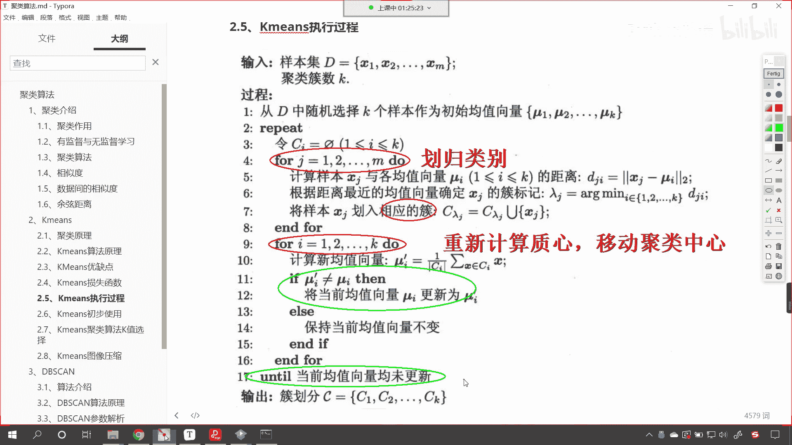

所以说你根据咱们这张图片是当中的这个过程。

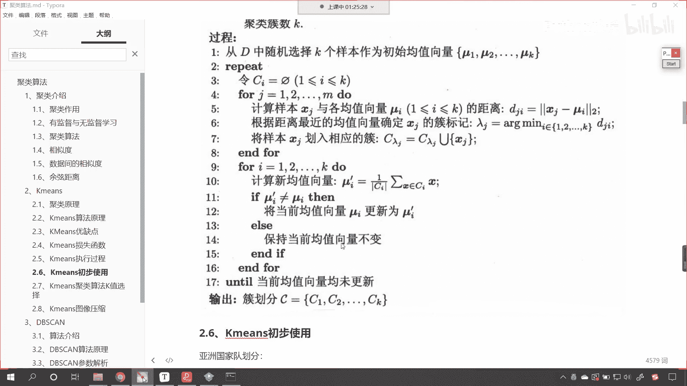

是吧，嗯那你就可以知道咱们聚类算法k means。

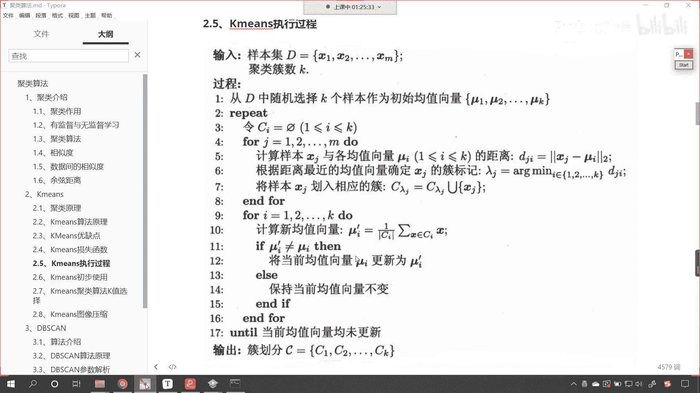