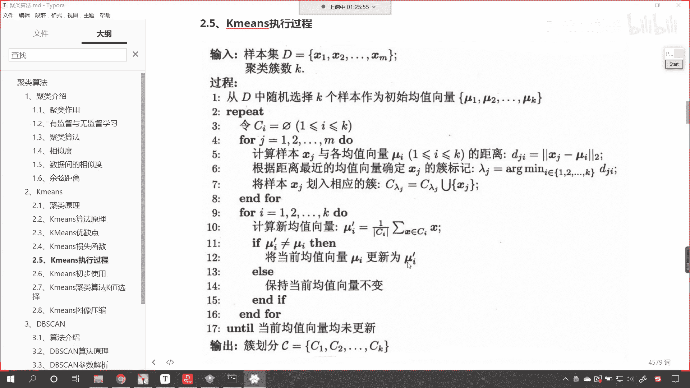
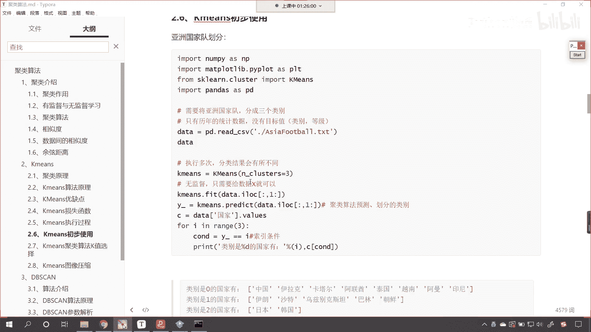
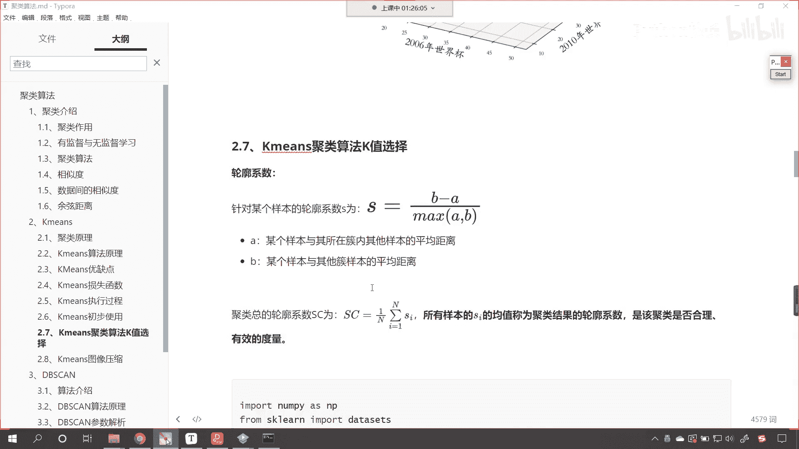
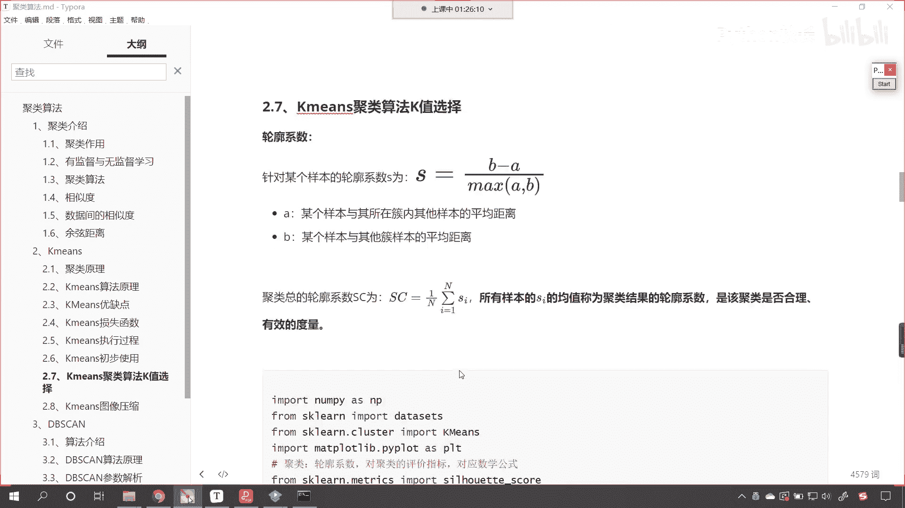
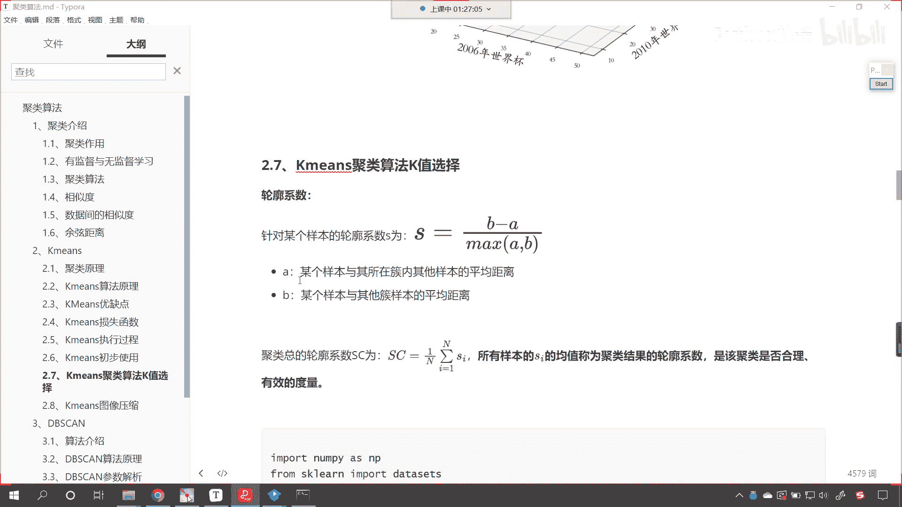
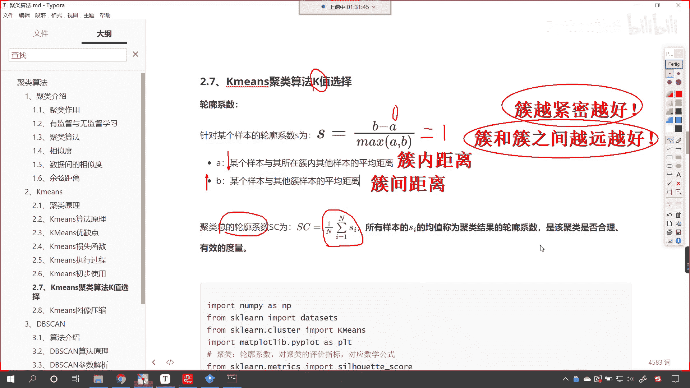
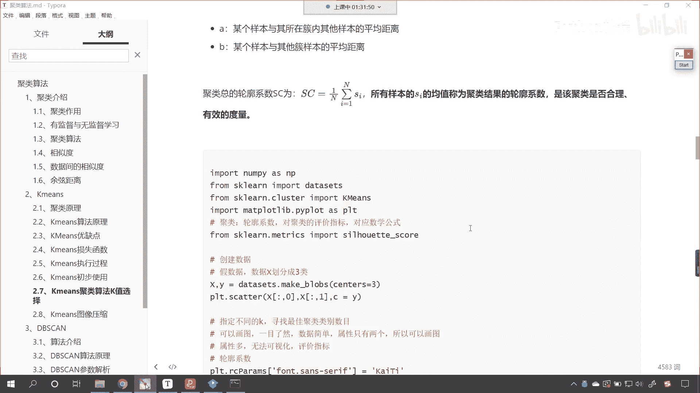

# P143：6-聚类评价指标轮廓系数 - 程序大本营 - BV1KL411z7WA

好那么接下来咱们继续往下看啊，咱们已经使用k means对亚洲队进行划分了。

是不是好，那么。

接下来呢接下来呢咱们继续往下看。

那么现在有一个问题，这什么问题呢，就是咱们k means聚类算法，这个k值该如何选择，刚才在讨论区里边也有同学问到这样的问题，说我们到底把它分成几类呢，那这个k是不是就表示咱们的类别呀，对吧好。

那么到底分成几类效果比较好呢，我们在这里给各位介绍一个它的度量指标，它的评价指标之前咱们在讲分类的时候，咱们的评价指标是不是准确率呀，咱们在讲回归的时候是不是有r2 ，我们除了r2 。

是不是还有军方误差ms啊，咱们上传到天池工业蒸汽量预测是吧，那个里边他用到的就是军方误差，对不对。

那啥是轮廓系数呢，看针对某个样本，它的轮廓系数s看真的有个样本，它的轮廓系数s呢就等于b减a max，a和b分母上是a和b的最大值，分子上是b减a什么意思呢，看这个a代表什么。

某个样本与其所在处内其他样本的平均距离，看到了吧，a呢表示促内的平均距离，b呢就是某个样本与其与其他促内与其他这个，大家看看这个是其他与其他促样本的平均距离，我们把这个叫做促间距啊。

我们把这个叫做促间距，上面叫做促内啊，这叫做促内距离，一个叫促间，一个叫促内啊，这叫做促距离，下面这个就叫做醋煎，那簇内距离是不是表示一簇呀，你现在设想一下，咱们想要对数据进行聚类进行划分。

我们把它划分成不同的醋，不同的类，那我们是不是希望这个醋它越紧密越好呀，啊它越紧密是不是就说明越好，你看越紧密就怎么样，是不是就说明越好，这个没问题吗，大家能理解吗，就是你既然分成了一簇。

你这个簇越紧密越团结，是不是说明分得越好呀，好那么我们促和促，因为我们可以将数据分成多簇是吧，那就是促和促之间怎么样呀，是不是越远越好，对不对，你看它就越远越好好，那么你看我在这儿呢就写了两句话。

一个是促内，一个是促间来，这两句话大家能够理解的，在我们的讨论区扣一个1024啊，也就是这两句话，看醋越紧密越好是吧，你是一团，那就好了是吧，这说明你醋和醋之间呢越远越好好，各位小伙伴都明白，是不是啊。

那你看a表示什么，看到了吧，a表示什么，这个a看到了吗，a表示什么，是不是样本与与其所在促内，其他样本的平均距离呀，这个是不是就是表示促内什么时候，它是完全一簇呀，当这个a距离是零的时候，你想它是不是。

就就你所有的样本点儿都落到一起了，是不是啊，那b你看表示什么，某个样本与其他簇样本的平均距离，看到这就是促间，那所以说我们这个聚类分的好，什么样的标准呢，就是a看越小越好，这个b呢越大越好。

说明你促和促之间离得远是吧，这个a呢促内的点离得近，那你看我们要如果要将a和b带入到，咱们这个方程当中，你看到了吗，这就是轮廓系数，因为分母上是b减a，分子上是max，这个a到b。

那你想它的最大值是什么样的一种情况呀，最大值是不是就是这个看最大值就是a等于零，你a等于零，我们求解出来的结果，咱们的轮廓系数它是不是就表示一呀，看到了吧，轮廓系数就表示一，这个时候那你进行聚类是吧。

效果非常好啊，这个时候就是效果非常好，那我们这儿说的是这个一类，那当然你看这个聚类总的轮廓系数呢，看我们刚才是计算了这个两簇是吧，因为我们可能有k粗点，上面我们是计算了两，咱们上面是计算了两处。

那当我们总的轮廓系数，其实就是对他求了一个平均值，看到了求了一个平均值，那么这个轮廓系数呢越大越好，它呢是咱们聚类的一个衡量指标好。

