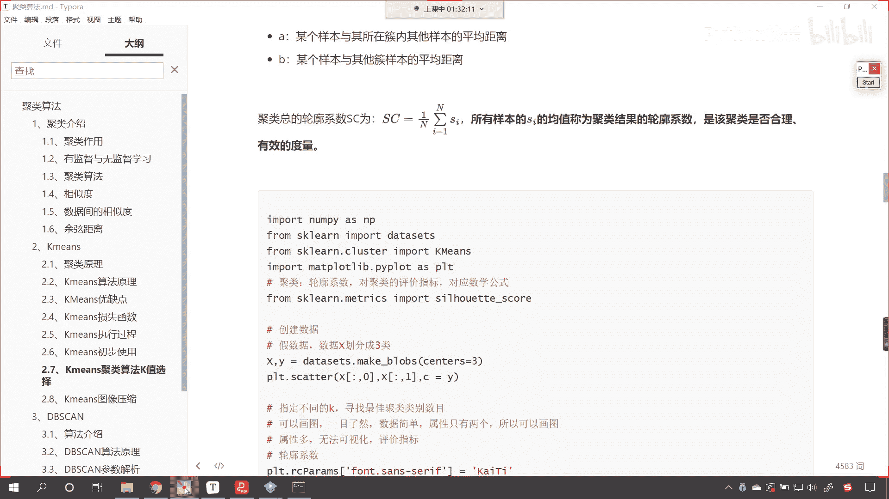
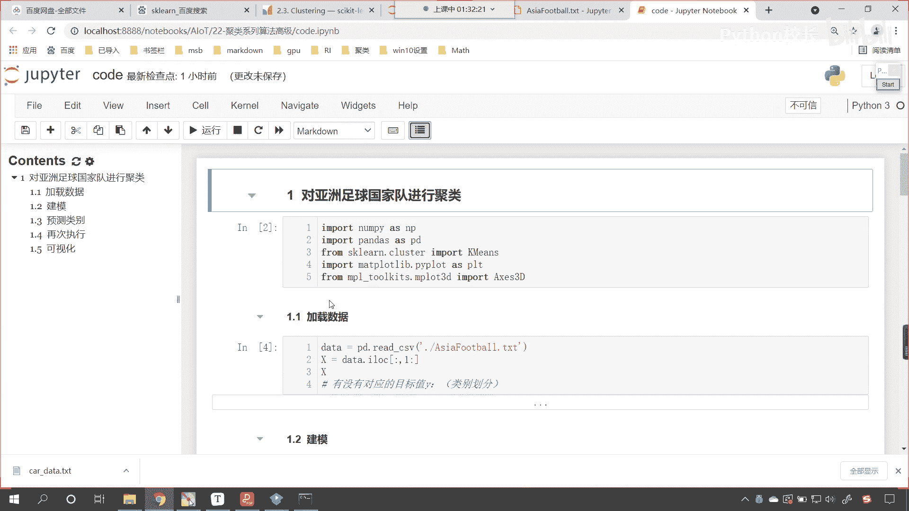
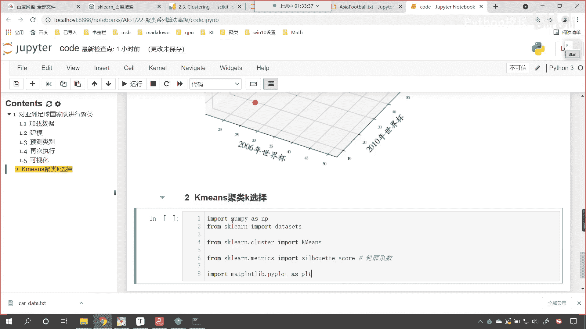
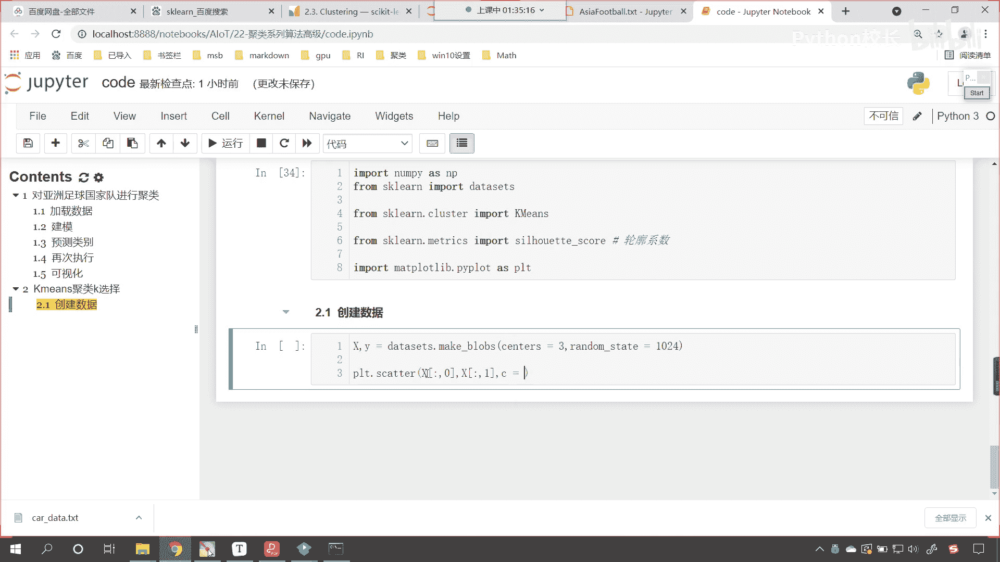
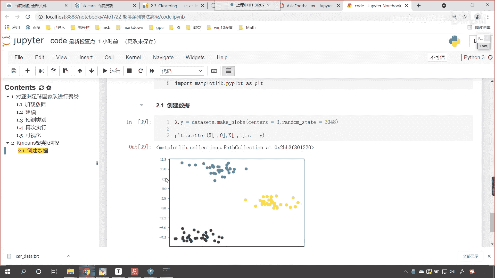
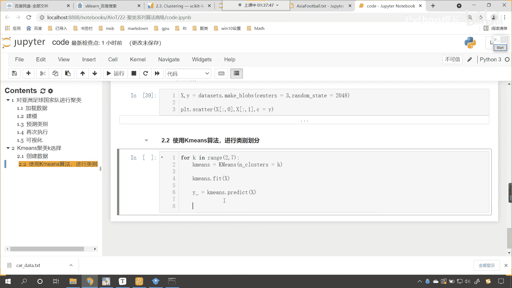
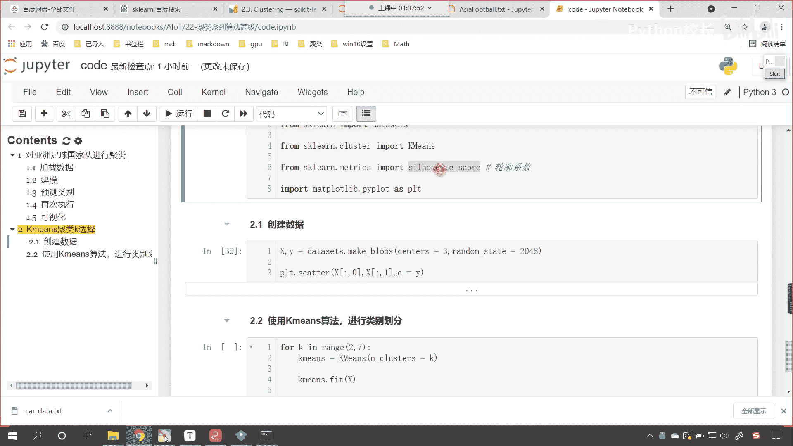
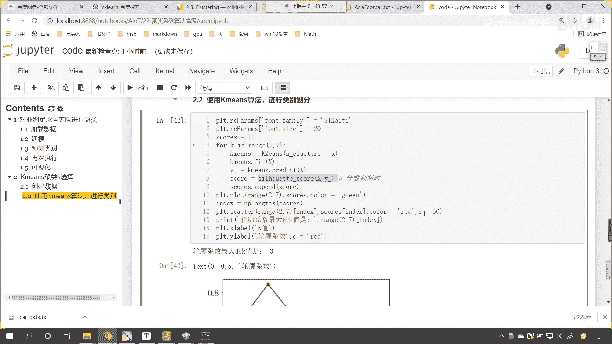

# P144：7-轮廓系数使用 - 程序大本营 - BV1KL411z7WA

来那么接下来呢我们就使用代码。

咱们来演示一下啊，来咱们现在呢回到我们的代码当中。

咱们重新刷新一下啊，看这个时候呢我们的目录就出来了。

那我们往下滑，在这儿呢我们来一个三级标题好，那么这个呢就是咱们k means聚类呃，咱们k的选择好，那么我们导一下包，咱们import numpy as np，我们from sk learn。

从这个当中呢，咱们import data sets，然后呢from sk learn，我们从cluster，从聚类这个子模块下，咱们导入k means，我们将k means导进来好。

那么我们刚才介绍的这个评价指标呢，咱们也把它导进来，那么这个就是matrix，从这个matrix当中咱们导入叫做silly halted sc，这个对它进行一个说明，这个就叫做轮廓系数。

啊这个就是咱们的轮廓系数，然后呢咱们再导一个包啊，我们画图from咱们import mat plot lib，点piplot，起一个别名plt执行一下好。

接下来我们就创建数据，咱们来一个四级标题诶，大家看啊，现在呢我们就创建数据，那么创建数据呢咱们就使用data sets，这个里面有一个方法叫make嗯，嗯调用data sets里边的方法叫make。

make blobs，那这个方法呢咱们给它一个center啊，这个center等于三，就表示我们要生成三类，那么这个里边呢还有一个random state，因为如果我们要不给random state。

那么它每次生成的数据都会不一样，来咱们plt。scanner，我们把这个数据给它显示一下好，那么创建了这个数据，我们用变量来接收一下x和y，x表示咱们的数据，y就表示咱们的类别。

那么这个数据shift tab咱们看一下这个方法，它会为我们生成100个点，每一个点呢两个特征，两个特征是不是就表示咱们x轴和y轴呀，这个刚好可以画出来，那这个center我们在指定。

我们在这里指定了就是三，还有你看center box是不是它的范围呀，cluster s t，cluster s t d，是不是这个数据它的一个标准差呀，我们生成的这个数据是一个正态分布的啊。

好那么咱们就画一下吧，大家看现在我们给一个x中国二冒号零，这就相当于横坐标x中括号冒号一，这个就相当于纵坐标给一个颜色。

颜色就等于咱们的y这个时候你看过一执行，大家现在来看这个数据是不是就出来了，你看我们给1024，这个效果不好，咱们现在呢把这个随机数给他切换一下，我们给一个256啊，256这个分的也不太好。

咱们给一个512啊，我们希望这个数据分的分的比较开一些，你看这个512也不行是吧，咱们来一个996是吧，996呢你看分的也不太好，来咱们再给一个啊，2048，看一定能分开。

现在你看这个分的是不是就比较好了呀，黄色的点，这个蓝色的点，还有紫色的点，是不是咱们就用这个来举例啊，好我们知道咱们所生成的数据，它是清清楚楚，明明白白。

是不是分了三类，现在我合起来计算机知道吗，计算机是不是不知道呀，对不对呀，你看啊，此时咱们的计算机是不知道的啊，那计算机不知道，咱们现在呢就是让计算机帮我们分类，咱们来一个四级标题。

咱们呢就看这个时候呢咱们就使用，k means算法，我们来进行类别划分对吧，你看咱们进行类别划分，那这个时候有一个问题，咱们该分成几类呀，对不对，我也不知道是吧，那你看到上面的数据，你知道是吧。

因为这个数据是我创建的，对不对，我所以我们知道，但是计算机这个时候他不知道是吧，那我们就这个让计算机来帮我们选择吧是吧，咱们来一个for k in range，我们从二一直到七，让计算机帮我们选择是吧。

那我们选择的话，咱们当然选择一个比较好的，是不是来这个时候呢声明算法，那就是k means，小括号里边的第一个参数就是n cluster，cluster等于谁，就等于咱们的k ok。

这个时候你看算法是不是就有了，然后呢我们就使用k means，咱们就进行训练，我们将数据x放进去，咱们feat一下，看这个时候就有了好，那么有了之后呢，你的预测值是多少呀，那就是y杠。

咱们调用k means。predict好，我们进行一个预测，那就是predict，咱们将x放进去好。

那么咱们刚才呢介绍了轮廓系数。

那我们就让轮廓系数来帮我们计算一下好不好，那咱们就调用silly halted score，这里边两个参数，一个呢咱们给一个x，另一个呢咱们给一个label啊，一个是给一个x。

另一个咱们给一个label，那这个label是什么意思，我们往下滑看他对于这个参数有说明，看什么是labels呀，predicted labels for each sample。

是不是就是咱们算法预测出来的类别呀，对不对，就是咱们算法预测x就是咱们的原数据，那么我们就将x放到这儿，咱们就将y杠放到这儿，你想它是不是会得到一个分数呀，好那我们就叫杠六个for循环。

咱们是不是会得到，你看咱们是几个啊，你看啊，23456是吧，六个for循环，那我们是不是会得到六个分数呀，那么我们就在for循环外面，咱们声明一个列表叫scars，每一次得到了这个轮廓系数。

咱们就将这个分数呢放到咱们轮，放到咱们score当中，唉你看这个时候是不是就有了呀，然后呢我们进行画图啊，看此时咱们进行画图好，那么然后咱们进行画图好，那么画图的话，咱们就这个，把它画出来。

那就是plt，咱们呢就调用plot方法，我们给的数据啊，咱们给的数据是不是从2~7呀，我们就给个2~7，那么我们的分数呢咱们就给一个cos，这个时候呢我们给一个颜色。

咱们让这个color呢等于green，那这个图形画出来了，然后呢咱们给它一些标签，那就是x label，这个就表示横坐标轴，横坐标轴呢这个就是咱们的k值，然后我们再给一个纵坐标轴。

纵坐标轴叫y label，那这个y label呢就是我们的轮廓系数啊，这个就是咱们的轮廓系数好，那么我们的轮廓系数呢，咱们也给一个颜色，这个c呢就让它等于red，那这个里边大家看我们是涉及到了。

看这里边是不是也涉及到了，咱们的这个嗯字体呀，中文字体，所以咱们就plt。r c params，我们对它进行一个设定，那这个时候呢咱们就给一个font family，我喜欢使用楷体。

咱们就来一个s t楷体，然后呢我们统一设置一下它的字体大小，print rc params中括号找见fasize，咱们让它等于20好，这个时候你看我一执行诶，现在你就能够看到。

看这个轮廓系数是不是就出来了，那你能够发现什么时候，这个轮廓系数它是最高值呀，看什么时候它是最高值，现在那这个很简单啊，嗯咱们的调用np点里边有一个方法，是不是叫做阿，嗯叫做arg max。

咱们来一个小括号是吧，那这个arg max呢，咱们就将这个score 4放进去，这个时候呢我们是不是就会得到一个索引呀，叫index，咱们根据索引咱把它的最大值给它画出来，那就是plt点。

scanner来一个小括号好，那么我们呢就从range当中看，它不是2~7吗，来一个中括号，根据这个index把它取出来，咱们从scarce当中也根据这个index把它取出来，我们给一个color。

我们让这个color等于red，咱们给一个s，我们让它等于50，这个时候你看我一直行，你就能够发现，看这个最大值点是不是就是这个呀，打印输出一下啊，看咱们就print一下啊。

好那么我们将range小括号2~7，这个不是表示咱们的k值吗是吧，我们将index放进去打印输出一下，在这儿给他来一个文本标记，那么我们轮廓系数看，这叫做轮廓系数最大，他的这个k值是你看哎一直行。

你看轮廓系数最大的k值是三，你想一下为什么，你看你想一下为什么，因为我们所给的数据，因为咱们给的数据是不是就是清清楚楚，明明白白分三类呀，现在咱们的算法这个k means是吧，无论我们给他二也好。

还是五也好，还是六也好，最后咱们再进行这个分数判断的时候是吧，看进行分数判断时，咱们就发现是不是当三的时候它最好呀，因为三是标准答案呀，对不对呀，我们给的就是三类呀，三是标准答案。

所以我们就发现你看嗯找出来了吧，是不是啊，你看找出来，也就是说当我们这个k咱们给合适值的时候，那么它所对应的轮廓系数，它的分数一定很高，这个就是咱们的一个判别标准，大家现在明白了吗。

好那么对于轮廓系数怎么用原理明白的，咱们呢就在讨论区。

