# P145：8-聚类评价指标调整兰德系数 - 程序大本营 - BV1KL411z7WA

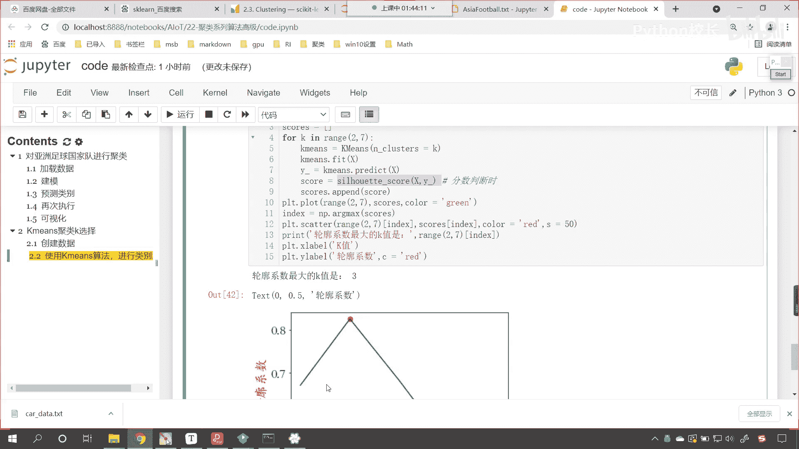

好各位小伙伴，接下来呢我们继续往下看啊。

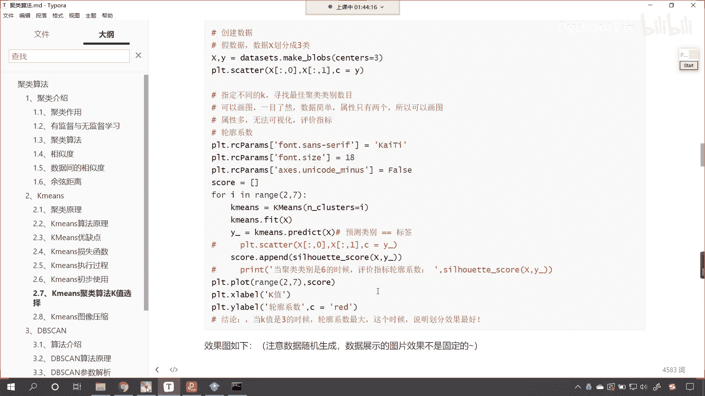

好那么还有一个评分标准，这个评分标准呢叫做兰德系数，这个应用也是比较常见的好，那么这个兰德系数呢它有相应的公式，就是ri就等于a加b，你我们现在就能够发现，你看到了吧。

这个分母上是一个c2 n sample，这个是不是就是一个分母上，是不是就相当于排列组合呀，对吧，你看c就是排列组合，c呢表示我们实际类别的一个划分，这个k呢表示咱们距离的结果，大家注意啊。

这个时候这个k呢它不是我们聚类的个数，它表示聚类的结果，你用其他的符号表示也行，那么我们的a表示什么呀，看a呢为在c中被划分为同一类，在k中也被划分为同一处实例的对对数，简而言之，也就是说划分对了是吧。

记录一下它的个数，那这个b呢为在c中被划分为不同类别，在k中被划分为不同处的实例对数，这个时候他也是对的，也就是说你在c中，你看什么时候我们划分效果最好呢，你想一下是不是c的情况和k的情况。

这两个一模一样的时候，是不是就说明你划分的特别好呀，看他俩一模一样是吧，这就说明怎么样，哎你进行聚类是不是完全划分开了呀，如果c和k是吧，完全一样，你看c如果等等，k一模一模一样。

这是不是就说明完全划分开了，那这个a呢就表示在c中被划分为同一类，在k中呢也被划分为同一处实例的这个数，看了吗，在k中被划分为同一类嗯实力的这个数，那b呢为在c中被划分为不同类。

在k中呢被划分为不同类实例的这个数，所以说那a和b就是画对的一个情况，咱们的分母呢是所有的情况，那这个时候呢，哎咱们看，此时咱们就可以用这个公式来计算，咱们划分的情况了好。

那么呃后面呢又对于这个公式进行了一个改进，那这个改进的就是调整兰德系数啊，他对他进行了一个，他其实也是在兰德系数的基础上进行的一个操，作和这个呃改变，这样的话我们调整兰德系数呢它更具有说服力。

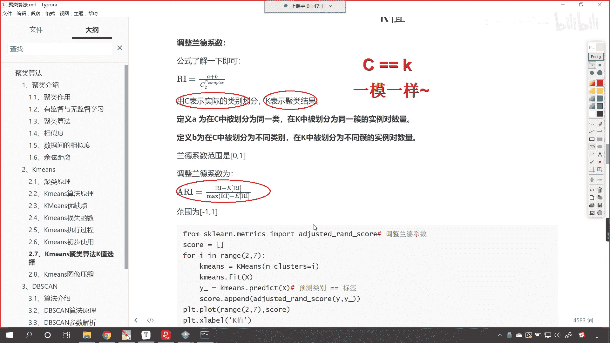

好那么咱们看一下它的使用啊。

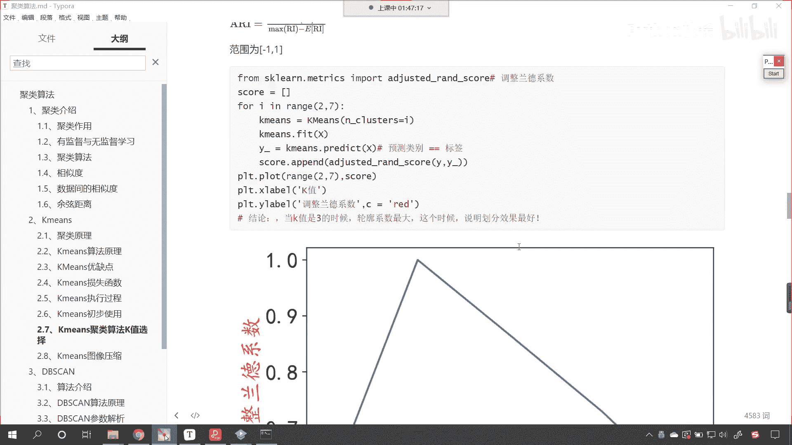

那我们调整兰德系数呢也很简单，现在呢咱们就回到代码当中。

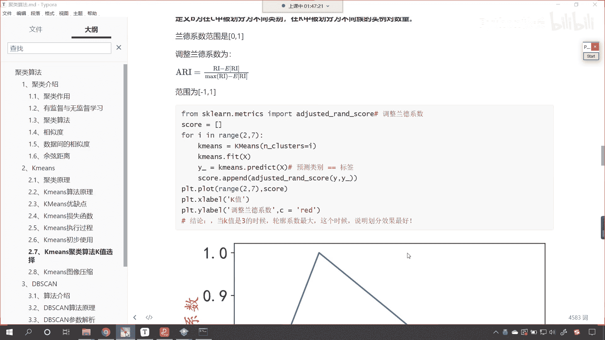

我们导一下包，在这里咱们来一个四级标题啊，这个就叫做调整兰德系数，它的一个使用导一下包，from sk learn，咱们从matrix下面导一下包，import，那就是adjusted run sc。

执行一下代码导包成功了好，那么咱们同样对上面这个数据进行操作啊，那就是for k in range，咱们给一个2~7冒号，这个时候呢咱们就声明k means就等于k means，小括号。

我们的n cluster就等于k，然后咱们使用k means对于数据进行训练，我们x放进去，然后咱们使用k means我们进行预测，predict，我们将x放进去，接收一下这个数据，就叫做歪盖。

然后呢调用adjust adjusted run score，调整兰德系数，在这里，你看我们要给的数据是什么，和刚才是不是就不一样了呀，第一个参数叫label true，label true。

是不是就是咱们的y，第二个是不是就是叫label predict，这个是不是就是咱们预测的呀。

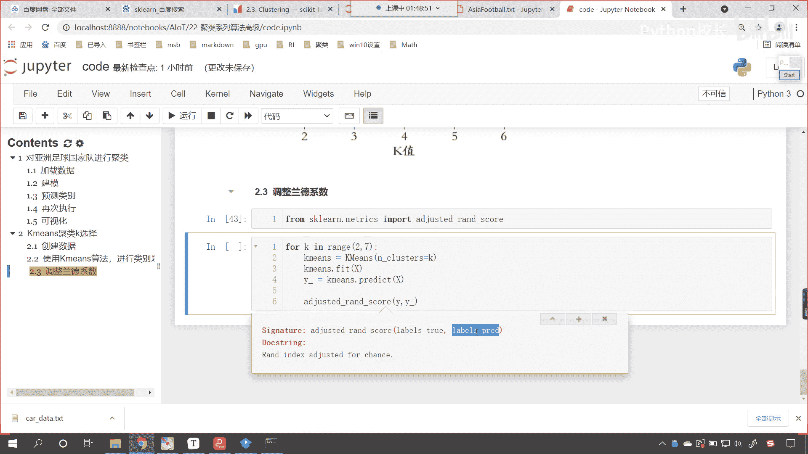

你看咱们上面介绍它的原理看啊，定义a为在c中被划分为同一类，你看我们把c表示什么，c是不是表示咱们实际的划分，那这个是不是就表示y下划线处，那k表示聚类结果。

这个聚类结果它是不是就表示y predict，对不对，你看它呢就表示y predict，你看现在我们嗯就是在写的时候呢，它有的时候它会有这个红色的波浪线啊，红色的波浪线。

咱们可以通过这个文件里边我们看一下啊，这个编辑里边相应的这个设置是吧，我们看段落格式啊，主题我们看一下啊。

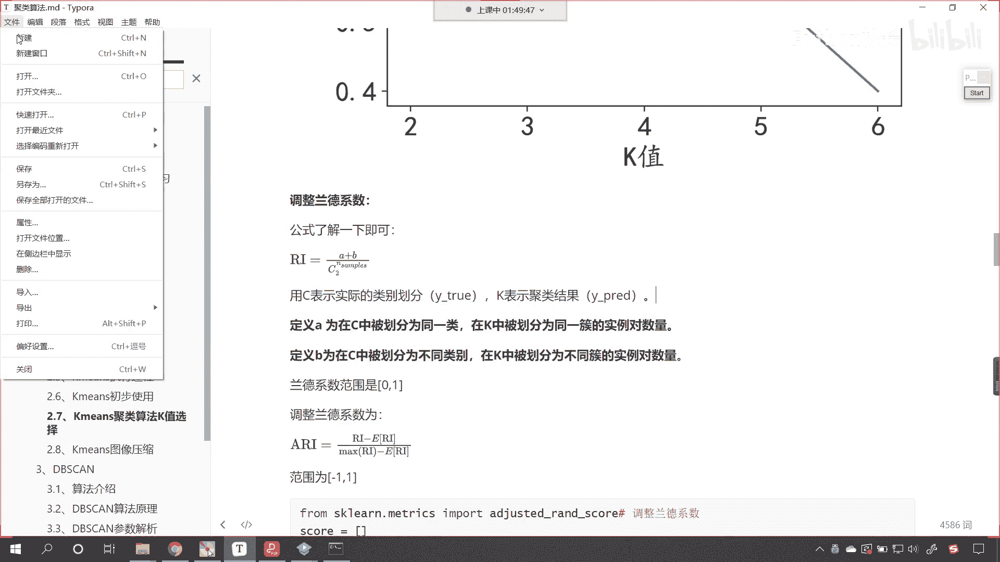

它有偏好设置。

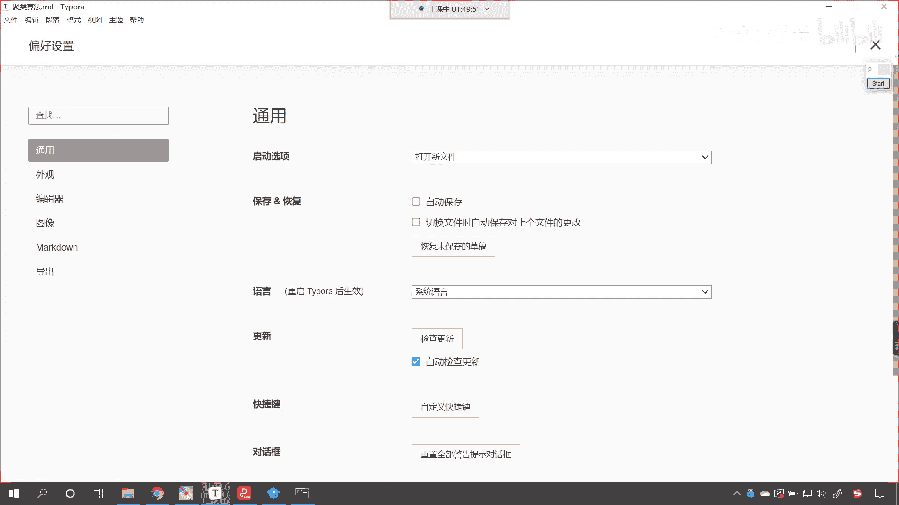

就是红色的话他肯定是一个警告，是不是啊，红色肯定是一个警告嗯，咱们可以让他不显示咱们的警告啊，应该是去语法里边是吧，对应该是去语法啊，我们看一下这个语法在哪里啊，这个拼写检查看到了吧。

只有一个拼写检查是吧，咱们怎么样，这个不使用拼写检查，这个时候就好了。

好现在的话你看就不会有波浪线了啊，好那么你看这个c就表示外出，这个k呢就表示y predict，好，那么来回到这儿呢。

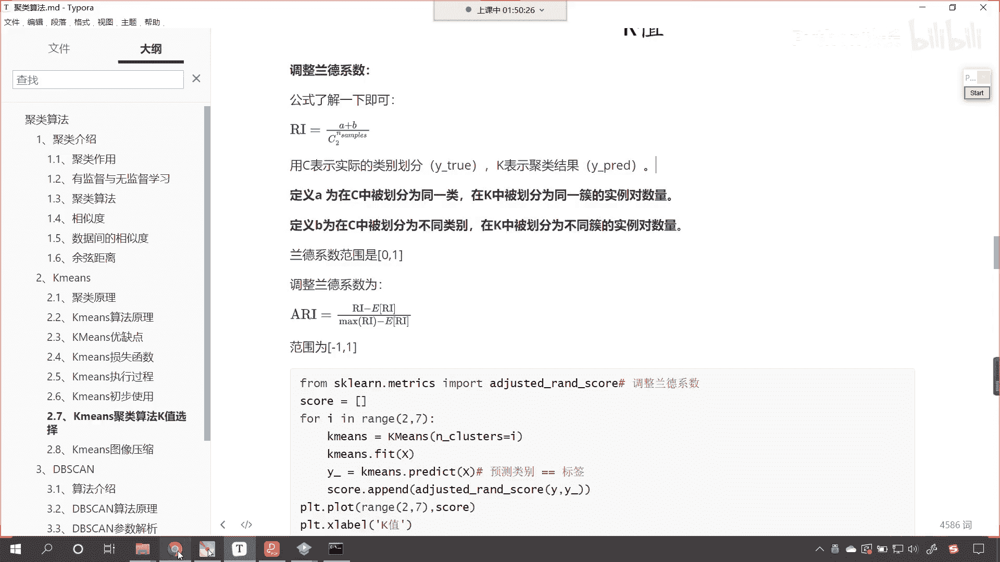

咱们是不是就可以计算出一个score呀，上面咱们也接收一下叫scars，就等于列表好，那么我们每一次for循环计算出来的这个就叫杠，那么我们把每一次计算出来的，放到咱们score这个列表当中。

for循环结束，咱们现在是不是就可以绘制图形了呀，p t。plot啊，咱们就调用range这个方法，依然让他从2~7绘制的数据，就是咱们的scars，我们给一个颜色，这回呢我们给一个红色。

然后呢我们给它一个水平的这个标签好，那么这个呢就叫做调整栏啊，这个是坐标呢，就是咱们k值的选择，看这就是聚类，咱们k值的选择，纵坐标呢我们也给一个plt。y label好。

那么这个呢就是叫做调整兰德系数好，此时你看我一执行来，现在小伙伴就能够看到，你看是不是同样也是三的时候，咱们的效果最好呀，看到了吧，是不是也是三的时候这个效果最好，看到了吧，好那么你看三的时候。

我们这个得分是多少呀，来大家看三的时候，咱们得分是多少，是一点啊，看是一对吧，为什么呀，因为如果我们评价评价的数据，是咱们的标签的话，你想这个标签他肯定就能够这个完全对上，完全相似，是不是啊。

所以说他的分数就是一，而上面咱们的这个轮廓系数，你看它能到达一吗，他到不了，你想一下他为什么到不了一呢，你想他为什么到不了一，因为我们的点儿你看到了吧，咱们的点你就是再是同一类。

你的这个点是不是也有一定的距离呀是吧，你的簇内是不是有一定的距离，促间是不是距离更大，所以这个时候呢他到不了。

明白吗，所以这个时候他到不了，因为我们对应的轮廓系数的公式。

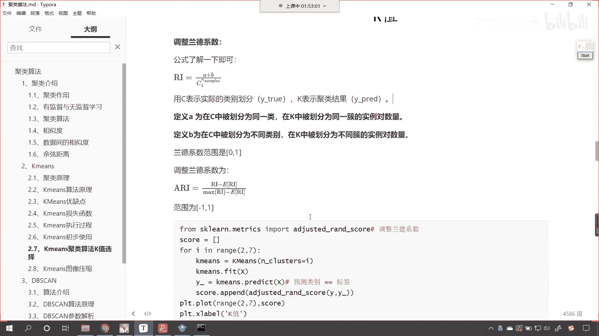

他做了一个减法，是不是做了一个b减a呀。

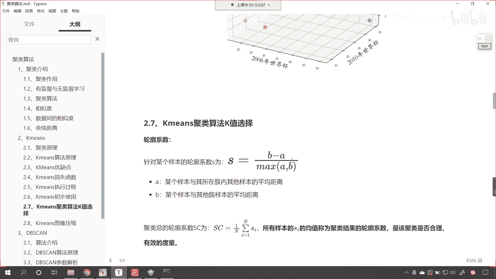

看到了吧，做了个减法，做了个b减a，所以说呢嗯它达到不了好。

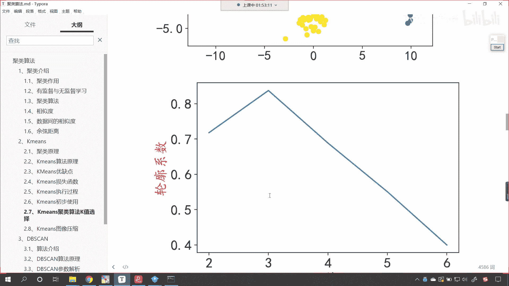

那么这个呢就是咱们调整兰德系数，那咱们作为评价指标也可以来筛选合适的k值。

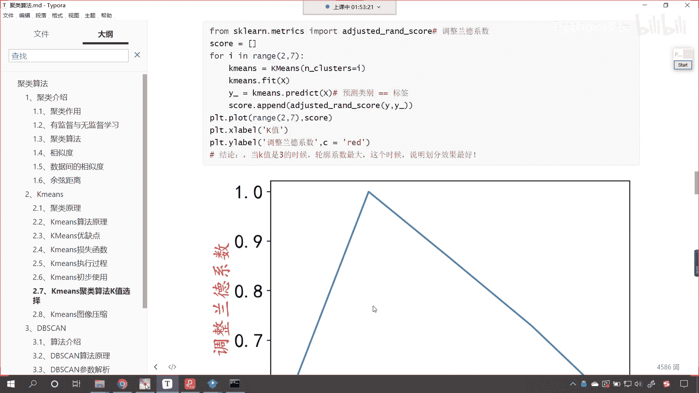