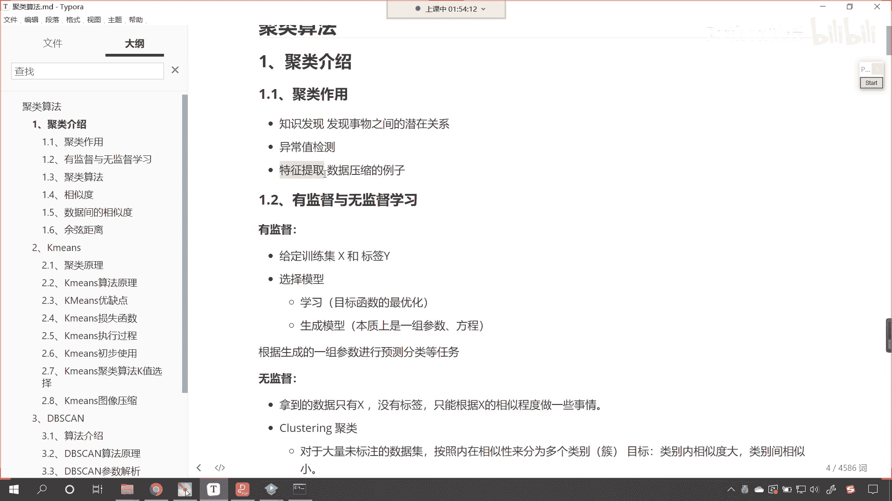
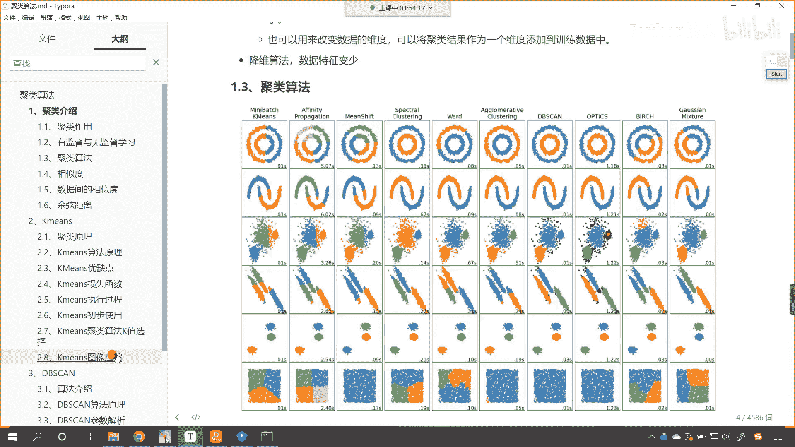
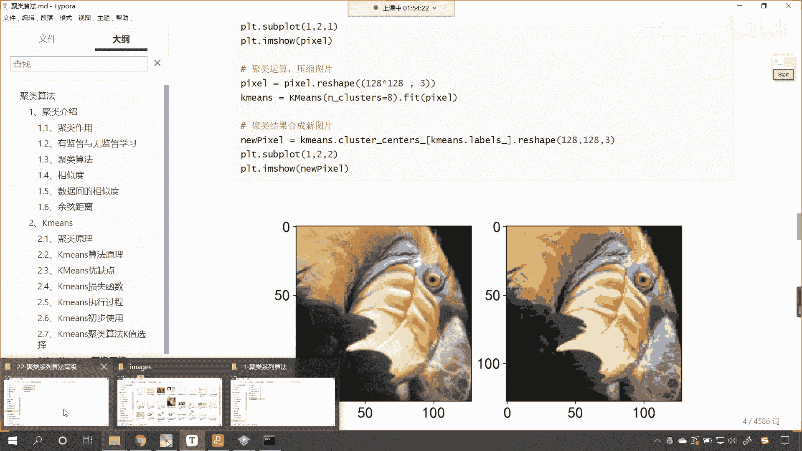
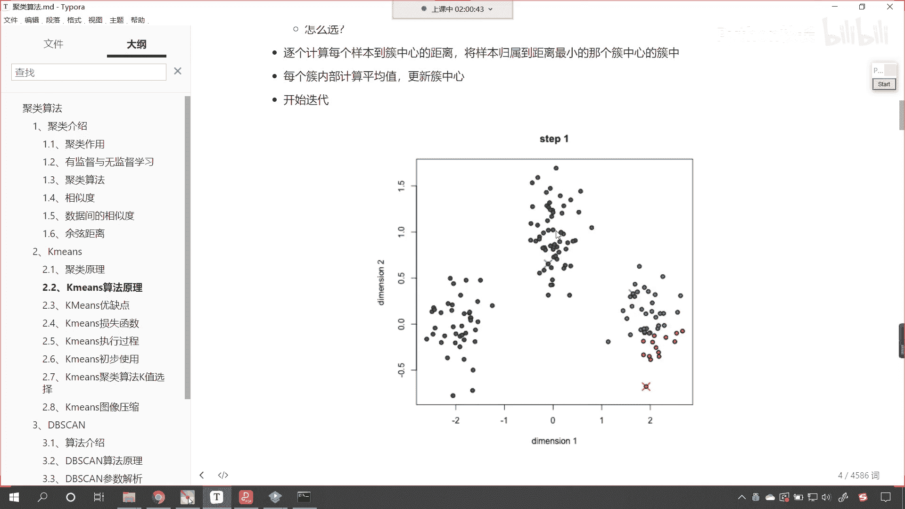
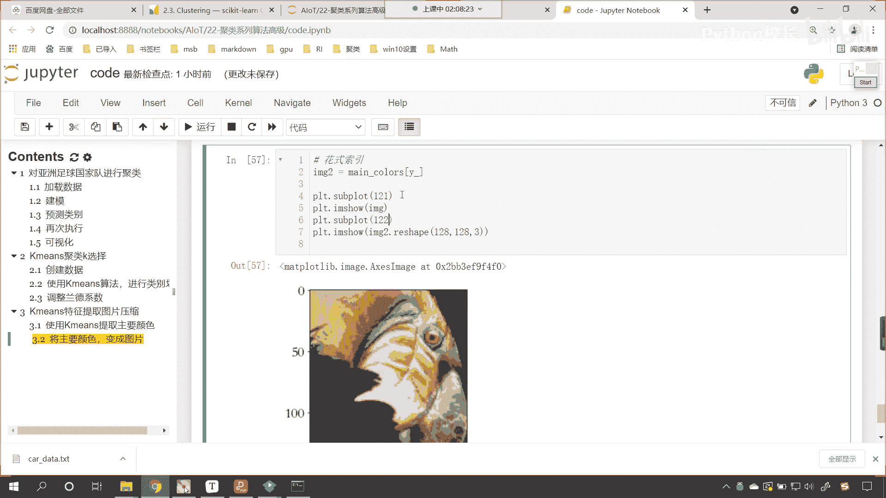
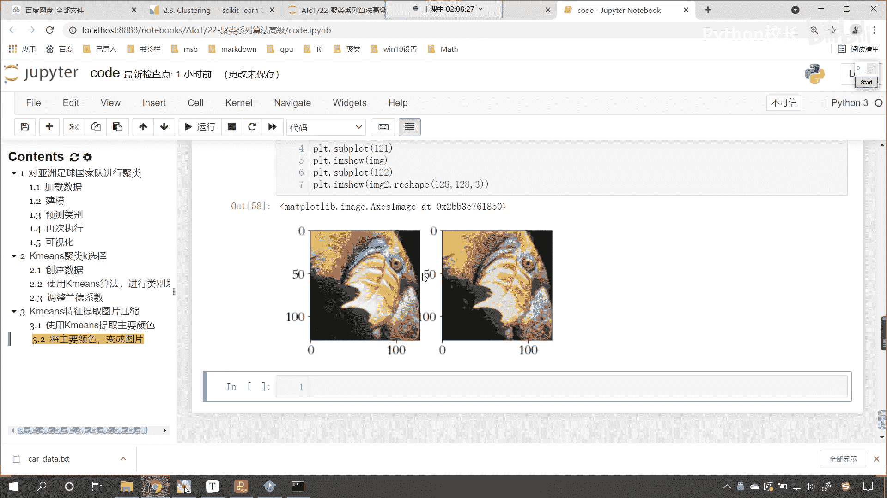
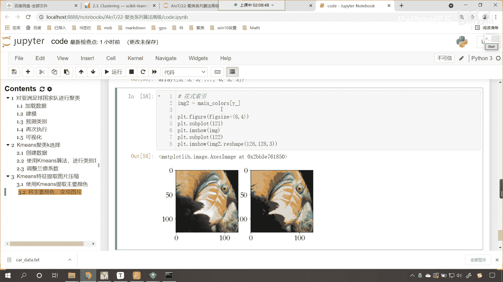
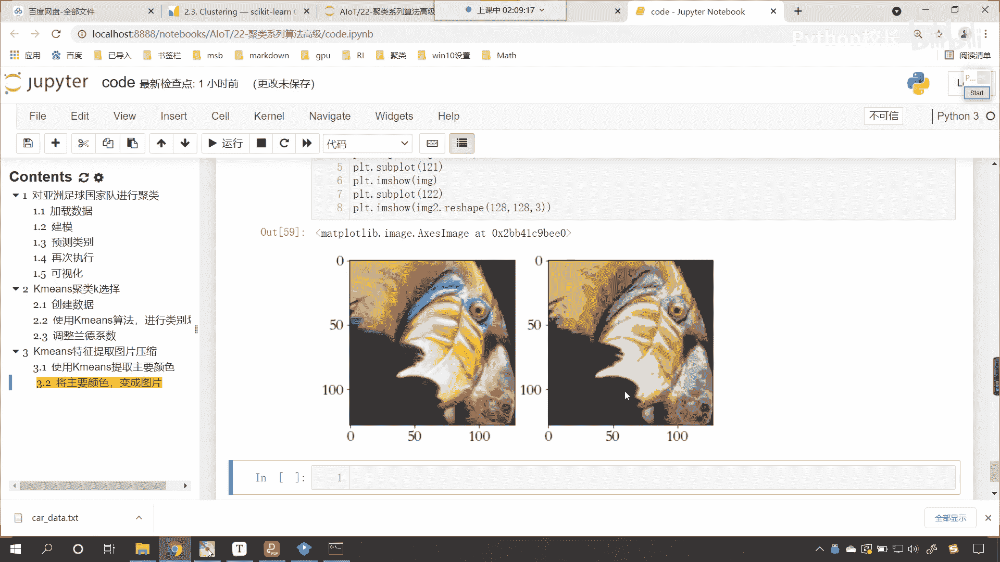
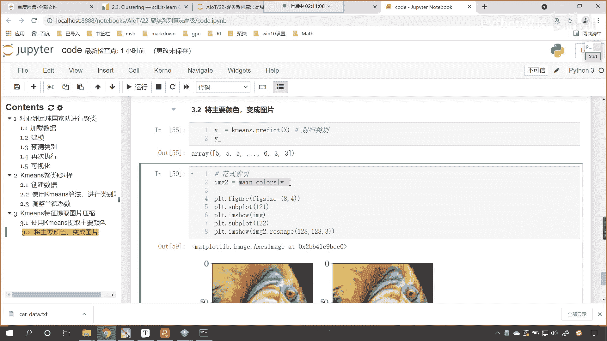
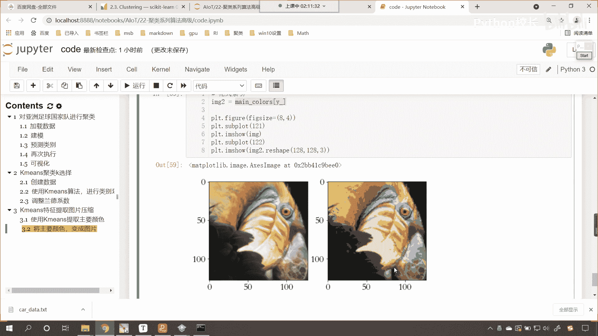

# P146：9-Kmeans聚类提取特征图片压缩 - 程序大本营 - BV1KL411z7WA

来最后最后呢我们再看一下咱们的k means，对图像进行压缩，我们在介绍咱们聚类的时候看啊，咱们这儿说这个聚类它的作用是什么，发现事物内部的规律是吧，异常值的检测，还有一个呢就是特征值的提取对吧。

那特征值提取我们现在呢就给一个例子吧。

咱们就给一个这个图片压缩的例子。

那么这个图片呢图片呢数据呢哎你能够看到啊。

咱们回到代码当中，这个图片的数据呢我们也是有的啊，看叫做11杠bird，是这张图片，你看这张图片它是不是一个，你看是一只鸟是不是好，那么这只鸟当中，你能够发现它不同的地方，是不是有不同的颜色呀，对不对。

那么在这个数据当中，你想它的颜色是不是千变万化呀，它的特征就很多，现在呢咱们回到代码当中，我们来一个三级标题好，那么这个呢就是咱们k means，我们叫做特征提取，图片压缩，那咱们来一个这样的操作好。

那么这个时候呢我们相应的导包，咱们import numpy as np，咱们import matt plot，lip，piplot as plt，然后咱们import pandas as pd。

把这个包导进来，from sk learn，咱们从cluster当中，我们导一个k means，我们把这个导进来好，那么导进来之后呢，咱们执行一下，接下来呢我们就加载一下这个数据啊。

那就是plt点调用image read，在我们当前路径下有一个11杠b，看这就是一只鸟，咱们plt点我们1米指受一下，1米指放进去，这个时候你看我一直行，大家看这张图片是不是就出来了，看到了吧。

哎这只鸟很可爱，很漂亮，是不是，那么我问你一个问题啊，就这张图片它的数据是什么样的呀，来打印输出，你来告诉我看数据是不是就有了，看到了吗，那我们这个数据是不是红绿蓝三原色组成的呀，是吧。

它是一个三维的啊，红绿蓝三原色是吧，它有三个中括号，我现在问你一个问题，咱们这个1米纸当中，我们查看一下它的shape，现在你就能够发现咱们的数据是不是128，128和三呀，对不对，你看。

那么我们能不能使用k means，对这个数据进行压缩，进行降维啊，声明一个k means，我们就让k means咱们给一个n cluster，比如说我们现在把它聚类聚成多少类呢。

嗯你想咱们这个聚类我们是不是可以把它锯成，比如说我们把它锯成八类啊，没问题吧，就是我们从这个颜色当中是吧，因为这个当中颜色很多，我们从这个当中选取八种主要的颜色，来表示这张图片可以不可以看了吧，可以啊。

所以说这个八呢它表示什么，这个八呢表示八种主要的颜色，那我们现在就调用咱们的k means点，咱们就feat一下吧，我把image放进去，你看image是不是就是咱们这张图片呀，看能不能。

你看我一执行来，你各位小伙伴，你猜想一下，我执行会不会报错，如果你认为正确，能够执行是一，如果你认为报错，那你就回复一个二，你看我一直行，哦大家都很聪明啊，回答的是二是吧，为什么呢。

因为你的数据形状是128128，它是三维的，看咱们的训练数据，它呢要求必须是二维的，对不对呀，那这个二维它表示什么呀，这个行呢表示咱们的样本，这个列呢它表示特征，你现在呢三维，你这个三表示什么呀。

是不是就不能表示了，那么我们现在呢，将咱们这个数据进行一个形状改变，咱们来接收一下，哈哈x呢就等于一mage点，我们进行reshape，来一个-1逗号三，我们将x的形状打印输出一下，看x是16384。

最后一个三，你能告诉我这个三表示什么吗，三是不是表示像素呀，对不对，那么我们16384，这个表示什么，你看这个是不是表示咱们的像素点呀，我们现在把这张图片当中的每一个像素点儿，咱们把它表示样本啊。

这个就是我们的样本好，那么现在你看我如果要再进行x的操作啊，咱们再feat一下x，现在就没问题了，你看我一直想，此时是不是就没问题了呀，那么到这里之后，咱们训练完成啦。

那么我们从k means当中获取一下它的，获取一下它的点，看啊，咱们来一个tab键，这个里边就有一个cluster centers啊，这里边就有一个cluster centers。

我们刚才在讲原理的时候看看，咱们刚才在讲原理的时候，看咱们说到你看它是不是有聚类中心呀，我们黄色的叉号，绿色的叉号，蓝色的叉号，这个是不是聚类中心，你想是不是看它是聚类中心。

那么这个聚类中心有几个呢，你看我执行一下，你数一下它有几个，上面你看我们聚类的时候，看咱们是不是给了八个呀，对不对，我们说我们要从这16000，384个像素点，这每一个像素点它表示样本。

每一个样本呢它就表示一种颜色，对不对，那么我们从这个当中咱们提取特征，咱们是不是提取了八种主要的颜色呀，看在这儿呢，嗯咱们就提取了八种主要的颜色，那这八种主要的颜色是什么呢。

哎就是咱们下面这种颜色看到了吗，就是下面这种颜色好，那么我们接收一下啊，我们起个名就叫做main colors啊，这就是我们使用咱们聚类这个算法提到的，提取出来的颜色好，那么提取出来颜色之后呢。

接下来我们再来一步好，那么我们啊咱们将主要的这个颜色，我们呢再把它变成图片，看，将主要的颜色再变成图片上面咱们进行的操作，我们也插入一行来一个四级标题，这一步呢咱们就是使用k means。

我们提取主要颜色，你看这个图你想都不用想，这个当中的一个主要颜色，是不是就是这个黑色呀，还有是不是这种这个黄色呀，还有他的，你看嘴唇，这是不是有这个红色呀，看这个这个黄的是不是更黄，对不对。

你看这个上面是不是这个浅黄色呀，对不对，所以说你看肯它的主要颜色当中，肯定有一个黑色，肯定有一个这个浅黄色，肯定有一个黄色，你说我说的对不对好，那么具体是哪些呢是吧，对于颜色呢。

咱们只能说这个红色绿色黄色是吧，它可以红的深一点，它是不是可以黄的浅一点呀，黄的深浅咱们使用语言描述，是不是这个时候就捉襟见肘了呀，那我们再把将主要颜色，咱们再把它变成图片，如何变成图片呀。

k means他的方法predict它的作用是什么，我们将x放进去，你能告诉我它的作用是什么吗，好我们来一个y盖，你看啊，我们如果要执行这个代码打印输出，你能告诉我这个歪盖它的数字是怎么样的吗。

你思考一下，你看我们的算法，是不是把这个数据分成了八类呀，那么八类我们如何去表示它的类别呢，是不是就是01231直到七呀，你看我一直行，各位小伙伴睁大眼睛来看一看，看五五中间是不是省略号。

省略号里边就有很多了，是不是还有633呀对吧，也就是说我们这第一个点儿看，也就是说咱们数据x当中的第一个点，我们把它划归成了类别五，你知道我说的类别五是什么意思吗，看我们就找一下啊。

看看咱们用红色看看这个是类别一，这个是类别二，一般情况下咱们的类别就是从0123开始啊，你看它一共有几个，一共有八个是吧，如果我们要对它进行编号的话，你想一下这第一个是不是就表示看。

如果我们要对它进行编号，你看这第一个是不是就是零，对不对，咱们的第二个是不是就是一，然后2345这个是不是就表示五呀，对不对，然后六这个是不是就是七对吧，最后一个这个就是七，那我们一二。

你看这个是不是就可以用三来表示呀对吧，现在你能够发现你看我们预测出来的五，那这个五对应着哪个颜色呀，看到你这个五对应哪个颜色，是不是就对应他看到了吧，就对应这个颜色，那这个三对应哪个啊。

看这个三就对应上面这个颜色，我们把它画出来啊，用框框框出来看到了就对应他好了，那我们还有这个六六对应哪个呀，你看六呢，你也把它画上，看到了六就对应这个是不是，所以说你看我们的歪盖，其实它表示的是什么。

是不是我们原数据的一个类别划分情况呀，看在这儿咱们的歪盖，他表示咱们原来16384啊，16384个样本，它的类别划分情况好，这个大家明白吗，来这个大家明白吗，明白的话。

我们就在咱们的讨论区回复一个零了啊，好那么我们既然有了这个类别划分情况，那么我们就可以使用main color，咱们就按照这个顺序是吧，来对它进行，你看咱们的main color是不是数组呀，看到了吧。

我们这个men color中括号咱们来一个y，你看这个就表示什么，是不是就表示花式索引呀，看到了吗，这个就表示花式索引，咱们根据这个顺序取出来好，那么取出来之后呢，咱们就会得到一个1米至二好。

那么现在呢咱们就plt点，我们一mage受，咱们就将1米至二放进去，这个时候你看我一执行不太行，看到了吧，形状是不是没有改变呀，来咱们进行一个reshape啊，我们原来的数据你看是128128是吧。

我们经过形状改变，它是不是就变成16384呀，现在如果我们想要以图片的形式把它展示出来，这个时候你想这个image 2，是不是得reshape成128逗号，128逗号和三呀，这个时候你看我一直行，来。

各位小伙伴看，我们这个图片和原图片是不是就有一个不同了，那我们把两张图片都给他显示出来啊，p o t。sub plot，咱们来一个一行两列，第一个是吧，然后呢咱们我们绘制的图片呢。

咱们先绘制pro t一秘制，受咱们家一秘制放进去，然后再来一个plt。sub plot，一行两列，第二个啊。

一行两列，第二个，然后再绘制1米之二，这个时候你看我一执行。

左边是原图，右边是不是我们经过处理的图片呀，尺寸稍微放大一点，plt。figure，这个当中给一个figure size，那这个宽度我们来宽一些，宽度的话，咱们就来一个这个八吧，那这个高度呢来一个四。

这个时候你看我一执行来，各位小伙伴，你能够看到左边这个图片是不是高清呀，右边这个图片是不是模糊呀，那为什么它给模糊了呢，你看这个是不是，就相当于图片颜色的一个压缩呀，但是它的形状你看一样不一样。

形状是不是类似呀，所以这个时候呢，咱们这个颜色就没有那么丰富了，是不是啊。

你看这个就是不是就有点像素描的那种感觉了，呀对吧，大家现在就能够看到我们是怎么做的呀，我们呢，那我们其实可以将图片是吧，把它看成数据，这是原图，双击合起来它是什么样的一个数据呢，我们进行reshape。

它代表16384个像素点，表示16384种，三三百84个这个颜色，这个里边颜色可能会有相同的对吧，有重复的，那我们不管你有有没有重复，还我们呢使用k means对它进行聚类。

聚类的意思就是把八种主要颜色给它提取出来，你看这不就表示特征提取吗，我们把颜色当成特征，我们把其中八种主要特征，是不是通过聚类算出来提取出来了，那么k means有一个特征。

就是k k means有一个属性，就是调用k means decluster，咱们可以得到聚类中心，在这儿呢进行一个说明啊，嗯这个就叫聚类中心井号啊，这个就是咱们的聚类中心。

聚类中心我们可以认为就是咱们的特征，看就是我们提取的，啊这个就是咱们提取的特征，然后呢我们使用k means对原数据进行预测，预测其实就是把它划归类别啊，预测呢其实就是化归类别，那么我们根据这个类别。

咱们重根据花式索引重新再组成图片。

左侧和右侧你就能够看到有差距了，这个就是咱们这个聚类是吧，它的特征提取图片压缩它的一个操作是吧，那这个时候你把图片缩小之后是吧，发出去就不会，你看上去就会比较这个随和了是吧，就好。

这个呢就是我们k means特征提取。

