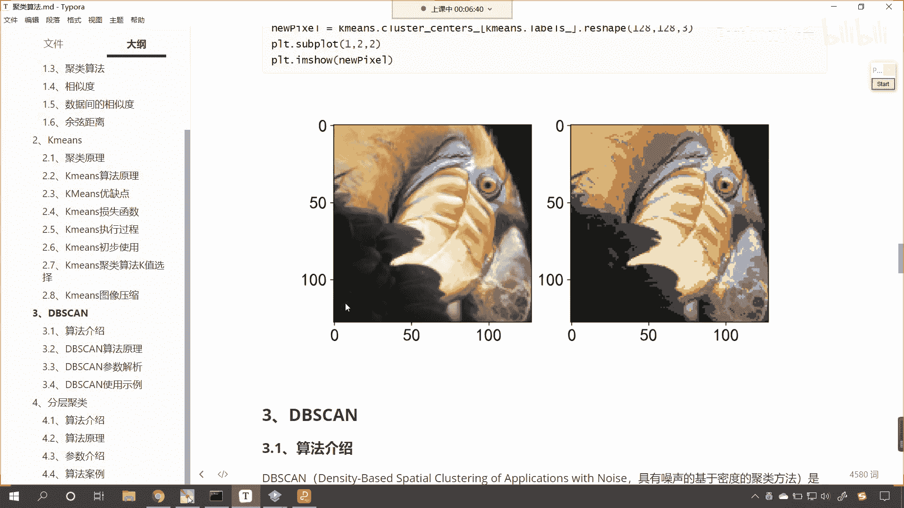
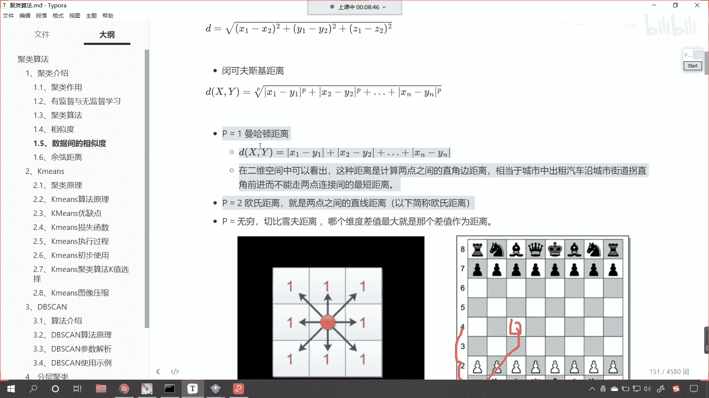
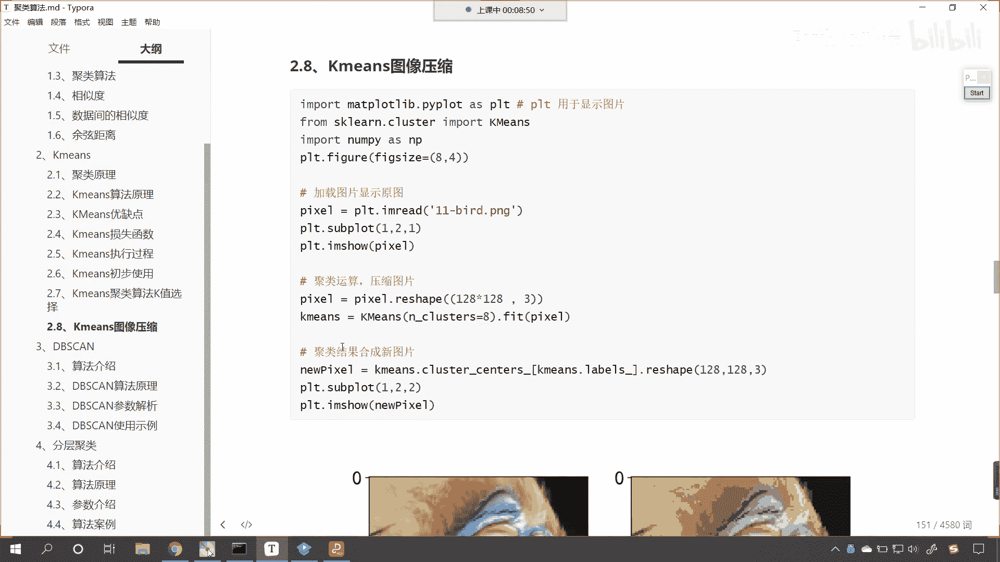
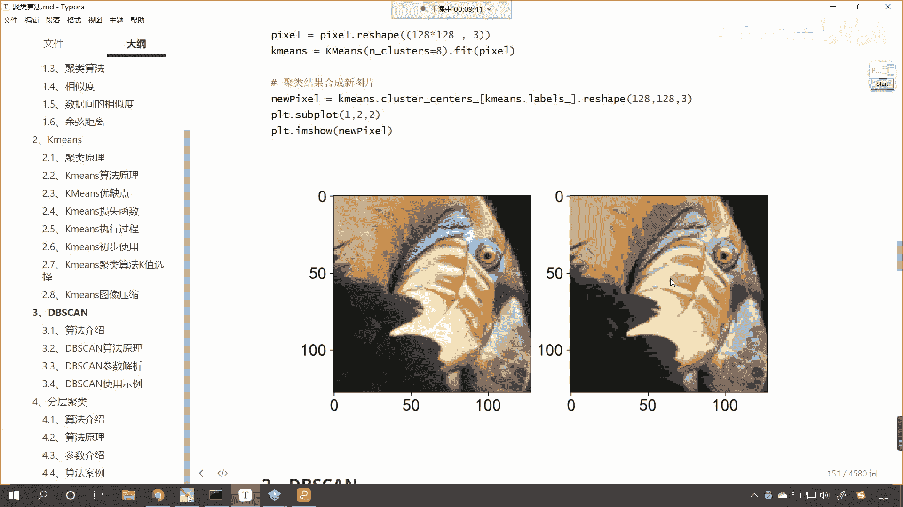
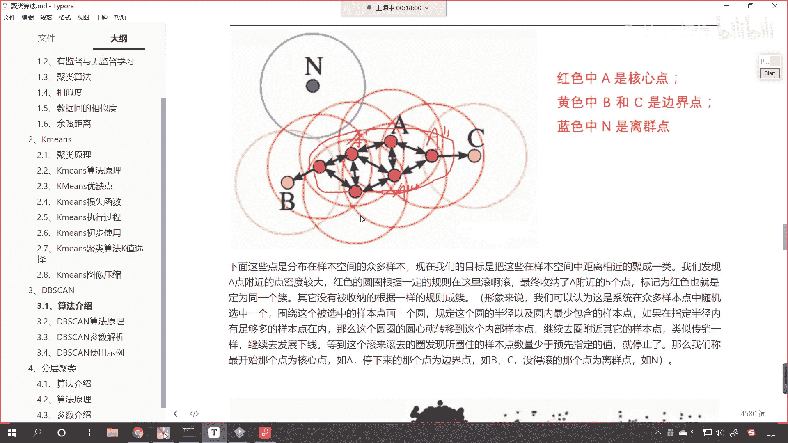
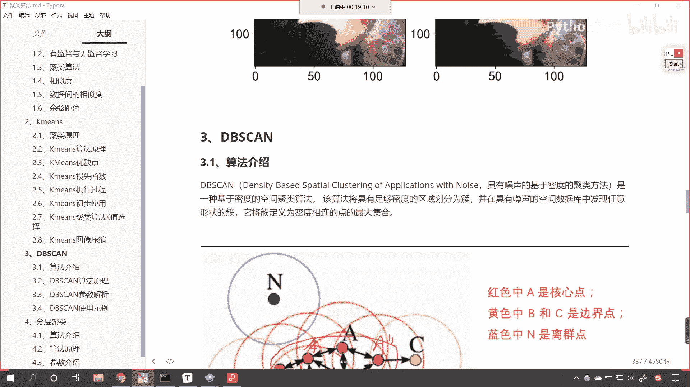
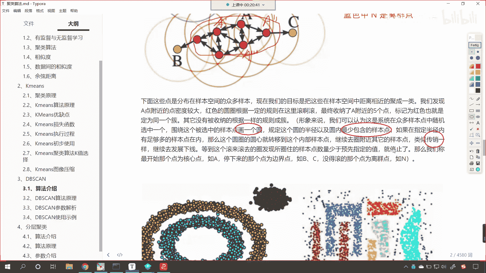
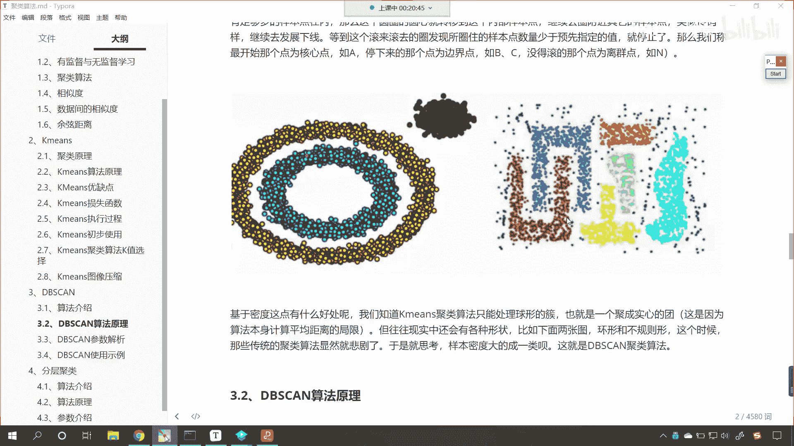
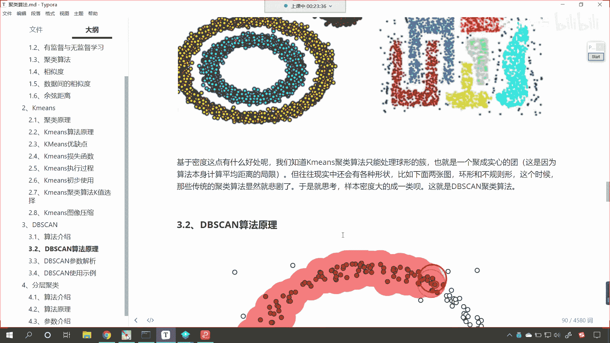
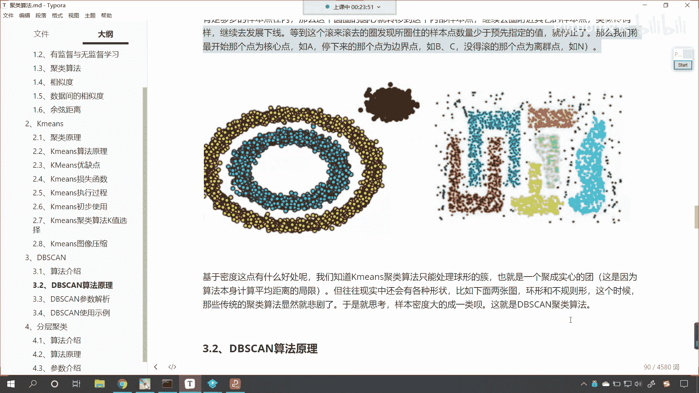

# P147：1-DBSCAN算法介绍 - 程序大本营 - BV1KL411z7WA

来现在的话，咱们看一下我们这节课所要讲的内容啊。

那么我们呢还是聚类算法，那聚类算法呢，这一节课我们会重点讲一下，db scan和这个分层聚类，那k means聚类的原理，咱们呢简单的回顾一下呃，大家现在就能够看到，上一节课呢我们对于聚类算法。

我们是有详细介绍这个距离算法，它到底是怎样一步一步进行移动，一步一步去寻找它的聚类中心点，对不对，好，那么他详细的过程呢，各位小伙伴就能够看到咱们这个图片是吧，从a一直到f，那这个里边呢咱们的c到e呢。

我们会多次循环执行是吧，一直到最终咱们的这个聚类中心点它不再移动，那么我们k means聚类呃，这个算法呢它就结束了，所以说这个算法呢是比较简单的，也比较容易理解，咱们呢就根据亲疏远近是吧。

就像我们人一样是吧，咱们在这个评判嗯关系的时候，我们也有亲疏远近是吧，父母兄弟姐妹是吧，堂兄妹嗯，堂兄弟啊等等好，那么算法呢它也可以根据距离，那么我们的距离呢，不仅仅是咱们所认为的这个欧式距离。

我们平时脑海当中最多的，咱们呢其实就是这个距离了，其实呢我们距离呢它可以是欧式距离，可以是曼哈顿距离，还可以是切比雪夫距离，那这就是p等于一，p等于二，p等于无穷，其实呢你想是不是还有p等于三。

p等于四呀，所以说这个距离的度量是吧，它有多种多样的方式，哎都可以啊。

好那么上一节课呢咱们使用k means。

我们对于图像进行了压缩，给你看一下这个效果，左边这个图是未压缩的图片，右边这个图呢是我们压缩之后它的显示效果，那右边这张图片呢，它依然也是一个依然也是一个鹦鹉，依然也是一只鸟。

那我们看到右边这张图片和左和左边这张图片，它形似是吧，但是呢被我们进行了压缩，咱们所说的压缩其实就是像素，它的这个类别给变少了，我们在课堂上，咱们在进行压缩的时候，右侧这张图其实它只有八种像素。

也就是八种颜色好，那么这张图片呢就是八种颜色组成的，唉一个一个这个鸟的图片好。

那么k means咱们进行了简单的回顾，那接下来呢我们就看一下这个db看啊，那么你能够看到这个db can这个算法，它全部是大写的英文字母，以后，你在代码当中看到全部是大写字母的这种写法。

那你就应该猜想到，那么这个算法呢它是这个算法，它是一些英文的首字母的缩写，这个就叫做density based special clustering of applications with noise。

看这就是他的这个英文缩写，那缩写完之后就是db看我们把它翻译成中文，那就是具有噪声的，基于密度的聚类方法，那么它呢肯定也属于是聚类的一种好，那么它是它它的这个核心在哪呢，看它的核心呢是基于密度啊。

核心是基于密度，咱们k means它的核心是基于距离啊，咱们的k means它的核心呢是基于距离，我们就根据距离来进行类别的划分，那这个呢是根是基于密度，那这个基于密度和基于距离，它各有各的好处啊。

各有各的好处好，那么他们呢分别能够解决不同，解决不同的问题啊，你就像这个唐僧西天取经是吧，这个师徒四人，你想这个每个人和每个人的能力，是不是不一样呀，对不对，你看这个唐僧啥都不会，但是呢他这个会管理呀。

是不是啊，宅心仁厚是吧，所以说他就是老大呀，这个孙悟空是吧，你看他的水平高是吧，打妖怪特别厉害，但是他是不是最后还得听唐僧的呀，不听话，一念紧箍咒，他是不是就受不了呀，那水浒战水浒传上108条好汉。

是不是每个人和每个人的能力水平，是不是也不一样呀，对吧，就是每个人解决问题的这个方式是不一样的，这就像咱们不同的算法一样是吧，那每个算法它各有千秋是吧，他啊一会儿呢我们会在代码当中进行一个对比。

让大家去感受一下好，那么咱们的db scan呢，是一种基于密度的空间聚类算法，你看一一说到空间是吧，那我们就会想到立体的感觉，是不是，该算法，该算法将具有足够密度的区域划分为一处。

看看什么意思呢啊将具有足够密度，该算法将具有足够密度的区域划分为处，你看这什么是醋呀，你有没有看到这个海里面是吧，这个鱼在游泳的时候是吧，都是一群一群的是吧，在在游泳，那这一群肯定是一类，你想是不是啊。

你有没有看到过电视上的一些这个节目是吧，就是拍到海洋里边的鱼，鱼群都是成群结队的是吧，动物世界里面我们就会看到好，那这个鱼鱼群在游动的时候呢，其实都是成成群结队出现。

那这一群当中它们的种类呢唉都是同一个类别，咳我们db看这个算法呢，它是在具有噪声的空间当中发现任意形状的簇，它将促定义为密度相连的点的最大集合，所以说db看这种聚类和咱们k means聚类方式。

原理是完全不一样的，大家看咱们下面这张原理图，我们往下滑动一滑动一点，现在呢你就能够看到，你看我们是怎么聚类的呀，你能够看到这儿是不是有一个一个的圈呀，看红色的圈，看到了吧。

那我们这个当中呢有一个红色的点a啊，有一个红色的点，那这个以a点呢为核心，看咱们就以a点为核心，这个时候我们呢就开始画这个，某一个特定半径的圆圈，那这个你划到了这个特定半径的圆圈。

那如果说某一些点它在这个圆圈内，那么我们就把它归到相同的类别当中，在这个当中呢，你就能够看到我们n点，离咱们a点是不是就比较远，大家注意啊，这个n点不仅离咱们a点比较远。

这个n点呢是不是离其他的点也都比较远呀，那么这个时候呢这个点就是咱们的离群点，你还记得咱们在介绍聚类算法的时候，我们说聚类它是不是有相应的作用呀，那我们聚类呢，咱们可以发现事物之间的潜在关系。

咱们是不是可以将数据嗯进行无监督学习，给它分成特定的类别呀，那我们上一节课咱们举到了亚洲足球队，是不是啊，那我们只有数据，咱们是不是发现了事物之间的潜在特征，把相似的是不是归到了一类呀。

那这是聚类的作用之一是吧，发现事物潜在的关系，其实就是分门别类了，还有呢就是我们的特征提取数据压缩，那上一节课咱们介绍到了这个k means，对于一张图片鸟，它的呃颜色像素的这个特征提取。

那我们上一节课咱们还讲到了这个聚类呢，它的作用有异常值检测哎，那这个异常值检测，你想一下咱们上一节课有没有说到呢，是不是没有呀，那嗯有小伙伴在讨论区里边儿说到了离群点儿，你想一下离群点他算不算异常值呢。

你看e和长是不是这个异乎寻常吗，那如果说它是正常的值，那它肯定和咱们的这个数据是吧，就挨在一块儿了，对不对，你好比说姚明他肯定就属于是异常值，他特别高，异常高是不是，所以咱们的db看这个算法。

它就可以帮助我们去寻找异常值，那它就把n点哎就标记出来了，说这个n点呢它不属于咱们a这一类，那这呢我们还有b和c，大家看咱们的b和c呢是边界点，那么请问这个b和c是边界点，它算不算是a这一类。

你看这个b和c它是边界点是吧，那这个b和c呢它也依然属于我们a这一类啊，注意啊，他算啊算我们a这一类，知道吧，他算咱们a这一类，这个算和不算是吧，其实呢就看我们的这个这个标准的这个，苛刻情况了是吧。

你就好比咱们之前在讲支持向量机的时候，我们的支持向量它是不是就属于是边界呀，对不对，我们的支持向量它就属于是边界，就好比咱们中国和这个越南我们是边界是吧，那边界这个地方边界线的边界线的这个一边儿。

是不是就属于咱们中国的领土呀，所以说这个我们把它叫做这个边界点是吧，你看这个边界点你能够看到这个黄色的圈，是不是，那在黄色的圈外边是吧，在这个右边，黄色圈它的右边肯定就不属于a这一类了。

在左边这个黄色圈的左边，那肯定也不属于是a这一类了，好，那么大家看这个就是咱们呃。

db看这个算法的一个这个基本原理啊，好那么你看这段话的描述呢，咱们刚才呢也对它进行了一个说明啊，那么形象的来说呢，我们可以认为嗯这个事呢，呃系统在众多的样本点中随机选一个，围绕这个被选中的点。

他画一个圈，你看你这个圈。

你想一下是不是有大和有这个画的，这个圈是不是可以大一点，是不是可以小一点呀，这个圈的大小它是不是通过半径来决定的呀，对不对，那你想我画了一个圈，在这个圈当中，如果出现了三个点，如果出现了五个点。

那请问三个点和五个点哪个密度大呀，你想哪个密度大，是不是你的圈内的点数量越多，它的密度是不是越大呀，对不对，哎所以说咱们可以通过画圈是吧，查找圈内的点的个数，是不是来决定密度的大小。

是否符合咱们的规定呀，你看这就是db，看这个算法，这叫什么，具有噪声的。

基于密度的，看到了吗，基于密度的聚类算法，我们画了一个圈，在这个圈内，比如说它超过了三个点，ok那么这三个点都归为我们某一类，如果这个圈内是吧，它小于三了，那么我们就停止画圈，看到了吧，那就停止画圈。

你看它有一个这个嗯，他画了一个圈是吧，在这个规定的半径内，这个圆内呢它最少包含的样本样本点数啊，如果在指定半径内，有足够多的样本点在这个圈内，那么这个圈的圆心呢，就移动到这个圈内部的样本点。

然后继续去围绕附近的其他样本点，类似传销一样，看到了吗，类似传销一样继续去发展下线，看到了，你为啥这个传销是吧，挣钱这么快呢，是不是啊，那就是因为它这个一个可以变两个是吧，两个可以变四个是吧。

那大家如果要发现传销的话是吧，那么我们一定要拨打电话110是吧，所以说他们这种传销这种方式没有卖，没有卖任何的产品是吧，然后去搞钱，那就是违法是吧，那咱们的算法呢，看咱们可以借助传销这种思想是吧。

传销的这种这个呃这种裂变的方式好。

那么我们继续往下看啊，来各位小伙伴。

你就能够看到你看我们有这样的数据形状，那很显然你看里边儿这是一圈，外边这是一圈，在它的右上角，是不是又有一圈呀对吧，那这种如果我们要进行聚类划分的话，咱们使用k means，那这个效果就很不好。

还有你看咱们右边这个图很显然看到了吗，很显然如果我们要对它进行聚类的话是吧，那咱们根据k means，你想一下这个聚类的效果，我们锯出来的肯定就不是这种形状了，是不是啊。

看看咱们锯出来肯定就不是这种形状了，而咱们使用db看，我们就可以根据数据的形状来给他找到，因为有一些问题，有一些这个数据的形态，它呢就是以密度的形式来存在的，你知道咱们的数据是吧，是比较复杂的。

那我们的数据不仅仅是二维的，有可能是三维的，有可能是四维的，有可能是高维的，是不是你像英国的这个天文学家霍金就说了，宇宙是11维的，是不是，那咱们也想象不到这个11维长什么样。

但是呢我们知道二维和三维比起来，三维是不是就多一个，是不是就多一个轴呀，可以立体化的呈现，那四维比三维是不是更多呀，对不对，如果数据维度比较高的话是吧，那我们就可以采用咱们怎么理解二维到三维。

那么我们就这个拓展一下，延展一下，我们理解三维到四维是吧，所以说呃有一些概念呃，有一些这个点，我们无法去用咱们的大脑想象出来，但是呢呃咱们可以拓展可以延展，就像这个你看咱们现在这个u型是吧。

这是上u的这个红色，还有下u的这个蓝色，那我们看到之后是吧，我们就会天然的觉得这个上优是吧，它是一类下游，它是不是属于是另一类啊，你想我们一些数据，是不是就有可能是这种分布形态啊。

如果我们要使用k means，那么咱们这个肯定就划归到一起了啊，好那么这个基于密度它有什么好处呢，那我们知道咱们的k means聚类呢，它只能处理球形的簇，因为呢它是根据距离来进行计算的啊。

这样的话我们就会聚成实心的球，这是因为算法本身计算平均距离的极局限，也就是说这个算法原理是什么样的，也就决定了它只能干什么样的事儿是吧，往往现实生活当中呢。

我们有各种各样的形状是吧，比如说咱们上面这两张图是吧，它是环形和不规则形状，这个时候呢如果我们要使用k means，那么咱们得到的结果呢，很显然就是一个悲剧是吧。

