# P148：2-DBSCAN算法原理和参数详解 - 程序大本营 - BV1KL411z7WA

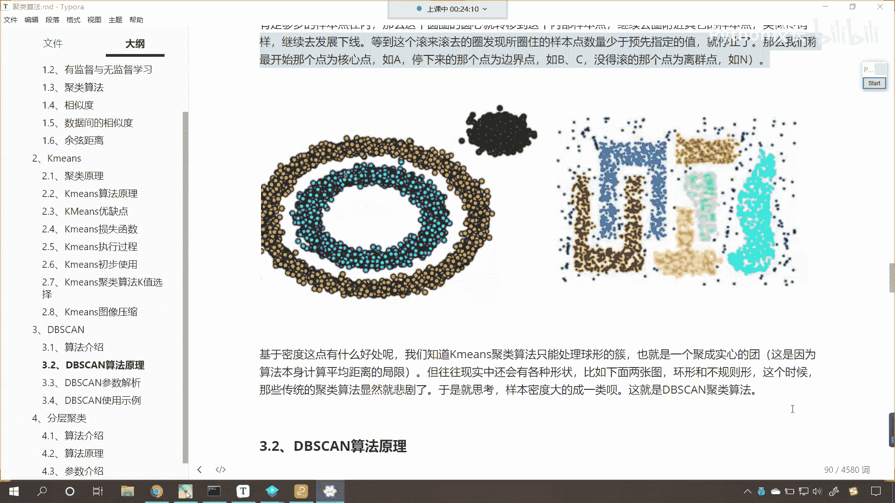

来接下来我们一起看一下这个db，看这个算法的原理，好现在各位小伙伴，你就能够看到我在这儿呢给你画了一个动图，你看这个动图呢就是老老师自己做出来的，看到了吧，这个动图就是我自己做出来的啊，怎么样。

你看它是怎么进行划分的，哎你来观察一下规律，看到了观察一下规律，那我们就能够看，我们就能够看到，看到了吗，它是根据密度一个一个圈画，是不是一个圈画，这个时候你会发现有一些点，它是不是没有进行分类呀。

看有一些点没有进行分类。

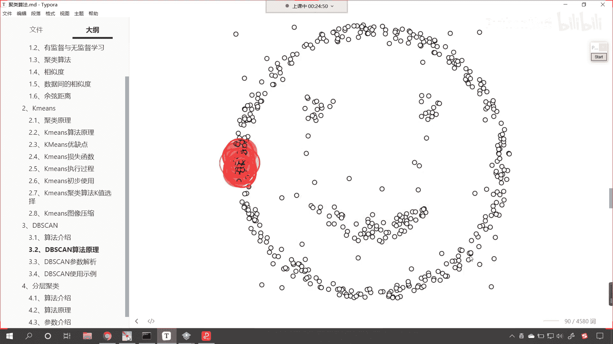

看到了吧，是哪些点呢，看来咱们画一个图啊，看等会儿啊，这回这个我们等着他聚类结束啊，哎现在你就能够发现看哪些点没有进行聚类呢，看到了吗，这个点是不是没有，还有这个点，这个点儿，还有咱们这个点。

你就会发现，那为什么这些点它没有被进行类别的划分呀，是不是因为他们属于是离群点儿呀，看到了吗，这样点这样的点我们就把它叫做离群点，那么离群点儿就是咱们的异常值，所以说我们的聚类算法它的一个作用之一呢。

就是去寻找异常值，看那有了异常值了，那这些异常值呢就应该被我们清洗掉，知道吧，因为异常值它对于我们数据分析呢，对于我们进行机器学习它没有好处，知道吗，你看它没有好处，为啥呀。

因为异常值都属于是特殊的情况是吧，你像姚明那么高是吧，那如果说他要这个打篮球打的不好是吧，那可能这个买衣服是吧，买车都没有核实他的是吧，好那么所以说异常值呢对于我们机器学习。

其实咱们你看机器学习它是一个普世的，你看机器学习我们其实是不是就是在找规律呀，使用算法，使用数学是不是在找规律啊，那这个规律呢它一定是一般的规律啊，这个规律它一定是一个一般的规律，唉有各位小伙伴发现了。

咱们这个其实就是一张笑脸。

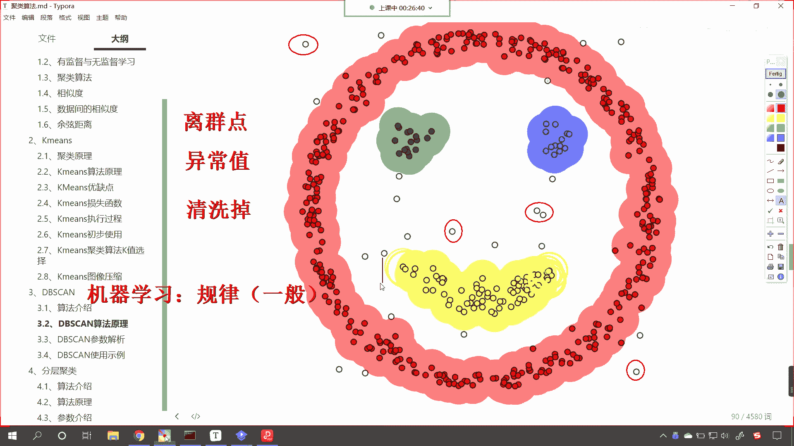

是不是啊，确实一张确实是一张笑脸啊，好那么这个呢就是咱们db看这个算法的解析。

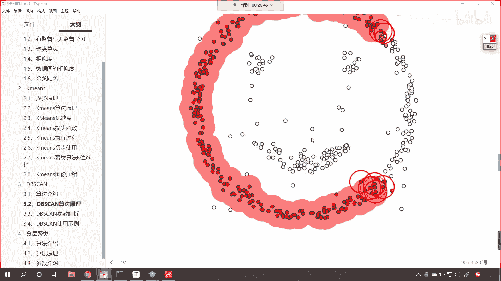

现在呢咱们回到代码当中来，此时呢咱们回到代码当中。

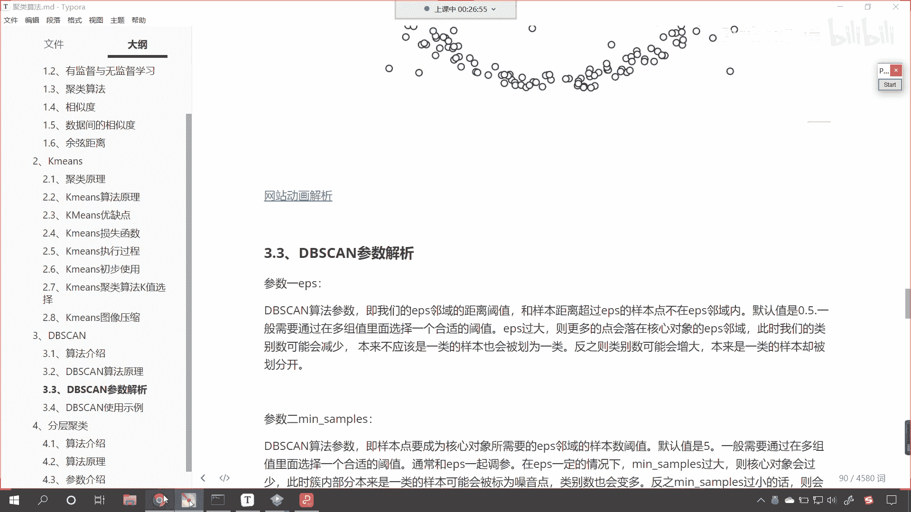

我们创建一个python文件，选中它，咱们给它改个名好，那么此时呢我们就导一下包，咱们的import numpy as np，然后呢咱们import matt plot，lib。

piplot as plt，算法，我们导进来from sk learn，点我们cluster，咱们从cluster当中，咱们import k means，然后来一个逗号，这个时候呢咱们来一个db看。

咱们将这个呢也给它导进来，那么我们再导一个包，from sklearn，呃，咱们从sk learn下边，我们导一个包叫做data sets，这个呢可以帮助我们生成数据，那执行一下这个代码。

那么我们刚才呢对于db，看这个算法原理进行了介绍，接下来呢我们对于这个算法当中的参数。

进行一个详细的说明，好大家看啊，那这个db看它的参数详解好。

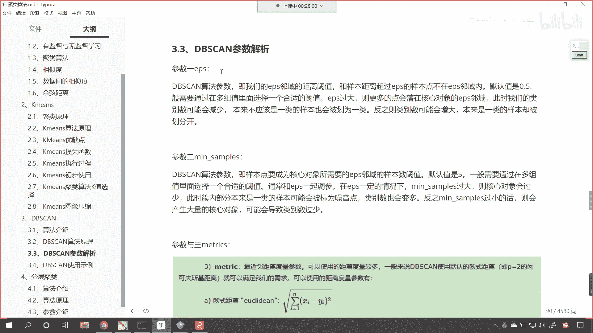

那么我们就在代码当中对于这个算法。

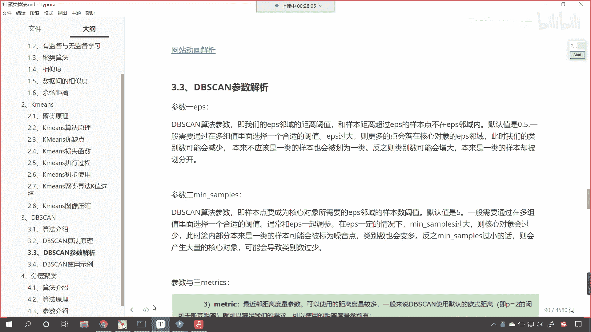

咱们进行一个声明，那就是db看就等于db看小括号，想要查看它的参数，咱们shift tab，好在这儿呢我们就能够看到，你看这个参数它是不是有一个p呀，还有一个mean samples。

还有一个参数叫matrix，那这个里边这个参数呢前三个是很重要的，咱们呢就对于前三个参数，我们进行一个详细的解释和说明，好，那那这个e p s它表示什么呢，这个e p s呢它呢表示的是我们半径的距离啊。

这这个eps表示咱们半径的大小。

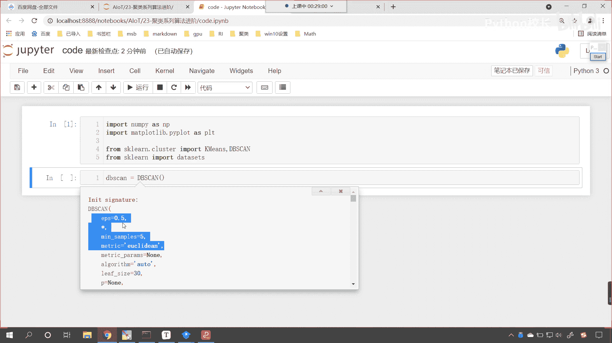

咱们在课件当中呢唉都进行了具体的说明，咱们的eps领域的这个距离的阈值，就是和样本距离超过1p的这个样本点呢，它就不在这个p的这个阈值内，那你想这个是不是就是表示咱们上面是吧。

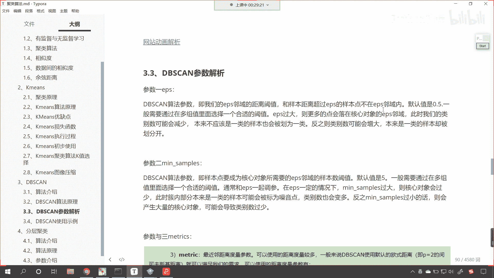

我们在进行这个以某一个点为圆心的时候。

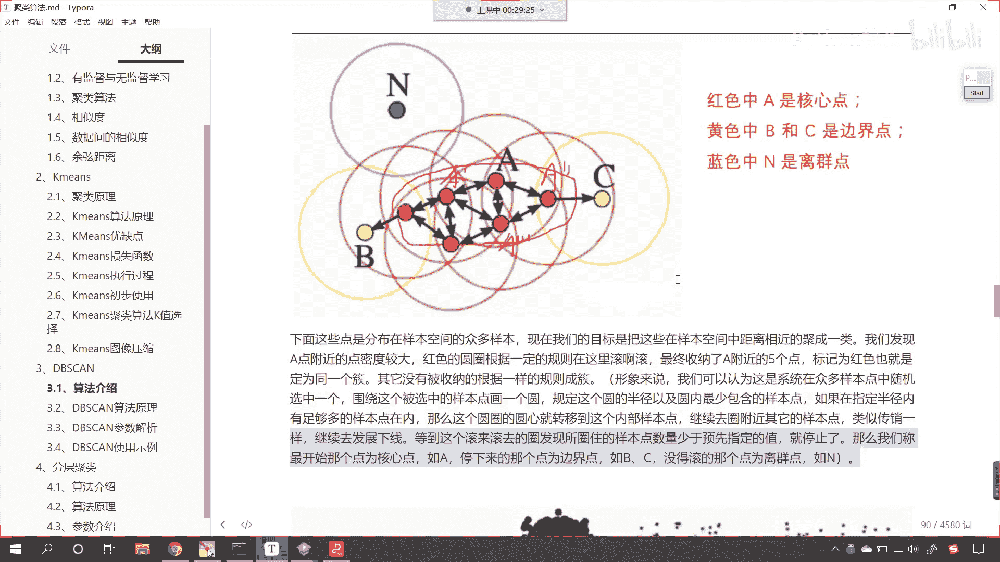

咱们是不是就画了一个圈呀。

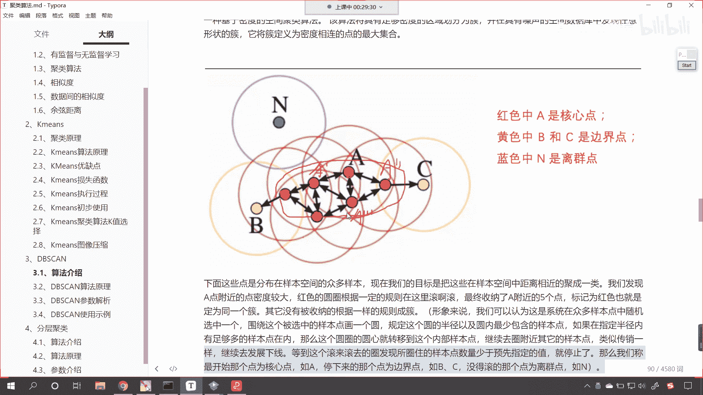

对不对，是不是就画了一个圈呀，所以说这个e p s啊，所以咱们这个e p s呢，它就表示咱们以某一个点为圆心，咱们半径的大小，如果我们其他点在这个圆内，那么呢咱们就聚类聚过来，那这个值呢默认是0。5。

一般呢咱们需要通过这个调整，选择一个合适的阈值，那如果这个eps过过大，你看如果这个半径过大，你想一下会产生什么样的一种效果呢，是不是更多的点会落在核心对象的eps域内，那你更多的点被囊括进来了是吧。

你无所不包，这个时候呢我们的类别可能就会减少，看到了，因为你过大，那么类别就会减少，本来不应该是一类的样本点，也会被划归到一类是吗，反之如果你要过小，那么类别数可能会增大是吧，本来是一类的。

它就被划分开了。

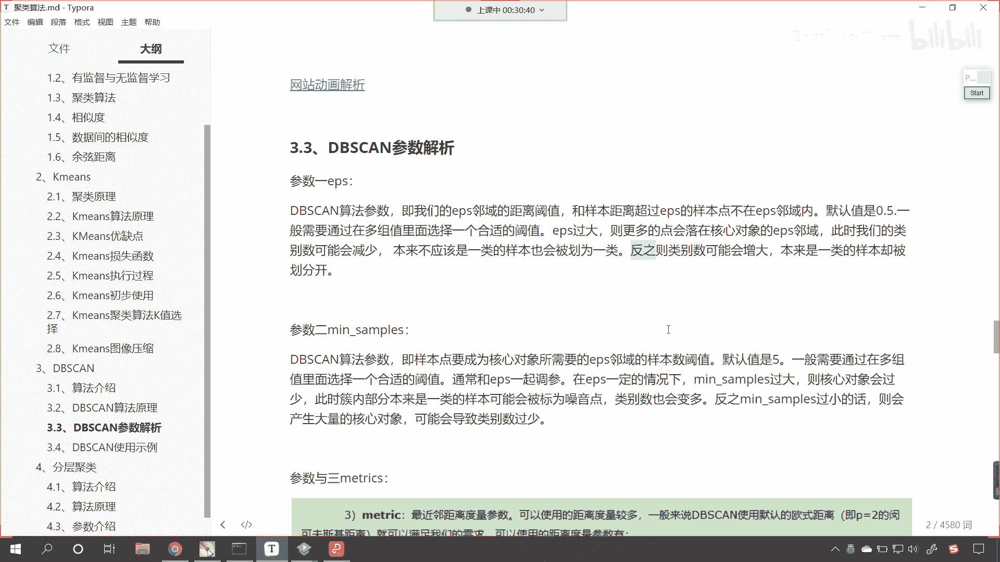

那大家现在就能够看到啊，你看这个上面这个动图呢。

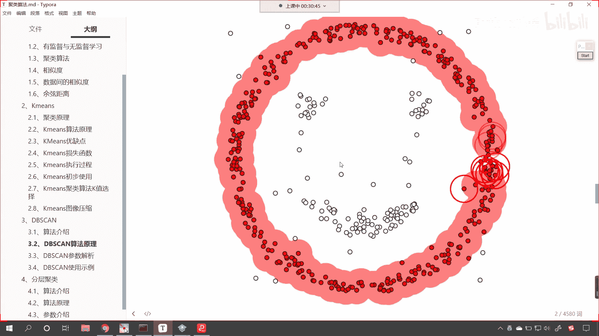

我们有相应的一个网站可以很好的展示，这个呢是咱们网站动画解析。

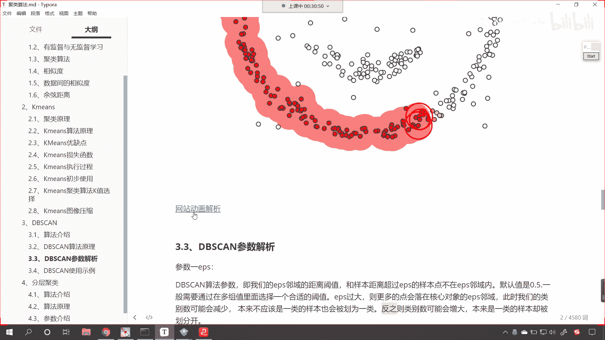

咱们的右击，你看我们打开链接，我把这个链接呢复制也给各位小伙伴发过去，你看这个呢是一个很好的网站。

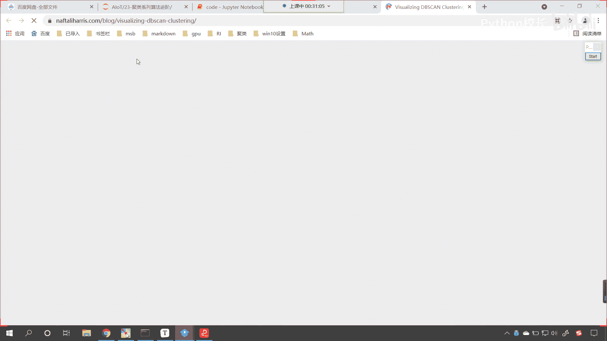

它叫valization db，can clustering，它呢其实就是对于db看这个算法，它进行了一个可视化好，那你看这个。

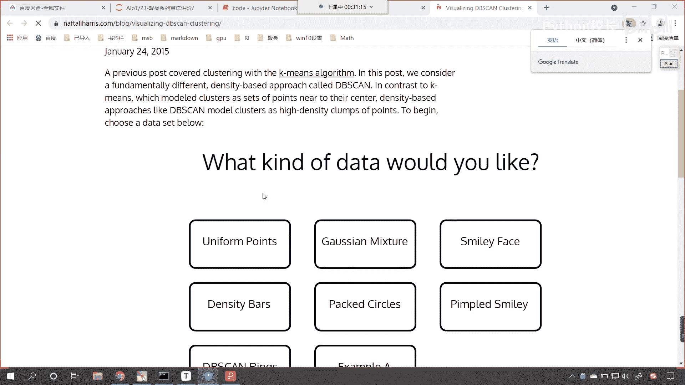

它可以对于不同的数据进行可视化啊，这个就叫现在你就能够看到啊，看这个是smile face是吧，pipe smile example a是吧，还有db看ring，我们随便选一个啊，smile face。

你看这个是不是就是我们课件当中提供的呀，那现在你就能够看到，你看这有一个什么，看到了吧，你看我们的这个e p s这个参数看到了吗，这个e p s这个参数啊，你看啊，如果我要把它调大。

你是不是就发现看到了吧。

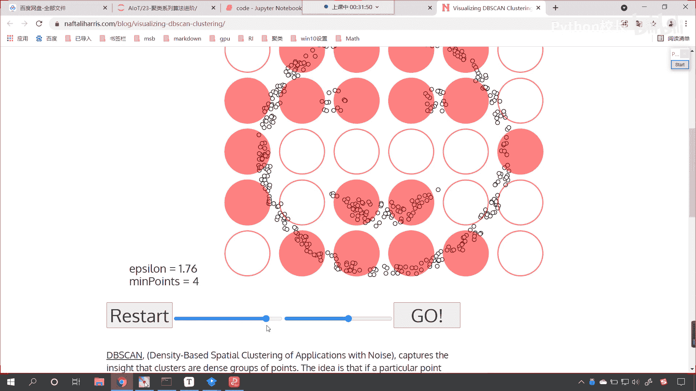

我把它我现在先让它默认啊，默认是一点，咱们来一个go啊，看我来一个go，现在你看它是怎么进行类别划分的，哎看到了吧，它是这种形式进行类别划分的，看了它就是根据密度一个圈一个圈再进行绘制。

待会儿呢我们将这个e p s咱们给它调大，看到了吧，我们把它调大，各位小伙伴看一下它是怎样的一个效果，那么现在呢它是一点，大家注意观察我们这些点在进行划分之后是吧，这些点在进行划分之后。

看一下它会形成几类是吧，那当然很妙了，这就是可视化它的一个强大的好处，知道吧，以后你看咱们现在呢，这个国家禁止是不是k 12的这个呃，呃禁止向新东方呀，禁止向这个猿辅导呀，是不是禁止他们上课了对吧。

那以后你可以借助计算机是吧，把这些高中的初中的题目，进行相应的相应的讲解，特别是物理是吧。

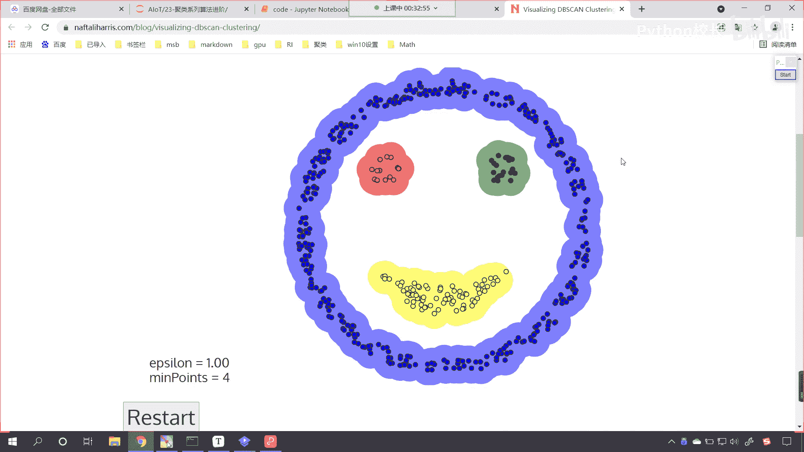

可视化就会有一个非常好的效果，那这个时候呢咱们来一个restart啊，我们依然选择这个simple face。

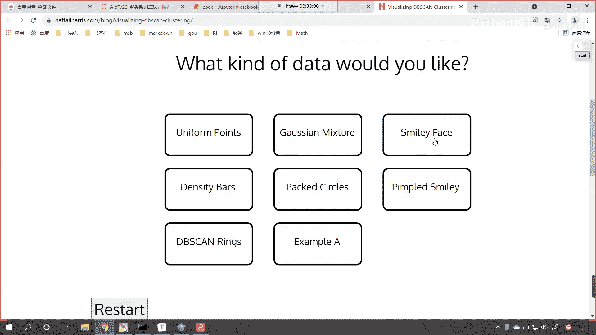

咱们这个时候呢我们把半径给它增大，现在你看它就变成1。98了，这个时候你看这个半径是不是就大多了，此时我一执行，你来看一下它会怎么样啊，好我们看看啊，这个时候因为我们这个因为咱们这个数据呢，大家看啊。

咱们这个数据它这个还是比较规范的，是不是啊，这个时候呢我们可能应该是嗯，应该是不会变是吧，因为我们这个点离的是不是都比较远呀，来那咱们换一个好不好，咱们换一个啊，看嗯比如说我们返回一下啊。

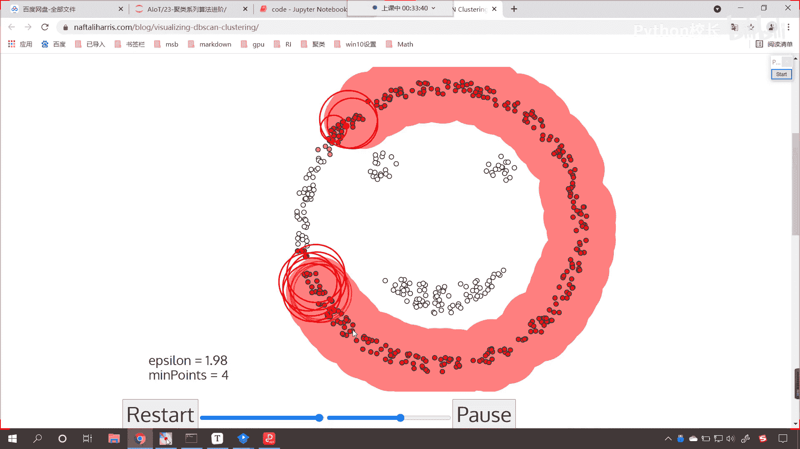

咱们刷新啊，重新刷新，咱们找一个这个其他的数据啊。

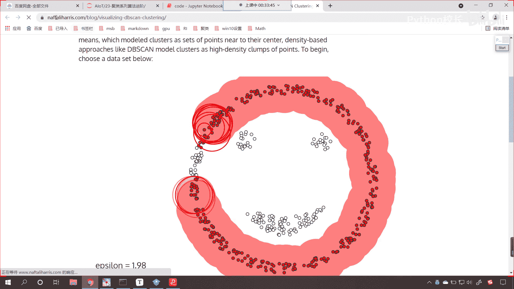

这个时候呢比如说我们选这个看到了吗，咱们选这个这个这个时候就有就有影响了是吧，你看现在是不是就有噪声了，看到了吗，这个就有噪声了，唉我们滑动是吧，现在呢你就能够看到看到了吧。

咱们有一个点是不是在在这个地方呀，对吧，那这个地方，你想他是不是肯定划归不到一个类别当中呀，对不对，你看他肯定划归不到，现在呢我们的epoc on啊，大家看看咱们的一波con，它是一点。

这个就相当于是半径，大家看确实如此是吧，这个点儿是不是就划归不到了，你再来仔细观察啊，你看这个点也没有划归，看到了吗，这个点还有这个点，为什么呀，看到这个点和这个点，它是不是这个密度不够呀对吧。

所以说他就没有划归，哎，大家看现在我们是不是划归成了几类，咱们是不是划归成了这个四类点呀，看有一些异常指点。

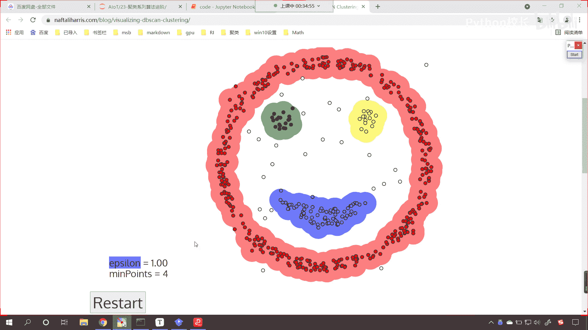

现在呢我们来一个rs，现在呢咱们来一个rest，我们将这个半径呢咱们给它增大啊。

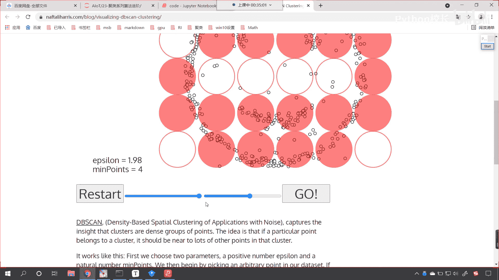

这个时候大家看效果，看这个时候你来看效果唉，我们就会发现这回呢，哎现在你来看看看看出现一个什么样的情况呀，看到了吗。

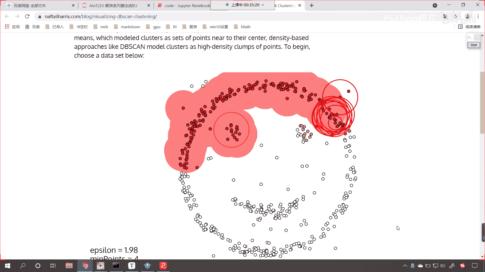

出现一个什么样的情况，我们这几个点儿是不是也归到一类了，看到了吧，你看这几个点也归到一类了，最后呢我们就会发现，如果这个epic on是吧，如果这个值要变大，咱们的划归的类别肯定就少了啊，现在。

你看哎最后是不是就把它也包起来了，看到了吧，也把它给包起来了，是不是唉现在大家明白是怎么回事了吧。

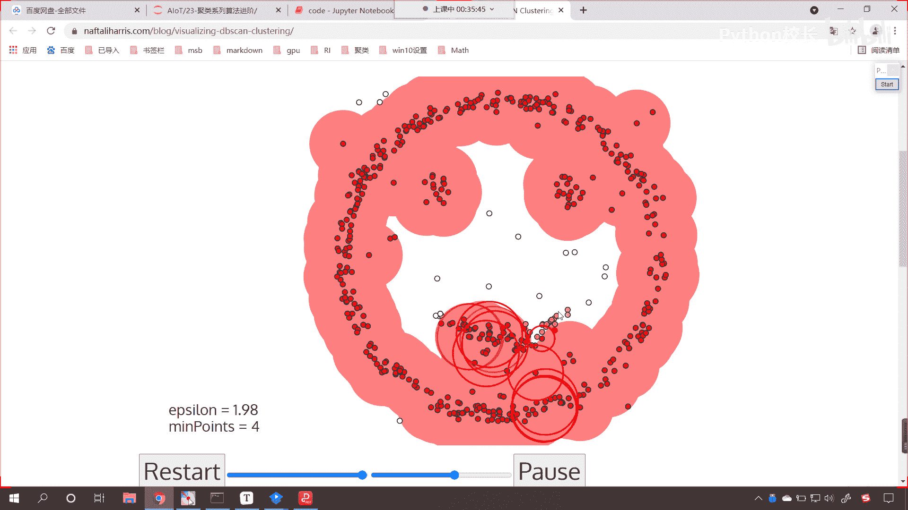

哎所以说呢这个就是咱们这个参数，如果这个e p s过大，那么我们的类别呢就会减少。

咱们接下来看一下第二个参数啊，第二个参数叫mean sample，那么这个参数呢，呃就是它对于我们这个密度进行一定的限制，进呢，我们样本点要成为核心对象，所需要的这个e p s这个半径这个圆圈内。

咱们的样本的阈值，那默认情况下是五，也就是说你得大于等于五，那么才才会把你归到这一类，如果你要小于五，那么你就不是这个类别，那你想在一个圈内数量越多，是不是密度越大，在一个圈内数量越少。

这个密度是不是就越小呀对吧，所以你看我们db scan这个算法，它呢就是基于密度而来的嘛，对不对，那我们就可以控制这个数据是吧，唉来进行密度的控制好，那么一般呢咱们需要通过多组值当中。

选一个合适的阈值是吧，通常和eps一起调参，在e p s一定的情况下，大家注意啊，在半径一定的情况下，咱们这个mean sample过大会怎么样，你想一下，你看如果这个值要过大，这个值过大。

你想那我们的条件要求是不是就更加苛刻呀，比如说我们给个100，那也就意味着你在进行密度控制的时候，你是不是必须得有100个点儿，我才能够把你划归到这个类别呀对吧，那则核心对象就会少看了吧。

核心对象咱们的核心对象会过少，此时促内本来是一类的样本点，可能呢被标记为噪声点是吧，类别也会，咱们的类别呢也会变多，那我们回到咱们回到网页上。

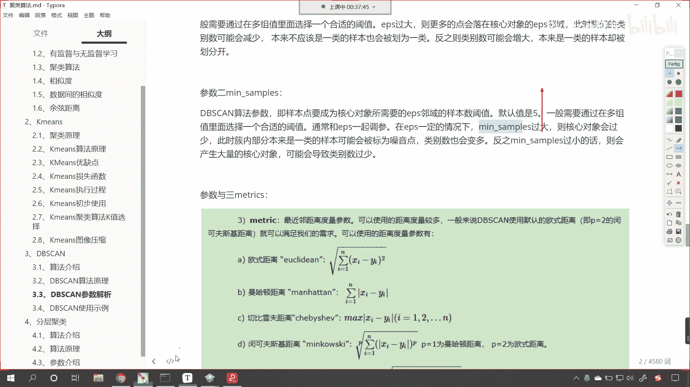

我们呢进行相应的展示啊。

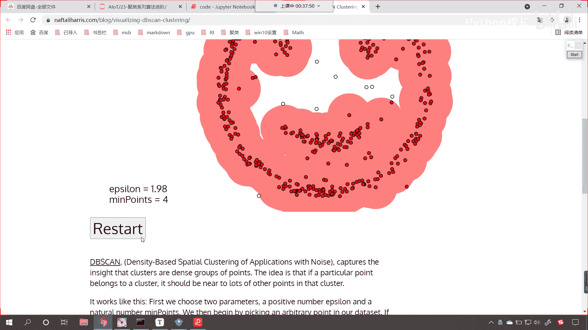

咱们来一个这个restart嗯，这个时候呢我们就把这个数量给它增大啊，大家现在看啊，你看我们数量减小吧，我们先减小啊，你看咱们这个mean point是一，你看会怎么样啊，也就是说我们的econ是吧。

这个不变是吧，半径不变，你现在就能够看到，你看他到这个位置是不是给停了呀，看到了吗，到这个位置停了。

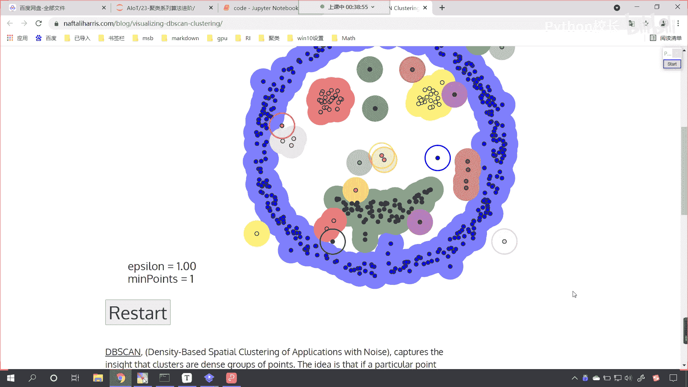

现在你来看我们把这个当中，我们划归成了多少类呀，看到了吧，一个颜色表示一类啊，注意啊。

一个颜色表示一类，现在你就发现看到了吗，我们类别是不是很多呀。

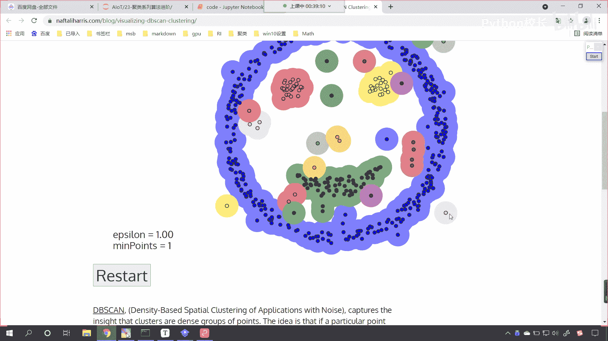

看了你像这个粉色的粉红色的点，它是不是也算一类，为什么呀，因为你这说了是吧，你这个mean pose就是一，那他自己是不是就是自成一类了。

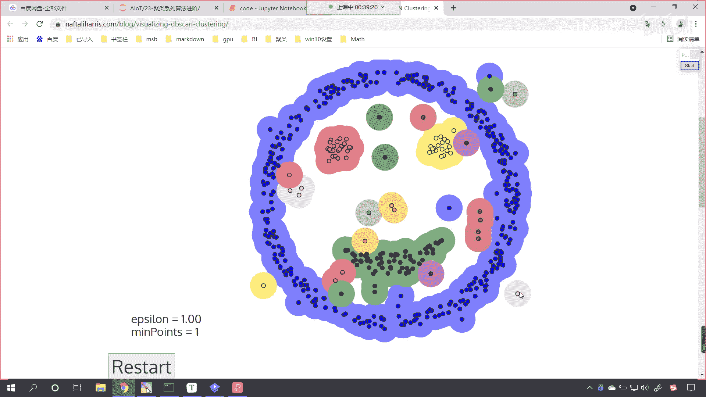

对不对，那我们这个mean pose是什么参数，你看这说的很清楚啊，这个db scan算法当中，咱们的样本点要成为核心对象，所需要的这个eps领域内样本，它的这个数样本数它的阈值，也就是说密度。

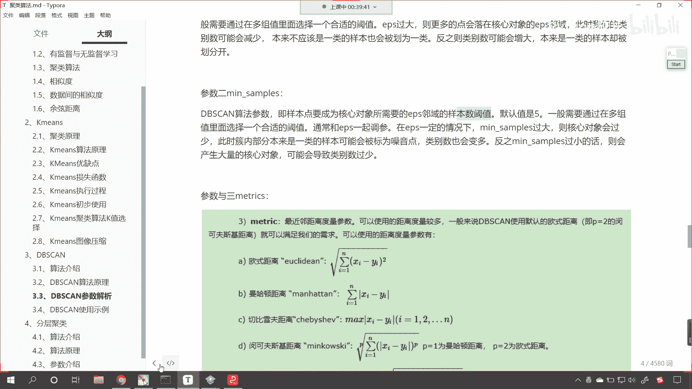

你看为什么我们嗯这个点被划归了一类，上面这个点是不是也被划归了一类呀，大家要注意啊，大家注意，你看这个地方是一个蓝色，你看啊这个地方是不是一个蓝色，我们这儿是不是也是一个蓝色，请问这两个蓝色一样吗。

请问这两个蓝色一样吗，还有你看这是不是还有一个颜色，这三个蓝色一样吗，不一样啊，大家注意啊，在这咱们郑重说明一下啊，这是不一样的啊，这是不一样的，因为蓝色是不是有深和浅呀，对不对啊，蓝色是有深和浅的。

所以你想如果他要一样，那它是不是应该在我们进行db看聚类的时候，它是不是就应该分到一类啊，很显然你上边那个蓝色的点儿是吧，它是最后是不是在划归到一类的呀对吧，所以说这个蓝色和这个蓝色它是此蓝非彼蓝。

它是不一样的啊，我们看着相同是不是，哎，但是呢这个我们颜色，我们眼睛辨别颜色的能力呢，它是有一定限度的啊，好那么现在你就能够看，那为什么我们分的类别这么多呢。

哎就是因为这个mean points我们给定了一个阈值，也就是说你只要是一个点，是不是就能够自成一类呀，对不对，你看你只要是一个点，那怎么样就可以成为一类，这就是原因所在。

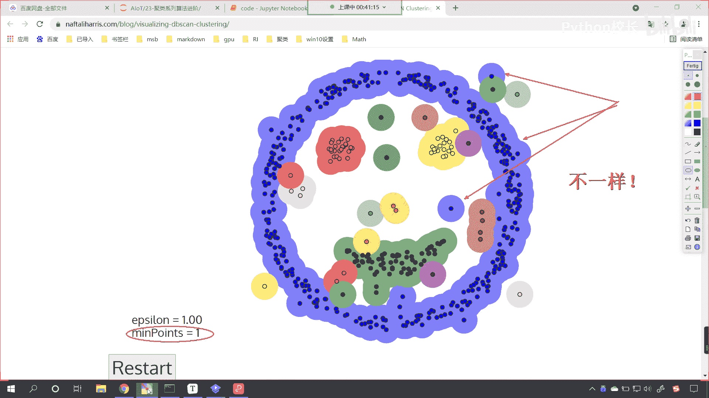

现在你看我把这个数值咱们给它调大啊，咱们来一个restart是吧，依然选择这个，我们将这个你看调大啊，大家看看，现在你看我执行，调大调大的话，那你想这个条件是不是就苛刻了呀，看到了吗。

调大咱们这个条件就苛刻了，因为大家注意咱们上边这些点，你仔细观察，每次和每次是不是都会不一样呀，看到了，也就是说这个形状当中这些点它的分布，每次和每次也都会不一样，那这就涉及到这些点是吧。

它是怎么生成的呀，它呢其实就是呃随机数生成的啊，看它呢就是随机数生成的好，那么这回呢咱们连到一起了，唉现在你就能够，现在你就能够发现，唉你看现在你就能够发现，你看这几个点儿看到了吧。

这个黄色的点它本来应该被划归到哪一类呀，本来是不是应该是绿色呀，对不对，本来应该是绿色，对不对，但是呢这个黄色的这几个点，为什么它自成了一个类别呀，你想一想为什么，是不是。

因为咱们这个main points在这做了一个限定呀，我们能够发现啊，你看咱们能够发现黄色的底和咱们绿色的底，这个中间是不是这个空隙稍微大一点呀，看到这个空隙稍微大一点，你这个空隙稍微大一点。

我们在进行画圆圈的时候，你想我们这个点到绿色这个点儿了，咱们在进行画圆圈的时候，你想是不是因为离得稍微有点远，是不是就有可能不够六个呀，你要不够六个条件不满足，那上边这个黄色的这个区域。

这些点本来应该被划归到绿色的，但是呢你条件苛刻。

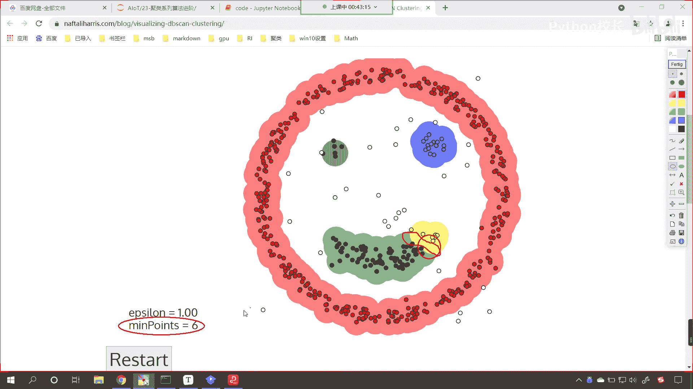

是不是就达不到了，哎这就是咱们嗯这个参数它的作用啊，好大家现在明白咱们的main sample这个参数，它是怎么一回事的吧是吧，所以说咱们这个mean sample过大，咱们的核心对象。

咱们的这个main sample过大，则核心对象呢会会过少，此时促内部本来是一类的词，看到了此时处内部对象本来是一类的，是不是可能会标记为噪音点呀。

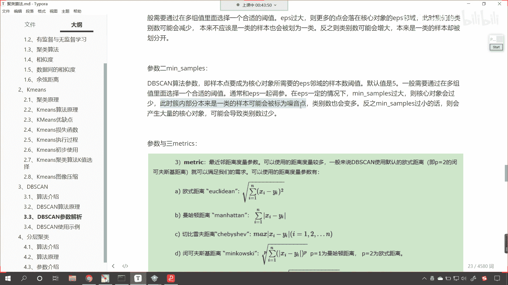

看到了吧，此时你就像咱们这个当中，你看本来这个黄色的应该是绿色的这一簇。

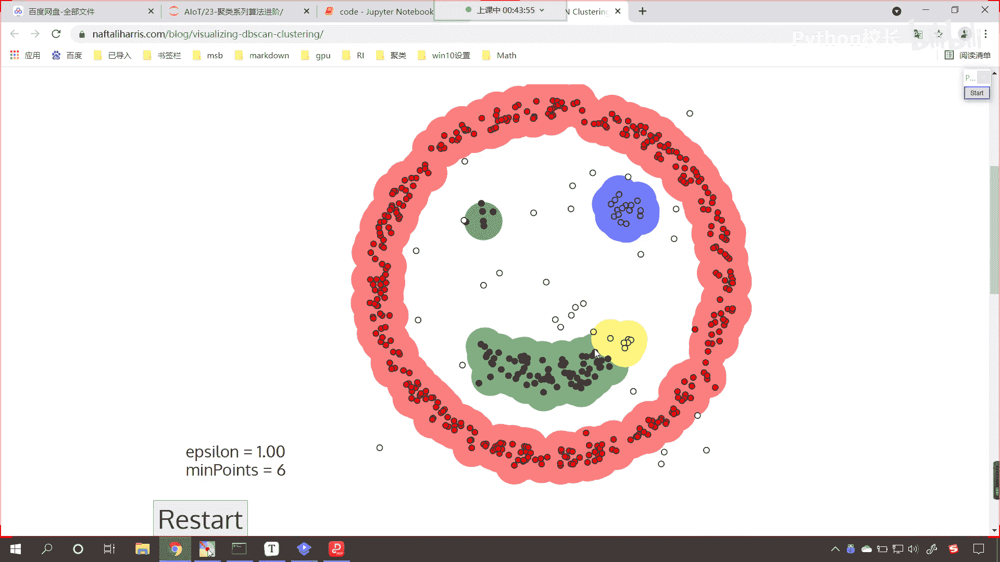

但是呢我们把但是呢咱把mean sample调大了，那这个时候呢他就可能会是造心底，也就是说你就包不进来了，那我们网页上出现的这种情况呢。

它其实就是这几个黄色的点是吧，它自己分成一类了，好那么我们再看一下，还有咱们的参数三，你看在我们代码当中。

咱们的参数三呢有matrix，这个matrix就是它的度量标准，就是你想要画圈是吧。

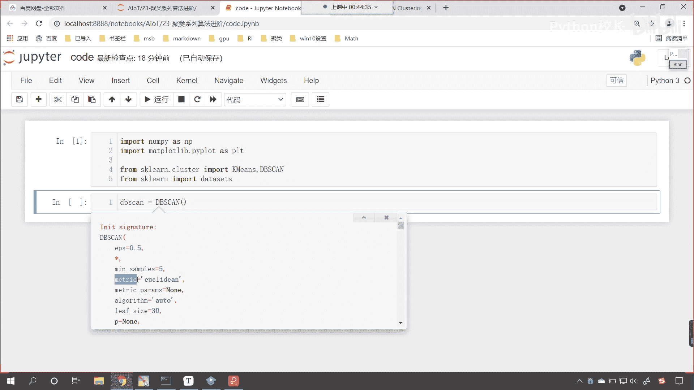

你看咱们画圈，咱们刚才在这个网页当中画的这个圈儿。

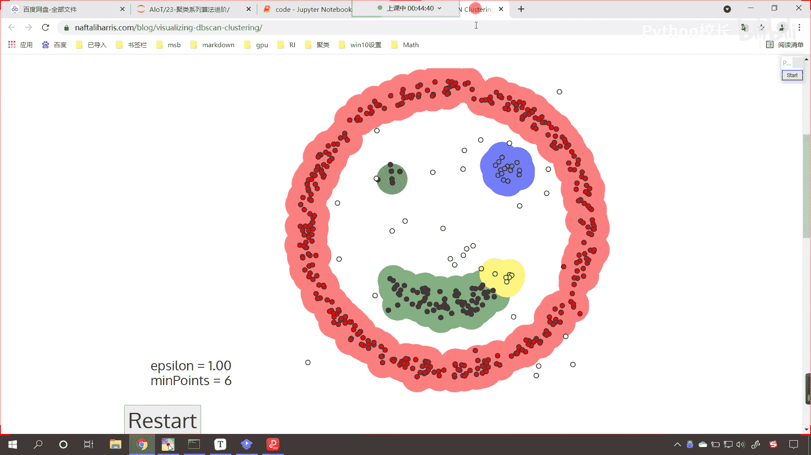

我们是不是根据距离来进行画圈呀，那这个距离度量度量标准那就有好多了，大家看这个叫做嗯yukdm，这uk dem呢它就是欧式距离，那么除了欧式距离还有哪些呢，你看我们往下看啊，看咱们这个matrix是吧。

咱们这个欧式距离呢它有好几种哈，默认情况下是欧式距离好，那么我们还有哪些常用的距离呢。

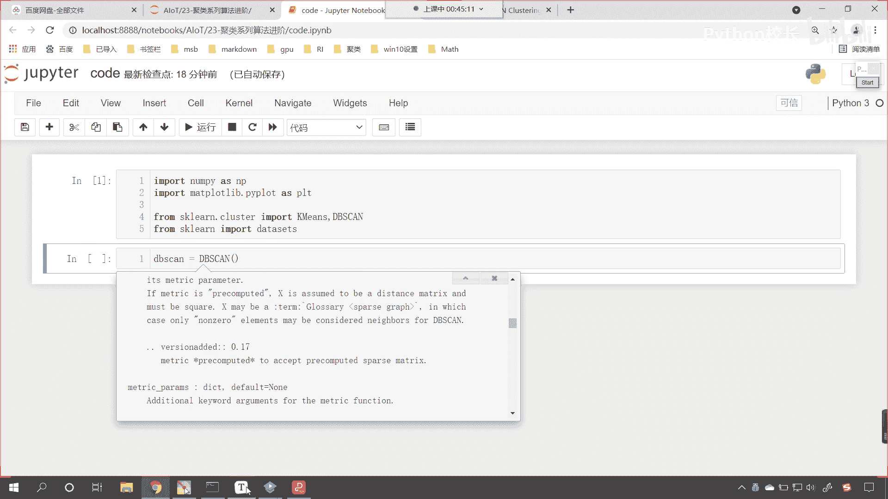

来现在呢我给你看一下啊，你看咱们的距离呢，还有这个曼哈顿距离。

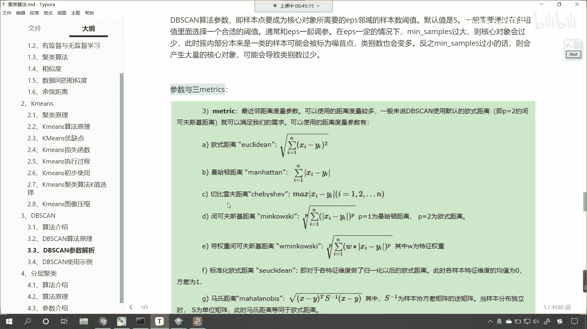

这个切比雪夫距离，闵可夫斯基距离带权重的明可夫斯基距离是吧，这个马马氏距离这个标准化的欧式距离。

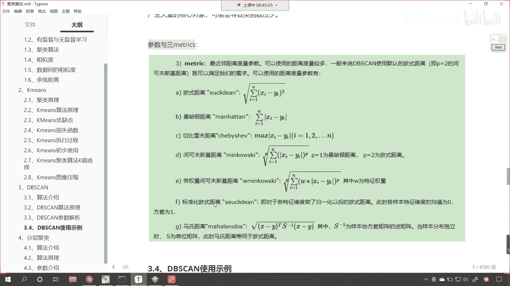

这些呢都可以作为参数，咱们呢唉来调整这个麦。

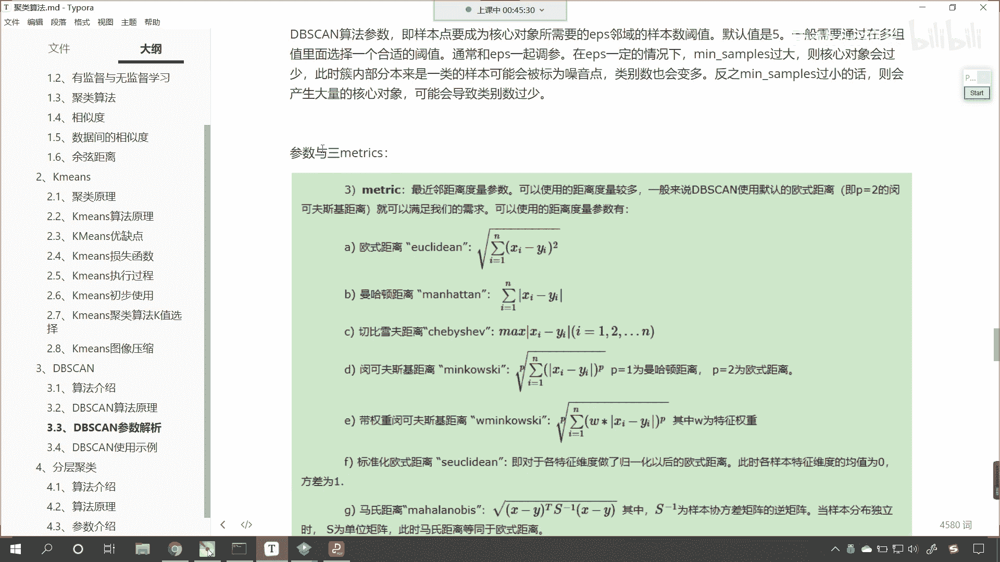

来调整这个matrix好，那么到这儿呢。

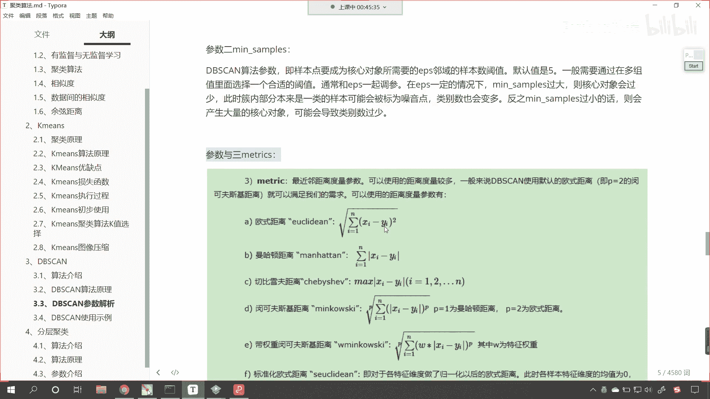

咱们就对于db看这个算法原理是什么。

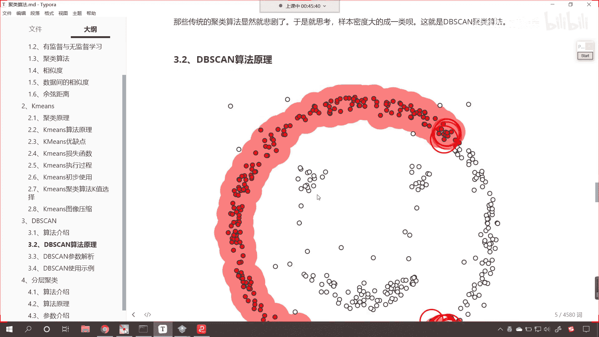

我们进行了我们进行了介绍，并且呢咱们对于db scan它最常用的参数。

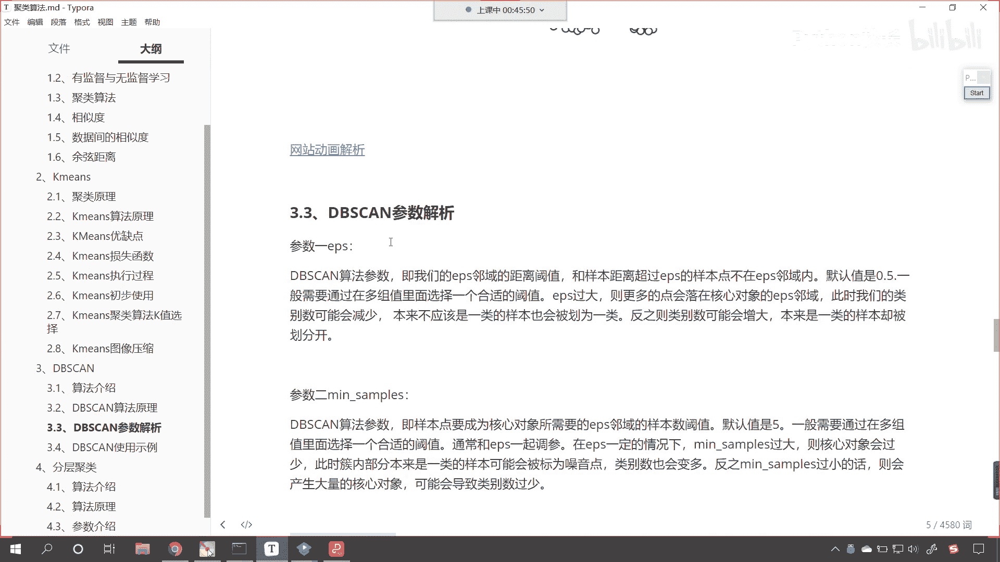