# P149：3-DBSCAN聚类案例数据创建 - 程序大本营 - BV1KL411z7WA

好那么我们知道了算法是怎样的，一个怎样的一个原理。

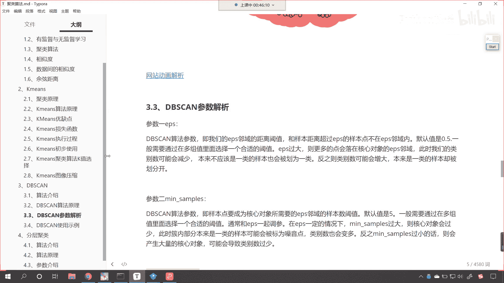

那接下来呢我们就对于这个算法，咱们进行使用啊。

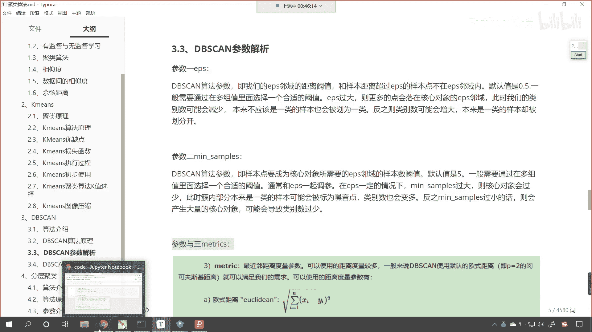

来回到代码当中好，那么回到代码当中呢，我们首先呢去创建一下数据，那在这个地方咱们来一个三级标题，这个呢就是，咱们创建数据，那我们导包咱们导了一个data sets，咱们呢就使用它来创建数据。

那这个时候呢咱们调用一个方法叫做make，大家看这有一个方法叫make circle，好，那我们的make a circle它的作用是什么呀，看这个make circle。

make circle它的作用是不是就是画啊，这个画圆圈呀，对吧好，那么我们给它一个样本量n sample，咱们现在呢给1000个，然后呢我们给点噪声，noise呢咱们让它是0。05。

然后呢我们给一个factor，这个factor呢就是内圈和外圈它的一个比例好，那么现在呢我们接收一下叫x和y，有了x和y呢，我画图给你显示一下啊。

p t咱们调用scanner s c a t t e r，小括号x中国二冒号零放进去，x中括号冒号一，这是它的横纵坐标，然后呢我们给一个颜色，颜色呢就是咱们的类别外好，那么大家看啊。

我刚才不小心是不是多写了个等号呀，删除其中一个再来执行，现在小伙伴你就能够看到咱们的数据，我们是不是就创造出来了呀，对不对好，那么这个数据创造出来之后呢，咱们再给他增加一个数据啊，那我们在画图的时候。

咱们调整它的尺寸，那就是plt。figure，咱们呢给一个figure size，咱们让它是五和五，这个时候看起来它就是一个圆圈了，你现在能够发现观察一下咱们这个数据。

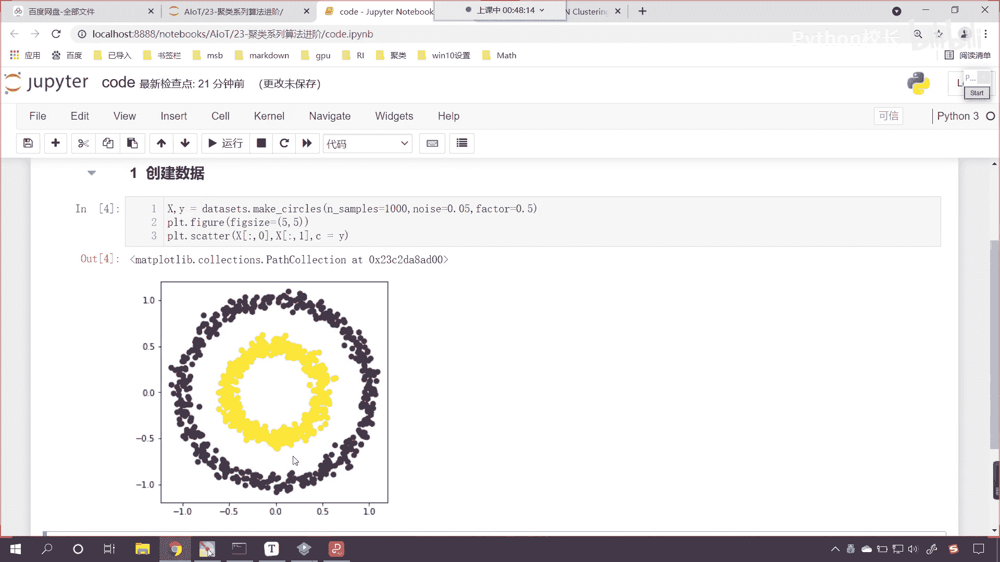

我们的圆心是在哪里呀，你看横坐标和纵坐标，你能够发现你看这个数据，他是不是在零和零的位置呀，对不对，在零和零的位置，那接下来呢我们再生成一类底啊。

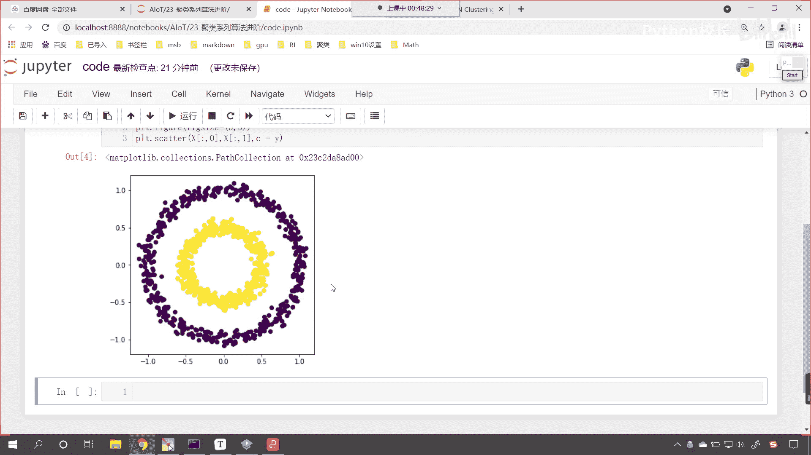

咱们生成这类点，我们希望它的数据效果是咱们这个图当中的，左边这个形式和样式好，那么这个时候呢咱们再调用咱们的data sets，我们再调用一个方法叫make blob。

那这个方法呢就是帮助我们生成这个一类点，好，那么此时呢咱们给它传入相应的参数，我们给它500个点儿，然后逗号咱们给一个n features，那n features就表示两个特征，那就是横纵坐标。

然后呢我们给一个centers，这个center就是它的中心，咱们呢给1。5和1。5。

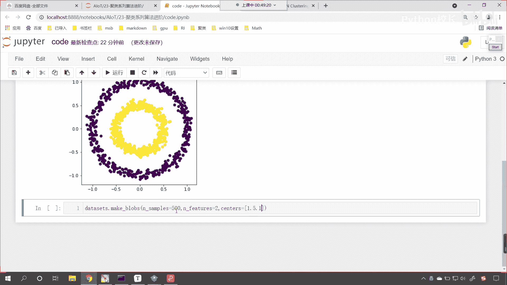

你看如果我要给1。51。5，那你想一下咱们这这类点的生成，它是不是会在这个右上角呀，看到了吧，这类点因为你这个地方是一，对不对呀，嗯你这呢也是一，如果我们要给1。5的话，那么他大概会在右上角生成一簇点。

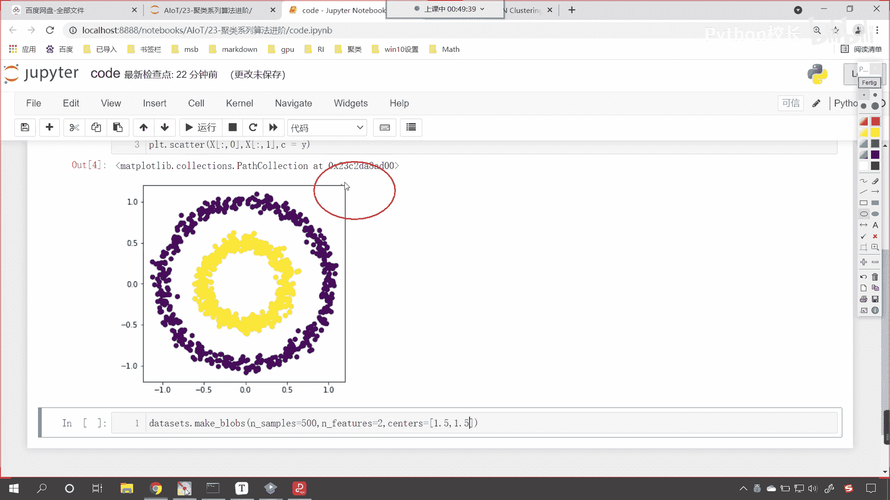

好那么然后呢我们再给一个约束啊，叫做cluster s t d，这个呢就是咱们的标准差，这个标准差数据越大，那么它的波动情况就越大，现在呢咱们接收一下这个数据，这个是500个数据。

我们把这个数据呢给它变成x一和y1 ，我们画图展示一下这个数据，让各位小伙伴看一下它长什么样，那咱们横纵坐横纵坐标取出来，那就是x一冒号中括号二零，这个就相当于咱们的横坐标，然后x冒号给他个一。

这个就相当于纵坐标，然后呢我们把y一放进去，那么咱们的画图呢同样横纵坐标，这个横纵坐标有一个比例，它呢不是一比一的，咱把它调整成一比一的，给他一个figure，figure size，咱们让它是五和五。

这个时候你执行一下代码，看一下咱们某一个地方给错了，是不是except 2 d，咱们got是一维的，是不是啊，那是不是就说明我们传入的这个数据不太对呀，来那咱们大家不要大家那个看一下。

咱们如何调bug啊，我们看一下它的sh x1 is not define是吧，好咱们明白了啊，也就是说明咱们x一和y1 ，这个数据是不是没有创建呀，那没有创建呢，你看这个来shift tab。

咱们看一下这个参数，你看n sample是100，是不是我们现在调成了500，n features是不是二，咱们是不是给了个二好，那么接下来还有一个参数，大家看咱们这个参数是不是center呀。

我们看一下这个centers它需要什么样的啊，你看这个centers哎，各位小伙伴，你能够看到咱们这个centers，你看我们给的这个数据是吧，我们能够发现你看他要的是一个什么样的呀。

看他要的是不是一个元组呀，看到了吗，他要的是一个元组，对不对，我们现在给成什么了，咱们现在是不是改成列表了，我们把它调一下啊，列表呢就表示有多个那列表当中，咱们讲1。5和1。5给它括起来。

这个是不是就相当于一个整体呀，此时你看我再来执行，唉，我们再来看一下啊，此时再来执行的时候，咱发现x和y must be the same size，现在报的错和刚才就不一样了，是不是好哎，我明白了啊。

你看啊，我们想要画的是x1 ，但是我在写代码的时候是不是漏了一个一呀。

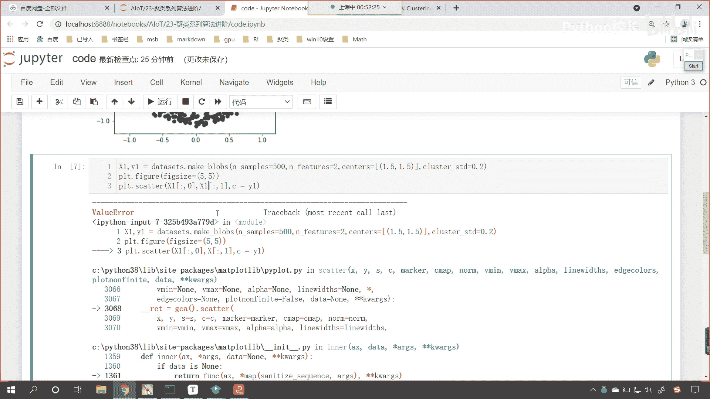

此时咱们再来执行啊，此时再来执行，现在你就发现看这些点是不是就出来了。

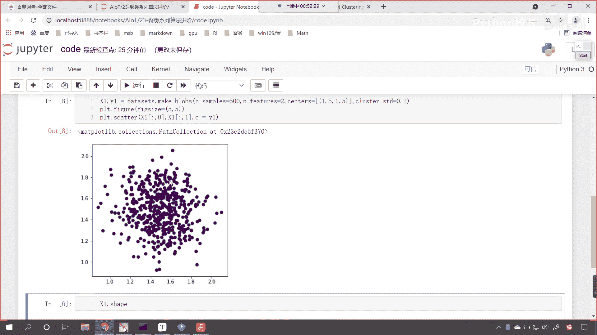

看到了吗，这些点就出来了，大家注意啊，这些都是细节，咱们在给centers的时候，我们可以给int，这个int呢就表示我们生成几类点啊，centers这个参数，你把这个参数翻译一下。

它是不是就有中心的意思呀，我们既然使用，咱们既然使用make blog，make blobs，让它帮助我们生成数据，那么它所生成的数据就是几类点儿，咱们给的这个center就是告诉这个方法生成几类点。

那这个参数呢你可以直接给个int，就是说你给3k，那么它生成三类点，给个四，那么它生成四类点，上一节课咱们是不是就用到了这个方法，那么all它还可以是什么呀。

它还可以是shan centers and features，它是不是还可以是这种形状呀，对不对好，那么所以我们在这儿呢就给他一个列表。

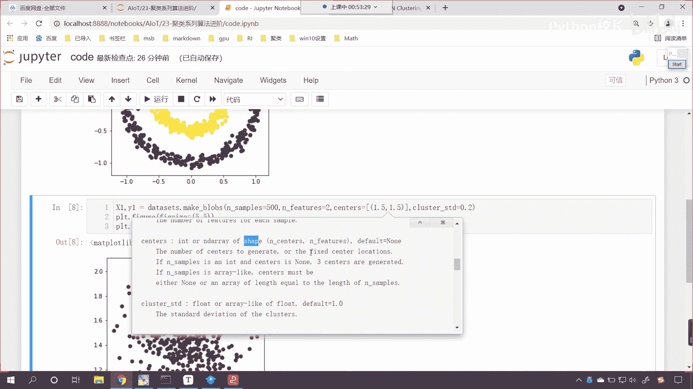

列表当中就是咱们的中心，现在你看咱们生成的这一促点，它的中心是不是在1。5水平。

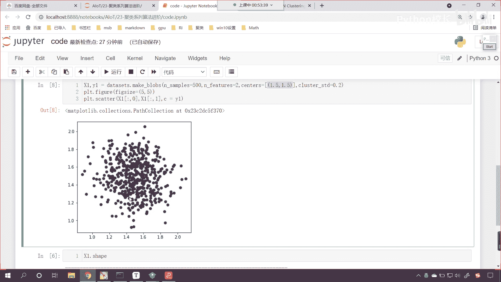

1。5数值1。5呀，对不对好，那么现在呢我们就将上面这个图和下面这个图。

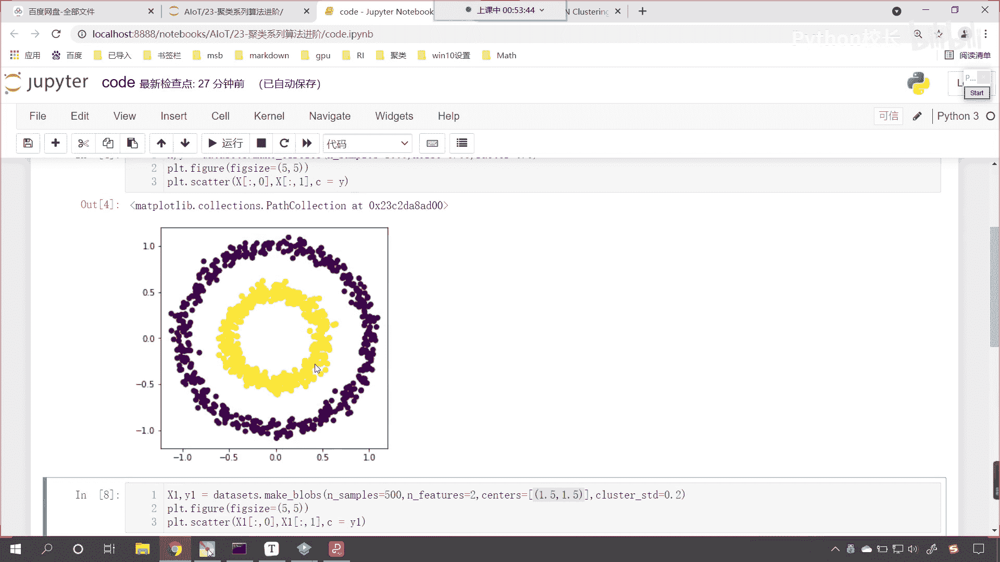

这一共是1500个点，咱们呢将它合并是吧，那我们合并需要注意什么呢，啊咱们合并需要注意什么呢，咱们看一下咱们的y，你想这个y是不是表示类别，看咱们上面这个y是不是零和一，看到了吧，上面这个y是零和一。

下面这个y呢，下面这个y是y1 。

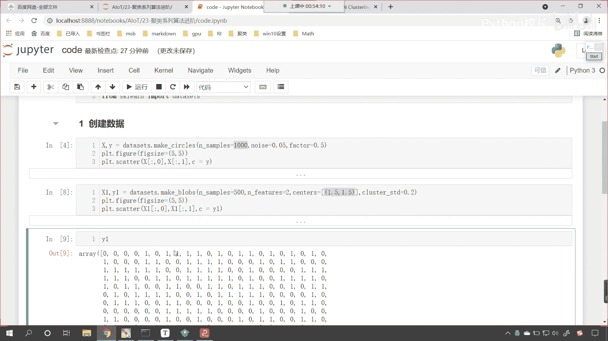

你现在就能够看到它里面是不是全是零呀，对不对。

它里面全是零，那么各位小伙伴，你能知道我们上面所生成的这1000个点，它是不是分两类呀，下面我们生成的这500个点儿，它是不是是一类点呀，那我们上面这1000个点和下面这500个点。

它如果要合到一起的话，大家想他是不是就是1500个点，是不是分三类呀，对不对，你看咱们总结一下，如果我们要合并的话，那么他们就是1500个点，是不是应该分三类呀，对不对，但是呢我们刚才打印输出了。

各位小伙伴就能够看到，在我们所生成的y当中看，在咱们所生成的y当中，它它的类别表示是零和一，而在咱们的y e当中，咱们的类别表示是不是都是零呀，那这个可怎么办呢，哎这个其实也简单啊。

你看如果我要将y一统一都加上二会怎么样，它是不是就变成二了，那我们就是用数字的差异来表示类别的不同，所以说咱们在进行数据合并的时候，我们呢就让y一都统一加上二来，现在呢咱们就使用咱们的说这个数据。

来对它进行一个合并啊，好那么就是咱们就调用np。cocinnate，来一个小括号，中括号，咱们将x和咱们的x一进行一个数据的合并，合并完之后呢，新的数据咱们就叫x，我们查看一下x它的形状。

现在你就能够发现是1500和二形状正确，那我们的y咱们调用np。cocknet来一个中括号，咱们将y和y一放进去，那么这个时候咱们说这个y1 ，我们需要进行让他统一都加二的一个操作。

是不是咱们也给一个y啊，这个时候咱们display一下，我们查看一下咱们y的形状，同时调用np。uni q这个方法，我们查看一下咱们新生成的这个y当中，他的唯一他的唯一值有哪些。

来现在你能够看到结果1500个点，咱们的array是不是012呀，诶那正好符合咱们的要求，那数据合并了，此时呢我对于这个数据进行一个展示，咱们将新合成的x冒号取它的横坐标。

取它的纵坐标颜色就是新生成的c，此时你看过一执行来，现在小伙伴能够看到，咱们所显示的这个结果是什么样的呀，看到了吧，咱们plt。figure调整一下它的尺寸，现在咱们所生成的数据，它是不是就是三类呀。

看到了吧，是三类吧，看到了吧，右上角是黄色的，然后呢这个圈呢外圈呢是紫色的，里圈是不是里圈，是不是咱们这个蓝绿色呀，对不对好，那么看到这个结果，看到咱们所生成的这个数据。

那我们就知道如果要把它分成三类的话，你想一下，如果要把它分成三类，你怎么分呢，想要把咱们这个数据分成三类，你怎么分，很显然咱们画出来涂这个颜色，它分的类别是不是没毛病呀，对不对好。

那么咱们刚才这个视频呢，咱们刚才这一段内容，我们呢其实就讲了一下数据的创建好，那么各位小伙伴，咱们在讨论区里边问各位小伙伴一个问题啊，你明白我这我这一部分代码数据是怎么操作，数据是怎么生成的了吧。

理解的小伙伴呢。

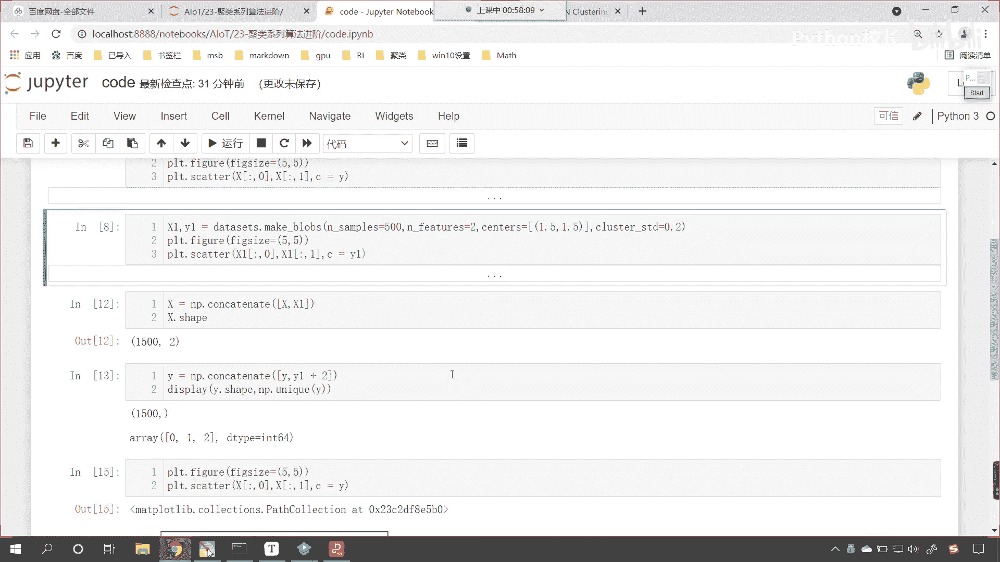