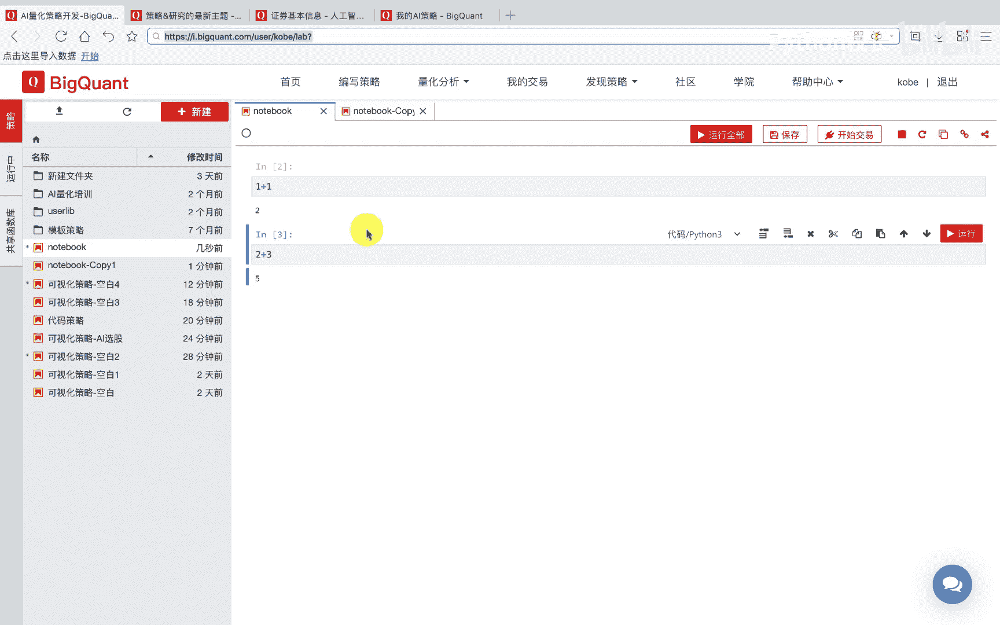
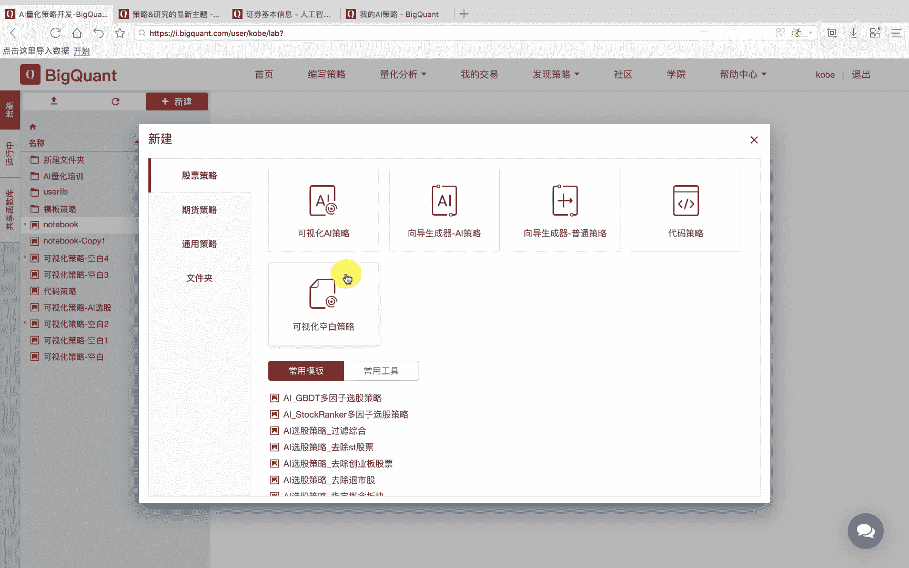
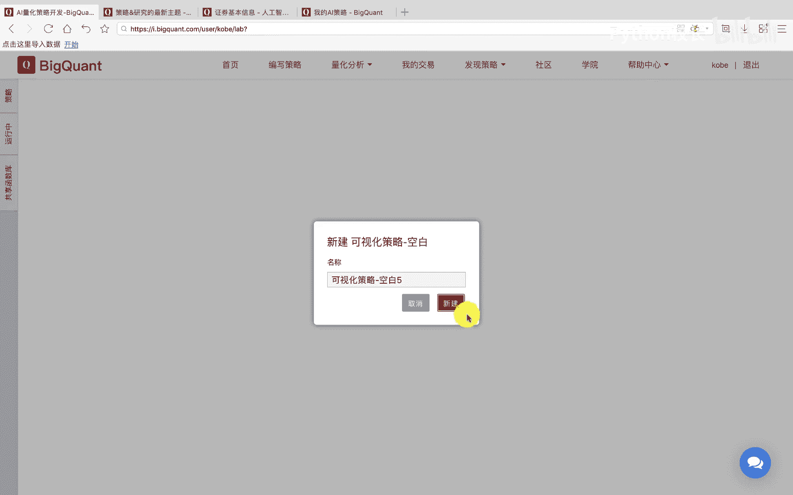
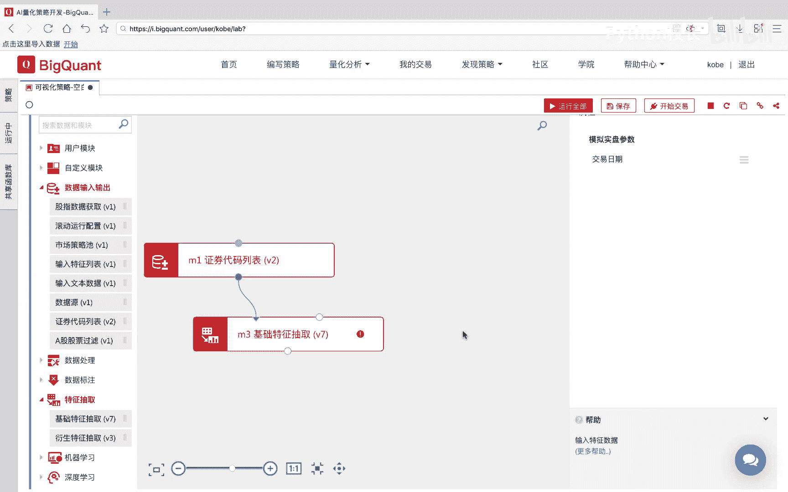

# P15：2.3.2-可视化模块实操 - 程序大本营 - BV1KL411z7WA

然后我们讲解一下可视化策略开发环境，big studio。

我们关闭这两个notebook，点击新建。

选择通用策略，我们将单击可视化空白策略。

点击新建，当我们创建了一个可视化空白策略后，我们就进入了可视化策略编写界面，可以看到该界面由三部分组成，左侧的模块导航栏，中间的画布以及右侧的属性栏，在左侧的导航栏中包括了模块。

搜索引擎以及模块功能组列表，我们可以看到平台提供的模块功能组，包括自定义模块，数据输入输出模块，数据处理模块，特征抽取模块，机器学习与深度学习模块等，我们通过展开对应的功能组列表。

可以看到该组下包含了多个模块，例如数据输入输出模块，列表中包括了输入特征列表模块，数据源模块，证券代码列表模块等，并标注了其对应的最新版本号，以v开头，例如数据源模块v1 。

表示当前该模块的最新版本号为v1 ，我们可以通过鼠鼠标左键单击模块名称，并拖拽到中间的画布中，实现模块的创建，例如我们点击证券代码列表并拖拽到画布中，就创建了正确代码列表这样一个模块。

该模块在画布中拥有唯一的代号gm 1，可以看到模块是一个矩形的方框，由上边框和下边框构成，边框的中间对应着圆圈，表示为该模块的输入或输出节点，上边框的圆圈表示输入节点，下边框的圆圈表示输出节点。

每一个模块就类似于一个函数，需要我们设置输入的数据，并设置该模块，该函数的参数即右侧属性栏中的相关参数，经过数据处理后，会将数据输出给输出节点，并通过输出节点连接到其他模块，进行数据的传递。

我们可以看到在画布中，最下角有一个功能栏，我们可以通过点击导航图并拖拽画布，来进行某一个位置的区域查看，我们可以通过单击减号或加号，来实现画布的放大或缩小，我们可以通过点击一比一，来实现模块的正常显示。

或通过自适应按键来自适应模块显示，我们通过点击移动按钮可以实现画布的拖拽，我们鼠标单击模块进行拖拽，就可以实现模块的移动，可视化界面其实是一个notebook的cell单元。

我们可以看到上方有对应的notebook，sell单元的操作，例如在前方插入cell单元，在下方插入cell单元上移或下移等，这里我们可以通过点击可视化下拉菜单，选择代码来查看该可视化画布对应的代码。

可以看到该画布中只有一个模块，其代号为m1 ，对应的模块名称为m。instruments v2 ，即证券代码列表模块的英文名称，v2 表示该模块的版本，括号内表示了该模块的相应输入参数。

例如start date and date market instrument list，分别代表了可视化模块，右侧属性栏中的开始日期，结束日期交易市场以及股票代码列表，我们缩小画布。

并拖入更多的模块进入画布，我们这里拖入输入特征列表，模块以及特征抽取中的基础特征抽取模块，可以看到，基础特征抽取模块的输入节点为两个，白色的圆圈，表示这两个输入节点，是必须连接上一个数据的节点。

此时在右侧出现一个红色感叹号，来提示我们必须输入数据的输入节点，没有实现数据连接，也就是该模块并不完整，我们将鼠标移动到其中的一个节点，可以看到，此时提示我们该节点需要连接上游的模块。

为证券代码列表模块，我们点击证券代码列表模块的输出节点，并拖拽连接到对应的输入节点，就实现了模块的连接，同样的道理，我们移动模块并进行另一个输入节点的连接，这样可以看到红色的感叹号消失。

该模块已经完成了输入节点的设置，然后我们进行模块的参数配置，例如在正确代码列表中，我们填入开始日期，结束日期的参数，在输入特征列表中输入我们的特征数据等，这样我们就完成了一个工作流的建立。

我们右键单击基础特征抽取模块，并将鼠标移动到运行，选中模块，可以看到，与基础特征抽取相关的所有模块都会高亮显示，表示当我们运行此模块时，相关高亮模块也会依次运行，此外我们可以看到。

当我们选中某一个模块时，表示该模块表示该选项，表示该参数表示当我们勾选此选项时，只有模块在缓存失效时才会重新运行，否则如果模块的输入没有发生变化，该模块的运行结果，将直接存储到指定的某个缓存区域内。

当我们再次运行时，会命中该缓存，并进行结果的直接调取，通过这样的缓存机制，即热点数据分层机制，就实现了数据的快速处理，避免我们每次在运行工作流的时候，都要从头到尾运行一次，大大节省了工作流的运行时间。

提高了工作效率，我们可以通过代码的方式来查看，每一个模块的运行结果，我们可以选择运行m2 模块，运行完成后，我们可以在可视化sell的上方和下方插入excel，我们可以通过编写相关代码。

来查看m2 模块的结果存储，我们敲入m2 ，此时会提示我们m2 的相关方法，data表示数据存储的地址，我们通过运行m2 点data，可以看到该模块的结果存放地址为data source。

以及其对应的地址，我们可以通过data source命令填入对应的缓存地址，来查看结果，我们填入地址后，使用点缀的方法就可以实现data source，地址内存放内容的查看。

这里我们可以看到该运行结果为一个特征列表，即我们输入的属性参数，我们也可以直接通过m2 点data。read，实现该模块数据结果的读取，模块在画布中也可以被复制，剪切或粘贴删除等操作。

我们可以右键点击复制一个模块，并在空白区域点击粘贴，这样就实现了一个模块的复制粘贴功能，我们右键删除这个模块，我们可以看到，当我们删除一个已经连接的模块时。

