# P154：8-分层聚类瑞士卷数据效果 - 程序大本营 - BV1KL411z7WA

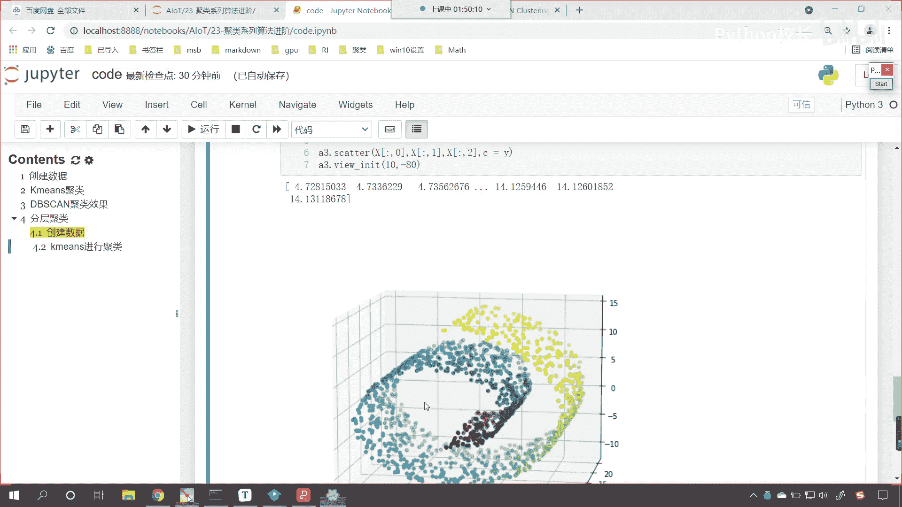

那我们就使用咱们的分层聚类好不好，咱们来一个四级标题，这儿呢就叫做分层聚类，那我们看一下分层聚类，它能不能去解决这个问题啊，好，那么咱们就声明，a g g就等于使用咱们这个算法。

然后呢咱们给一个n cluster，那这个n cluster同样咱们也把它分成六份，然后呢我们给一个linkage，咱们这个linkage呢你看咱们可以选择好几个啊。

这回我们使用word这个word表示什么，看到这个linkage是不是表示word呀，这个word是不是就是最小化它的方差呀，当然你其他的都可以选啊，你看啊我们往下滑，他有对这个参数进行说明，看到了吧。

这个linkage，是不是就是从咱们这几个当中进行选择呀对吧，参数的调节我们可以一点一点调，选择最合适的一个，是不是，咱们现在先选择这个word，这个word呢就表示最小化它的方差。

也就是说我们把它分成一组了，你这一组里边的方差要怎么样，要最小方差最小说明你挨得比较近，对不对，好，那么咱们就使用这个算法，我们将咱们的瑞士卷数据进行训练，然后呢a g g点得到它的labels。

就相当于是得到他的预测值标签是吧，然后呢我们就开始画图啊，画图咱们就不重复了，是直接复制一下，上面咱们在这儿来一个粘贴好不好，因为你都是画这个3d图形，是不是啊，我们嗯预测得到的目标，得到的这个标签。

咱们都叫歪杠哎，所以咱们在这儿呢这个下面画图的，咱们直接就拿过来了啊，看此时我一执行唉。

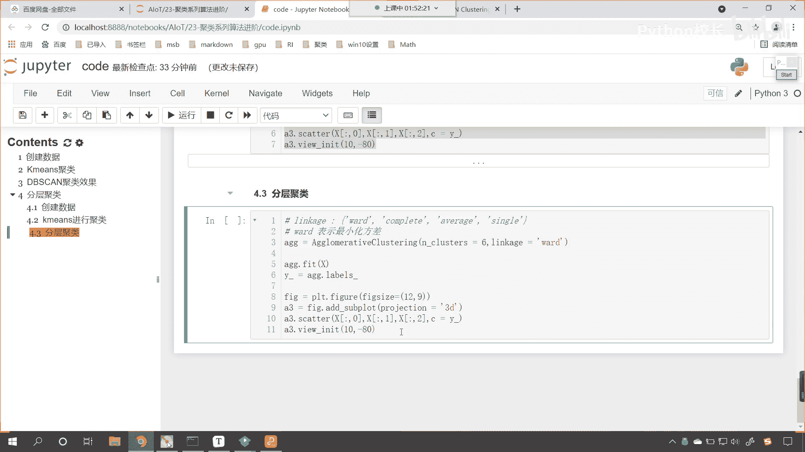

来各位来看一下，诶你发现这个和刚才使用k means，效果是不是差不多呀，是不是差不多，差不多是吧，你看它有没有跨越咱们的瑞士卷的层层呀，有看到了吧，你这个颜色和上面这个颜色是不是就重了呀。

是不是就这个同一个颜色，唉这说明他也不行是吧。

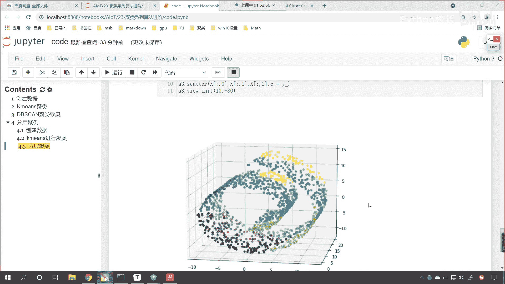

也给跨层了，那怎么办呢，上面咱们刚才在课程当中。

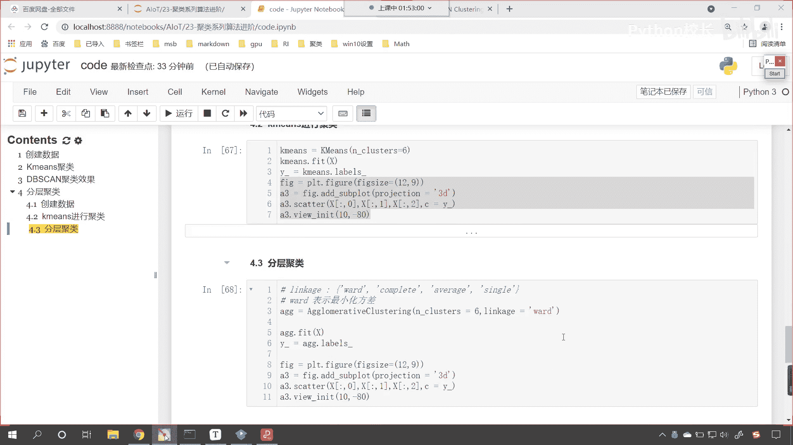

我们介绍了一个叫做连接性约束，是不是讲了这样的一个参数呀，你看这叫connectivity，它叫连接性约束，它的作用呢是只有相邻的醋才能够合到一起，进行聚类，看相邻的醋才能够合并连到一起。

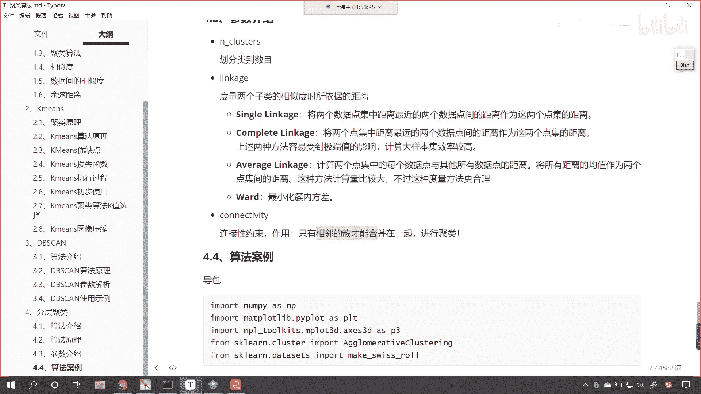

连到一起，那我们的代码当中，咱们使用分层聚类画这个聚类的效果，它也进行了跨层是吧，这一层和下面这一层进行了进行了这个聚类，那我们调一下咱们的参数啊，比如说我们调一下ever rage。

我们看一下这种效果怎么样，你看一直行，大家看这个average是不是也跨层了，看到了吧，紫色的和下面这个是不是一样的，那我们再调啊，咱们再调一个叫complete c o m p l e t e。

这个就是两处点内离得远才算是吧，结果是不是也不如意呀，咱们使用一个single呢执行一下诶，大家看啊，你看如果我要使用single会怎么样，这所有的是不是都变成一类了是吧。

这说明咱们这四个参数都调了也不行，对不对呀，好那么接下来呢咱们就使用一下连接性约束好。

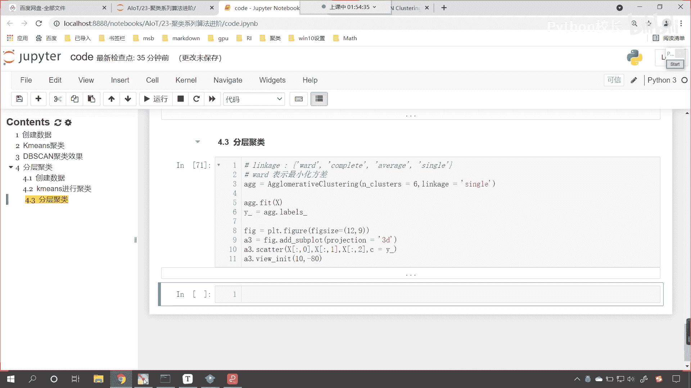

那么连接性约束它的作用是什么呢。

看咱们往下看看一下它的作用啊，对于咱们这种非og几何的数据，你看为什么说它是非欧几几何呢。

你能够发现这个瑞士卷，它是不是有卷的这种形式呀对吧，这就像这个科幻小说里边说的，我们的时空如果要弯曲的话，咱们是不是就可以实现这个穿越。

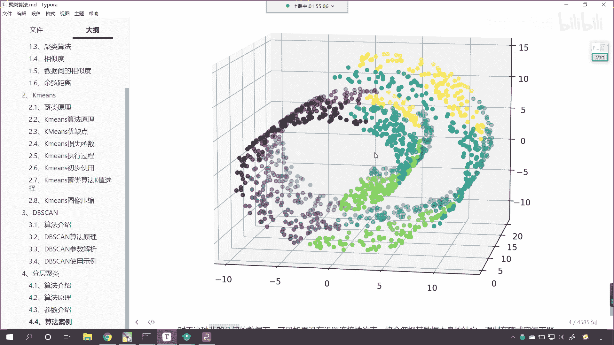

时空穿越，是不是回到我们小时候是吧好。

那么对于这种非欧几何的，非欧几几何的数据是吧，如果要是没有咱们连进行约束，那么咱们在进行聚类的时候将会忽略，将会忽略数据本身的结构，那么我们就会在欧式空间距离下咱们进行聚类。

于是呢就容易形成上图这种跨越流行的，不同褶皱，你看就容易形成上图这种跨越流行啊，就是就相当于是跨层了，对不对，你看就相当于跨层了。

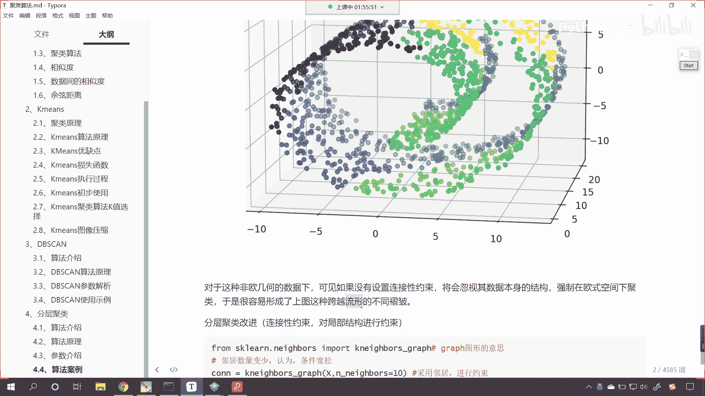

我们的瑞士卷，你是不是可以把它理解成它是一个流形的呀，看到了吧，它是这样的，是不是看到它是这样的一个结构，很显然看咱们刚一开始的时候和这是吧，它其实离得不远，但是呢它是不同的层是吧。

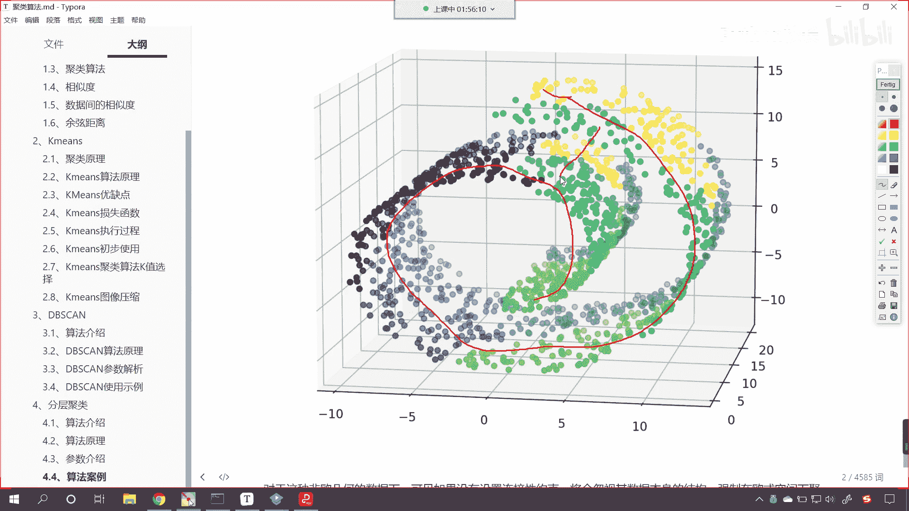

那我们通过什么来限制呢，哎咱们就通过咱们呢就通过这个连接性约束。

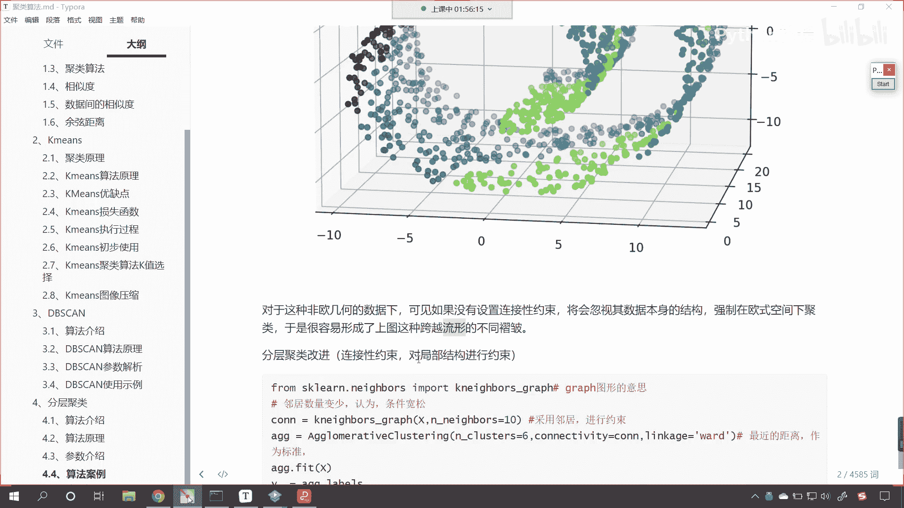

来回到咱们代码当中，咱们操作一下啊，来一个四级标题，这个呢就是咱们，分层聚类连接性约束它的作用呢，哎我们就可以实现是吧，这个嗯咱们就可以呃，这个对它进行一个空间的约束，好，那么咱们导一下包啊。

from sk learn，我们从neighbors下边，neighbors翻译成中文是什么意思，是不是有邻居的意思呀，然后咱们来一个key neighbor graph，好那么它的作用呢。

它的作用就是根据邻居的这个远近，来对它进行约束，然后呢我们创建一个连接层，cn就等于k neighbor graph，那我们根据这个数据来进行，然后呢咱们给他一个enneighbors。

这个邻居呢必须得是几个呀，我们可以给他十个，这个数据都是可以调的啊，在这儿的话我们就采用邻居，咱们呢来进行约束，咱们进行了这个空间的约束，然后呢。

我们声明算法a g g就等于格瑞multive clustering，同样呢我们把它的类别我们让它分成六个，然后呢咱们的linkage我们让它是word啊，依然是让它的方差最小。

我们的connectivity连接性约束呢咱们给一个啊，就是咱们生成的这个c o n a，然后咱们a g g。feat一下，训练一下咱们的数据，我们的歪盖呢。

依然等于咱们a g g下边得到的这个labels，得到的这个标签好，那么你看有了这个约束，咱们看一下有什么不一样的地方啊，接下来是不是就是画图了，画图咱们依然把上面的代码复制一下。

ctrl c在这来一个粘贴来，此时咱们拭目以待啊。

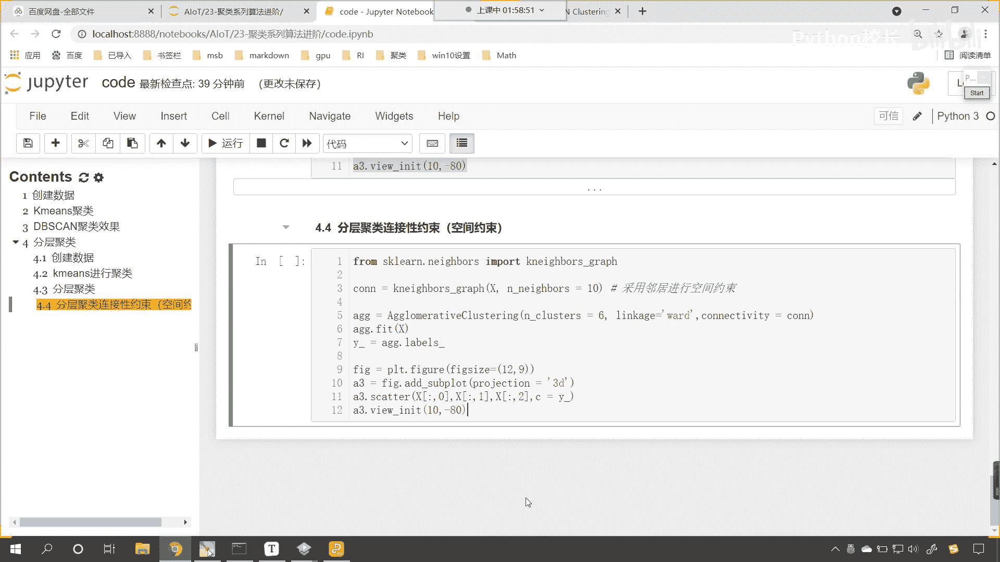

你看我一运行，诶大家现在再来看看，现在你再来看还有跨越流程，还有没有跨越流程，这个这个情况出现还有没有，你看是不是就没有了呀对吧，那我们将邻居的数量调整一下啊，我们调整成五诶。

大家现在来看是不是就没有好多了，是不是啊，你看这回就好多了是吧，那我们就能够发现啊，你看其实咱们肉眼看到的是吧。

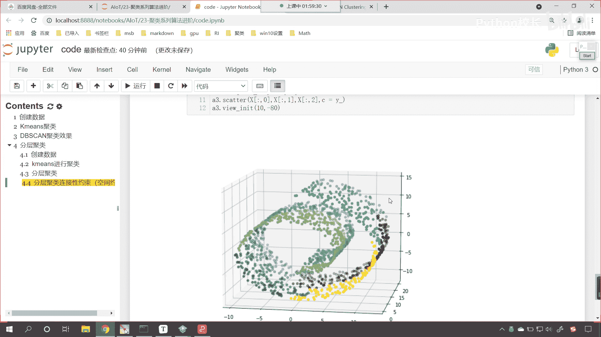

我们这一层看看咱们这个瑞士卷啊。

看就是在在这一层，这是吧，这个是一个绿色的对吧，看这是一个绿色的，我们发现它里边是不是还有一个颜色呀，就他这个在同一层内是吧，进行了一个分开啊，那说明他们俩之间的距离肯定是有一定的距离。

只不过呢我们调整了视图的角度是吧，我们把80调整成20，给各位看一下啊，你80要调成20，你看是不是就从另一个方向去看它了，另一个方向你去看的时候，你就能够发现是吧，这个嗯这个瑞士卷的这个数据是吧。

它确实有一定的确实有一定的间隔啊，所以我们使用分层聚类，它才会聚成这种效果好，那比如说我将这个邻居数量是吧，咱们再调调成15个啊，我们看一下它会怎么样，嗯我们再调大一些，比如说我们调整成30个执行，唉。

大家看我们调整成30个，现在你就发现是不是又有跨层的这种情况了，看到了吧，调整成30个，是不是上面和下面是不是又连到一起了，是不是又有跨层的情况了，你想这个我们给的这个邻居数量多了。

你看我们给的这个邻居数量多了，我们给了30个，那你想咱们在找邻居的时候，他是不是就会把下面这一层也给你包括进去啊，所以说我们调小一点啊，咱们调整成十唉，这个时候咱们再进行。

对于这种空间数据进行聚类的时候，那么我们就可以很好的对它有一个约束，那这个约束呢，咱们就起到了这样的一个作用是吧，在这一层内，你看这一部分就全是紫色的底，这一部分就全是绿色的底是吧。

上面部分就是全是咱们，所以说呃咱们有了这个约束是吧，那么我们就实现了这种啊，有了这个约束呢，咱们就实现了这种空间数据是吧，这种非欧几几何数据下的这种聚类效果是吧。

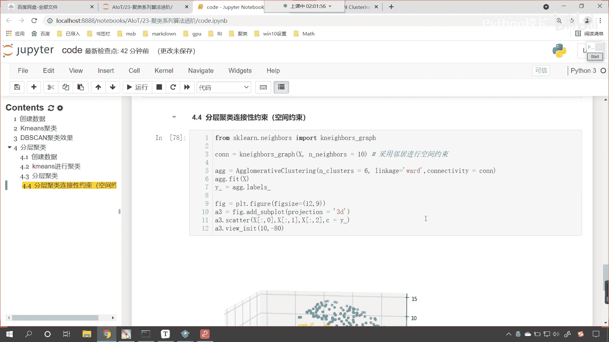