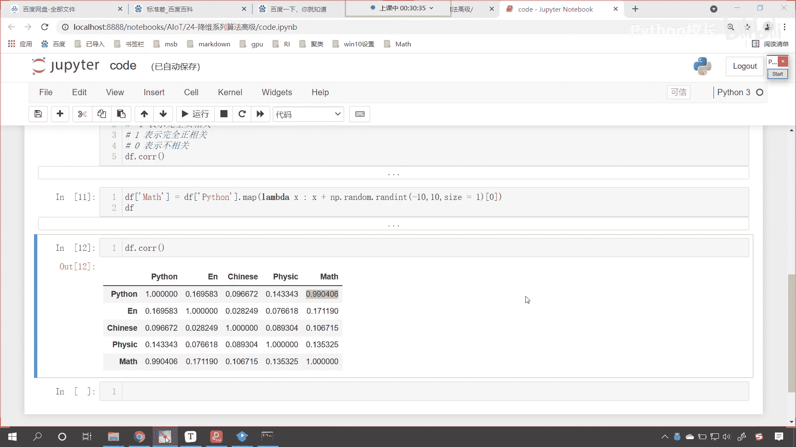

# P156：1-数据相关系概念介绍和代码演示 - 程序大本营 - BV1KL411z7WA

来那咱们现在呢就开始我们的课程，无论你是否有印象，咱们今天呢一定会加深你的印象，让你知道咱们的降维算法它到底是怎么一回事，如何进行了这样的操作，那我们首先看一下咱们的相关背景啊，其实在许多领域当中呢。

咱们通常呢都含有多个变量的数据进行观测，那我们收集大量的数据后呢，咱们进行分析研究，寻找规律嗯，你就像当年开普勒是吧，我们知道现在呢有开普勒三大定律，对不对，你知道开普勒三大定律它是怎么得到的吗。

他呢是从他的师傅低谷那里拿到了一手的资料，你看这有有的时候啊，这个历史很有意思啊，开普勒是一个天文学家，他的师父帝古也是一个天文学家，那这个低谷呢特别有钱，开普勒呢很穷，那这个低谷呢眼睛特别好。

呃这个开普勒呢是一个近视眼儿，低谷呢有钱热爱天文学，所以说呢他就自己建造了天文天文台，每天晚上是吧，看星星是吧，对于这些这个红尘是吧，滚滚红尘从来不从来呢这个不太喜欢啊，就喜欢看星星。

一辈子就记录星星的轨道，那开普勒呢眼睛不好，你让他观测星星是吧，他观测不准，但是呢开普勒的数学很好，低谷的数学一塌糊涂，低谷研究了一辈子，看了一辈子星星，最后规律没找到，临死之前就把自己的资料是吧。

那海量的资料，天上的星星，那是不是就老多了呀，交给了开普勒，开普勒呢一辈子就研究这一麻袋数据，那这个多个变量你首先包含位置，是不是啊，还有这个星星的亮度等等，然后最后呢。

开普勒就研究出了这个总结出来的规律，那就是开普勒三定律是吧，那后来开普勒被称为什么天空立法者是吧，那他到底是怎么找到的呢是吧，这么多庞大的数据呢，这么多庞大的数据它是怎么总结出来的规律呀。

哎那就是用数学的方法嗯进行了总结归纳，当然肯定是进行了各种各样的计算，对不对，那对于我们而言呢，如果数据量很多是吧，我们当然不是希望这个数据越多越好，咱们希望这个数据的质量越高越好是吧。

那在多变量大数据集，无疑呢会为研究和应用提供丰富的信息，丰富的信息，你就像淘宝，他希望呢掌握你的信息越多越好，这样的话他才能够给你精准的预测，但是呢，我们每一个人的信息是不是特别特别多呀。

你想我们每一天会说多少句话，咱们每一天是吧，会有多少个观念在自己的大脑中闪过呢，如果淘宝把所有的这些数据都拿去了是吧，那你想他是不是也分析不出来个所以然呀，他只拿关键的数据，关键的信息。

比如说你是哪一天生日是吧，比如说你的女朋友是什么样的性格，比如说你喜欢什么啊，这个价格的包包是吧，那这些信息对他有用，所以说呢我们在进行数据操作和处理的时候，咱们呢都得是取其精华，弃其糟粕。

那精华如何定义，糟粕又如何定义呢，对不对，那这个就得需要我们慧眼识珠，是不是啊，我们每一个人你看都很聪明啊，咱们都有天赋异禀，很多时候呢我们都希望找到自己的这个伯乐，对吧，希望伯乐能够找到我们。

那对于我们数据而言，咱们把数据当中有用的东西找到是吧，找到有用的这个东西呢，有用的这个数据，有用的这个属性，那么它那这些属性和数据呢，它就是我们想要的千里马，那该怎么找呢，是不是啊，那我们在数据当中呢。

咱们变量和变量之间它呢是存在相关性的，就是数据和数据之间它不是孤立的，那如果我们要盲目的减少指标，咱们有可能会损失很多有用的信息，从而产生错误的结论，咱们现在学机器学习已经有一段时间了。

你知道机器学习和数据之间，是什么样的一个关系吗，在这里我给你打一个比方，咱们机器学习呢就是炒菜做，就是炒菜做饭的烹饪工具，那机器学习这些算法是不是有高级的，是不是有初级的呀，有普通的算法，有牛掰的算法。

对不对，更高级的还有神经网络，这就像咱们的烹饪工具一样，是不是有这个普通的锅，是不是还有不锈钢锅，是不是还有全自动的炒菜锅呀，对不对，你看越来越高级，那数据是什么呀，数据呢就是我们的食材。

你的数据越干净，你的数据越有机是吧，你是有机蔬菜，那你随便炒炒两下是吧，咱们做出来的饭菜都是可口的，如果我给你一颗烂白菜，那即使给你一个金锅是吧，你烹饪做出来的饭菜它能好吃吗，是不是啊。

所以说你看我们对于数据的处理，那是不是就非常非常的重要呀对吧，我们给什么样的数据，那么咱们就会得到什么样的结果，你看这个有一句话是这样说的啊，是你所吃的食物的产物是吧，你吃什么，你是不是就变成什么了。

对不对，你读什么样的书，你是不是就会产生什么样的思想呀，对不对，那我们给算法什么样的数据，那你想就是这个算法再牛掰，他是不是分析得到的结果，也不可能超过我们数据本身，它自身的这个限制吧对吧。

你给的数据是吧，就是不好的一个数据嗯，这个乌七八糟的，那我们得到的结果自然就不是特别好的，一个结果好。

那么大家看啊，你看这个数据呢就是越来越多是吧，那我们就是要从这些数据当中筛选有用的。

这个数据咱们刚才说到了相关性，大家知道这什么是相关性吗。

现在呢咱们回到代码当中，给大家呢进行一个演示啊，来创建一个代码，我们给这个改个名叫做code，那此时呢咱们就import numpy as np，咱们呢import pandas，我们as pd在上面。

咱们插入一行，我们来一个三级标题，哎这个呢就叫做，相关性什么是相关性呀，比如说你的身高和体重有没有关系，有关系，是不是啊，比如说你的收入和你相貌，你想这个之间有关系吗，你看你的收入和你的相貌怎么样。

你想这个关系是不是就不是很大呀，我们举一个例子，马云是不是你看他的收入和相貌是吧，就没有太大的关系好，那么咱们刚才所说的身高和体重，你想这两个属性之间，它是不是就有深深的这个相关性呀。

那根据我们这个经验而言，是不是你的身高越高，你的体重是不是就会越大呀，对吧，你看他俩是什么样的相关性，这叫做正相关，还有是负相关，比如说你的这个考试分数，和你学习的这个专注度，学习所花的时间。

你想这个是这个也是正相关的是吧，咱们再举一个例子啊，我们有没有这个反相关的呀，你比如说我们近视眼儿，咱们近视眼的度数越大，那我们看的是不是就越近呀，对不对，你看这个就是什么相关，这个叫做反。

这个叫做负相关，也就是说你的度数越大是吧，那么你怎么样，你的这个视力呢就能看到的这个距离就越短，比如说咱们海拔高度和我们的气温，那这两个也是负相关，随着海拔的升高，咱们的温度是不是在降低呀。

唉这个就是负相关啊，既有正相关，也有负相关，现在呢咱们就创建一个数据，那就是pd点，咱们调用data frame，在这个里边呢，咱们呢就给一个数据啊，那就是np。random，咱们来一个rint。

我们从0~150，我们给一个size，这个时候呢咱们给50个学生，咱们呢给三例，那这三列都是什么样的数据呢，我们给一个columns，咱们呢给一个python逗号，我们再给一个英语啊。

啊我们随便给三门啊，python英语e n，然后呢我们再给一个chinese好，那么咱们输出一下我们这个数据，大家看啊，df我给你看一下咱们的数据，这个时候呢我们看一下，咱们某一个地方给报错了是吧。

columns这个逗号，大家看啊，你能不能看到这个逗号，比后面这个逗号是不是要稍微大一号呀，那这个是中文的，咱们删掉是吧，来一个英文的逗号，这个时候再执行，大家看是不是叫没有问题了，好。

那么这是pandas，pandas当中有一个方法叫做c o r r，那这个是什么呢，这个就是相关性系数啊，咱们在这儿来一个注释，这个就叫做，相关性系数，你看我一执行来。

大家现在就能够看到相关性系数的这个矩阵，就为我们算出来了，那我们就发现你看这个相关性系数，这个python自己和自己是不是一点呀，你看斜对角线上的都是多少，是不是都是一点呀。

这一点就表示什么是不是完全正相关呀，你知道什么是正相关吗，就是你增大我也增大，你变小我也变小，那为什么斜对角线上全是正相关呀，因为这是自己和自己来比，对不对，你看斜对角线上呢是自己跟自己唉在对比。

那当然你自己跟自己对比是吧，你自己怎么变化，那它是不是就怎么变化呀，哎所以说这个全是一，那全是一自己和自己比，那我们这个呢就叫做正相关，前面再加一个完全，这个是不是就是完全正相关呀，对不对，好。

那么我们再来看一个啊，这个时候你看咱们的python和英语有没有关系呀，看到了吗，它是0。16，咱们的python和chinese呢是不是0。09呀，那如果要等于零，就说明了他们完全没有关系啊。

看如果等于零，就说明完全没有关系，你看咱们这个英语是吧，和咱们的chinese也是0。02，基本上就没有关系，那我们现在呢我们再增加一列啊，看我们像df当中增加一列，咱们来一个中括号。

比如说咱们来一个physics，p h y s i physics，那physics这一列咱们都给多少呀，满分150分，这个时候你来看这个数据呢，大家看啊，physics是不是就是150分啊。

这一列全部是150分，咱们增加了这一列之后，咱们继续来算一下它的相关性系数，给各位看一下，这回我们是怎样的，好那么大家现在就能够看到啊，你看咱们呃我看一下啊，这回咱们求解出来的值。

大家看它是不是全是空呀对吧，那嗯这个时候呢咱们给个零啊，执行一下，看他如果要是全是零，我们一运行，大家看，那因为这个physics physics全是零，这个时候呢它没有进行波动。

好咱们刚才有同学问了一个问题，这个data frame是什么意思是吧，这个data frame呢是咱们之前讲pandas的时候，我们介绍到的一种数据结构，那这种数据结构呢就是一行一行一列一列。

他和咱们这个excel非常类似，那如果你这块不太明白的话，那你得需要看咱们之前讲课的这个内容，你就明白它如何进行创建，如何进行操作了啊，它是一种数据结构，这个是二维的好。

那么大家现在你就能够看到咱们给个零是吧，因为这个时候没有波动，是不是啊，所以说这个时候是不是不太行呀，那咱们这样啊，咱们随机数给它生成一下np。random，咱们来一个rent int。

刚才咱们生成的不是正数吗，现在咱们给一个负数啊，我们从负的150，咱们到零，然后我们给一个size，我们给它生成50个数据，好不好执行，现在你就能够看到此时是不是就有负数，就有这一列，是不是全是负的呀。

我们计算一下啊，此时你看我一执行唉，大家现在就能够看到咱们的数据，是不是就计算出来了，同样的规律，你看自己和自己比斜对角线上是不是一，是不是依然是这个一点呀对吧，那因为这个数据呢无关他的正负，无关正负。

咱们计算出来之后，你看这个python和咱们的physics，你看它的相关性系数是不是不高呀对吧，你看这个相关性系数的范围，它是从哪儿到哪儿呀，看啊咱们看一下这个范围啊，我们往下滑看一下。

这个范围呢它应该是从-一到正一，这个相关性系数的范围，它呢是从-一到正，它是从-一到正一，在这儿呢咱们进行一个说明，相关性系数的范围，是从-1哎一直到正一，那如果要是-1呢，表示什么。

-1就表示这个完全负相关，那如果要是正一呢，他就表示完全正相关，就是你增大，我就按照相同的比例增大，那如果要是零呢，你看如果要是零，它表示什么，是不是就表示不相关呀对吧，就是无论你怎么变。

我是不是不变化呀对吧，就表示不相关好，那么现在呢咱们再增加一列啊，你现在能够看到，因为这个英语语文和咱们的物理，是我随机生成的，咱们随机生成的这些数据，咱们发现它和python的关联度，是不是都是0。

1几呀，0。090。14，这个是0。16，这说明关系不大，现在呢我们再增加一列，你看我是怎么操作的啊，df咱们增加一个数学，那这个数学咱们根据什么来增加呢，咱们根据python这一列来增加。

咱们调用一个map函数，那在这个map函数里边，咱们来一个l a m b d a来一个lambda表达式，x冒号x加上np。random，咱们来一个run int，我们让它从-十到正十。

我们给一个size，让它等于一，然后中括号零把它取出来，你能知道我数学和python是怎样的一个关系吗，你看我是不是在它的基础上，让它的每一个数据是不是都是在-10和十之间，进行了一个波动呀。

我打印输出这个数据，你来看一下啊，你看咱们数学这一列看到了吧，这个数学这一列和咱们python这一列，他俩是不是有关系，函数关系是不是就是上边这个朗姆达方程呀，那这个兰姆达方程里边的核心是什么。

你就能够发现这个核心是不是，我给它加了一个随机数，是不是从-十到正十呀，也就是说数学这一列是根据python这一列，是不是创建出来的呀，唉我它是围绕着咱们的python上下波动。

那你想python和数学这两列他俩的关系大不大呀，来各位小伙伴，你在讨论区里边儿回答我这个问题啊，就是咱们数学和咱们的python是吧，他们的相关性大不大是吧，嗯大不大好，哎我们小伙伴回答的都非常好啊。

那我们验证一下好不好，双击合起来，这个时候呢咱们就df。cr执行一下这个代码，大家现在能看到结果出来了，你看我们的python和数学，你看它的相关性是多少，你看到了吧，是不是零点看到了吧，0。

990406是不是非常接近呀，看到了吧，是不是非常接近，对不对啊，高度相似，这个时候我们就有一个对比了，啥对比，我们，数学和咱们python它俩是如何相关的是吧。

以及呢咱们的python和咱们英语数学物理，他们的相关性为什么不高呢，因为英语数学和物理是不是随机生成的数据呀，你既然随机生成，那你想这个关联度是不是就有可能不太高呀。

而数学和python他俩是高度相关的，就是因为唉咱们这个嗯，就是就是因为咱们这个公式，所以说这个方法啊，coo pandas当中提供的这个方法就很重要，我们呢就可以根据这个来。

将一些线性相关的数据我们给它删除掉，比如说我们从这个数据当中，我们能够得到什么样的一个结论呢，就是说你数学你的数学分数高，你的python是不是分数就高呀，对不对，你的数学分数高。

你的python是不是分数就高呀，他们俩是吧，这个相关性是非常高的，那你想这俩的相关性很高，那我们是不是就可以把其中一个属性给它，擦掉呀，你想你俩的走势是不是基本就一都一样呀。

我删除一个不影响它的这个整体的这个结果吧，对不对，你想咱们假设说咱们的这个最终的考试排名，看最终的考试排名，你想我把数学删了，看我把数学删了，咱们最终的考试排名，你想它的变化会很大吗，不会特别大。

知道吗，最终的排名就不会特别大，因为数学和python这俩正相关是吧，你这你python考的分数高，数学也也就会考的分数高，所以说呢这个就可以，我们把这五列都作为五个属性。

那么数学或python这个属性其中有一个，咱们就可以依据它们的线性相关，可以给它干掉好，那么在这里呢我们就为各位小伙伴介绍了一下。

