# P157：2-数据降维概念 - 程序大本营 - BV1KL411z7WA

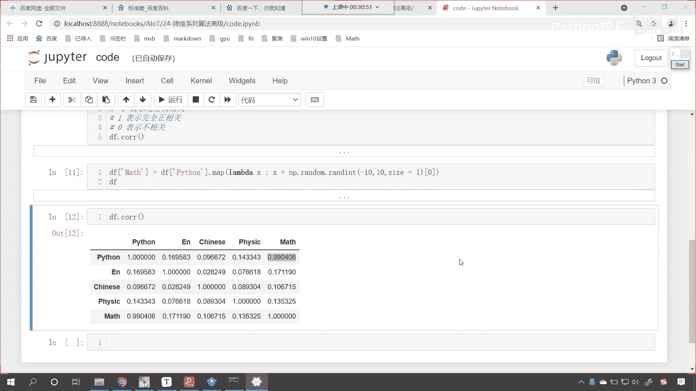

来接下来呢我们继续往下看好，那么因此呢咱们需要找到一个合理的方法，在减少需要分析的指标的同时，你看我们希望呢这个分析的指标越少越好，因为你的数据少是吧，那这个时候呢我们得到的模型。

咱们得到的结果就会更加的精确，你的数据是海量的是吧，你就像我们大海捞针一样，那就找不到咱们想要的这个结果，咱们尽量减少原指标包含的损失，也就是说把不重要的特征删掉，重要的特征呢一定都要留下来。

以达到对呃对所收集数据全面分析的目目的，由于各个变量之间存在一定的相关性，因此呢可以考虑将关系紧密的变量，变成尽可能少的新变量，使这些新变量的两两不相关，那么我们就可以用较少的综合指标。

分别代表存在于各个变量当中的各类信息，那你想咱们这个地方说的稍微有点抽象啊，我们在这个地方说的稍微有点抽象。

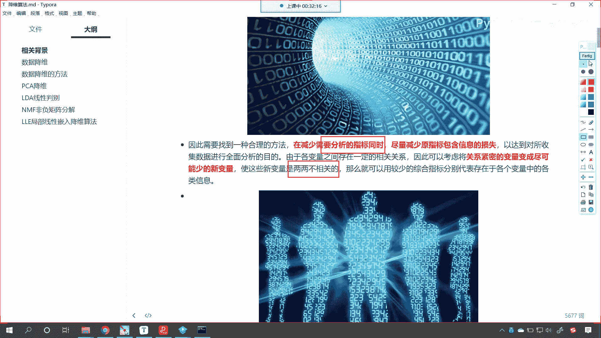

那你比如说啊咱们想要描述一个人是吧，那我们怎么去描述呢，你看身高体重是吧，他拿哪个大学毕业的，学的什么样的专业，是不是啊，以及他读了什么样的书，他跑1千米速度怎么样，是不是。

那你想这个人的信息就可多了是吧，他每天说了什么样的话是吧，那这个人他昨天晚上吃了什么样的晚餐，你想这个数据量是不是特别多呀，那我们如果要对这个人进行分析，你想我们可能把他的每一顿饭都拿出来分析吗。

不可能我们会怎么样呢，我们会进行一个这个总体的数据抽取，比如说这1年当中他吃馒头吃了多少，吃蔬菜吃了多少，吃肉吃了多少，吃鸡蛋吃了多少，我们是不是会用这样的一个量，去对它进行度量呀，那以后呢。

保险公司就会根据这个来对你进行分析，然后评估你买保险的时候要花多少保费是吧，人和人是不一样的是吧，所以说每个人相同的保险产品，都会有不同的价格，就像我们买了一个手机号，我们注册了一个支付宝。

你的支付宝借呗能借多少钱呢是吧，你借呗能借多少钱，每个人和每个人，是不是额度上会有一定的差异啊，在校大学生他们的戒备是吧，基本就没有是吧，很少因为为为什么呀，就防止他们这个乱花钱，但是北京大学。

清华大学这些学生呢是吧，研究生或者说博士，他们的这个借呗金额就特别的高，因为你想算法就进行了这些数据的归纳，他说一个人是吧，从小学初中高中大学，然后一直读，一直读到博士毕业。

你想他的家里的这个家底儿肯定很雄厚，博士毕业之后工作也不愁，那我阿里巴巴就愿意为你多提供点金额，让你消费，让你去淘宝上购买东西，这样的话我淘宝是不是才能够挣更多的钱呀，对吧。

那如果说你要是呃这个没上过大学是吧，那这个时候这个金额是吧，可能就会少很多了，因为我会担心呀，万一你用了我的钱是吧，你花了，但是你还不起，你还不起，我能拿你怎么办，是吧，这就是坏账是吧。

那坏账最后就拉倒了，就不用还了是吧，也也不能把你抓到，也不能把你抓进去，是不是咱们数据的形式是多种多样的，维度呢也是各不相同的，实际问题当中，如果我们要遇到高维度的话，咱们如何给它降维呢。

如何进行属性选择呢，那这里边呢咱们就有多种方法可以进行选择，那么这里边呢我们就提供一种，从高维特征空间向低维特征空间映射的思路，那这个说上去也有点抽象，不像咱们刚才举的这个例子。

你看我们就五列数据清清楚楚，明明白白，咱们就能够知道是吧，前四列随机生成的对吧啊，所以说他们的关系是吧，python和英语和语文和物理关系都不大，我们最后一列呢他们俩是紧密相关的。

因为数学就是根据python生成的，所以说你看求解出来就是0。99，是不是求解出来，那它就是0。99好。

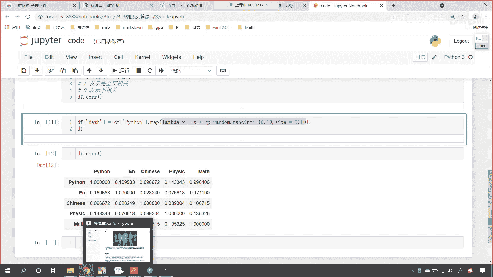

那么那这个时候呢你看啊。

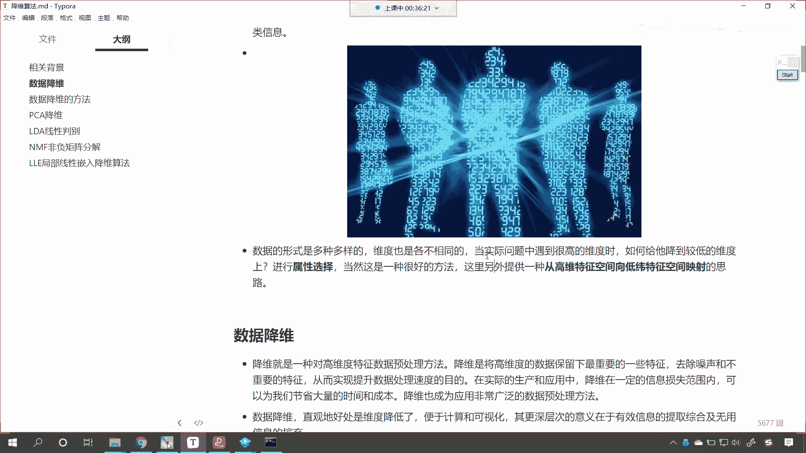

咱们再回到代码当中啊，那我如何才能够计算出一个负的呢是吧，你比如说咱们再来一个啊，咱们df来一个chem chemistry是吧，就等于df中括号，你看这个时候我们来一个python。

咱们也来一个map，你看我该怎么写啊，lambda l m b d a x冒号，咱们来一个x，我们让它乘以多少，乘以-1，看到了吧，乘以-1，然后加上np。random，咱们来一个rint。

我们也让它从-十到十size，咱们给一个一好不好，然后呢，中国二零，这个时候你看咱们的df数据，哎，现在你就能够发现你看cam是不是也是-73，-119是不是好，那么我们算一下啊，这个时候你看我d f。

c o r r执行诶，各位小伙伴各位小伙伴，你有没有发现咱们ca和python看到了，你看这个cam和python，大家看啊，看啊相交的这个交点就是咱们化学和python，他们俩之间的关系。

那么他们俩之间的关系你看是多少呢，现在你能够发现我们算出来的，是算出来的是多少，是负的，0。9941，那负的表示什么意思啊，负的是不是表示负相关呀，为啥会有负相关，看到了吧，因为有-1，咱们说了。

我们cr这个相关性系数它是从哪儿到哪儿，从-一到正一，咱们刚才在介绍的时候是吧，说的很清楚啊，零表示不相关，-1表示完全负相关。

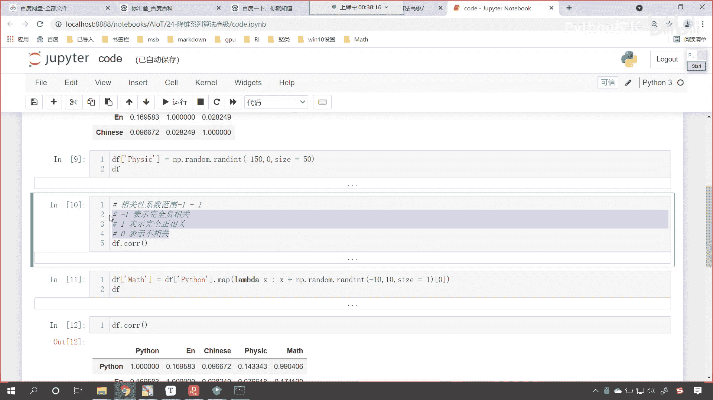

正一表示完全正相关，好再回到咱们的课件当中是吧，你想你站在太阳，你站在太阳底下，你是不是会有一个阴影呀对吧，李白那首诗叫什么，举杯邀明月，对影成三人，是不是你想你的影子看到了吗，你的影子是什么呀。

你看你的影子是不是就是你的三维立体，照了一下光，光线照了一下，是不是就变成了一个二维的影子呀，看到了吧，这个是二维的影子，对不对，看到了吗，我们人是什么，咱们人是不是三维立体呀，对不对。

你看我们人是三维立体，你有没有发现你三维立体，你在做动作的时候，你的影子是不是也是这个动作的一个缩写呀，对不对，你看你的三维立体在做动作的时候，你想你的影子是不是也会变呀，对不对，你看我是做计算机的啊。

那我听过的算命，大家有没有算过命呀，你看我听过的算命最科学合理的解释，你知道是怎么说的吗，嗯人家说完之后，我都快相信了，人家说算命是什么，人家说这个算命的是有人呐，长了第三双眼睛，它呢可以看到四维空间。

看到了四维空间，看到了四维空间呢，那四维空间是什么，你看他的这个影子，看他的影子就是三维空间的，你知道吗，就是三维空间的，你嗯看到这个是吧，你赶紧去算算命是吧，也许没准，真准呢是吧，看到四维空间。

它的影子就是三维空间，因为啥，因为三维空间是吧，你的影子是不是就是二维啊，你三维空间做什么动作，这个影子是不是就发生什么样的变化呀，同理如果我们能知道四维空间是什么样，那三维空间的你这不就算命了吗。

是不是啊。

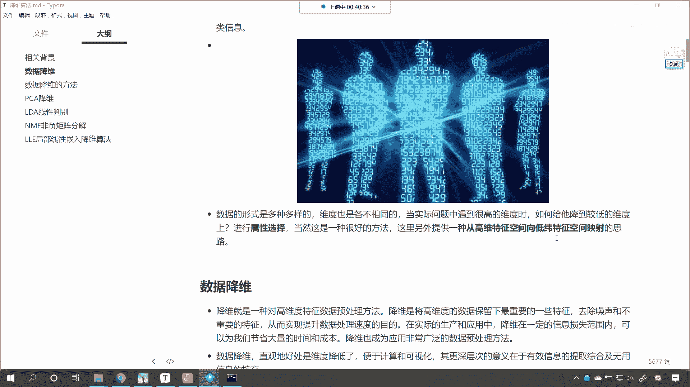

当然这个都是笑谈啊，大家不必当真啊，来我们接下来继续往下看，数据降维，降维呢就是一种对高维特征数据预处理的方法，降维呢是将高维数据保留下来，最重要的一些特征，大家要看啊，我们不会把数据的重要性是吧。

信息给它损失，咱们去除噪声和不重要的特征，从而实现提升数据处理速度的目的，看到了不仅仅是处理速度，有的时候我们的准确率是吧，这个模型还会大幅度的提升，在实际的生产和应用当中。

降维在一定的信息损失损失范围内，可以为我们节省大量的时间和成本，你就像现在的美国，你看他当年把它的生产，制造业全部搬出了美国是吧，你到了美国之后，你就会发现它青天白云蓝，这个青山白云是吧，这个蓝天绿水。

那为啥呀，因为他把工厂都搬到哎，都搬到发达中，都搬到发达国家了是吧，所以说他那没有生产都是什么，搞金融的是吧，搞高科技的，比如说搞硅谷，现在咱们中国呢也要走这条路线，我们也要研制自己的芯片。

这个时候你看他不干了，是不是他说你只能生产鞋帽之类的，那这个这不就是强盗逻辑吗，是不是，所以说呢这个重要的东西是吧，哎重要的这个你像人工智能是吧。

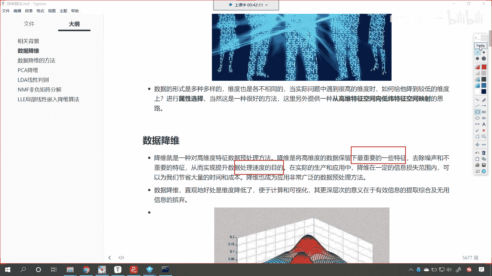

咱们现在也比较领先好，那么降维呢成为广泛，成为应用非常广泛的一种数据预处理的方法，我们把数据预处理一般叫做什么，叫做数据清洗，你看洗完衣服之后，这个衣服穿上是不是特别舒服呀，你写完数据之后。

把这个数据喂给机器学习，机器学习就能够就能够给你产生美味佳肴，来产生一个非常好的结果。

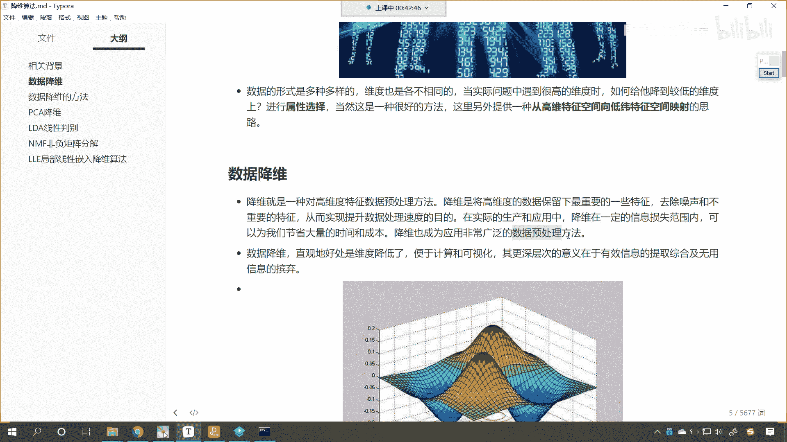

所以咱们最终比的是什么呢，比的是数据预处理，看谁做得好，这个就是基本功，因为算法算法的改进特别难，到现在为止是吧，到现在为止，2016年算是有一次特别大的突破，就是神经网络是吧，之前的50多年。

60多年都没有特别大的一个发展，都是缓慢缓慢的在发展，你像图灵那个时候就开始研究机器学习了是吧，一直一直这么多年，是不是都没有特别大的一个飞跃呀，因为太难了对吧，因为因为数学知识就那些，是不是啊。

你不可能有一个特别大的一个飞跃，但是我们处理数据呢，唉我们可以精益求精，唉一直把这个数据的精髓给它提炼出来，数据降维直观的好处就是降低维度，便于计算和可视化，那么它更深更深层次的意义在于。

有效的信息提取。

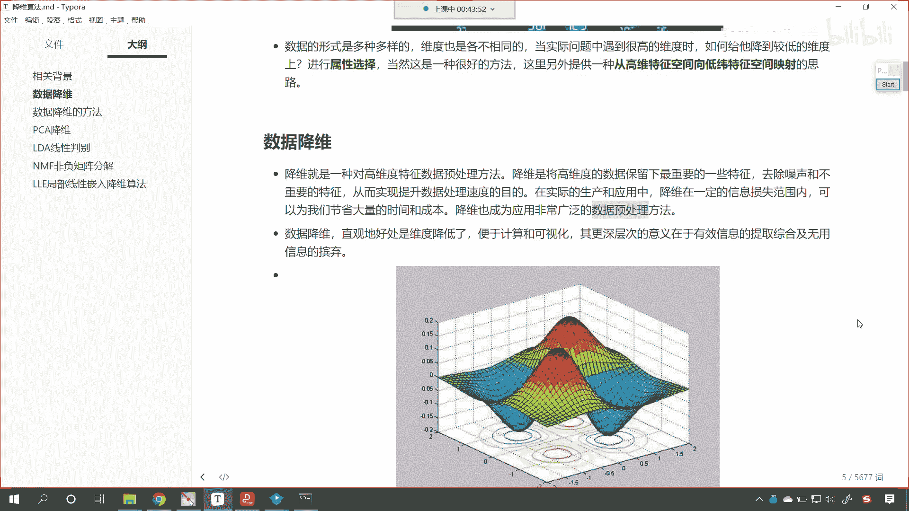

这个摒弃一些无用的这个信息，你现在就能够看到，你看咱们现在看到的是不是就是一个三维的呀，你看我这个三维的，我怎么把它降降成二维了，你能够发现你看到了吗，下面是不是就有一个影子呀，看到了吧。

我们如果要是有一束光，咱们要照下来，你看下面是不是有影子呀，对吧，这些圈圈是吧，这些圈圈就是我们照的这个影子，这和咱们中国古代是吧，兵法上说的一样，叫射人先射马，擒人先擒王。

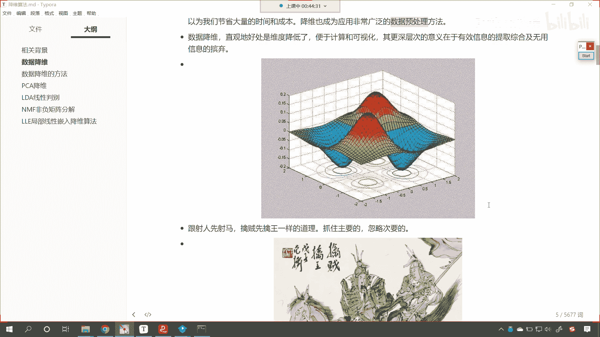

是不是抓主要的，忽略次要的，你只要把这个贼王抓住了，怎么样，这个是不是就赢了，你就像塔利班，阿富汗的塔利班，现在是不是把这个美国扶持的政府军，是不是给给他一窝端了呀。

为啥美国扶美国扶持的这个阿富汗的政府军，他现在逃跑了，飞到坐飞机，飞到其他的国家了，是不是群龙无首，群龙无首，那这个时候你看塔利班只有7万人，阿富汗政府军有多少万人，30万人轻轻松松是吧。

嗯就这个7万人，这个部队呢就开进了阿富汗的首都，是不是，所以说你看秦人这个射人先射马，擒人先擒王。

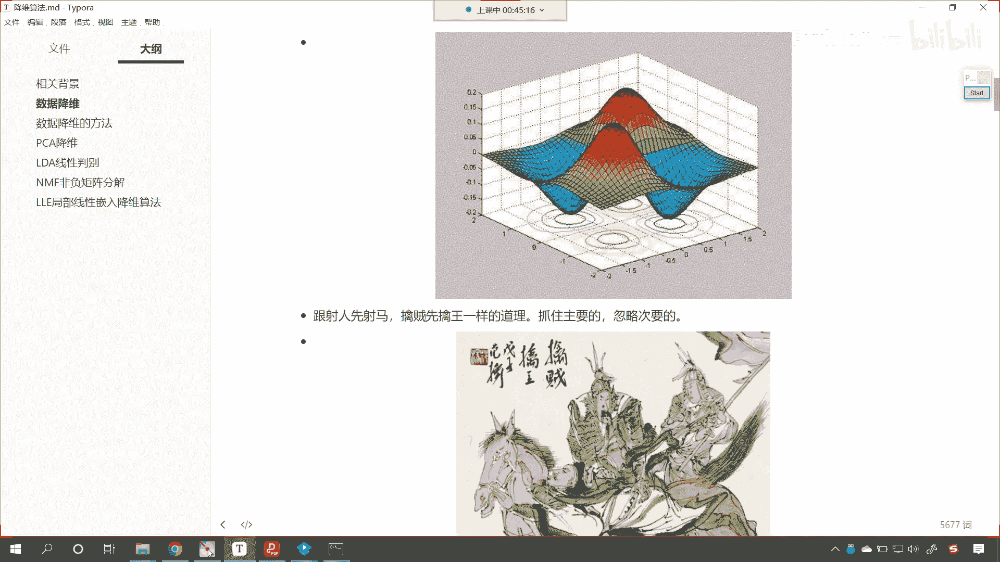

所以这就是一样的道理啊，你看咱们人的消化系统也一样，你看回到我们人最高等的这个生物是吧，你看我们的数据降维过程，咱们都是无论你吃的鸡蛋还是吃的牛肉是吧，还是吃的馒头，最终是不是都变成了葡萄糖，氨基酸。

维生素等等这些最基本的嗯元素呀，那对于我们而言是吧，这些是元素，但是如果说我们要对于计算机而言，这些就是数据，对不对，好那么呃咱们降维呢有如下一些优点，减少所需要的存储空间，加快计算。

加快计算机的计算速度，数据少了，那当然就这个快，你看刘翔和苏炳添，他们跑步穿的鞋比咱们穿的鞋要轻，你知道为什么吗是吧，因为你重量小，那你的这个嗯，所需要的这个能量是不是就小一些呀。

好咱们电脑内存2133和2666是吧，是不是，这个当然不属于降维了啊，嗯降维呢，你看咱们降维是什么，就是从一堆数据当中是吧，从一堆数据当中把不重要的给它忽略掉，给它删除掉，这个叫降维好。

那么加快咱们计算机的这个计算速度，并且更少的维度可以允许使用，不适合大量维度的这个算法，有一些算法呢它不适合大量的这个维度，比如说咱们支持向量机这个算法，它呢就不适合维度特别大的数据。

如果说你的维度特别大，那么支持向量机它所要构建的这个超平面是吧，那这个时候呢这个就特别复杂，他再去进行计算的时候是吧，那老费时间了，那么我们去除冗余的特征，例如咱们以平方米和平方公里。

在存储地形尺寸方面，两者一起用没有意义，为什么，因为你平方米和平方公里，它们俩之间是不是完全的正相关呀，只不过是单位不一样，是不是，这个时候呢我们得需要人为的看一看，就是平凡是含有平方米或平方公里的。

那我们去除其中一个是不是就可以了，咱们将数据的维度降低到二维和三维，咱们就可以对它进行可视化了是吧，这样的话我们就更加的直观，了解咱们数据的一个分布情况，太多的特征和太复杂的模型可能会导致过拟合。

你还记得什么叫过拟合吗，过拟合我们通俗的比喻就叫窝里横是吧，你看你在家里边很很牛是吧，一到外面是吧，打架就怂了是吧，直接给人跪那儿了，这就叫窝窝里横是吧，啥过你啥叫过拟合呢。

你对于训练的数据效果特别好是吧，每回都是100分，但是呢一给你新数据让你预测是吧，这个时候你就怂包了是吧，每回都每回都不能及格是吧，这就是过拟合，我们训练算法，训练模型最不希望的就是出现过拟合这种情况。

咱们较简单的模型，在小数据集上有更强的这个鲁棒性，啥是鲁棒性呢，哎用一个词，用一个字来说，叫做操是吧，你看这个人很糙啊，这就是说什么样的环境是吧，他都能嗯都能这个搞得定是吧。

你让我睡这个5000块钱的宾馆是吧，我睡的很香，你让我睡50块钱的宾馆是吧，我也能睡得很香是吧，这就是一个人的鲁棒性是吧，酸甜苦辣都能吃是吧，那算法的鲁棒性呢，你给我各种各样的数据。

我都能够给你一个比较好的结果，这就是算法的鲁棒性好。

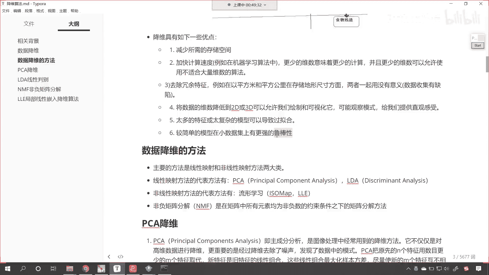

那么呃咱们现在呢给各位介绍的。

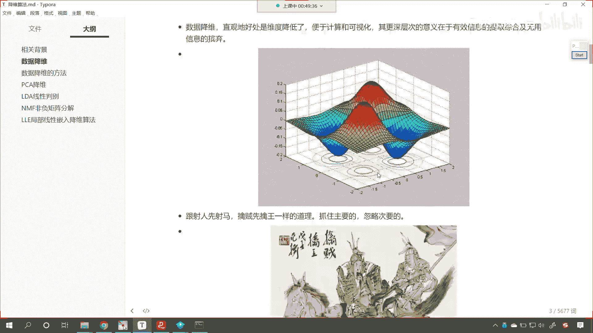