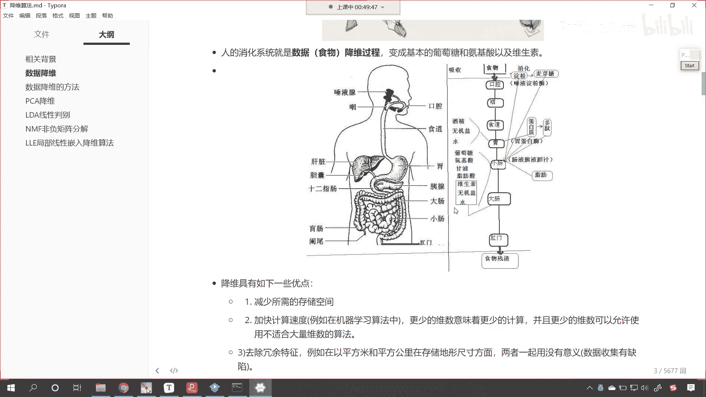
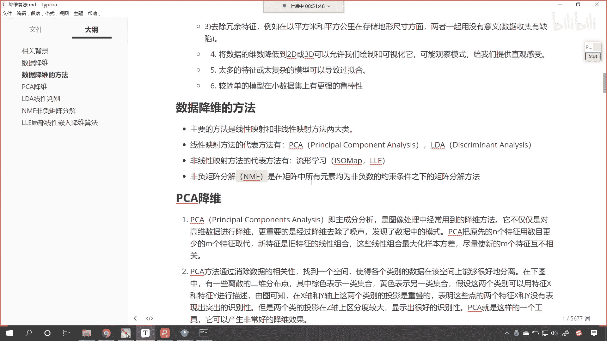

# P158：3-数据降维方法介绍 - 程序大本营 - BV1KL411z7WA

来接下来呢我们继续看，那我们看一下数据降维的方法有哪些。

那咱们的数据降维方法，主要分为线性和非线性两大类，方法线性我们知道是吧，之前咱们学过线性回归直来直去的一条线，什么是非线性呀，就是我们学的抛物线是吧，是不是拐弯了呀，如果要用方程来表示非线性。

我们是不是可以理解为一元二次方程对吧，你看它拐弯了，对不对，好，那么我们的线性呢有p c a lda这个pca，咱们之前用过这个pca 3个字母都是大写，它叫什么。

principal component analysis，翻译成中文叫主成分分析，这个lda呢它叫线性判别，叫discriminant analysis，我们的非线性方法呢有流行学习lol。

这啥是流行呢，后面我们在具体讲到这个算法的时候，咱们再做详细的解释，那么还有一种呢叫做非负矩阵分解唉，这个就涉及到一些矩阵的这个特征和应用，是在矩阵中所有元素均为非负的约束条件下，咱们进行的矩阵分解。

那你有没有学过因式这个因数分解呀，六等于多少，看六它等于多少是吧，六等于多少，是不是2x3呀，对不对，你看6=2x3，这是不是一种因式分解呀，那我们的nmf，咱们的数据也可以采用2x3是吧。

拼成六这种形式来进行操作，我们也可以通过这种方式来提取它的特征好。

