# P159：4-PCA算法介绍和使用 - 程序大本营 - BV1KL411z7WA

咱们就具体看一下pca降维它到底是怎么回事，这个叫主成分分析是吧，这就是射人先射马。

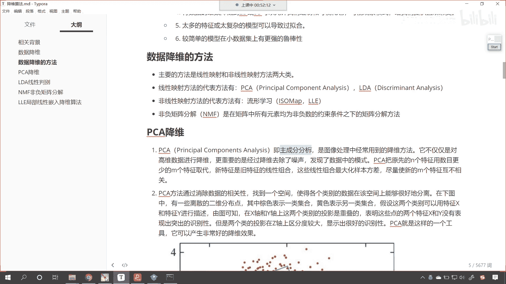

擒贼先擒王，是图像处理当中经常用到的降维方法，不知道你是否还记得，咱们之前在讲支持向量机的时候，我们讲了一个案例，就是人脸识别的案例，那个里边有布什总统是吧，有小布什。

我们是不是对那个数据进行了数据降维呀，对不对，不降维你会发现它所花费的时间特别长，它不仅仅是对高维数据进行降维，更重要的是经过降维，我们去除了噪声，发现了数据当中的模式，你看什么是模式呢。

嗯这个在念研究生的时候，有一个专业叫做模式识别，你看模式识别是机器学习当中的一个方向，你看这里所说到的模式是吧，哎就相当于它的公式，它的规律是怎么样的是吧，人家你看更高端的叫法就叫做模式识别。

所以说你见到这个，你就知道它是什么意思就行了啊，发现数据当中的模式，是不是就是发现数据当中的规律呀，你看我们在读历史的时候，咱们经常听到历史学家这样说，叫做读史是不是明智呀对吧。

你读历史你是不是可以得到很多智慧呀，因为历史都是相似的，是不是我们现在发生的事情在历史上是吧，一定也发生过类似的，当你遇到问题的时候，你不知道怎么解决了，怎么怎么办，那就读历史，他读了23遍是吧。

熟读中国历史，开国元帅是吧，这个都跟历史有很大的关系啊，伟大的思想家是吧，那都得读书呀，pca呢把原先的n个特征，用数目更少的mm个特征来取代新特征，是旧特征的线性组合。

那这些线性组合它是最大化样本方差，尽量使新的m个特征互不相关，一说到这儿是吧，咱们就有点晕，来回到代码当中。

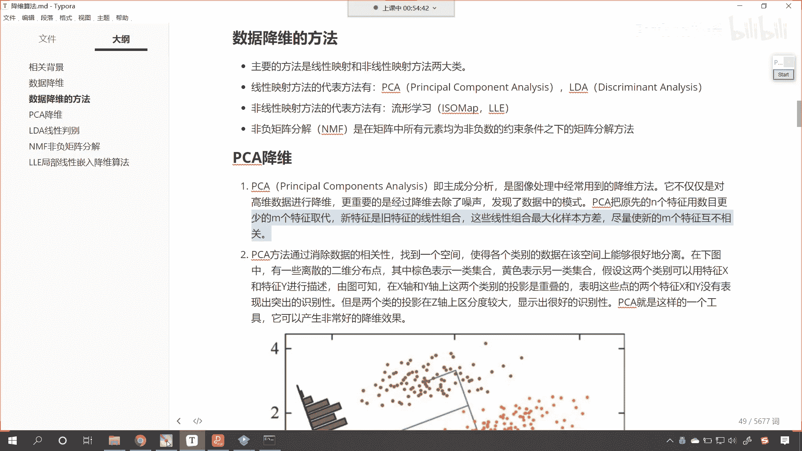

我们操作一下好不好好，那么在这儿呢咱们来一个三级标题，这个呢就是咱们p c a，啊这叫做pca降维，那么我们就导一下包，咱们就from sk learn，点叫decomposition。

从这个当中咱们导入一个pca，然后呢from sk learn，咱们import一个data sets，执行一下这个代码，我们呢贝sets点我们随便加载一个数据，这个数据就叫圆微花。

咱们只让它返回这个return x y，我们给个一一就表示true啊，那我们接收一下叫xy，现在呢我给你展示一下咱们的数据，x的前五个数据长什么样呢，你看我一执行这个是它前五个数据。

这个就是它花落的长度宽度，花瓣的长度宽度，那么这个数据是有物理意义的啊，在这儿进行一个说明，这个呢是有物理意义的特征，那么我们如果要经过pca降维之后会怎么样呢。

p ca就等于pca小括号里边有一个n components，shift tab，点开这个加号，我告诉你它该怎么用，往下滑，你看n components可以表示什么呀，int也就是说你给我个数是吧。

那比如说这个时候我们给个二二呢，告诉他保留两个最重要的特征，那咱们就p ca feet transform，我们将x放进去，转换一下x下划线，pca输出一下x下划线，pca中括号冒号来个五。

也查看它的前五个数据，你有没有发现咱们这个数据是多少，看到了吧，负的2。60。3，你现在知道这个二它表示什么了吧，二是不是就表示为我保留两个数据呀，对不对，你看到了吧，这个二呢就表示保留，你看一个特征。

两个特征，这个就是二，那我们n components这个参数它还可以是什么，往下滑，看到了吗，还可以是float，float，是不是就是小数呀，如果我要给一个0。9呢，你看一直行，看到了吧，咱们给个0。

9，这个时候怎么就变成一列了，0。9就表示90%重要的特征，所以说它就是一例，也就是说你这个数据当中有一列是吧，它的重要性是90%，那你看我给一个95%呢，执行一下这个时候怎么样，是不是就成两列了。

我如果要给一点呢，一点表示什么，是不是所有的信息都要保留下来呀。

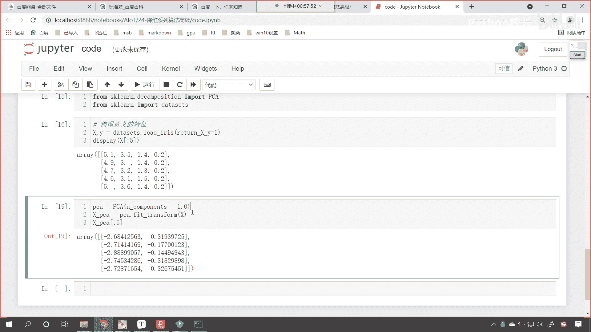

执行，你看这个时候是吧，呃呃人家说了是吧，这个n components是吧，不能是一点是吧，你必须得是int是吧。

或者说float，那咱们给个0。99啊，你看啊，0。999哎，四个九，这个时候你会发现我们是几列数据，这个时候咱们就会发现，咱们得到的就是四列数据，所有的它都保留了。

所以说呢一般情况下我们在进行计算的时候，我们把重要性90%的数据给它保留，这个是不是就足够了呀，看到了吧，看这个就足够了啊，你知道吗，这个就足够了，这个0。95就表示0。95呢，就表示咱们呢进行降维。

看咱们保留95%，重要性的这个特征，也就是这两例，它的重要性加起来就超过了95%，所以说呢这个就是咱们的这个降维，你看数据变少了，变少之后，你会发现我们得到的这个数据，你看原来都是正的，有物理意义。

现在你会发现是不是就有正有负呀，原来这个eris eris它呢是一种花，那么我们经过这个降维之后，咱们就发现降维之后，咱们的这些特征还有物理意义吗，特征还有物理意义吗，是不是就没有物理意义了呀，对吧。

那我们xp ca完全可以替代上面的这个x，看到了吧，x p ca降维之后，它就可以表示上面的x我们进行模型建模，得到的结果不会有特别大的差异。

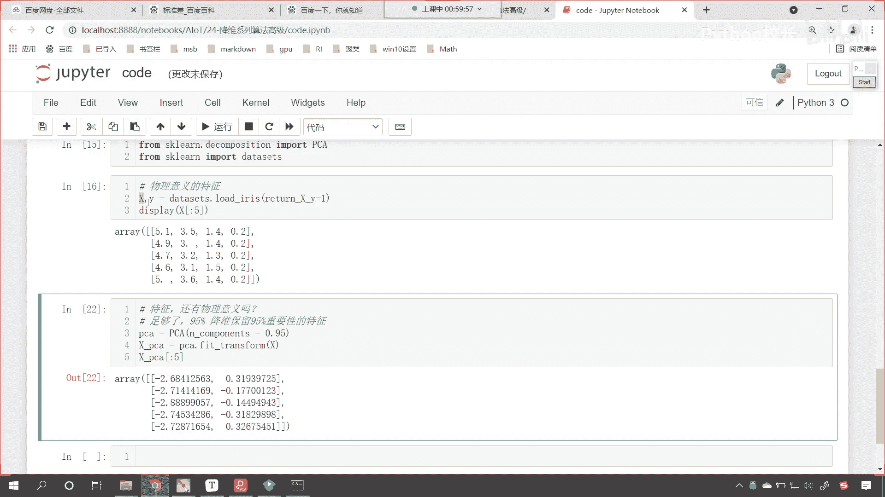

来再回来，你看这个就是数据由多变少，这个叫什么，这叫降维，我不知道你是否还记得，咱们之前讲线性回归的时候，我们讲过升维是不是数据少怎么办，咱们给他增加数据多怎么办。

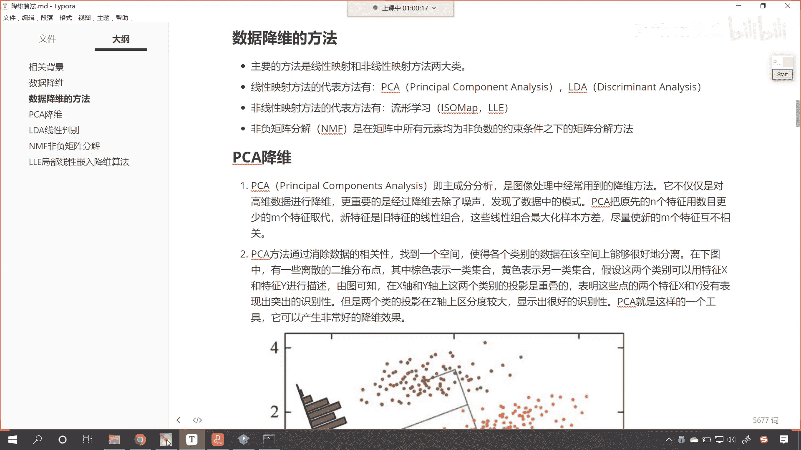

咱们给它降维好，那么这个pc方法呢，通过消除数据的相关性，找到一个空间，使各个类别的数据在该空间上能够很好地分布，你看下面这个图，我们就能够发现咱们这个点儿呢它是分两部分，这一部分是黄色的底儿。

上一部分点是什么，是棕色的，看到了吗，上一部分是棕，上一类是棕色的，那么我们现在呢是以点的形式在这儿放着，那如果他要是点儿，你想一下咱们是不是既有横坐标，也有纵坐标呀，那既然有横坐标，又有纵坐标。

那这就说明它是不是由两个特征呀，看到了吧，它有两个特征，那咱们的pca降维呢，咱们就是找到一个轴，找到一个方向，用一束光给他照过来，看到了吧，夸照过来，夸一束光照过来，照过来之后会怎么样呀。

他是不是就会形成一个阴影呀，形成一个阴影，你现在就能够看到这个是不是就是一个z轴，这个z轴我们就发现，你看各自是不是有各自的高度呀，那这个高度是不是就一个数呀，大家看啊，咱们这个高度它呢就是一个数。

咱们在z轴上的高度它呢是一个数，那这一个数呢哎就是一个特征，那这个时候你会发现经过咱们pca的转换，我们是不是就有两个特征，看到了吧，你原来是几个特征，两个特征现在是不是就变成一个特征了呀，这叫降维。

这叫由多变少，还记得咱们刚才说你站在阳光下，是不是会有一个影子呀，对吧，你看像不像，看到了吧，这个光线从这儿照过来，是不是咱们的这个数据就变少了呀，pca呢它就是类似这样的一个工具。

它可以产生非常好的降维效果好。

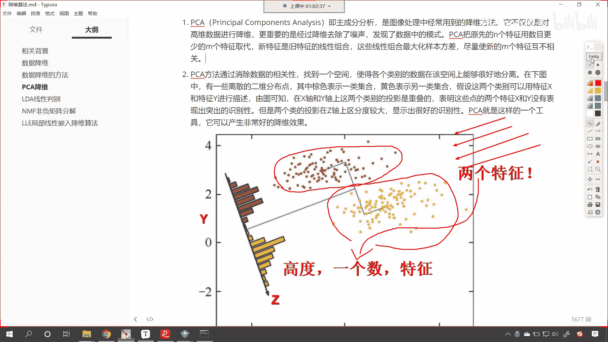

那么咱们继续往下看啊，咱们的pca呢就是咱们的主成分分析，是一种使用广泛的数据降维算法，大家注意啊，它应用非常广泛，pc的主要思想是将n为特征映射到k为上，这k为是全新的正交特征。

看大家注意它是正交特征，也就是说经过矩阵运算得到的数据，那么它呢就是主成分，你在大学的时候有没有念过，有没有上过啊，这个线性代数这一门课呀，上过的小伙伴在讨论区里边扣个一啊，线性代数好。

那么这个pca呢是在原有n维特征的基础上，重新构造出来的，k为特征，pc的工作呢就是从看pca的特征，就是从原值的，原始的空间当中，顺顺序的找到一组相互正交的这个坐标轴。

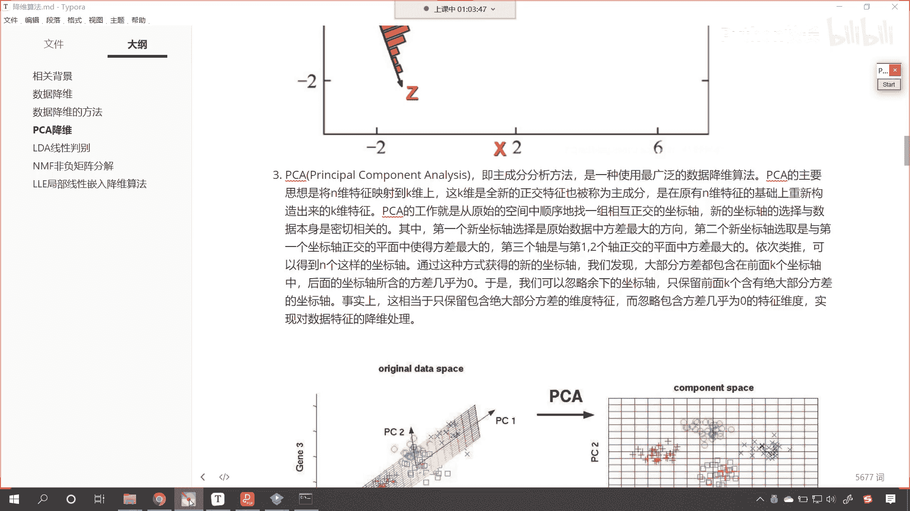

然后呢它有一个这个照射，最终的话嗯我们就有了这个映射。

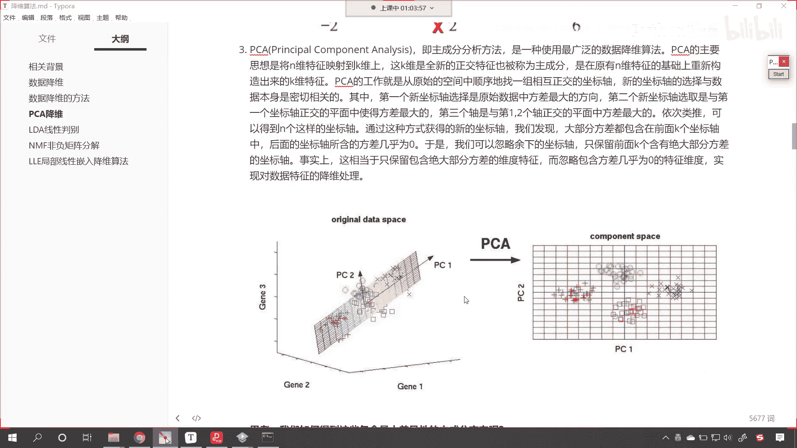

大家看咱们这个图片啊，看咱们这个图片左边这个图，咱们是不是三维的呀，你看这是三维立体的，经过咱们pc的降维得到的数据，你看是不是就是一个二维平面上的数据啊，数据是不是由多变少，由多变少。

数据咱们在进行分类的时候就更加清晰，所以你看我现在就在思考一个问题，我说我当时在念大学的时候，我学高等，我学高等数学，先学这个线性代数，都是为了分数是吧，都是为了拿奖学金，现在一想是吧。

自己的这个格局还真是太小，你想设计大学这些课程的人，是不是都是特别厉害的教授院士呀对吧，人为什么要设计这些啊，一定是人家工作当中用到了，我们之所以能够将神舟系列的火箭送上太空，为什么呀。

线性代数高等数学呀，没有这些是吧，杨利伟就上不了天是吧，没有这些，咱们中国的三名航天员，现在就不可能在国际空间，国际空间站上去执行任务，所以等我从事机器学习这份工作之后，我重新对于线性代数。

高等数学又产生了浓厚的兴趣，现在我终于明白了是吧，为什么当时学大学的时候，让我们学习这么枯燥乏味的这个知识，就在这里明白了吗，你看我们现在所学到的聚类算法，线性回归，线性分类都源自于数学。

都源自于咱们的线性代数，高等数学，你看一个也跑不了，这些就是你的底蕴，只要你念过大学，这些就是你的底蕴，那么你在学习这些知识来。

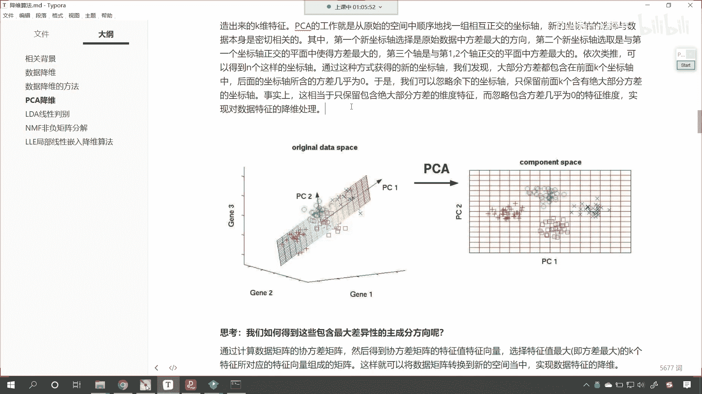

那就轻松很多了，好咱们现在呢思考一个问题啊，我们如何得到这些包含最大差异性的主成分呢，看咱们如何得到这些包含最大差异性的这个，主成分呢，那咱们就通过计算矩阵的协方差矩阵，然后得到斜方差矩阵的特征值。

特征向量，咱们将特征值最大及方差最大的k个特征嗯，所对应的特征向量组成的矩阵，这样咱们就可以将数据矩阵，转换到新的空间当中，实现数据的降维，你看绿色的就是回答上面的这个答案，那有可能你看到这句话是吧。

依然是懵逼状态，没关系，后面的代码咱们会具体展示。

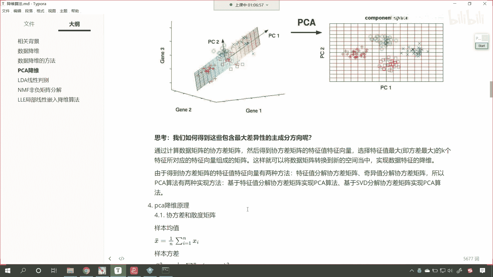

刚才我在代码当中看到了吧，声明pca pca。feat transform，咱们展示它的前五个数据，我们是不是就得到了，从原数据到降维数据的一个转变呀，你看从上面5。14。9到负的2。68，负的2。

71，这个地方你学会了吗，因为是不是就两三行代码呀，是不是非常简单，但是这个pca它到底是怎么回事啊，原理是什么呢，对不对，这节课我告诉你答案，咱们呢自己写代码，我们来实现pca到底是如何完成的是吧。

那让你看一下之前咱们所学的线性代数。

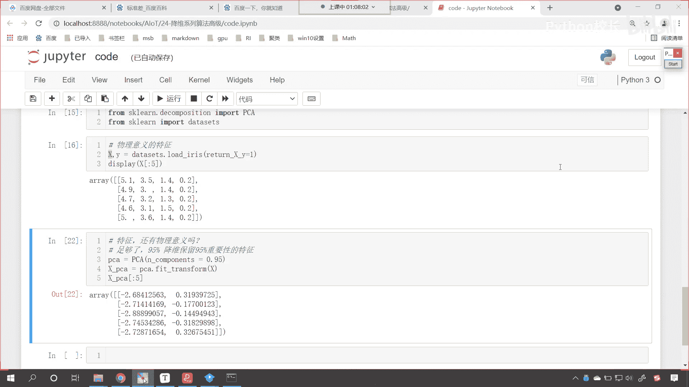