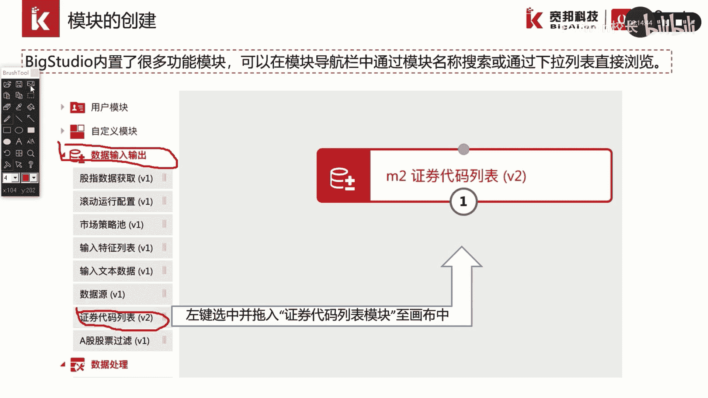
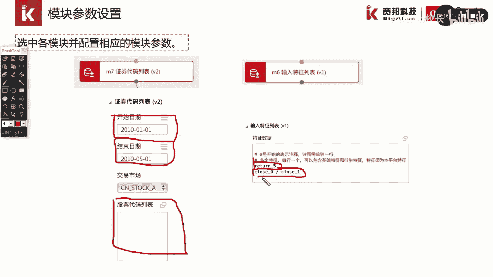
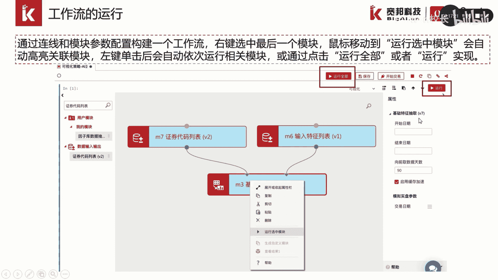
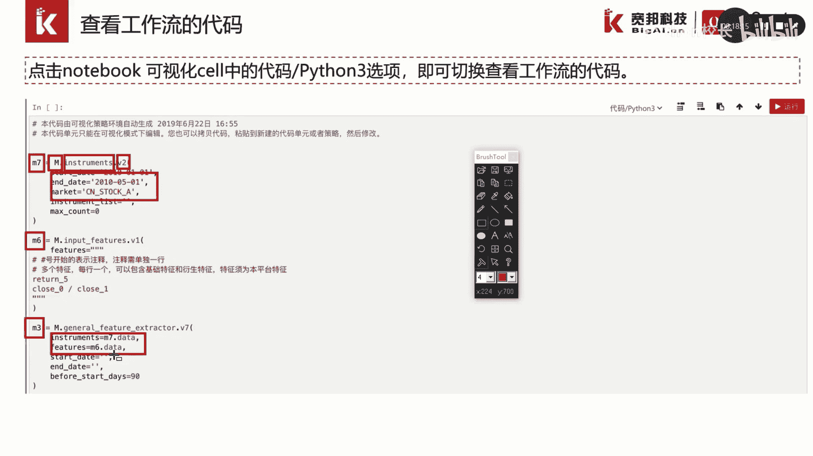

# P16：2.4-模块化工作流创建 - 程序大本营 - BV1KL411z7WA

这一部分我们讲解一下，如何利用模块创建工作流。

big studio内内置了很多的功能模块，可以在模块导航栏中，通过输入模块名称进行搜索，或通过下拉列表进行浏览，例如我们下通过数据输入输出，这样一个下拉列表中找到证券代码列表。

我们左键选中正确代码列表并拖入到画布中，就实现了模块的创建。

我们用同样的方法拖动更多的模块进入画布，并按合理的流程顺序放置模块，我们将鼠标移动到模块的输入，此时屏幕会显示该输入节点，需要连接的上游模块，例如我们将鼠标移动到m3 基础特征，抽取模块的右侧输入节点。

此时显示了此节点需要输入的上游模块，为特征列表模块，我们通过选取节点并拖动连接到另一个节点，就可以实现模块的连接，模块连接后，我们可以通过各模块的属性菜单，进行相应的模块参数配置。

例如在证券代码列表模块中，我们需要设置股票时的起止时间和结束时间，以及我们选取的股票是范围，如果不填写任何内容，这里表示选取全部的a股市场股票，例如在输入特征列表中。

我们可以输入我们需要抽取的特征因子表达式，例如五日的收益率或一日收益率。

拖入模块并连接后，我们就构建了一个工作流，我们通过点击最后一个模块，选择运行，选中模块或将鼠标移动到运行，选中运行全部模块或运行按钮，可以实现工作流的执行。

在工作流的运行过程中，notebook文档的左上方会出现一个旋转的圆圈，并提示正在运行或处理，同时下方会显示模块的运行日志，我们可以通过点击notebook可视化cell中的代码。

python 3选项切换到代码模式来查看工作流的代码，例如该画布中有三个模块，分别为m7 ，m6 和m3 ，我们通过点击代码python 3按键切换，进入到代码模式，可以看到。

在代码中对应的模块代码分别为m7 ，m6 和m3 ，m代表了模块的意思，后面的英文名称代表了该模块的英文代码代号，v2 表示了该模块的版本。

而start date and date以及market等参数，表示了该模块的属性参数，对于m3 模块而言，这里的instruments作为该模块的输入，连接了m7 模块的输出数据，m7 点data。

而m3 的另一个输入features，该节点连接了m6 模块的输出数据。

