# P160：5-PCA降维算法特征值分解代码实现 - 程序大本营 - BV1KL411z7WA

来接下来咱们就看原理了，咱们就看原理，在这个地方，咱们来一个三级标题，看在这个地方我们重新刷新一下啊，刷新一下，这个时候就有目录了是吧，相关性，这个是pca降维，接下来咱们这个三呢，我们在下面插入一行。

那这个三呢就是咱们p c a它的原理，你只要知道它怎么进行计算了，你是不是就知道它是具体是怎么回事了。

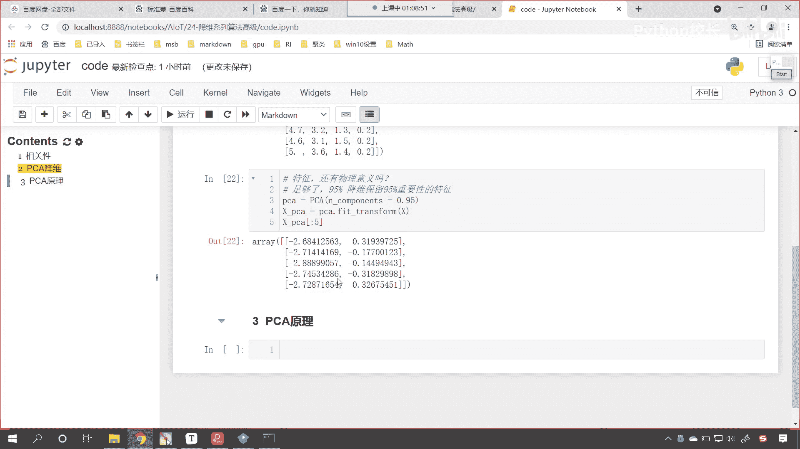

来回到咱们这儿啊，那我们pca降维的原理呢，这个里边会有一些概念，叫做样本的均值，样本的方差，样本的协方差好，那么这些呢我们先过，咱们先过一下代码的引，比如说咱们pc算法呢，我们有两种实现方式。

那么这两种实现方式呢，咱们可以使用这个，咱们可以使用这个特征值特征向量，我们来进行操作啊，那这个特征值特征向量，是不是是咱们特征值分解当中，我们就可以求解出来特征值和特征向量呀，那这个特征值和特征向量。

是不是咱们线性代数当中，非常核心的一块知识点呀，现在有可能你是不是都给忘记了呀，这个特征值特征向量你还记得吗，有没有印象呀，有印象的小伙伴，咱们呢在我们的讨论区回复一个1024啊，你只要有印象就行。

有印象是吧，但是你已经忘了这个特征值特征向量是什么了，对不对，来没关系啊，咱们先操作好不好好，那么我们就可以通过这一步两步三步四步，五步六步，咱们呢就把嗯p ca降维它的过程，我们呢就给它计算出来来。

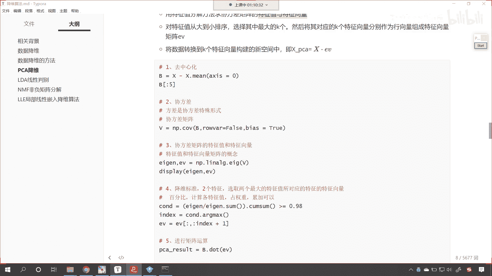

咱们就回到代码当中，那我们呢先来第一步，咱们的第一步呢就叫做去中心化，啥是去中心化呢，其实呢就是x减去x点密mean，是不是就是它的平均值呀，对不对，咱们指定一个轴啊，因为这个数据是二维的，那么简单不。

第一步呢就是去中心化，你看一下这个b长什么样，你看一执行之后，这个就是每一列都减去它的平均值，在这儿我们进行一个说明，这叫做每一列，减去平均值，看这是去中心化，因为你只有减去了平均。

只有减去了平均值是吧，那我们得到的这个数据，它呢才会像一个这个才会像一个这个呃，正态分布的数据，因为减去平均值之后，我们得到的这个数据是不是就有正有负了，因为你的特征一定有一些特征比平均值大。

一定有一些特征比平均值小好，这是第一步，大家理解吗，简单不简单操作是不是特别简单啊，接下来呢我们计算一下斜方差，你看这啥是斜方差呢，你知道什么是方差吗，方差是不是数据内部他们的一个这个稳定性呀。

那什么是斜斜方差呢，是属性和属性之间的关系，我在这儿给你举一个例子啊，啊咱在这咱们给你举一个例子，比如说现在呢我给一个b，咱们的b咱们给一个这个随便给一个数据啊，我们给一个c就等于np。random。

咱们来一个run int，我们从0~100，我们给一个size，我们让它是20，这个时候你看c是不是就有了呀，那么c的方差是多少啊，咱们点np点，咱们调用一个np。vr，看这个是不是就是它的方差。

我们将c放进去，你看我计算出来的是多少，是不是703。121275呀，这个方差是如何计算的，看啊，那就是c减去c点密是吧，咱们来一个小括号把它括起来，然后呢给他来一个这个星号，星号平方，你看执行一下。

得到这个结果之后，再来一个小括号去求一下它的什么平均值，看点me，你看这个时候我一执行看结果是不是就有了，这个叫什么呀，这个就叫做方差，那什么是斜方差呢，你看方差是自己和自己比，这叫做方差。

什么是斜方差呢，是自己和别人比，这就叫斜方差，我在这儿给你举一个例子，比如说我们高中时代，初中时代是吧，一个男生受女生的欢迎程度是吧，一个男生受女生的欢迎程度，这个是不是一个属性，一个特征呀。

跟这名男生的猥琐程度有什么样的关系呢，我们要是把这两个属性给它度量一下，那么我们就叫这个叫做斜方差是吧，就是两个属性之间的关系。

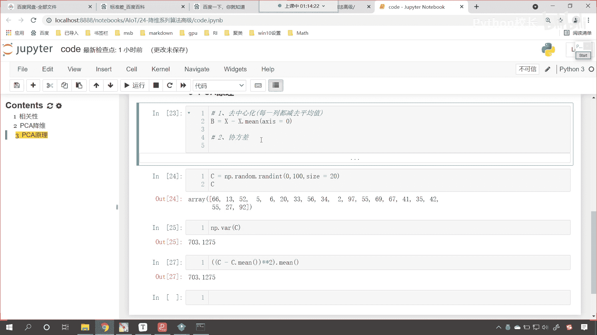

他们的计算公式也很类似，你往上滑，我们对于斜方差如何计算都有公式，看到了吧，你看样本的，我们样本的方差是xi减x的，上面有一个盖，这个代表平均值啊，平方那样本x和样本y的协方差呢，看到了吧。

就是x减去ex y减去e y怎么样相乘，看到了吗，相乘，所以说公式是不是差不多呀，x和y你可以理解为两个特征，这不就相当于我刚才举的例子吗，一个男生他的受欢迎程度是吧，这是一个特征。

把它当成x和这个男生的猥琐程度，这个是不是就相当于y是什么样的关系。

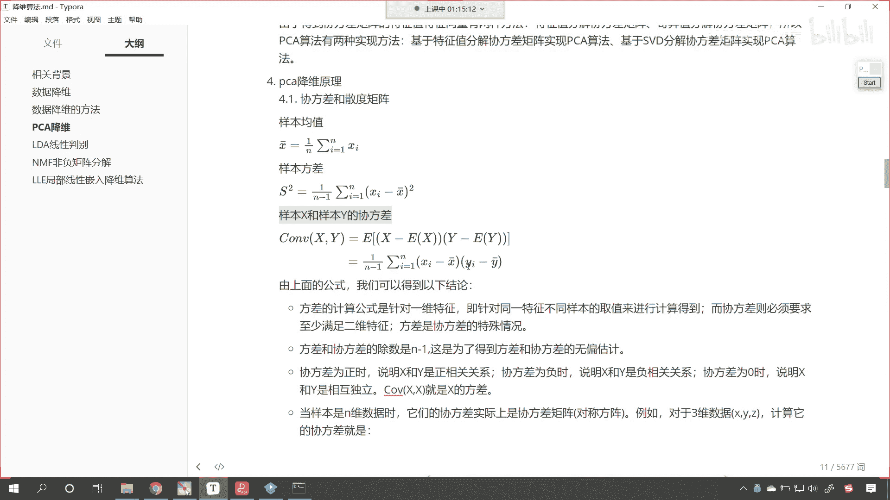

那么我们就可以使用斜方差来进行计算好。

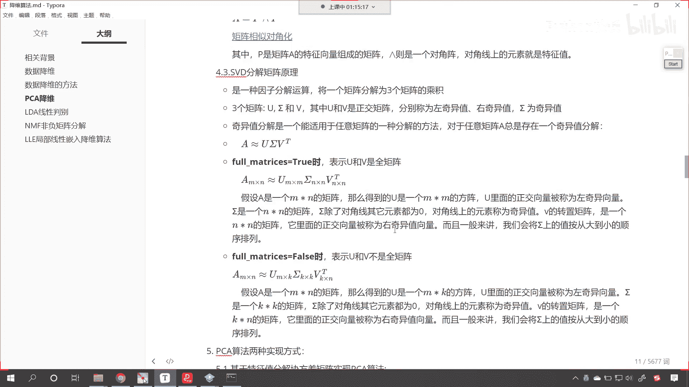

那么第二步呢，咱们就计算一下这个去中心化之后。

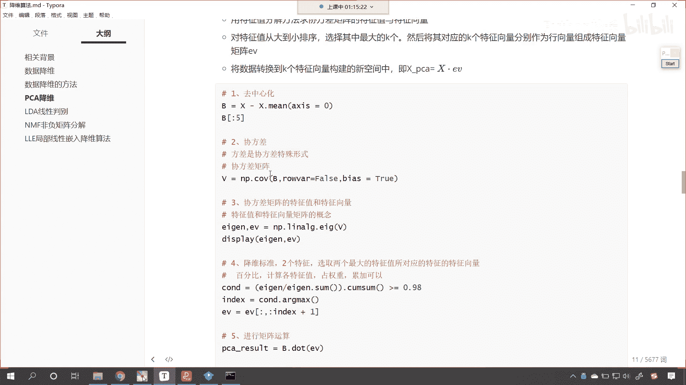

这个数据他们的这个斜方差是怎样的，来现在的话咱们就计算一下斜方差，v就等于np点，咱们直接调用它的方法，那就是cv小括号，咱们将b放进去，然后呢我们给一个肉，那这个时候呢默认情况下它是计算行。

是计算行的斜方差，我们不要让它计算行的协方差，就是要计算行的协方差吗，好false就是不要，你如果不计算行，是不是就表示计算列呀，因为咱们的数据当中列和列是不是表示属性呀，对吧哎。

所以说这个参数是false啊，然后呢给他来一个buyers，我们让它等于true，如果这个buyers等于true表示一个什么呀，这个84等于true，就表示在计算的过程当中。

我们给它加上一看计算的过程当中给它加上一，这个就像咱们线性方程的截距一样啊，这就像线性方程的截距，因为pca的源码当中，它的bios等于true，所以说我们这个地方为了保证和它的结果一样。

咱们也让它等于true，大家看这个就是第二步，我给你打印输出一下，看结果看到了吧，这就是咱们的斜方差好，那么接下来呢咱们往上插入一行，我们看一下pca它都有哪些属性和特征啊，看咱们往下滑啊，看往下滑。

在这里呢我们能够看得到一个什么啊，大家看我们能够得到一个叫explain what roberant，我们执行一下，看咱们得到这两个数据是4。22，零点多少，是不是0。24呀。

那我们得到了这个explain worries，但是我们到斜方差，这还没有是吧，那我们继续往下算啊，接下来呢咱们就第三步，第三步呢，咱们就计算协方差的特征值和特征向量，大家看这个就是特征值和特征向量。

那特征值和特征向量，这个是线性代数当中的知识，那咱们就i n a l g，这就是linear algebra，algebra就是代数的意思，当中呢有一个这个调用咱们的i a g这个方法，它计算的是什么。

你看communicate the agent values and write agent vectors of square，你看是不是特征值，这个是不是特征向量呀，叫agent vector。

所以说我们计算特征值和特征向量，咱们将v放进去，那他既然计算特征值和特征向量，咱们就接收一下a证是特征值啊，这个ev呢就是咱们的特征向量，在这个地方我给你展示一下咱们的j长什么样，ev长什么样。

这个时候你看我一直行，哎呦呦，这个时候各位小伙伴看，这个时候各位小伙伴你来看一下，看咱们此时计算出来的结果，看到了吧，我们的4。2和上面这个4。22，大家现在就能够看到。

咱们是不是有一定的这个差距呀对吧，那和这个0。24呢，你看这个就很像是吧，咱们现在呢调整一下咱们的参数啊，我们将bios调整成false，这个时候我们再来执行一下。

现在你来看这个bios如果要调整成false，是不是和上面的就完全一样了呀，来各位小伙伴，你看到这里，看到这里，你是不是就能够嗯到咱们第三步，这是吧，这个是线性代数的特征值和特征向量。

看这个就是线性代数，嗯咱们相关的知识点了好，那么我们就发现咱们计算出来，这个和上面就是不是就非常吻合了呀，他0。24267075，保留八位完全一样，那么接下来该怎么办呢。

就是你pca你这个算法当中到底是怎么封装呢，咱们到这儿已经揭开一半了，那我们接下来呢咱们继续往下进行操作啊，好那么你看咱们上面pca，咱们是不是保留了95%的重要性呀，对不对。

你看我保留了95%的重要性，那这个重要性到底是怎么算的呀，ev是什么，ev是不是咱们的agent是什么，是不是特征值呀，这个特征值越大，说明什么它就越明显越明显，是不是说明它越重要呀，对不对。

你看特征值越大，说明他越重要，那么他的所占的这四个当中的百分比诶，就是咱们的这个百分比，那咱们现在呢对它进行一个计算啊，a卷我们除以，这个时候你看我们来一个除法叫做a ag。sum，看着点sum。

因为我们那个数据是从小到大的，现在你看我一直行，你看这第一个特征它占的比例是多少，是不是0。92啊，第二个特征占的重要性是多少，0。05，是不是，那有了这个之后呢，我们再来一个小括号，把它括起来看啊。

咱们小括号括起来，把它当成一个整体，咱们调用一个方法叫com sum，还记得这个方法吗，这个就叫做累加和累加和长什么样，就是你第一个数加第二个数，第二个数就显示第一个数加第二个数。

第三个数呢就是前三个数的和，最后一个数呢就是前四个数的和，你看我一直行，看结果唉，现在有没有发现第一个数的重要性，0。92，然后前两个数的重要性是多少，0。97，前三个数是多少，0。9947。

第四前四个数呢一点，因为你就四个特征，前四个那当然是一点了，对不对，所以那么有了这个come sam累加和咱们怎么样，我们要让它大于0。95，看我们让它大于等于0。95，那这个时候它就是一个条件。

c u n d看那这个条件是什么样呢，你看我一执行前，大家看看我们如果要让它大于等于0。95，咱们会得到什么，咱们会会是不是会得到这个false true和true呀，对不对，好。

那么看这个时候咱们就得到了这样的一个结果，对不对，那也就是说，你第二个数是不是就达到0。95了对吧，第一个数达到了吗，没有，那这个时候呢咱们再调用一个方法叫做arg max。

看看这个arg max我们会得到一个索引，这个索引等于多少，一执行是不是就等于第一个呀对吧，那咱们此时呢看咱们此时就根据这个索引，我们从ev当中来进行切片冒号，我们让index加上一。

看这个为啥要加上一呢，你看你知道为什么要加上一吗，print输出一下啊，看print输出一下咱们的c n d，看到了吗，这个是false true true，那同时呢我再来给你输出一下print。

咱们将这个，计算出来的它的重要性。

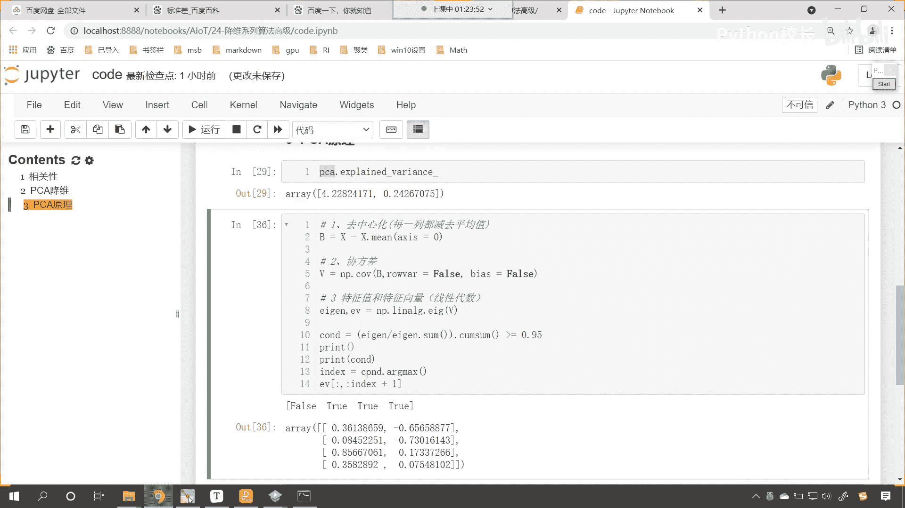

打印输出一下，现在你能够看到。

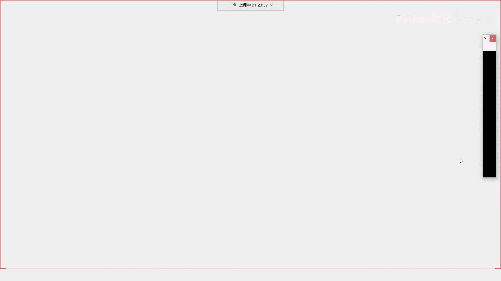

如果我要从特征值当中筛选，筛选重要性超过0。95的，我该怎么筛选呀，你看我选第一个，我只选第一个够不够，它达到0。95了吗，是不是没有达到呀，你看我如果只筛选，因为我的要求呢。

咱们上边pca这个算法我给了0。95，对不对，什么意思啊，就是降维，咱们保留95%的重要性的特征，没错吧，那到这儿了，咱们手动计算，这我要保留95%的重要性的特征，你看我只保留第一个够不够。

来各位小伙伴在讨论区里边回复一下，不够对不对，那怎么办，我是不是还得娶第二个呀，我取了第二个，你看他超过0。95了吗，超过了是吧，所以说我们取前两个是不是就可以了呀对吧，你看咱们取前两个就可以了。

那有小伙伴就说，你看你第三个不是0。9947吗，对那你最后一个还是一呢，咱们降维降维是吧，就是在满足条件的情况下，是不是取第一个是true的这个数值呀对吧，因为你后面的特征如果要都加上。

那它肯定远远满足，但是咱们降维呢就是把那些不重要的删掉，重要的保留，所以说我们取前两个看到了吗，取前两个，所以我们这个地方调用arg max，我们还得怎么样呢，咱们的arg max是吧，这还没完。

还得让他加上一，加上一就是第一个满足的，也就是说你如果你要取了前两个，前两个的重要性，它达到0。97了，满足不满足我们所给的这个条件，0。95呢刚好满足，见好就收，知道吗，这叫来总结一下，这叫什么。

刚好满足，见好就收，看到了吧，这叫刚好满足，咱们呢这叫见好，你看刚好满足，见好就收是吧，唉恰到好处，如果前两个不够呢，是不是继续向后呀，对不对，你看前两个不后，咱们就前两个不够是吧，就继续向后。

如果这个时候你的条件苛刻了，比如说你给一个0。98，那会怎么样，你看如果你要给一个0。98，你讲前两个够吗，前两个你加起来是不是才是0。97啊，不够这个时候怎么办，取前三个明白吗，哎取前三个以此类推啊。

好大家看这个时候，那咱这个就是咱们的第四步，看咱们的第四步，我们进行了特征值，和咱们的特征向量它的一个计算好，那么现在呢咱们的条件也进行了筛选，那我们继续来进行好，咱们继续进行第五步，看来一个第五步。

第五步呢咱们就进行，矩阵运算，咱们进行矩阵的一个乘法好，那么第四步这儿呢，咱们让ev等于咱们切片保留下来的数据，你看这个时候叫什么，看这个时候就叫切片，咱们呢就保留特征值，它对应的特征向量。

这叫保留特征值对应的特征向量好，那么我们就进行矩阵乘法，咱们起个名字就叫做pca result，就等于咱们的b。dot咱们的e v，然后那输出一下咱们的pca盖result，你看我一执行诶。

现在你发现结果看到了吧，是负的，看这个结果是不是就有了负的，2。68，我们查看它的前五个啊，冒号咱们来一个五看，查看它的前五个负的2。68，负的2。71，我们看一下和上面的一样不一样，好不好，看负的2。

684125563，是不是看2563，这个是多少，看负的2。741是吧，最后是169，看一下和上面一样不一样，看到了吧，169看一下咱们第二个啊，这个是0。319，这个是多少负的0。117是吧，0。

319，那咱们的这个第二维，它进行了一个怎样的操作呀，我们就发现这个第二维这个正和负，是不是进行了一个取反呀对吧，这个没有关系啊，你看咱们的第五个啊，负的2。72871654，看到了吧，负的2。

72871654怎么样，是不是完全一样呀，看到了吧，这个就是完全一样啊，看了完全一样好，那么啊这个就是pca降维它的一个数学过程，你现在知道怎么计算的了吧，看他就是这样计算的好，那么我们最后一步啊。

看咱们进行最后一步，咱们进行这个标准化好，我们看一下这个标准化，那就是pca result，标准化呢咱们使用这个z score标准化，那就是pca我们让它减去p ca result。me给一个轴。

我们让轴等于零，然后分母上除以pca result。td，我们也让它等于零，看，这个时候咱们执行一下这个结果，pca result，中括号冒号我们查看它的，看咱们查看它的这个前五个啊。

这是p c a result，咱们现在发现你看这个是不是负的1。309，这个是不是负的0。65呀，那这个是怎么回事啊，来咱往上看啊，咱们的pca当中还有一个重要的参数，叫做whitten。

这个什么是von von，就是白话我们给一个true，默认情况下这个参数等于false，看你看这个参数是不是等于false呀，我们往下滑看一下这个参数的说明，看这个whitten呢，问true是吧。

这个如果是true的话，它会进行归一化处理，现在你看啊，我给一个true啊，这叫whitten，是不是就有白色的意思呀，执行这个代码诶，现在你发现这是多少负的1。3053，这个是多少0。648。

这个是负的1。319，看和咱们下面这个一样不一样，看到了吧，负的1。30971087，负的0。6505，稍微有一点不一样，看到了吧，稍微这个是多少，0。6483，对不对。

看那我们说它的几数列和偶数列是吧，它会进行一个它会进行一个这个正负的颠倒，这个呢这个都是小事儿啊，因为正数和负数在你表示某些意义的时候，是类似的，但是我们现在差一点点，我们求解出来的是-1。

30971087，上面计算出来的是多少，负的1。30533786，这个whitten等于true，和咱们下面计算出来的稍微有点差异，现在我就把这个问题是吧，这个悬赏悬出来，你在百度上。

你在谷歌上去搜索都找不到正确的答案，那百度上你可以搜到这种写法，就是六最后进行标准化，得到的结果和我这个一模一样，但是和pca和我们使用pca计算出来的，稍微有一点差异，那这是怎么回事呢，百思不得其解。

现在我告诉你怎么回事啊，看一下咱们里边有没有一个参数啊，你看啊，这里边有一个参数叫什么呢，叫做d d o f，你知道这个参数是干嘛的吗，d d o f默认情况下它是它是多少，是一是零。

我们现在把它调整成一，大家拭目以待啊，你看我一执行，你看我一执行，我们所求解出来的结果，和上面所求解出来的结果，大家现在再来比对一下，为了大家比对方便，我把它写到这儿，你现在再来比对。

后八位数和这个是不是完全一样呀，看到了吧，是不是完全一样，现在是不是完全一样了，你知道这个参数是什么吗，你知道这个参数是什么吗，好我们一会儿再来讲解啊，那么现在咱们总结一下这个代码。

是不是都是咱们一行一行码出来的，看到了吗，这都是我这都是咱们一行一行写出来的啊，那么我们微微调整一下。

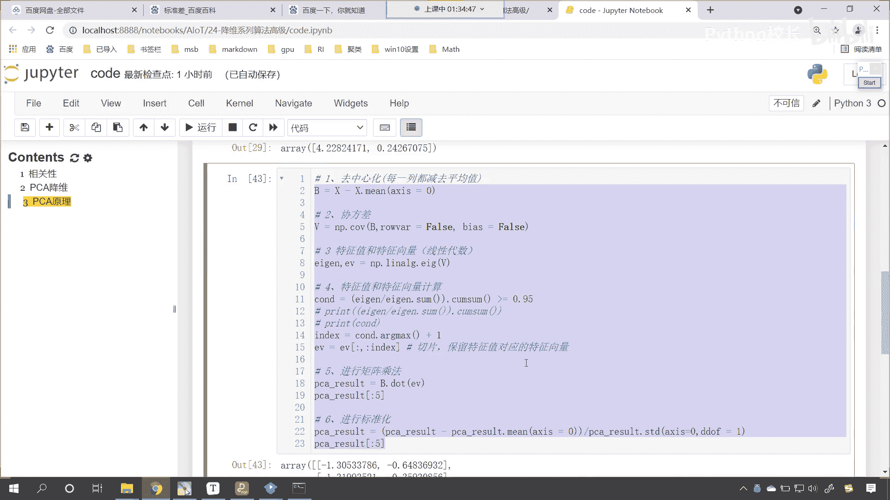

咱们将这个0。95改成0。98会怎么样，看到了吧，现在是不是有三列特征呀，它有三列特征，咱们也把它改成0。98，执行一下这个代码，你看我们也是有三列特征，你看这三列特征和它是不是一样，看到了吧。

一样不一样，所以说你调整这和上面这个调整是不是同步的，一致的对不对，看一下咱们到底是怎么操作的啊，第一步去中心化是不是就是减去了每一列，减去每一列的平均值，第二个斜方差，对不对，第三个是特征值。

特征向量，咱们是不是使用了咱们的这个线性代数，当中的yj啊，这个就是特征值特征向量，然后呢我们对于特征向量，咱们对于特征值进行运算，看这个数学运算你要明白是怎么回事，我是一步一步给你展示的是吧。

特征值咱们咱们就说了，表示咱们特征的重要性，它越大，这个特征就越重要是吧，所以这就像你的价值一样，你越有价值，那么你挣的钱就越多，对不对，你看这个科学家是吧，他们从来就不关心钱是吧。

因为呢钱对他们来说是吧，没用了嗯对吧，因为这个够用是吧，完全够是吧，好然后呢我们进行切片，咱们就是把我们筛选出来的特征值，对应的特征向量给它切出来，然后呢矩阵乘法，你看，然后呢。

标准化得到的结果和咱们使用pca一模一样。

那说明了什么，我们所写的这二三十行代码。

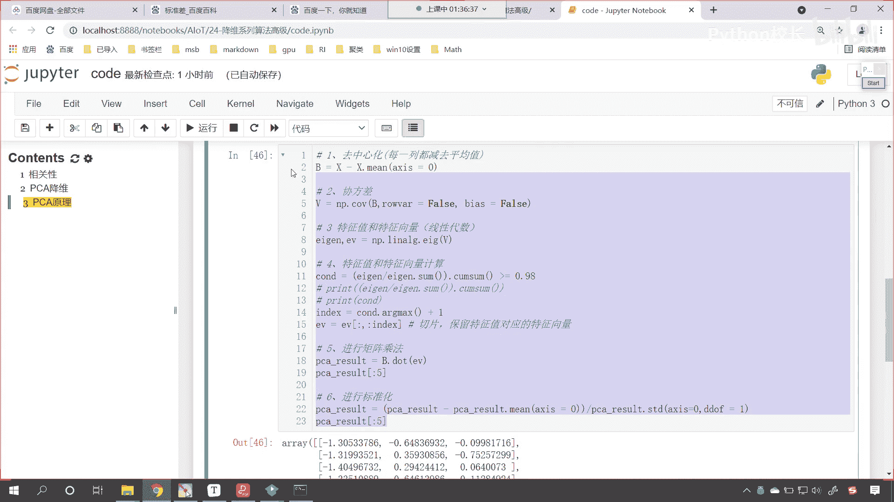

其实pca是不是进行了封装，现在我们是不是终于揭开了pca这个算法，它的神秘面纱，就是人家到底是怎么做到的是吧，一封装我们一用感觉特别高大上。

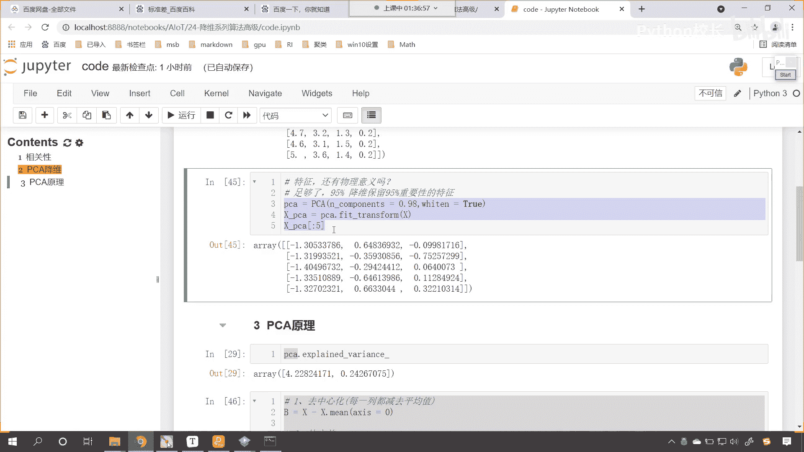

其实就是这些代码啊，其实就是这些代码，如果以后你面试是吧，别人问到了，说这个pc到底是怎么回事是吧，你就这样跟他讲就可以了，再回到咱们的课件当中。

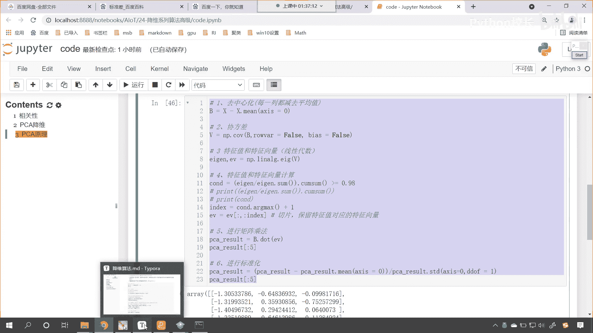

你看咱们刚才问到的这个问题是吧，我们如何得到这些包含最大差异性的主成分呢，就是这个pc到底是怎么来的，是不是这个问题啊，看咱们怎么通过计算机矩阵的协方差矩阵，然后得到协方差矩阵的特征值，特征向量。

选取特征值最大的k个特征所对应的什么，看所对应的这个看选取，你看啊，咱们在对于这句话是吧，进行一个解读是吧，看到了吧，选取特征值最大的k歌特征所对应的特征向量，看到了吧，这样我这样就可以将数据矩阵。

映射到新的空间当中了，你看这个地方用了一个什么，转换到新的空间当中，实现数据的降维，那回到咱们代码当中。

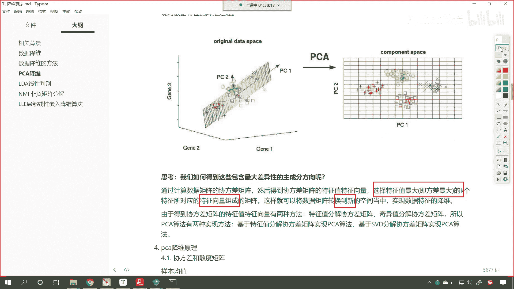

看咱们是怎么做的啊，看到了吧，去中心化，然后求协方差，然后特征值特征向量，筛选特征向量是不是剩下的，然后呢，这一步是不是就相当于咱们所说的空间转换呀，看到了吗，这个就是空间转换。

那这个空间转换用的是什么方式，矩阵乘法，牛不牛，看到了吧，牛不牛，现在你明白矩阵乘法它的真实含义是什么了吧，如果我们非要把每个数学公式。

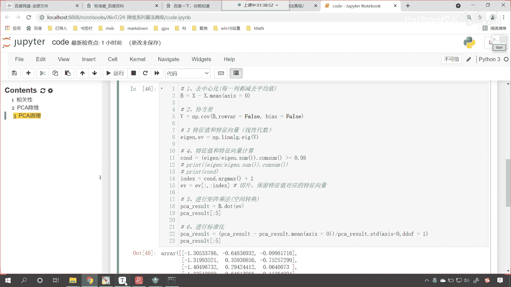

都用咱们的这个物理化的形式来表示，这个就是将数据矩阵转换到新的空间当中，看进行了一个映射，这就这个矩阵乘法就相当于这句话看啊，你要多理解啊，你看这个数数据矩阵不就是咱们的原数据吗，这里的转化是咋回事儿。

乘法矩阵乘法，所以说呢你看我们转换到这个空间当中，咱们实现了一个什么，实现了一个什么，这个差异性最大，怎么才能实现差异性最大呀，你的特征值特征向量越明显，那么这个差异性就越大，明白了吗。

哎这就是咱们嗯这个pca降维。

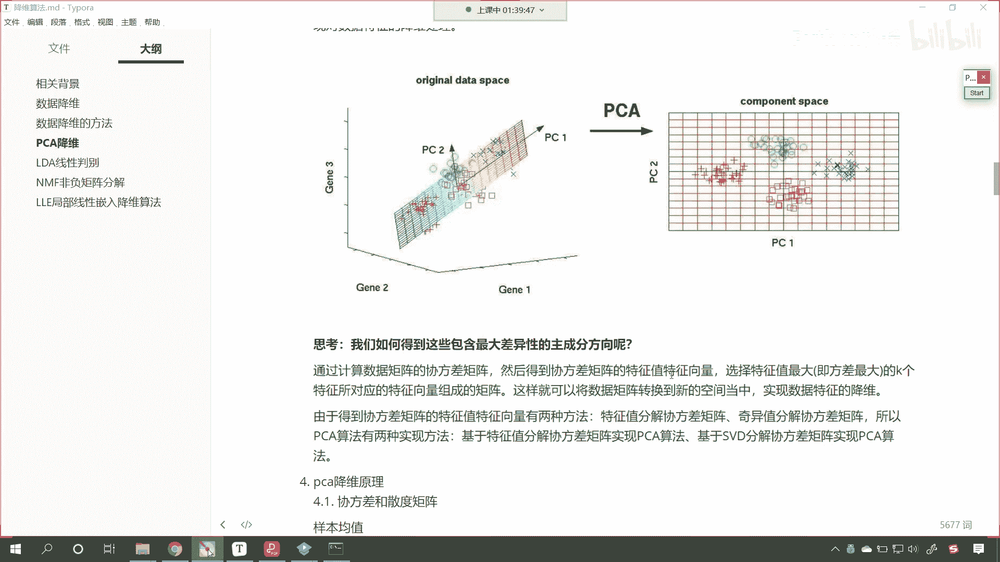