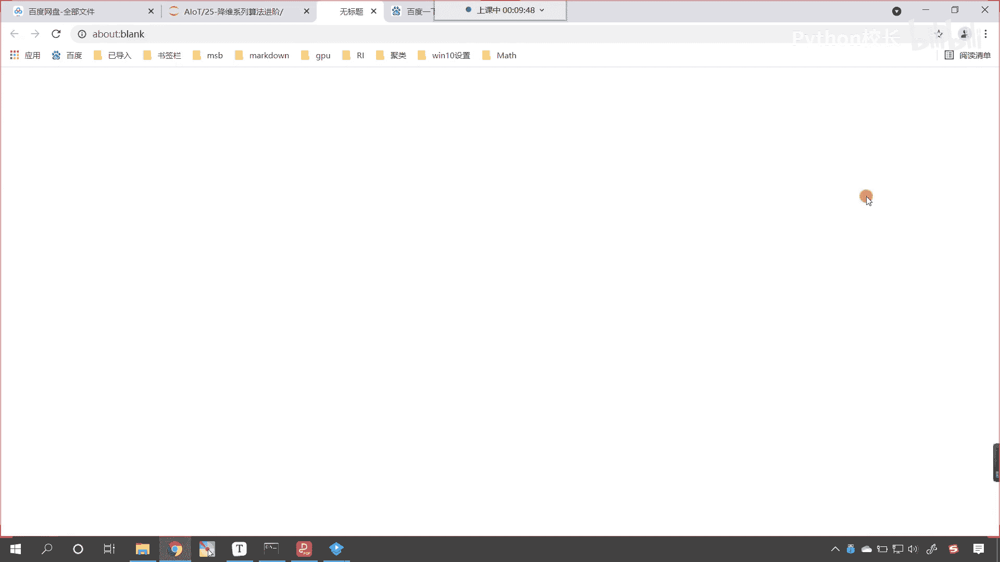
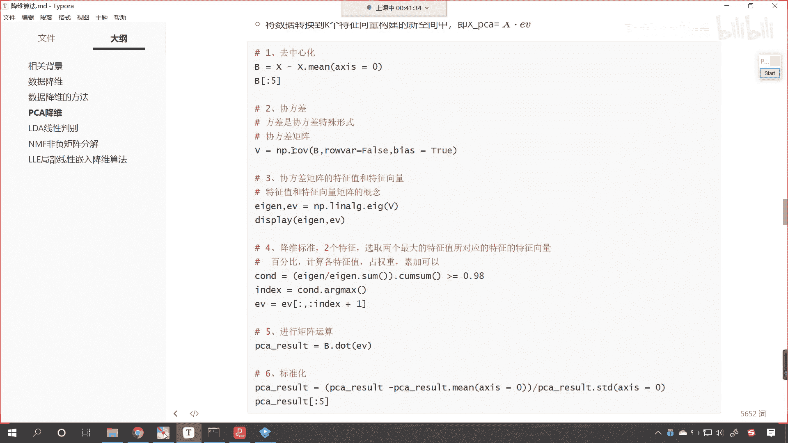

# P162：1-协方差和散度矩阵 - 程序大本营 - BV1KL411z7WA

呃比如说咱们pca降维这个地方，我们介绍到了均值方差，这个都比较简单，我们呢还介绍到了斜方差，那这个斜方差呢我们有相应的公式可以计算，对不对，那么这个里边呢还为我们介绍到了一个概念，叫做散度矩阵。

那么呢咱们回到代码当中，我们呢来进行一个计算啊，来回到代码当中，咱们呢找件file呃，今天呢是第25讲，这是降维系列算法的进阶，在这里呢我们创建一个代码。

选中它，咱们给它改个名叫做co。

然后呢我们导一下包，咱们import numpy as np，执行一下，我们在上面插入一行，咱们呢首先来一个三级标题，那这个三级标题呢就是咱们的斜方差嗯，和咱们的散度矩阵伞呢就有散点的意思啊。

叫散度矩阵斜方差，咱们知道是怎么回事，对不对，咱们给一个x啊，x n p。random run int，咱们呢就从零，我们让他到100，我们给一个size小括号，咱们让它是五行五列。

这个时候呢一执行各位小伙伴，你就能够看到x这个数据是不是就有了，有了之后呢，咱们调用np。cov，这个方法就是去计算咱们的斜方差，m呢就是我们要计算的数据，那这个肉vr默认情况下。

它是计算行的协方差矩阵，现在呢咱们按照列来进行计算，当然你也可以计算行啊，这个都是无所谓的啊，啊x放进去里边有一个参数叫肉vr，如果我要给一个false，那这个就意味着咱们再去计算协方差十。

计算协方差时呢，哎我们呢是根据列来进行计算，那啥是列呢，各位小伙伴看到咱们这个数据，你就能够发现，你看这是不是一列，这是不是一列对吧，这是一列，它是按照列来进行计算的，我为你执行一下，你看我一运行。

咱们现在是不是就出现一个结果呀，你知道计算出来的这个叫什么呀，这叫斜方差矩阵，看我们计算出来的呢叫做斜方差矩阵，那第一个数它为什么是536。7呢，那大家看咱们这个看咱们这个图啊。

你看咱们如果想要计算c o n c o v x y z，你现在能够看到咱们左上角第一个计算出来的，是不是cov x和x它的计算结果，那如果说自己和自己去计算协方差，这个时候它返回的结果是不是就是方差呀。

你看你这个是自己和自己进行计算，那自己和自己计算它是不是就是方差呀，对不对，你看它就是方差啊，我们自己和其他的特征进行计算，这个时候呢他才是斜方差，看这个时候它叫这个时候呢它叫做方差。

那么这个呢是自己和其他在进行计算，这个时候呢它就是协方差，看这个就是斜方差，协方差呢是两个属性之间它们的运算，唉，所以说现在你能够明白，这到底是怎样的一个关系了吧，那方差和协方差是什么样的关系呢。

方差和协方差他俩呢，哎嗯咱们的这个方差是斜方差的一种特殊形式，看到了吗，方差是斜方差的一种特殊形式，就像咱们所说的椭圆和圆的关系，我们的圆是不是椭圆的一种特殊形式呀，这个大家能够理解吗，你看到了吧。

那我们在这儿呢把这个叫做椭圆，那我们元是椭圆的一种特殊形式，所以说它们之间的关系呢，哎大概呢就是这个样子哈，好那么现在呢咱们自己来计算一下好不好，为了让大家能够明白，那我们说这536。7。

它呢就属于是第一列的，那咱们现在呢就可以计算一下，那我们就调用np。v a r诶，大家看啊，咱们计算一个vr，那我们在计算vr vr的时候呢，x中括号冒号，咱们给一个零，这个时候你看过一执行。

看咱们现在得到的结果，是不是429。36呀，那逗号啊，咱们给一个d d o f，我们把它变成一，这个时候你来看咱们计算出来的结果，是不是就是536。7，和上面这个是不是就一模一样了呀。

咱们说这个d d o f它代表什么意思呀，它是不是代表咱们的样本嗯，咱们的样本方差呀，来回到咱们代码当中啊，回到咱们这个课件当中，我往下滑，下面有一个地方专门就介绍了，这个是总体样本标准差。

这个是样本的标准差，哎现在你就能够看到一个是总体标准差，一个呢是样本标准差，这俩有什么不一样的地方呢，你能够发现如果要是总体样本的话，分母上用的是不是n如果要是样本的话，咱们分母上用的是不是n减一呀。

有看到这一点点区别吗，那这个一呢它所对应的我们减去的这个参数，所对应的就是咱们的d d o f这个参数，如果它要等于一啊，如果他要等于一，那就表示好，那就表示咱们分母上所减去的这个一看到了吧。

哎就表默认情况下它是零，你如果要是零的话，是不是就表示总体样呃，总体的标准差呀，减去一就表示样本的标准差，而我们代码当中上面咱们再进行计算，协方差的时候，咱们用的是样本的，这个地方呢咱们用的是样本的。

所以说它的分母上，分母上它的计算公式呢就是n减一，那我们如果要自己去计算，哎咱们d d o f让他等于一，那么还有一种方式咱们也可以自己去计算，那这个方差它呢都是有数学公式的哈。

你看啊开根号里边的开根号里边的就是方差，公式是xi减去mu是不是来一个平方呀，然后来一个累加和是不是除以n分之一，那其实这个是不是，就相当于是求了一个这个平均呀，而样本的话它是分母上减了个一。

这个呢就叫做无偏差，估计咱们的分母上减去一，我们把这种形式叫做无无偏差，估计他呢是故意把这个值给你调的稍微大一点，因为你样本的话，它呢是总体的一部分，如果要是总体的一部分，我们随机抽样得到的结果。

那么咱们这个和求解出来的它相对于总体而言，它就会稍微小一点，那为了让我们样本计算出来的标准差，和总体的标准差更加接近，所以咱们就调小了咱们分母上的这个这个数据，你看这个时候我分母上减去了一个一。

那么我们整体的效果是不是就是增大呀，那这个增大的这个趋势，咱们就是为了尽量和总体的标准差一致，那咱们就根据这个公式我们来计算一下，好不好，让大家开开眼，让大家知道是吧，这些公式这些调用的方法。

咱们其实也可以自己进行计算，那这个时候就是x中括号冒号，咱们来一个零，然后呢我们减去x中括号冒号来一个零，我们求一下它的平均值，小括号把它括起来，把这一堆括起来，然后怎么样，是不是给他来一个平方呀。

那就是星号星号二平方完之后，咱们整体括起来，然后呢是不是对它求一个和呀，累加和累加和之后，咱们再整体括起来，然后呢它是不是还得除以一个分母呀，除以小括号分母就等于多少，分母，是不是就等于咱们的n减一呀。

那这个n呢就是咱们的样本量，我们就看一下咱们的第一列当中，它一共有几个样本，我们一起来数一数，各位小伙伴就能够清楚地发现，这第一列当中是不是有五个呀，因为我们的数据是五行乘以五列。

那这个时候呢哎咱们呢就除以5-1，这个时候你看过一执行，我自己计算出来的结果，和上面是不是一模一样呀，你现在明白呀，这个数536是怎么计算出来的吧，那还有第二个数是负的，184。5。

那这个是怎么计算出来的呀，对不对，那这个是怎么计算出来的，来咱们现在呢也来进行一个计算啊，我们看一下np。cov，咱们把x中括号冒号零放进去，x中括号冒号一放进去，我们看一下能不能计算出来一个结果。

哎这个时候各位小伙伴就能够看到，你看我们计算出来的结果是不是就是负的，184。5呀对吧，你看这就是协方差，那斜方差的公式是什么样的呀，看斜方差的公式是什么样的，咱往上滑斜方差呢也有它自己的公式。

你在这里能够看到c o n v xy，它呢就等于你看特征x减x的平均值，乘以特征y减去y的平均值，然后呢是不是对他求了一个和，然后除了个n减一啊，咱们回到代码当中，我们也这样进行操作一下。

那这个时候呢就是x中括号冒号零，我们让它减去x中括号冒号零，求以求一下它的平均值，然后乘以小括号，小括号里边呢是咱们另一个特征x冒号一，然后减去x中括号冒号一，求一下这一列的平均值，求完之后。

咱把它们当成一个整体，用小括号括起来，你看这里边我写的小括号是不是比较多呀，如果这个代码让你自己去写，你要搞清楚他们的关系啊，然后我们点求一下sum，求完求完和之后呢，咱们再来一个除法除以多少，分。

母上也来一个小括号，小括号括起来就表示呢他要他要优先计算，我们是不是也是5-1呀，这个时候你看我一执行，各位小伙伴来睁大眼睛看一看，我们求解出来的结果是多少呀，看到了吧，咱们现在求解出得到的结果是负的。

184。5，后面是不是有很多零呀，那我们四舍五入的话，后面这些零是不是就可以去掉呀，对不对，这个时候你看这就是咱们计算协方差的公式，看到了吗，这就是斜方差公式，好，现在我我为各位进行了展示好。

那么到这里各位小伙伴，你是不是就明白什么是斜方差，什么是方差，什么是样本的方差，什么是总体的方差，他们呢是有一点是有一点点区别的啊，他们是有一点点区别的好，那么接下来呢。

咱们再介绍一个叫做数据x的散度矩阵，看数据x的散度矩阵，那这个散度矩阵呢和咱们的斜方差，它呢是有一定关系的，你看散度矩阵是如何计算的，我们上面呢有一个定义，各位小伙伴，你就能够看到。

你看这个就是散度矩阵，是x k减m乘以x k减m，然后上面是不是有一个转置呀，看到了上面这个t就表示转置m是什么呀，m是不是求了一下它的平均值呀，对不对，那我们就计算一下散度矩阵吧。

来现在呢咱们就回到代码当中啊，好那么我们在上面插入一行，咱们来一个四级标题，在这儿呢我们叫做斜方差，咱们把斜方差进行了介绍，在它的下面呢咱们再来一个四级标题，这个呢就叫做散度矩阵，好。

那么散度矩阵根据咱们刚才那个公式，咱们呢对于x我们先求一下它的平均值，那就是x点，咱们计算一下密，这个时候大家要注意，咱们x呢是二维矩阵，咱们在计算平均值的时候，咱们呢需要给它指定轴。

这个轴如果要等于零，你看这个轴如果要等于零，咱们计算的是每一，咱们计算的是每一列的这个平均值，唉这个时候你看我一执行，咱们得到的这个结果呢，我们接收一下，咱们就叫m啊，看接收一下这个结果就叫m。

咱们呢先把数据x我们打印输出一下，这个方向它的平均值，那这个平均值呢就是33。2，有了这个数据之后，咱们接下来呢我们就可以做减法了啊，那就是x减去咱们的m，看我们让x减去m。

这个时候你看我执行一下咱们的代码哎，此时各位小伙伴，你就能够看到咱们的结果是不是就出来了呀，看到了吧，结果就出来了，是不是，那这个结果出来之后呢，我们把它接收一下啊，咱们给它起一个名字叫b。

然后我们给它起个名叫b好，那么有了这个b之后，咱们根据这个公式，你看矩阵减去它的平均值，然后再进行矩阵乘法，那是不是他自己的这个转置呀，对不对，上面右上角是一个t，那我们就回到代码当中来。

咱们在这儿呢进行一个操作，那就是b。do b。t哎，你看这个时候我们是不是就得到一个结果呀，咱们得到的这个散度矩阵，你看结果就有了啊，这个呢就是散度矩阵，那这个散度矩阵，好那你看啊，咱们这个散度矩阵。

它和咱们上面所介绍到的协方差，它有什么样的关系呢，我们上面的斜方差，咱们计算出来是不是536。7，负的184呀对吧，他们有关系吗，我们复制一下，咱们在最下面这一行代码执行一下，让他们俩进行一个对比啊。

我们让它进行一个对比，那么他们到底有没有关系呢，唉大家看啊，他们呢是有关系的啊，这个呢是有关系的，那它们之间是怎样的一个关系呢，好那么来回到这儿啊，它们之间是怎样的一个关系的，呃它们之间的关系呢。

诶大家看啊，他们之间的关系呢，呃我们在进行这个散度矩阵的时候，那么它们之间的倍数呢是n减一倍，看它们之间的倍数关系是n减一倍，呃咱们在进行这个散度矩阵计算的时候，我们去减平均值的时候，咱们这个轴是吧。

哎我们得需要去调整一下哈，来那刚才的话你看我们剪成什么了，刚才咱们这个再去进行x。mean的时候，你看我是不是给成零了呀，那这个零大家观察一下，它计算的是，你看它计算的是不是咱们每一列的这个。

看它计算的是不是咱们每一列的这个平均值呀，你比如说呃咱们看一下啊，33。2，或者说我们看倒数第二列，你看咱们的倒数第二列，89，60 18，79和四是吧，那这个数你看求出来的平均值是，正好是54+9。

这个个位数是三三，加上咱们的八个位数是一，1+9是不是正好是零呀，所以说求解出来的这个是50，那根据咱们相应的公式，咱们在计算的时候呢，我们给它指定轴，让它是一，如果指定轴是一的话。

这个时候各位小伙伴就能够看到，看咱们47 41，那我们计算的结果，咱们是不是根据行进行计算的，根据行计算的平均值呀，对不对好，那么这个时候呢根据行计算的平均值，然后呢咱们再去计算b啊，根据行计算。

咱们呢再去计算b，这个时候呢，咱们b和咱们的这个m在进行减法的时候来，大家现在就能够看到，其实呢我们你看这个三减去咱们的47，我们得到的结果是不是-44呀，12减去咱们的41。

咱们得到的结果是不是负的29呀，那我们的89减去咱们的20。2，咱们得到的结果是68。8，这样我们可以实现一个什么样的效果呢，也就是说咱们每一行每一行，每一行，它是不是都减去了它各自的这个平均值呀。

看到了每一行都减去了它各自的这个平均值好，那么我们在进行减法的时候，咱们呢其实是进行了一个广播机制，那我们呢进行了一个广播机制好，那么有了这个结果之后，咱们呢得到了b，我们再去计算咱们的散度矩阵啊。

这个时候呢我看一下咱们的结果啊，b。dot bt，咱们得到的结果还是不太对，是不是啊，大家看一下啊，得到的结果还是不太对，和咱们np。cn v x row等于false，我看一下啊。

因为这第二个数呢大家看它是负的，是不是我们的第二个数是负的，这个时候呢它就有一定的这个差距，来咱们现在呢检查一下啊，看看是哪个地方它没有对应上啊，回到咱们的课件当中，在这个地方呢咱们是进行了一个。

咱们是进行了一个这个reshape是吧，哦我明白了，明白是怎么回事了，你看咱们这个协方差，我们在进行计算的时候，咱们这个roll是不是等于true呀，对不对，而我们这个代码咱们在进行计算的时候。

你看咱们这个roll等于多少，看咱们这个roll是不是等于false呀，那么此时呢我把它变成true好，那么这个时候呢咱们在计算的时候，其实呢我们就是行的计算了，看此时咱们就是计算行的嗯，这个斜方差。

那这个时候你看我计算出来的结果，和上面是什么样的一个关系呢，上面的结果我进行一个除法，咱们除以多少n减一，这个n就是5-1，这个时候你看我一直行看啊，这个时候呢诶大家看啊。

看咱们执行的这个执行的这个结果啊，我看一下啊，咱们除以五啊，执行一下，还是有点不一样，是不是执行这个是1600，差一点点，咱们来一个buyers啊，我们让这个bios等于一执行一下，这是1300多个。

然后减去一执行一下，这个就是2000多，是哪个地方差了一点点啊，好执行一下，x1600 多，这个是2284，我们给它除以一个五，咱们执行一下1622，还是某一个地方有一个相差，对不对。

来咱们回到我们的课件当中啊，回到咱们的课件当中，那么呃咱们上面说到的这个结论呢，我们说到了这个散度矩阵和协方差矩阵，他们的这个关系呢是这个n减一的关系，这个n呢其实就是咱们的这个数量的个数。

那在我们的代码当中，咱们的这个数据呢x大家看啊，咱们的数据x它呢是五行五列，对不对，这个数据是五行五列，那我们再去进行这个平均值计算的时候，咱们呢让它减去咱们的让让这个x。mean。

我们呢做了一个这个减法，做了一个求平均值，这个时候呢就是47 4120。20。2，6650。6，这个肯定是咱们每一行的平均值，那么我们有了这每一行的平均值，然后呢咱们就做减法，在做减法这个地方呢。

咱们在这儿来一个reshape-1和一，这个时候你看我执行咱们就会得到一个新的b，我们这个地方进行了数据重塑，那原来的时候咱们的这个数据m呢，它是一行，经过这个数据重塑，大家想一下它是不是就有行。

是不是就变成列了呀，你看原来是一行，对不对呀，那现在这个数据变成什么了，这个数据是不是就变成一列了，那此时我们在进行做减法的时候，看此时咱们在进行做减法的时候，是怎样的一种方式进行了减法呀。

那其实呢就是这一行数据，那就是32，89，89，42都减去了谁呀，都减去了我们的47，你看这第一行减去了47，咱们家这个规律呢在这儿进行一个说明，也就是说第一行咱们都减去47。

第二行呢你看一下第二行都减去了谁，第二行咱们是不是都减去了41呀，看到第二行所有的数据都减去了41，所以你看60减去咱们的41，得到的是19 七，减去咱们的41，我们得到的结果是不是负的34呀。

47-41得到的结果，你看是不是六呀，好那么我们呢在对应的方向上做了减，做了这个减法，然后呢我们再进行一个散度矩阵的计算，好那么这个呃到了b。bt之后，此时呢咱们再来操作一下啊，此时咱们再来操作一下呃。

我们看一下此时能不能对上啊，来我们做一个除法，咱们呢就除以5-1，哎我们一运行诶，大家现在就能够发现，你看此时咱们计算出来的散度矩阵，和咱们的结果是不是就完全一样了呀，大家现在再来看咱们这个结果。

你看这是我们散度矩阵得到的结果，这个呢是咱们斜方差得到的结果，你看365点，363。5，1678。5，负的194。5，负的194。5，此时是不是就完全一样了呀，对不对，你看看此时就完全一样了。

那大家发现啊，你看我们在进行这个协方差计算的时候，我们是不是可以根据roll来进行计算呀，看到了吧，我这给了个true，那如果我要给个false呢，看如果我要给个false呢，是不是也是一样的呀，对吧。

来咱们现在呢再来演示一下啊，你看此时我们给一个false，那就是np。c o v，咱们来一个小括号x放进去，我们让这个roll呢等于false f a l s e，看此时你看咱们计算出来的结果。

和刚才是不是就不太一样了呀，看到了吧，上面咱们是怎样的一个计算呢，在这儿我们进行一个说明啊，看上面呢咱们是根据行来进行计算，如果要是根据行来进行计算，什么意思呢，数据x咱们在这儿给各位显示了。

你看以行为单位，就是这个32 89 89 42，把他们当成一个整体，咱们对这五个数计算它的斜方差，然后呢计算第一行和第二行他俩的斜方差，然后依次进行计算，那么如果我们要把这个参数rvr等于false。

那这个表示什么呢，反正我们的数据是二维的，要么是行，要么是列，如果入vr等于false，那么就表示咱们在进行计算的时候，我们呢根据列来进行计算，第一列去计算它的方差，第一列和第二列去去计算它的协方差。

一般情况下大家要注意啊，一般情况下咱们都会去使用这种方式，roll vr等于false，你看一般情况下咱们都会使用这种方式，因为行和列大家想一下，它其实是不是就是一个转置呀，对不对。

那我们现在也来操作一下，你看我怎么操作啊，那就是x。t咱们怎么样减去x。t点啊，你看我们上面咱们再进行这个x man的时候，你看这个地方我是不是给的x mean点，xx等于一呀，来那我们也复制一下啊。

咱们直接算啊，xt点，咱们来一个me，我们让他xx等于一，然后呢，我们对它进行一个reshape，-1和一，计算完之后，咱们来一个b你看这个地方我是不是x。t，大家知道x。t是不是就表示转置。

那转制的话它就变成什么样了，你看我们如果要进行了转置，那它是不是就是行变列列变行呀对吧，你看它就行变列，对不对，你看它是行遍历，然后列是不是就变成了行呀，对不对，那我这个时候呢。

因为你这个肉vr等于什么等于false，那其实就是计算的时候原来是计算行，现在是不是就变成计算列了，那如果说我将你行和列转至，是不是就和原来的一样了呀对吧，那所以说咱们就转置一下，那就是x。t减去x。

x t。mx等于一，reshape负这个-1和一，那我们执行一下咱们的b好，那么有了b之后呢，咱们b还根据刚才的公式b。dot b。t，这个时候你看我一执行，大家看咱们得到的结果是不是200。

看是214。6是吧，我们用一个除法啊，那就是5-1，这个时候你看我运行得到的结果，和咱们上面np。cov false得到的结果，你来看是不是完全一样，看到了吧，这两个计算出来的结果是不是也完全一样。

看到了吧，就是说无论无论我们计算的是np。cov，这个入vr等于false，也好还是咱们给一个roll vr等于true也好，无论是true还是false，我们呢都可以根据咱们这个公式是吧。

我们把它计算出来，那这个时候呢咱们也就观察到规律了，散度矩阵和咱们的斜方差，它们之间的关系呢就是n减一倍是吧，他们之间的关系呢就是n减一倍啊，好那么到这里呢，咱们对于我们上一节课所讲的内容。

比如说pca降维当中，看看咱们pca降维当中，我们就会用到特征值，特征向量是吧，就会用到斜方差。

那么我们对于这个知识点呢。