# P164：3-线性代数之SVD奇异值分解 - 程序大本营 - BV1KL411z7WA

接下来呢我们继续往下看，咱们呢再来一个四级标题，你看上面是什么，是特征值和特征向量，接下来呢我们再介绍一下s v d，这个叫做奇异值分解啊，这叫奇异值分解。

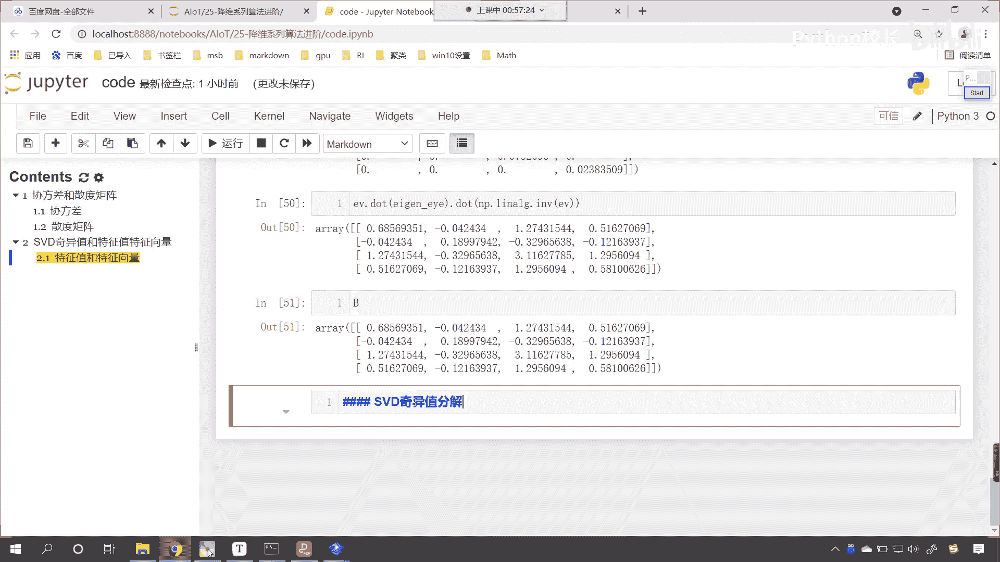

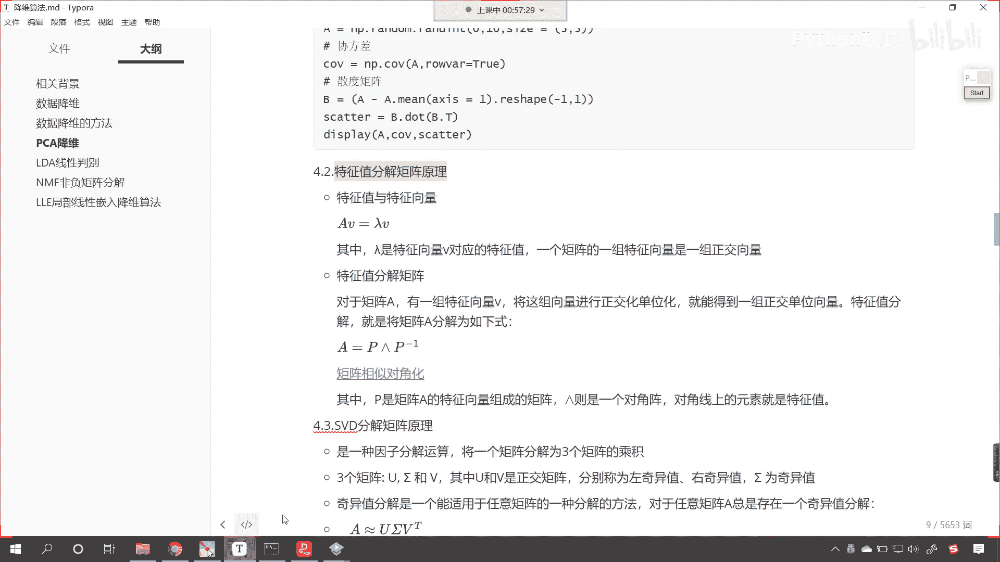

那这个奇异值分解呢他呢也是矩阵，也是啊，也是呢一种这个因子分解运算。

它呢把这个矩阵分解成三个，你现在能够看到，你看啊，这个叫左奇异右奇异，是不是啊，u西格玛和v左奇异又奇异，中间的这个西格玛为奇异值，你现在发现有没有发现我们svd奇异值分解。

其实和咱们上面的特征值特征向量分解，是不是结构是类似的呀，你看到了吧，结构呢是类似的啊，为什么这样说呢，我们上面其实进行特征值特征向量分解，你看这个地方是不是有个p，这个地方是不是有p的逆矩阵呀。

那你想他和咱们下边骑一直分解，是不是也是对应的呀，这个u对应着咱们上面的p，这个v t对应着上面咱们的p的逆矩阵，我们中间这个西格玛咱们给他换一条，换一个颜色，是不是对应着咱们上面特征值所对应的。

斜对角矩阵呀，对不对，你看公式是不是完全一样，只不过我们进行特征，咱们在进行奇异值分解的时候，看咱们在进行奇异值分解的时候，你能够发现你看这个地方呢是约等于看到了吧，这个地方是约等于。

那为什么要约等于呢，那为什么要约等于呢，特征值特征向量，它是比较圆满的啊，在这儿呢我们进行一个说明啊，看咱们的特征值特征向量它呢是有解，它是比较圆满的，哎我们方程最好有解，是不是。

那这个时候一解就解出来了，它呢比较圆满是吧，皆大欢喜，那我们当遇到奇异值的时候，它呢其实呢是无解的，你知道有一些方程是不是就是无解呀对吧，这个是无解的，它呢是不圆满，因为不可能所有的方程是吧。

都能够进行特征值特征向量分解，你看并不是所有的方程都能够进行特征值，特征向量分解啊，大家要注意啊，那我来为各位演示一下啊。

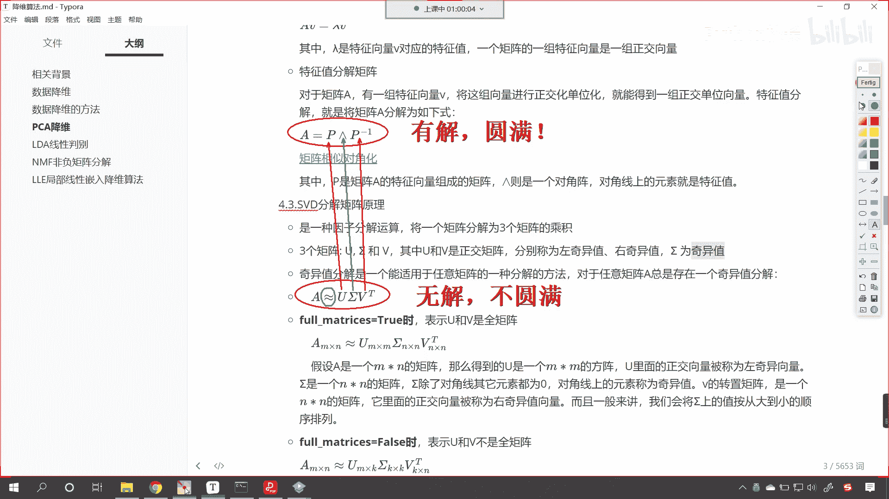

来回到咱们的代码当中，好，现在呢咱们重新生成一个x，我们让它是np。random，咱们来一个run int，我们从零到十，然后呢我们给一个size，嗯咱们呢给他这个，呃三行五列好不好。

这个时候你看我们的x，大家看它是不是三行五列的一个数据呀，那有了这个数据，此时呢我们进行一个特征值，特征向量分解好不好，那我们将x放进去，这个时候你看我一执行，你看我们在进行特征值特征向量操作的时候。

你看能解吗，此时是不是就不能解了，看到了吧，无解是不是为什么呀，大家思考一下咱们的这个数据，你能够发现我们这个数据它是它是几行的，一行两行是不是相当于是三行呀，你看一下它是几列，它是不是有五列呀。

对不对好，那我们可以认为它是三行五列，那这个三行五列看，那我们这个三行五列它表示什么呢，它表示三个方程，五个未知数，三个方程，五个未知，五个未知数，你想这个方程是不是没有唯一解呀，对不对。

方程组的数量不够，所以说咱们在使用特征值的时候看，这个时候我们在使用特征值去分解的时候，这个时候呢它就行不通了，你看到了吧，我们刚才一执行，大家也看到了，直接就报错了，是不是看它就行不通了。

所以说才有奇异值分解，你看你知道在生物学上，生物学家最讨厌的是什么吗，最讨厌的就是基因突变，我们把基因突变是不是就叫做变异呀，哎你看为啥叫变异呢，为什么我们对一些非常特殊非常特殊的东西。

我们把它叫做异类呢，异类也就意味着不好，基因突变99%都是不好的，你知道吗，你比如说你突变了是吧，很多人一突变是吧，就矮就变成了癌症，很少有人突变之后是吧，变成了像博尔特那样跑步特别快的。

那是万里挑一的，所以说在生物学上我们是厌恶突变的吧，因为只要一突变往往都是不好的，那当然你不能碰概率是不是啊，那你不能这个抬杠说肯定有好的，是不是好的很少，只要是基因突变是吧。

所以说你看生物学家把这个叫什么，叫做变异是吧，变异呢唉往往就这个很害怕啊，在咱们数学上，数学家也讨厌什么呢，讨厌这种方程，你看你三行五列有解吗，你最伟大的数学家高斯也解不出这个方程吧。

是不是因为你三行五列，三个方程，五个未知数，这个是不是没有唯一解呀，对不对，那这个时候呢就有了咱们的奇异值分解，看此时呢就有了奇异值分解，现在呢咱们就使用奇异值分解，我们呢来操作一下啊。

看一下这个奇异值，分解它呢到底是怎么一回事儿啊，好那么现在呢回到这个代码，这咱们调用看我们from咱们导一个包，我们from cp s c i p y，咱们import把线性代数给它导进来。

我们说这个cp呢它更加高级，然后呢咱们就使用零line。svd小括号，咱们将数据x放进去，然后呢我们给它一个full matrix，我们让它等于咱们让它等于false，这个时候呢我们就会得到什么呢。

咱们就会得到一组解，现在你看是不是能够得到一组解呀。

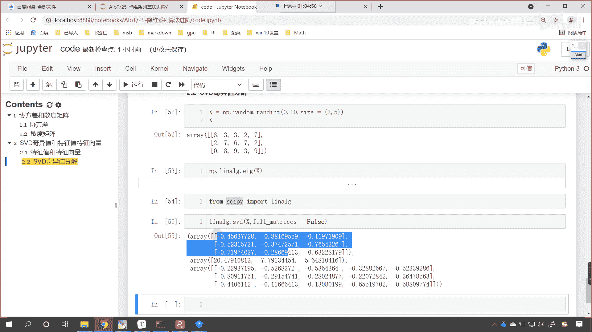

看到了吧，那得到的这组解相当于什么呢，啊咱们得到了这一组解。

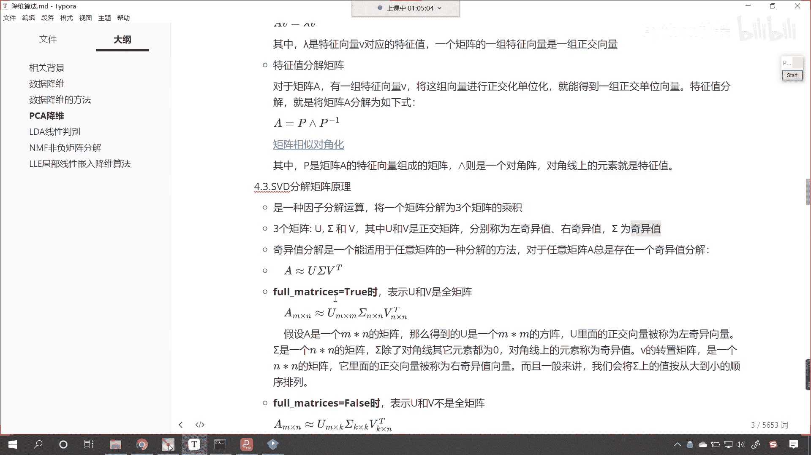

大家看它就相当于这个u西格玛和v。

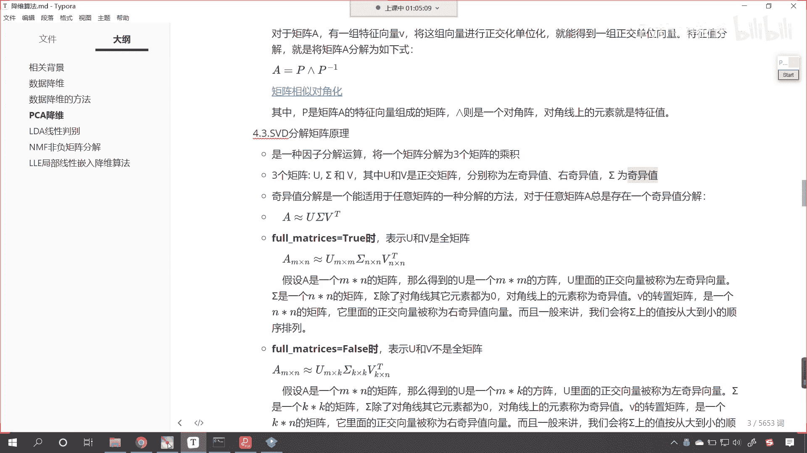

那我们就接收一下，好在这呢就是u逗号西格玛，然后v然后display显示一下u西格玛和v，我们的西格玛是什么，你在这儿能够看到中间的这个sigma呢，就是我们的特征值。

所以和咱们上面特征值特征向量分解进行对比，我们就能够发现，你看他是不是类似的呀。

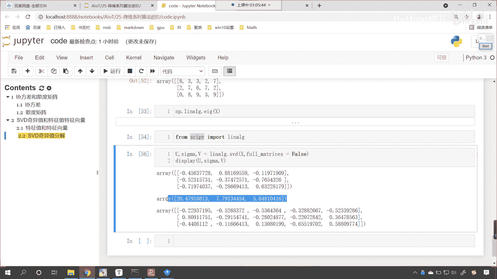

对不对，它是类似的，只不过咱们奇异值分解，我们把这个叫做左奇异值，然后呢右边这个右边这个v呢我们就叫做右起，一直中间这个中间这个呢是咱们的这个奇异值，其实这个奇异值呢就是咱们的嗯这个特征值好。

那么你看它有一个约等于的关系是吧，来咱们乘一乘啊。

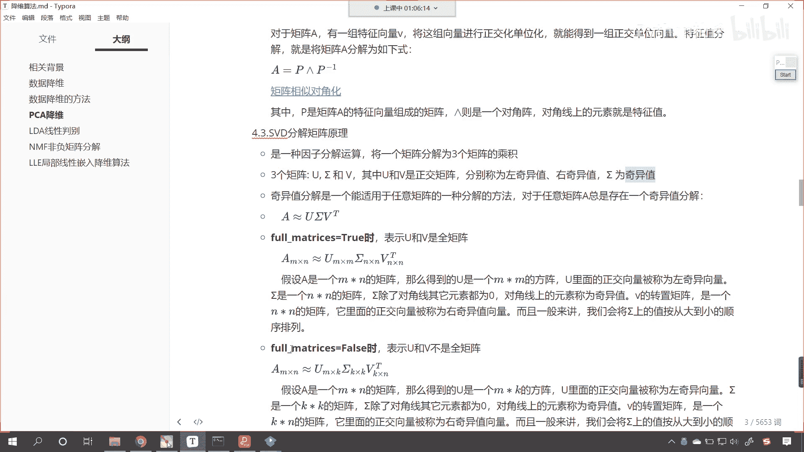

回到咱们的这个代码当中，咱们也进行一个矩阵的乘法上面，我们再进行矩阵乘法的时候，你看就是这一行乘出来的结果，和原来这个b是一模一样的，看到了吧，一模一样啊，那在这儿呢咱们也进行一个计算。

那就是左奇异优点dot，让左奇1x1下咱们的奇异值，如果我们要将奇异值直接放进去，这个时候你看求解出来的值，这个时候就不对啊，为什么呀，因为你中间这个是一个向量，而左边这个是不是一个嗯这个矩阵呀。

那向量和矩阵其实也能够进行乘法，但是呢咱们得调用把它转换一下np。e y e，它是三行三列，所以我们给个三，这个时候你看斜对角上，斜对角线上全是一，然后我们让他乘以咱们的西格玛，这个时候你看一执行。

斜对角线上是20。479，看20。479，第二个是7。7913，看7。7913，得到这个结果之后呢，咱们就叫西格玛杠e y e好，那么西格玛eye就有了，我们呢让咱们的u去乘以一下。

咱们的西格玛e y e，这个时候一执行，你看乘完这之后呢，然后呢咱们再来一个dot，把咱们的v放进去执行，看把咱们的v放进去，这个时候呢我们就会得到一个结果，咱们得到这个结果之后呢。

看咱们得到这个结果之后，和咱们上面这个数据我们进行一个对比，看到了83327是不是看到了吧，你看只不过下面咱们用了什么，是不是用了科学计数法来表示呀，看看到了吗，第一个是多少，是不是八。

第二个是不是三嗯，这个是不是也是三，你e的零次幂是不是就表示三呀，约等于为啥又约等于，你看这个地方有一个7。484，这是e的多少次幂，是不是-16次幂呀，看到了吧，这个是e的-16次幂。

那e的-16次幂，这个是不是就约等于零呀，而咱们上面我们随机创建的这个x，这个数是不是零，看到了吧，这个数是零，所以说无论是特征值特征向量分解，还是咱们的奇异值分解。

那我们是不是都可以根据它的求解出来的，奇异值特征值是不是在把原数据再表示出来呀。

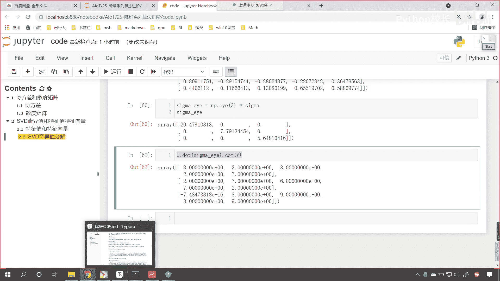

对不对，看到了吧。

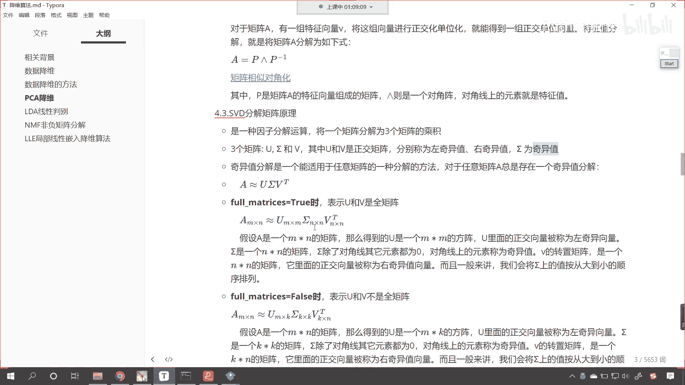

它都是这样的啊，现在各位小伙伴明确了吧，明白了吧。

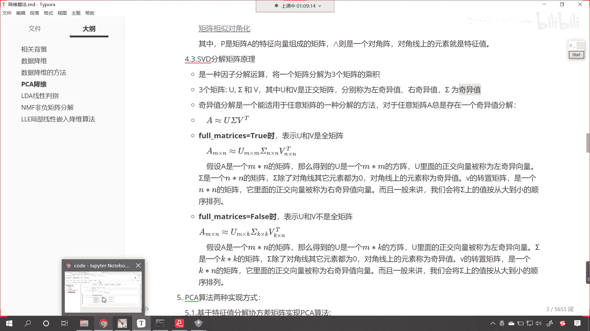

那我们看到咱们这个求解出来这个结果是吧，那还是相当精确的啊，因为我们上面所造的这个数字x这个矩阵x，我们给了一个rint，它呢是一个整数，如果要是小数的话，它就不是那么特别的精确了啊。

最起码你比如说零这个地方看到了吧，它就稍微有一点点差异，看到了吧，你看你这个是-7。484e的-16次幂，是不是好，那么到这里，各位小伙伴应该对我们的奇异值分解。

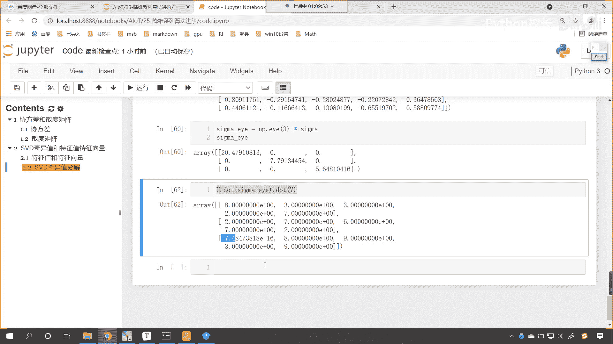

有概念上的一个认知了是吧。

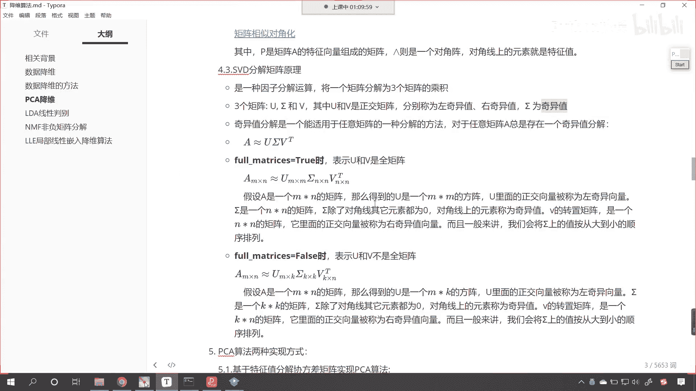

到现在你就明白这个奇异值分解，是怎么回事了吧，这p ca不是有两种实现方式吗。

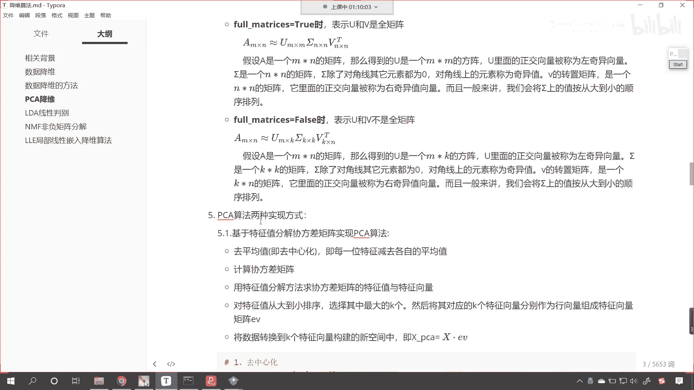

我们上一节课讲到了这个奇异值分解是吧，直接用，那么这个当中的这个第三步符号翻转，你要好好研究，今天我们所留的一个作业当中呢，就涉及到了符号翻转，好。

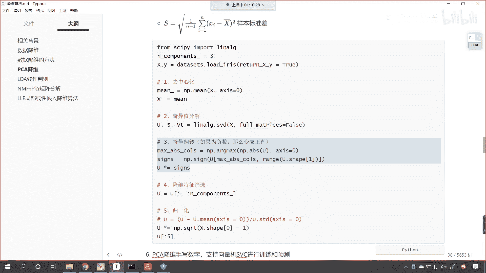