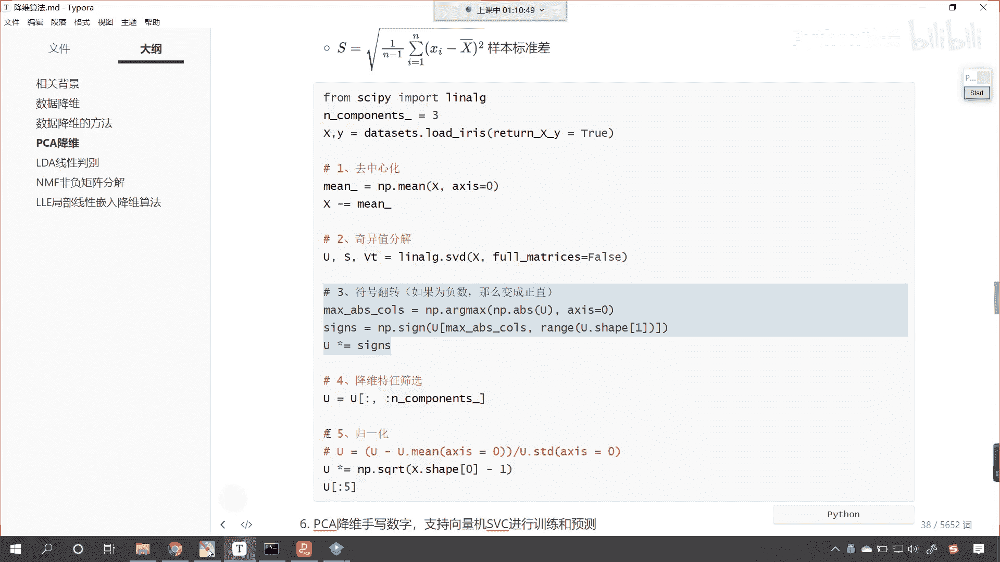
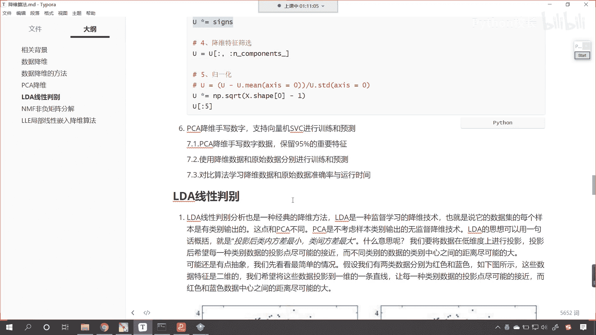
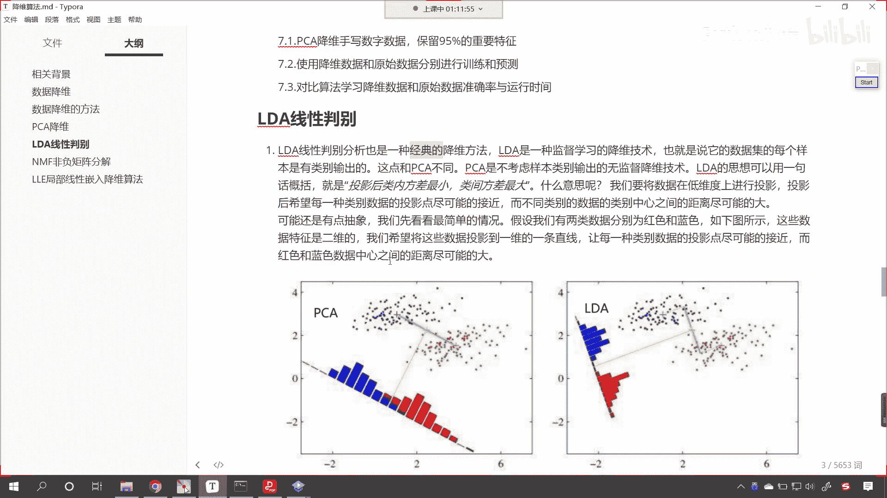
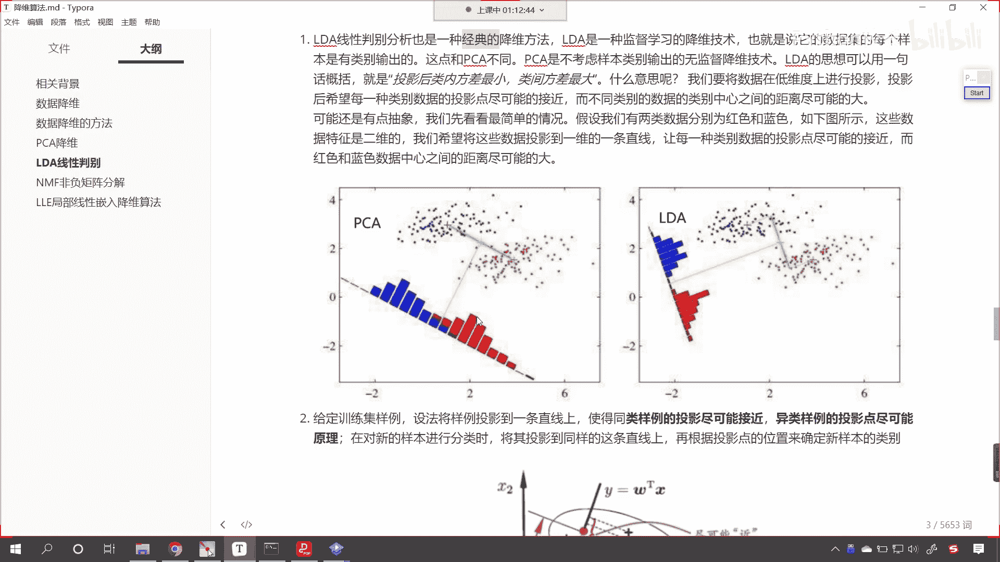
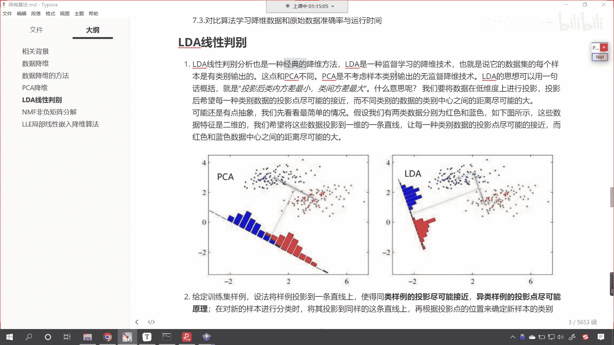
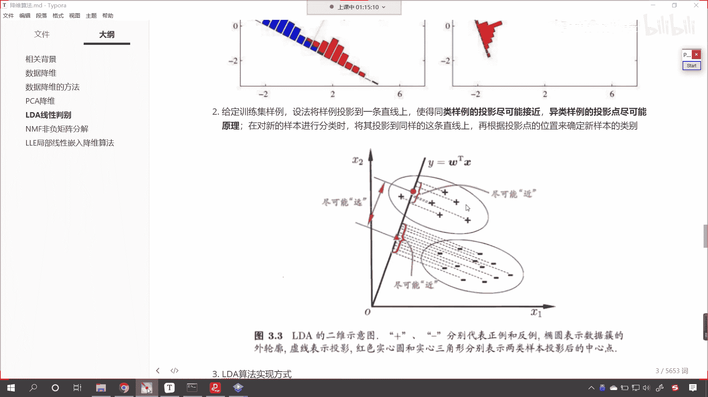
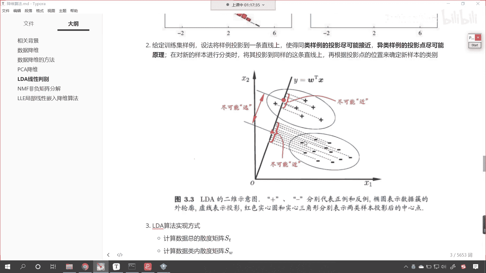
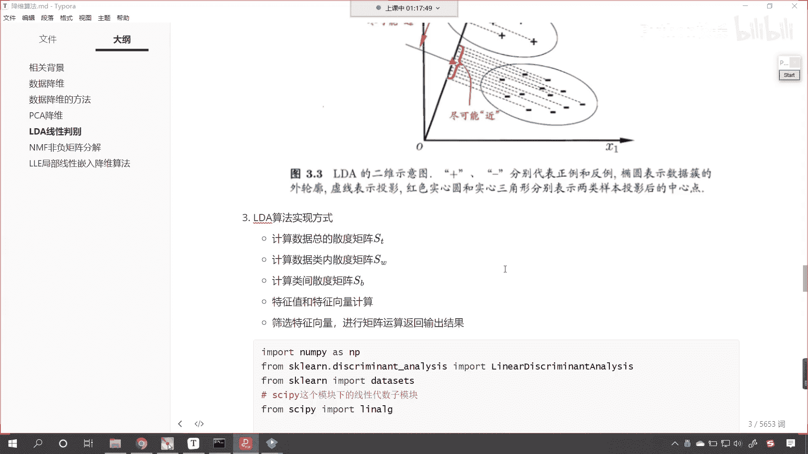

# P165：4-LDA算法原理 - 程序大本营 - BV1KL411z7WA

来各位小伙伴，接下来呢我们继续往下看啊。

好那么介绍完了pca降维，接下来呢我们就介绍一下lda线性判别。

那这个lda线性判别呢，他呢也是一种经典的降维方法，这lda呢是一种监督学习的降维技术，大家注意啊，这里呢是监督学习，如果有监督学习的话，是不是就必须得有x和y，也就是说它的数据集的每个样本。

都是有类别输出的。

这一点和咱们的pca是不同的，那pca是不考虑样本类别输出的，无监督降维技术，l d a的思想可以用一句话来概述来，来这个概括，那就是投影后我们类内的方差最小，肋间的方差最大，看什么意思呢。

现在你就能够看到左边这个图是p ca，右边这个图是l da，看到了吧，右边这个图，那我们pca降维呢就是一束光照过来，然后呢它在某一个维度上是不是有一个投影，这个投影是不是就将原来的数据由多变少了呀。

特征由多变少了，是不是，就像我们人在太阳下面有一个有一个影子是吧，原来的人呢是三维立体影子就变成二维了，简单多了，那你看p ca也一样，原来是点一兆是吧，在这个上面它就形成了蓝色的一个柱状的高度。

红色的一个柱状的高度，这个时候就用高度来表示原数据嗯，原来是一个点点的话，是横纵坐标，现在这个一个高度是吧。

那它它就是一维的，而l d a呢它呢也是找一个合适的角度，照过来之后呢，我们就可以得到我们让投影后内内的方差最小，肋间的方差最大，类内方差小说明它都聚到一块儿了，类间方差大说明他们离得远。

只有类内方差小是吧，凑到一块儿，肋间方差大比较远离，你想一下咱们的数据是不是就可以分得最开了，你就像我们同样的数据，使用l d a咱们得到的结果，你看左边的这个蓝色的和右边这个红色的。

它们分的是不是就比较开了呀，上面的pca你看分的是不是就有重叠的部分，这一部分就有重叠，是不是啊，当然大家呢不要根据这个图先入为主啊，其实呢pca是非常优秀的算法，我们之所以举例举这个图。

咱们呢是为了让各位看到，lda和pca之间的差异，并不是说lda比pca的效果就一定好，如果要好的话，如果lda一定比pca好，大家想一下以后我们是不是只用lda就行了，不用pca不就可以了吗。

为什么这两个算法都存在呢，那各有千秋，大家注意啊，各有千秋，我们画这个图呢，就是给各位描述一下同类后类内方差最小，类间方差最大，你也能够看到咱们投影之后得到的数据，你看这个蓝色的和这个蓝色谁更加聚集呢。

看到了吧，谁更加聚集，是不是lda更加聚集，他们是不是挨得近，挨得近，那就说明方差小，你的范围越大就说明范围越大，说明什么，是不是说明你就越离散啊，你越离散就说明方差就大，哎所以说这是l d a哎。

它的一个它的一个这个原理哈。

那现在你看我们还有一个图是吧，l d a呢2l d a的二维示意图，咱们呢你看这些加号是一类，减号是一类是吧，看咱们就找一束光，你想那一束光是不是有很多方向，是不是可以这样照，是不是也可以这样照。

我们是不是也可以沿着虚线的方向去照呀，对不对，那我们只要有一条光线照过来，你想就好比你的影子是吧，你不同的光照你的照，你的这个你在公园散步的时候是吧，有的时候你就发现走着走着，你的影子是不是就被拉长了。

当你走到啊路灯的正下方的时候，你的咬你的影子是不是最小呀，这就像l da一样是吧，我们希望有一束光把所有的这些点是吧，给他照的更加集中一些，这就像你在路灯正下方是吧，你的影子呢是不是就变成一个点了。

你的影子变成一个点，被你踩到了脚下，这个我们用一个说法是吧，唉就叫做尽可能的进，知道吧，这是尽可能的近，就是内内之间尽可能进咱们讨论区，stronger就说了，说这叫垂直投影，诶，你不要啊。

这个时候其实你啊把我刚才举的那个例子是吧，硬生生的套在了咱们这个数据上，其实你想我们的数据和我们的人，肯定是不一样的对吧，我们的人是一个我们的数据呢，是不是多累啊，对不对，既有加号，是不是有减号。

你不仅仅要考虑减号，同时是不是也也要考虑加号的相对位置呀，我们一束光照过来了，咱们不仅仅要照这个减号，同时是不是也要照这个加号呀，对不对，同时也要照这个加号再说了，我们现在看到的是二维的，那还有三维。

四维甚至更高维的数据呢，对不对，他呢都是要选择一个嗯，就是合适的一个角度去进行数据的映射，那映射完之后呢，咱们呢让看让这个促内的尽可能近，让这个醋和醋之间尽可能远，从而达到一个很好的一个效果和目的好。

那么原理咱们进行了介绍，接下来咱们呢就在代码当中，我们呢进行实际的操作一下哈，刚才这段视频，刚才这个知识点呢。

