# P166：5-LDA算法流程 - 程序大本营 - BV1KL411z7WA

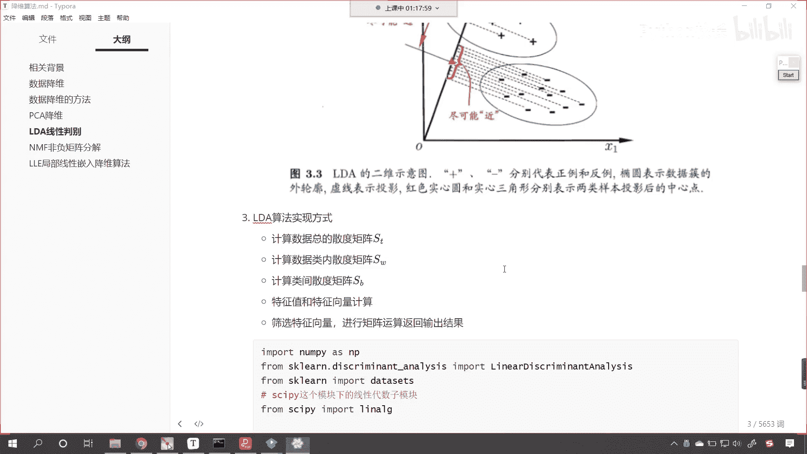

接下来我们呢在代码当中，咱们呢进行操作一下哈，那么lda算法的实现呢，我们要计算数据总的散度矩阵，计算是数据类内的散度矩阵，计算类间的散度矩阵，找到特征值，特征向量，筛选特征向量，然后进行矩阵运算。

返回咱们的一个输出结果，那咱们现在呢我们回到代码当中，咱们使用lda先进行特征的降维好不好。

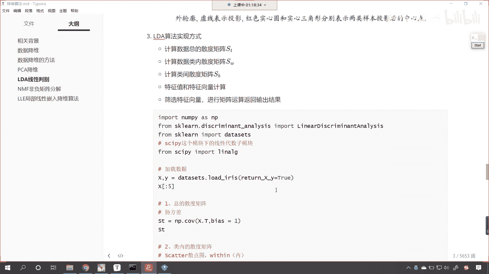

来回到咱们的代码当中，咱们在这儿呢来一个三级标题，这个呢就叫做lda算法的降维，在这儿大家要注意几点，我们的lda呢，它是不是有监督的一种降维算法呀对吧，那我们就从线性判别当中。

我们叫做disagree minent analysis，从这个当中呢，咱们就把linear discriminant analysis，我们给它导进来，然后from sklearn。

咱们import data sets，然后呢我们import numpy as np，然后呢我们from cp，我们从这个当中，咱们import线性代数的这个这个模块，执行一下代码。

首先呢咱们加载一下数据，那就是原为花数据，这个里边既有x又有y return，咱们给一个一一呢就表示true x和y，咱们接收一下嗯，这个时候呢咱们display一下x点，我们查看它的前五个冒号。

这个时候冒号来一个五。

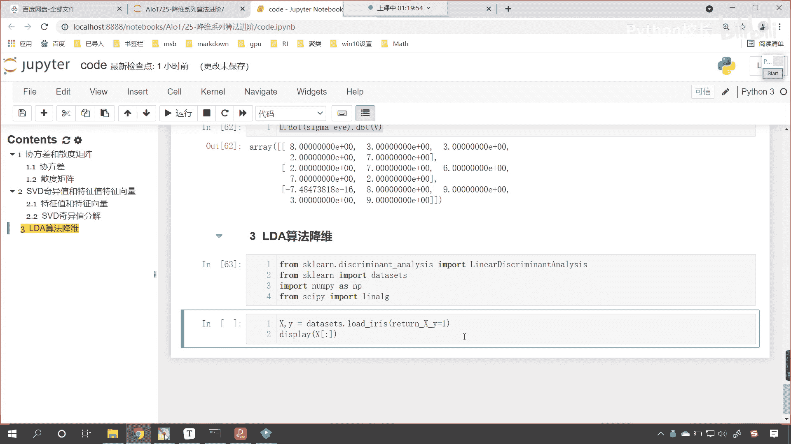

然后呢把y也输出一下，现在你看数据是不是就得到了，你看y当中是不是确实有类别，000001111222，是不是，这不就像咱们刚才在课件当中介绍的。

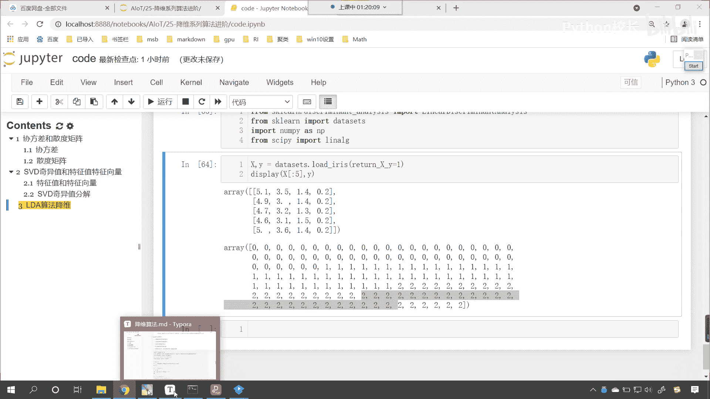

你看减号是一类，加号是一类。

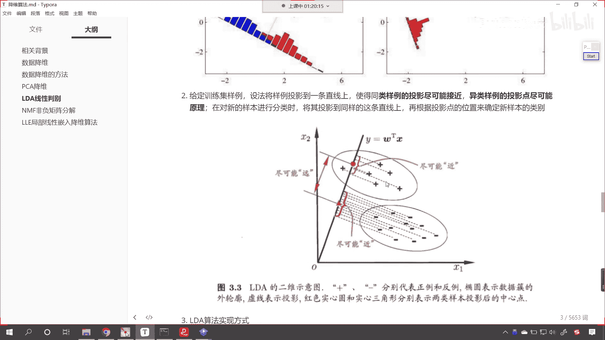

是不是，那咱们就首先声明一下这个l dl da呢，就等于linear discriminant，咱们呢就声明一下这个算法啊，shift tab诶，大家看啊，你看在这个地方。

咱们的server我们用的是什么，是不是就用的svd呀，看到了吧，这个server咱们用的就是这个这个s v d，那我们看一下啊，咱们这个server你看可以是什么，咱们是不是可以是s v d。

咱们是不是可以是a j呀，这个都是可以的啊，你看你这个server可以调这个agent，是不是特征值特征向量呀，对不对，你看这个a键就是咱们的特征值特征向量，那么在这儿呢我们可以给它调一下啊。

来一个单引号server s o l v e r，server就等于agent e i g e n，那表示呢我们在进行因式分解的时候，咱们呢使用特征值，特征向量来进行，唉来进行矩阵分解好，那么。

执行一下这个lda就有了，然后呢咱们就调用lda，我们点大家看这个里边有一个什么方法，是不是叫做fit transform呀，对不对好，那么我们先调用feat啊，大家看咱们fit里边有什么。

是不是就有x和y，对不对，你看就有x和y，那大家还记得咱pca降维吗，pca降维是不是只传x就行了，这个地方呢必须得传x和船和y，那我们将x和y放进去，那xy放进去之后。

然后呢咱们lda点调用它的transform方法，将x放进去得到的这个结果，接收一下叫x l d a，我们展示输出一下咱们的前五个数据，x下划线，lda中括号冒号，咱们查看它的前五个数据。

现在你能够发现，我们是不是就得到两列比较重要的数据呀，我们在声明线性判别的时候，诶，大家看啊，声明这个线性判别的时候，咱们server呢我们是可以进行这个筛选的，那这个里边有一个参数。

是不是叫做n components呀，这个n components咱们也可以进行选择，那pca呢上面呢咱们再将pca导进来，from sk learn decomposition import pca。

大家看啊，把pca导进来，我们在这儿呢使用一下pca，声明，pca就等于pca里边有一个参数叫n components，那我们给他一个三，那咱们就pca。feat x放进去，然后pca。

transform，将x放进去，然后中括号冒号，咱们查看它的前五个，你看pca是不是就降维了，如果这个n components我们给个二，你看是不是就是两个，那咱们线性判别呢，你看是不是也是一个意思呀。

n components如果我要给个二呢，你看它就是二，如果我要给个三呢，你看我一执行啊。

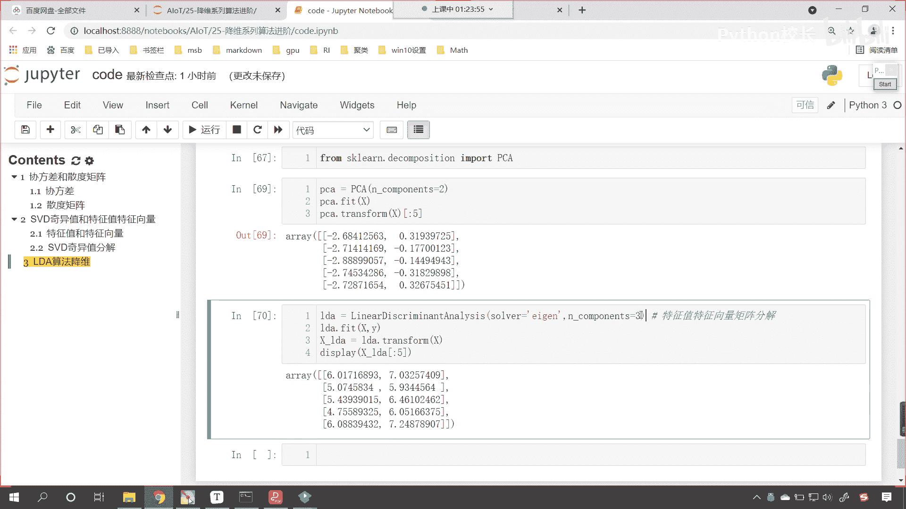

大家看啊，呃咱们n components呢有一个要求，是不是can't be larger than me，看到了than me，n feature，n class减一。

从这两个数当中是不是他得选一个呀，看到了吗，n feature我们原为花这个特征数据呢，它是四个，大家注意啊，你看n feature它是四，咱们的n class减一，我们分几类呀，咱们分三类。

那如果要分三类的话，3-1是不是就是二啊，那现在你就能够看到他对于这个是有要求的，也就是说呢我们从四和二当中选那个小，选那个什么呢，选那个小的。

也就是说你n components can't be larger，是不是就是不能比四和二当中这个小的大呀，看到了吗，count b拉着我们给了个三，咱们的三咱们的三是不是大于二啊，可以吗。

count不可以。

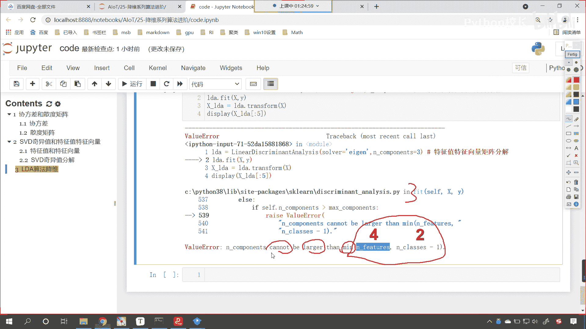

所以说你看这个时候我给三是不是就不行了，能不能给一呢。

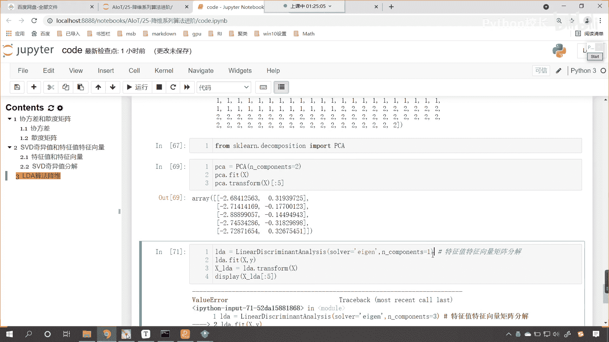

没问题，你看给一的话是不是可以能不能给二呢，也可以看到了吧。

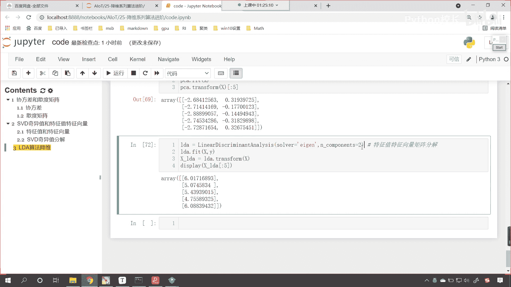

一直行好，那么你看p ca，你看你给几是不是都无所谓啊。

我们给三是不是无所谓，给二是不是无所谓对吧，因为计算方式是不一样的，上一讲呢我们介绍了pca计算是怎么回事。

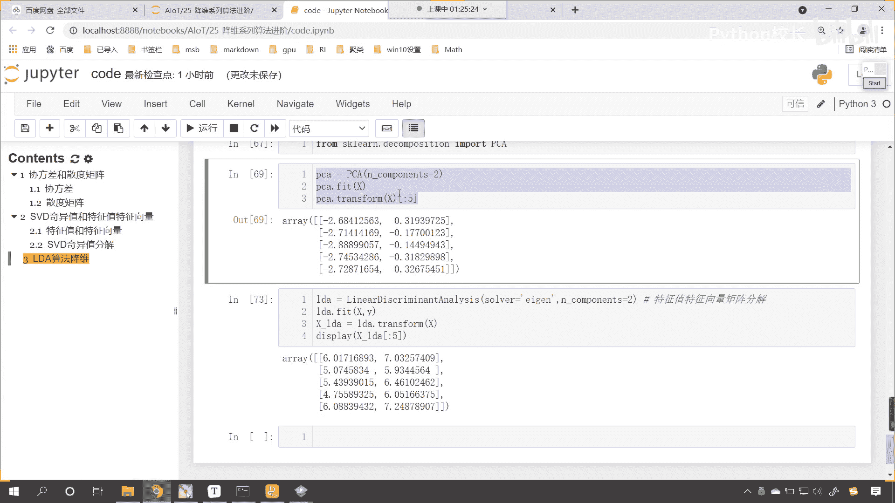

那这一讲呢咱们就看一下这l da，它到底是怎么把6。017，5。07计算出来的，那咱们就算一算，在这儿呢我们就进行代码具体的演示好，那么嗯嗯在这儿呢，咱们首先呢我们去计算一下总的散度矩阵，在这儿啊。

大家看啊，咱们来一个四级标题叫一杠是吧，咱们首先呢去计算咱们总的，散度矩阵好。

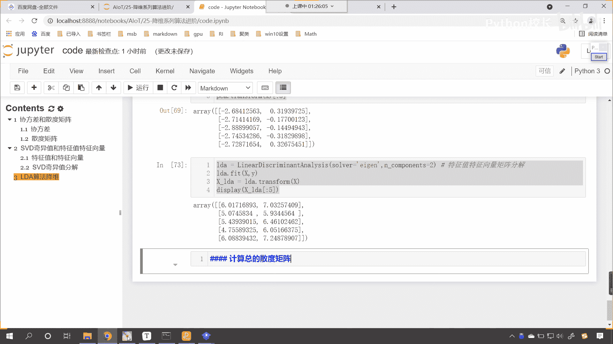

那么我们嗯刚才介绍了这个散度矩阵，其实和咱们的斜方差是不是有关系啊，对不对好，那其实呢我们就可以用斜方差来表示，咱们总的散度矩阵，那声明一下就叫s t就等于np。c o v好，来一个小括号。

我们将x咱们呢就将x放进去，然后呢给他一个bio啊，这个时候呢这个肉vr咱们呢让他等于false，然后呢bios我们让它等于一，那等于一呢就表示咱们在进行计算的时候，它呢其实是有一个偏差的。

这个偏差呢我们给它加了一，那为什么这个地方加一呢，其实你加一和不加一是吧啊，都能计算，那我们一会儿呢再来详细解释这个bios啊。

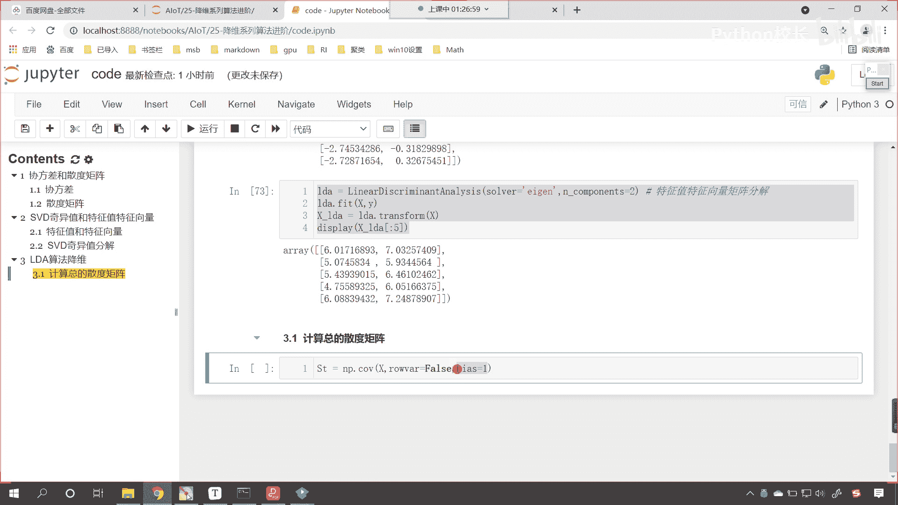

这个时候这个总的散度矩阵，咱们呢就计算出来了啊，这个就是计算总的散度矩阵，然后呢我们再计算类内的散度矩阵，接下来呢计算类内部看内内的散度矩阵。

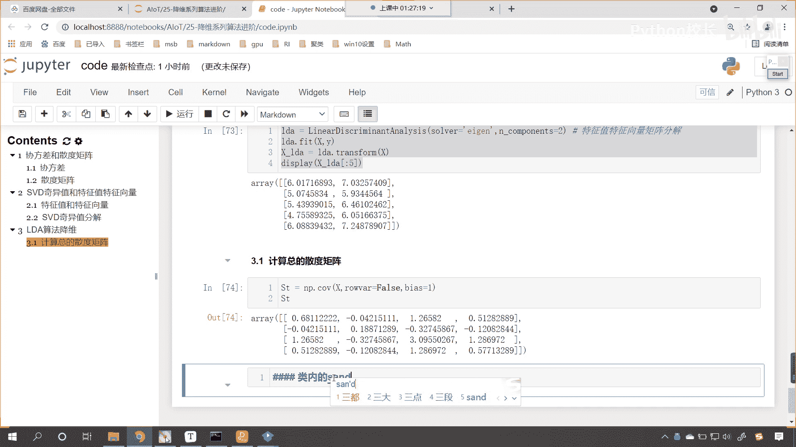

你看我们在进行训练的时候，我们为什么fit的时候给了个x。

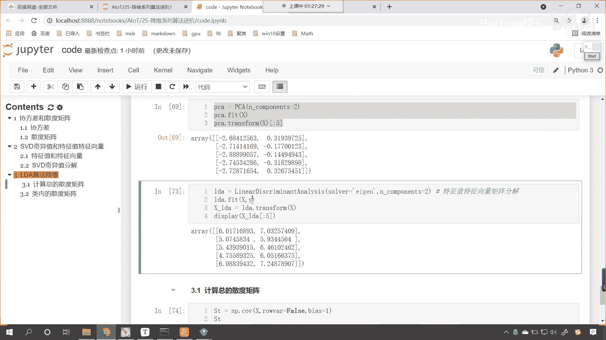

给了个y啊，不给y行不行，你看我一直行，是不是就报错了，上面那个pca只给x是不是就可以，下面这个不给y是不是不行是吧，必须得给y，因为这个pca因为这个l d a它是什么，它呢是有监督的降维算法。

对不对，你看必须得给外好。

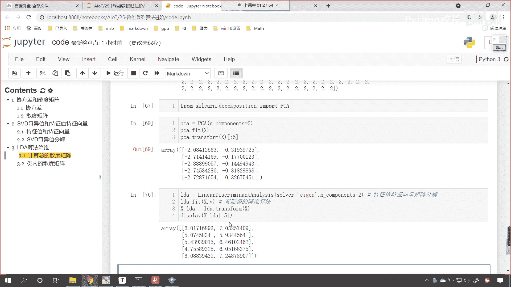

那么接下来呢我们就计算类内的散度矩阵，那么内内的散度矩阵呢，咱们先声明一个叫sw，看这个为什么叫做，上面为什么声明s t呢叫做scanner。

s c a t t e r叫scatter t o t a l total，那我们这个sw呢它呢其实也是一个缩写，s c a t t e r叫scatter with in within。

这个英语单词就表示内，那我们首先呢给他声明一个矩阵，我们就让它让它等于np点负f u l l，这个里边给他一个sheep，你看上面咱们所求得的总的散度矩阵，它是不是四行四列呀，对不对。

你看为啥它是四行四列呀，因为我们的原数据是不是四个特征，是不是四个属性呀，所以说求解出来就是四行四列，那这个地方呢也给它一个四和四，然后呢这个few value给他个零。

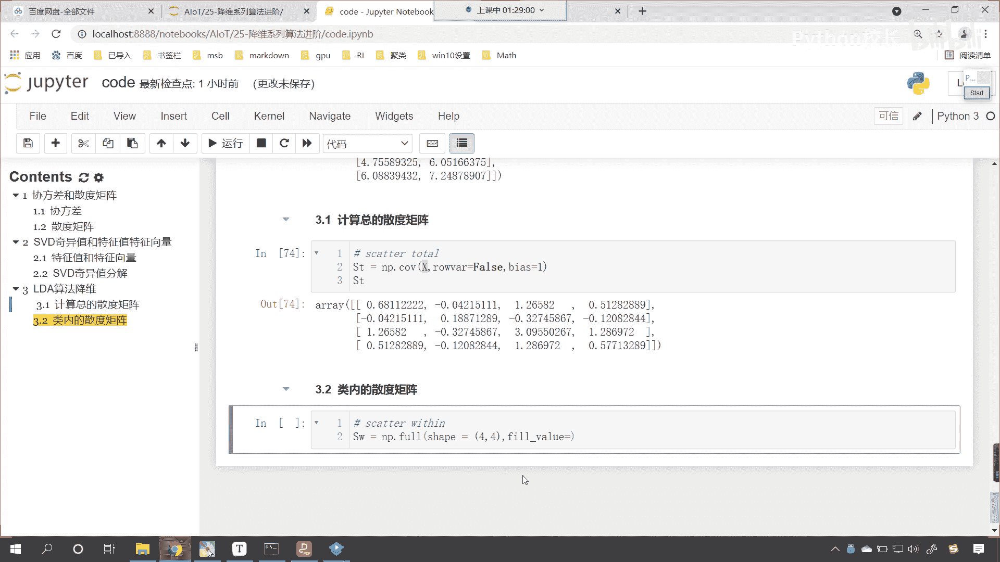

这个时候你能够看到这个sw，它的结果其实就是全是零，也就是说我还没算呢，对不对，接下来咱们就开始具体的计算，咱们呢就来一个for循环，for i in range，我给个三，为什么给个三。

你看咱们上面的y它是分几类的，是不是012，它分三类呀，对不对好，所以咱们for循环，我们呢是range 3，那得到的结果其实呢就是012，然后呢我们得到嗯内内的点，那就是x咱们根据y等等i来进行筛选。

你看y等等i是不是筛选条件，根据这个条件是不是从x当中取数据，那取出来这个数据，是不是就是就是这个内内的点呀，我们起个名就叫做x w啊，看在这儿呢咱们对它进行一个说明，那这就是一类点儿。

看这就是一类点儿，有了这一类点，这一类点呢也叫做类内，看就是你那有了这一类点，咱们接下来呢我们进行一个计算啊，那继续去计算它的散度矩阵，散度矩阵我们又可以使用咱们的cv斜方差。

这个时候呢咱们就将x w放进去，肉vr我们给它设置一个false，然后呢这个bias偏差咱们也给他个一，这个时候你看是不是就计算出来了，那么计算出来之后，这个就是内内的散度矩阵。

那你看上面咱们是不是用sw来接收了一下，对吧，s w一开始全是零，对不对，那我们给它进行一个加法，那就是sw我们让它加等，把每一类的内内的散度矩阵唉，都给它记录到咱们的sw当中，这个时候你看我一直行好。

我们看一下啊，呃咱们这个时候报了一个错是吧，嗯咱们的这个呃数据是不是形状不太对呀，肉vr等于false，bus等于一呃，我看一下啊，看一下咱们是哪个地方给报错了，四和四，few value等于零。

s w加等np。cv是吧，我们不能使用哦，这个时候你看报了个什么错，是不是报了咱们数据类型不太一样呀，唉那这个没关系啊，来咱们再创建散度矩阵的时候，类内散度矩阵的时候，咱们给他声明一下数据类型。

那我们这个data type呢，咱们就让它等于np。float f l o a t，让它是float 64位。

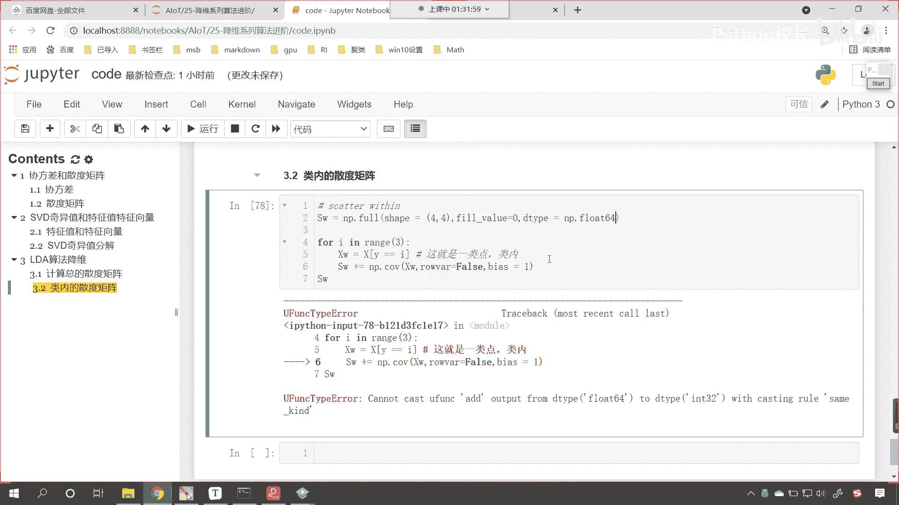

现在再来执行，现在各位小伙伴你就能够看到，此时咱们是不是就计算出来了。

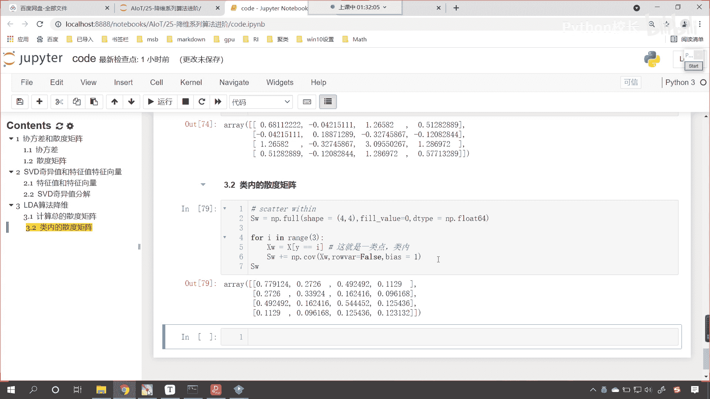

内内的散度矩阵好，那么有了内内的散度矩阵，咱们接下来呢计算类间的散度矩阵，你看在这儿呢。

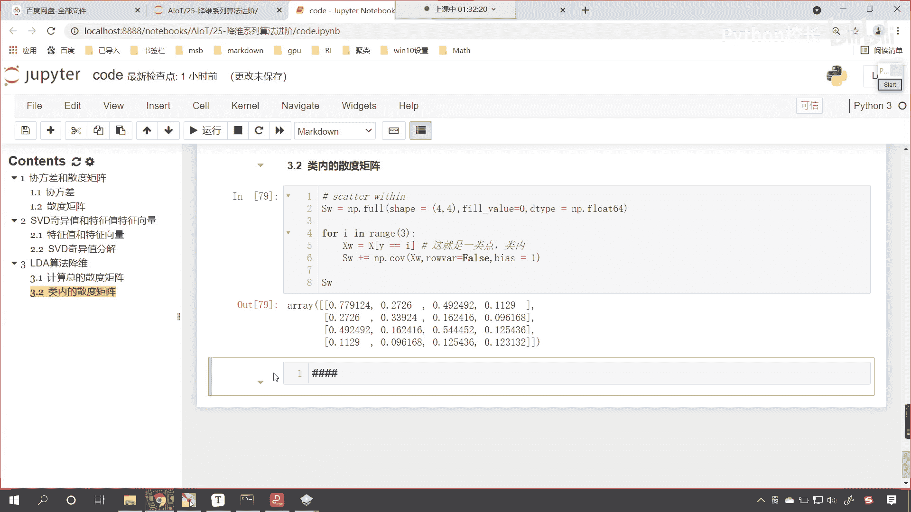

我们再多说一嘴啊，为什么我们要计算类间的呢，你看课件当中说了。

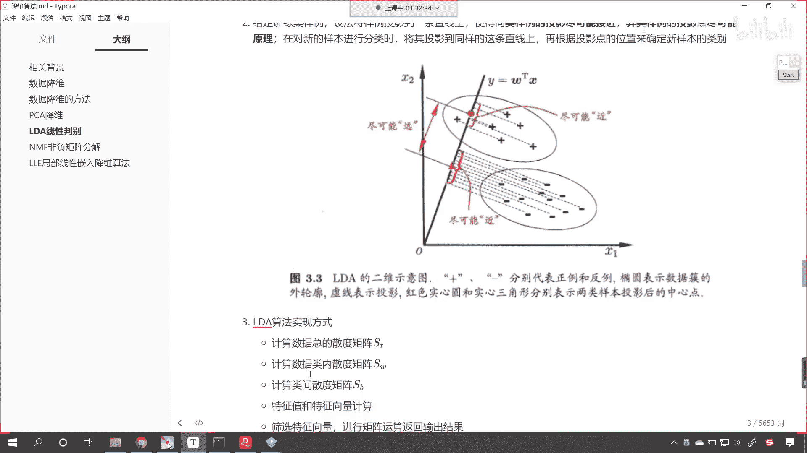

我们希望怎么样内内的尽可能尽。

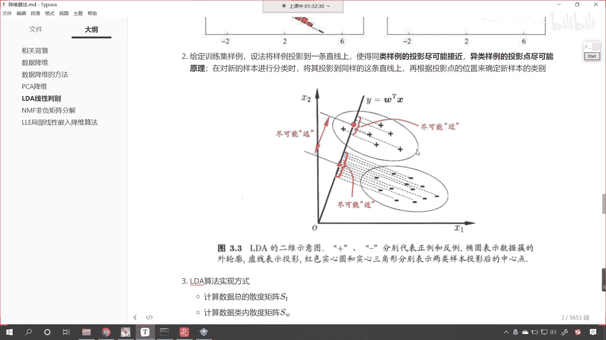

肋间的是不是尽可能远呀，所以这个时候咱们要计算什么，咱们要计算，肋间的，散度矩阵好，那么我们就计算一下吧，那这个就叫s b就等于s t，我们让它减去sw，那这个时候呢我们把sb输出一下好。

那你看这个sb它是哪个英语单词的缩写呢，scanner比between b e t w e e n是吧，between呢就是之间执行一下这个代码，你看计算出来了好，那么计算出来之后呢。

接下来我们再来一个四级标题，咱们呢就去计算特征值和特征向量啊，此时呢咱们就计算特征值和特征向量。

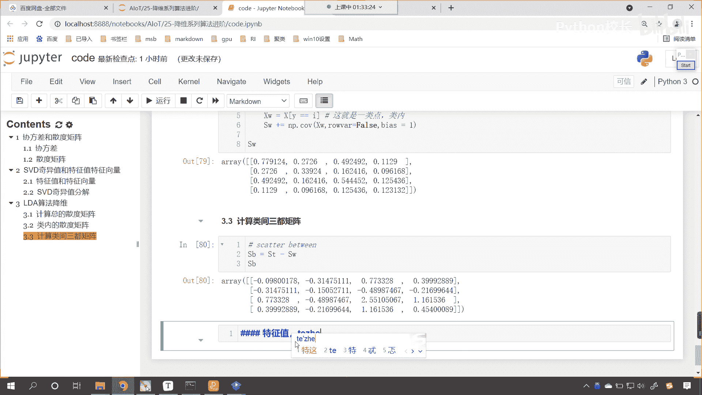

那我们就使用咱们从cp当中导包导进来的，这个线性代数模块，叫lina l g，调用它里边的方法叫a j h，这个a证h呢会为我们进行排序，那咱们就将肋间的散度矩阵放进去，然后内内的散度矩阵放进去。

那这个时候呢我们就会得到，大家看就会得到一个a证，a证是特征值，得到一个1v1 v是特征向量，在这儿呢给大家display一下啊，看咱们来一个display。

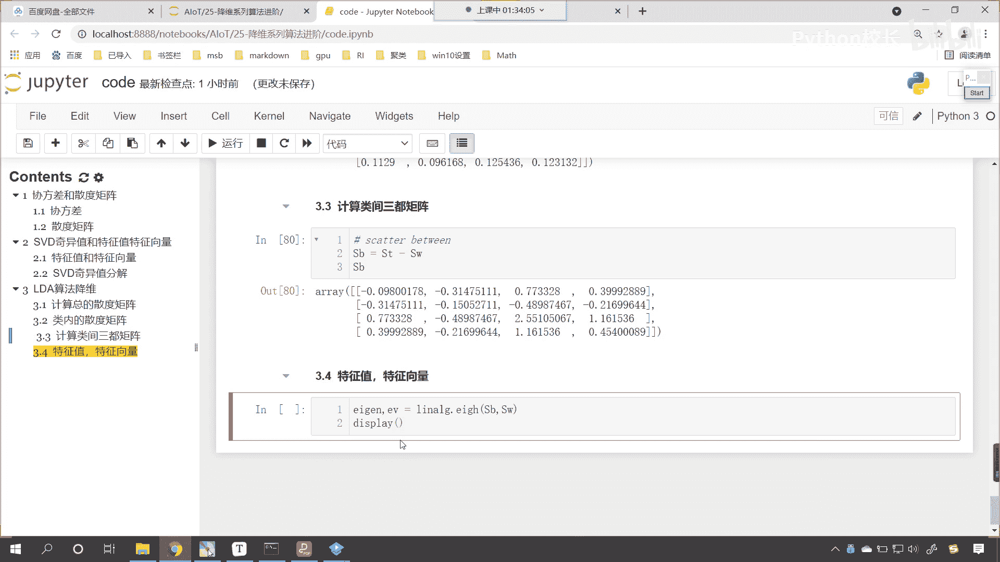

咱们将a键放进去，1v放进去，这个时候你看我一直行，我们是不是就会得到相应的这个数据呀，是不是有了这个相应的数据啊。

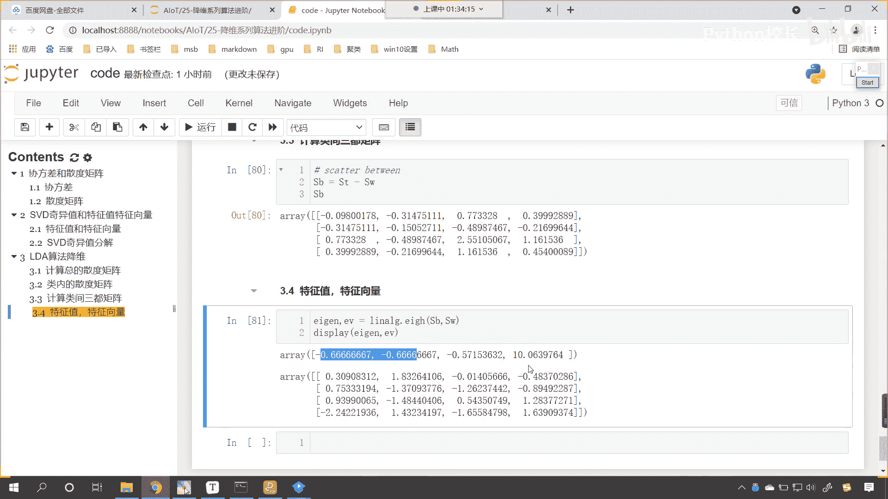

咱们接下来呢我们对它进行一个，咱们对它进行一个操作，你看咱们这个数据是不是从小到大呀，看到了负的0。66，负的0。66，然后负的0。5，最后这个是不是10。063呀，看他是从小到大。

如果我我们要把这个h去掉呢。

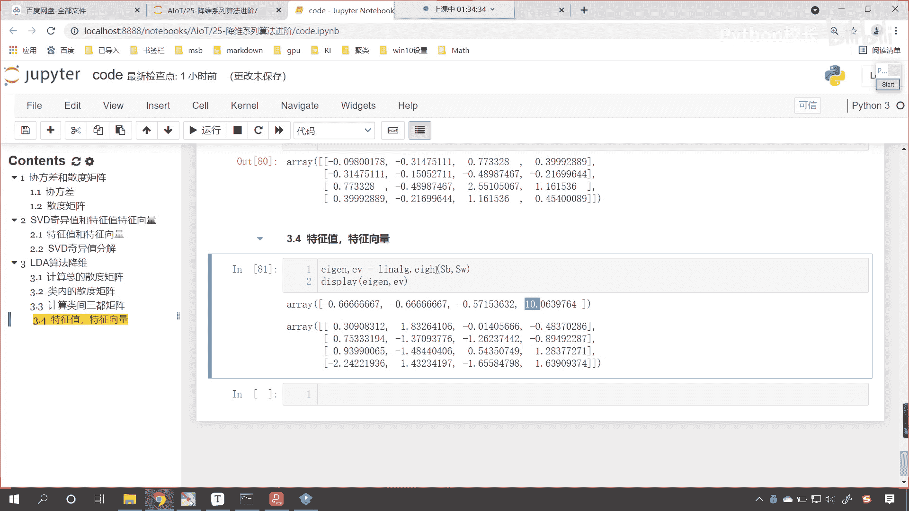

你看我一直行，看咱们如果要把h去掉，大家看这个是不是看10。063，负的0。57，你看它是不是就是一个颠倒呀对吧，所以说你用哪个方法都行啊，我们如果说咱们要用h让他从小到大，那么它就没有这个零记了。

那这个0g表示什么，它表示虚数，什么是虚数呀，那虚数和实数是相对的，那我们二的平方等于四是吧，那我们四一开平方是不是就是正-2呀，那如果说我们给一个-4，那如果想要把-4进行开平方。

得到的这个结果是多少，是不是没有一个实数和它对应呀。

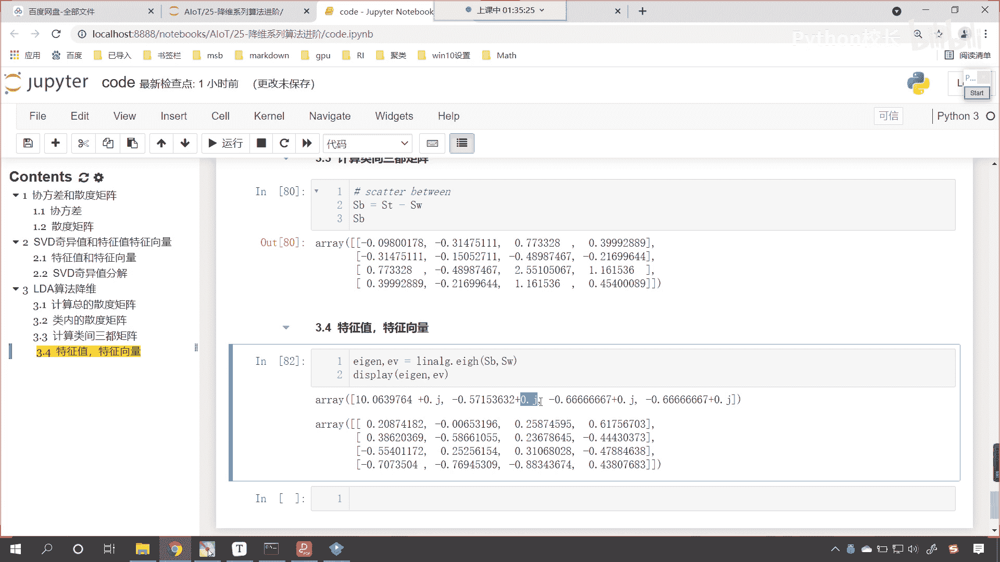

这个时候就用虚数来表示好，那么咱们用这个e g h，这个时候呢从小到大进行了一个排序，然后呢我们对于ev咱们进行一个操作啊，咱们对它进行一个排序好，那么我们对特征向量进行排序，那就是e v。

咱们呢就来一个中括号，冒号冒号呢就表示它所有的行，接下来呢我们对它的嗯列来进行排序，那这个时候就是np点，咱们就调用r salt，那我们就调用arsalt，咱们呢就对于咱们的这个特征值。

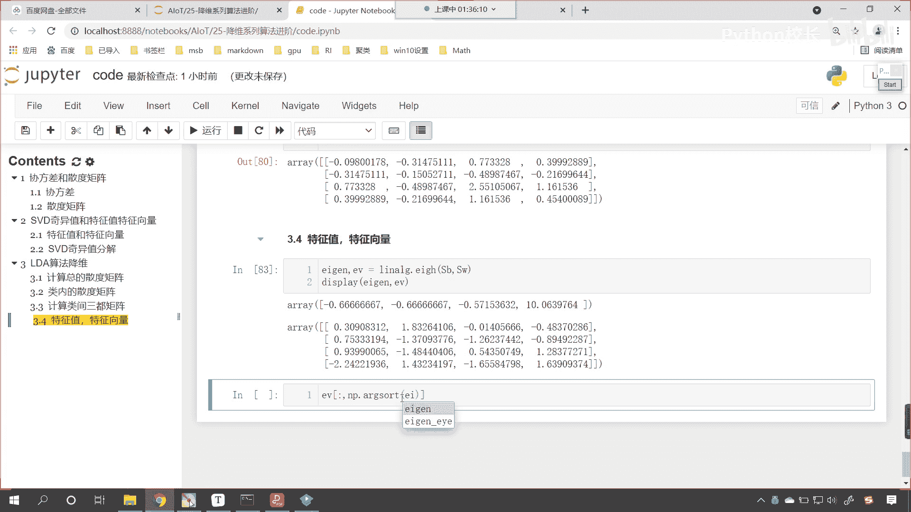

来进行一个这个操作，你看啊，这个时候你看我一执行，大家看咱们得到的结果是不是还是还是他呀，对吧，不变是吧，所以说这个排序呢没有必要了啊，因为我们上面得到的数据是从小到大啊，现在呢咱们冒号冒号。

我们来一个-1哎，这个时候你看此时咱们你看得到的结果，大家看它是大家看它是什么样的，你看此时咱们得到的结果，原来第一行是不是这个0。3，现在咱们的现在咱们的第一行是不是变成负的，2。24了。

我们是不是把它的列进行了一个颠倒呀对吧，这个时候呢，咱们就对于咱们就对于行进行了一个颠倒啊，对于行进行颠倒之后呢，然后中括号冒号冒号，咱们切片到二，看此时咱们呢就切片到二，那么我切片到二之后。

表示是不是窃取它的前两列呀，对不对，你看此时是不是就表示切它的前两列，看这个时候没问题吧，那我为什么要切它的前两列呢。

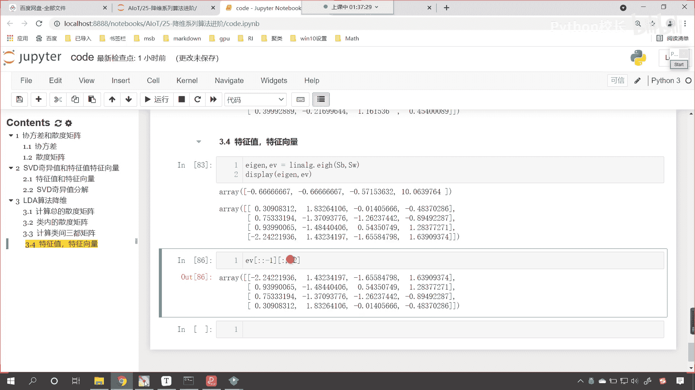

因为上面咱们使用。

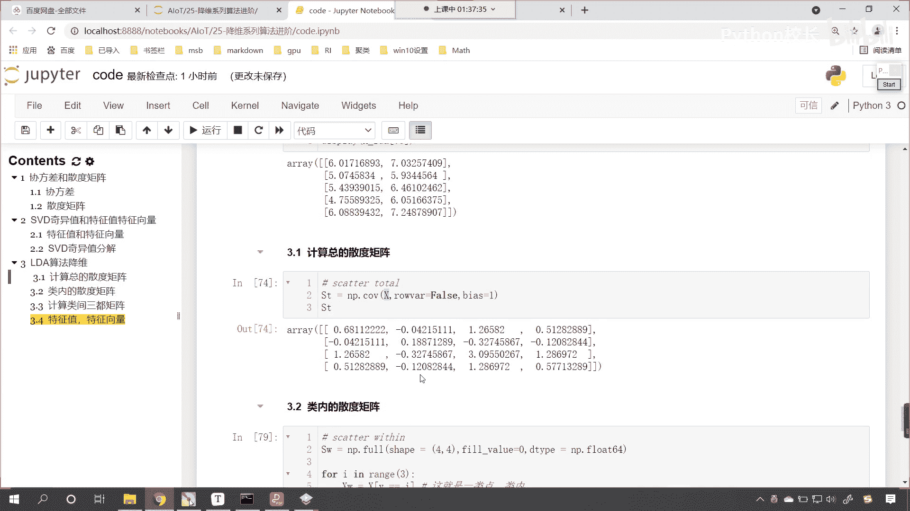

下面咱们使用lda进行计算的时候。

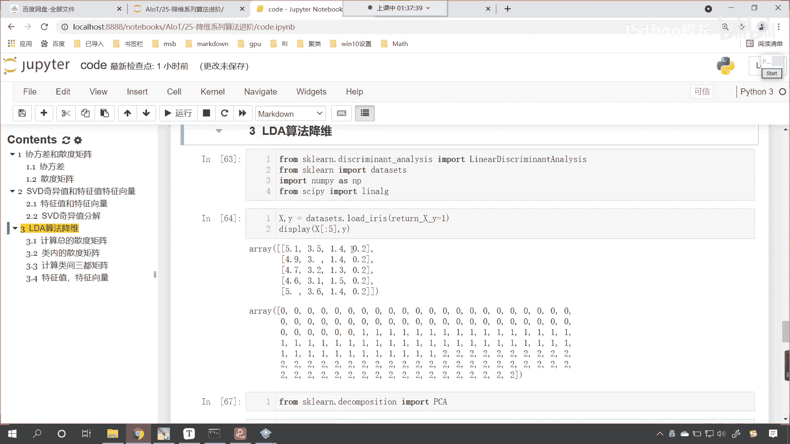

你看我们返回的结果是不是只有两列呀，对不对，你看它也只有两列，我们为了告诉各位小伙伴，这个6。0171是怎么算的，7。0325是怎么算的。

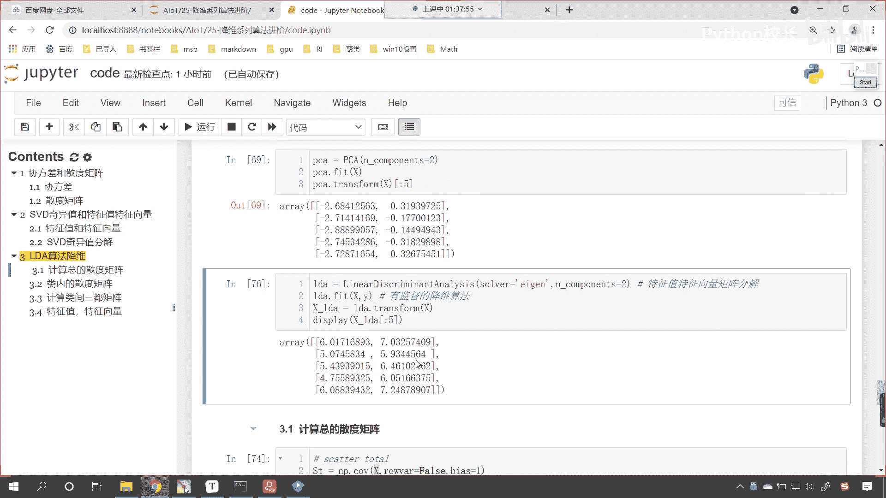

所以呢我们在进行切片的时候，咱们呢也切他的，也切它的前两列，那么接收一下，咱们呢就用ev来表示，输出一下咱们的ev这个数据就有了。

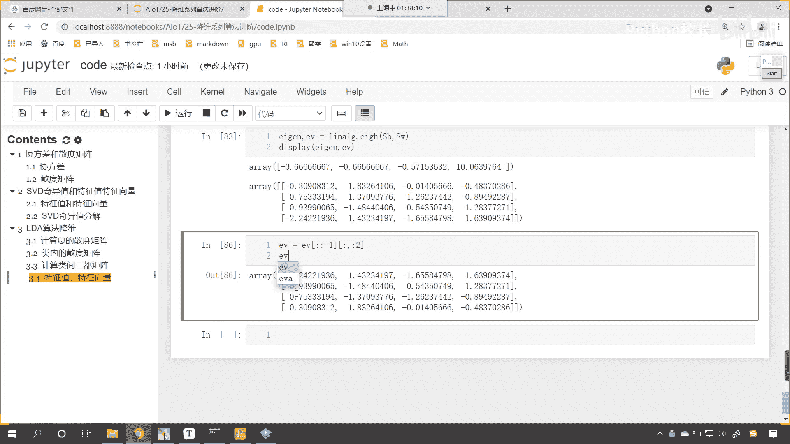

有了这个数据之后呢，咱们再来一个四级标题，那么我们对于特征向量进行了筛选啊，上面的井号注释一下，这个呢就是筛选特征向量，有了特征向量，咱们接下来呢就可以进行矩阵运算了。

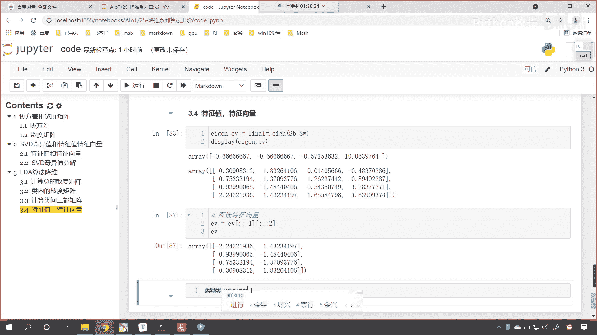

那我们就用原数据x咱们呢进行一个乘法，那就是x。dot，咱们将ev放进去，就是筛选之后的特征向量冒号，查看它的前五个啊，此时呢咱们就会得到一个结果啊，此时咱们就会得到一个结果，咱们得到的这个结果呢。

唉各位小伙伴就能够看到，我们得到的这个这个结果，是不是这个不太对呀，大家看得到这个结果不太对啊，和咱们原来的数据叫x下划线lda冒号，我们查看它的前五个，看这个前五个是不是66。017啊，是不是7。

032啊，那我们按说计算出来的结果，也应该是6。017，但是现在咱们求解出来的结果不太对是吧，那一定是咱们在进行特征向量筛选的时候，我们呢出了一点问题，那这个时候呢咱们就排查一下啊。

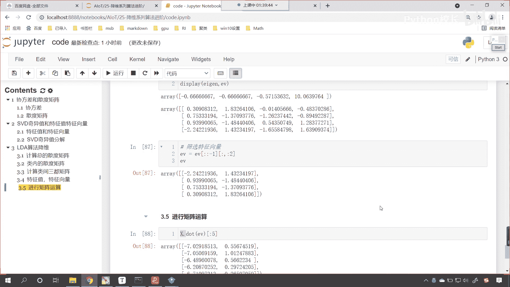

来各位小伙伴，咱们一起进行一个排查，我们呢对待咱们呢，对它进行一个这个操作和转变啊，那么我们筛选特征向量的时候，我们是不是咱们将它的这个行，进行了一个操作呀，大家看啊。

嗯这个时候呢呃我们对它进行一个这个转变好，那么大家看后两个是不是最大的，看到了吧，后两个是最大的，所以说呢我们就筛选哪里呀，咱们就筛选后两个，特征向量和特征值所对应的特征向量。

那么后两个特征值所对应的特征向量，是不是就是它呢，那这个时候咱们切片儿，我们是不是就不能从二不能切到二了，咱们从二是不是开始切，对不对啊，是不是啊，两个啊。

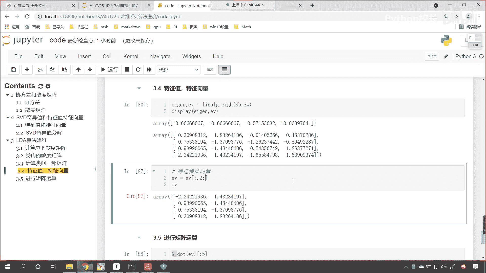

我们先来操作啊，上面333杠四特征值特征向量我们再次执行，执行之后呢。

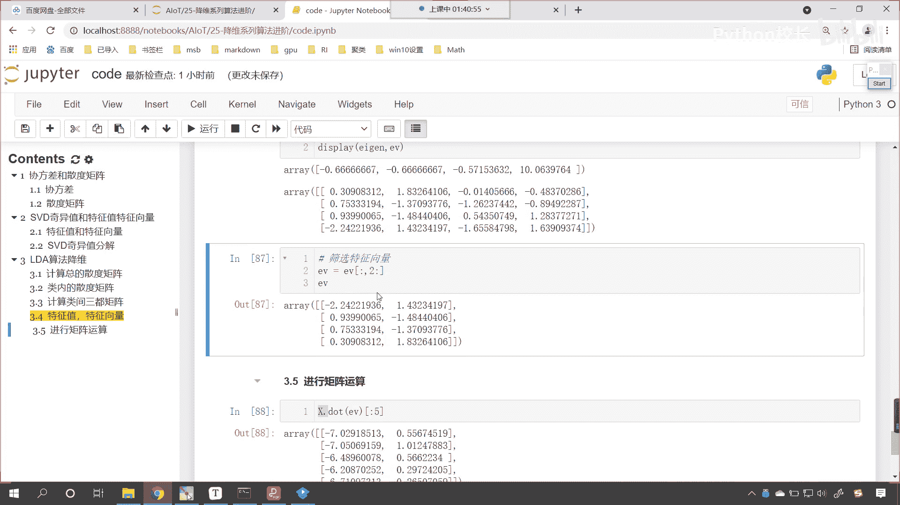

咱们进行筛选，筛选之后呢，我们进行运算，大家看啊，呃咱们运算得到的结果依然是不太对，是不是依然是不太对，那是因为呃，那是因为咱们这个求解得到的这个ev，我们的特征向量呢需要进行一个转化。

那我们根据它的特征值的这个顺序，咱们呢对它进行一个转换啊，咱们来一个来一个中括号，这个时候呢我们先看转化的这个效果啊，那冒号这个时候呢就表示行不动，我们对它所有的力来进行一个操作。

咱们调用arsalt这个函数，咱们将咱们的agent，这个就是咱们的特征值进行一个排序，排完序之后呢，冒号冒号，咱们来一个-1，那我们一排序其实是从小到大，排序是从小到大来一个-1的话。

那么它就是从大到小，这个时候给各位看一下，大家现在就能够看到，你看咱们的结果是不是就变成了0。48，负的0。01，你能够发现规律是什么样的，你看也就是说最后一列，现在是不是就变成第一列了。

看到了最后一列就变成第一列了，倒数第二列是不是就变成咱们的第二列了，因为我们进行了一个怎样的操作，在这个地方咱们是不是进行了冒号冒号-1，冒号冒号-1是不是就进行颠倒，对不对。

然后呢咱们再次进行特征向量的筛选，冒号行不动，冒号切到二，这个时候你看我一直行，其实是不是前两列对吧，那我们接收一下，咱们这个就叫e v，好那么得到了ev之后。

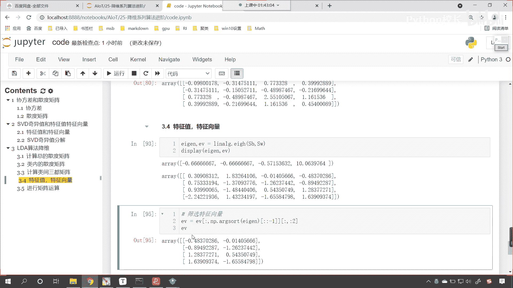

咱们紧接着就进行咱们的这个，进行矩阵运算，这个时候你看我一执行，大家看咱们得到的结果是不是依然不对呀，看到了吧，得到的结果依然不对，那么此时呢我们就进行一个去中心化啊。

此时呢我们进行一个去中心化的操作是吧，因为我们没有对数据x是不是，进行去中心化的操作，对不对，所以说呢这个时候咱们对数据x，我们呢也进行一个这个操作，因为这个时候啊，大家看咱们进行的这个斜方差操作呢。

嗯我们求的是这个st咱们的这个roll呢，大家看它是false啊，这个时候呢我把它变成，我把它变成true啊，变成true之后呢，啊这个地方变成x t是吧，大家看这个得到的结果和原来是不是一样呀。

因为大家对比一下啊。

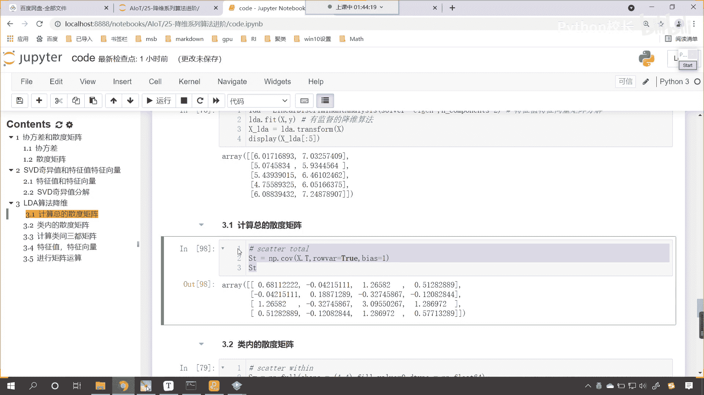

啊ctrl c我们在下面插入一行ctrl v，如果要是没有t，咱们把它变成false，看执行看0。68负的0。4，你看上面是true true的话，我们这个地方看如果要是true的话。

咱们这个地方是不是就变成了x。t呀，如果要是false，咱们是不是直接传到x呀，那得到的这个散度矩阵是不是一模一样，对不对，得到的这个散度矩阵它是一模一样的。

然后呢我们进行内内的散度矩阵，咱们现在呢看一下啊。

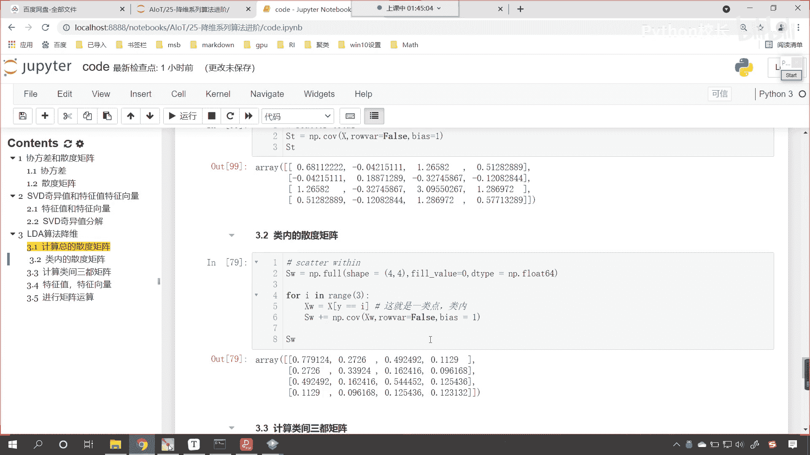

咱们这个数据呢和lda求解得到的结果。

稍微有点不一样是吧，咱们再来执行一下啊，然后计算咱们肋肋间的这个散度矩阵，好把这个3d呢我们叫散度矩阵，那我们只讲一下，这个是求解出来的一个结果，此时呢我们就进行特征值和特征向量的计算。

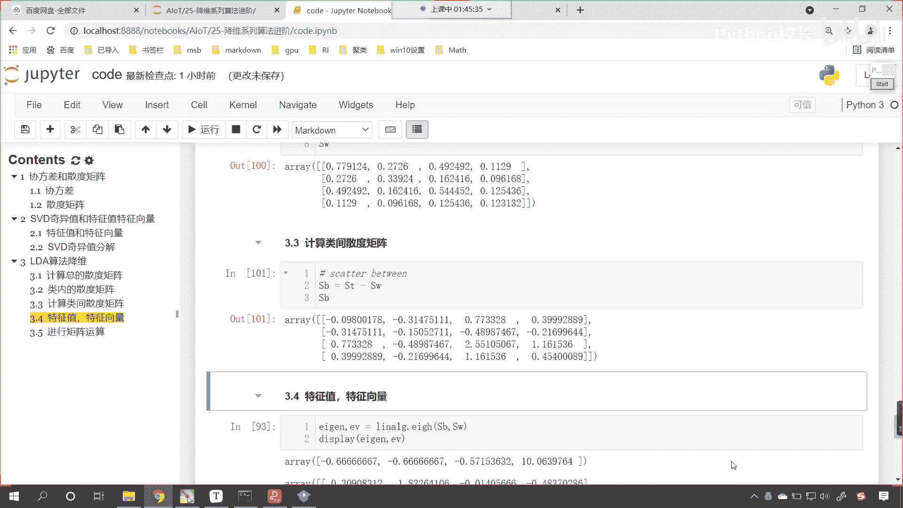

咱们将sb放进去，sw放进去。

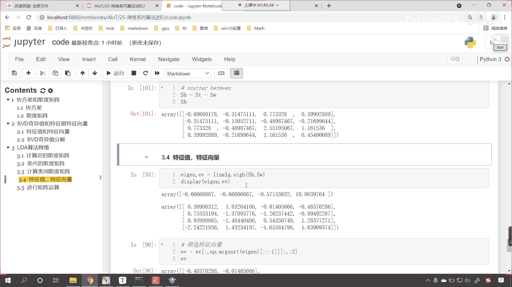

进行相应的一个求解，求解完之后呢，我们再进行特征值，特征向量的一个筛选。

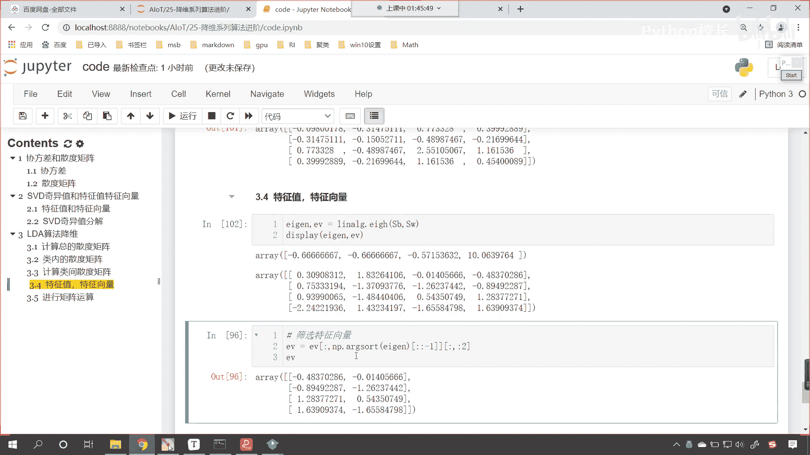

执行一下，然后呢再进行矩阵的运算，好那么进行矩阵的运算得到的结果是负的，3。47是吧，这个是4。06，和咱们计算lda得到的结果确实不一样，是不是没关系啊，l d a点咱们获取它的这个呃。

咱们获取他的cover ions啊，大家看这个得到的结果是不是，0。259708呀。

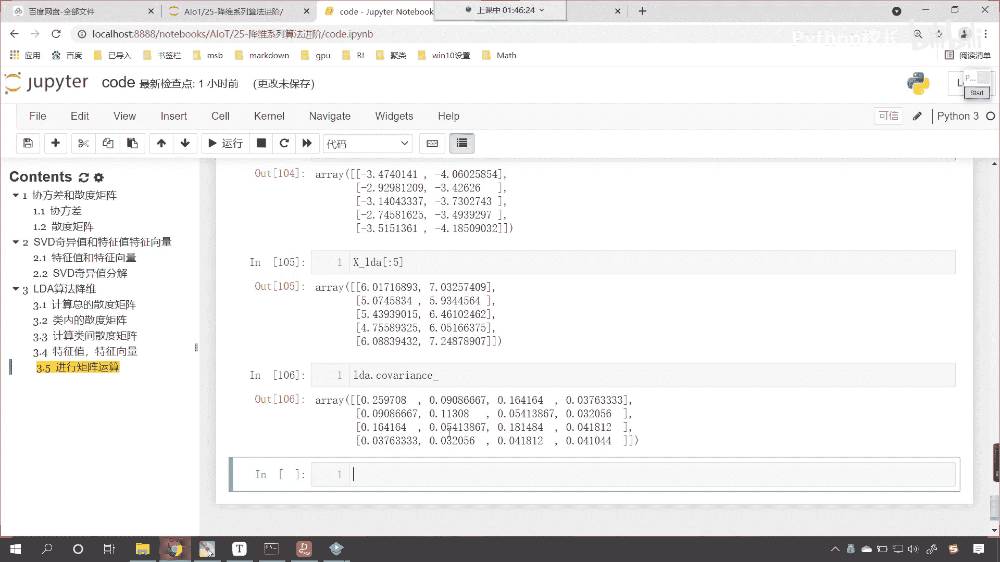

和咱们上面计算出来的，大家看是不是不太一样呀。

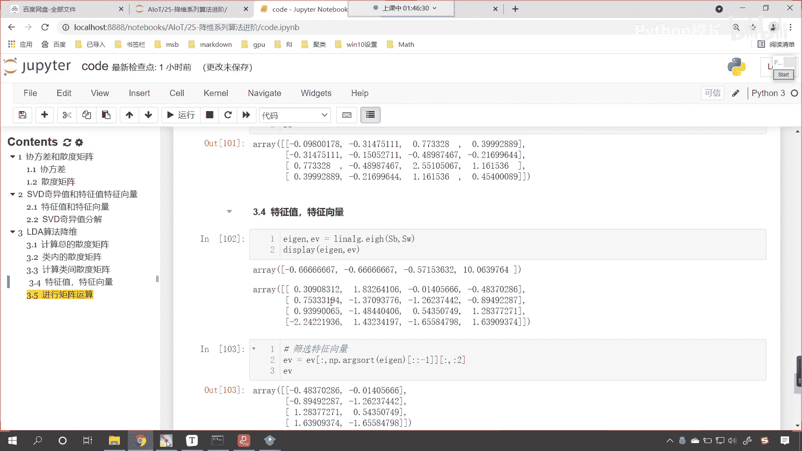

啊我们对比一下啊，这个是不一样的，然后我们再从lda算法当中呃，咱们再得到它的一些，再得到它的一些参数，咱们呢对比一下，transform，看一下他的explain，大家看啊。

我们lda explain varratio是不是0。99，这个是不是0。0087呀，那这个explain worriritual。

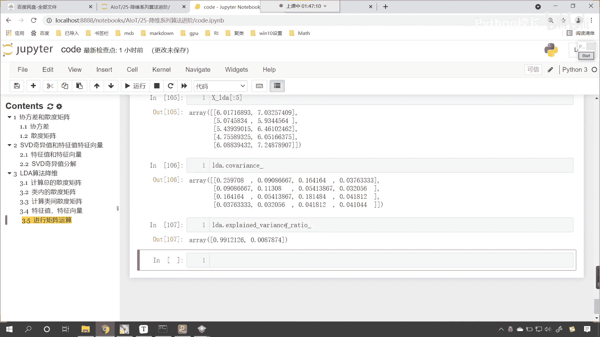

而我们计算出来的是多少，我们计算出来的是不是10。063，负的0。57呀，那这就是我们和他的差距。

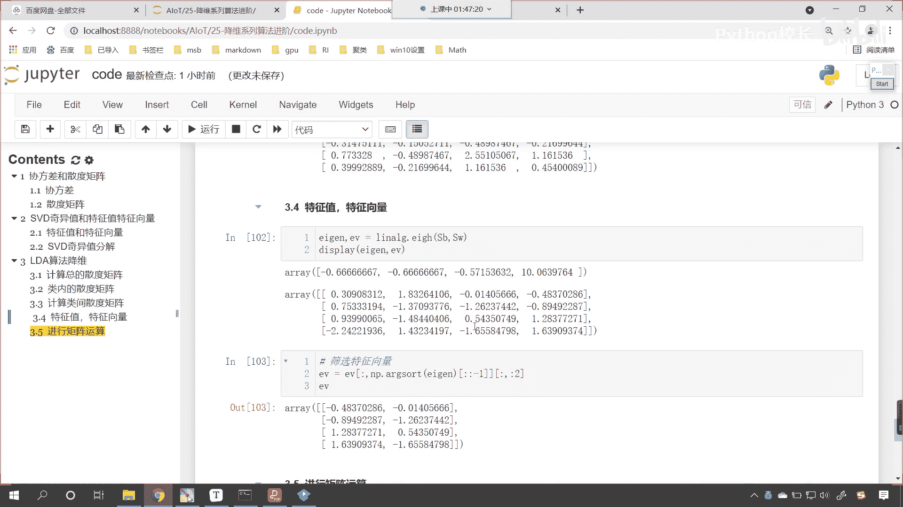

那现在呢我们将数据调整一下，咱们在计算总的散度矩阵之前插入一行，我们呢首先进行一个去中心化，在这儿呢咱们来一个去中心化好，那么x就等咱们去中心化，x减去x点密，给它一个轴，我们让它等于零。

那么去中心化之后得到的这个数据呢，咱们就叫b你看去中心化之后，我们看一下这个b长什么样啊，一直行，这个就是去中心化之后的数据。

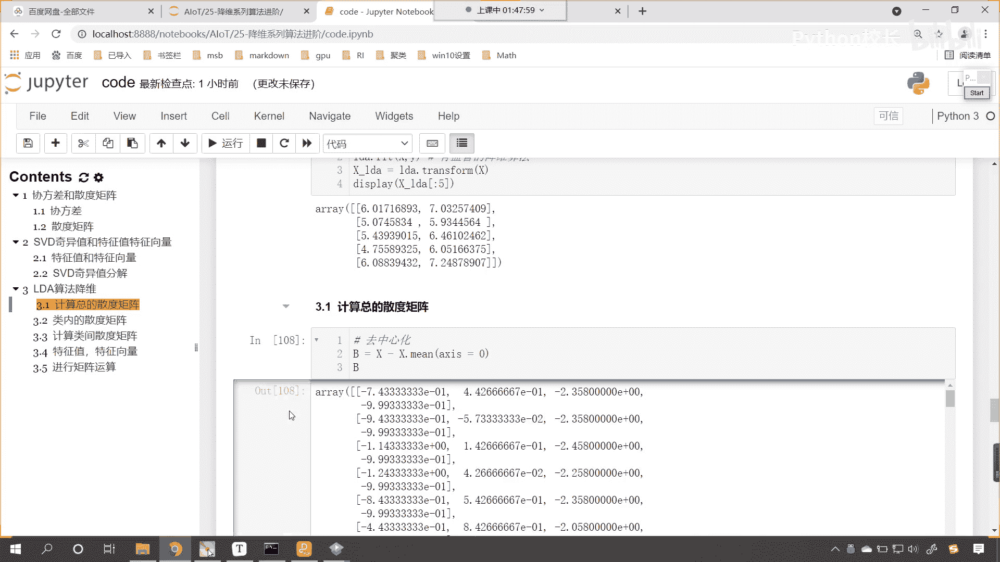

然后呢我们去计算它的这个散度矩阵，那么这个时候咱们就不用原始数据x了，咱把b放进去来，这个时候你看我一执行唉，这个数据就有了好，那么有了这个数据之后呢，咱们紧接着再继续往下算。

我们在计算咱们嗯这个内内的散度矩阵，那内内的散度矩阵，咱们这个地方也用b啊啊执行一下。

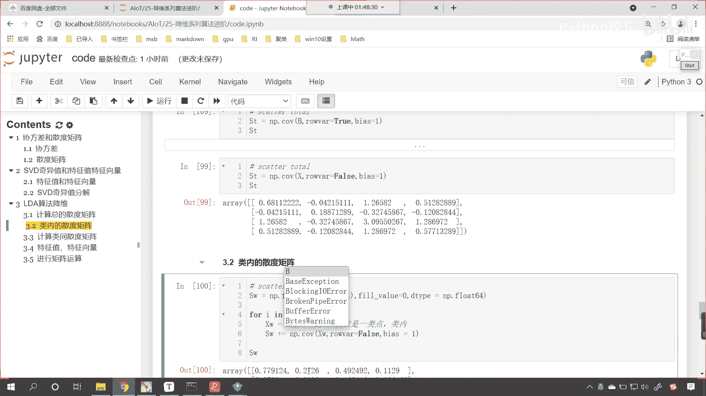

呃这个时候大家看啊，我们都换成了，咱们都换成了b，然后接下来呢我们进行一个减法呃，呃大家呃我看一下啊。

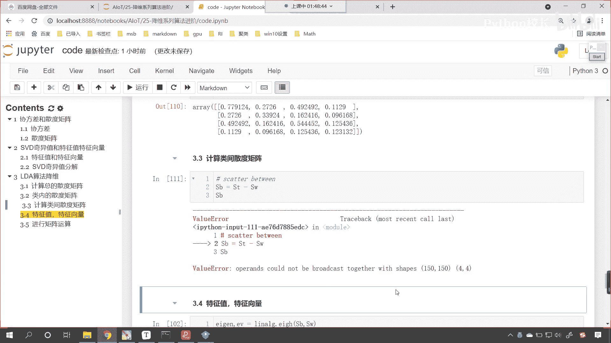

s st和sw嗯，咱们看一下，咱们没有对应上。

couldn't这个broadcast 150呃，我们看一下咱们的s t是多少啊啊这个时候。

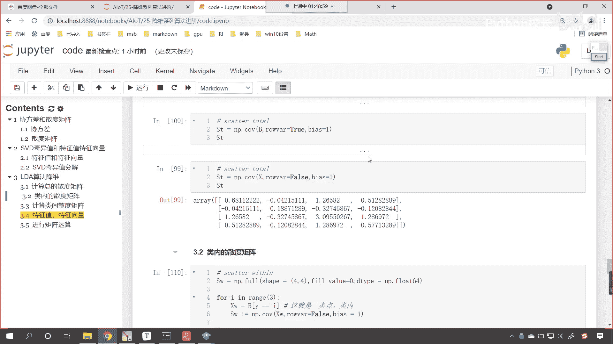

cv x，我们给了b之后呢，咱们这个b呢依然是154，那肯定是咱们这个地方是吧，这个参数给错了，那如果要是true的话，是不是就表示计算啊，那这个b你想在这块是不是应该给一个转置呀。


哎执行一下，这个时候大家看你看它是不是就变换过来了好。


那么变换过来之后呢，我们再进行肋间的散度矩阵。


这个时候就没问题了，然后呢咱们计算特征值和特征向量啊，计算特征值特征向量这个时候依然没变是吧啊。


然后进行特征值特征向量的筛选，然后呢咱们再进行计算，我们把b放进去执行一下，诶大家看啊，呃这个时候呢，咱们依然没有计算出来一个呃，对应的这个结果啊，那我们再回到咱们的课件当中啊。


咱们看一下l d a算法的实现过程呢，呃它首先呢是计算总的散度矩阵，然后计算数据数据类内的散度矩阵，然后呢计算类间的散度矩阵，最后呢是特征值，特征向量的计算。


最后呢是呃嗯筛选咱们的特征向量。


并进行矩阵运算，返回咱们的数据，对不对好，那么我们呢肯定是某一个地方。


咱们在进行操作的时候是吧。


肯定是不太对，来咱们再回到代码当中，我们再进行一个调整啊。


咱往上走，咱们找到咱们lda降降维这个地方。


你看我们在这儿是不是给了一个server呀，现在我们将这个server先去掉，我们使用默认的，咱们算一下，看咱们得到的结果是多少啊，这个时候如果说我们使用默认的，咱们得到的结果是不是8。06啊。


对不对，然后呢我们去中心化是吧，去中心化之后呢，咱们去计算它的嗯这个总的散度矩阵，那我们无论是上面这种方法计算，还是下边这种方法计算，结果都是一样的，大家看0。68负的0。04，1。26是吧。

然后呢咱们再计算内内的散度矩阵，这个地方我们都已经换成b了。


执行一下好，那么这个结果也出来了，那么有了这个结果之后呢。


咱们继续往下看。


然后再计算类间的，那就是总的减去内内的执行一下。


这个是咱们得到的结果，最后呢我们计算特征值和特征向量，特征值特征向量，我们发现这个没有变化，是不是，那我们我看一下是不是这个顺序给调错了sw，然后咱们来一个sb，这个时候还不行是吧。

ctrl z一下回退一下，执行一下。


然后呢我们再去根据咱们的特征向量，咱们进行一个筛选，筛选出来之后，这个就是咱们的特征向量，有了这个特征向量之后，然后呢我们去进行计算，不太对，是不是啊，我们把这个b呢给它换成x啊，执行一下原始数据呢。

大家看他是八点多是吧，好那么咱们这个呢就稍微有一个疑问啊，大家看我们这就稍微有一个疑问，咱们看一下咱们l d a是吧，这个线性判别咱们去获得它的。

看看咱们去获得lda的explain varia ratio，他是0。99，第二个呢是0。087，那在这儿呢咱们解释一下这两个参数啊，其实这两个参数就对应着。


咱们所计算出来的这个特征值，我们发现咱们所计算出来这个特征值。


和他所计算出来这个特征值，是不是有一定的偏差呀。

那我们整体的这个计算顺序没有变。


肯定是这个顺序，但是现在呢我发现这个代码在计算的过程当中，某一个地方是吧，出现了小小的问题，咱们这个呢先遗留一下啊。


整个过程的顺序是这样的，那我们会在作业当中会把这个这个疑问呢，给大家解决掉啊，好那么我们l d a算法的这个降维呢。


啊咱们就先讲到这儿，那么它的整个顺序我们总结一下，就是计算总的散度矩阵。


计算类内的散度矩阵，计算类间的散度矩阵。


然后根据上面计算的散度矩阵，我们求特征值特征向量。


求完特征值特征向量之后呢，接下来就进行矩阵运算，我们就可以得到答案了，但是我们计算出来的答案，是不是和使用lda得到的答案，是不是稍微有点不一样呀，对吧，这个疑问呢。

