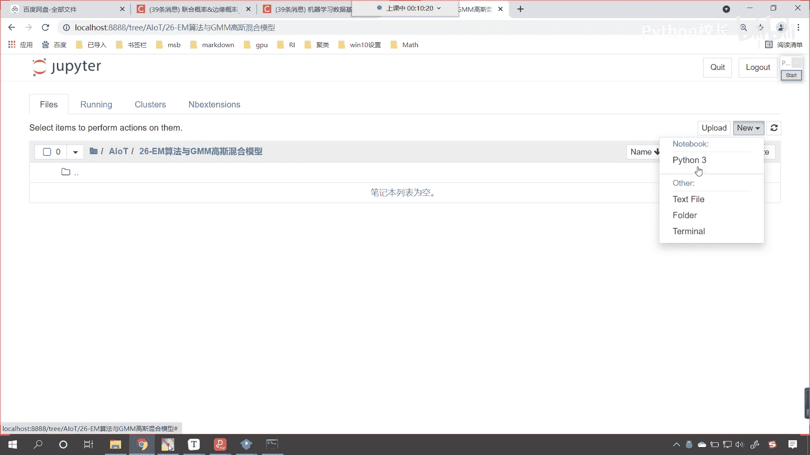
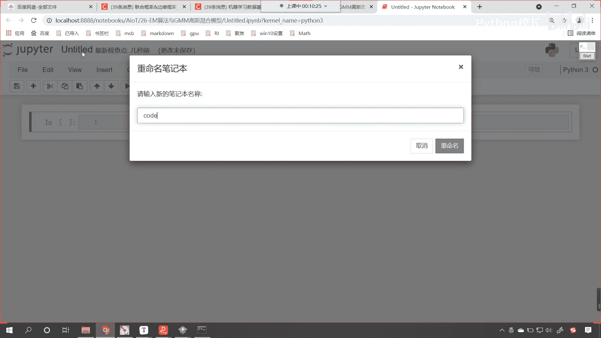
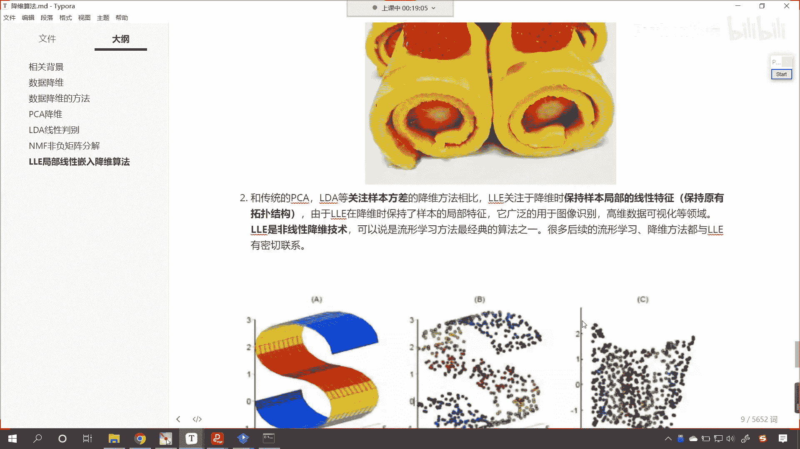

# P168：1-LLE局部线性嵌入降维法算法原理介绍 - 程序大本营 - BV1KL411z7WA

开始我们的课程之前，咱们呢首先看一下我们的百度网盘，大家看啊，在我们上一讲的内容当中呢，啊25降维系列算法进阶当中，咱们的作业呢相应的视频我们都已经上传了好，那么一和二呢是我们作业答案的讲解。

大家现在能够看到这有一个三，我们在课堂上进行讲解的时候，大家能够看到出现了这样的一个情况，我们使用lda算法，咱们在进行演示的时候，那我们就最后呢咱们计算出来的结果。

和使用sk learn当中算法得到的结果，是不是稍微有点不同呀，那原因所在就在于这个地方，咱们求三类的类内散度矩阵的平均值，我们的少，第九行，当时咱们没有做一个除法，没有去求平均。

所以说我们求解出来的结果，sk learn当中求写出来的结果，稍稍稍有点不一样，各位小伙伴就能够看到我们计算出来的结果，和使用lda计算出来的结果一模一样，保留到小数点位后八位好，大家呢可以去看一下啊。

可以看一下咱们这个视频，这个视频可能也就这个十几分钟啊，好这是我们课堂上啊，我们遗留的那一个疑问啊，我们呢专门录了个视频进行了一个讲解，呃，当然相应的代码，相应的笔记呢。

咱们都已经传到我们25杠降维系列进阶，这个目录下的这个答案当中了，大家去去这里进行相应的下载就可以了，好那么咱们开始今天的内容，咱们在当前，咱们呢呃今天呢我们新建了一个目录。

那这个目录呢就是em算法与gmm高斯混合模型，咱们呢就进入这个目录下，在这儿呢我们就先创建一个代码文件。

咱们呢给他改一下名啊，起个名就叫code。

在上一节课当中呢，我们在进行介绍的时候，我们留着一点点尾巴，那这个呢就是l l e叫做局部线性嵌入，降维算法，这个算法咱们没有进行讲解，那它到底是怎么回事呢，以后各位只要看到算法是三个英文。

或者说是多个英文的大写，那你就知道它呢一定是几个英语单词的缩写，那我们l l e它是什么呀，翻译成中文叫做局部线性嵌入，那它所对应的英文就是locally linear embedding。

哎这个翻译成中文就是局部线性嵌入，那么这个算法到底是怎么回事啊，大家现在就能够看到是吧，你看这个是不是就是一个瑞士卷呀，你看这个瑞士卷是怎么做的呀，他是不是卷起来的呀，看到了吧，卷起来的，对不对，好。

那么咱们l l e呢，这个算法在处理流行降维的时候，效果要比pca要好很多，那什么是流行呀，哎你比如说咱们这个瑞士卷，它这个形状你看我在这儿给你画一个啊，你就能够发现是吧。

它的这个形状你看它是不是拐弯的呀，看到了吗，你看它是不是拐弯的，我们把这样的形状咱们呢就叫做流行，看这个流行呢是数学上的一个术语，流行呢不仅仅是这么简单的结构，流行呢是可以更复杂的啊。

可以是非常复杂的好，那么对于这样的数据，咱们呢该如何进行降维呢，我们发现啊，这个瑞士卷儿，它的层和层之间是不是给连到一起了呀，你比如说这一层和它里边儿这一层，它是不是挨的就比较近呀，对不对啊。

他挨的就比较近，但是咱们看到这个蛋卷之后，咱们就知道是吧，这个瑞士卷啊，他是不是可以给它撑开啊，对不对，你看我一拽是不是就能够把这个给它拽平呀，一旦我拽平之后，你想一下。

咱们这个地方的这个数据和上面这个数据，他们俩是不是隔的就比较开了呀，你看如果说我要把瑞士就要给他拽平了，是不是他离得就比较开了，啥意思呢，你看你看这就是一个瑞士卷儿，两边各有一个人，咱们呢把它撑开。

是不是，撑开之后，你就发现你看它就变成一个这个一维水平的，这样的一个数据了，那这个l l e降维的实现过程是吧，就是咱们看到的这个图片是吧，左右各有一个小人儿，咱们把它撑开好。

那么咱们继续来看咱们l l l e这个算法，它和pcl da它有什么样的不一样啊，那pcl da它关注的是样本的方差，看到了吗，他们关注的是样本的方差，无论是咱们pca算法还是l d a算法。

它们在计算的过程当中都进行了方差的计算，或者说进行了协方差的计算，而lol这个算法它关注于降维时，保持样本局部的线性特征，看到了吧，这叫保持局部的线性特征，所以说你看他既然保持局部。

那我们是不是就可以把这个根据它的特征，是不是给它撑开，把它伸展拉开呀，对不对，你看它就是这样的啊，由于l l在降维时，保持了咱们样本的局部的特性，它广泛地应用于图像识别，高维数据可视化。

l l e呢它是非线性的降维技术，咱们的p c a l d a呢，它呢属于是线性的降维技术，那么l l e咱们现在要介绍的这个算法，我们可以说它是流行学习方面，最经典的算法之一了。

好那么咱们看一下这个到底啥是这个流行啊，在我们传统的机器学习当中，咱们的数据点和数据点之间的距离和映射，咱们咱们呢都是定义在欧式空间当中，你看什么是欧式空间呀，欧式空间就是直来直去的。

然而在实际的情况当中，这些数据可能不是分布在欧式空间当中，比如说黎曼空间，我们人类在这个地球上生活了很多年是吧，500年前我们的人呢一直认为咱们这个地球呢，它是天圆地方，对不对呀，直到后来是吧。

我们这个大航海时代才发现这个地球呢是吧，它是不是个圆呀，地球是不是一个球呀，对不对，你看你就像咱们地球是吧，咱们人生活在地球上是吧，这个球面是吧，这个球面它的空间呢它就不是欧式空间，看到了吗。

他不是不像咱们左边一样，你看两只苍蝇是吧，一直走，还有两只苍蝇平行着走，它们永远不会相交，如果说要在球面上，你想啊，咱们如果说要向北走，大家都向北走，我们走着走着到北极了，这个时候咱们是不是就会相遇呀。

对吧，还有有的空间呢是越走越远，所以说呢这个就是空间的一点概念，大家呢只需要看到咱们这个图，你明白是什么意思就可以了，所以说呢这个我们的宇宙是吧，并不像咱们想象的是，这个两条线永远不会相交。

爱因斯坦就说了，咱们的时空根据它的狭义相对论，时空是不是可以弯曲呀，对不对，你看时空是弯曲的啊，好那么如果说要在非欧式空间当中，咱们使用lol算法，那有可能就会得到一个比较好的结果好。

那么接下来呢我们看一下咱们l l e这个算法，它大概是怎样的一个过程啊，那么主要步骤呢是分三步，咱们首先呢是寻找每个样本点的k个近邻点，你看这个l l叫做什么呀，叫做局部线性嵌入。

叫做locally linear，那它的局部是不是就是他的邻居呀，对吧，他的邻居点和它呢一定是有某一些关系，所以说咱们首先是寻找每个样本点的，k个近邻点，由每个样本点的近邻点。

计算出该样本点的局部重建权重矩阵，那因为呢咱们每一个点都可以使用它的邻居，都可以使用它的k个近邻点来进行表示，因为既然他是你的邻居了，你们离得比较近，是不是说明你们某一些特征就是相似的呀，对不对。

你看你和你的朋友是吧，你和你身边的几个关系很好的朋友，你们的水平是不是差不多呀，对不对，你们的这个收入情况是吧，有很很有可能也是差不多的，是不是你就像我身边的朋友是吧，我非常非常好的朋友是吧。

那也是这个收入情况，这个家庭背景，或者说小学的时候就在一起上是吧，他们往往都是这样的一些属性，所以说这个k个近邻点是吧，它就可以当成一面镜子，在某一定程度上去表示你，那我们的数据也一样。

由该样本点的局部重建，全职矩阵和其近邻点，计算出该样本点的这个输出值，也就是说用他的这个邻居来对它进行，某一种形式的表示好，那么咱们到这里呢。

就大致了解了一下局部线性嵌入降维法，它的大概的一个应用和原理，那接下来呢咱们就在代码当中。

