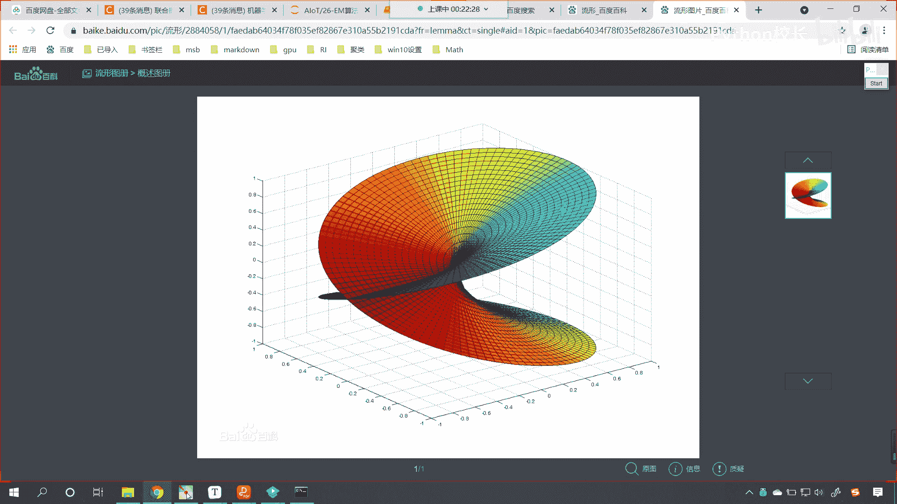
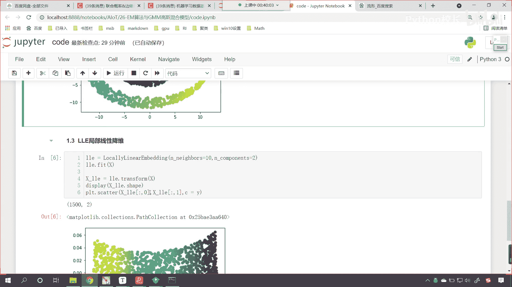

# P169：2-LLE算法使用代码举例 - 程序大本营 - BV1KL411z7WA

来接下来呢咱们就回到代码当中，咱们首先呢在这来一个三级标题，叫做l l e局部线性嵌入降维算法，那么首先呢我们导一下包啊，首先咱们导一下包，那这个时候呢咱们就from sk learn点叫做麦嗯。

我们从many food当中，咱们导一个包，这个时候咱们就import locally linear embedding，那这个many fo这个英语单词它的意思呢，大家看啊。

这个many food它呢就是流行的意思啊，这个就是流行，那么啥是流行呢，什么是流行呀，你看这个流行可不是说我们流行歌曲，流行天王啊，你看我们搜流行，那叫搜流行数学，你看这个时候咱们发现是吧。

我们搜流行的时候，这个形的话是形状的形，哎我们搜这个啊，这个形写错了啊，流形形状的形是吧，应该是唉这个形好。

现在各位小伙伴你就能够看到，是不是那流行，这是不是就有一个百度百科呀。

流行是什么呀，是局部具有欧几里的空间性质的这个空间，大家注意啊，它是一种空间，在数学当中呢我们用于描述几何形体，物理上呢，经典力学的经典力学的这个项空间，和构造广义相对论的时空模型的四维伪里面。

伪黎曼流行都是流行的实例，那么到这里我们可能就不太懂了。

是不是没关系啊，你看这个图形看到了吗，你看这个图形唉，你看到了吧，这个图形是吧，你就可以把它当成一个流行是吧，也就是说我们的空间是吧，它不仅仅是它不仅仅向咱们肉眼，或者说我们所感受到的直来直去的。

有可能是弯的，你就像这个科幻小说里边讲到的，科幻小说里边是不是讲到了虫洞呀对吧，这叫时空弯曲，我们是不是可以从某一个地方嗯，从某一个时空是不是穿越到另一个时空呀，对不对，所以说看这是流行的一种形状好。

那么咱们代码当中，我们讲到的这个流行就比较简单了，那我们看到的这个流行，你看就是甜甜圈，这个大家并不陌生是吧，那这个这个流行呢就是咱们的瑞士卷是吧，哎说错了，瑞士卷这个我们都吃过是吧，这个就是一种流行。

那它的局部你就能够发现，局部是不是咱们的欧式呀，但是整体来说是吧，它就不是咱们的欧式空间了，好那么回到咱们的代码当中，现在的话呃咱们呢把这个导包给它导进来啊，呃然后呢我们import np，as np。

然后呢我们from sk learn，咱们导一导一下data sets，这个呢用于生成数据，然后呢我们import matt plot lib，咱们将呢piplot我们给它导进来。

然后呢from sk learn呃，咱们从d composition当中，咱们导一个算法，我们将p ca导进来，那这个pca是不是咱们之前学习的降维算法呀，今天咱们新学的降维算法和之前学的降维算法。

我们进行一个比较，看看这两者有什么样不一样的地方，好不好嗯，好那么然后呢为了绘制咱们的三维形状，咱们呢得导一下咱们三维的绘制引擎，from npl two kids，我们从当中的m plot 3 d。

咱们从当中的axis 3 d，从当中咱们import axis 3 d把它导进来，哎这个时候执行一下，然后呢我们就生成数据哈，那咱们就使用data sets点。

咱们make一下m a k e叫make switch，这个switch ro，它可以帮助我们生成一个，瑞士卷的这样的一个数据，那我们给它生成多少个数据呢，n sample，咱们让它生成1500个。

然后呢我们给它加点噪声，这个噪声呢来个0。05，然后呢我们给他一个random state，我们让它等于1024，大家要注意，如果要是没有这个random state。

那么我们每次生成的数据它都会有所不同，那在这里咱们之所以给它固定一个random state，咱们是为了演示的时候，每次和每次执行的结果它都是一样的，然后呢我们给一个x，然后呢我们给一个t啊。

那这个数据呢它会返回两个数据，一个是数据x，另一个就相当于是它的类别，就相当于是它的标记一样好，那么现在呢咱们画图给它画出来啊，咱们创建一个子视图，那就是plt。

我们调用figure f i g u r e，在这个当中设置一下它的尺寸，非杆size，咱们给一个12和九，然后呢调用咱们这个视图，调用咱们这个形状，我们调用它的爱的方法。

那就是add sub plot，sub plot是不是就有子视图的意思呀，那这个子视图它是什么样的一个形状呢，咱们给一个projection，这个projection就是它的类别，咱们给一个3d哎。

这个时候呢我们就是一个3d的形状了啊，然后呢呃有了这个3d的形状，我们接收一下，三现在呢我们向axis axe s3 当中，咱们绘制它的散点图，s c a t t e r x中括号冒号，咱们给一个零。

这个就相当于是它的横坐标，然后x中括号冒号一，这个是纵坐标，x中国二冒号二，这个就相当于是它的z轴，然后呢我们给一个c c就相当于咱们的c，就相当于咱们的t，这个t呢大家可以认为它是target啊。

啊那现在这儿啊，咱把它变成y啊，其实无论你用t表示也好，还是使用这个y表示也好，它是不是都表示类别呀，对不对，那我们使用y来表示，使用t来表示，这又有什么区别呢，此时你看我执行一下这个代码来。

大家现在就能够看到，你看咱们一个形状是不是就出来了呀，那这个时候咱们的视图效果不太好，我们给它调整一下方向啊，咱们现在呢就调用axis 3，它里边有一个方法叫做这个调用，它的方法叫做view。

will呢就有视图，init呢就是初始化一下它的角度，咱们给一个七，给一个-80，这个数据都是可以调的，这个时候你看我一执行，咱们现在看视图的这个角度是不是就不一样了。

此时我们就发现咱们所看到的这个图形，是不是就特别像一个瑞士卷呀，看到了吧，像不像一个瑞士卷，很像，对不对呀，好那么这个就是咱们的原始数据，我们在上面插入一行，咱们呢来一个四级标题，这个呢就是创建数据。

看创建数据，咱们这个数据呢就是瑞士卷，唉那这个数据就有了，你要知道这个外表是什么啊，你看我们在绘制这个散点图的时候，我们c等于y c是不是表示颜色，没错吧，c表示颜色，那这个y呢它有不同的值。

所以说咱们画出来这个它是有不同颜色的，对不对啊，之前咱们在讲，之前咱们在讲这个聚类的时候，我们之前讲聚类的时候，咱们是不是也使用瑞士卷，这个数据进行过创建呀，对不对，好，那么啊到咱们降维这里。

咱们呢依然使用这个数据啊，你看依然使用这个数据，你这个时候你就要注意这个数据呢，你看它是不是就有一个空间结构呀，看到了吗，它呢就有一个空间结构的这样的一个性质，那我们可以认为是吧，这个是流行的啊。

这个是流行，你要注意啊，什么是流行呢，这个流行是吧，它有空间的一个概念，它有空间的一个概念，你比如说我从紫色的这个点，我如果想要到达咱们黄色的这个点儿，那咱们得怎么走呢，得沿着这个圈走。

沿着我画的这个红色的线走才能走到这里啊，明白吗，你就像咱们地球一样，看到了吗，咱们地球它是不是一个球形呀，对吧，我们如果想要从中国跑到美国，咱们是不是得，是不是得需要走一个弧线才可以啊，对不对啊。

但是我们在地面上走的时候，咱们人感觉到的是不是我们走的是直线呀，其实咱们走的是直线嘛，我们走的是弧线，对不对，因为地球它是球形的吗，好那么现在这个数据创建好了，那我们此时呢咱们就使用pca。

我们对这个数据进行降维好不好，你知道咱们的数据x它是几维的吗，我们既然可以在空间当中把它画出来，那么这个数据它是不是就是三维的呀，来现在的话咱们来一个四级标题，咱们使用之前的pca。

我们对于这个流行结构的数据，咱们进行降维，我们看一下它降维的效果好不好，那我们就声明pca就等于pca小括号在这儿呢，我们给一个n components，此时呢我们给一个二，第二呢就表示。

我们将最重要的两个特征给它保留下来，那这个n components咱们可以给小数，也可以给整数，整数就代表留几个小数的话，就表示流重要性的百分之多少好，那这个pca有了，然后呢咱们就使用pca。

此时呢我们就进行训练一下啊，调用feat，然后pca点调用它的transform方法，我们将数据x咱们进行一个转换接收一下，那就是x下划线pca，此时这个数据它一定是二维的。

咱们来一个display查看一下，咱们转换之后这个数据的形状，那就是x p ca咳，那么嗯查看了形状，同时呢咱们也将这个点给它画出来吧，因为此时这个数据是二维了。

所以说我们是不是直接调用散点图就可以了呀，那就是x下划线pca中括号冒号零，这个就是咱们降维之后的横坐标，然后呢x下划线pca中括号冒号，我们给个一，这个就是我们降维之后的纵坐标。

那颜色呢咱们依然给个c啊，c依然等于上面咱们得到的y，你想我对这个数据进行降维了，那么它的类别变吗，类别是不是不变呀，此时你看我一执行诶，大家现在就能够看到，这个就是我们降维之后得到的二维，你看啊。

此时你看得到这个二维的数据之后，你是不是依然感觉这个特别像三维呀，看到了吗，你是不是看上去它依然像三维，但是呢你仔细看啊，仔细想咱们画图的时候，我们是不是调用plt。scanner呀。

所以说这个呢它是一个二维的啊，这个呢是一个二维的图形，只不过咱们pca在进行降维的时候，他是不是选择了某一个方向进行照射呀，对不对，选择了某一个方向，选择了某一个方向进行投影。

所以说原来三维的这个数据看到了吗，原来三维这个数据经过投影之后，咱们就发现你看他得到的是这样的一种嗯，这个情况得到的是这样的一种数据好，那么很显然咱们p c a进行降维，看p ca进行降维。

他得到的这个数据是吧，你看他是不是依然是一个螺旋的，一个这样的结构呀，你看了吗，它依然是一个螺旋的这样的结构，对不对好，那么接下来呢咱们使用lol我们来进行降维，那就是pc降完为之后。

这个数据好还是不好呢是吧，就是它堪用不堪用呀对吧，那咱们现在先留一个悬念是吧，等我们使用了l l e进行降维之后，咱们进行一个对比好不好，这个呢就是局部线性降维好，那么此时呢咱们就使用一下我们这个算法。

咱们对它进行一个声明，那就是l l e就等于local linear embedding，里边呢我们就传一个参数enneighbors，咱们给个十，那这个neighbors表示什么。

表示邻居为什么要使用邻居呀，这个算法它在进行迭代的时候，他是不是寻找每个样本点的k个近邻点，所以说这第一个参数就是找几个邻居，咱们给个十，第二个参数呢咱们给一个n components，我们给一个二。

那这个意思就是我们呢进行降维的时候，咱们保留两个特征，然后调用lol，咱们呢来进行训练，同样feat一下l l一点调用transform，我们对数据进行一个转换。

转换之后得到的数据呢就是x下划线l l e，现在呢咱们将这个数据也进行一个可视化，你现在来看一下它的形状，咱们调用它的ship，那它肯定也是二维的啊，没跑，现在呢咱们plt我们把这个数据也画图。

给它画出来，咱们就调用scanter xl l e中国号冒号，我们给一个零，这个就表示横坐标x中国二冒号给个一，这个就是纵坐标颜色c呢，咱们依然使用它的目标之外来进行表示，唉此时你看我一直行，诶。

大家现在就能够看到，你看此时咱们降为我们得到的这个数据，你看它长什么样呀，看到了吗，你看这个数据是不是就被我们撑开了呀，看看有没有被我们撑开，看到了吧，撑开了吧，平铺了，对不对呀，平铺了展开了。

是不是啊，你看和咱们pca降维，你看这个pca降维是吧，它其实是这个一些点是不是给堆积到一块儿了，比如说这个地方啊，为什么我们看到的这个，为什么咱们看到的这个地方是吧，你看感觉他好像嗯被拧了一下。

是不是就像一个绳子一样是吧，或者说一个衣服咱们两头拽住他是吧，给它拧一下，你看这个地方，还有这个地方，这个是不是都给堆叠到一起了呀对吧，所以我们上面画的这个也是一个二维图形。

但是我们肉眼视觉看到这个图形之后，咱感觉它好像是三维的一样，就是因为这个地方进行了，怎么是不是进行了一个堆叠呀是吧，很多点都堆到一起，它变细了是吧，那我们使用l l e，咱们使用这个算法，大家看啊。

这个效果让你来评判一下，你说哪个效果更加嗯更加好呢，很显然，你看这个l l e，是不是就将咱们的数据进行了平铺呀，对不对呀，他就进行了平铺，这样的话咱们降维得到的这个数据呢，看降维得到的这个r好。

错了啊，错了l l是吧，哎大家看啊，咱们在进行绘制图形的时候，肯定是xl l e它的第一位，还有咱们xl l e它的第二位，刚才呢咱们少写了一个l l e，此时我们在执行这个代码哈。

来各位现在各位小伙伴，你现在来看咱们这个数据是吧，哎刚才我们少写了一个l l e，我们出现了刚才那种效果，是不是，现在的话咱们把这个x l l e是吧，把它写对了啊，这个是我们使用局部线性嵌入降维算法。

得到的降维之后的结果，唉现在各位就能够看到这个数据，你看这个数据是吧，他就比咱们刚才使用pca降维，这个效果就要好一点啊，这个效果因为它给平铺开了是吧，那为啥平铺的这个效果就要好好一点呢，因为你发现啊。

你看啊，你发现咱们最右边是不是紫色的呀，咱们最左边它是不是黄色的呀，对不对，那一个是紫色，一个是黄色，其实呢在我们的原始数据当中看，在咱们的原始数据当中，我们往上滑原始数据当中。

其实你想一下紫色的这部分数据，和咱们黄色的这部分数据，我们从流行，咱们从空间上来说，他俩是不是距离的最远呀，对不对呀，他俩肯定是离得最远，是不是因为你的流行呢是这样的一个形状，对不对。

你看他俩是不是离得最远，那我们l l e这个算法它就可以看，展开之后，这个数据是不是紫色的，在最右边对吧，黄色的在最左边是不是分的特别开呀，pca降维也可以对这个数据进行展开，但是展开之后呢。

它有相应的局限性，好那么通过咱们这个代码，各位就知道我们l l降维算法它如何使用了，以及和之前咱们学到的pca降维算法，它们呢是截然不同的啊，好那么我们这一部分呢。

咱们就介绍了咱们l l e局部线性降维。

