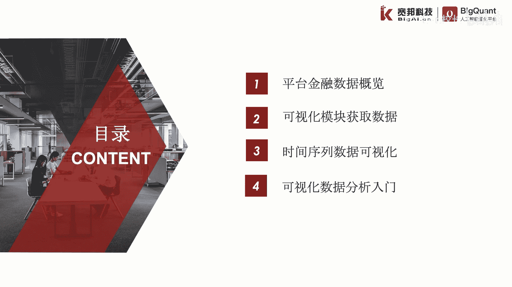
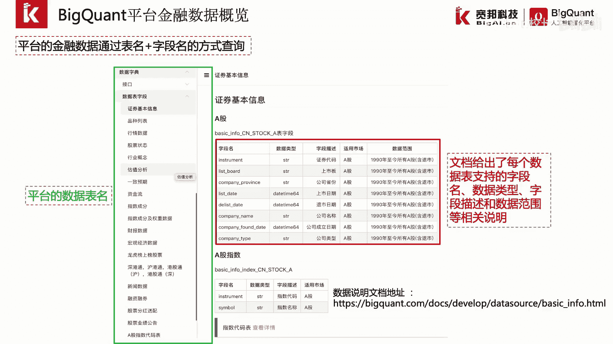
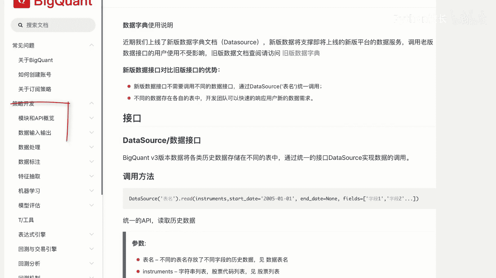
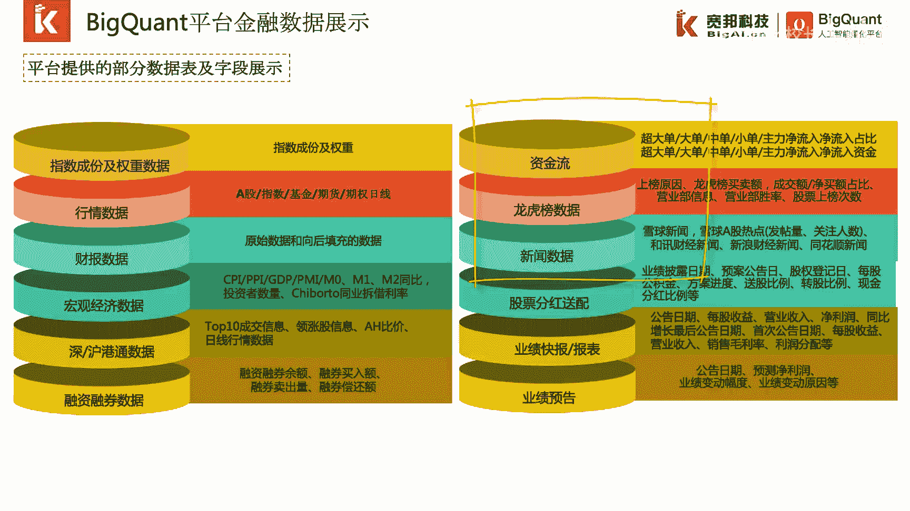
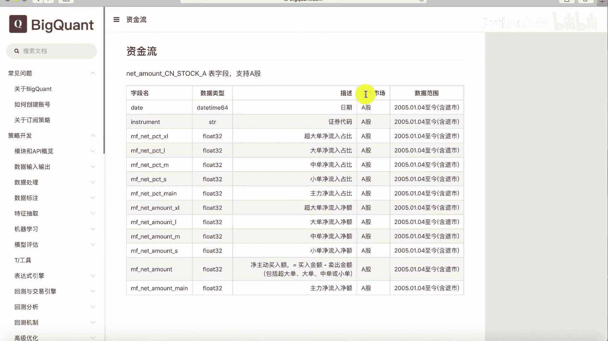

# P17：4.1.1-金融数据 - 程序大本营 - BV1KL411z7WA

这一章我们来介绍量化数据研究，本章主要介绍四个方面内容，首先介绍bacon的平台金融数据概览，然后介绍可视化模块获取数据，紧接着我们会介绍时间序列数据的可视化分析，最后我们会介绍一些可视化。

数据分析的入门知识。

第一小节平台金融数据概览，被矿的平台提供了大量的金融数据，我们可以在bion的平台的文档中查看，bion平台提供的数据字典功能，在数据字典中提供了大量的数据表，我们可以通过点击表明来查看对应的表。

信息文档中给出了每个数据表所支持的字段名，数据类型，字段描述和数据范围等相关说明，例如证券基本信息表中a股证券基本信息，它的表名为basic info cn stop杠a。

它对应的字段包含了instrument list board，company province的对应的字段描述为证券代码，上市版，公司省份的，平台中的金融数据，都可以通过表明和字段名的方式进行唯一索引。

我们可以通过背矿的网站主页中帮助中心文档。

点击进入背框的文档，可以看到首页上有数据字典相关链接，我们点击链接或点击左侧导航栏。

悲怆的平台提供了大量的金融数据，其中包括指数成份及权重数据，行情数据，财报数据，宏观经济数据，深沪港股通数据，融资融券数据，股票分红送配数据，业绩快报报表以及业绩预告等基础金融数据，此外还包括了资金流。

龙虎榜，新闻等特色金融数据。

在帮助文档中，这些数据以表的形式存放并展示，例如资金流，该表中包含了资金流的表明，以及字段名所支持的市场适用范围和字段类型。

