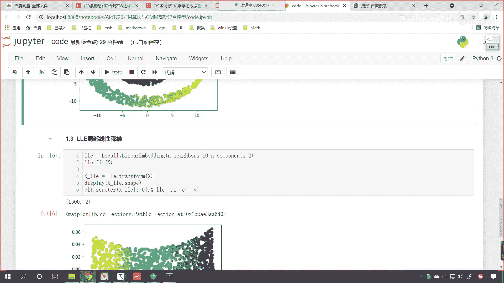
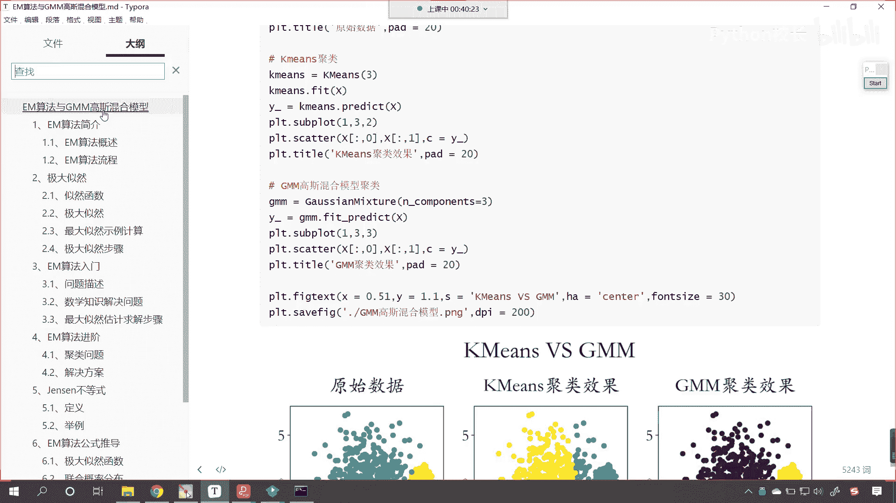
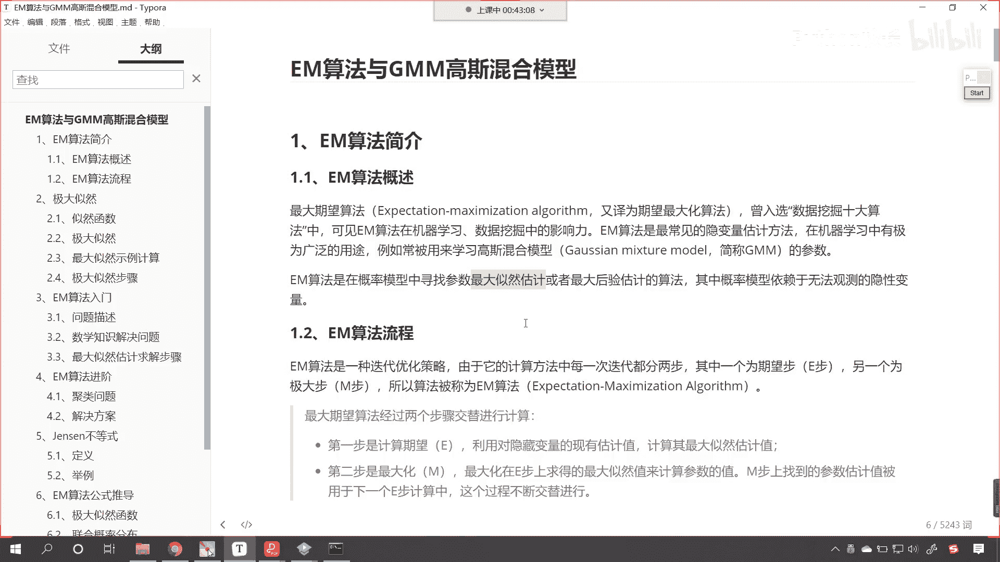
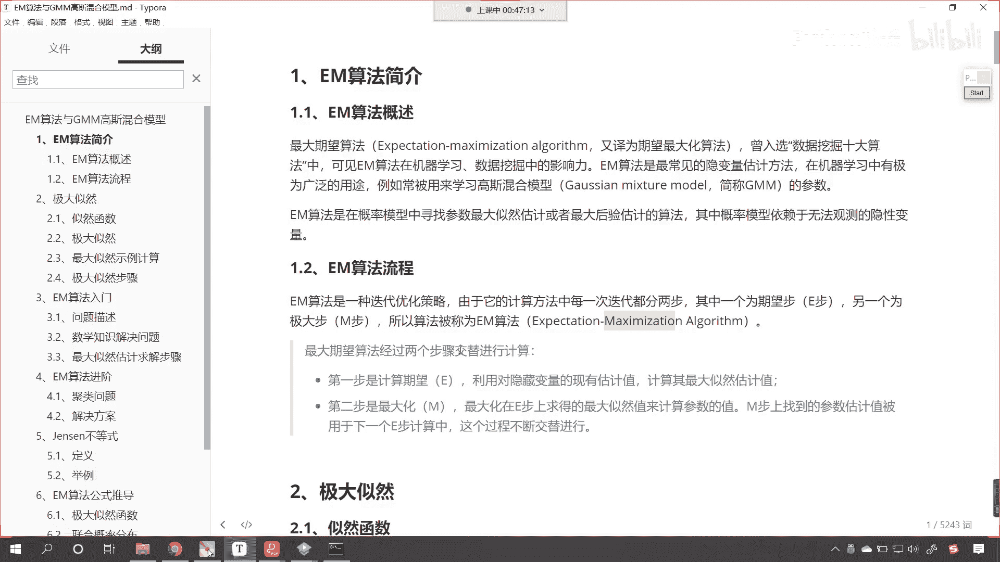
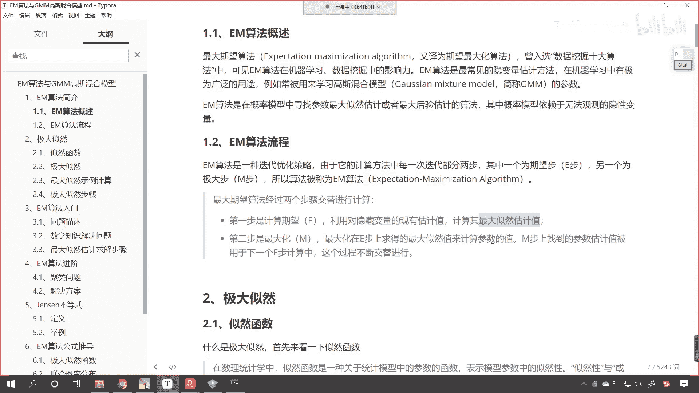
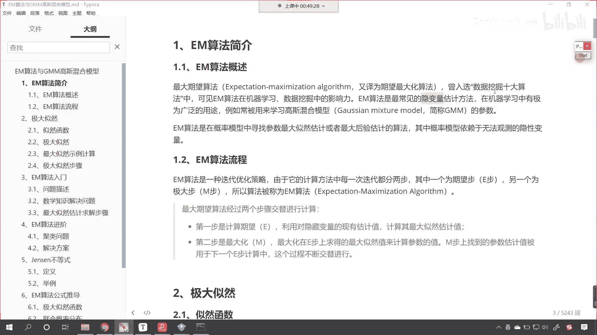

# P170：3-EM算法思想与步骤 - 程序大本营 - BV1KL411z7WA

来各位小伙伴，接下来呢我们继续往下看啊。

好，那么接下来呢咱们就看一下。

em算法与gmm高斯混合模型，那这个是什么呢，我们就发现你看高斯呢无处不在，是不是啊，你看高斯又来了对吧，所以你看为什么这个高斯呢，他是非常伟大的数学家呢对吧，那因为他的这个发明的这个理论。

发现的这个理论过了这么多年是吧，依然闪闪发光好，那么我们看一下这个em算法是什么啊，你看em它是不是两个英语啊，两个英语这两个英语字母都是大写，那么我们就发现如果它要是大写的话。

那么它一定是某两个英语单词的啊，这个某两个英语单词的缩写，对不对呀，这叫什么呢，叫做最大期望算法，它是一种很好的思想，叫什么呢，expe mac see me my sician algorithm。

我们把它翻译过来就叫做期望最大化算法，这个算法呢曾入选数据挖掘十大算法之一，所以说这个算法在咱们机器学习数据挖掘当中，那是非常有影响力的啊，那这个em算法最常见的它呢是隐变量估计法。

看在这儿呢有一个隐变量，那你现在在内心在心里边儿是吧，先留这样的一个疑问，这什么是隐变量呢，一会儿我们会讲到，在我们机器学习当中呢，咱们em算法它有广泛的一个用途。

比如说咱们一会儿要讲到的叫做高斯混合模型，那咱们就使用em这个算法呢来挖掘我们的参数，那em算法呢在咱们概率模型当中，我们寻找参数最大自然估计，或者说最大后验估计算法。

那之前咱们是不是介绍过最大似然估计啊，我们是在哪里，哪课知哪个知识段讲到的这个最大自然估计呢，哪一个章节呀，你回想一下咱们之前是不是讲逻辑回归的时候，里面是不是有最大似然估计啊。

我们之前在讲线性回归的时候，里面呢也有最大似然估计，很多地方都有这个最大似然估计好。

那么接下来呢我们看一下咱们em这个算法，它的流程是怎样的，这个也很简单，这em算法是一种迭代优化策略，大家要注意啊，你看它是一种迭代优化策略，我们之前学过的算法，还有哪些是通过迭代来寻找答案的呀。

我们之前讲过的算法，哪些是通过迭代进行求解的呀，你想一想，哎咱们线性回归当中的梯度下降，它是不是就是一种迭代啊，咱们支持向量机当中的s m o算法，是不是也是嗯这种迭代啊，就是我循环多次。

然后找他最佳的答案，其实呢我们机器学习当中的算法，大部分都是迭代优化这种方式，那因为我们机器学习要解决的问题呢，它都是现实当中的问题，现实生活当中的问题，工业生产当中的问题，它不像咱们呃这个小学初中。

高中所学习到的数学问题，我们在这个上学阶段所学习到的数学问题，其实都是解方程，你想我们课堂上课本上所给的方程，那是不是都是有限个呀对吧，那方程都很少是吧，它都有确定的唯一解，但是真实的这个环境当中。

真实工作当中的这些数据，那它的数据量就有可能很多，你想是不是啊，那如果说我们要根据解方程来去求解，那你有可能就解不出来，有可能就无解，所以说呢这个迭代优化策略是吧，它是非常好的一种策略。

就是一点一点逼近，我追求的不是最优解，我追求的不是标准答案，咱们之前在念书的时候，我们做题，高考那都有标准答案，等你工作了，你就发现没有标准答案，你就像我们说的人无完人，有完美的人吗。

是不是没有完美的人呀，那答案也一样，也没有，也没有完美的答案，你就像我们面试一样是吧，咱们在面试的时候，我们老想着是吧，回答出来这个答案是吧，它是完美的，有完美的答案吗，没有面试其实就是聊天。

你和面试官聊天聊开心了，面试官就想招你进来是吧，就这么简单，其实你想人和人之间的差距有特别大吗，没有特别大是吧，所以说你看这个你聊天是吧，你把自己的经历是吧，或者说把自己做过的一些事情。

以聊天的形式是吧，聊的特别开心，那你自然就能够拿到offer，但是现在呢这个市场竞争激烈，所以说就会去呃，以学历呀是吧，以你的这个是不是硕士呀来进行卡，你其实你想如果你要是老板。

你最终想招聘的这个人是不是能干，能干好本职工作就可以了呀对吧，你上没有上过学，有所谓吗是吧，无所谓啊，好那么咱们em算法分两步，其中一步呢我们称为期望不，咱们就叫做异步，另一部呢我们称为极大部。

叫做m部，这个m呢就是mac im mization，好，那么咱们最大期望值算法经过两个步骤，它是交替进行的。

最终呢我们计算出一个结果，那咱们看一下这第一步呢就是计算期望，利用隐藏变量的现有工具，现有估计，咱们计算其最大自然最大自然的这个估计值，因为只要一个数据，咱们这个数据当中是吧，我们去计算期望。

那你比如说这是一个概率问题啊，或者说它是一个正态分布问题，咱们再根据他的这个分布数据求解的时候，你想我们是不是就可以去计算它的极大，似然估计啊，那么求得了极大自然估计之后，第二步呢咱们去最优化m最大化。

在异步上求得的最大自然估计，来计算咱们的参数值啊。

计算咱们的参数值，刚才的时候咱们让大家留了一个疑问，说什么是因变量呢，你看什么是隐变量的，隐变量就是我们要求解的未知数，知道隐变量就是咱们要求解的这个未知数，这里所说的这个参数，看这里所说的这个参数。

就对应着咱们上面所说的隐变量，那m部上找到的参数，估计被用于下一个异步的计算当中，这个过程不断的交替进行，看什么意思呢，就是第一步，咱们计算期望求它的这个最大自然估计，那这个时候呢，这个最大似然估计。

其实就是概率和概率的相乘是吧，然后呢我们可以求导数，令导数为零，咱们就可以计算，就可以计算出参数，有了这个参数之后，我们再将参数再带到第一步当中，循环往复的去执行，直到呢最后这个最大。

似然估计这个值不变了为止，好那么这个呢就是咱们em算法的简介。

