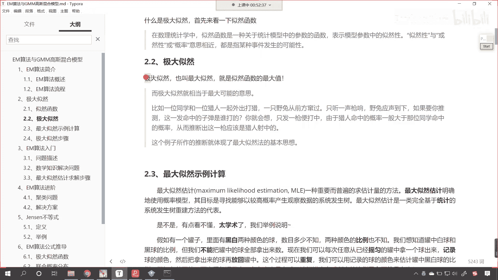
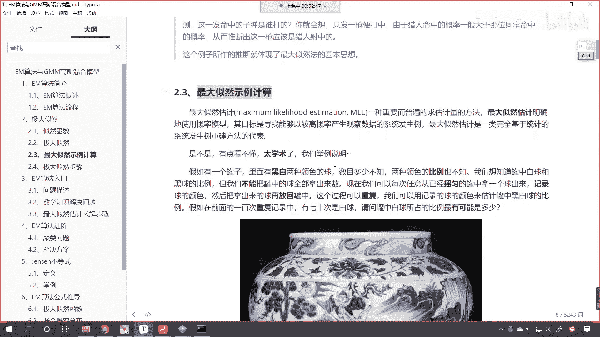
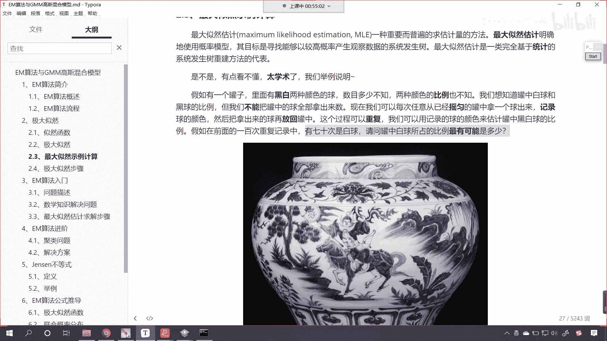
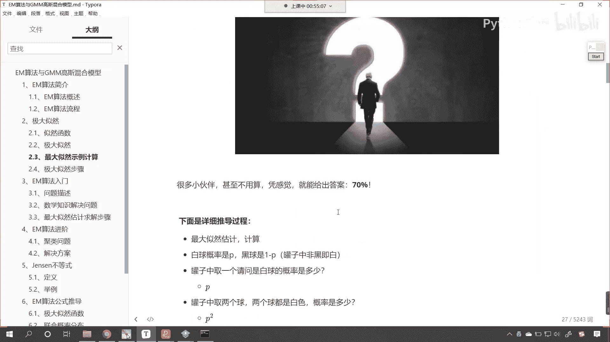
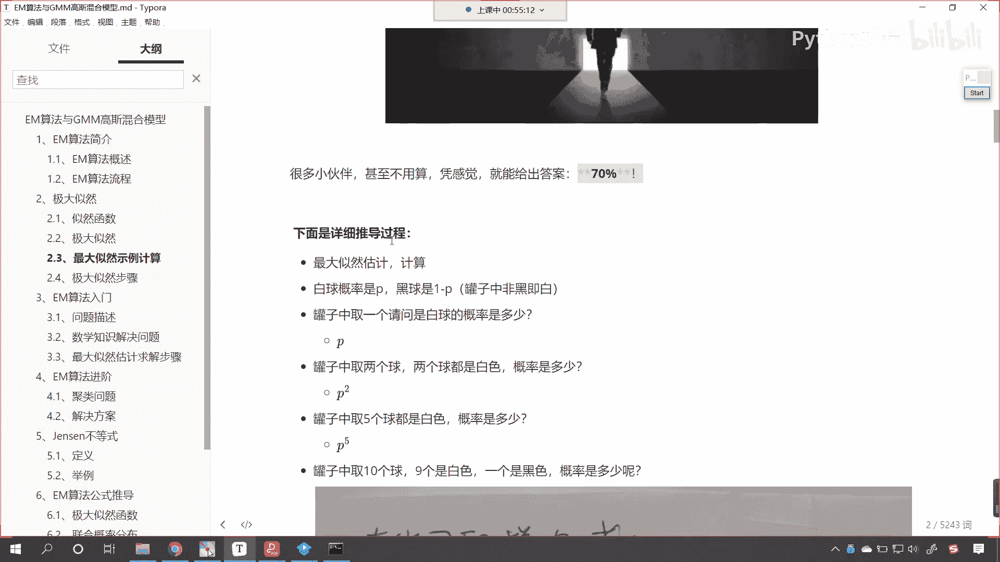
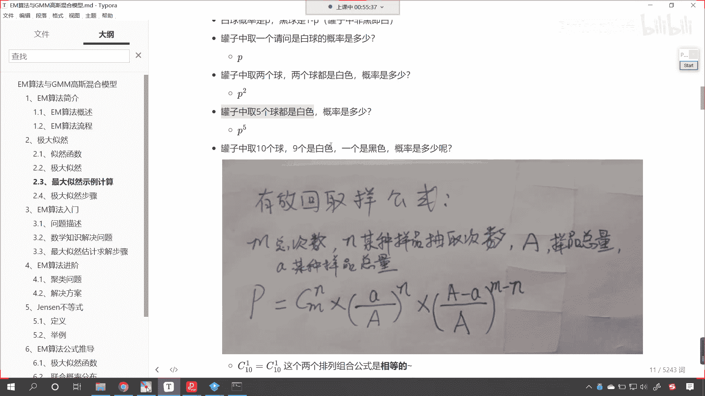
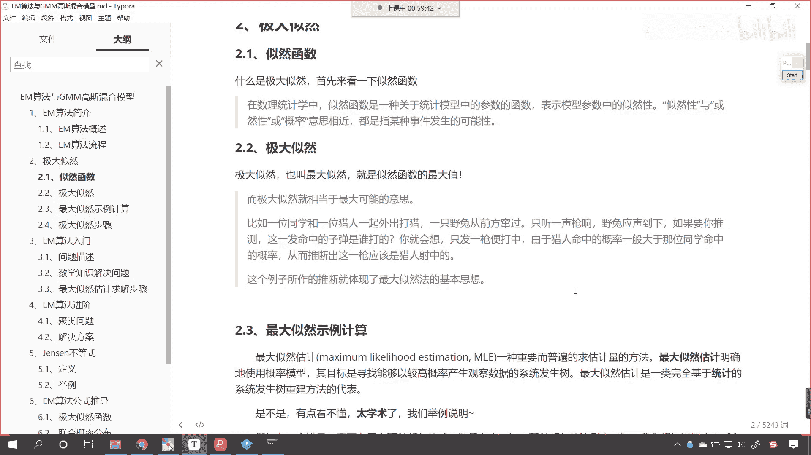

# P171：4-极大似然思想 - 程序大本营 - BV1KL411z7WA

来现在咱们看一下什么是极大自然，这个呢是咱们数理统计当中的一个概念，这个什么是极大自然呢，就表示咱们模型模型当中的自然性，或然性或概率的意思，看极大自然呢也叫最大自然，就是自然函数的最大值。

比如说咱们举这样的一个例子啊，一位同学和一位猎人一起外出打猎，一只野兔从前方窜过，这个时候呢只听见一声枪响，野兔应声倒下，如果你推测这一发命中的子弹是谁打的，你就会想只发一枪便打中。

由于猎人的命中率一般大于那位同学的命中率，从而呢我们就推断出这一枪应该是猎人射中的，是不是啊，你看你想我推测是学生打中的，行不行呀，你看我推测是学生打中的行不行是吧，你看让你推测这一发子弹是谁打的对吧。

有没有同学推测是这位学生打的呀对吧，误打误撞瞎猫碰见死耗子，是不是，你看这儿呢大概率来说是猎人，你就像是吧，好比中国队参加世界杯总决赛，我们碰到的是英国队或者说德国队，那假设说是吧。

中国队参加世界杯了啊，总决赛，那请问谁可能会赢呢，到底是中国队呀，还是德国队会赢呀，那我们都我们根据现在的这个水平，我们就推测大概率上来说，应该是德国是不是赢得这个世界杯的比赛啊。

你知道每次在进行世界杯比赛的时候，是不是都会有博彩呀，对不对，你看你如果要是买中国，那就是一赔100，啥意思呀，比如说你投了1万块钱是吧，投了1万块钱，你就赌中国赢，假设说中国真给赢了。

那你最后就可以得到100倍，如果说你要是赌德国赢是吧，那这个时候呢那可能就是这个一赔一是吧，嗯嗯你赌赢了是吧，你投了1万块钱，最后你只能得到1万，我们的博彩思想当中，它是不是也是根据概率来进行的呀。

对吧，所以说那咱们举的这个例子，如果各位小伙伴能够明白，其实你就知道什么叫极大自然了好。

那么这个最大自然估计这一部分的内容呢，是我们之前讲过的啊。

你看我们还举一个罐子当中黑白球的这个案例，咱们先把这个问题描述一下，罐子当中有黑白两种颜色的球数目多少，咱们不知道两种颜色的比例，也不知道，我们想知道罐子当中白球和黑球的比例。

但是呢咱们不能把罐子当中的球，全部拿出来来数一下，但是我们可以每次任意从已经摇匀的罐子当中，拿出一个球，来数一下咱们的记录球的颜色，然后把拿出来的球再放回到罐子当中是吧，这个过程可以重复。

对咱们这个呢是介绍过的啊，这个就是在咱们之前线性回归当中是吧，我们讲过，那今天我们讲到了em这个算法，咱们现在呢在大概的过一下，看看这个最大自然它到底是怎么回事，后面呢我们这个推导em算法的推导过程。

我们都会用到咱们这个极大自然好，那么这个过程呢拿球的这个过程可以重复，我们呢可以用记录球的颜色来估计，咱们罐子当中，黑白球的比例是一个什么样的情况，假设说呢我们重复了100次这样的实验。

咱们就发现有70次是白球，那么也就意味着有30次是黑球，这个时候问你一个问题，请问罐子当中白球所占的比例最有可能是多少，好那么我们有小伙伴抢答了，说这个比例是七比三，对不对，好。

那么七比三也就意味着咱们的白球所占的比例，是不是就是70%呀，对吧好，那么这个是怎么算的呀，那我们不用算，咱们是不是通过感觉我们就能够说出来啊，对不对啊，这是你大脑进化过程当中是吧。

一点儿一点儿给你计算出来的，一个比较靠谱的一个结果好。

那么到底是怎么算的是吧，你看就是70%。

这个是正确的啊，那下面就是详细的推导过程。

好想我们令白球的概率是p，黑球是一减p是吧，那如果你要取一个，那是白球，它的概率就是p罐子当中取两个球，两个球都是白色，那那那它的概率就是p的平方，如果我们罐子当中取五个球，五个都是白色。

那么它的概率就是p的五次幂是吧，那罐子当中取十个球，九个是白色。

一个是黑色，那这个概率该怎么写呢，哎那就是咱们c 11是吧，这个就是排列组合，然后p的九次幂乘以一减p的一次幂是吧，那同样的道理，如果说我们假设说是吧，咱们罐子当中的球是吧，取了100个70次是白球。

30次是黑球，那这个概率呢咱们就可以使用排列组合，加上咱们的概率乘法，是不是就可以用这个来表示呀，那么最大自然的问题呢，就是求咱们的p什么时候最大，就是你这个概率啥时候最大呀，对不对。

你什么时候你这你这你这个白球的概率是多少，的时候最有可能出现咱们70次是白球，30次是黑球，这种情况呢是吧，那我们就求导呗是吧，求导令导数为零，最后咱们公式化简，我们求解出来的答案，求解出来的结果。

这个p就是70，各位小伙伴还要仔细去看一下啊，咱们的推导过程，严谨的推导过程哎就是从这儿到这儿，这个是数学的这个过程，那我们很多人呢，咱们凭感觉我们就能够得到70%嗯，在这里呢我专门把推导的过程。

咱们用数学逻辑严谨，咱们给他表示一下，你看这个就是数学它的魅力啊，这就是数学的魅力是吧，我们通过求导咱们就得到了，那你想一下，你看咱们人类，现在是不是这个世界上进化的最高等的文明呀。

其实你想你的大脑当中到底是怎么工作呀，你看你的大脑中他的工作流程，你看就是这样，你只不过你感觉不到，你的大脑当中大概有1000亿个脑细胞，知道吗，你的大脑当中有1000亿个脑细胞，它的计算速度非常快。

比现在这个世界上任何一个这个计算机，计算速度都要快，所以说你一下子就感觉到了是吧，你感觉出来的结果是70%，和我们使用数学公式去计算得到的结果，那是一模一样的，所以说呢很多时候你的感觉呢都有依据。

知道吧，感觉都要都有依据，只不过呢我们没有一步一步的去经历这个过程，所以说呢我们感觉大脑好像没有在工作一样，其实大脑是相当复杂的，它是不是已经悄无声息地，把这份工作给我们做了，对不对，好。

那么这个呢就是我们极大自然，现在呢我们又对这个知识点进行了回顾，em算法，em算法他在执行第一步计算期望的时候，看计算期望的时候，他呢进行了这个最大似然估计，然后根据我们的最大自然估计呢。

去计算咱们的参数，计算了这个参数之后呢，又回到第一步再去计算一下它的最大自然估计，循环往复形成了这个迭代算法，你越循环越接近，最后的话看你e步和m步这两步循环循环循环，最后你的参数不再变化了。

那么我们就找到最终的这个答案了。

