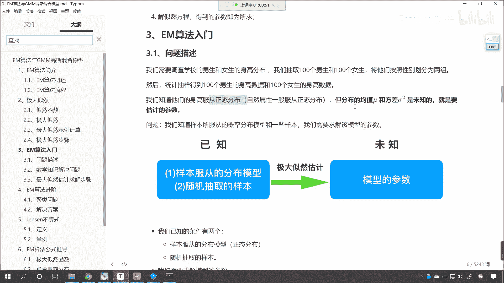
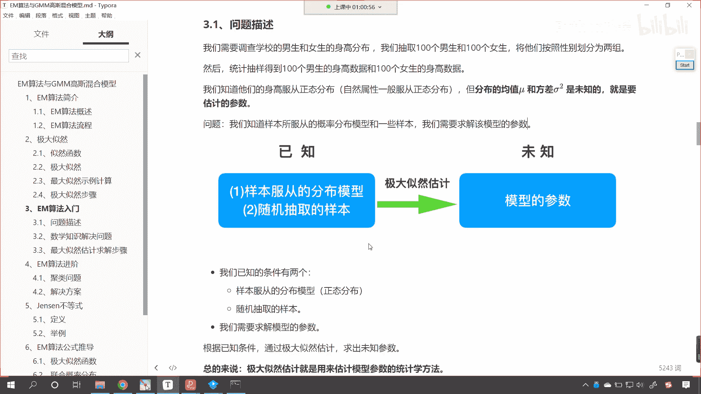
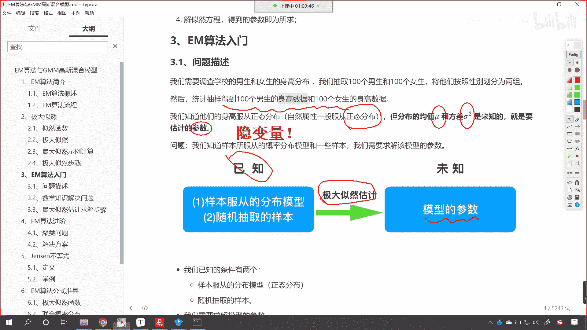
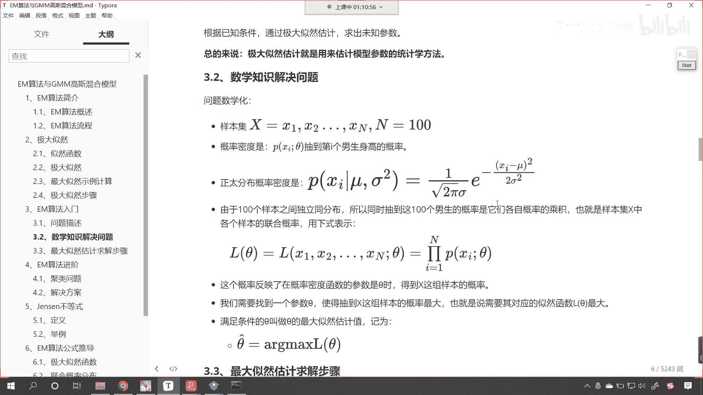
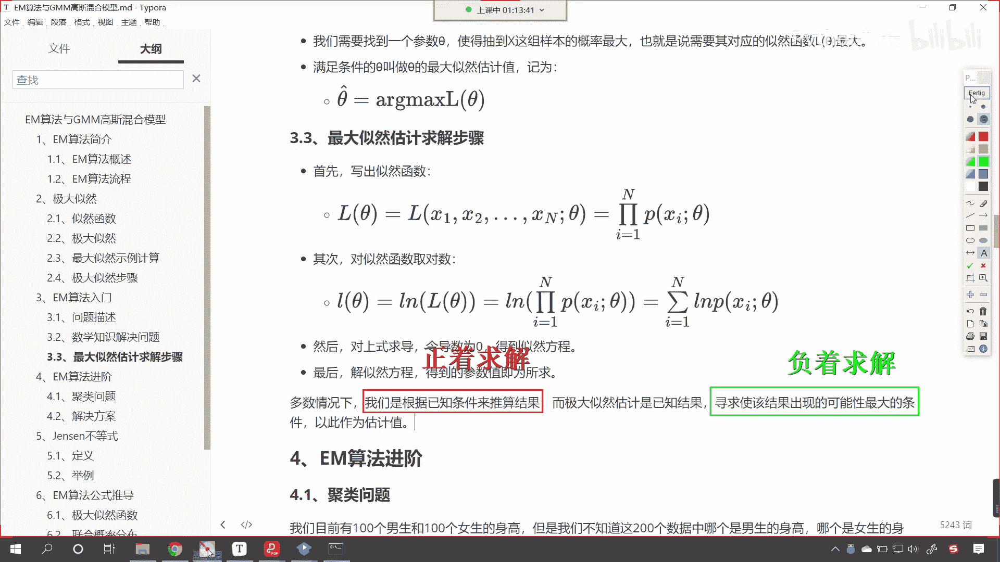
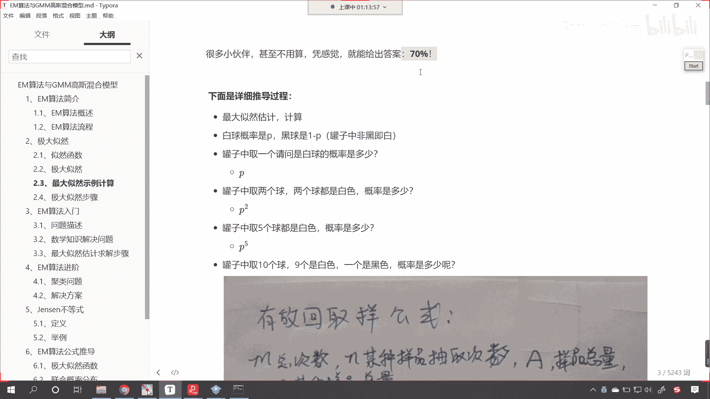
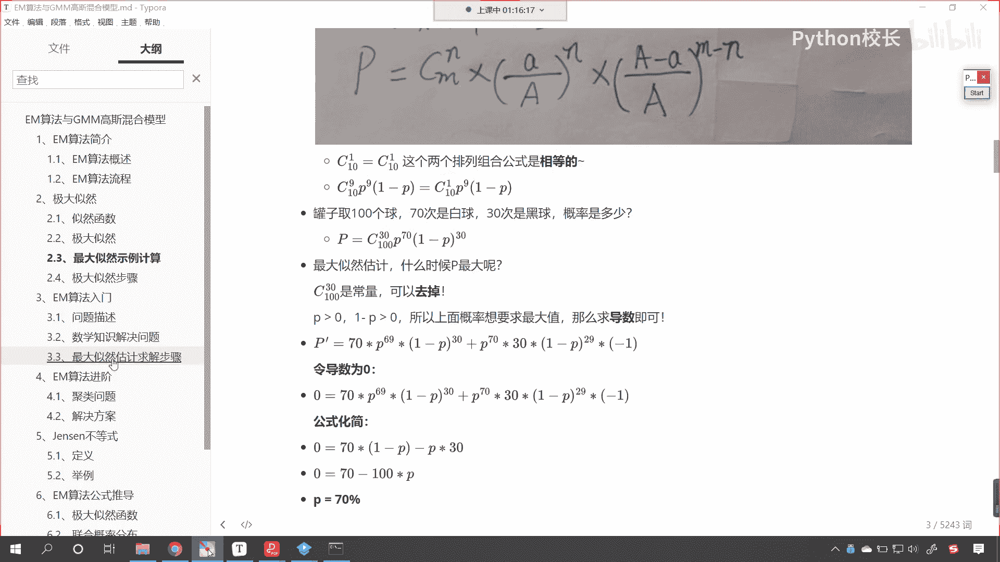

# P172：5-EM算法入门举例介绍 - 程序大本营 - BV1KL411z7WA

来各位小伙伴，接下来呢我们继续往下看，咱们看一下这个em算法是吧，它到底是怎么回事，咱们呢结合具体的问题是吧，我们进行讲解，比如说咱们学校呢需要调查一下，男生和女生的这个身高分布。

我们呢抽取100个男生和100个女生，咱们呢将他们按照性别我们划分成两组，然后呢，我们统计抽样得到的100个男生的身高数据，和100个女生的这个身高数据，那，我们知道他们的身高肯定是服从正态分布的。

对不对，那如果要是正态分布的话，那正态分布是不是有一个概率密度公式呀，那这个概率密度公式当中呢。

是由它的均值和方差来确定的。

我们往下滑，现在你就能够看到正态分布，也就是高斯分布，它的概率公式是不是这样的，那这个公式是谁推导出来的，是不是就是高斯呀，看到了，这个就是高斯推导出来的，一个概率的一个分布公式，对不对。

那这就是高斯推导出来的啊，这个当中的meal就是身高的平均值，这个当中的西格玛就是咱们身高的这个方差啊，就是身高的方差好，现在呢你看咱们统计抽样得到的，100个男生的身高数据，就是把他们的身高记录一下。

把女生的身高也记录一下，那我们知道他们是服从正态分布的对吧，那就一定对应着一个均值和一个方差，就是我们要估计的参数，大家注意啊，这个mu和咱们的西格玛是我们要估计的参数。

这个是不是就是咱们上面所讲到的隐含变量呀，对吧，这个就是隐变量啊，咱们在这说一下啊，看这个就是隐隐含的隐这个就是咱们隐变量，你看这是我们要求解的，那有同学就那有同学就说了。

你看你不是有100个男生的身高数据，和100个女生的身高数据，你直接求一下这均值不就出来了吗，对不对，你直接你直接这个除一下，直接计算一下这个方差不就出来了嘛，对不对，大家注意啊。

咱们这抽样取出来的是不是一个样本呀，对不对，你看啊，这这是一个样本，对不对，有可能你在抽的时候，你想是不是存在一定的偏差呀，对不对，你肯定存在一个偏差对吧，有的时候你可能抽的这个男生。

普遍这个身高他就偏高了，或者抽的时候咱们这个男生普遍身高偏低了，这都是有可能的啊，所以说我们在进行计算的时候是吧，咱们使用什么呢，咱们使用em算法来去求解这个mo和这个西格玛，那我们就根据这种思想。

咱们来进行一个求解，你看已知的是什么样本服从的分布模型，那就是正态分布了，还有就是咱们随机抽样的样本，这个是已知的，对不对呀，那我们通过极大似然估计咱们要求的是谁呀，模型的参数。

那我们已经知道这个模型呢是正态分布了，对不对，那么正态分布它们的核心不就是mu和西格玛吗，对吧，那就是这两个是我们要求的。

那看一下我们怎么求呢对吧，已知的条件是样本服从分布的模型正态分布，另外呢就是咱们随机抽样抽样的样本，也就是说你这个每个人身高多少，咱们都是知道的，那我们要求的是模型的这个参数，咱们根据已知条件。

我们通过极大自然，咱们呢就可以求解出未知的参数，那总体来说呢，极大自然就是用来估计模型参数的统计学方法，大家注意啊，你看到这里，咱们是不是就根据根据这个案例，是不是就将这个极大自然它的作用是什么。

是不是进行了一个说明呀，它是不是就是用来估计咱们模型参数的，统计学方法呀，好那么上面这个问题呢，你看上面这个问题，咱们将问题给引出来了，那引出来之后，接下来咱们把它转变成一个数学问题啊。

看转变成一个数学问题，那我们把问题数学化，这个时候有样本x1 x2 ，一直到x n，咱们假设说这个是男生的数据，那这个n是不是就是100呀，对不对呀，那我们的概率密度呢看到了吗。

就是咱们的p x i冒号c塔，这个当中有一个变量c塔，这个c塔表示什么，你知道此处的theta表示什么吗，看此时的这个theta，大家注意啊，此时的西塔代表咱们的mu和西格玛。

theta呢就表示咱们的参数知道吗，这个c塔就表示咱们要进行求解的参数，theta表示我们要进行，求解的参数，它是这么个意思，好那么你注意啊，你看我们是如何表示概率的呀，咱们是不是这样写的呀。

p看到了吧，我们是这样写的，p小括号是不是给了个xi，然后是不是又给了个分号，分号后边是不是给了个c他呀对，那这个表示概率他什么意思呢，就是xi这个样本在咱们参数c它的情况下，它的概率是多少。

高斯已经为我们推导出来了，正态分布的这个概率，那就是看后面那个公式，你想这个当中，是不是就有一个mo和一个西格玛呀，看到了吧，这个当中就有一个mo和一个西格玛，由于呢100个样本之间是独立分布的。

所以同时抽到这100个男生的概率，是由他们各自概率的乘积，对不对呀，是不是就是一个连城呀，看到了吗，这个时候是不是就是一个连成，这个概率反映了在概率密度函数参数是c塔时，得到的x这组概率的一个。

这这组样本的概率，对不对，你看这个不就是极大自然吗，我们希望它越大越好，对不对，看我们希望我用这个框框起来的，这个越大越好，是不是啊，你看这不就是咱们的极大自然吗，希望它越大越好。

和咱们上面讲解极大自然黑球，白球其实是不是一样的呀，对不对啊，看我们需要找到一个参数，c塔，使得抽到x这组样本的概率最大，也就是说对应的自然函数lc它最大，那么满足条件的c塔叫做c塔的最大自然估计。

即为，现在你就能够看到，我们把最合适的那个值就叫做c塔，上面带着一个向上的小于号，这个就是满足条件，满足条件是不是就是最合适的那个值呀对吧，你看我们把它记作这个，咱们呢把它记作这个，那记做这个。

这不就求解出来了值吗，那一般情况下这个值该如何求解呢，求导数，令导数为零就可以了，好现在你就能够发现，咱们是不是将身高的这个问题，我们把它转换成数学问题了呀，对不对，那有同学就说了。

老师有必要这么麻烦吗，看有必要这么麻烦吗，是吧，有了这100个人的数据，咱们直接求平均不就行了吗，对直接求平均是更简单的方法，但是你看这em是什么，你看这em是不是一个算法，总有一些数据啊。

总有一些数据，你呢是不知道它是嗯这什么样的一个分布，总有一些数据，你呢不像咱们刚才提的这个问题这么简单是吧，我们可以随机抽样，是不是你就好比是吧，因为我没有男生女生，咱们随机从班里边抽出来一些样本。

我们是可以计算的，对不对呀，那有一些问题，你没有办法把它把它这个拿出来是吧，你比如说这个股票的预测是吧，或者说一些一些问题是吧，你没有办法去对它进行这个验证，所以说呢这个时候才有这个算法的问世是吧。

这个算法呢唉也就出来了，我们根据极大似然哎对它进行一个求解好，那么咱们看一下，有了咱们上面把问题的这个数学化之后，咱们呢就最大似然，估计按照这个步骤来进行求解，首先呢我们写出自然函数。

这个自然函数其实就是概率的累乘，然后呢我们对自然函数求对数，因为累乘不容易求，累加容易求，这个时候呢咱们就对它求对数，那它的单调性没有发生变化，之前是单调递增，求完对数之后依然是单调递增。

所以说依然可以求，然后呢咱们对于上市求导令导数为零，是不是就可以得到自然的方程了呀，看到了吧，你这个自然方程这个p有几个参数，根据咱们上面最大。

自然根据咱们上面更正态分布的这个概率嗯。

这个概率密度里边是不是有一个mo，里边是不是还有一个西格玛呀对吧，我们求导数令导数为零，是不是就可以求解出了这个值呀，对不对，你看令导数为零不就有方程了吗，有了方程，那这个mo是不是就可以进行求解呀。

对不对，最后呢咱们解自然方程，咱们得到的得到的这个参数值即为所求，在多数的情况下，我们是根据已知条件来推算咱们的结果，而极大自然是已知结果，寻求是该结果出现可能性最大的条件，以此作为估计，大家看啊。

正好是相反的，那我们把这句话呢对它进行一个拆解，多数情况下我们是根据已知条件来推测结果，就像咱们刚才说的那个简单的做法，有了身高了，我们是不是可以求平均值呀，平均值求了平均值不就是咱们的miu吗。

有了身高数据了，咱们是不是可以计算它的方差呀对吧，你看这都可以计算，是不是看到了吧，有现成的数据，又有相应的公式去计算，这都没问题啊，那么极大自然是什么呢，如果我们把前面当成一个正向的结果。

那么极大自然的它是已知结果，看到了已知结果，咱们寻求的是什么呀，看已知结果，咱们寻求的是是该结果出现的可能性，最大的条件，那如果上面这个叫正着求解，看看咱把上面这个叫做正着，看那这个呢就是正着求解。

嗯正负的正，这个呢就是正着去求解，那么我们这个呢，就是负着相反的方向去进行求解，那这个呢就是负着，求解，反正你只要是合适的一个结果，那么这个可能性一定是最大的，你就好比咱们上面在介绍极大自然的时候。

你看为什么它是70%呢。

对不对，为什么是70%呢，因为这个p是70%的时候，看这个p它是70%的时候。

咱们这个概率是最大的，你看这个概率是最大的，这个方程只有咱们的p是70%的时候，它才是最大的，那么同样你看同样是吧，那我令它最大看啊，看大家明白这个意思吗，来咱们现在呢进行一个说明啊，看这是一种说法。

这个p是70%的时候，看p是70%的时候，咱们前面的方程是最大的，这个大家能理解吗，没问题吧，你看我们再换一种说法，看我们令前面的这个方程最大，那最大其实就是求导数，对不对呀。

嗯然后呢你看那令前面方程最大，那就是导数为零呗，对吧，那就是导数为零，那你导数要为零的话会怎么样，你看你导数为零的话，这个时候咱们求解的p它正好是看，正好是70%，看这就是咱们刚才em算法所介绍到的啊。

这就是刚才em算法所介绍到的，也就是说你你p是70%，这个方程是最大的，那如果令这个方程最大，求导数求解出来的p正好是70%，那如果说我们要把上面这个你看他是正着走，那下面这个呢你就可以认为它是反着走。

是不是啊，你就像嗯咱们在地球的赤道上，一个人向东走，一个人向西走，最后这两个人是不是依然会见面呀，对不对，他一直沿着赤道向东走，另一个人一直沿着沿着赤道向西走，他们一定会会面，对不对。

哎所以说这就是咱们em算法。

看他这里所说到的这个问题是吧，我们根据已知条件来推算结果极大，自然呢就是知道了这个结果，咱们寻找使该结果出现可能性最大的条件，这个这里所说的条件其实就是求参数，求方程是吧。

把我们需要找到的这个数据给它找到好。

