# P173：6-EM算法进阶举例介绍 - 程序大本营 - BV1KL411z7WA

来来各位小伙伴，接下来呢我们再进一步啊。

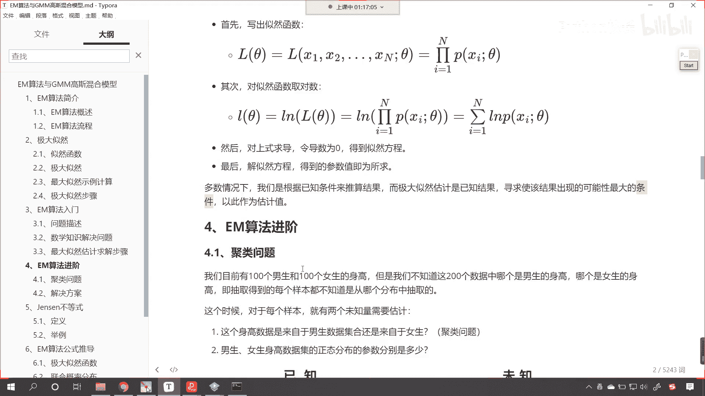

咱们看一下这个em算法的进阶，那么这个时候呢我们就碰到了一个聚类问题了，目前呢咱们有100个男生，有100个女生，但是呢我们不知道这200个数据，到底哪个是男生，哪个是女生，那这个时候我们这个问题。

它就变得稍微复杂一点了，这个时候呢有两个未知量需要估计。

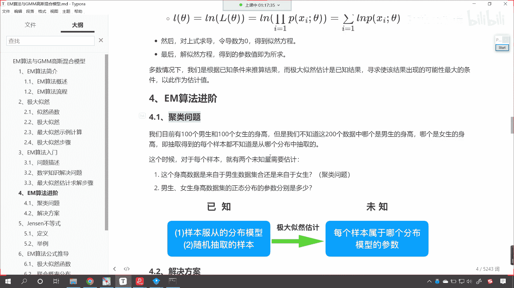

就是这个身高数据，它属于是男生还是女生，唉你看这个时候是不是就有点儿啊，你看是不是它就是一个聚类问题了，之前咱们在讲k means的时候，之前咱们在讲db看的时候是吧，之前咱们在讲分层聚类的时候。

是不是也是给你一堆问题，给你一堆数据，让你对这个数据进行类别的划分呀，对不对，之前也是这样吧，是不是啊，好那么咱们现在所介绍到的这个高斯混合模型，那么它呢就可以用于聚类。

那么我们em算法进阶当中的第二个问题，就是男生女生他的身高，数据集的正态分布参数分别是多少，你看这个参数是不是又让我们去计算它的meal，对不对啊，去计算一下mu，然后呢再去计算一下sigma。

是不是啊，所以说一个问题两个问题，这个时候咱们这个就变得，是不是稍微复杂一点了。

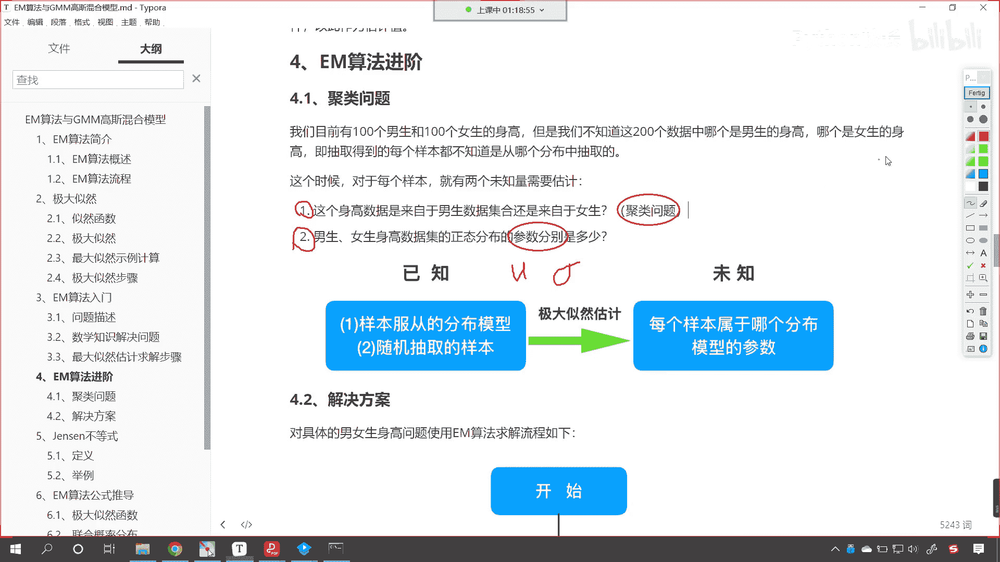

那我们看一下咱们解决方案是什么样的哈，对于具体的男生女生身高问题，咱们呢就可以使用em算法，我们进程我们呢进行一个流程的一个推导好。

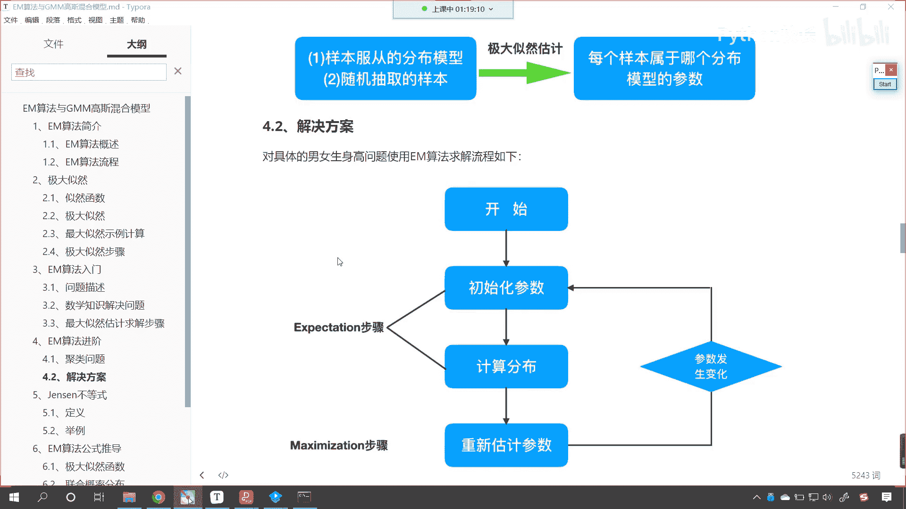

那么现在你就能够看看，首先开始的时候，咱们初始化参数，那这个初始化参数是什么意思呀，我说话比较直接，其实就是瞎蒙是吧，你这个男生的平均值，这个均值是多少，方差是多少，咱们先瞎蒙一个，看这就是初始化。

就是先瞎蒙一个嗯，就是呃使用随机数给他分配一个值，你想你不可能运气那么好，一分配它是不是就正好合适呀，对吧，就像咱们之前梯度下降一样，我们一开始给的这个数值它就是最合适的吗，那不是对不对呀。

那随着咱们梯度下降的进行，无论我们给的这个随机参数，是大一点还是小一点，梯度下降一点点，是不是都靠近了最佳的答案呀，em算法也一样，你初始化的这个参数虽然是随机给的，但是呢我们有一个咱们有一个把知道吗。

咱们有一个靶点儿，咱们有一个目标，有一个方向是吧，就像当年红军长征一样，是不是啊，那是不是就有了这个方向，是不是就是翻山越岭，最后是不是这个星星之火可以燎原呀，可以燎原，对不对，咱们这也一样啊。

那我们这个em算法它的核心是什么，看他的那个靶点是什么，哎就是极大自然呀，我们一开始初始化这个参数，咱们就是让这个概率极大，自然越大越好，你不是最大的，ok那就一点一点去修改这个参数好。

那么所以说这个exception步呢就是计算分布是吧，计算咱们的概率，然后咱们的mac sim mization，那就是重新估计参数，这重新估计参数，其实就是修改咱们的初始化参数，参数发生了改变。

咱们再带进去，那这一步是不是就是咱们的迭代啊，看到了这一步就是迭代是吧，参数发生了变化迭代，那最后什么时候退出呢，看最后什么时候退出呢，当你这个参数发现不再变化了，这个时候呢我们就停止迭代。

好那么大家要注意啊，你看咱们的男生和女生，有的时候这个身高是不是会有重合呀，比如说有的男生比较矮，他可能是1165，是不是，那165咱们在进行划分的时候，这个男生到底被划分到男生这一组。

还是女生这一组呀，那你想这是不是都有可能呀，对不对，我们在进行聚类的时候，咱们在进行分类的时候难免会出错，对不对，难免不可避免会出错，武大郎是吧，身高就是矮，那这个有啥办法，是不是，那谁也没办法。

那这个朗平身高就是高是吧，我相信郎平是吧，比咱们班里边大多数男生的身高都要高，人家是打排球的，是不是，所以你不用担心，就是咱们的这个算法对于这些特殊的数据，那对于这些特殊的数据是吧，其实他也没办法。

就是任何一个算法，就是你这个算法再高级，你只要一旦遇见特殊情况，那么它就失，那么它就这个失效了，你看这个特斯拉的汽车，或者说未来理想小鹏的汽车，在高速上开得好好的是吧，一般情况下没事。

但是但凡遇见特殊的情况，你想他是不是就得车毁人亡呀，就无论特斯拉多高级，你只要遇见特殊的情况，那算法都没用是吧，因为这就是特例呀，但是特例呢它是小概率事件，我们的算法咱们都是通用的一个模型是吧。

我们不考虑异常的情况，对不对，你看咱不考虑异常的情况，你比如说你在高速，你在高速公路上正开车呢是吧，这个时候出现了一个特殊的情况，出现了一个异常的情况，老天爷打雷了，正好把这个车给劈成两半了，车毁人亡。

是不是，你说存在不存在这种情况，那当然是存在的，是不是啊，这种时候呢这就属于是特例哈，我们学算法它都是为了解决一般问题，知道吗，都是为了解决一般问题，所以如果我们要考虑过多的，一考虑这个异常情况。

如果要多的话，那这个时候就容易过，它呢就会出现过拟合的这个情况，所以说呢200个数据，你就把它考虑成200个数据，这个男生和女生呢她是比较明显的对吧，这个身高呢是有一定差距的，那么这个算法算法。

它就会把这个数据呢很好地为我们进行分开，男生的就划归到男生一组了，女生的就划归到女生一组了，当然肯定存在个别的情况，这个划分错误，这个都是可以接受的。

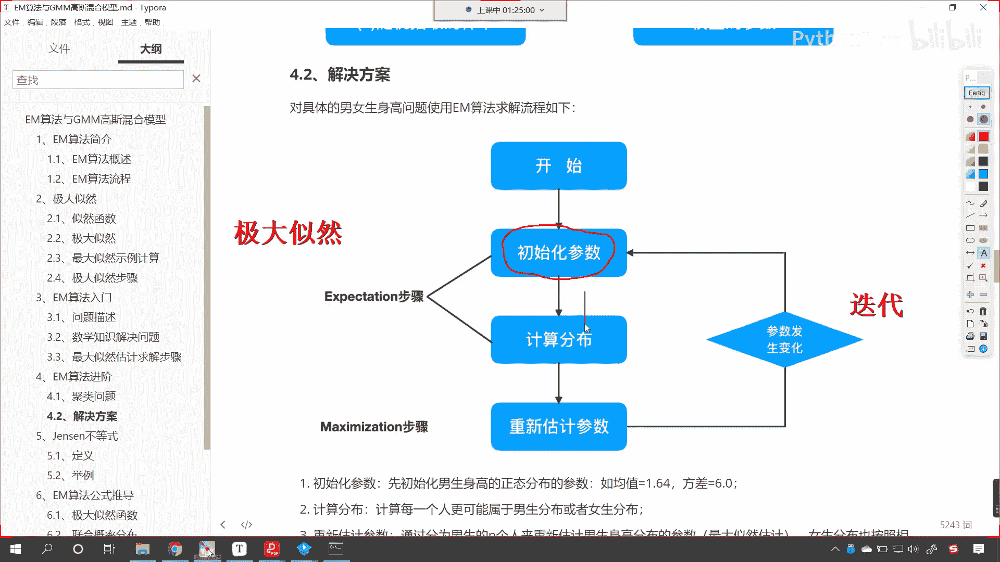

是不是哎这个是可以接受的啊，所以你看那这种情况，咱们的解决方案就出来了是吧。

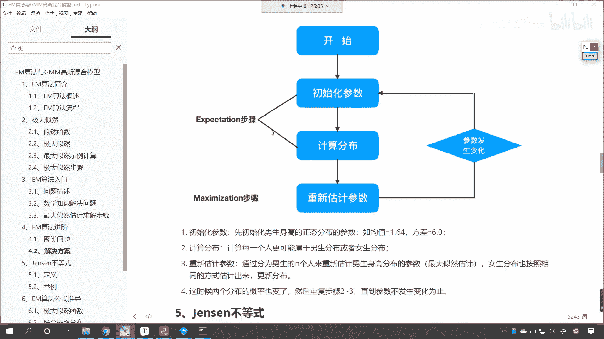

我们初始化参数，比如说咱们先初始化男生身高的正态分，布的参数，均值是1。6，四，方差是六点，这个都是随机给的啊，计算分布，咱们计算每一个人更可能属于是男生的分布，或女生的分布，把它划分一下，注意啊。

那这个计算分布如何来操作呢，看到了吗，计算分布如何来操作呀。

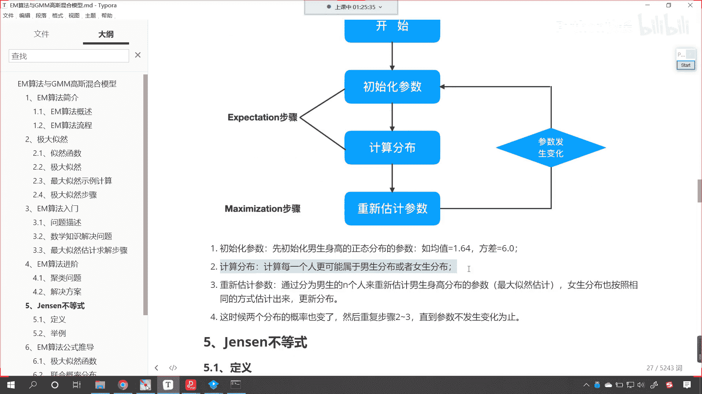

只要这个数据它是正态分布，那我们是不是就有相应的正态分布的公式呀。

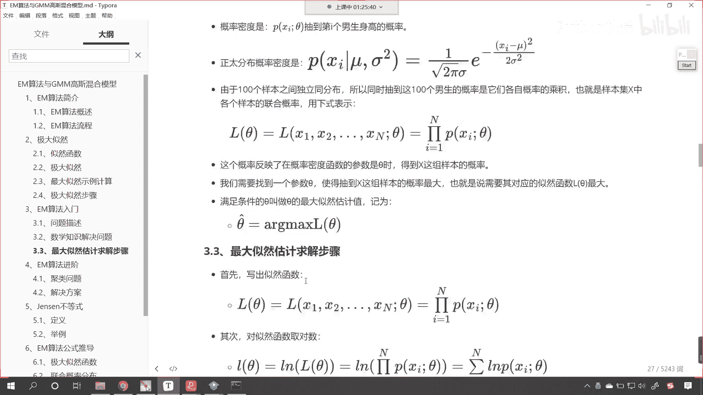

看到了吗，你看这个是不是就是咱们正态分布的概率，密度公式呀，对不对，你看这个就是概率密度呀，男生是不是有一个身高，是不是有一个方差，女生是不是也有一个方差，有一个身高呀，你想你现在有200个样本是吧。

我把这每一个样本带到男生的方程当中，是不是求解出来一个概率带到女生的概率方，概率方程的概率方程当中，是不是计算出来一个概率哪个大，那么这个数据就被划归到那个类别当中。

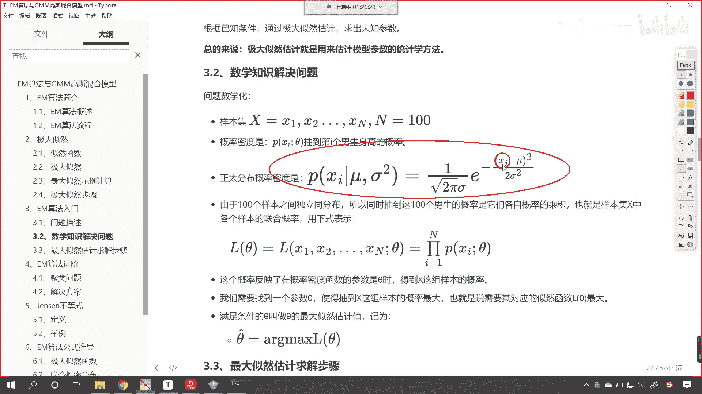

所以说你看这一步叫做计算分布。

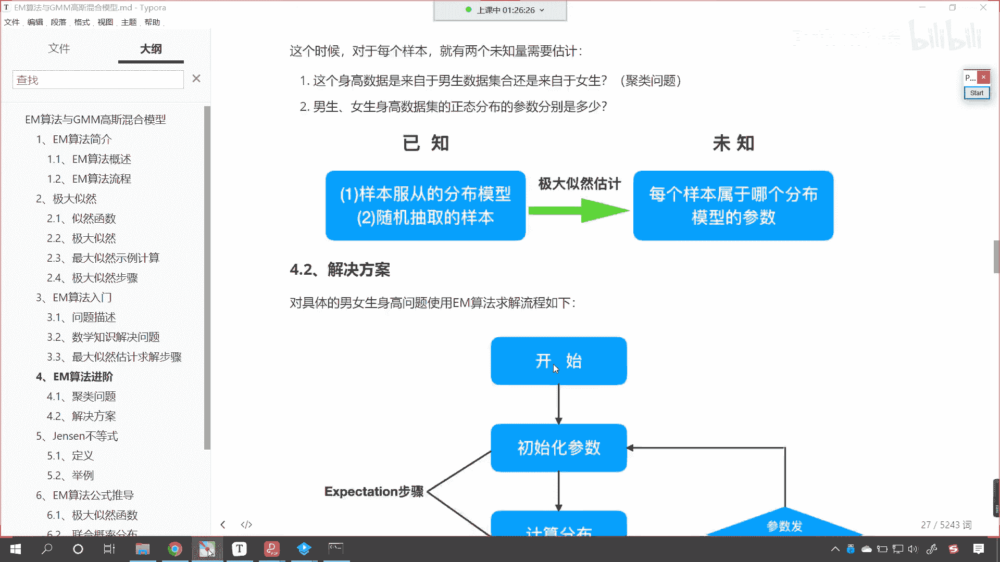

咱们是不是就可以根据男生，女生的概率密度函数，也就是正态分布来进行计算呀，我们就可以给它初步来一个划分，那么有了这个划分之后，接下来呢咱们第三步就是重新估计参数，你看你现在现在咱们不是分成了两类吗。

分成了一个男生和女生对吧，嗯在这儿呢进行一个说明啊，这个计算分布呢，也就是说咱们将男生和女生给它化开了，化开了之后你分成两类了，这个时候是不是就可以重新估计参数了对吧，我们重新估计参数。

咱们是不是使用最大自然呀，你一旦使用最大自然计算，这个时候呢你原来声明的这个均值和方差，它就会发生改变，改变了之后，咱们继续根据改变的值再次计算分布，看到了吗，根据改变的值再去计算分布。

这个时候是不是又得到一个男生的分布，和一个女生的分布呀，然后再去重新估计参数，这个时候呢两个分布的这个概率也变了，我们得需要重复步骤二和三，看到了重复二和三，直到参数不发生变化为止，如果它不发生变化了。

这个时候说明最大自然这个时候它是最大值，那是不是就说明我们把数据给分开了呀，你看是不是非常巧妙，你仔细琢磨一下啊，你再琢磨一下，你看它是怎么操作的，我们有200个数据，对不对，有200个数据。

那我们知道这个里面的数据要么是男生，要么是女生，咱们要把它分成两类，对不对，看要把它分成两类好，那么这个时候男生和女生的身高数据，我们假定他咱们知道它呢是一个这个正态分布，正态分布。

那这个时候就方便了正态分布的概率，方程当中一个是均值，一个是方差，有了均值，有了方差就可以计算概率，别看那个方程比较复杂，其实里边都是除了这个均值方差之外，都是常量，很容易就可以计算。

那我们给男生看到了吧，咱们给男生一个均值一个方差，同时女生是不是也有一个均值一一个方差呀，看到了吧，女生也有知道吗，女生也有均值和方差，那有了男生女生的均值方差，咱们这个时候呢就可以计算分布了。

那么计算分布，那把200个数据带到方程当中，谁的概率大，那就把它划归到哪一个类别，看这个时候就分类了，分好类之后呢，重新估计参数，你分好了类不一定是最合适的，对不对，看不一定是最合适的。

我们根据分好的类，然后呢重新来估计男生身高分布的参数，重新进行计算，使用的就是最大自然概率公式是吧，然后呢女生也按照相同的方式估计分布更新，估计出来更新分布更新咱们的参数最后是吧，重复2~3步。

直到这个参数不发生改变，这就说明我们就求解了，所以你看这个呢是咱们em算法进阶。

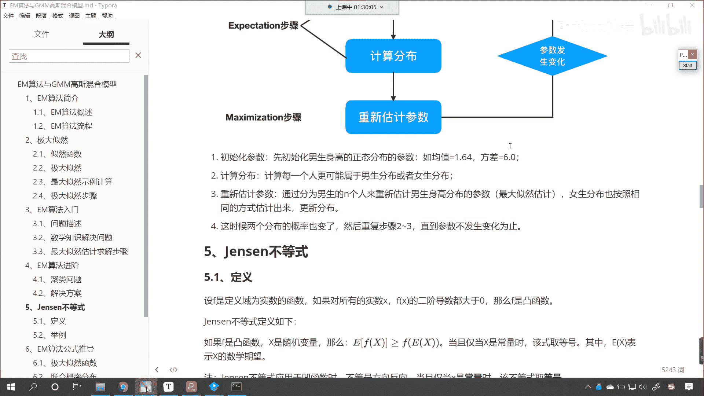

我们又举了一个例子来进行说明。

这个如何进行聚类，那我们这个算法它叫做gmm高斯混合模型。

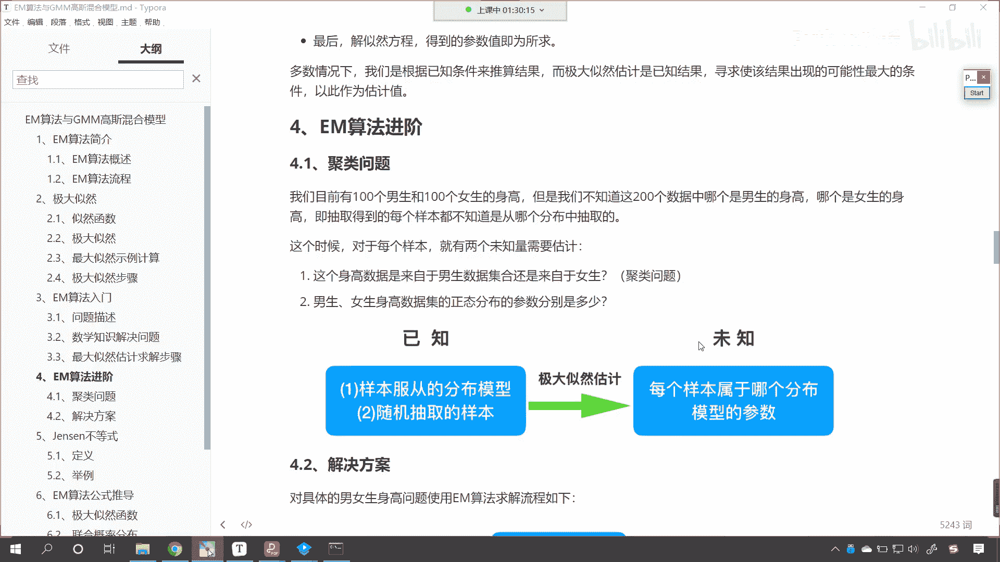

咱们这个算法在进行应用的时候，它其实呢有一定的限制，也就是说我们的数据最好是正态分布的数据，那么咱们使用高斯分布模型，这个效果就会很好。

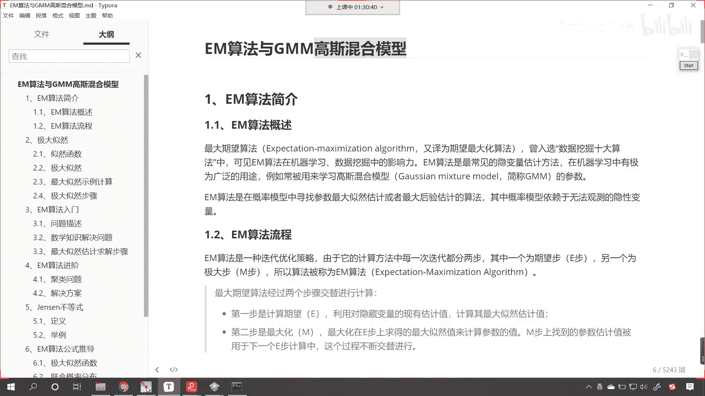

知道吧，因为我们算法的推导，咱们就是根据正态分布来进行划分的，所以正态分布的数据使用这个算法，那效果就很好，而其他的这个分布，其他类型的数据，比如说这个二项分布效果就不太好，效果就不太好。

比如说你投硬币出现的这个情况，是不是就是正面和反面只有这两种情况呀，如果这种，如果这个这个时候你使用高斯混合模型，来对于数据进行聚类分类，效果就不太好，大家要明白啊，因为这个算法推导它是基于正态分布。

基于这个最大极大自然，所以说那也就限定了这个算法。

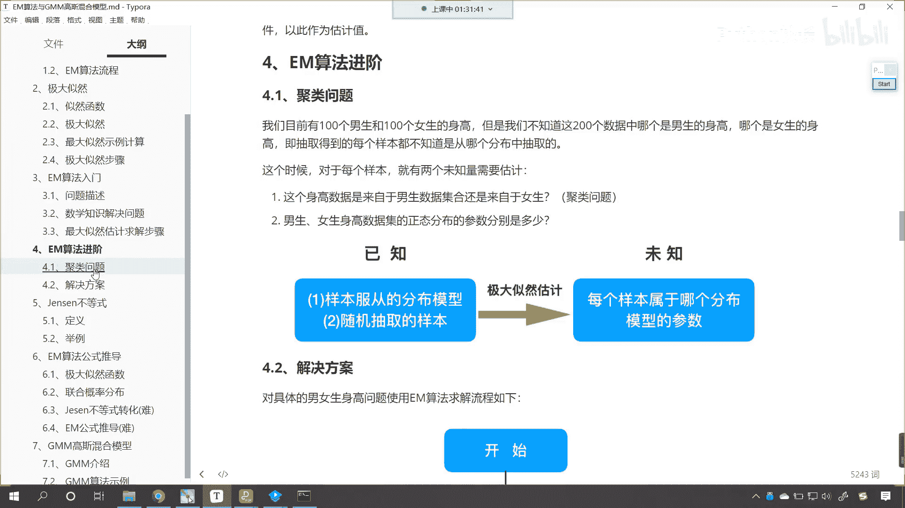