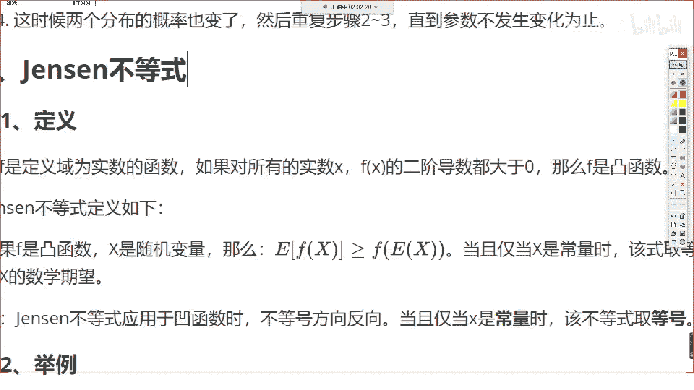
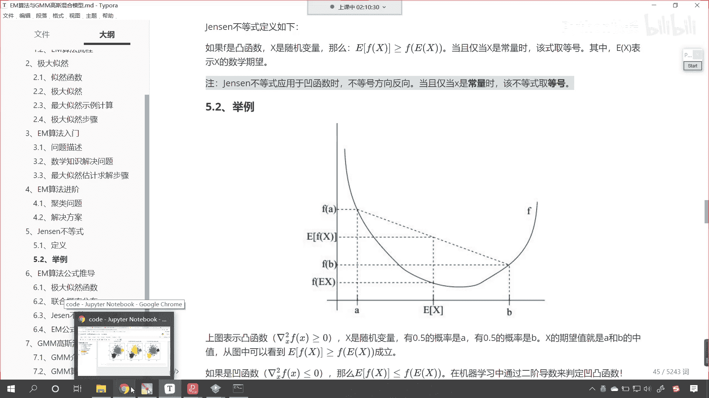
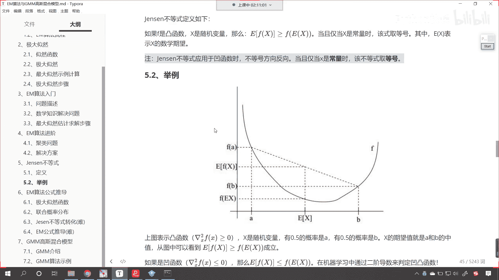

# P175：8-Jessen不等式介绍 - 程序大本营 - BV1KL411z7WA

好那么我们看一下这个jason不等式啊，那这个jason不等式呢，在我们em算法公式推导的这个过程当中用到了，咱们今天晚上可能这个em算法这个公式推导，这个可能这个没有时间讲了。

下一节课我们讲em算法公式推导，今天晚上咱们先看一下这个jason不等式，它到底是怎么回事，我们设函数啊，设函数它是定义域为实数的一个函数，如果对所有的实数x fx的二阶导数都大于零。

那么咱们的f呢就是一个凸函数，这个咱们之前在讲线性回归的时候，介绍过凸函数，是不是啊，大家要注意啊，这个凸函数你可以把它理解成，你要这样理解它呢是一个下凸函数，看到它是一个下凸函数，它是这样的，知道吧。

这这叫下凸，嗯呐这是这是这样的，那我们中国呢这个文字它属于是象形文字是吧，因为我们中国有汉字是不是有凸有凹呀对吧，我们有凸有凹，你知道这个很多数学公式，数学的定义是不是都是英国人，美国人。

欧洲人他们他们提出来的呀，对不对，所以说一些概念引入到中国之后，咱们和咱们中国的这个象形文字是吧，他就产生了冲突，这按道理来说，你如果要看到这个图形，看你要看到这个图形，我问你它是什么形状的。

咱们99%的中国人都会说这个是all的，对不对呀，但是呢在数学当中看，在咱们这个机器学习当中，我们把这个叫做凸函数，知道吧，这个就叫凸函数，那为了表述方便，咱把它叫什么呢，我们把它叫做下突。

这样你想我如果要指定方向，我们把它叫下图，这个时候是不是，全世界的人都不会有任何疑问了呀，对不对，你看我们把它叫下图向下凸起，是不是啊，所以说这叫下突好，那么咱们看一下这个jason不等式。

到底是怎么回事啊，其实呢jason不等式哎，就是咱们这个情况看看这个jason不等式。

看它呢就对应着这样的一个公式，看就这个看，如果f是凸函数，x是随机变量，那么咱们e fx大于f ex这个e表示什么平均啊，这个e它就表示平均，知道吗，这个e就表示平均，这个当且仅当x是常数时。

该是取等号，你x是一个常数，是不是就表示它是一个数呀，你如果是一个数的话是吧，你想你求一个数的平均值，是不是就是它自身对不对，所以说它取等号看到了吧，当且仅当它是一个数的时候。

那么它取等号ex呢表示咱们的数学期望，那数学期望大家就可以这样理解，其实就是求平均值，那么我们这儿呢这个jason不等式它是这个e的，fx是大于等于f1 x我们对应的是凸函数。

那有凸函数是不是就有凹函数呀，对不对啊，凹函数就是看这样的啊，凹函数叫上凸，看这样的，我画的这个叫做凹函数，那么咱们的不等式呢就取反就取反向，当且仅当x是常量时，不等号不等式取等号不太理解，大家理解吗。

理解这个公式的含义吗，看这个公式到底是啥意思呀，来咱们举个例子你就明白了，看举个例子，现在啊我图形当中，这个函数它是不是一个凹函数呀，看到了吧，是凹的，是不是下凸的，凹呃，咱们这个是下凸函数，对不对。

它是凹型的下凸函数，现在你就能够看到啊，因为这个凸函数呢它的二阶导数大于等于零，x呢，假如说是随机变量，这个假如说我们有0。5的概率是a看a在哪，你能够看到啊，咱们的a是不是对应这个地方，这个b你看0。

5的概率是b，也就是说你这个x呢是咱们一个随机变量，也就是说我们要取一个数字，那你这个x到底取a还是取b取a的概率，0。5取b的概率也是0。5，x的期望是不是就是a和b的这个中指呀，看到了吗。

期望就是咱们的中指，你看这个是不是就是x的期望呀，看这叫ex，你看对不对，是不是这个是ex是不是就是x的这个期望对吧，那从图中我们就可以看到，看e的f x大于f1 x，那这个f e x对应哪个数值呀。

是不是就对应这个看到了吧，是不是就对应这个，看是不是它咱们画一个点比较方便啊，咱们现在给一个绿色的啊啊啊，就是f1 x，你看是不是就对应这个点，对不对，那么e的fx呢，你看你的e的fx他表示哪个值呀。

看e的f x该怎么算呀，你看它是不是应该是这个点儿和这个点儿，他俩求平均值呀，他俩求平均值是不是就对应着这个值呀，你看到了吗，他俩求平均值是不是就对应它，你现在你看你现在有没有发现咱们的e的f x。

它是不是属于是all米呀，看到了吗，它是因为它属于是因为咱们这个函数呢，它是一个o型的，是不是o型的，那也就是说，a和b的期望，它所对应的函数值，是不是小于咱们b点的函数值，是不是也小于a点的函数值。

你既然这个点的函数值小于a点的函数值，也小于b点的函数值，那你想a点和b点函数值的平均值，是不是一定大于等于，你看它是不是一定大于等于咱们的，看是不是大于等于咱们的f1 x呀，看到这各位小伙伴。

你明白咱们的jason不等式它是怎么回事了吧，一看图你就明白了，现在呢我们再来描述一下啊，看这个公式到底是怎么一回事，看就这个公式是吧，它表示的是啥意思呀，咱们给一个红色的点，红色的点就是咱们的啊。

就这个点就是咱们的f e x看就这个点，看这个点就对应着，看看咱们的f1 x，那e的fx呢就表示咱们换一个颜色看看，就表示这个点，看到他就表示这个点和这个点这个点叫fa和fb，看到了吧。

那他俩的平均值就是e的fx，看他俩的平均值，那平均值也就是说你如果把fa和fb求平均是吧，其实就是这个点看，其实就是这个点，你一求平均就是这个点看就是谁呢，就是咱们的e的f x看到了，就是它。

那很显然这个蓝色的底怎么样，大于蓝色的点是不是大于咱们的，看它是不是大于等于看到了吧，他是不是大于等于咱们的红色的这个点呀，所以说才有的这个方程，明白吧，一看图你就明白了。

有的时候我们一听jason不等式，这个jason是一个人，感觉这个人好牛逼呀，是不是推导出来这样的一个公式，哎呀其实我一看我也懂是吧，如果你给自己起一个名字是吧，叫boss是吧。

嗯他如果没有发现这个关系，你也可以用自己的名字是吧，命名一下叫波森不等式是吧，谁先发现就用谁命名是吧，有的时候呢你不知道它是什么含义的时候，我们老感觉特别高大上是吧，其实这些数学家无论他多伟大。

他是不是也得这个吃饭睡觉是吧，也得这个挣钱是吧，都一样啊，我们每一个人，我们在学习的过程当中，咱们呢都会这个偶像崇拜，或者说这个牛逼的人是吧，把我们给照耀的给照小了，其实我们并比并不比他们差。

那你看他一提出来这个我们一看我们就明白了，现在你是不是知道万有引力啊，明白吗，牛顿是不是提出了万有引力是吧，你现在如果说牛顿要不提出来万有引力，那是不是就该你提出万有引力了对吧，你看万有引力是吧。

一句话是吧，但是这多少人多少人都没有想到呀对吧，这个数学我们学着学着学着就发现是吧，这个其实都是来源于我们的生活是吧，来源于我们就是和数学家比起来，咱们就欠缺一点总结，知道吗，我们就总结没有，他们好好。

那么呃到此为止呢，咱们聚类算法无监督学习算法。

咱们呢就告一段落了啊，看我们这个内容呢，咱们是从看看这个聚类算法，22 23，24，25 26，这个都是无监督学习的算法，咱们刚才说看咱们刚才说这个。

我们呢就是不善于总结是吧，这是我们和大佬们的差距，那么咱们今天晚上的作业呢。

咱们把我们无监督学习算法，包括聚类降维，我们进行一个总结，好不好，咱们今天晚上的内容呢。

