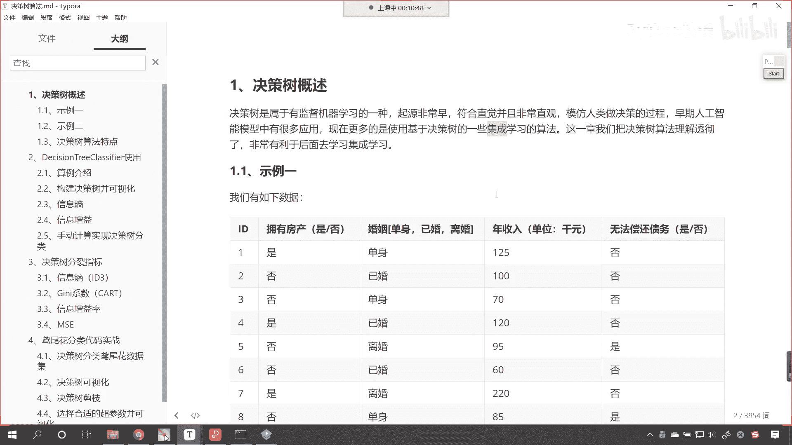
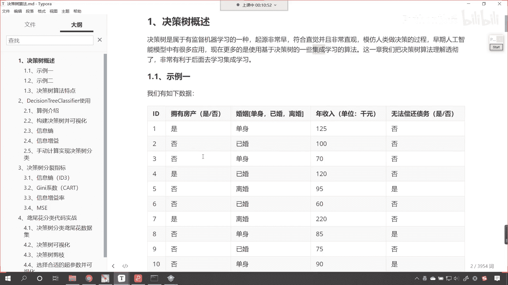
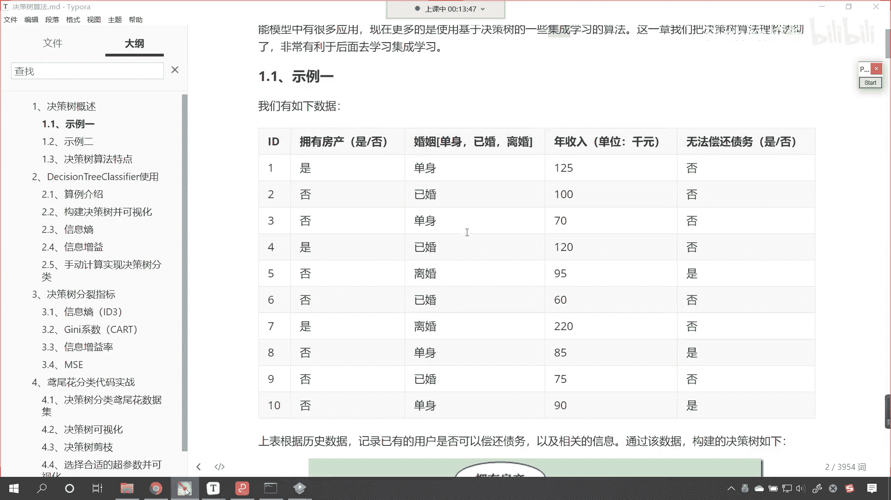
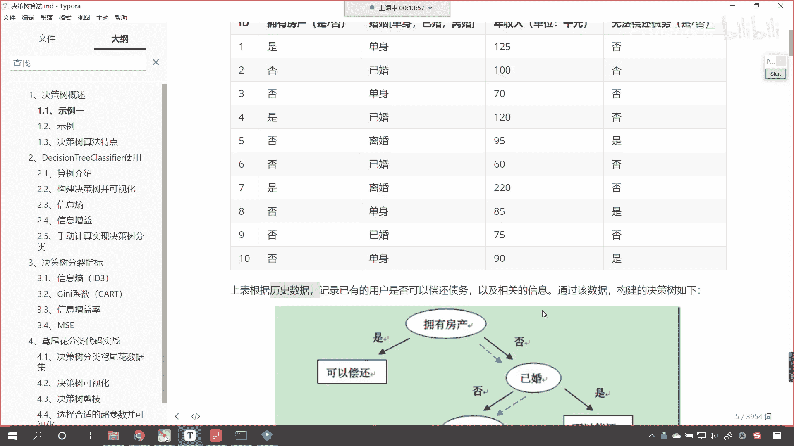
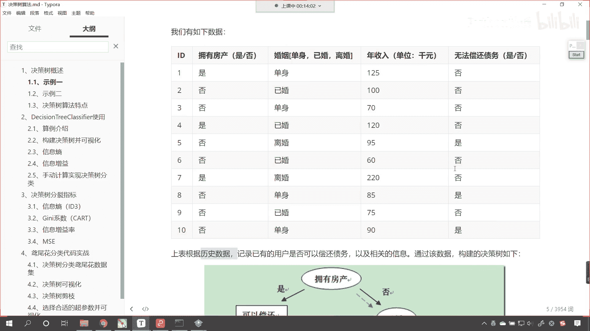
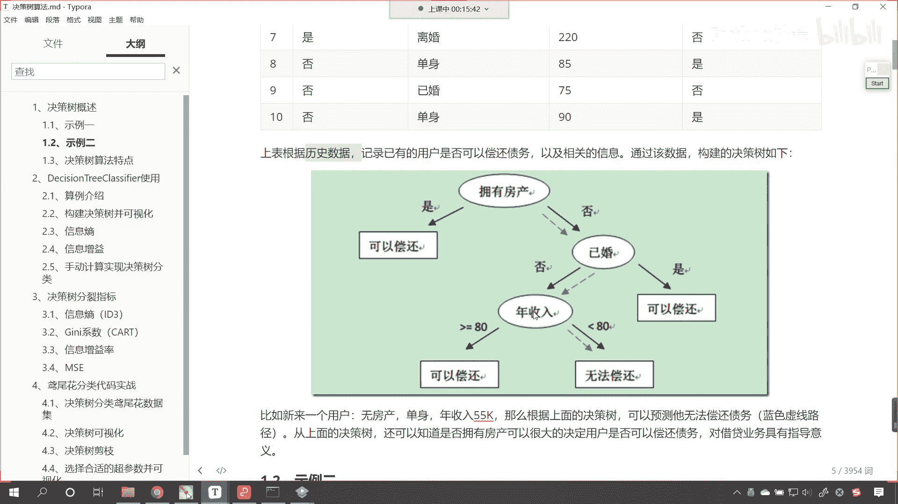
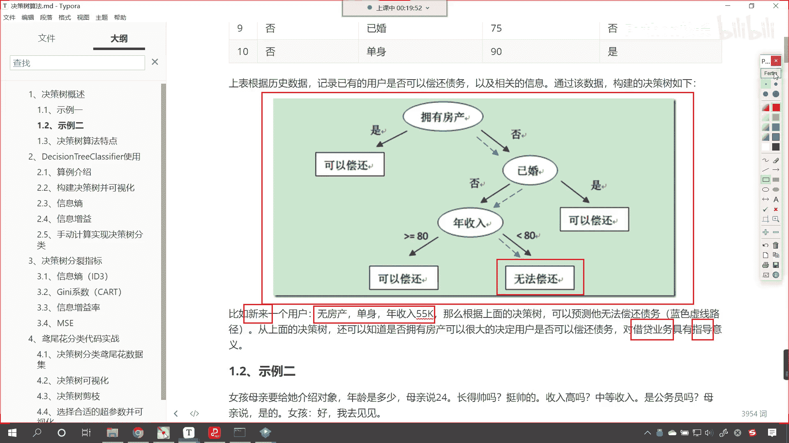
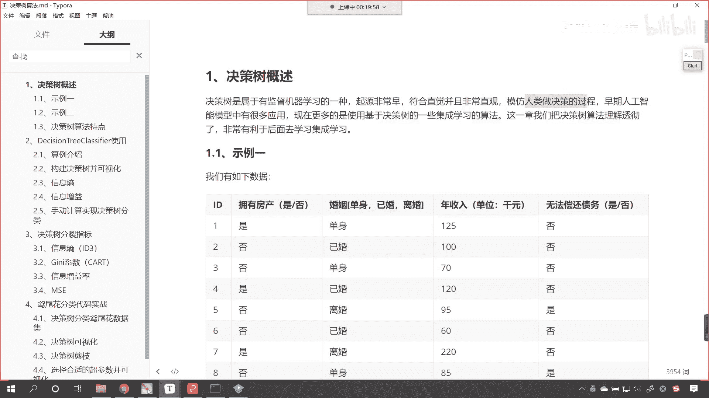
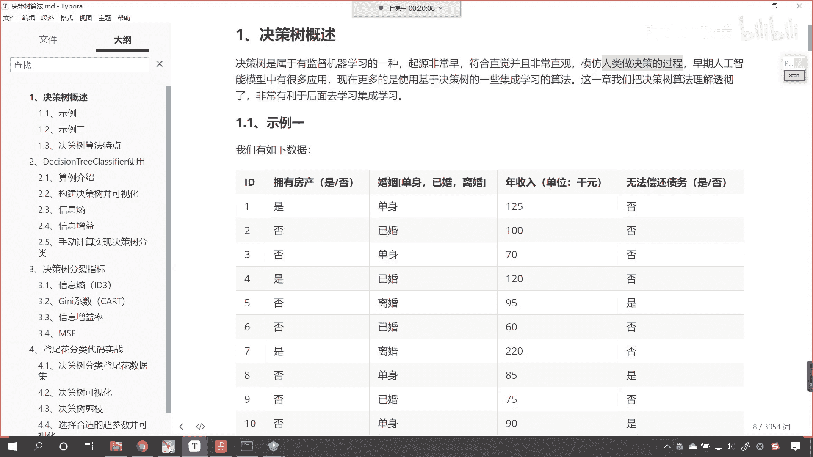

# P176：1-决策树概述示例一（债务偿还） - 程序大本营 - BV1KL411z7WA

好，咱们今天晚上呢要学习的这个内容呢是决策树，你在生活当中是不是见过树呀，这什么是树呀，是不是有树干，是不是有树枝，再往上的话是不是还有树叶呀，对不对，那决策树呢它属于是有监督学习的一种。

起源呢是非常早的，那么它呢这个非常的形象直观，他模仿的是咱们人类做决策的一个过程，咱们早期人工智能模型当中，它是有很多应用的，现在呢更多的是使用决策树的一些，集成学习算法。

那后面呢我们会讲到这个集成学习，这个集成学习简单，咱们在这里提一句嗯，就相当于是三个呃，这个臭皮匠顶个诸葛亮，你听过这个谚语，对不对，那这就是集成，这就是集体的力量，那集成的意思呢就是使用多个算法。

咱们一起进行预测，最后的话咱们进行这个把算法得到的这个结果，咱们进行一个合并是吧，最后投票我们来做出最终的一个答案，你就像现在一些比较大的公司，他们是不是会有董事会呀，那一个公司在做重大决定的时候。

其实大家呢都要投票，是不是得半数通过这个决议才能作笑呀，好那么这一章呢我们就把决策树算法理解透，搞明白，对于我们以后呢进行集成学习呢，是非常有帮助的啊，那啥是决策树呀。

咱们先看一个事例一，那我们有如下的数据在这儿呢。

你就能够看到咱们这个数据呢是这样的，这个拥有房产，这个结婚与否，还有这个人年收入，最后呢大家就能够看到，还有一个就是无法偿这个无法偿还债务，你知道这个银行呢，他喜欢呢把钱带给是不是有能力偿还的人呀。

对不对，这样的话他可以挣到呃这个一部分利息，然后这个钱呢还可以回来，对不对好，那么我们在判断一个人，他是否可以偿还债务的时候，咱们都会从哪几点对它进行考虑呢，你比如说一个人是吧，他的偿还借贷的情况。

你看我们偿还借贷，一个人是否可以偿还借贷，你想那跟这个人跟它的特点，跟它的特征是不是有很大的关系啊，你比如说这个人呢，他是北京户口，上了清华大学是吧，在国家单位工作，或者说在北京的这个互联网大公司工作。

像阿里巴巴呀，像腾讯呀，像这个百度呀，那银行根据他的这些条件是吧，那是不是就可以给他放款呀对吧，一下子给他放30万也没有关系，因为这个人一定有能力把这个钱偿还掉，那我们这个事例呢。

咱们三个红色的框表示这个人的属性特征，最后这一列呢是他是否可以偿还债务，你知道有的人是吧，这个借了钱是吧，他就没打算还这个叫做恶意的骗贷，银行一定有坏账，是不是好，那么比如说我们是否拥有房产，婚否是吧。

你想这个很多呃，这个结婚和不结婚，你的责任和义务是不一样的，还有咱们的年收入，有的年收入高，有的年收入低，是不是那年收入高的人，那你想它偿还债务的可能性，是不是就更大一些啊，对不对。

那最后一列呢是咱们的这个目标值，我们可以把前面这三列当成咱们的数据，x后面这一列呢就是我们的目标值，y x和y之间，大家想一下他们是不是有一定的关系，对不对，你比如说咱们的x你是否拥有房产。

是的拥有房产，结婚了吗，结婚年收入多少呢，年收入500万，那你想这种人是吧，他是不是就特别优秀呀，他借了款他一定会还的啊，好那么这是咱们举例所提供的一个数据。

那上表咱们是根据历史数据记录，已有的用户是否可以偿还债务。

大家注意啊，这个是咱们已有的数据，你想银行做贷款业务。

他是不是做了很多年呀，对不对，那他会有很多数据，那咱们就可以根根据这些数据来进行学习。

找见一些规律，比如说我们看到的这个图是吧，看到的这个图它呢就总结了一些规律啊，这第一个判断条件呢就是是否拥有房产，如果要是拥有房产的话，那么这个人是可以偿还债务的，那最后实在不行。

我是不是可以把你的房子给你拍卖掉呀，对不对啊，你资不抵债是吧，没有办法偿还了，ok那拿你的房子来进行抵押，是不是还有那这个拥有拥有房产证，我们在这儿给了个否，否的话，我们再看其他的条件。

就是已婚还是未婚是吧，已婚的话，通常它呢更容易偿还债务，因为咱们说了这个有一个社会责任在这儿是吧，很多已婚的是不是家里都有小孩儿呀，有了小孩之后，你就会发现你的工作干劲儿是吧，就特别的积极了啊。

好那么已婚证是吧，这个已婚这有一个否字是吧，那否的话也就是说有的人已婚了，但是呢他没有偿还债务，那没有偿还债务，我们再根据条件对它进行划分，就是他的年收入是吧，那年收入如果要是大于等于80可以偿还。

要是小于等于80呢，这个就无法偿还了，也就是说你虽然已婚了，但是呢你很穷呀，那这个时候你的债务很有可能就偿还不了了，这样的话银行在对你进行贷款的时候。

那就会根据你的这些属性条件来做一个判断，我们现在都用支付宝，都用微信支付，对不对，那你就能够发现在支付宝或者说在微信当中呢，每一个人都，每一个人都会有一个借款的额度是吧，根据你的这个呃。

根据你的一些属性特征，那这个是算法自动为你分配的，你查一查自己的支付宝上，你的借呗额度是多少，你的信用信用越好，那么你的借呗额度就越高，好大家看啊，咱们上面这个图我们就把它叫做决策树。

看这个图就叫决策树好，那么我们根据这个决策树，咱们呢就可以判断是否要进行放贷，比如说这个时候来了一个新用户，大家看它的条件是这个样的，它呢无房产，现在呢是单身，他的年收入是55k好。

那么咱们根据上面的决策树，咱们就可以预测它呢无法偿还债务，你现在就能够看到，根据这个条件，咱们呢就根据上面蓝色的这个图拥有房产吗，没有是不是就是蓝色的这条线呀，结婚了吗，他是单身，那就是没有结婚。

年收入怎么样呀，年收入小于看大家看啊，咱们这个条件是小于80，你看55k是不是小于80呀，所以我们根据这个决策数，咱们得到的这个结论是无法偿还，对不对，既然无法偿还，那你想银行再对它进行放款借贷的时候。

那这个是不是就会pass掉呀，是不是就会把它过滤掉呀，当然看啊，这个算法他预测的结果只是一个大概，那咱们说如果说这个某一个地区确实存在这样，确实存在这样的用户，你说是不是有一些用户他就讲诚信呀。

讲信用对不对呀，虽然他的年收入是55k，那你想他是不是也有可能会偿还债务呀，对不对，大家注意啊，咱们所构建的模型，咱们都是根据之前的数据，唉我们所构建出来的模型，那大家呢不要太较真儿啊，不要太较真。

你说无房产单身年收入55k，就一定无法偿还吗，这个是不是不一定呀，对不对呀，你看啊这个无房产单身年收入55k，人家有可能信用特别好是吧，砸锅卖铁也要把借的钱还上，这种情况是不是依然存在啊。

但是大家要注意，咱们的算法模型永远都是一个概率问题，明白吗，永远都是一个概率问题，那这个银行呢他是为了减少损失，所以说呢他不愿意去冒这个险，银行呢根据自己之前数据库当中，它的这个交易数据。

它呢哎就可以做出这样的一个决断，就是无房产单身年收入年收入55k，这个呢属于是这个低价值的用户，咱们呢就不跟他做生意了，免得呢这个投资失败是不是啊，免得连本也回不来，那这样的话。

你看这就是这个银行呢这个他做的一个决策啊，好那么这就是上面咱们根据决策树呢，把咱们新来的一个用户，是不是进行了一个划分呀，对不对，好，所以说这个呢对于我们借款业务，它呢是有指导意义的。

你看它是有指导意义的，那你想咱们银行的贷款肯定不能拍脑袋，是不是就做决策，而是根据这个人的数据好，那么大家现在明白什么是决策树了吧，看到了吗，你看决策树啊，咱们所看到的是不是都是一个分叉的，这个效果呀。

那你想这个过程和什么特别相似呀。

是不是和咱们人类做决策的。

这个过程非常相似呀，好现在呢我们所举的这个事例一，咱们呢就将决策树是什么。

