# P177：2-决策树概述示例二（找对象） - 程序大本营 - BV1KL411z7WA

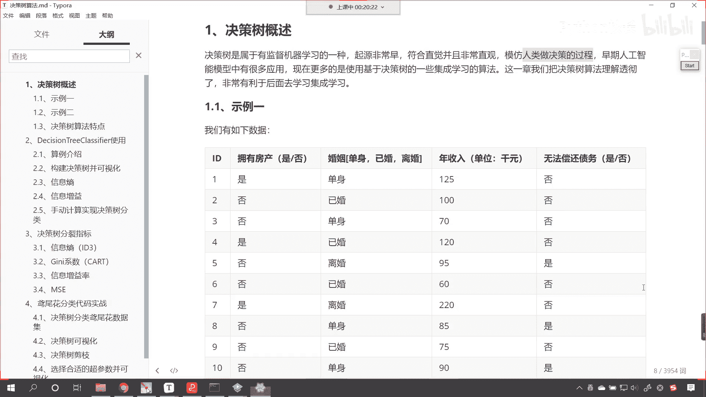

来接下来呢咱们继续往下看啊，咱们再给一个示例二是吧，这个是大家都要嗯都要接触的这个话题，都要遇到的情况，女孩的母亲呢要给她介绍对象，年龄是多少呢，然后母亲说24岁长得帅吗，挺帅的，收入高吗，中等收入。

然后这个女儿又问是公务员吗，母亲说是的，那女孩儿呢就说好，我去见见吧，你看这个女孩是不是根据一定的条件。

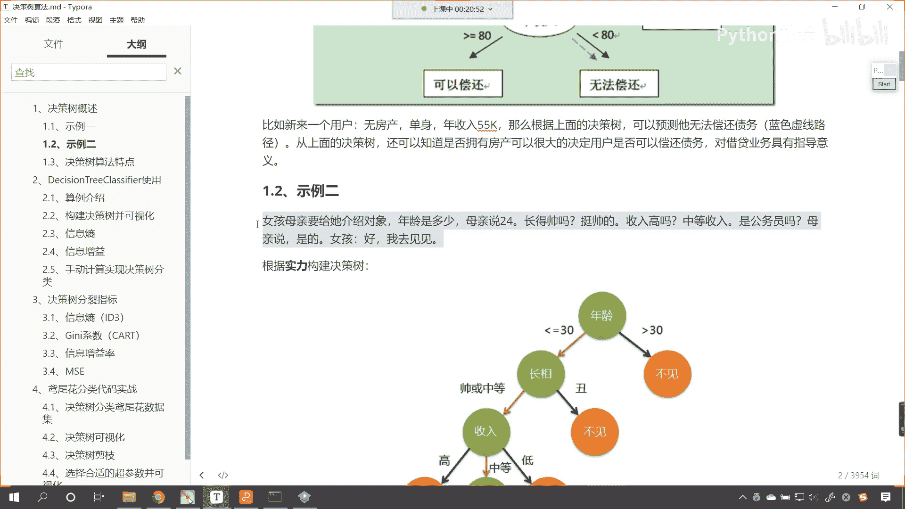

做了相应的这个决策呀，咱们呢就根据这个男士的实力。

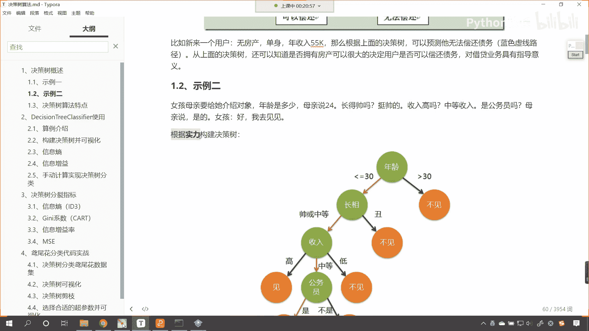

我们呢来构建一下决策树，唉大家现在就能够看到，你看那在这个女孩儿的心当中，你看他是不是就有对于年龄长相，收入和是否公务员，他是不是有自己的一个判断呀对吧。

那他心里边肯定有一个标准，是不是，那如果要是大于30岁是吧，那咱就不见了，别浪费时间了，如果这个长相呢要是丑，那也就不见了，这个长相是帅和中等，咱们见一见，还要看收入高不高是吧，这个收入要是高的话是吧。

那直接就去建你的收入要是低是吧，那就算了，还养这个家里边还养活这个还养不起狗，怎么能够养，怎么能够养得起我呢，是不是啊，所以说你这个收入呢也是一方面的决定因素，那收入如果要是中等的话是吧。

那就得看你是不是公务员了，是公务员建一建，不是公务员，那就算了，你看这个公务员是不是也是很好的一个工作呀，对不对呀，因为他的呃这个工作特别稳定，是不是可以持久的一直干下去呀。

好那么大家看这个就是一个决策树。

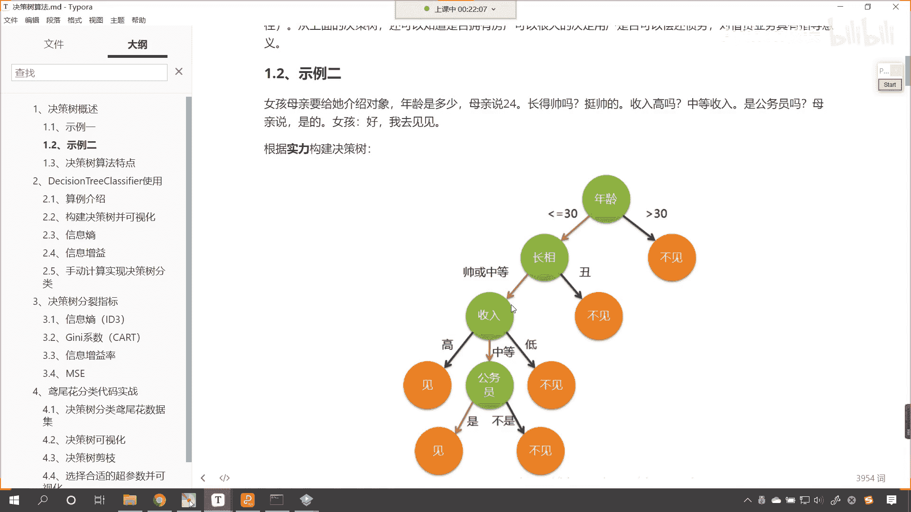

那我现在问一个问题，这个决策树和咱们上面这个决策树，你进行一个简单的对比，看一下它有什么样的区别。

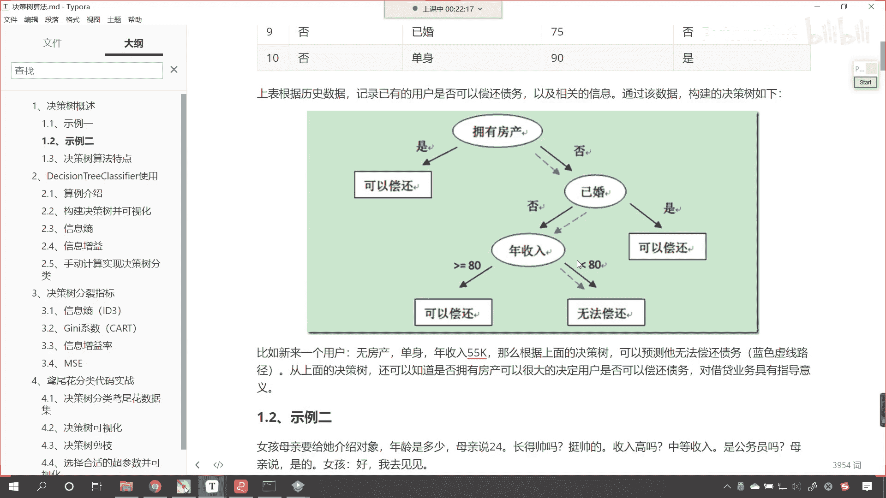

有什么样的不同呢是吧，大家注意观察啊，仔细观察看看有什么样的不同。

有没有观察出来不同呀，看看上面拥有房产。

已婚年收入，下面这个是年龄长相收入，公务员有没有不同呀，好现在呢我把它的这个不同点我给你画出来啊，咱们用框给你画出来，你看一下这个框里边的是吧，看一下这个框里边儿的有什么样不一样，有什么不同。

当然咱们除了金钱，还有外貌，人品前途，是不是啊，那这个有很多啊，咱们这个只是举一个例子啊，明白吗，只是举一个例子，好现在你就能够看到咱们刚才问了一个问题，我们说咱们的事例二当中。

这这棵决策树和事例一当中的决策树，有什么不一样，你就能够发现你看咱们这棵决策树的收入，这是吧，它有高中等和低，那我们在这儿它是不是分了嗯三类呀，看到了吗，你看这个地方是不是分了三个类别，对不对。

你看咱们上面这是分了三个类别，那你回想一下咱们上面那棵树，看咱们上面那棵树，它是不是二分类呀，对不对，二分类，所以说这个差别主要就是在这个地方啊，知道吧，差别主要就是在这个地方。

那现在呢我们给各位介绍一个嗯，咱们决策树当中到底是如何划分的啊，在咱们决策树当中呢，就是在咱们代码当中的决策树，咱们用的就是二分类，知道吧，咱们用的是这个二，我们有这个二分类呢，这个说的是啥呢。

说的是一个这个节点，这个地方它分成几个差，咱们决策树呢当然可以进行多分类了啊，这个二分类呢咱们把它叫做二叉树啊，啊我们把它叫做二叉树好。

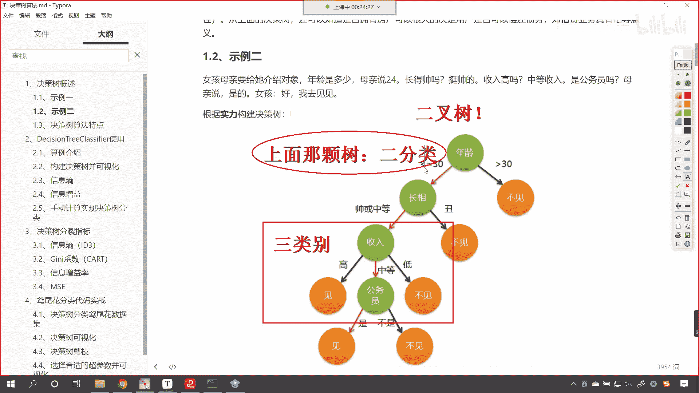

那么现在呢你看咱们这个图片。

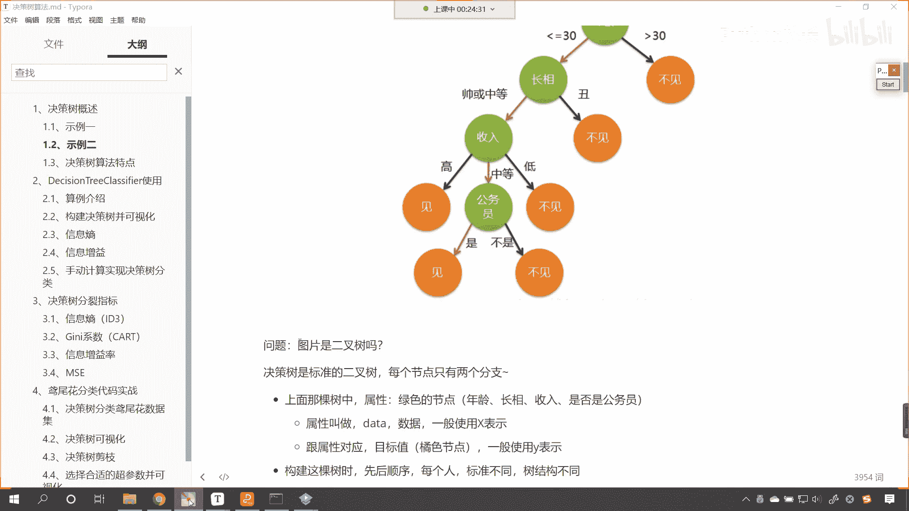

二是二叉树吗，就是咱们年龄长相收入公务员。

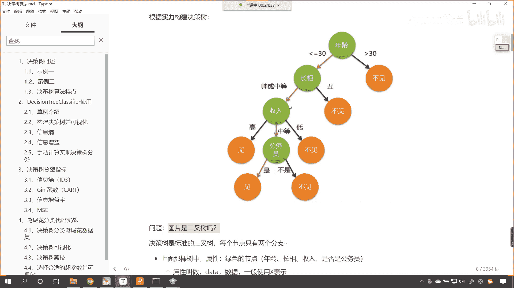

他是二叉树吗，它不是，对不对呀，咱们的决策树是标准的二叉树，每个节点呢它只有两个分支，而咱们上面这棵树当中的这个绿色的，我们把它叫做节点，绿色的叫节点，那对于我们对应着我们的数据，咱们呢把它叫做属性。

看，一般呢咱们使用x来表示，那跟属性对应的就是咱们的目标值，就是咱们上图当中橘色的节点，一般情况下咱们使用y来表示。

咱们构建这棵树石，看咱们构建这棵树的时候，大家想一下是不是会有先后顺序啊。

你看上面咱们在构建树的时候，那这个女生先问的是年龄，那如果要换另一个人的话，是不是有可能会更在意长相，是不是有可能会在意收入，是不是有可能会在意工作呀，也就是说咱们现在这棵树的树顶是年龄。

你想有没有把公务员放到第一个的这种情况，有没有把长相放到树顶的这种情况，有没有将收入放到树顶的情况，是不是都有呀，对不对呀，这个那就因人而异了，是不是因人而异啊。

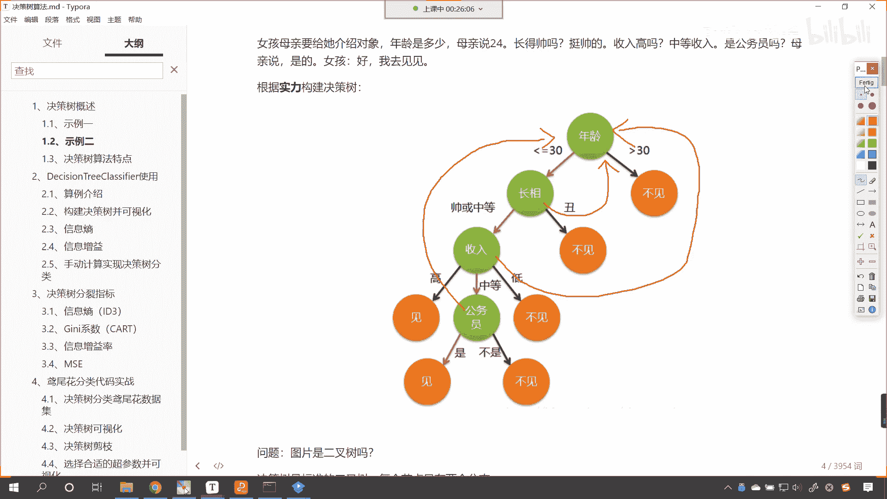

好那么每个人的标准不同。

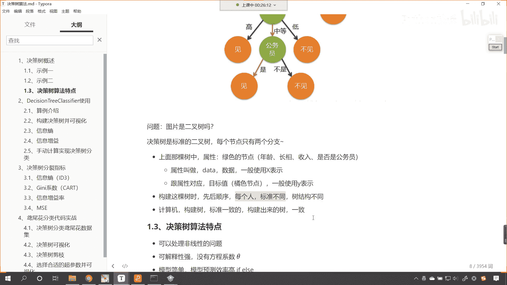

所以说如果要是咱们人来进行划分，那么我们树的结构是吧。

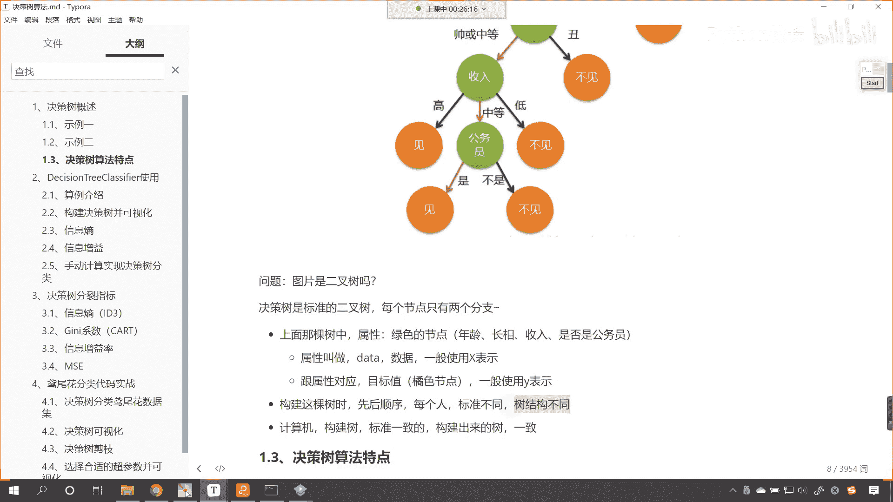

那肯定就不一样了是吧，你就像老师是吧，比较爱钱是吧，那咱们就先看收入是吧，你收入如果要跟马云一样是吧，涨这个涨得好看不好看无所谓是吧，有没有脸都无所谓嗯好。

但是呢这是咱们人人和人的标准不一样，那现在的话我们看计算机啊。

计算机它是不是要根据属性来帮助我们构建出。

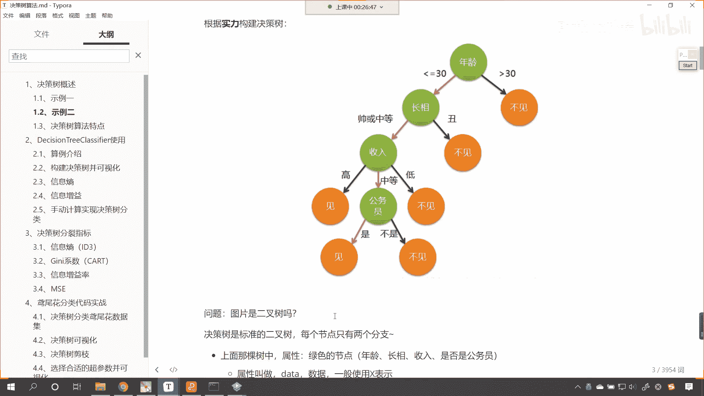

这样的一棵树呀，对不对，你看计算机是不是要帮助我们。

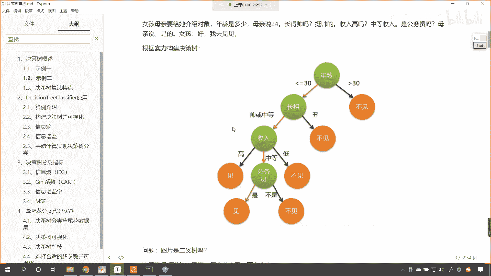

构建这样的一棵树好，那么构建树的时候，计算机的标准肯定是一致的，它构建出来的数呢也是一致的，对不对好，那么这个时候呢咱们就得问一下，那么计算机它到底是如何构建数的呀，计算机到底是如何构建数的好。

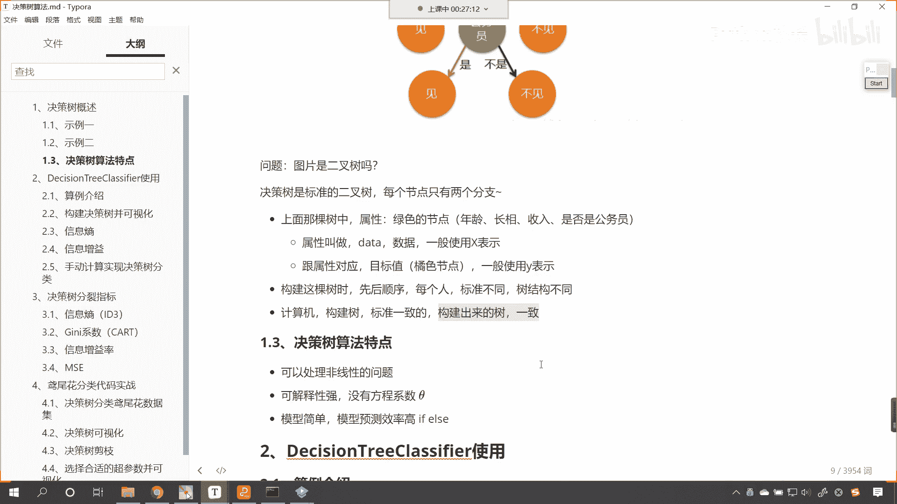

咱们就带着这个疑问是吧，咱们呢就像咱们带着这个疑问，我们就往下看啊，好那么呃最后呢咱们讲完决策树的概述之后呢，我们看一下决策树算法的这个特点，决策树呢可以处理非线性的问题，可解释性很强。

它没有方程系数c，它咱们之前讲的线性回归逻辑，斯蒂回归支持向量机，它当中呢都有方程系数c塔嗯，那这个模型简单，咱们的模型预测效率高，咱们的决策树呢，其实是不是就特别像咱们的if else。

这个条件判断呀，对不对，你看就是说如果你的年龄小于30。

那么哎如果你的长相是丑。

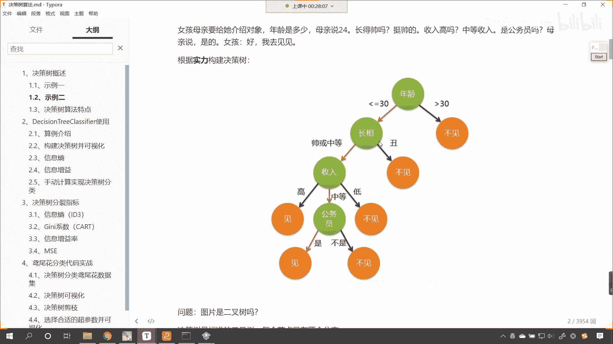

那么咱们就不见了，对不对，所以说呢这个呢是决策树的特点，它可以处理非线性的问题，可解释性强是吧，因为这个决策树的分类，就和咱们人进行分类的时候，唉我们人是如何进行决策的，这个是差不多的。

你一定在电视上看过这样的节目，这样的娱乐节目，主持人问嘉宾这个商品价格是多少，让嘉宾去猜这个商品的价格，猜对了，那么你就可以把这个商品搬回家是吧，那主持人就说，那这个呃嘉宾呢就说这个900。

然后主持人就说价格低了，那你想嘉宾是不是会继续向上猜这个价格呀，对吧，哎所以说这就是条件判断模型，简单模型的预测效率很高，好那么这个呢就是我们决策树概述，咱们又通过示例二，对于绝对咱们决策树的结构。

我们又进行了一个讲解，咱们的决策树代码当中的决策数它都是二叉树，明白吗。

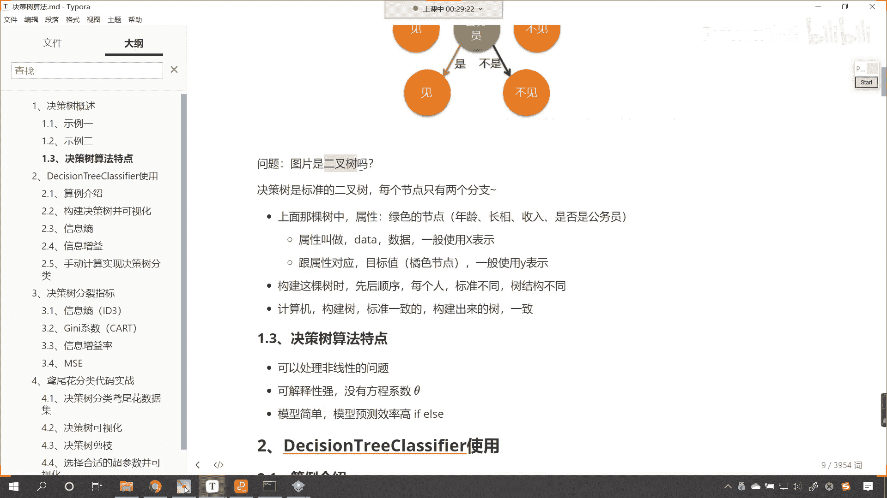