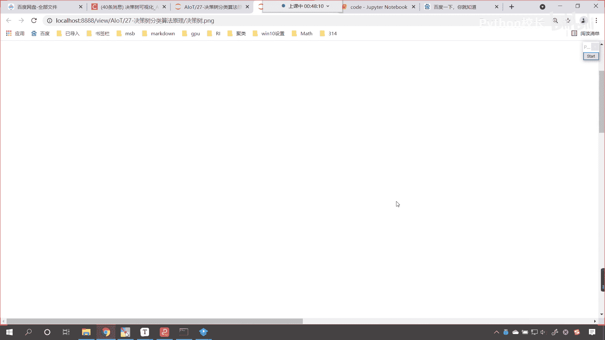
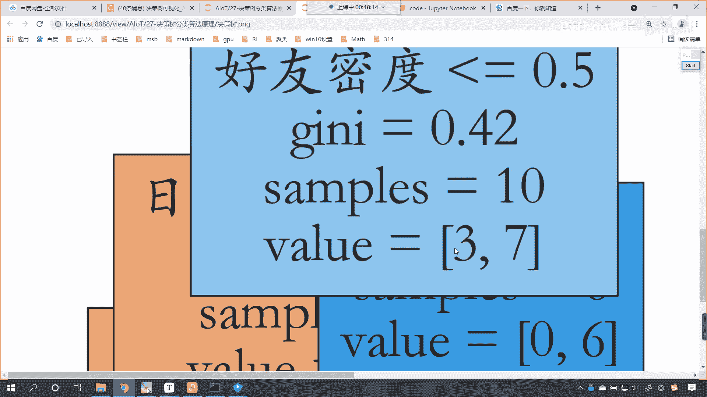
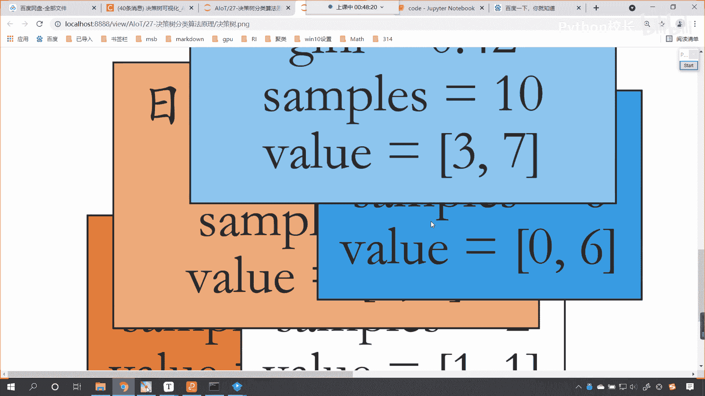
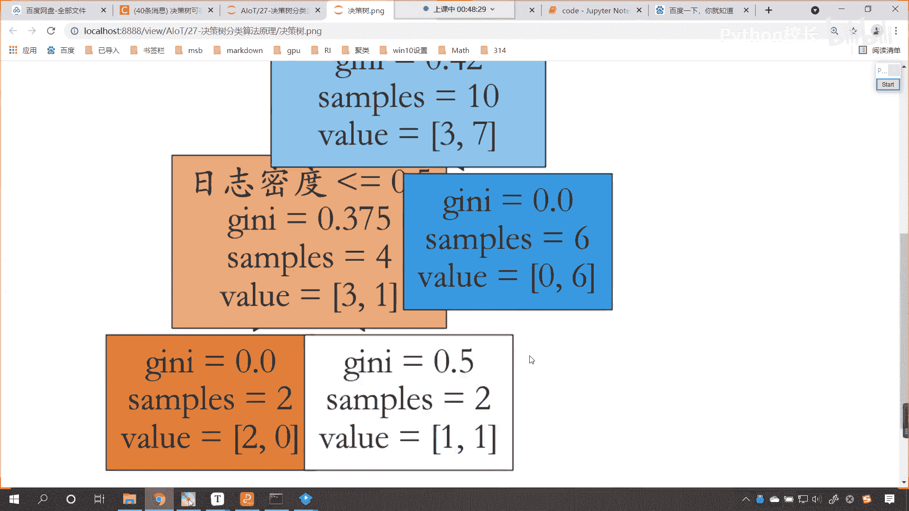
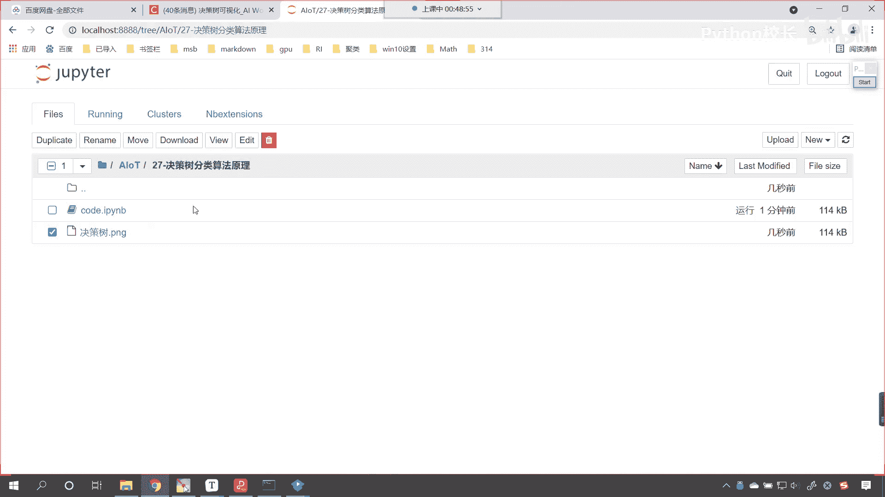
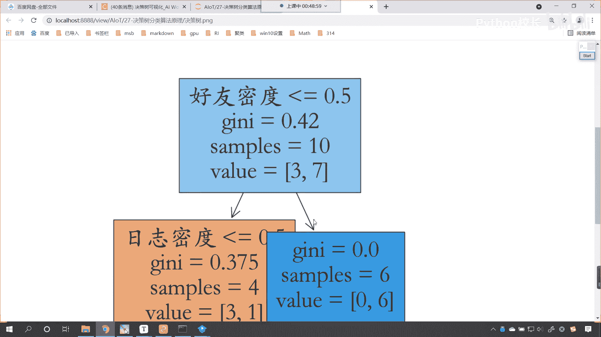
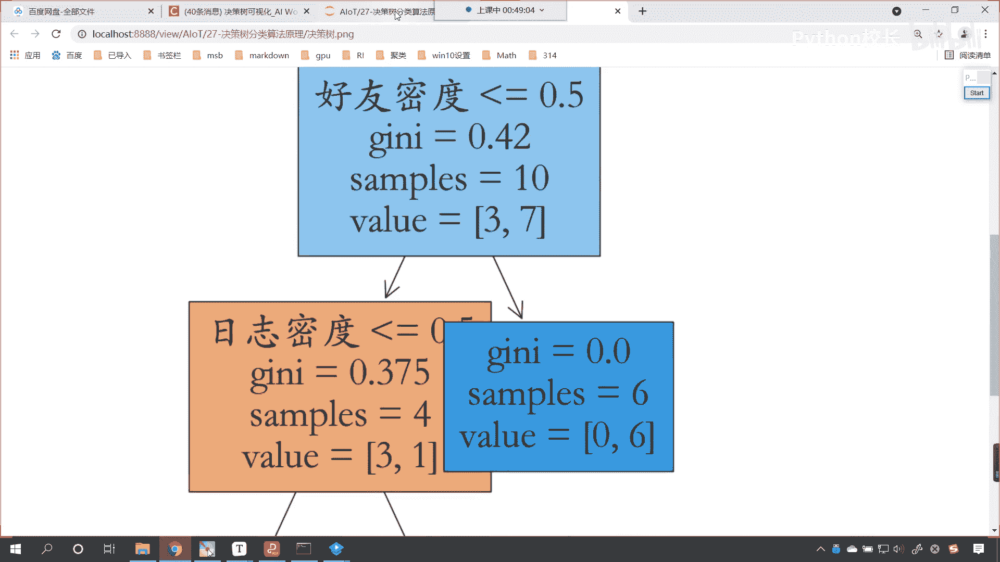
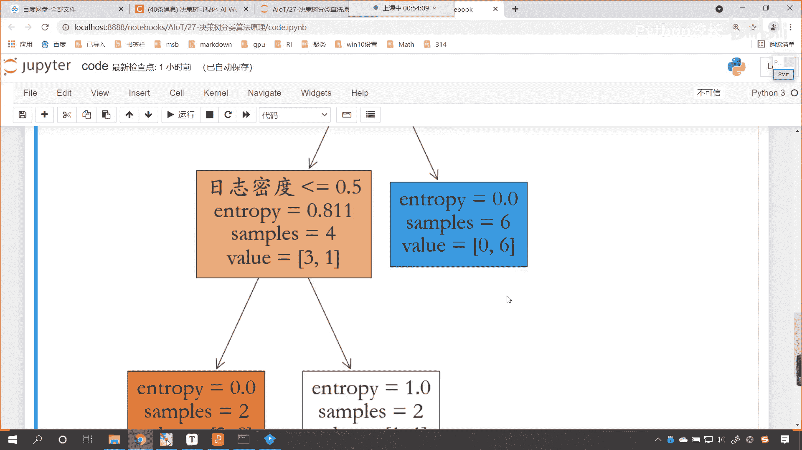
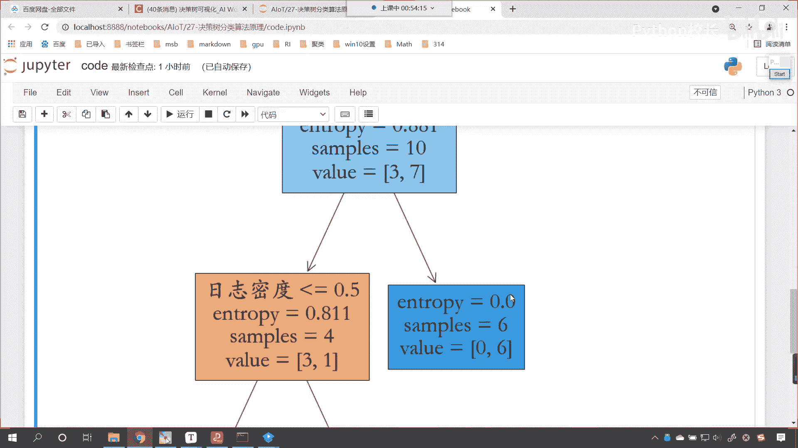

# P178：3-决策树的应用和可视化 - 程序大本营 - BV1KL411z7WA

来那么接下来呢咱们继续往下看，咱们看一下我们决策树的使用啊，好那在代码当中，咱们决策树的使用使用decision tree classifier，现在呢咱们回到代码当中，现在呢你就能够看到啊。

我我已经在我已经为咱们今天这个代码创建了，那就是27决策树分类算法原理，咱们现在呢就进入到这个代码当中，我们呢首先导一下包，咱们import numpy as np，我们from sklearn。

咱们从tree下边，我们呢导一个包，那就是import decision tree classifire，大家现在仔细看一下，咱们在进行导包的时候，它这个地方是不是有一个提示呀。

那我们这个提示呢有一个classifier，是不是还有一个叫regressor呀，classifire咱们翻译成中文，它的作用是不是就是分类呀，还有一个叫regressor，这个是不是就是回归呀。

你想一下咱们之前讲到的线性回归，是不是叫做linear regression呀，唉所以说咱们呢在进行决策书讲解的时候，今天晚上我们讲解的是决策树分类算法的原理，所以我们把这个导进来好执行一下。

现在你就能够看到咱们呢就是使用这个decision tree，classifier，我们使用它来进行操作，那我们再回来看一下它是如何使用的啊，那我们就介绍一个例子，大家看啊，咱们现在呢有这样的一个数据。

那我们有日志密度，有好友密度，是否使用真实头像，还有咱们这个账号是否真实，现在呢在互联网上，各种平台是不是都有账户呀，你知道有一些账户是假的，对不对，你比如说微博呀，微信呀，甚至咱们的这个今日头条。

现在的平台呢越来越多，你知道这个有一些账号是吧，它呢是假的，对不对，好，那么呃我们现在呢，咱们现在呢这个举的这个例子呢，咱们假设说呢这个就是咱们微博上的一个账户，那这个微博呢。

这个公司他需要知道哪些账户是真的，哪些账户是假的，所以说呢他就进行了数据的一个统计，呃，现在呢是不是还有机器人账户呀，对不对，好，那么在这里呢咱们统计哪些指标呢，就是哪些指标跟你账号的是否真实有关系呢。

那首先是日志密度，还有呢就是好友密度，还有就是是否使用真实头像是吧，有一些账号如果他是诈骗账号，或者说他是水军，那是不是有可能它的日志密度，好友密度是否使用真人头像，这个跟这些属性是不是有一定的关系啊。

好那么咱们这个数据呢，前三列它呢属于是咱们的数据，那我们的最后一列呢属于是咱们的目标值，对不对，好，那么在这儿呢我们简单看一个这个对应关系啊，咱们的s呢m和l分别呢表示小中大，比如说咱们的好友密度。

看看咱们的好友密度，如果好友密度是一个large，看好友密度是一个large，咱们的日志密度呢是一个media，就是说你这个这个用户呢好友很多，然后他的日志呢发表的日志也很多中等。

那么这个人是不是真的呀，那这个人就是yes，看到了吗，这个人就是yes，咱们再举一个例子啊，你看啊，再举一个例子，比如说有一个账号是吧，这个好友密度很少small，那咱们的日志密度呢看到了吗。

日志密度也很少是吧，那这个是否使用真实头像呢，虽然他用了真实的头像，但是呢这个账号是否是真实的呢，no是吧，它就不是真实的，我们根据什么来判定它是否是真实呢，你想你一个真实账号是吧。

你是一个社会当中的人，你难道能没有朋友吗，看到了吗，你的好友密度很少，你发表的日志也很少，那么我就可以断定是吧，你呢这个账号呢就是一个假的，就是一个no，所以说咱们的账号是否真实，看跟什么有关呢。

跟日志密度，好友密度以及是否使用真实头像，这些呢是有一定关系的，对不对，唉，是否使用真实头像，和咱们最后这个账号是否真实，它呢是有一定关系的啊，你不能说它没有什么关系是吧，那有没有关系。

咱们得通过算法建模，唉我们来这个去判断一下，但是呢它到底有没有关系呢，是有一定关系的哈，有一定关系的，你看我们都知道这个如果要是假账号，他是不是会想方设法，想方设法会把这个账号做的看起来。

让它真实一些呀，那是不是很有可能他就会使用真实的头像是吧，伪冒一下，但是呢我们不能这个以偏概全，咱们不能这个啊，不能说这个是否使用真实头像，咱们感觉它不重要，那么咱们就把这个属性给它去掉，其实是吧。

说实在的，你想这个好友密度，它对于这个账号是否真实，它是不是最重要的呀，对不对啊，我们可以说含有密度重要，日志密度也重要，那这个是否使用真实头像呢，它也有一定的影响，也有一定的重要性。

如果说它的重要性要是零的话，看如果说它的重要性要是零，那我们是不是可以把这一列给它删掉呀对吧，但是你现在你不能说是否使用真实，头像和账号是否真实没有一点关系，对不对呀，那肯定不能这样说，是不是好。

那么咱们现在呢就使用代码，咱们来一个构建好不好好，那么上面这些数据，各位各位小伙伴就能够发现上面这些数据呢，咱们都是这个字符串的数据，那么对于字符串的数据呢，咱们就直接给各位小伙伴发过去了啊。

按ctrl c，咱们就把它放到我们的讨论区里边，因为这个数据的创建是吧，咱们就没有必要一个一个去敲，一个一个去写了，来，现在呢我们回到代码当中，咱们在这儿呢给它插入一个三级标题，这个呢就是加载数据。

那执行一下，咱们来一个ctrl v，那我们在加载数据的时候，咱们用的是pandas，所以说咱们上面就倒一个包，好，大家看啊，这个s s l，这个都是我根据咱们图片当中的数据，它的对应关系咱们写出来的。

这个时候你看我一执行，大家现在各位小伙伴你就能够看到，那这个数据我是不是就创建好了呀，看到了吗，这个数据咱们就创建好了啊，好大家看这个就是咱们的x，大家要注意，这个x当中呢。

有一个咱们最后一列这个真实用户，那其实这个真实用户，它是不是表示咱们的目标值呀，对不对，这个表示咱们的目标值，咱们一会儿再进行训练的时候，我们要注意一下啊，好那么现在这样啊。

咱们将这个真实用户呢我们先给它去掉啊，看真实用户先去掉，这样的话咱们这个数据呢唉就比较清晰了，数据x是咱们的特征，那么我们的y呢是咱们的目标值，它呢就表示这个账号是否真是否是真实的好。

那么大家看数据有了，那上面咱们已经把决策树导包导进来了，接下来呢我们就创建一个模型，那就是model就等于decision tree classifier，现在咱们先使用默认的参数。

也就是说这个里边是什么参数，咱们呢都不给它传入默认的参数，然后呢咱们就使用model。feat，我们将数据x和y放进去，此时你看过一执行会怎么样，看看大家猜一下咱们这个代码能不能执行，通过执行哎。

各位小伙伴就能够发现这个代码执行到这里，怎么样，咱们是不是就报错了呀，对不对，你看他为什么给报错了呀，看为什么报错了，跟我们的数据有关，因为咱们的数据，你看s s n这些是不是都是string串呀。

对不对，都是文本数据，文本数据能够进行数学运算吗，除了拼接而言，是不是就不行呀，对吧，那我们现在呢对对咱们的数据呢，咱们给它进行一个改变啊，好那么咱们再来一个三级标题，这个呢就是数据的转换啊。

咱们来一个数据转换好，那么我们x呢咱们就来一个中括号，咱们一列一列进行改变，首先呢我们将日志密度对它进行一个修改，那就等于x中括号单引号，日志密度对它呢调用一个map方法，点mvp里边来一个花括号。

如果你要是s那么我把你映射成零，如果你要是m那么你所对应的就是一，如果要是l就表示large，这个时候咱们就对应着二好，大家看现在这个日志密度这个数据就改过来了，好那么改过来之后呢。

咱们将这个代码复制一下粘贴，再来一个粘贴，我们一共有三列需要改变，除了日志密度之外，咱们的好友密度，大家注意啊，看啊咱们的好友密度也得需要修改一下，那这个好友密度修改一下好。

那么我们最后是不是还有一个真实头像呀，那么真实头像这一列呢，我们也修改一下，好真实头像，咱们真实头像呢是n和y好，那么这个时候呢咱们给它调整一下，如果要是n那对应着零，如果要是y那就使用了真实头像。

咱们对应着一，后面这个l咱们就去掉就可以了啊，这个时候你看我一执行，大家看一下咱们这个数据，你看数据是不是就修改过来了呀，看到了吧，大家注意啊，咱们只执行一次啊，你看如果我要再执行会怎么样，看到了吧。

这个代码在执行这个时候是不是就变成空了呀，所以你在执行的时候要注意啊，因为你修改过来了，你要再去根据这个映射，你想这里边还有s吗，还有m吗，是不是就没了，所以你看全变成空了。

那咱们上面的代码再执行一下好，这个时候你看这个数据它又是四string true了，现在呢咱们执行这个数据转换，我们呢代码只执行一次，在这咱们来一个注释，唉这个就叫做代码只执行，看代码只执行一次。

ok现在这个数据转换有了好，那么接下来呢咱们对于模型，咱们呢就进行一个训练和预测啊，这个时候呢咱们就建模，和预测好，那么声明咱们的model model呢就是咱们的模型，就是咱们的算法。

咱们呢来一个decision tree classifire，然后呢使用model。feat，咱们对这个数据进行一个建模，把x和y放进去，xy放进去，这个时候呢咱们就model。co x和y放进去。

我们看一下它的得分怎么样，现在各位小伙伴就能够看到咱们训练了数据，那对于咱们的训练数据，咱们进行预测，大家看这个时候是得得分多少，是不是90%呀对吧，那这个还可以啊，因为我们给的这个数据呢。

咱们只是一个演示数据啊，好，那么现在呢我们想看一下，咱们这个决策树它到底长什么样，看也就是说你这个决策树构建了是吧，那我们刚才在咱们刚才在介绍的时候，咱们说决策树大概长这个样，是不是。

那咱们在代码当中所见的这个决策树，它到底长什么样呢，来现在的话咱们再来一个三级标题，我们呢对上面，看对上面的决策树，咱们进行一个可视化啊，决策树咱们进行可视化，那这个时候咱们导一下包。

咱们from sk learn，咱们import tree train呢是咱们决策树它的副模块，上面，咱们在导包的时候，你就能够看到这个decision tree classifier。

咱们是从哪个子模块下导进来的，是不是就从最下面导进来的，所以说这个train这个模块下，有很多相应的功能方法，所以咱们把它导进来，便于我们使用，我们既然要可视化，那么这个时候呢咱们就啊把画图工具。

我们给它导进来啊，那就是import mat plot lib，点piplot as plt，好，咱把这个导进来了，导进来之后呢，咱们就plt点对它进行一个设置，r c params。

我们呢给他设置一下咱们的字体font，咱们来一个family，f a m i l y我们让它等于s t开启好，那么呃然后呢咱们再来一个设置，那就是plt。figure，咱们设置一下这个图片的尺寸。

figure size，咱们呢给一个12和16尺寸给它设置一下，呃，然后呢呃我们给一个feature name，这个fn呢就等于x。columns，那这个columns其实就对应着。

你看x是一个data frame，对不对呀，那么它的columns是不是就是日志密度，好友密度，真实头像呀，对不对好，那么在这儿呢咱们获取一下，那么获取完这个之后呢，咱们就tr点。

此时呢咱们就调用一个plot tree，你看这有一个方法叫plot tree，那这个方法就是画咱们这棵树，那么数对应着谁呢，数就对应着咱们的算法model，所以说咱们把model放进去。

然后呢我们给一个field field就表示填充，咱们给它个颜色，然后呢再给一个feature names，就是咱们的fn，此时你看我一执行这个代码来，各位小伙伴。

你就能够看到咱们这棵树是不是就画出来了呀，看到了吗，这棵树看有没有画出来，看到了吧，画出来了吧，好那么这棵树在进行绘制的时候呢，它这个地方有一个打印输出，那这个打印输出它表示的就是咱们列分的标准。

你在这儿能够看到看这个数是怎么裂分的，叫好友密度小于等于0。5是吧，然后呢日志密度小于0。5，各位能够发现在我们这棵树当中，我们进行列分的时候，咱们是不是就根据两个属性进行了列分呀，一个是好友密度。

另一个是不是日志密度呀，那就说明咱们在构建这棵决策树的时候，这个这棵决策树是不是也认为，我们是否使用真实头像，对于我们类别的划分，它是不是没用呀，对不对，那现在呢经过这个验证了，咱们终于可以怎么样。

是不是把这个属性给它删除掉，也不受影响呀，对不对，好回到咱们的代码当中啊，好那么现在呢咱们来一个盖，前面来一个杠，这个就表示接收，这个时候你看我一直行，唉大家现在就能够看到这棵树就有了啊。

我们这个尺寸呢是可以调大，是可以调小的是吧，这个12表示宽度，这个16表示高度，咱把高度调整成九，我们看一下，看高度要调整成九的话，这个时候看起来是不是就凑到一起了呀，不太好看，是不是好。

咱们来一个12和12呢，哎我们看一下啊，唉这个时候看上去还行，是不是给12和12也行啊，好那么这张图片呢咱们是可以进行存储的，那就是p o t一点save，咱们调用一个方法。

那就是save figure，给他来一个点反斜杠，唉这个呢就是咱们测数点png是吧，逗号，然后咱们来一个dpi，我们让它是200dpi，就是咱们的这个像素密度越大，咱们所存的这个图片就越高清。

这个时候你看我一执行保存成功了，然后保存成功了，在咱们当前路径下，是不是就有决策树png这张图片呀，几秒钟之前刚存的来，咱们现在把它打开，我们看一下啊。

唉大家现在就能够看到，你看我们打开看。

咱们就发现这张图片是不是全都摞到一起了，你看这个这是为什么呀。

是吧，这是因为我们屏幕像素密度啊，咱们把它调整成100啊，默认的啊。

再来执行一下，来再来打开这张图片看一看，哎这个时候大家看是不是效果就稍微好一点了。

但是还是有点堆叠，那怎么办啊，那咱们现在呢，把这个figure的尺寸给它调整成16啊，高一些，这个时候再来执行好，那么现在呢咱们再打开咱们的嗯，这张这个，嗯来现在的话咱们再打开咱们这张图片。

好，大家现在来看这个时候是不是就稍微好一点了。

对不对，那这个宽度可能继续再调一些啊，咱们就不带着各位去调了啊。

好这个时候我们就能够看到是吧，咱们这棵树到底长什么样，看到了吧，看到了吧，这就是咱们这棵这个决策树，它长的这个样子啊，嗯好上面的话，刚才我们把它调整成16了，是不是高度是16，宽度是12好。

那么大家看啊，这个里边有一个参数，看咱们在画图的时候，这个地方有一个叫基尼，是不是衡量这个社会这个收入分配情况，是否公平，对不对好，那么我们在构建决策树的时候。

咱们这个决策树里边有一个参数叫做criteria，大家看这里边有一个参数叫criterion，默认情况下你看它是不是基尼呀，那么除了这个基尼之外，我们还有一个评价标准，在这儿就能就能够看到。

这个是不是叫做entropy呀，entropy翻译成中文，它有伤的意思好，那么现在呢课堂上我们展示用entropy，用咱们这个商来进行演示，大家看此时咱们使用熵，也就是说这个参数调整了一下。

那这个参数是什么意思呢，在这儿咱们进行一个说明，叫critera rear，这个呢就是咱们的列分标准，我们根据什么来构建这棵决策树，执行一下这个代码，那肯定是咱们这个参数给写错了啊，n rop。

咱们少一个py，是不是唉给他一个p啊，这个时候再来执行，现在你来看是不是就没错了，那如果我要把分裂标准换成entropy，咱们再来执行这个代码，再来可视化一下，给各位看一下。

你看现在咱们这个entropy，是不是就是0。881嗯，然后呢我们继续划分的时候，0。811是不是变小了，再往下划，你看到了吧，这个entropy就是零，这个entropy是不是一点呀，看到了吗。

这个entropy就是一点，所以说随着我们进行向下列分的时候，它呢有一个这样的情况，随着向下列分，咱们的这个entropy呢它是越来越小啊，这个entropy是越来越小，一开始0。8到这儿呢是零点，0。

811，原来是0。881，是不是变小了，你看这个entropy是变成什么了，是不是变成零了，我们的颜色越深，那么咱们的这个这个这个数据呢它就越小，咱们刚才在画图的时候说，这个field等于true。

它是一个布尔型的值，如果我要给他一个false，你看一下它是什么样的情况，你看如果要给一个false是什么样的一个情况，是不是就没有颜色，没有颜色看起来就不太好看是吧，就比较单调。

所以说咱们给一个true啊，好那么我们继续往下看，你看到这不是0。811嘛，对不对，那我们继续往下列分，各位你就能够看到到这个地方它是不是零对吧，变小了，对不对。

到这个地方这个entropy不是一吗对吧，它哪里变小了呀，大家要注意啊，你看啊，咱们这个数据是列分明白吗，看到了吗，这个数据是裂分，原来原来我们的数据是几个，3+1是不是等于四个呀，对不对呀。

现在呢你看你左边两个，右边是不是也是两个呀，如果你要两个的话，那么你所占的整体的比例是不是就是0。5呀，对不对呀，你右边分支占的比例是多少，是不是0。5，对不对，你想那我再去进行这个交叉熵计算的时候。

咱们得需要让0。5乘以，是不是这个一点呀，对不对，唉这个时候呢咱们这个分支它确实也就变小了，看到了吧，这个分支它也就变小了，因为这两个数得需要怎么样呀，得需要乘以一下啊，得乘以它的这个比例才算这个分支。

它的商是多少，好那么现在呢我们使用咱们的决策树算法，咱们是不是进行了训练，我们是不是进行了可视化呀，对不对，看这就是一棵树，你现在知道咱们这个数据是怎么划分的了吧，就是把任意一个。

任意一个数据带到咱们这个决策树当中，然后呢我们进然后呢我们进行分类就可以了，现在你肯定还有一些疑问，就这个数到底是怎么画的，对不对，好，那么我们后面的课程呢。

