# P180：5-信息熵和信息增益概念和公式 - 程序大本营 - BV1KL411z7WA

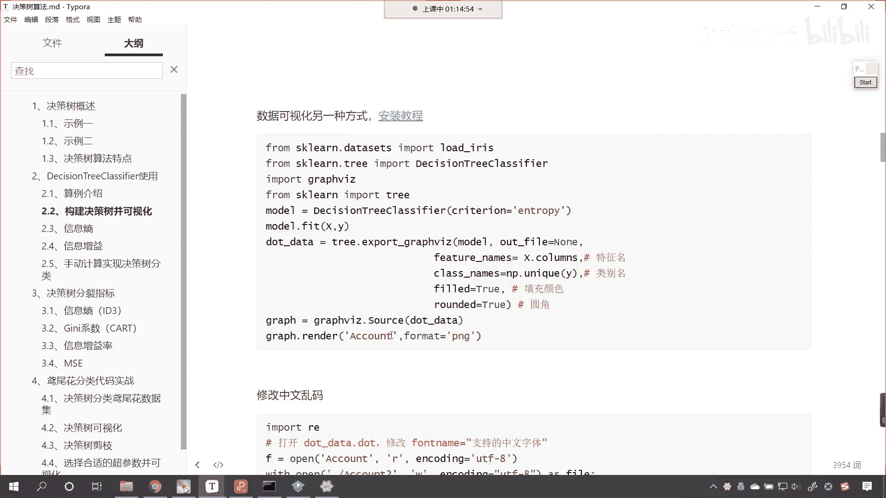

好咱们呢该修理的这个字体呢，该调整的字体咱们已经调整了。

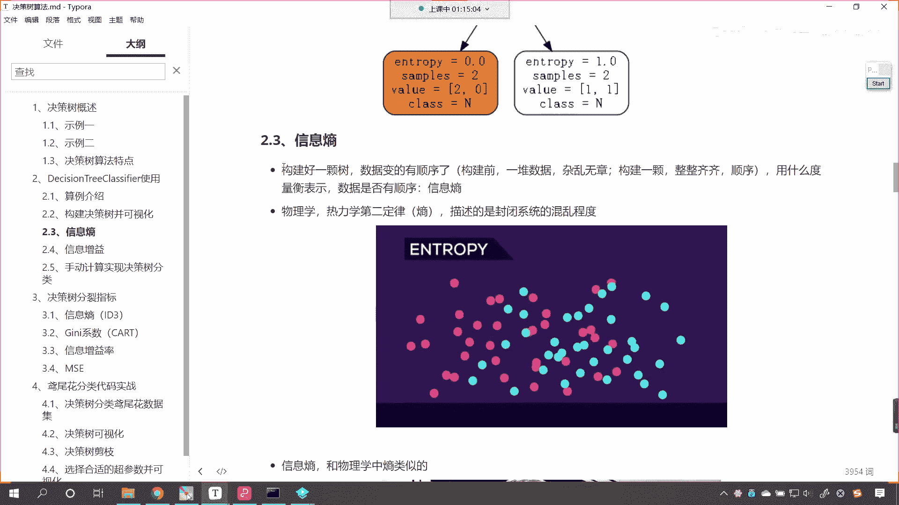

现在呢还有一个疑问，就是咱们这个是如何就是这个决策树是吧，它是如何构建的呀对吧，为什么呀，你看为什么第一个就选好友密度对吧，而不选日志密度，你在你的电脑上，你去执行这个结果。

你和我执行的结果应该是一样的，也就是说我们不会因为电脑不一样，品牌不一样，执行的结果不一样，那之所以能够出来这个结果，它一定有一个标准，咱们说这个标准就叫做entropy，什么是entropp啊。

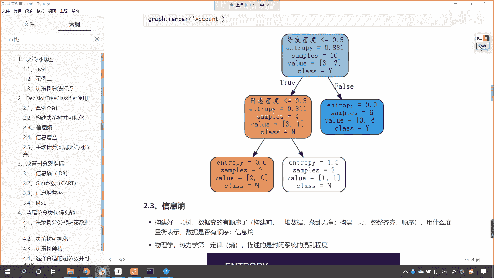

我们往下看，entropy有伤的意思，那么在我们计算机里边有信息熵，那么它呢是构建好一棵树，咱们的数据就变得有顺序了，对不对，构建之前是一堆数据，杂乱无章，构建好之后。

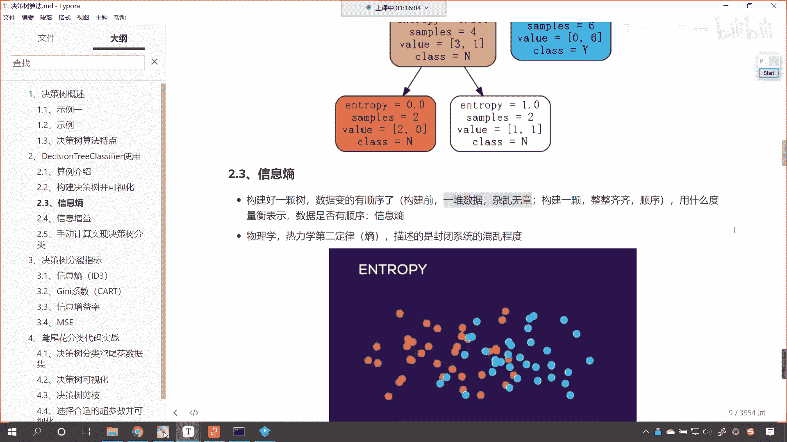

这个数据呢就整整齐齐，那么咱们到底是用什么样的标准来构建的，这棵决策树呢，咱们用的就是信息熵。

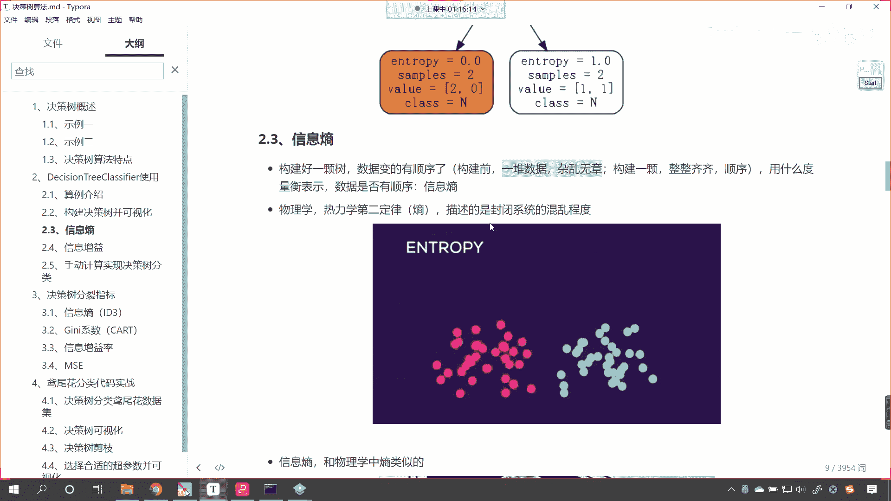

什么是信息熵呀，这是热力学的第二定律是吧，商，那什么是熵呢，看它物理的含义，它是描述封闭系统，它的混乱程度，在这里，你看我给了一个动图，你就能够发现，原来咱们是红色的点和这个绿色的点儿两类。

那么只要你把它打乱顺序，他们是不是就越来越混合，越来越混合呀，原来的时候是一边是红色的，一边是绿色的，这个时候特别的规律，整整齐齐，随着你把它打乱顺序是吧，越来越混乱，那么这个混乱程度该用什么去描述呢。

你看我们长多高，咱们用身高来描述，是不是我们体重多少，咱们是不是用kgkg来描述呀，那么一个封闭系统，它的混乱程度用什么来描述呢，就用商看这种商商呢，它有相应的这个物理概念和它的计算公式好。

那么大家看啊，就是原来咱们这个系统是一边是红色的球，一边是绿色的球，你看啊到现在是吧，唉大家看啊，嗯咱们画一个图啊，哎嗯你看现在是吧，它是不是就变得混乱了。

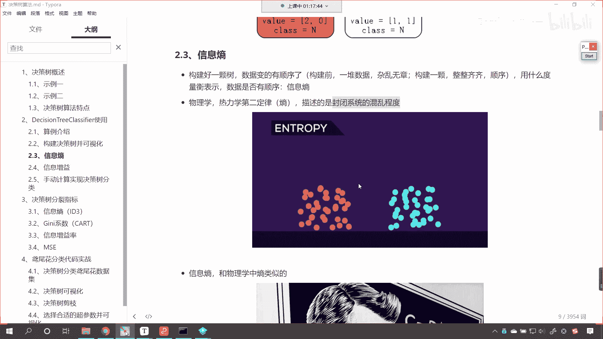

这个混乱的多少大小就用商来表示，那么什么是信息熵呢，这信息熵和物理学当中的熵是类似的。

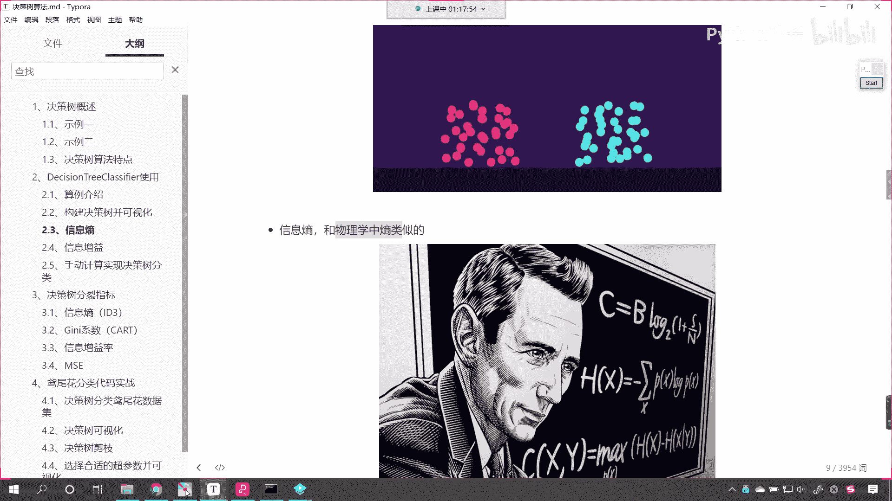

香农这个人他呢给信息商下了一个定义，同时呢它也给了相应的计算公式。

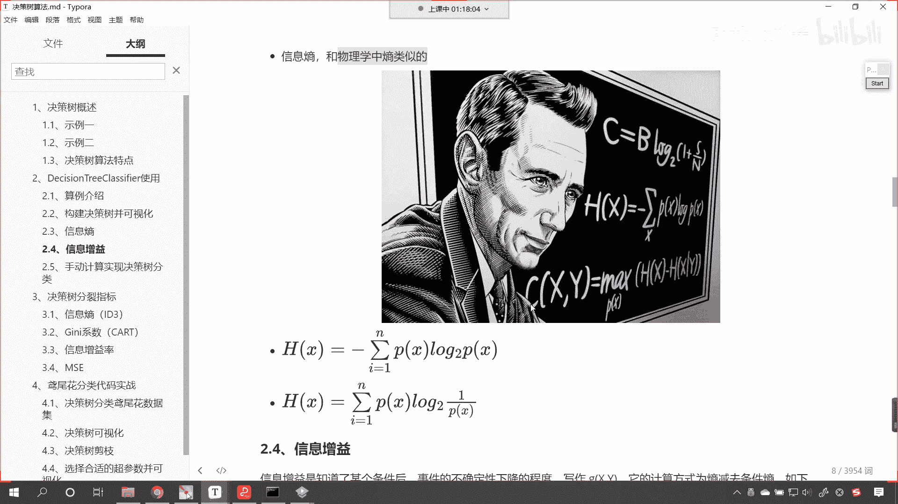

大家现在看到的这个公式就是咱们的商，看到了吧，看到的这个公式就是咱们的商，那我们对这个公式进行一个说明，这个公式是不是有一个求和符号呀，能明白吧，看到了吧，有一个求和符号，求和符号后面是不是有一个乘法。

看到了吧，是不是有一个乘法，这是谁和谁相乘呢，是px乘以px的，以二为底的对数，简单不简单，看到了吧，就是p x乘以二为底p x的对数，这就是相同，这个人是吧，他给了我们定义好，那么我们把这个就叫做商。

看到了吗，这个就叫做商，前面有一个负号，为什么前面有一个负号呢，因为咱们的px表示某一类的概率，看咱们这个px它呢表示概率，而概率的范围你想一下是不是0~1之间呀，如果以二为底求0~1之间的数。

那么log以二为底，得到的这个结果是不是就是一个小数来。

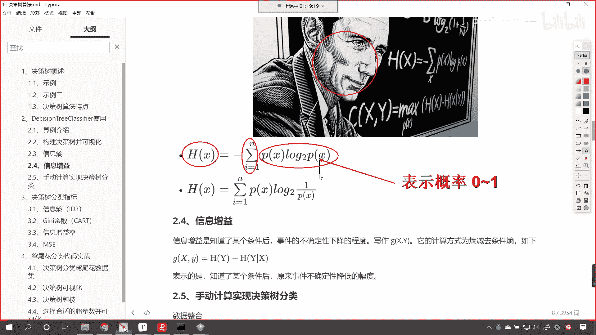

我在代码当中给你演示一下啊，看啊回到代码当中，咱们np。log以二为底，如果我要给个一求解出来是多少，是不是零，如果我要给个0。5求解出来是多少，现在你能够发现是不是负的一呀，看到了吧看了。

所以说嗯咱们的p x看这个p x它表示什么，它表示概率，表示概率，那么它的范围是多少，是0~1之间，既然它的范围是0~1之间，我们以二为底，求对数的时候，你想它是不是小于等于零呀，对不对。

你看它一定是小于等于零。

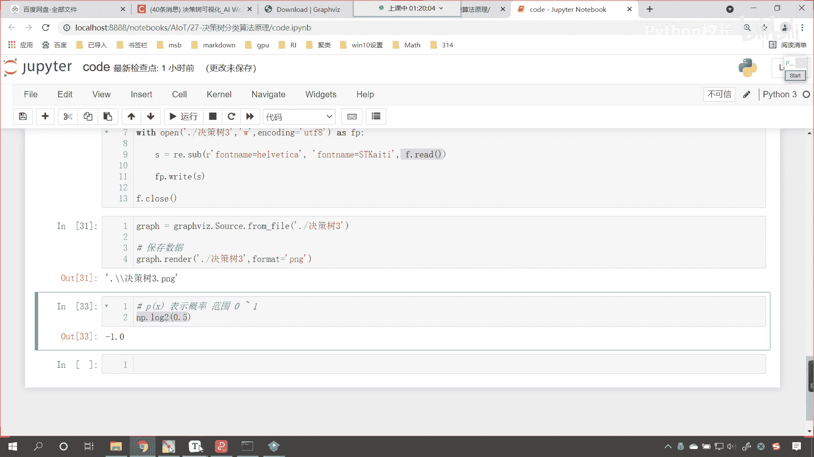

所以说咱们这个公式怎么样，因为我们描述的描述的这个数据，一般情况下都是正的，所以说它的前面咱们带了个负号，这个负号是不是和咱们log嗯一接触，是不是就把它变成正数了，对不对，好，那么我们对数有一个运算。

你前面有一个负号，这个负号是不是可以写到咱们log里边，看到了吗，原来你是px，现在是不是你就变成了p x分之一呀，看到把这个负数给它挪进去，它就变了啊，这个就是商来各位小伙伴看各位小伙伴。

你现在明白什么是伤了吗，在讨论区里边，你回复我一下啊。

你知道什么是熵的这个概念了，明白它的公式是怎么样的一个计算。

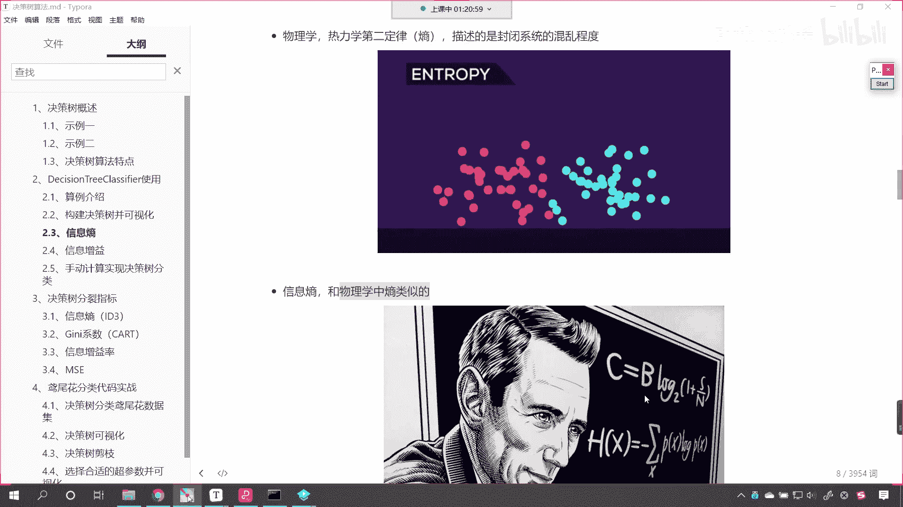

那么你在讨论区里边儿回复一个1024啊。

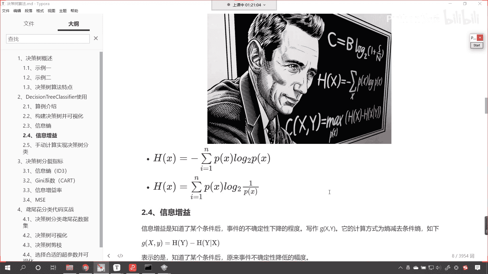

你看一下咱们这个动图，大概呢就能够明白一点，这个动图呢它是越来越混乱，那么这个商呢越来越大。

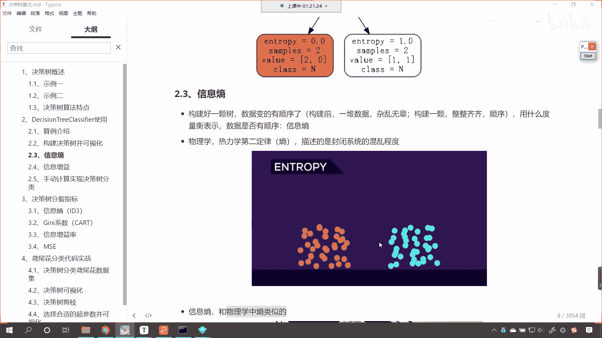

那么具体公式计算就是咱们这个公式，咱们说这个p它就表示概率。

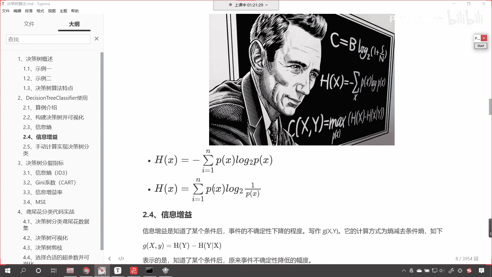

那么现在呢你不要问我说，老师这个公式是怎么推导出来的，是不是嗯，咱们现在呢就能够看懂这个公式，我们能够看懂这个公式是怎么回事，咱们能够在代码当中对它进行计算就可以了，那到底香农这个人是怎么推导出来的。

是不是啊，那你想是吧，人家是伟大的数学家呀对吧，他肯定是有一定的这个推导过程，咱们后面我们随着这个决策树的这个，讲解的深入，咱们也会为各位讲解这个伤是怎么回事啊，为什么这个商这么计算。

但是今天咱们不做过多的展开，你了解这个公式就可以了。

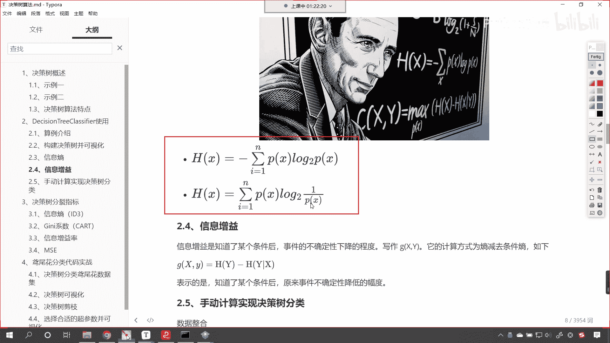

好现在我们知道什么是伤了，那咱们呢再来一个概念叫做信息增益，这什么是信息增益呢，看了增增就是增加e是不是好处呀，信息增益呢就是知就是知道了某个条件后，咱们事事件的不确定性下降的程度，你看这句话说的是吧。

唉各位小伙伴一定理解不了，看到了吧，你一定不能够这个理解到底是什么意思，就是信息增益就是知道了某个条件后，事件的不确定性下降的程度，那咱们把它写作什么g x y，它的计算方式为商减去条件，商，看到了吗。

就是商减去条件伤，那就是gx y就等于h y减去h y竖杠x好，那么这个到底是什么意思呀，它表示的是知道了某个条件后，原来事件不确定性降低的幅度，那么有可能大家对于信息增益还有一点模糊。

我们在具体的代码计算当中，咱们进行展示，你就明白这个信息增益是什么意思了，好。

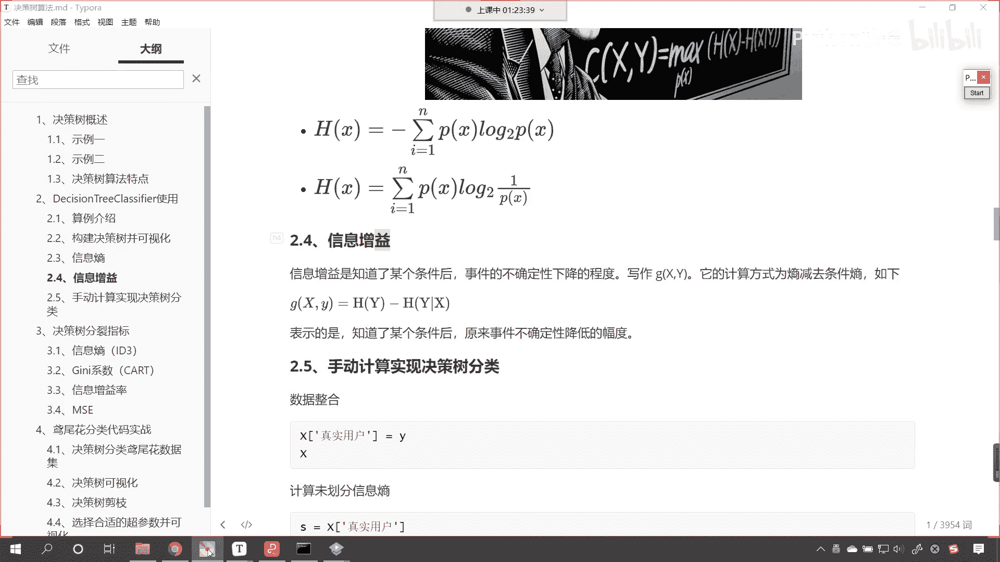