# P181：6-手写代码计算信息熵 - 程序大本营 - BV1KL411z7WA

来各位小伙伴，现在呢我们终于要回答一个问题了，就是咱们刚才对于我们的数据的划分看啊，刚才那咱们说这个案例是吧，好友密度日志密度它为什么这样划分，为什么我们这个n rob是0。811，看到了吧。

你看为什么它是0。811呀对吧，一开始的时候为什么是0。811对吧，那这个是不是都是算出来的呀，现在的话咱们计算一下啊，咱们呢来一个三级标题好，那么接下来我们呢就手动计算一下。

咱们决策树到底是如何分类的，看看咱们手动计算咱们的决策树，它到底是如何分类的，好那么首先呢咱们计算一下未划分的信息熵，首先咱们计算问未分类的信息熵，信息熵是不是有他自己的公式呀，对不对好。

那么对于我们的数据而言，往上划，你看一下咱们的数据啊，看一下咱们的数据，x是数据，那y是什么，y是不是咱们的目标值呀，对吧，那这个y当中既有n又有y，他是不是表示就这个人不是真实用户，如果是y的话。

是不是就是这个账号是真实用户，对不对，好，那么你想x是条件，x这个条件，是不是可以将咱们的y进行一个很好的划分，想一想是不是咱们刚才在介绍的时候。

这个信息增益这说了这样的一个概念，信息增益呢就是知道了某个条件后，事件的不确定性下降的程度，看啊事件的不确定性下降的程度，那么某个条件就对应着咱们数据当中的x，看这就是条件。

那么事件的不确定性下降的程度，这个事件就对应着我们的y，因为y是目标值，现在呢咱们回到代码当中。

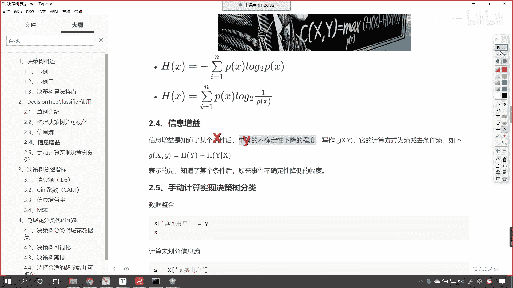

我们呢就进行一个计算啊，看在这儿，你看咱们呢就计算未分类的信息熵，那么想要计算未分类的信息熵，是不是就是咱们的y啊啊啊就是咱们的y，现在你就能够看到，那么我们对于y呢，咱们对它进行一个这个操作啊。

这个时候呢看咱们的y等等n，看看咱们的y，我们让他等等n，这个时候你想咱们是不是可以得到一个概率呀，对不对，好，那么呃这个它的概率呢啊咱们看一下是多少啊，来咱们来一个小括号，咱们点求一下me。

这个时候你看它是不是0。3呀，对不对，你看这个是0。3，那我们把它叫做p一好不好，然后咱们再来一个p2 ，p2 等于多少y，我们让他等等y点求一下me，咱们print输出一下p一和p2 。

唉你看我一执行是不是0。3和0。7呀，也就是说我们在未分类的时候，你的这个p一和p2 是0。3和0。7。

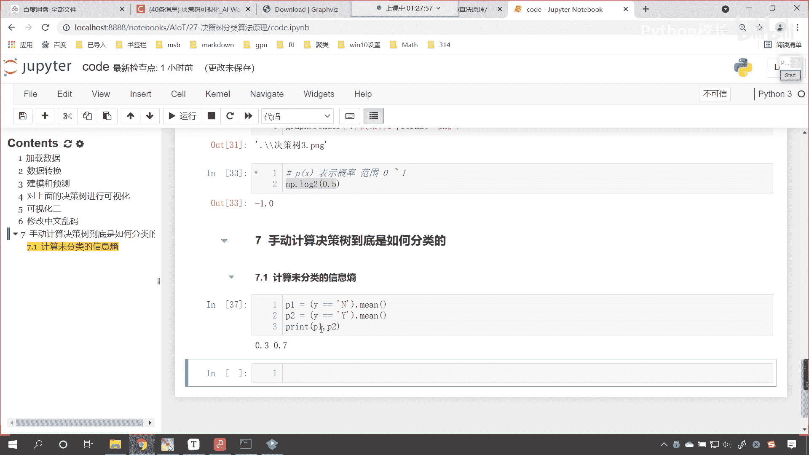

你还记得咱们的信息熵公式是如何算的吗。

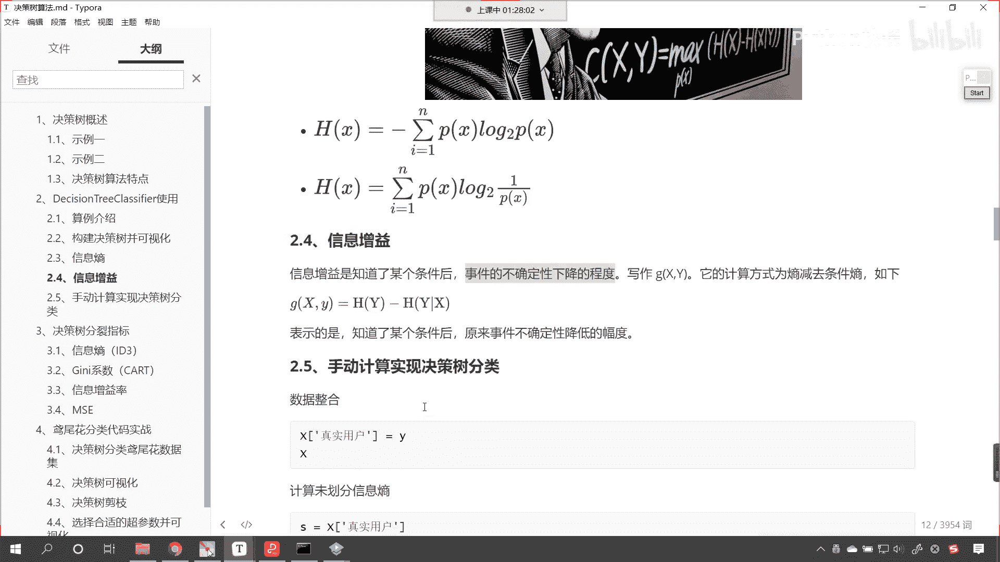

看是不是这种算法来，咱们把这个复制一下公式复制一下。

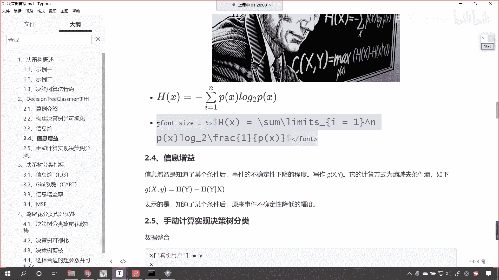

回到咱们的代码当中，来一个markdown，在这来一个粘贴，看ctrl v执行一下，你看这个px，px是不是就相当于咱们某一个类别它的概率，你想你p一是不是表示n它的概率是多少，是不是0。3。

p2 是不是表示y它的概率是0。7，那咱们就根据这个公式计算一下吧，首先呢是来一个求和，对不对好，那么我们就让p一看到了吧，乘以多少乘以np。log，以二为底，是不是一除以咱们的p一啊。

然后再加上大家看啊，然后再加上p2 乘以多少np。log，以二为底，是不是一除以p2 啊，来各位小伙伴到这里看，各位小伙伴到这里，你能够明白这个公式是什么意思吧，能够明白的。

咱们就是根据上面这个公式计算的啊，你看我一执行它是多少，哎呦，结果出来了是多少，0。88129，咱们让它保留三位小数，那后面这个290是不是就约掉了，其实它是不就是0。881，对不对，0。

881熟悉不熟悉，你在哪里见过呀，看咱们可视化这儿啊，哎哟你看看看啊，0。881这个表示什么，咱们在这儿要说明一下看啊，在这要说明一下，你想这个是不是属于我们的树顶呀对吧，就是在这儿还没有开始划分呢。

对吧，那没有划分的时候，我们计算出来的信息熵，这个是未划分我们的信息熵，咱们计算结果是多少，看是不是0。881呀，它保留了三位小数，对不对啊，这是未划分的啊，你看啊，你好友密度小于等于0。5。

到下面是不是才有分支呀，那这还没有分呢啊，那我们就发现这个0。881，和咱们刚刚计算出来的是不是一样，看到了吗，和刚刚计算出来的是不是一样呀，哎现在你就明白是怎么回事了，对不对，然后呢。

我们接下来继续啊，看啊这个是未分类的信息熵，那么我们就再进一步，咱们呢就按照，啊咱们就按照日志密度咱们来进行划分，好不好看，接下来就是按照日志密度来进行划分好，那么我们这个日志密度。

咱们该如何对它进行操作呢，呃呃这个时候呢，因为我们的数据x，大家看咱们这个数据x呢是日志密度，好友密度，真实头像，我们再给它增加一列，看看咱们再给它增加一列，咱们增加的这一列呢就是真实用户。

就是咱们的目标值y，打印输出一下这个x来，现在你就发现，是不是，我们把目标值也加到咱们的数据x当中了，对不对好，那么我们把它加进去之后，这个就变成data frame当中的一例。

那么我们在进行计算的时候就会方便一些看，这就是咱们的目标值y啊，前面这三列呢是咱们的数据x，现在我们把它增加进去了，好那么接下来呢我们就按照日志密度进行划分，上面这个计算出来的0。80。881。

这个是是不是未分类的时候，是不是没有条件的时候，咱们计算的信息熵呀，接下来呢我们按照日志密度进行划分，咱们去计算信息熵啊，咱们求一下信息熵好，那么咱们该如何对它进行划分呢，看这个时候呢。

咱们把日志密度的数据给它拿到啊，那就是日志密度，然后我们调用一下他的什么呢，uni q唉，这个函数你看我一执行，你想你的日志密度一共有几种情况呀，是不是就是012呀，对不对，看到了吧，012。

那日志密度咱们接收一下，我们起个名叫小写的x啊，大家注意我用小写的x，你看咱们这个x它有有按照顺序进行排列吗，021，他是不是没有按照顺序进行排列，那咱们在这个地方给他来一个salt。

在这儿呢给他来一个排序，那么排序之后，各位小伙伴，你就能够看到，你看我一执行是不是012啊，对不对啊，这个就是咱们排序之后的结果，然后呢咱们该如何划分呢，看我们我们呢就把它划分成两部分，你看该如何划分。

因为我们这个日志密度，咱们是不是一共有三个特征呀，对不对，看日志密度一共有三个特征，那咱们划分的时候，你看我是不是可以这样划分，就是从零和一之间划分，是不是一种分类。

从一和二这划分是不是又是又是一种分类呀，你想一下是不是，因为呢我们的日志密度，它的属性是不是一共分几类呀，看咱们的日志密度，它的属性值是不是是012，对不对，那我如果要对这个特征。

按照这个特征来进行划分，那你想我能怎么划分呀，咱们是不是可以从这儿切一刀，可以不可以，就是你零这分成一类，一和二是不是分成一类呀，咱们还可以怎么划分，你看我还可以是不是从二这儿进行切一刀。

然后零和一是一类21类，对不对，我让你看一下咱们可视化这个地方啊，你看咱们在这个地方是怎么进行划分的，那就是好有密度，如果要小于等于0。5，是不是把它归到一个类别好，有密度大于0。5。

是不是把它归到一个类别呀，是不是呀，好那么问题是看现在的问题是，你这个条件计算机是怎么找到的，日志密度小于等于0。5，它是怎么算出来的，怎么找到的，你为啥不是二，为啥不是一，为啥不是1。5。

为什么它就是0。5呢，你想知道吗，计算机肯定是进行了计算，对不对，现在呢我们就按照日志密度，咱们进行划分，我们求一下信息熵好，那我们日志密度，你看它的属性值是不是012，咱们现在呢就对它进行一个便利啊。

咱们来一个for循环，看来一个for循环，那就是fi range，咱们来一个lx，我们让它减一，你看然后来一个冒号，接下来呢我们就计算一下列分标准，叫split，就等于x中括号i冒号，咱们让i加二。

然后求一下me，我print输出一下这个split，给你看一下它到底是多少，现在你来看0。5和1。5，对不对，咱们print一下x啊，因为我们的数据x嗯，就是说这个日志密度，它的属性值是不是就是012。

对不对，我们对它进行了排序，那么你既然是012，我如果想要把日志密度这个属性进行划分，你想咱们有几种情况，是不是就是两种情况，要么从这切一刀，要么是不是从这切一刀呀，对不对，那我们从零和一之间切的时候。

咱们怎么去找这个列分条件呀，那就是零和一相加除以二，得到的就是0。5，看看咱们得到的就是0。5，那如果要在一和二之间进行划分，那就是一和二相加除以二，得到的就是1。5，所以说你看咱们日志密度划分条件。

这个列分条件split是不是就出来了，一个是0。5，一个是1。5，好那么我们进行了切分之后，咱们紧接着呢咱们就算一下它的这个概率分布，看接下来咱们就算一下这个概率分布。

那我们x中括号咱们找见咱们的日志密度，如果这个日志密度它要是小于等于split，咱们是不是把它划归成一类呀，看到了吧，你小于等于四lt，是不是就是咱们左边这个数据呀，那么小于等于它是一个条件。

咱们来一个c n d，这个时候你看我print一下c o n d啊，你看我一执行看到了吗，这是不是true和false呀，看到了吧，true的话就是满足false是不是不满足呀，对不对。

那我们split咱们刚才看了它的结果是什么样，所以说咱们就打印输出去掉啊，有了这个cod啊，咱们紧接着咱们就去计算一下咱们的概率分布，那咱们就根据cod来进行计算，这个cor是一个serious。

咱们可以调用它的value cos啊，调用一下他的value counts，我同样也给你打印输出一下啊，print，我让你看一下这个到底是什么，你看一执行看什么，是value counts。

也就是说这个false呢是七个，true是三个，那我们无论是按照哪种方式进行划分，咱们都是七和三，七和三，看到了吧，这都是七和三，cod呢是咱们根据这个列分条件，划分得到的一个嗯一个情况啊。

就是说你是0。5的时候，咱们统计记记了一下数，然后是1。5的时候，我们也记了一下数，那么有了这个值之后呢，你看你不是七和三吗，咱们再做一个除法，我们除以co。size，consize是它的长度。

这个时候咱们就可以计算概率分布，我们叫p print，输出一下p，你看我一执行，看看咱们执行出来的结果是多少，看看到了吧，这个p是不是就是0。70。3呀，对那咱们在这儿呢再进行一个这个。

再进行一个说明啊，看啊那这个0。3它到底是怎么算出来的呀，看看这个0。7到底是怎么算出来的呀，好回到咱们的数据这儿来给你看一下啊，现在你就能够看到，你看这是不是日志密度呀，对不对，咱们的日志密度。

咱们是根据什么进行这个列分的，s是不是零，m是不是一，l是不是二，那你想如果我们要根据s来进行看，咱们其实这个条件嗯。

咱们这个splay的这个条件它其实呢就是0。5，那如果要是0。5的话，根据咱们上面数据的对应关系，看s是不是零，如果要是0。5的话，其实就是三个s，对不对呀，那我们三个s你你算一下。

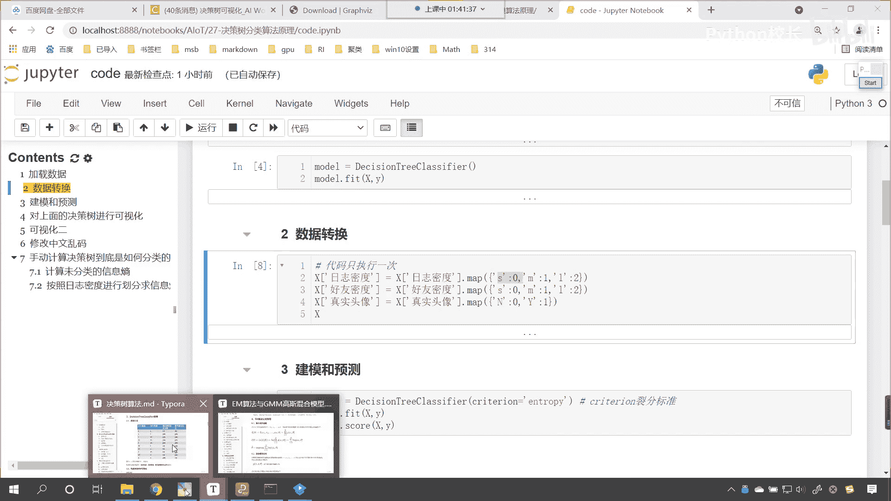

看咱们数据当中有几个s看到了吧，是不是有一个两个，是不是有三个，对不对，那所以说咱们计算出来的概率是多少，看代码当中计算出来的概率是多少。

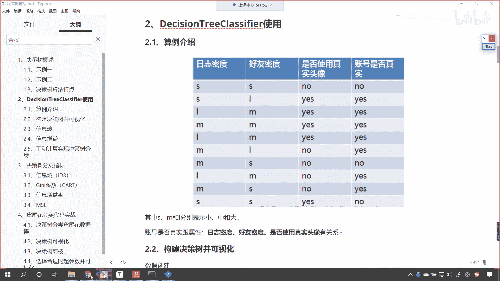

看到了是不是一个是0。7，另一个是不是0。3呀，好那么有了这个概率了啊，有了这个概率了，然后呢咱们再获取p。index i n d e x，看啊再获取p。index，那这个index是谁呢。

indexes这个indexes就是咱们的啊，就是咱们的false和true，就是false和true，有了它之后呢，咱们for循环for index in咱们的index，咱们因为只要一列分。

它是不是就分成两边呀，大家注意啊，咱们这个列分呢它就会分成两边儿啊，它就会分成两边，然后呢我们每一边看，咱们每一边都要分别去计算啊，咱们要分别去计算咱们的信息熵好，那么所以说咱们true是一边。

false是一边，那这个时候咱们就获取咱们用户的数据，咱们就给一个user，就等于x中括号c n d，我们让他等等，index i n d e x，这个c n d是咱们上面计算出来的条件等等。

index这个index呢它是什么，它要么是true，要么是false，那然后呢咱们再获取真实啊，咱们再获取真实的用户，有了这个user之后呢，咱们同样得需要对于user啊进行一个计算，那就是user。

value counts除以user。size去计算一下，每一边的概率咱们接收一下叫做p user，这个就是概率，那么有了概率之后，咱们现在呢就要去计算这个概率，所对应的信息熵，那么咱们就算一下。

那就是p user，我们让它乘以np。log，以二为底，小括号一除以p user，你看这个是不是就是信息熵呀，然后小括号给它括起来，咱们要求一下它的和信息熵，最后是不是有一个和呀，来一个sum。

然后呢我们还要乘以，大家注意啊，这只是一边儿的，是不是啊，这只是一边的，咱们要计算一下这一边的概率是多少，p index，你看你上面那个p是什么，是不是计算概率分布呀，对不对，你上面这个p呢。

它计算的就是咱们的概率分布，对不对，你看这个p计算的就是咱们的概率分布，那么这个index呢是咱们分支里面的，所以说呢p。index就是乘以它各自的概率。

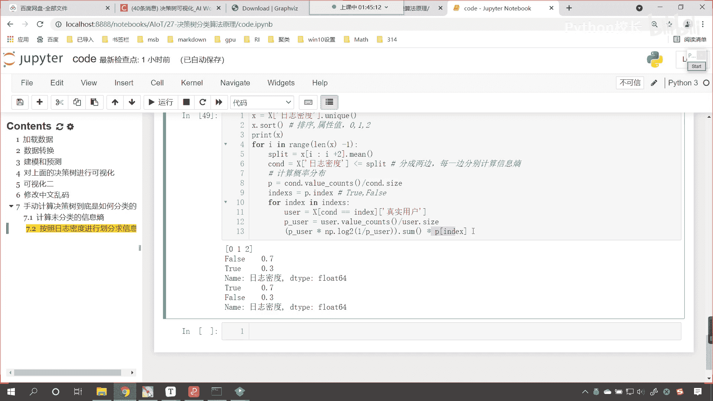

就像咱们在讲解这个代码的时候。

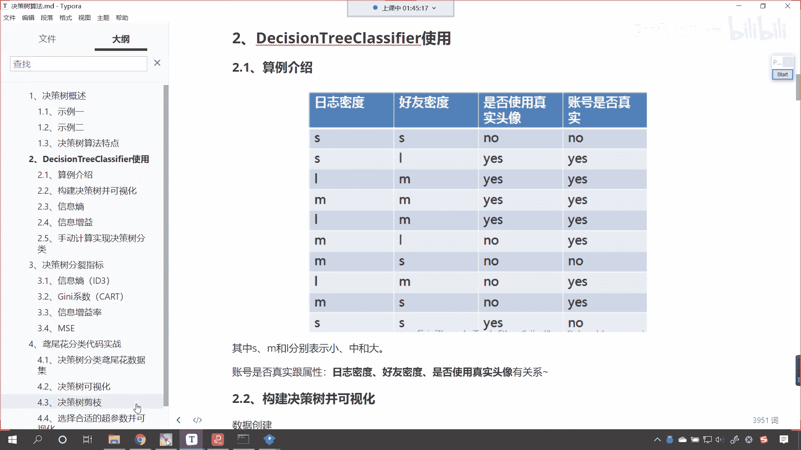

你看我们这儿说了，现在你就能够看到，你看你这个entropy明明不是一嘛，对不对，上面这个是不是0。811，这按道理来说，咱们决策树在进行划分的时候，它越划分它是不是纯度就越高呀，啊你越划分纯度越高。

就像我们从上面0。881~0。811，是不是变小了对吧，那到这儿怎么从0。811，到这变成了一点呀，哎原因是这个啊，未划分之前，你的数据是不是四个呀，看到了吗，三合一，你的数据是四个，对不对。

划分之后左边是不是两个，右边是不是也是两个，那你右边两个你占的比例是多少啊，那就是0。5，左边两个占的比例是多少，也是0。5，所以说这个商应该是怎么算呀，这个商呢就是一点乘以咱们的0。5，应该是这样算。

所以我们的代码当中啊啊。

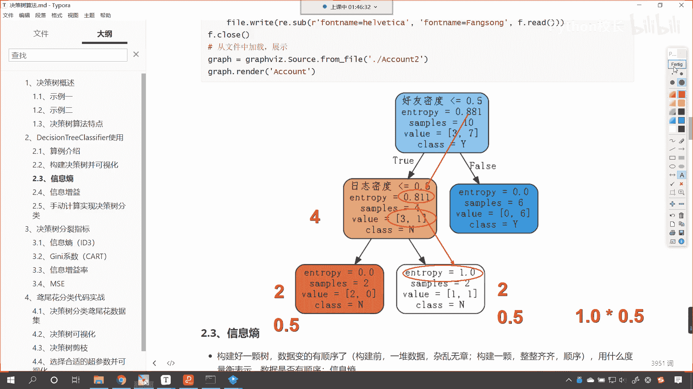

所以咱们的代码当中，我们把这个商计算出来，然后再乘以它这一部分的概率，那么咱们得需要看这个时候呢，我们就得需要在这个entropage，我们声明一个entrop，我们让它等于零，就是在for循环之前。

咱们声明一个entrop，那么，在for循环里边呢，咱们让entropy加等，咱们每一个分支计算出来的啊，这个时候呢咱们计算的是每个分支信息熵，然后呢我们就打印输出一下啊，回退一下，咱们print嗯。

这个时候呢将咱们的例分放到这，split放到这，然后呢我们再将entropy放到这儿，看，此时我执行一下这个代码来，咱们一运行，各位小伙伴，你就能够看到这个信息熵是不是就计算出来了，看到了吗，0。5。

这个是0。68，1。5划分得到的信息熵，是不是也是0。689呀，看到了吧，那我们在没有计，咱们在没有进行分类的时候，咱们的信息熵计算出来，计算出来的是多少，是不是零点啊，881呀。

咱们按照一个特定的条件进行划分，求解出来的信息熵是变大了还是变小了，是不是变小了呀。

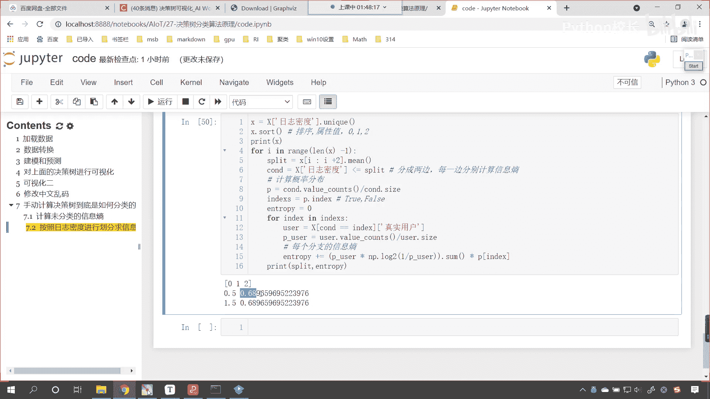

看咱们看看咱们这个代码当中，决策树它的原理是什么啊，看看我们的这个决策树，那咱们这个决策树刚才咱们在进行讲解的时候，这个决策树它是不是根据某一个属性进行划分，那么在进行划分的过程当中。

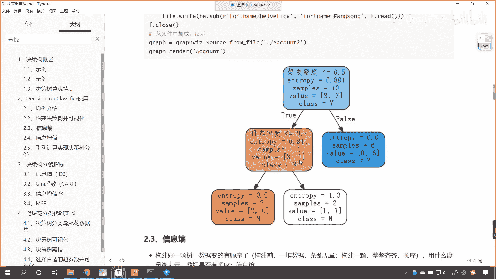

他是怎么样了，构建一棵决策树，这个数据是不是就变得有顺序了呀，构造之前，我们认为这个构造之前的，这个数据是杂乱无章的，咱们构建了一棵树之后呢。

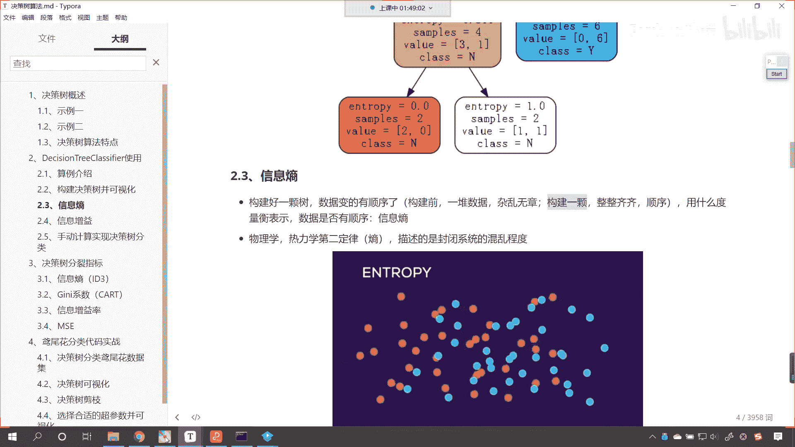

它就变得整整齐齐了，就有顺序了，那么我们代码当中展示的。

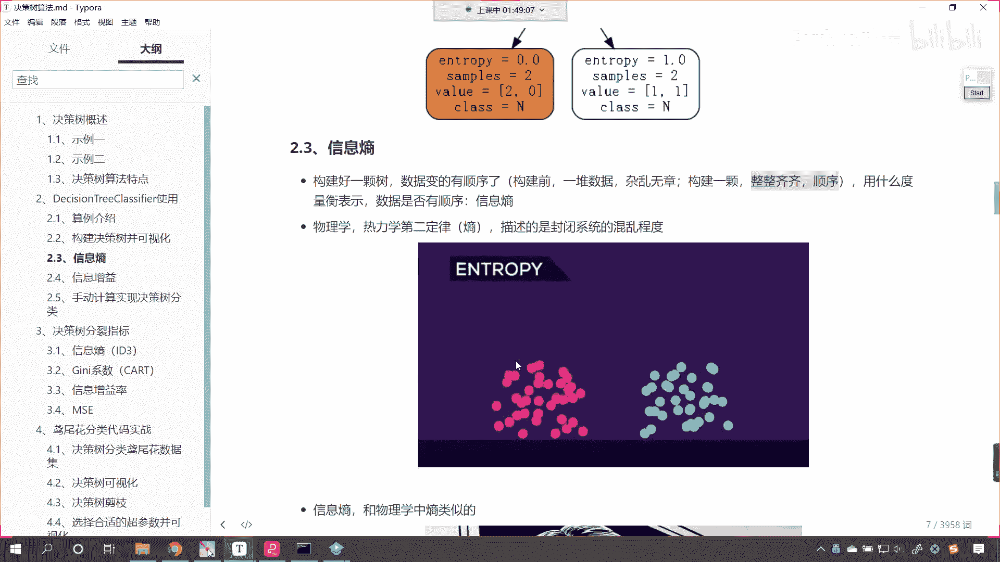

你看这个日志密度，看到了吧，它确实是不是就有顺序了，0。68和原来相比是不是就变小了呀，那么啥叫信息增益，什么叫信息增益，看信息增益是不是就是，知道了某个条件后啊啊知道了某个条件后。

原来事件的不确定性降低的幅度呀，那在我们的代码当中，你看在咱们的代码当中未进行划分的时候，是不是0。881，所以咱们信息增益该怎么算，看看咱们的信息增益是如何算的，那是不是就是0。881减去。

咱们计算出来的0。68，0。6嗯，896呀，对不对，你看我一直行，这就是咱们信息增益，因为我们根据这个条件进行划分，这是我们计算出来的，大家要注意啊，咱们在计算的时候，我们根据了日志密度。

这个地方是不是有两层for循环呀，看到了吧，你要注意有两层for循环，这个代码你要使劲儿地去理解一下，上面这个代码是取它的唯一值，这个比较简单，然后呢我们你看非常巧妙的，咱们进行切片，我们一切切两个。

为啥要切两个呀，是不是就是嗯切完两个之后求平均值，这个是不是就是咱们的嗯列分值呀，看这个是什么，看这个就是咱们的列分值，有了列分值之后，咱们是不是找见日志密度，让它小于等于它呀，那是不是就分成两边。

是不是一个是左边，一个是右边呀，看到了吧，你看你根据某一个条件放到这儿，一个是左边看到了吧，一个是左边，对不对，另一个是不是咱们的右边呀，是不是就分成两类了，分成两类之后，咱们两边单独算。

看分成两类之后，然后两边单独算，这个时候呢我们使用value counts，这个是计数，然后再做一个除法，是不是就把它概率分布给计算出来了呀，你不是分成两边吗，那就是你左边的概率是多少。

右边的概率是多少，这个就是咱们的p，因为我们是逻辑运算小于等于四split，所以说这个p的index它其实就两种，要么是true，要么是false，那我们就再来一层for循环看，再来一层for循环。

你看我取出的这个数据是不是对应着y，咱们取出了什么，是不是目标值y的数据，你看看是不是是吧，咱们是根据什么条件取出来的呀，是不是c n d等等，index看到了吗等等，你这个index要么出。

要么是false，是不是，然后取出取出，咱们因为上面咱们说了是左边的分布，右边的分布，那我们就取出左边的分布和右边右边的分布，取出来，这个之后这个就是咱们的用户user，然后继续继续对他计算一下。

看到了继续对它进行一个计算，user。size，这就是它的概率，有了这个概率之后呢，咱们就去计算分支的他的这个信息熵，然后最后呢entropy加的好。

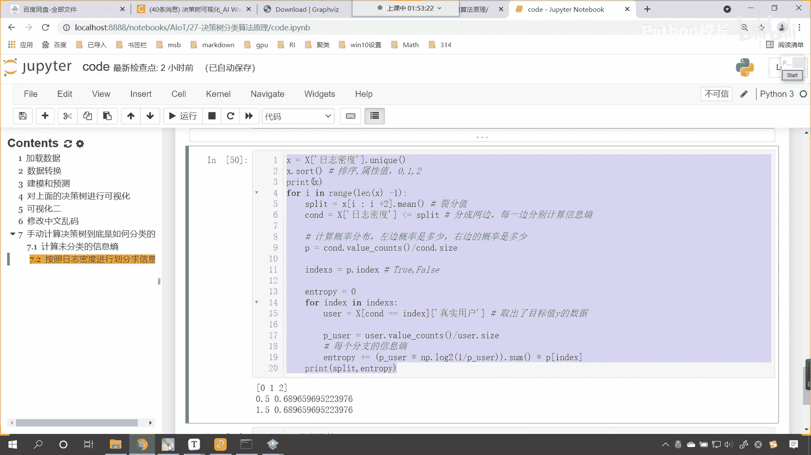