# P182：7-手写代码计算信息熵对比不同属性信息增益 - 程序大本营 - BV1KL411z7WA

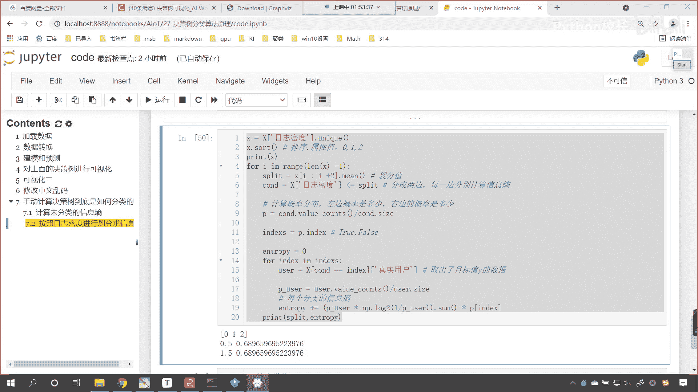

好那么日志密度咱们的信息增益出来了，代码咱们就复制一下啊，看啊ctrl c复制一下，在这来一个粘贴上面插入一行。

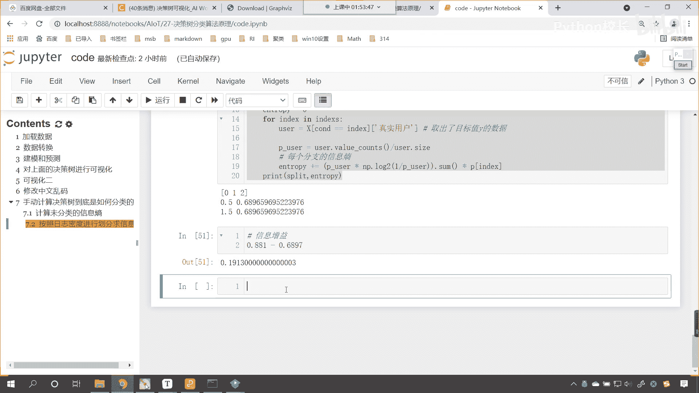

咱们来一个四级标题，在这儿呢咱们就按照好友密度，咱们进行划分，我们求一下它的信息熵，好，那么如何算呢，代码不用动，咱把日志密度给它改成好友密度就可以啊，好友密度你这改成好友密度了，下面再进行列分的时候。

这个地方是不是也改成好友密度呀，其他的地方都不用动，看啊，我执行一下来，各位小伙伴，你能看到，看咱们如果要根据好友密度进行划分，你看你因为你好友密度是不是也是012呀，对吧，因为你的属性值也是012啊。

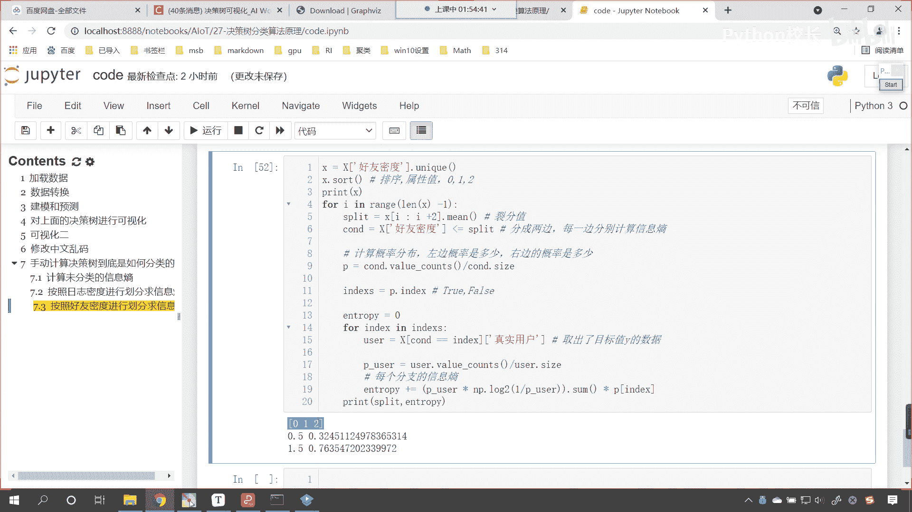

因为咱们好友密度呢，你看这个这个好友密度，你看它也是sm和l对不对。

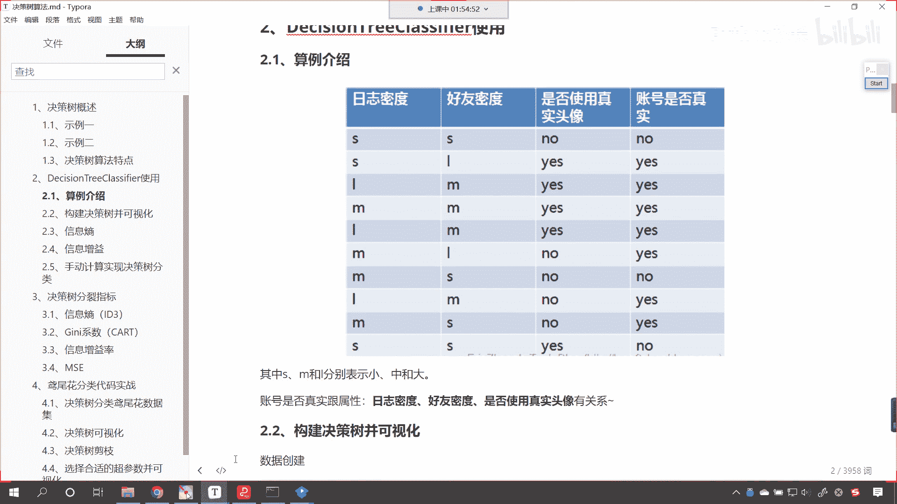

所以它对应的值也是012，那么如果我们对于这个三个值进行划分，你想咱们的拆分条件是不是要么是0。5，对不对，要么是多少，是不是，要么是1。5呀，对不对呀，你看要么是0。5，要么是1。5，没错吧。

来这个地方，各位小伙伴你理解了，那你就回复一个1024啊，看回复一个1024，好看来咱们各位小伙伴的悟性都很高啊，特别棒啊，那我们继续往下讲啊，好那现在你就能够发现看到了吧，你看你0。5。

这个时候按照这个划分，咱们的这个信息熵是多少，0。324，那么他的信息增益呢，信息增益啊，咱们的信息增益是多少，是不是0。881减去多少，是不是减去咱们的0。324呀，你看我一执行，这是多少，0。

5569，谁大呀。

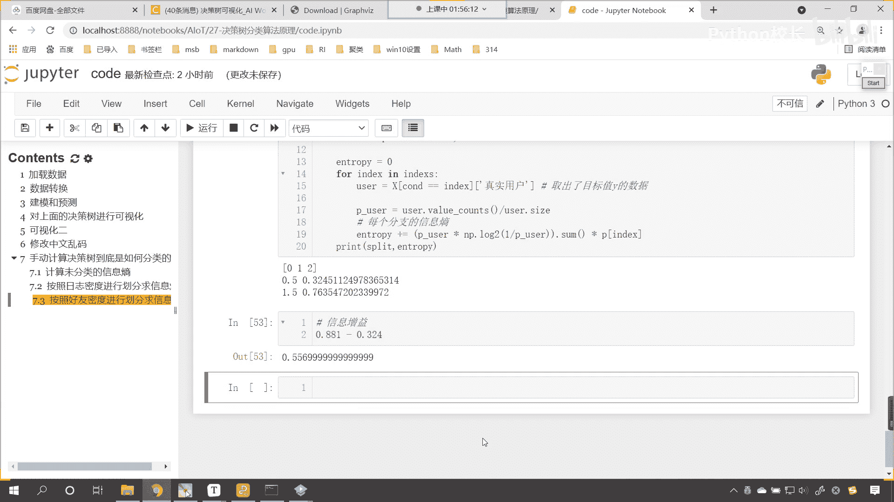

咱们的日志密度，按照日志密度进行划分。

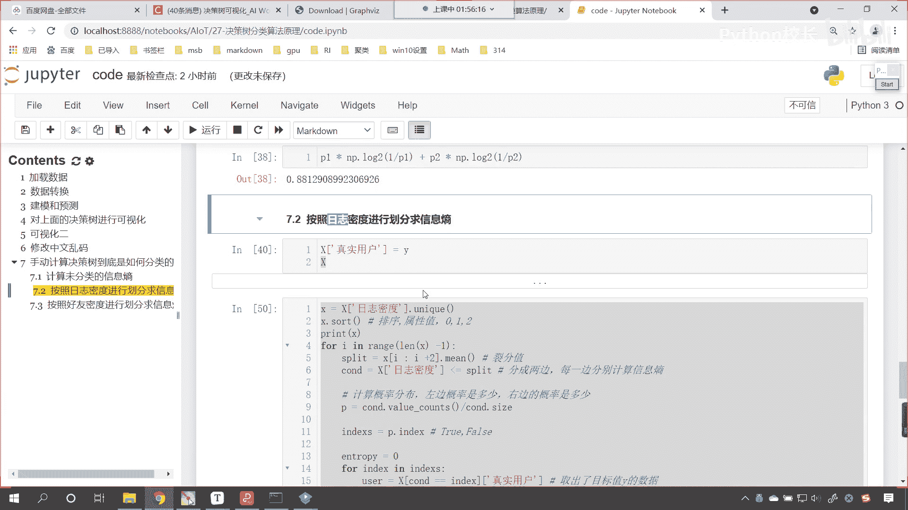

它的信息增益是不是0。1913呀，按照好友密度进行划分，他的信息增益是多少啊，0。560。5569谁大，是不是按照好友密度进行划分，它的信息增益更大呀，所以啊所以。

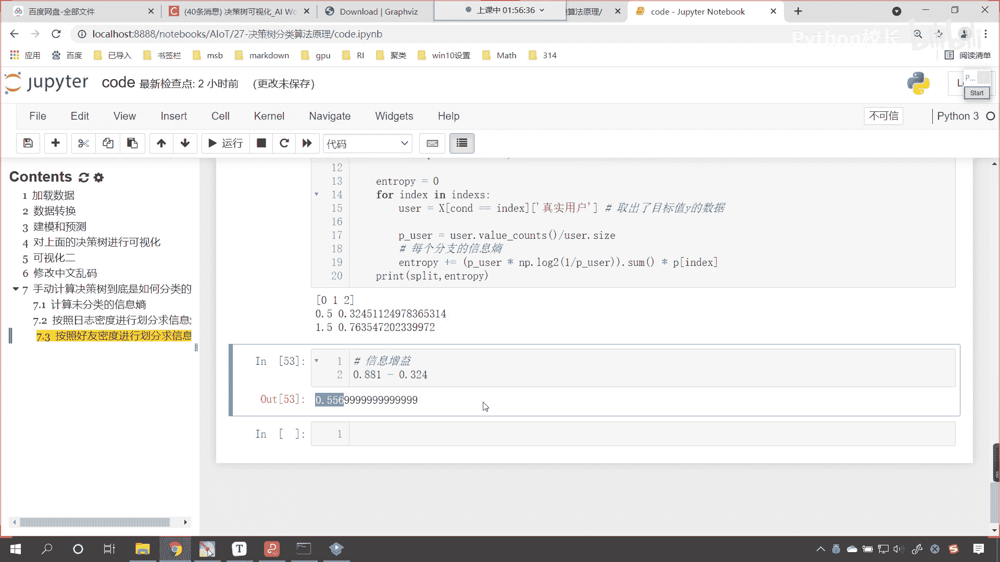

我们进行划分的时候看。

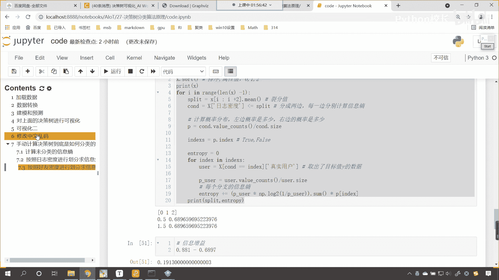

所以咱们进行划分的时候，咱们是根据谁来划分的，看到了我们跟我们是根据谁来划分的，是不是根据好友呀，那咱们现在就算一下啊，看啊咱们算出来的啊。

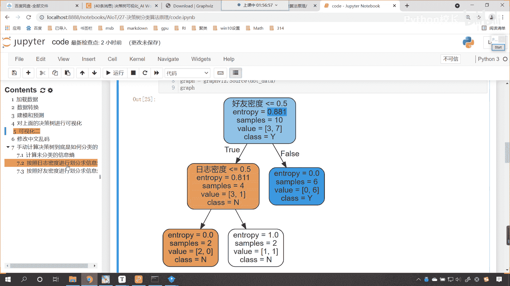

咱们算出来的这个按照0。5划分，我们的商是不是0。324呀。

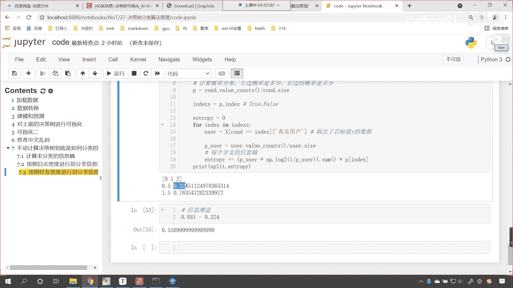

那为什么上边看。

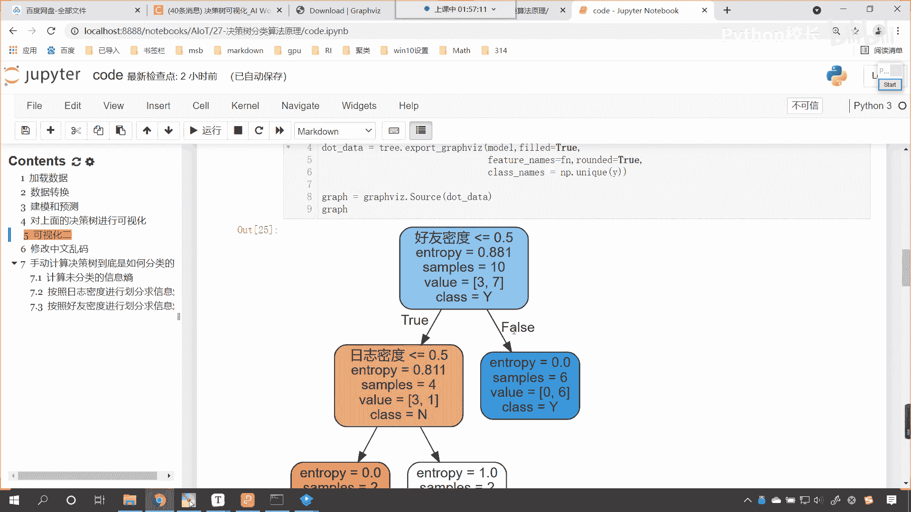

为什么咱们这个上面这个商它是0。811呢，在这里我告诉你为什么啊，上面插入一行，咱们来算一下。

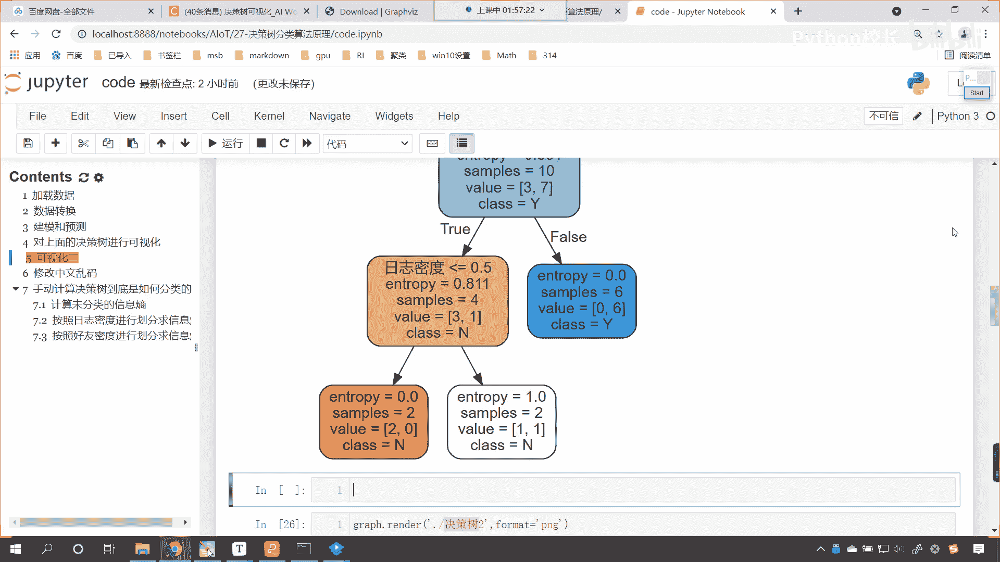

咱们按照这个条件看，我们按照这个好友密度进行划分，它是不是分成了两部分，没错吧，右边这部分这个伤是多少，零不用算，因为它纯分纯了，对不对，看到了吧，你这个熵越小越纯，看这个商越小，咱们就越纯。

你看这边是不是全是y看到了吧，分纯了，全是y0 和六，看到了吗，这是零和六，零呢就代表零个假用户，六个真用户看商越小越纯，那我们的物理上的熵，是不是表示系统的混乱程度呀，你现在全是y是不是很纯呀对吧。

是不是很单一，那这一部分它的比例是多少，是不是0。6呀，对不对，看这部分它的比例是0。6，我们看左边这部分是不是一共四个数，它的比例是不是0。4，咱们这一部分的分支，它的商是多少，看他的伤是不是0。

811呀，我们让0。4x0。811，然后再加上多少，加上0x0。6，因为你这儿的商是零，比例是0。6，左边的商是0。811，你的比例是不是0。4呀，咱们就根据这个公式算一下。

我让你看一下啊，0。811，咱们让它乘以0。4，然后再加上0x0。6，你看我一直行，求解出来是多少，0。324，是不是看0。324。

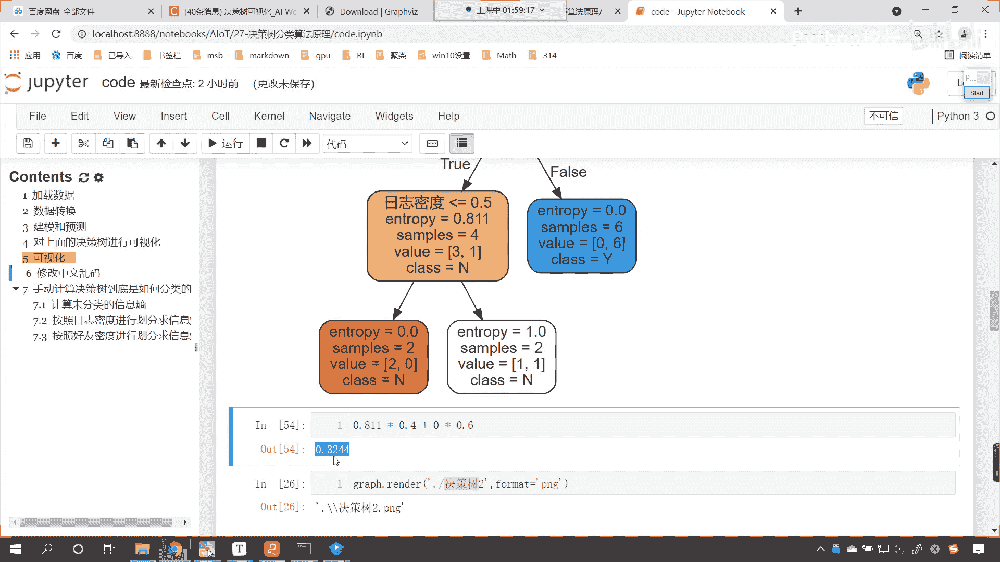

大家要注意啊，这个是算法看啊，这个是咱们决策树算法计算出来的值，我们算出来的是多少，看啊，你仔细看这个呢是决策树给我们返回的结果，对不对，这是决策树给我们返回的结果，我们算出来的是多少啊。

往下滑诶，各位小伙伴，你看各位小伙伴，你看我们算出来是多少，是零点多少啊，0。324，看到了吧，一样不一样，你告诉我一样不一样一样，是不是啊，所以你就知道决策树到底是怎么回事了吧。

那现在呢我再来一个打印输出啊，咱们这样啊，再再来一个打印输出，你看这个地方不是加等嘛，对不对，看到了吧，这个地方我是不是加等，没错吧，好那么我现在呢把这个值呢给它剪切一下啊。

咱们用一个变量来接收一下这个值呢，咱们起个名就叫e是吧，然后加等e嗯，那我们打印输出一下好不好看，咱们打印输出一下，那就是print supercli，然后逗号咱们将e放到这儿，然后咱们再将概率放到这。

那这个概率呢就是p中括号index，大家看啊，看我怎么操作的啊，下面这个打印输出咱们就不要了，先注释一下看啊，那打印的时候呢，咱们来一个杠杠杠杠杠看啊，一直行，啊一直讲看咱们好有密度。

这你看这个结果是不是，就这个结果是不是就出来了啊，嗯等会儿啊，咱们这个呃，因为咱们这个e这是吧，它又成了一个p，那咱们这样啊，咱们呢把这个详细的结果给你打印输出一下，复制一下，把这个e呢替换一下啊。

ctrl v也就是说我先不让它乘以比例，这个时候你看我一直行，来，各位小伙伴，各位小伙伴，现在呢你睁大眼睛啊，因为我们for循环是进行了两次是吧，咱们现在呢给他来一个减二啊，执行一下啊。

也就是说我们不让他把所有的都便利，咱们只遍历最优的那个条件，你看看啊，0。5表示拆分条件，咱们这个0。5也先不打印看啊，0。60。4这个表示什么，是不是表示比例呀，看啊0。6对应的后面的商是多少，零。

0。4对应的商是多少，0。811，看咱们的图，你看看咱们的图。

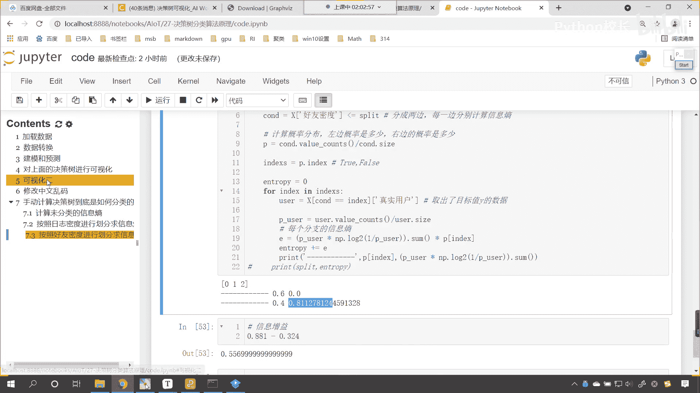

看，看看咱们的图，你看这个这个是不是六，它所对应的比例是多少，是不是就是0。6，它的商是多少，是不是零，左边这个呢比例是多少，0。4，它的商是多少啊，0。811，看到了吧，我们计算出来的是多少。

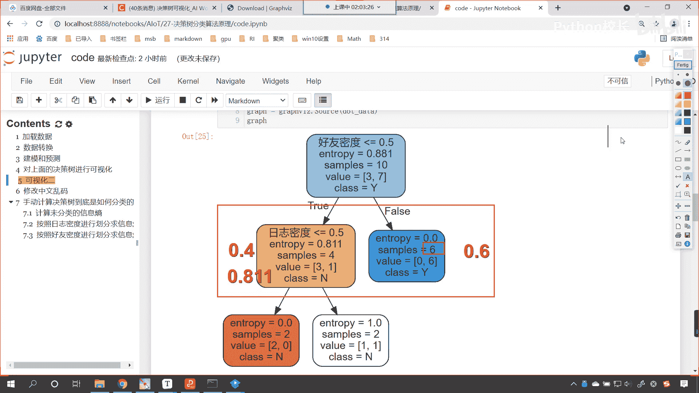

看咱们计算出来的是多少，0。811，保留三位小数，是不是就是他呀，所以只要这段代码你能够搞明白。

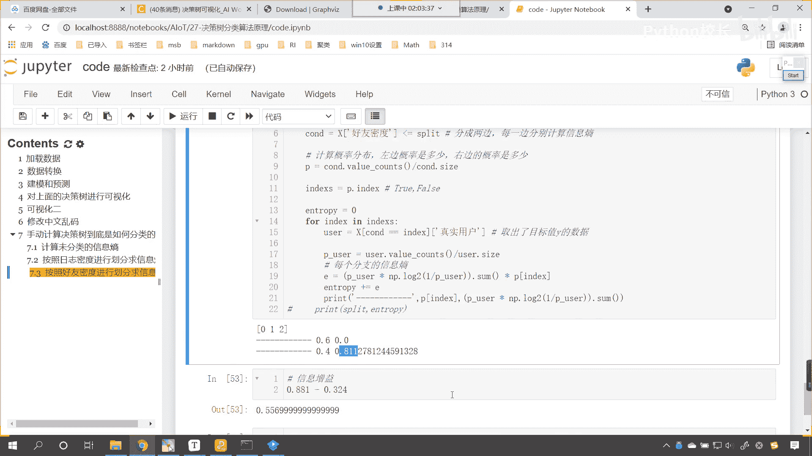

弄清楚。

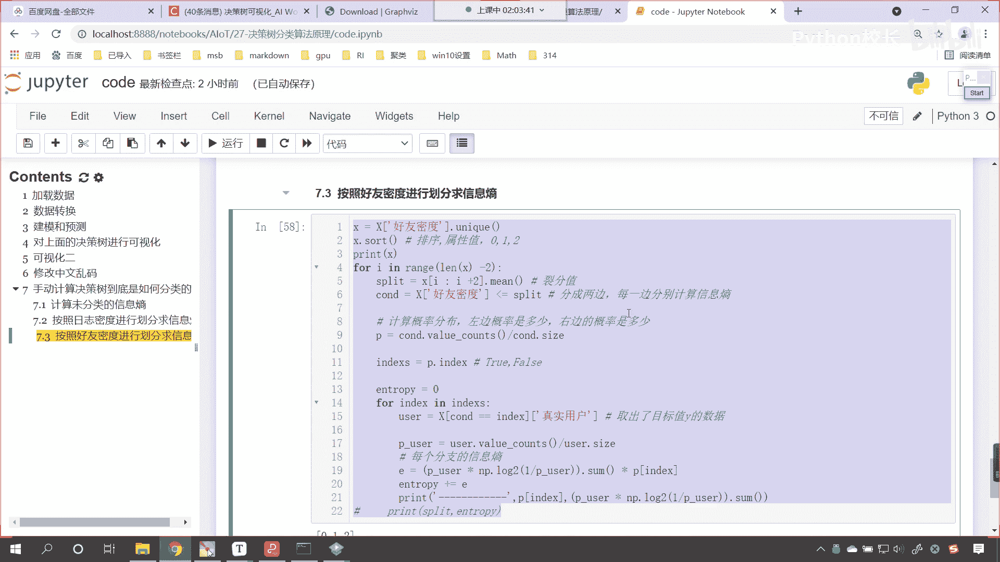

那么决策树你是不是也可以代码把它写出来呀。

对不对，好，那么我们最后再看一个啊。

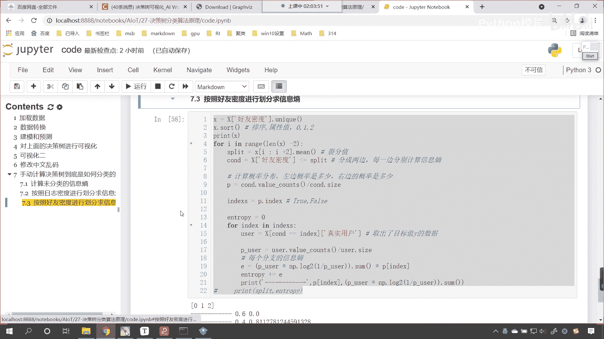

那我们按照好友密度进行划分了。

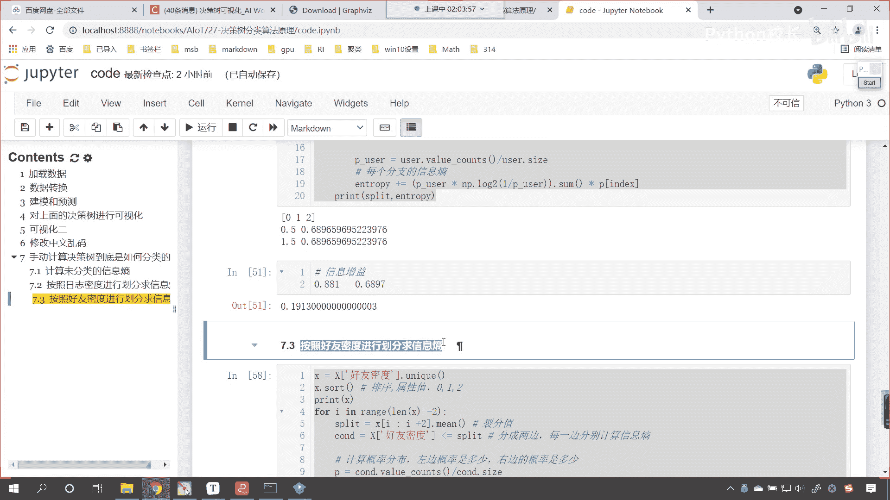

按照日志密度也进行划分了，他俩一pk。

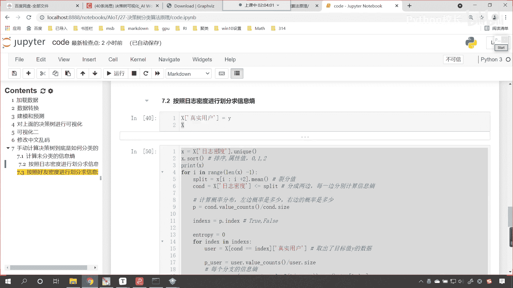

咱们就发现这个信息增益呢是好友密度，它的变化是不是比较大，看到了吧。

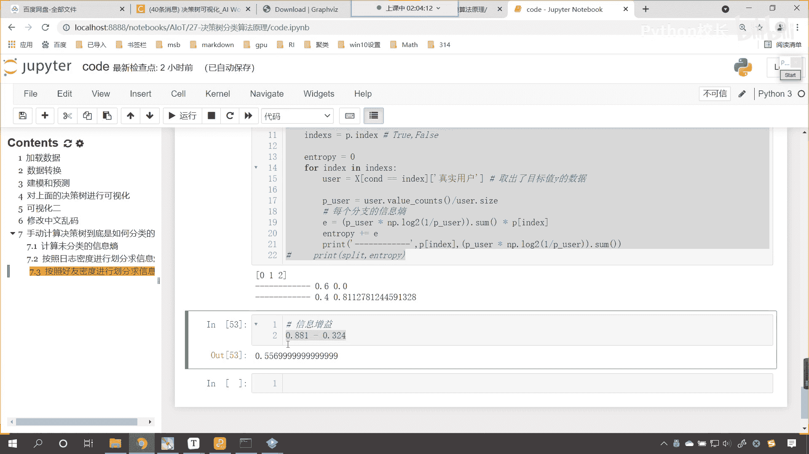

它的变化大，我们说这个信息增益谁比较大。

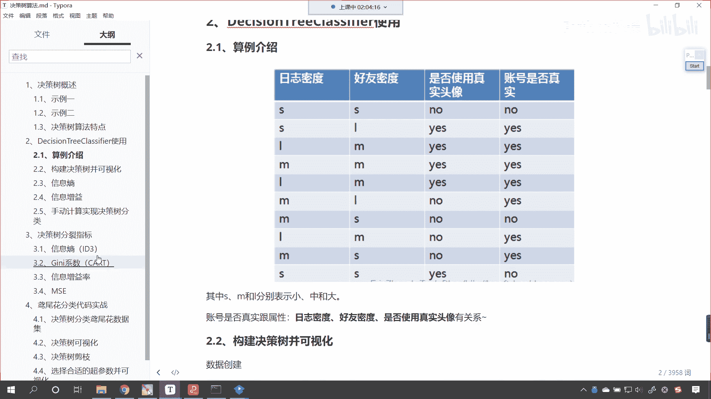

谁是不是就比较好呀，看信息增益是知道了某个条件后，事件的不确定性下降的程度。

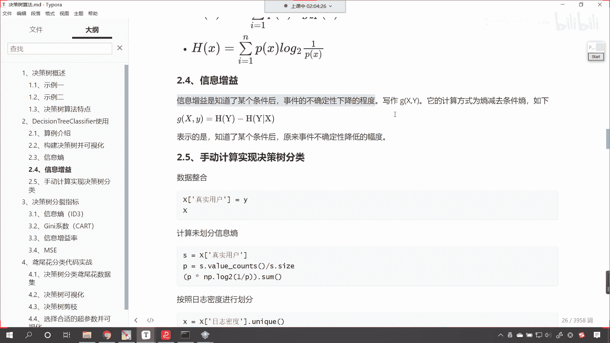

那我们这个数据按照好友密度划分好。

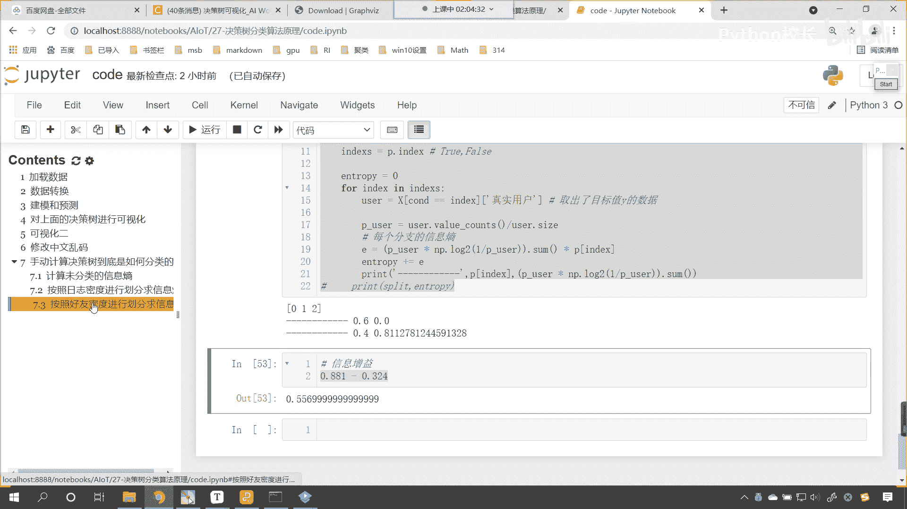

还是按照日志密度划分好，看到了吗，按照好友密度划分，还是按照认知密度划分来。

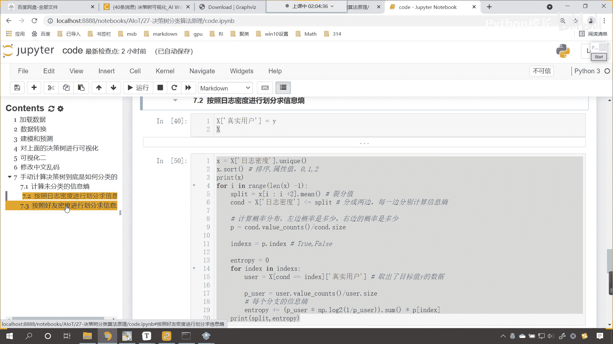

讨论区里面回复一下，是不是按照好友呀，你也想一下，你想一个假账号，是不是很有可能他会发表很多篇文章呀，是不是可能会发表很多篇这个博客呀对吧，但是呢如果说它是一个假的账号，那么他是不是就没有太多的朋友呀。

对不对啊，所以说这个好友是不是更加重要，这个是我们的常识，那我们根据信息熵计算出来的结果，和常识是不是也吻合呀，那最后呢咱们按照，那最后呢咱们就按照这个是否使用真实头像，咱们来进行一个划分。

我们求一下信息熵。

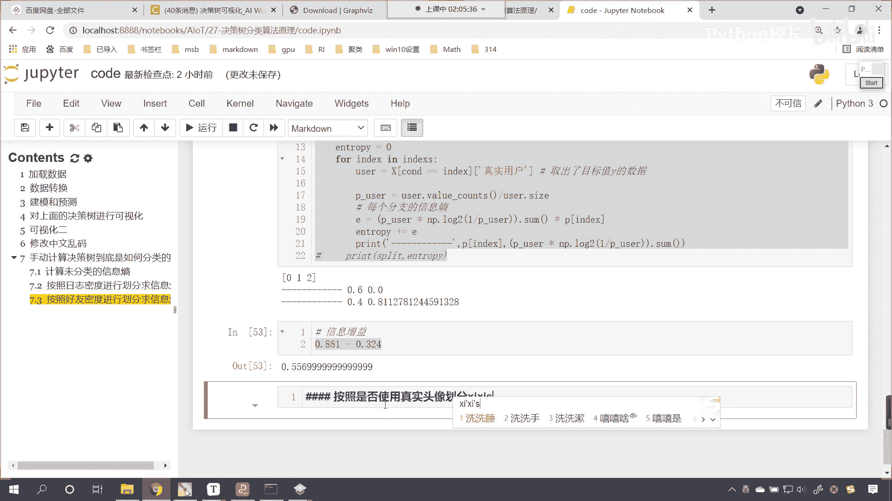

好那么咱们将上面的代码我们复制一下。

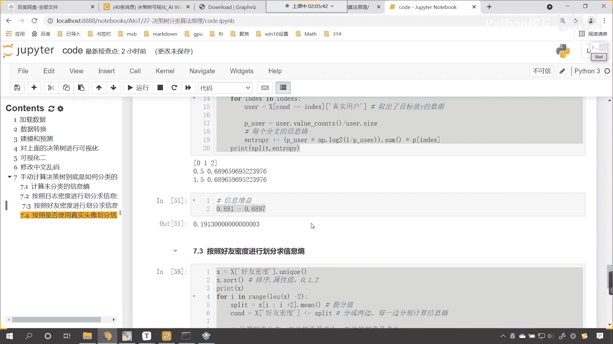

ctrl a ctrl c在这儿呢来一个粘贴，那这个日志密度咱们删除，那这个时候呢就是真实头像是吧，看一下咱们的数据x好，那就是真实头像，咱们呢就使用这个啊来操作，日志密度改成真实头像。

你看我执行这个代码来，各位小伙伴，你能够看到咱们按照真实头像来进行划分，求解出来的商是多少，是不是0。849呀，那我们未分类咱们的商是多少，是不是0。881对吧，按照头像进行划分，有没有效果，看0。

881，咱们减去按照头像划分的，0。849，你看执行一下啊，0。849，你看这个信息增益是多少，看这个信息增益几乎没有效果，对不对啊，但是它是有变化的啊，注意啊，这个不是零，只有他是零的时候。

你才能说完全没效果，所以说咱们这个真实头像是吧，这个真实头像他的信息增益是不是就比较小呀，所以说这个特征就不重要，所以你网上聊天的时候，你能光看对方的头像吗，不能吧，你在交男女朋友的时候。

你能光看对方的长相吗，是不是也不能呀，对不对，你看马云的大学同学现在有多少后悔的呀是吧，当年要选马云就好了，是不是俞敏洪的大学同学是吧，那时候班里边人是吧，女生都瞧不上她。

现在她是他们班混的最好最好的是吧，所以说你看啊，这个就是咱们跟这个根据真实头像，这个是最不靠谱的，是不是啊，所以说你这个以后看到微信呀，加你好友的时候是吧，那个头像特别漂亮，一般都是骗子啊。

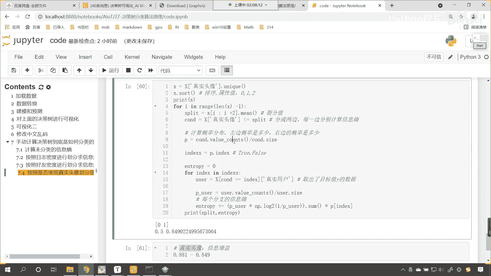

好现在呢我们就根据这个信息增益是吧，咱们就有了一定的认识了，这是好友密度的信息增益，上面这个是日志密度，它的信息增益好，那么咱们今天的主要内容我们呢就讲完了，咱们看一下咱们的作业啊。

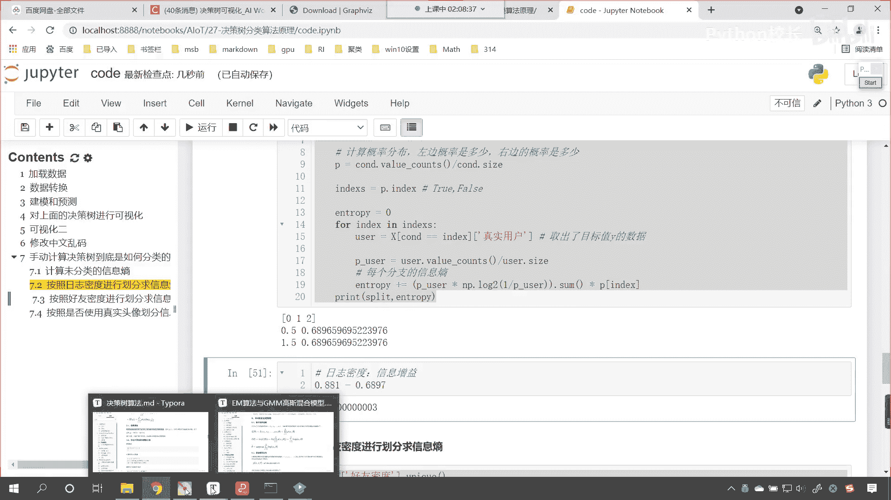