# P183：8-作业要求 - 程序大本营 - BV1KL411z7WA

下来接下来咱们看一下咱们的作业啊。

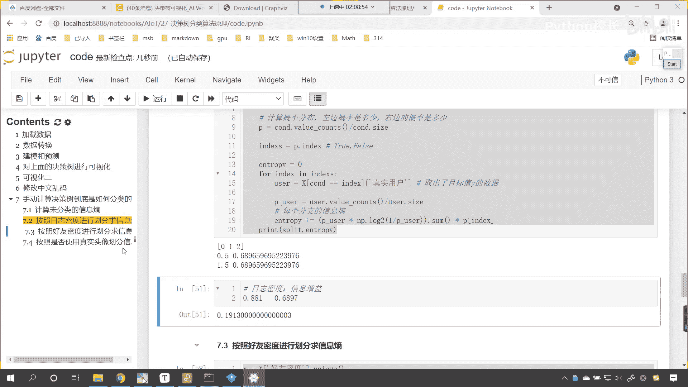

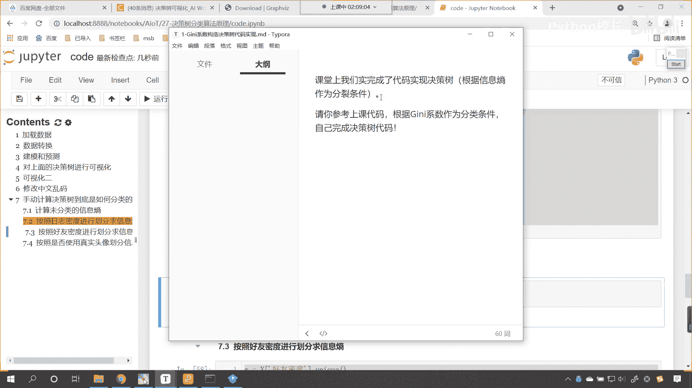

好，咱们课堂上呢，我们完成了这个决策树代码的构建，咱们是以信息熵作为分类条件，那么请你参考咱们上课的代码，根据基尼系数作为分裂条件，自己完成咱们的决策书代码，看这回呢你要根据基尼系数了。

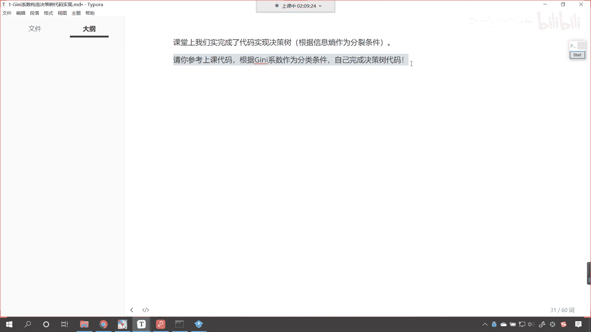

啥意思呢，来我们往上滑动啊，看看这个代码啊，咱们这个代码呢，它是这个它是咱们的这个信息熵。

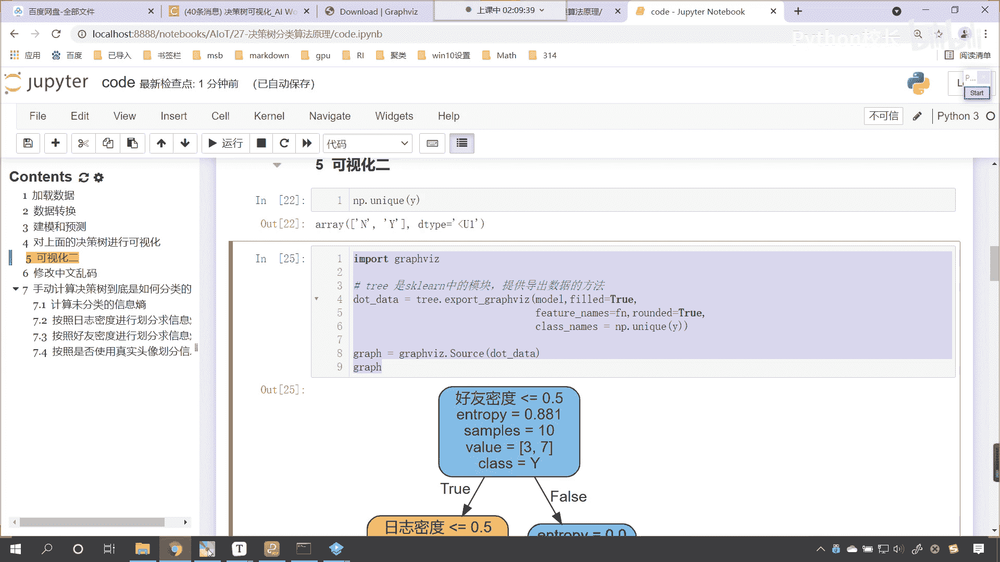

是不是啊，那我们的作业要求是这样的，咱们呢就创建一个model，model就等于decision tree classifier，然后model。feat，咱们将x放进去，y放进去。

这个时候这个x呢因为它含有咱们的目标之外，所以说咱们来一个切片就切到-1啊，这个时候你再来看，你看我一执行，你看这个时候是什么，是不是基尼系数呀，看到了吧，0。42默认情况下它使用的是0。42。

这个基尼系数是不是0。375呀。

那请问这个基尼系数是怎么算出来的，看0。375是怎么算出来的是吧。

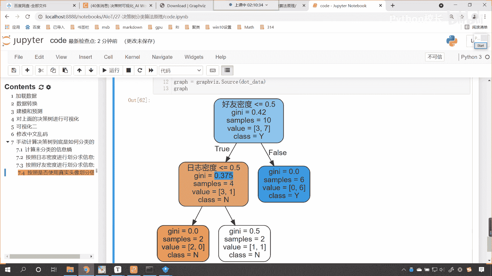

这个0。42是怎么算出来的，那我们上课的时候。

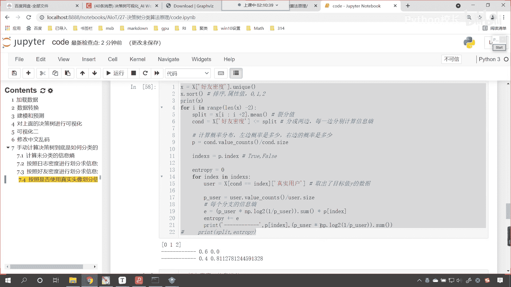

咱们介绍了一下是吧，这个信息熵0。881怎么算的。

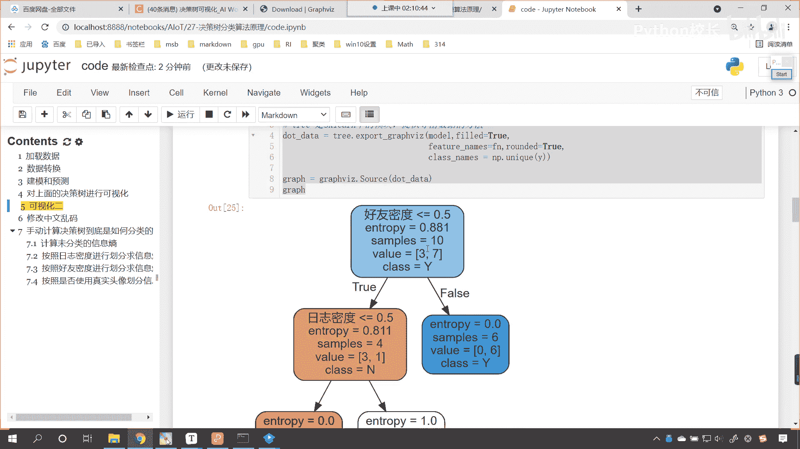

我是不是给各位算出来的呀，零点点这个811怎么算的。

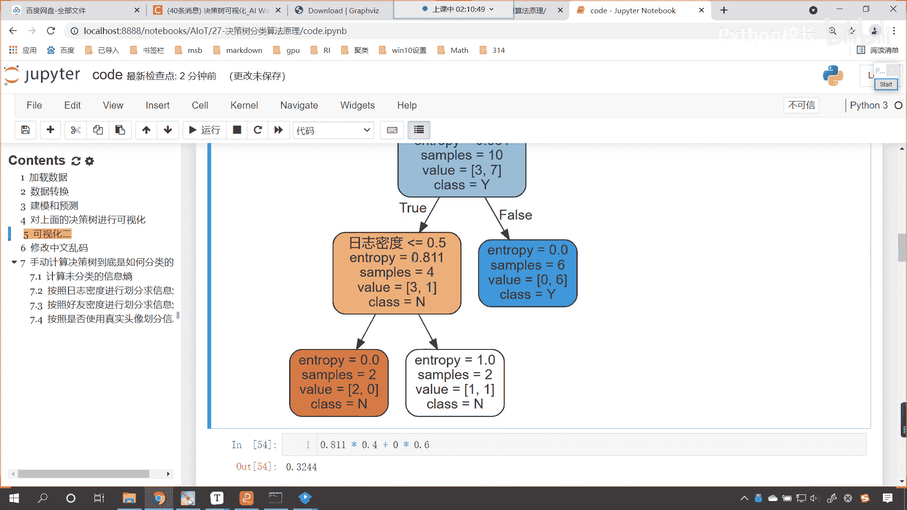

我是不是也算出来了，对不对，好现在呢咱们的作业呢就是基尼系数怎么算。

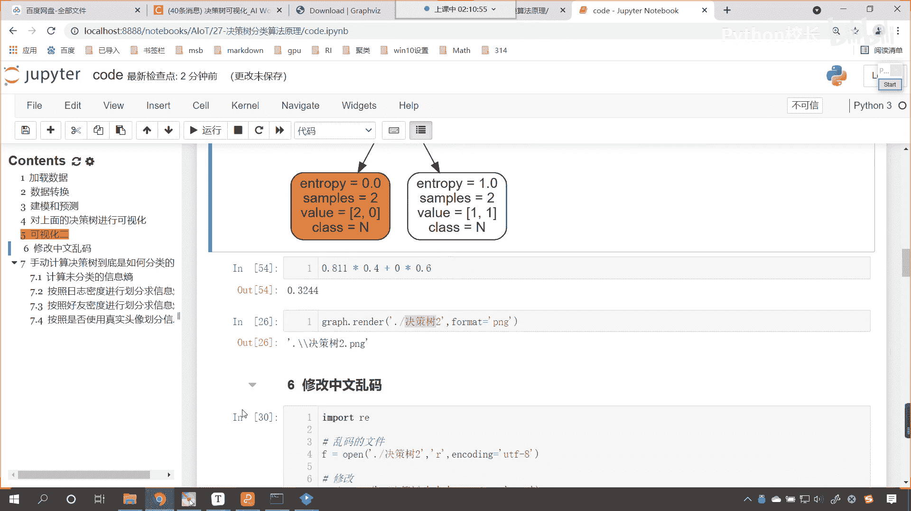

基尼系数怎么算呀。

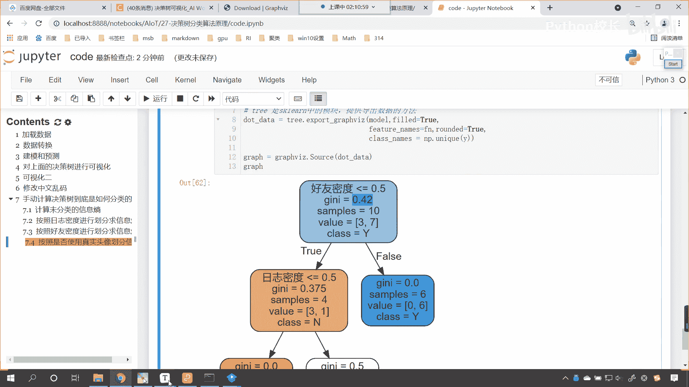

有相应的公式看啊，基尼系数看到了吧，这个就是基尼系数的公式，简单不简单是吧，太简单了，看到了吧，其实就是pi乘以一减pi是不是简单吧，但是呢你想要理解咱们的决策树，到底是怎么构造的。

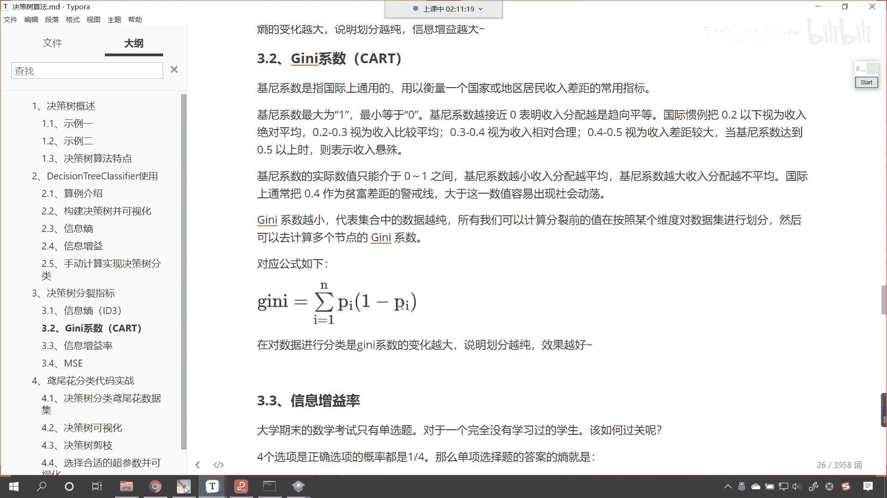

那么你得需要把这个图算出来，知道吗，把这个图算出来，0。42和0。375，这就是咱们今天的作业啊，好那么我们今天的上课内容呢。

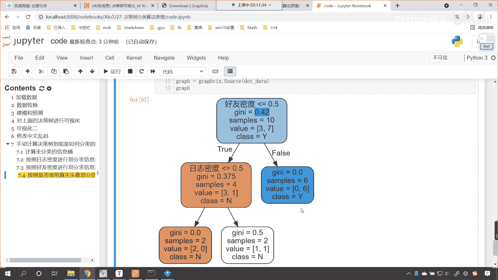