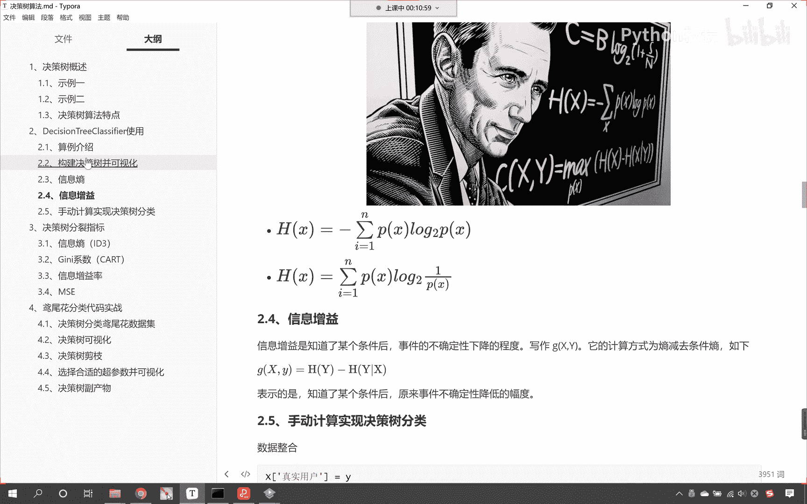
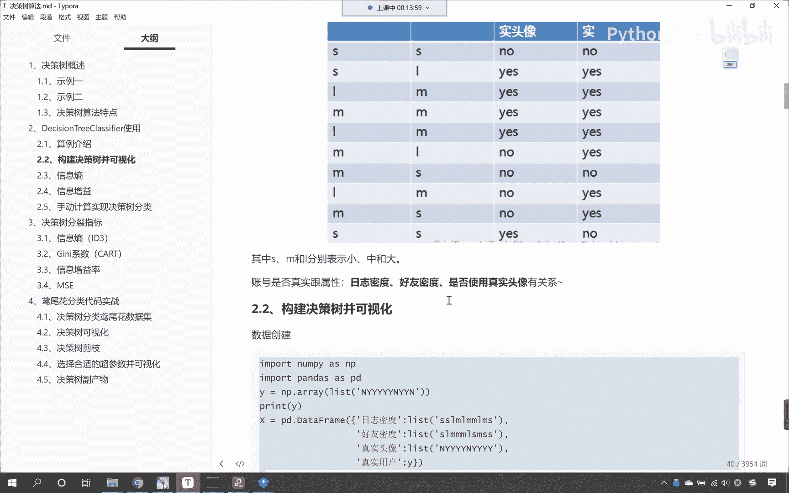
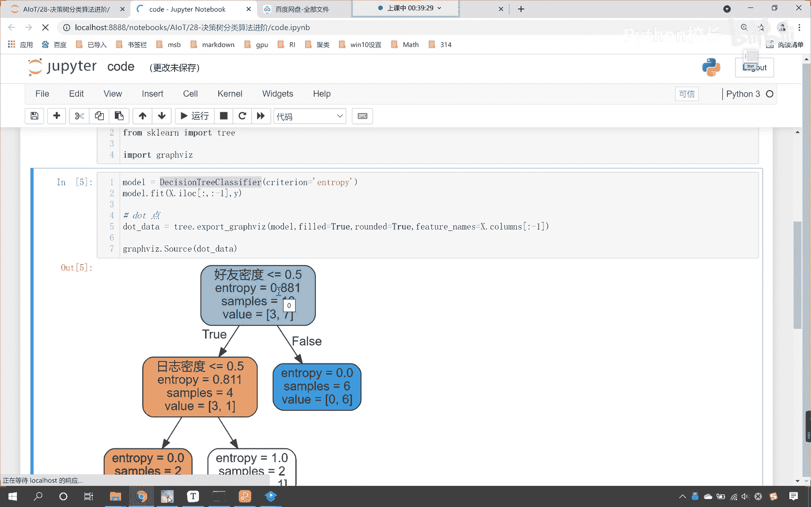
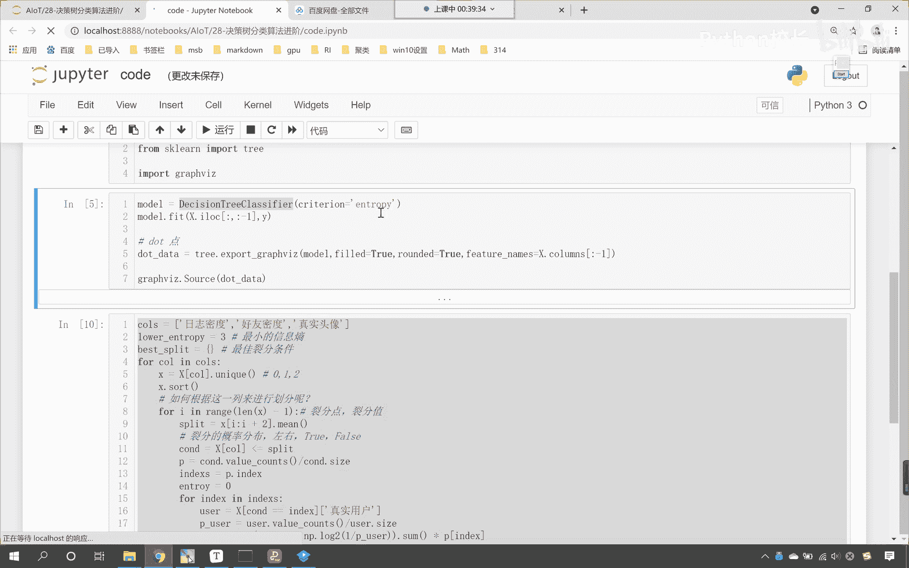
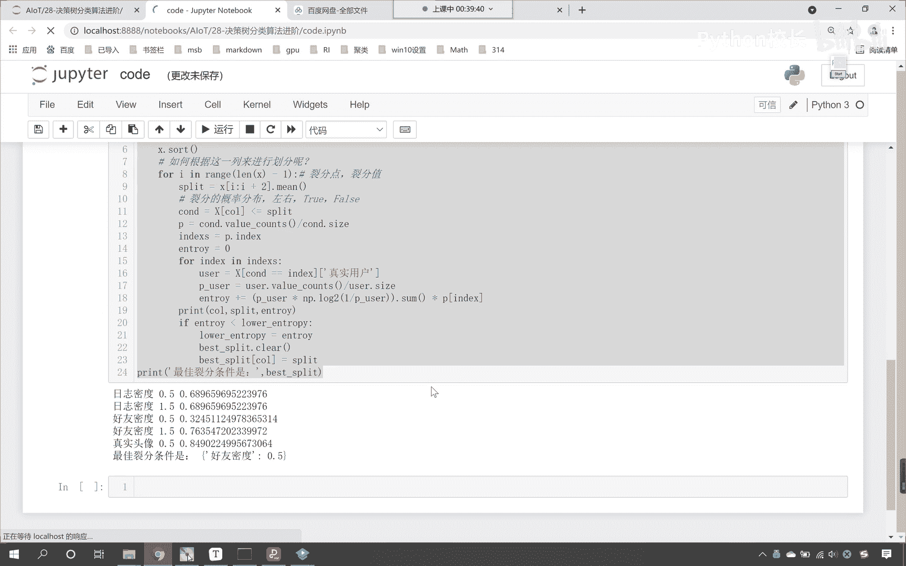
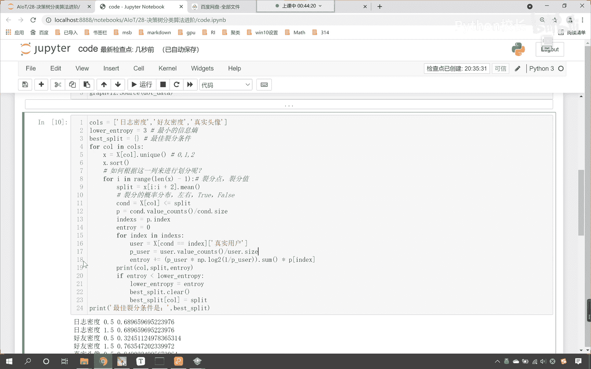

# P184：1-决策树原理：代码筛选决策树的根节点 - 程序大本营 - BV1KL411z7WA

来那现在的话我们做这样的一件事情。

咱们知道咱们的决策树在进行列分的时候。

看咱们的决策数在进行划分的时候，我们是不是使用了好友密度，用这个属性作为咱们的根节点，对不对，那咱们的这个数的结构看它大概是什么样的呢，在这里呢我们大概去描述一下啊，好那么这个呢就是咱们的根节点啊。

这是一棵树的根节点，那么再往下看呢，就这一部分大家看啊，这一部分是我们树的子节点啊，这个是子节点，那么还有一部分你看是不是这一部分呀，对不对，那这一部分和咱们黄色的这一部分，以及咱们蓝色的这一部分。

它们呢都属于是叶结点，你看叫做叶节点，我们知道一棵树是吧，它是从下向上长的，对不对，看咱们一棵树呢是从下向上长，然后呢它开枝散叶，对不对，而咱们算法当中咱们的树是怎么长的呀，咱们是不是从上往下长呀。

和咱们真实的数呢刚好相反，那么在咱们决策树当中，在咱们决策树当中，我们这个属于是叶结点，这个也属于叶节点，这一部分呢也属于是叶结点，那么最上面这个叫做根结底，这就像树根一样，那么这一部分日志密度。

这个呢它叫做子节点，咱们的结构呢都是按照这样的结构来进行，依次向下构建我们的决策树，那有可能咱们的属性要多了，咱们这个决策树可能会复杂一些，明白吗，决策如果这个数据多了，咱们的决策数可能会多一些。

现在呢我们就带着疑问来开始，咱们今天的这个课程，咱们说了这个好友密度是吧，它到底是怎么来的呀对吧，那然后接下来我们选了个日志密度是吧，那咱们现在呢就使用代码，咱把这个呢给它再现一下。

现在呢咱们就来一个综合的代码啊，那么首先呢我们往上滑，咱们呢找到咱们的数据好不好，来我们复制一下这个代码，像这部分代码，咱们就没有必要再去手写了啊，因为这个是数据的创建。

这个数据呢就是咱们看到的这个图好。

那么咱们就回到我们的代码当中，咱们在这儿呢给他来一个三级标题，哎这个呢就是咱们的条件筛选决策树的根节点，好，那么我们ctrl v我们把数据给它创建一下，这个时候你看我一执行，大家看咱们的数据有了。

此时咱们的数据呢它属于是字符串，那这个字符串呢咱们没有办法进行运算，所以咱们紧接着需要把这个数据来一个映射，对它进行一个转换复制，咱们就用map方法来进行这个映射和转换，ctrl v唉。

此时呢我执行一下这一部分代码，咱们在上一节课当中呢，我们都有讲过，所以说呢咱们快速的来执行一下啊，经过咱们这个map映射，各位小伙伴能够看到，咱们的数据是不是就有了呀，有了之后呢，咱们导一下包。

那我们就from，咱们的from sk run，咱们从ree下边from sklearn t r e e，我们从trade当中，咱们import decision tree classifire。

然后呢我们声明一个模型model，那不仅要把咱们的分类算法导进来，同时呢我们，咱们from，sk learn，咱们import，咱把tree这个模块导进来，然后呢咱们import graph va z。

把这个也导进来，执行一下这个代码，然后呢咱们声明这个算法，我们给他一个分类标准叫criteria，在这儿呢咱们给一个entrop e n t r o p y，这个就是咱们的商，然后咱们就使用model。

feat一下，我们将数据x和y放进去，此时大家要注意，咱们的x当中的第四列是不是咱们的目标值呀，x是一个data frame，其实它的前三列才是咱们的数据，所以这个时候我们要做的一件事情呢。

咱们就来一个i log，咱们呢来一个切片冒号，逗号冒号，咱们给一个-1，这个时候，那么因为切片的时候是左闭右开，所以说最后一列呢就取不到，那这个时候这个模型咱们就训练好了，咱们把它可视化输出一下。

那就是trade explograph v a z，那在这个里边呢，咱们将model这个模型给它输出一下，我们给一个field颜色要填充一下，然后呢我们给一个run，我们让它是圆角。

然后呢我们给一个feature names，就是是什么特征呀，是日志密度还是好友密度呀，那咱们来一个x。columns，columns的话，它会一下子返回四个，所以这个时候咱们来一个切片，也来一个-1。

和咱们上边训练数据，这个-1表示的含义是一样的，x。columns是一维的，所以这个时候呢咱们直接给一维的就行，而上面的这个x是我们的训练数据，它是一个data frame，它是二维的。

所以说咱们使用二维切片这种方式，我们来进行啊，这个时候你就能够看到这是不是有一个逗号呀，逗号前面表示意为逗号，后面表示意为逗号，前面表示行，逗号后面表示力好，那么这个时候呢咱们就获取了这个决策树。

它的构建数据，这个时候呢咱们就来一个dot data，大家注意啊，你看我在命名的时候也非常讲究这个dot，它的意思呢就有点儿的意思，看到了吧，这个dot就有点的意思，那其实咱们在进行列分的时候。

我们是不是就根据一个点儿裂，分成了左边和右边呀，所以说咱们把返回的这个数据，我们起的名叫做dot data，其实在这里你想你起一个任意的名字，是不是也无所谓呀，对不对。

但是我们为了让别人能够看懂我们的代码，然后呢咱们就使用graph嗯，咱们就使用graph vz啊，我们调用一下source方法，点s o u r，咱们将这个dot data放进去，此时你看我一执行。

大家看咱们这个决策树就出来了，为什么好友密度它是咱们的根节点，而咱们的日志密度是我们的业绩，是我们的这个子节点，剩下的这个是咱们的业界点呢，那么咱们现在呢就操作一下啊，首先呢我们是不是一共有三个特征呀。

那就是columns，那咱们这三个特征呢分别是日志密度，对不对，然后逗号咱们呢再来一个叫做好友密度，接下来呢逗号再来一个单引号，这个时候大家要注意，咱们在操作的时候呢，我们要使用中英文切换。

这个呢就是真实的头像，那我们这个cl呢，这三列到底选哪个条件作为列分，咱们放到一个列表当中，然后呢咱们就使用for循环，我们来对它进行便利，那就是fc o l in c o l s。

看这个时候是不是就有一个for循环遍历了，然后呢咱们从x数据当中，根据这个call这一列的名称，咱们把它取出来，取出来之后，这个就是一个serious，然后呢咱们调用它的uni q这个函数。

那么这个函数呢会为我们返回去重之后的数据，那么接收一下，咱们用一个小x来接收这个x就是它的特征值，大家要注意啊，是它的特征值，那这个特征值有大有小，现在呢咱们对它进行一个排序看啊，我们来一个salt。

其实你想对于咱们日志密度，咱们的特征值是不是就是012呀，对不对呀，很简单是吧，那salt之后咱们的顺序就是012了，嗯好那么这个时候这个x就有了，好那么接下来呢咱们有一个问题，就是你得到了特定的一列。

那么我们如何根据这一列咱们来进行划分呢，现在是不是有这样的一个问题啊，那接下来呢咱们就来一个for循环，for i in range，咱们来一个length x，我们让它减一。

这个时候你看我们为什么要减一呢，这个呢就是咱们的列分值，咱们要在这儿呢去获取它的列分点，唉大家要注意啊，咱们要获取它的列分列分点儿，我们要获取列分值，我给你举一个例子，比如说咱们的数据是吧。

咱们的数据是012啊，我在这儿给你画一个，让你能够清清楚楚明明白白，比如说我们的数据是012，那么我们如何对这个数据进行划分呢，你想一下咱们在进行划分的时候，我们是不是会在零和一这切分一下。

一和二这切分一下呀，对不对，那我们在这儿零和一之间切分，那咱们的切分点儿该如何计算呢，最简单的方式就是计算零和一之间的平均值，那不就是0。5吗，那一和二之间的平均值切分点该如何计算呢。

那就是一和二的平均值是不是就是1。5呀，看到了吧，就是1。5，那至于这个地方，咱们为什么给了个length x减一呀，你看我们为什么给了个length x减一，是因为咱们原来的数据是几个数呀。

你看咱们的列表，咱们的数据是不是三个数呀，看到了吧，我们列表的长度是三个，而咱们要获取的这个数据，你看咱们要获取的这个列分点，你看它是几个数值，三个数据，咱们是不是可以得到两个列分点呀。

看在这儿咱们总结一下，你也想一想看啊，如果说我们的列表长度它是三，那么咱们的列分值对应着几个呀，是不是就是两个呀，所以说呢它是n减一，所以说这个里边咱们给了一个length x减一好。

那么有了这个for循环，接下来咱们就要去计算这个0。5好，接下来我们该如何操作呢，我们去计算这个0。5，我们去计算这个1。5，那该如何计算呢，此时呢咱们就在for循环当中进行计算，这个列分的这个值。

咱们就定义成split，split，split呢就等于x中括号a我们来一个冒号，咱们来一个2+2，你看为什么要来一个a加二呢，咱们在取数据的时候，是不是一次就取两个呀，看到了吧，取零和一。

然后再取一和二，所以说这个切片关系我们是从i开始，一直到i加二，对不对，那取完这个之后，咱们要怎么样，我们给它来一个点me，咱们去求一下它的平均值，看啊，这个时候我执行一下，咱们print输出一下。

咱们将这个split我们打印执行一下，那这个时候这个for循环，为了能够让各位看到一个效果，咱们这个cos是吧，咱们不获取它的所有，咱们怎么样呢，来一个切片，咱们让它到一，这个时候你看我执行这个代码来。

各位小伙伴，你能够看到打印输出的这个split是多少，是不是0。5和1。5呀，哎喂那我们在for循环里层for循环之前，咱们打印一下x，这个时候你能够看到咱们x的值是多少，是不是012呀对吧。

我们如果要将这个012进行拆分，咱们刚才画图显示了一下，是不是就是0。5和1。5呀，那你看咱们这个for循环，是不是刚好可以实现这个要求呀，对不对，好，那么这个时候第六行代码呢咱们就删掉啊，不需要了。

第九行代码呢咱们也删掉，也就不需要了，我们看到了一个结果好，那么有了这个列分条件，你看有了裂分条件了，那咱们咱们呢就根据列分条件，对这个数据来进行拆分，这个时候来一个大x中括号。

来一个cl找见咱们这个条件，我们让它小于等于这个列分条件好，那么小于等于这个列分条件，这个时候咱们就得到一个c o n d，这个c n d呢就是我们的条件，那么我们把这个c n d叫做什么，大家看啊。

这个就叫咱们的概率分布，因为你想x。c o l，这个是不是我们获取的这一列的数据呀，对不对，这是一列的数据，有了这一列的数据，咱们根据一个列分条件，反正你的所有数据是不是要么大于它，是不是要么小于它呀。

对不对，那要么就是true，要么就是false，所以说这个就是咱们的概率分布，咱们呢就把它分成了两份，那分开之后呢，接下来呢咱们就进行一个计算啊，好那么咱们就进行一个计算，我们计算它的概率是多少。

咱们呢就来一个p p呢就等于c n d点，我们调用value杠c o u n t叫value counts，value counts是对他的统计，然后呢再除以c nd。size。

那么这个时候你可能不太知道是吧，这个求解出来的这个值到底是多少呢，来现在呢咱们就print输出一下，我们将这个p打印一下，给你看一下这个是多少，现在你能够看到看到了吧，那么我们false一个是0。7。

那另一部分是不是就是0。3呀，如果true是0。7的话，那这个false是0。3，这个时候你看我们求解出来的p，是不是就是咱们概率分布呀，也就是说你根据这个列分点儿，把咱们的数据是不是分成了两部分啊。

那左边这一部分它的概率值是多，就是它的百分比是多少，右边这一部分它的百分比是多少，咱们就可以通过这个函数我们来进行计算，如果你要忘记了value counts和c nd。size是什么。

那你那你一定要再去学习一下咱们的pandas，value counts，它是统计每一个值所它的这个个数，count size是获取它的总长度，那么我们统计了每一部分它的个数，然后再除以它的总数。

咱们求得的是不是就是百分比啊，有了这个百分比，那么我们就方便了，咱们现在呢就从百分比当中，咱们得到它的索引i n d e x嗯，那我们这个索引要么是true，要么是false，你看要么是true。

要么是false，现在呢咱们就接收一下，我们就叫做indexes，有了这个indexes，咱们接下来呢分别去计算它的左边和右边，那我们就计算一下它的左边吧。

那就是for index in咱们的indexes，你看这个时候大家要注意啊，咱们是一层for循环，两层for循环，这是不是咱们的第三层for循环是吧，稍微有点复杂啊，大家一定要把这个代码理解清楚。

那这个代码理解清楚，那么你对于我们决策树到底是怎么回事，那你就清楚明亮了，好，那么这个时候呢咱们呢就在这个for循环里边，我们得到相应的数据，那就是x咱们来一个中括号，那就是c n d。

你看这个就是它的条件，我们让他等等什么呢，咱们让他等等index，你看这个c o n d，是不是就是咱们的这个概率分布呀，对不对，你看我们这个index是从哪里得到的，是不是从p里边得到的。

p是从哪里得到的，p是不是从咱们cd当中得到的呀，所以说如果这个条件，你要是等等咱们这个索引，那么我就获取相应的数据，咱们获取谁呀，这个时候呢咱们获取真实用户，那这个时候咱们获取真实用户。

那么有了真实用户之后呢，这个就是咱们的user，有了user之后，咱们紧接着呢咱们把user也给它转换成概率好，那么如何转成概率呢，那就是p user就等于user。value counts。

然后我们让它除以user，咱们来一个点，我们给一个size，你看这个是不是就将它的概率计算出来了，好，那么有了概率之后，咱们接下来呢我们就根据信息熵，它的计算公式，咱们呢来计算一下他的信息熵好。

那么这个时候呢就来一个小括号，咱们给一个pu er，我们让它乘以np。log，以二为底，小括号一除以p user，你看这个是不是就做了一个信息熵的计算公式，那信息熵计算公式最后有一个求和。

所以我们也来一个sum，这个时候还没完，大家要注意啊，你看此时你的user是如何获得到的，是不是通过c nd等等index，那你那我们等等的这个index，是不是咱们的一个分支，那大家注意啊。

此时的user是我们的一个分支，那既然它是一个分支，我们计算出了信息熵，那你想一下这一部分分支，是不是得需要乘以一下它的分支，它的这个概率呀，那这个概率该如何算，就是咱们上面计算出来的p看到了吧。

上面咱们计算出来的p，那这个p呢你看就是从c n d当中计算的，我们的c n d这个地方是不是咔嚓一下子，我们给它进行了一个列分呀对吧，这是概率分布在这儿呢，咱们记笔记记得更清楚一些。

这个呢就是咱们列分的概率分布，那只要一列分，那么它就分为左右了对吧，左边你的概率是多少，右边你的概率是多少，是多少，在我们这个情况下，其实呢咱们的左右呢它是对应着true，或者说对应着false。

那你看在这咱们c n d等等index，咱们其实呢就是把这个true和false给它取出来了，大家要注意理解啊，你要注意理解，其实呢咱们的这个index，你看这个index他是谁呢。

他就是咱们的处false就是咱们这个true和false，你看这个不就对应着这个，就对应着咱们这里所说的什么index，index是不是行索引呀。

那false true true和false它就对应着行索引，那也就是说它其实就是true和false，而咱们在这个地方我们又根据这个条件是吧，进行了数据的筛选，筛选了这个数据之后。

这个不就对应着咱们列分的概率分布吗，列分的概率分布是吧，左右两边的好，那么所以这个时候咱们在进行信息熵的时候，我们得乘以它自身的比例，那如何求比例呢，那咱们就来一个p中括号，咱们来一个index好。

那么这个时候呢我们计算出来了，计算出来，但是呢它是在for循环里边的，所以咱们在for循环外面，我们呢给他来一个entrop记录一下，让它等于零，这个时候呢咱们让咱们的entropy，我们让它加等。

这个时候你想咱们一个分支的，咱们这一部分的这个信息熵，咱们是不是就整体的这个信息商，咱们是不是就计算出来了呀，对不对，那这个时候呢咱们还没有结束，这个时候咱们还没有结束。

咱们为了从日志好友密度和这个真实头像当中，我们找到最优的条件，那么我们就需要在for循环之前，咱们呢声明一些变量，首先呢咱们声明一个叫lower entropy，大家看这个lower entropy。

是不是就是最小的信息熵呀，大家注意，咱们在这儿呢记录一下啊，这个呢就是最小的信息熵，那现在你看我给的这个信息熵是不是一呀，对不对，这个是最大的啊，我们一开始随机给了一下，你给个一也行，你给个三也行。

这个都无所谓，因为我们用这个lower entropy这个变量，咱们主要是为了和下面的这个entropy，咱们进行一个判断，然后呢我们再声明一个变量叫做best girl，superl。

这个best杠supplied就是咱们最佳的列分条件，大家看啊，这个是最佳的列分条件好，那么我们就在for循环当中，咱们呢就进行一个判断，最最底层这个for循环咱们结束了，那我们回车一下。

然后呢咱们回退一下啊，大家注意啊，这个时候你要注意缩进好，那么最里面这一层，咱们计算了他的这个信息熵是，那在这里呢咱们就进行一个判断，看一下我们按照这个条件划分所求得的信息熵。

他和咱们的lower entropy它的大小关系是怎样的，那这个时候呢如果咱们的n o p它要是小于啊，它要是小于咱们的lower entropy，你看你小了，我们计算出来的小了，那这个时候咱们怎么办。

咱们呢就记录一下好不好，那lower and rop就等于entrop，你看这个时候进行了一个记录，对不对，好，那么记录之后呢，咱们的best split是不是我们最佳的列分条件呀，对不对。

那这个时候呢咱们呢也计算一下，咱们最佳的列分条件好，那么最佳的列分条件，这个时候我们best split，咱们呢进行一个清空clear，因为最佳的裂分条件，你想一下是不是只有一个呀。

所以说我们先给它清空，然后呢把这个裂分条件啊，咱们给它放进去，那就是best split，咱们来一个中括号，我们把cl放进去，大家看啊看啊col放进去，这个col表示的是什么。

c o l表示的是是不是咱们的列索引啊，所以列索引放进去，那我们的best split它呢是一个字典，对不对，它是一个字典，所以说咱们把它放进去，然后它所对应的值我们给一个什么呀。

给一个给一个split，这个呢就是咱们的分裂条件啊，这个就是咱们的分裂条件好，那么这个时候呢到这儿咱们就执行结束了，那么我们在执行的过程当中，咱们呢再来一个打印输出啊。

我们在这个if上面咱们来一个print呃，这个时候呢我们将靠唉放进去，咱们呢将split放进去，然后呢再将我们计算出来的信息熵放进去好，那么此时这个代码咱们就写完了最后一行啊，for循环结束。

最后一行咱们来一个print，这个时候呢我们给一个叫做最佳的列分条件，是冒号，咱们将上面声明的这个best split放进去，此时你看我的代码一共写了多少行，咱们把空格的部分删掉，大家注意啊。

空格的部分删掉，此时呢，咱们是不是已经总共写了24行代码呀，此时我执行一下这个代码来，大家现在就能够看到，看大家现在就能够看到，咱们最佳的列分条件是日志密度是吧，0。5，那这个时候呢不太对啊。

因为我们最佳的裂分条件是哪个呀，看咱们最佳的裂分条件是不是好友密度呀，而我们这个算法，而我们自己写的这个代码，咱们算出来的是日志密度，很显然不对，咱们找一找错在哪里啊，刚才的时候我们为了打印输出。

咱们for循环这个地方是不是不彻底呀对吧，我们在这进行了一个切片，切片的意思呢就只对日志密度进行计算，不对后面两个属性进行计算，对不对，那么我们把这个删除掉是吧，此时你看我执行一下这个代码，诶。

大家看啊，那我们呢这24行代码就对咱们的日志密度，好友密度，真实头像，咱们呢就进行了一个计算，计算完之后，大家看最终呢它就有一个这个最佳列分条件，是好友密度是吧，我们根据好友密度来进行操作。

那么咱们的列分条件呢是0。5，这个时候你就能够看到咱们自己计算出来的，和我们使用decision tree classifire计算出来的，是不是一模一样呀，看到了吧。

这个呢是一模一样的啊，好那么这个呢就是使用咱们的entropy。

咱们计算得到的一个这个裂分条件。

现在呢我们再进一步啊，咱们将上面这个代码复制一下，我们在这儿来一个粘贴，这个时候你看过一执行，我们算出来的结果是0。42，它的裂分条件依然是好友密度，对不对好，那么嗯上面的代码咱们做简单的修改。

全选ctrl a ctrl c，我们往下走，在这呢来一个粘贴好，那么这个时候呢整体的代码架构不会变，现在的话咱们将这个lower entropy，我们给它调整一下，那这个lower entropy。

咱们给它调调，改成这个lower基尼是吧，然后呢最佳列分条件，然后呢这个for循环排序，然后呢呃这个for循环，咱们呢来对这一列进行划分，寻找它的列分点，这都不变，那这个n除p这是零是吧。

咱把它改成基尼，让它等于零嗯然后呢进行计算计算的时候，这个时候这个公式就会发生变化了，在这儿呢咱们就给一个基尼，是不是看我们给一个基尼，那就是p user诚意，这个时候就不是它的对数了。

咱把这个对数删掉，来一个小括号，我们让一减去p下划线，user同时也是求一个sam和看到了吧，然后呢同样也是求他这一部分的概率好，那么我们在输出的时候，那就是c o l split entropy。

这个地方咱们把它修改成基尼，然后呢entrop呢修改成基尼，lower，entrop呢这个地方调整成lower基尼替，换这个地方呢咱们也调调改一下，调整一下，那就等于咱们的基尼好。

大家看这个时候代码咱们就调整好了，看啊执行一下这个代码，这个时候你看我一运行，大家能够看到咱们计算出来的数值，看最佳裂分条件是不是依然是好友密度，0。5呀，看到了吧，还是使用咱们的信息熵也好。

咱们最终呢，我们都可以根据这一段代码来寻找它的，最佳列分条件，说到这里，我再对你进行一个点播，其实这个决策树，这个决策树它的内部代码到底是怎么写的呀，看到了吧，这个决策树它的内部代码。

最核心的内部代码是怎么写的，现在你知道它核心的内部代码是怎么写的了吧，它的核心代码，就是刚才我给各位呈现的这部分代码，你要注意了，它的核心代码就是我所呈现的这一部分代码。

你想决策树他不就是要去找列分条件吗，对不对，怎么找列分条件呢，就是咱们这三层for循环，其实你其实你想一下，咱们说这个算法多么的神奇，多么的多么的奇妙，其实是不是都是数学公式，加上咱们的代码。

一点儿一点儿给他垒成的高楼大厦呀，我们的每一行代码，咱们可以把它当成砖和瓦对吧，有了砖和瓦，再加上你的聪明才智，那么你也可以写出来，像decision tree classifier这样的代码。

你一定能好，这个呢就是咱们昨天所讲课的啊，这就是咱们上一节课所讲的内容，我们上一节课讲的内容当中呢，咱们留的作业，咱们也在这个视频当中，进行了更深度的一个讲解好，那希望呢大家把这一段视频。

你要多理解理解这一部分代码，你要自己能够写出来，并且能够知道这每一行代码都是什么意思，里面的运算呢也稍微有点多，所以说你要不明白，那你就在不明白的地方进行打断点，明白吗，什么是打断点呢，来一个空格。

在这个地方打印输出一下，看一下每一步计算出的结果是什么样的好。

