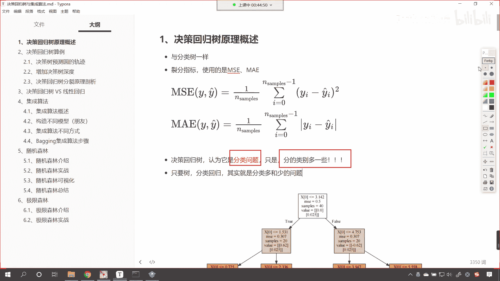
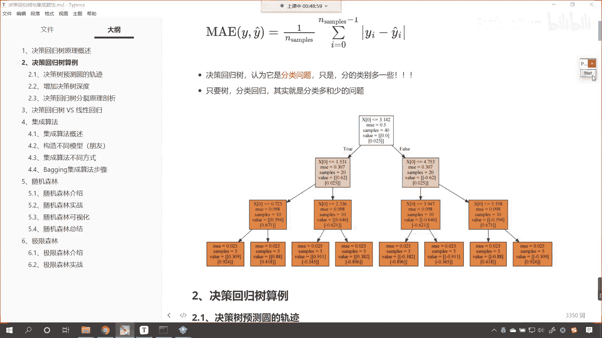

# P187：2-决策回归树原理概述 - 程序大本营 - BV1KL411z7WA

来各位小伙伴，那接下来呢我们继续往下看。

好咱们看一下咱们决策树决策回归数，它是什么样的原理，我们进行机器学习，咱们所从事的这个工作呢无非分两类，一个呢是分类问题，比如说你这个到底是男生还是女生呀对吧，这就是分类问题。

还有一类问题呢就是回归问题，比如说我们预测一下是吧，呃小孩三岁的时候，他的身高是多少，五岁的时候身高是多少，十岁的时候体重是多少，这个呢就属于是回归问题，回归问题我们发现是吧，他预测的是一个趋势。

是一个大概，而咱们的分类问题呢，是不是就是这个非此即彼呀是吧，你要么是男，要么是女好，那么我们看一下咱们的回归数是吧，它是怎样的一个原理，回归数呢与分类数一样，那咱们的例分指标呢使用的是m一和m1 a。

看一下m s e是什么，这个m s e大家看后面这个就对应着它的公式，这叫做均方误差，咱们用目标值yi减去yi上面带着一个帽子，这个呢就表示算法预测的，那真实值和预测值之间的差，咱们来一个平方。

你看这个就叫做均方误差是吧，我们i从零开始一直到n3 减一是吧，这一共是n个数，前面我们是不是除了个n减一呀，这个就是均方误差，那m a e呢这个是什么，看这个a呢就表示absolute，绝对值的意思。

那我们的m e呢，它的评价指标呢是yi减去y i杠，这个地方咱们是不是来了个绝对值呀，对不对，因为我们预测的这个回归，有的时候咱们预测的这个值比咱们真实值大，有的时候咱们预测出来这个值比咱们真实值小。

那为了衡量咱们回归数嗯，这个到底好不好，所以说咱们要么使用m s，要么使用m a e，那对于咱们的m e或者说咱们的m e，咱们的把这三个英语单词，我们呢给各位解释一下，这个m呢。

你看它其实就表示me是吧，是不是就是表示平均呀，这个s呢s q square就是平方的意思，这个e呢叫error e r r o r是吧，e r r o r，这叫做均方误差，看到了吧，这叫均方误差。

那下面这个呢叫做嗯这个me absolute error，那叫做mean absolute error，e r r o r，我们既可以使用m s e，也可以使用m a e，当然咱们哪个最常用呀。

看咱们的mesquare error，这个最常用好，那么大家还记得咱们之前分类数，看我们的决策分类数，那么它的列分指标是什么吗是吧，上一讲咱们的决策分类数，它的列分指标是什么。

看左上一节课咱们讲到了分类数的原理，他是不是可以使用信息熵呀，对不对，还有咱们还可以使用这个叫做信息增益率，对不对，唉这个信息熵其实就对应着咱们的信息增益，那我们说这个信息增益呢有它的局限性。

所以这个时候就有了一个信息增益率，上一节课咱们是不是都有介绍呀，对不对，这是咱们分类数它的一个这个分裂指标，列分指标是吧，那有公式就好办，咱们其实就可以按照公式来进行手动的计算好。

那么我们的决策回归数呢，咱们可以认为它其实也是一个分类问题，来各位小伙伴，你就能够看到是吧，这个地方呢，你看我是不是把这个分类问题用红色给它表示，给他表示了一下呀，对不对，那为什么说咱们的决策回归数。

我们可以认为它是分类问题呢，像咱们的分类问题，一般情况下都是非常明确的，男和女回归问题呢，就像咱们的身高问题，那身高呢其实是连续的是吧，每一个人和每一个人的身高，其实都多少有点不一样。

这个取决于我们精确度，一般情况下咱们说的是不是厘米呀，其实你要仔细量，你完全可以精确到毫米，甚至使用微米，对不对啊，这个时候每个人和每个人的身高，是不是就不一样了对吧，有的时候你说你的身高是175是吧。

另一个人也说他的身高是175，但是你要但是你们俩要仔细量一量，肯定是有肯定是有差距的，是不是好，那么我们的决策回归数呢，其实它分的类别多了一些，看到了吧，它分的类别多了一些。

那它分的类别多和少取决于什么呢，是不是取决于咱们这个数它的深和浅呀，对不对，好，只要是数我们分类问题或回归问题，其实就是分类多和少的问题，那我们往下看。

你就能够看到这个地方是不是就有一棵树呀，看到了吧，这个地方就有一棵树，你看一下咱们这棵树，它的深度是几呀，看这棵树深度是几，来各位小伙伴，我们在讨论区里边儿回复一下这棵树，它的深度是多少，好非常棒啊。

我们这个深度是三是吧，因为我们能够看到，你看最上面这个是不是它的树顶呀对吧，是不是它的根节点是吧，然后那这个是吧，我们换一个颜色啊啊咱们换一个颜色，我们用绿色的，看这个是不是就是它的这个这个子节点呀。

看到了吧，这个都是子节点，大家要注意啊，看这个都是子节点，是不是这个都是子节点，那么再往后我们再画一下，你看这八个都是什么，这八个都属于是叶节点，什么是叶子呀，你叶子再往后还有还有分支吗。

是不是就没了呀，这个是末端，我们把它叫做叶节点，那么绿色的这一部分我们把它叫做子节点啊，这个就是咱们的子节点，那么最上面这个呢它呢是根节点，其实呢你想这个根节点和子节点，他们俩之间的关系是不是差不多呀。

看到了吧，根节点和子节点，说白了他们俩是不是都是节点，对不对，你看都是什么，都是节点是吧，这个叶节点哎就是我们最后所落的那个落脚点，也就是说你分类问题，你把这个数据到底分到哪一个类别了是吧，回归问题。

我们把这个数据回归到哪一个哪一个这个呃，哪一个区间了是吧，这就是咱们的回归和分类，所以说无论是回归数还是咱们的分类数，其实呢它其实就是分类多和少的问题，现在呢咱们再问各位小伙伴一个问题是吧。

那请问我们的决策树和咱们的线性回归相比啊，和咱们的线性回归相比，唉大家要注意啊，这个是和咱们的线性回归相比，那么决策树有没有啊，咱们的决策树有没有方程系数这一说呢，看有没有方程，系数呢来各位小伙伴。

你在我们的讨论区里边儿，回答一下这个问题是吧，决策树有没有方程系数这一说呢，唉现在呢我告诉你答案啊，咱们的决策树呢它是没有方程系数这个概念的，那其实对于我们的决策树而言，咱们的决策树，我们这个算法。

我们这个模型它其实指的是谁呀，看到了吗，咱们这个决策树，看现在呢咱们用一个绿色的来表示啊，看这个就是一棵决策树，看到了吧，这个就是一个决策树，我们所说的算法咱们指的就是它知道吗，比如说咱们的线性回归。

我们所说的算法是不是一个方程呀，而决策树呢就对应着，咱们用绿色的这个线框起来的这个数结构，它呢就可以帮助我们去解决问题，好那么到这里呢，咱们就为各位介绍了一下。

