# P189：4-决策回归树原理未分裂mse计算 - 程序大本营 - BV1KL411z7WA

来各位小伙伴，那接下来呢我们继续往下看啊，到这里你是否明白咱们的决策回归数，它到底是怎么一回事了。

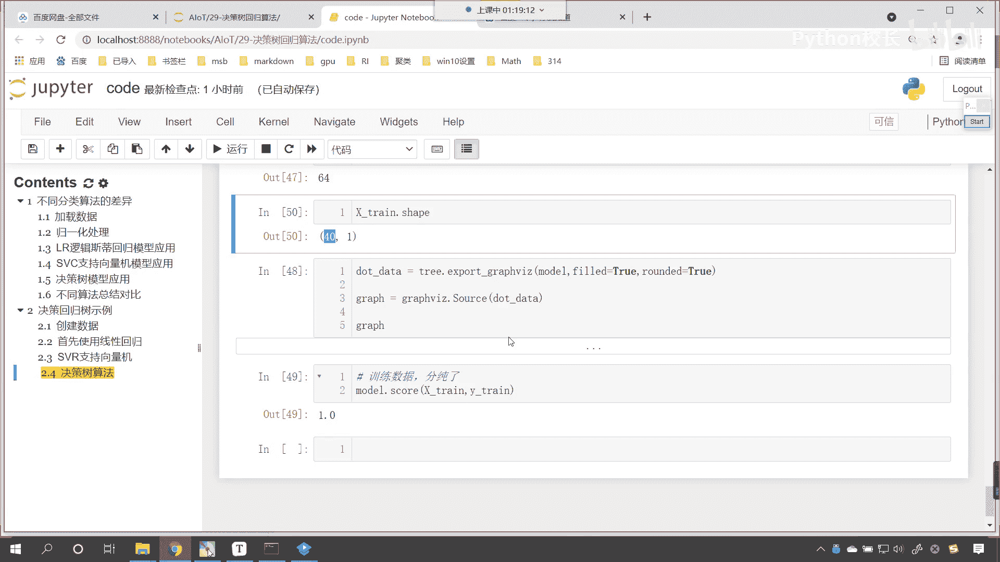

那我们咱们继续往下看啊。

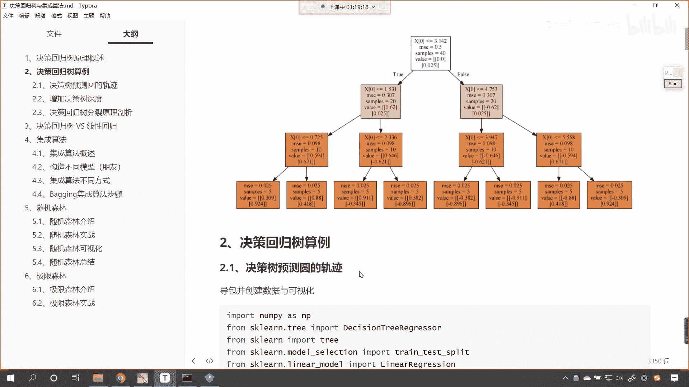

好那这个事例呢咱们进行了一个介绍。

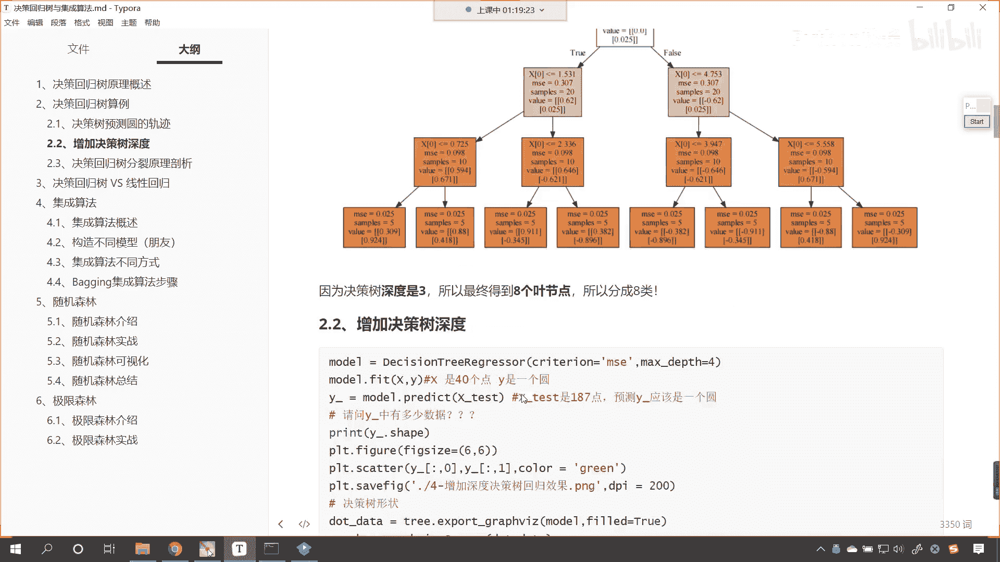

咱们呢再往下看，接下来呢我们就对于决策树是吧，这个决策回归数他的这个分裂原则是吧，分裂原理咱们呢进行一个剖析啊。

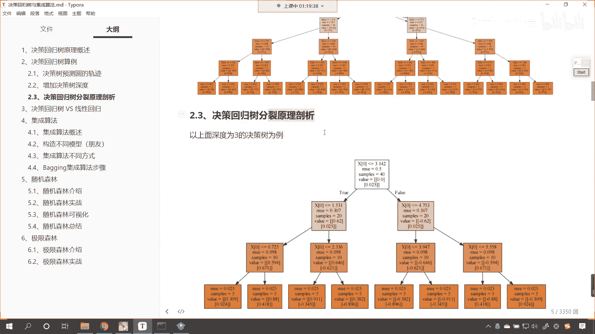

就ms这个到底是怎么算的，是不是那ms它相应的公式。

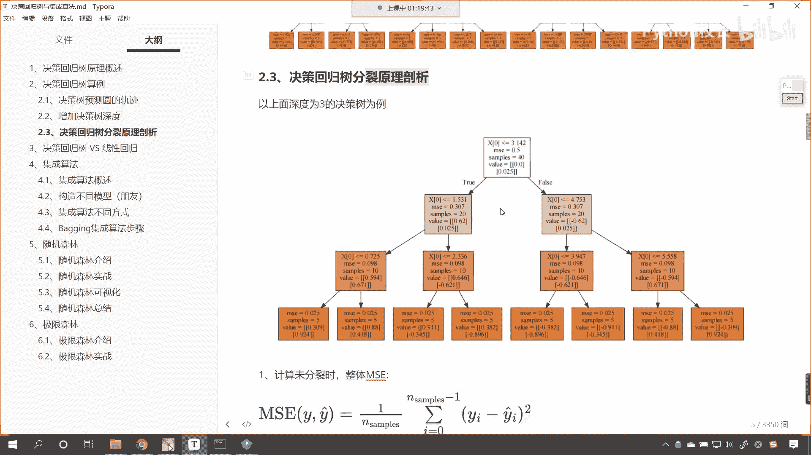

你看是不是咱们这样的一个公式呀，那有公式咱们是不是就可以进行操作呀，来我们将这个markdown的这个数学公式，咱们复制一下啊。

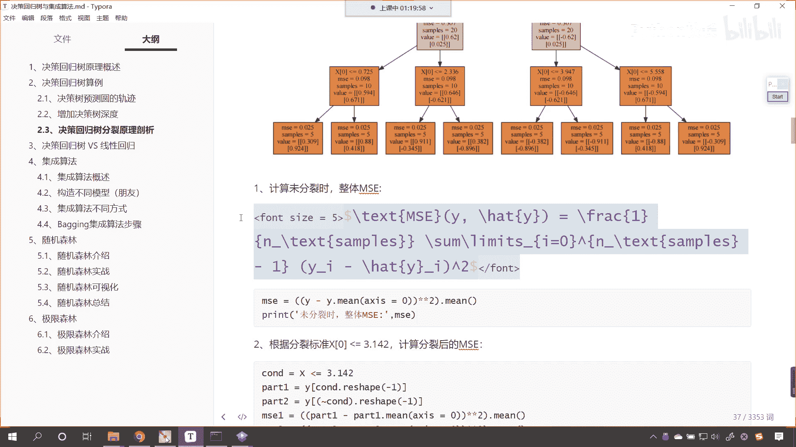

回到咱们的代码当中，在这里咱们来一个三级标题好，那么这个呢就是决策，回归数它的原理在这儿呢，咱们首先把咱们m s一这个公式，我们给它粘贴过来，把它转换成markdown，此时呢我一执行。

你看这个数学公式就有了，数学公式很简单，里边有除法，里面有平方，里边是不是还有yi减去yi，上面带着一个帽帽子呀，这个yi上面戴着一个帽子，它表示的就是咱们的预测值，那么为了掩饰咱们的原理。

咱们现在呢使用深度是三的那一颗回归数，咱们来一个model m o d e l，就等于decision tree regreer，这个当中呢我们就给一个深度max depp，咱们给一个三是吧。

然后呢model点我们拟合一下，咱们的数据x tra外下划线穿，然后呢我们将这棵树画出来，咱们对这棵树当中的关键裂分点，我们进行一个研究，那这个时候咱们就调用tra点。

一调用tree explograph model放进去，field给他一个true run，我们也给一个true好，那么此时呢咱们就接收一下叫做dot data，来将这个数据可视化一下。

graph就等于graph vz点调用source，在这个当中呢，咱们就将dot data放进去，然后输出一下graph。

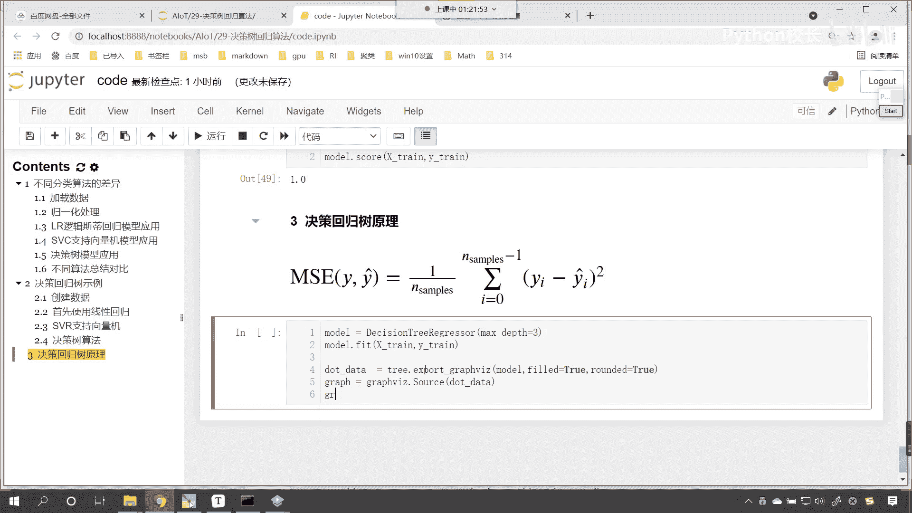

那么咱们这个图形就出来了，好现在你就能够看到这个数据是不是就有了呀，我们首先看一下咱们的树顶。

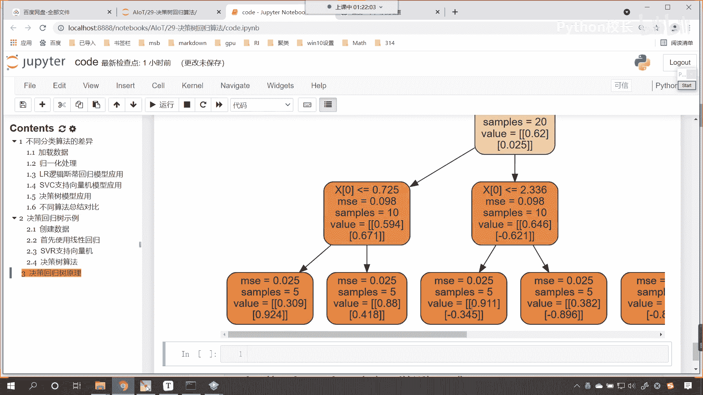

看到了吗，首先看一下咱们的根节点，根节点咱们求得的m一是多少，是不是0。5呀，那这个值到底是怎么算的呀对吧，这个值怎么算的是吧，也就是说在没有进行列分的时候，我们的m s e是零点点五，看这个根节点。

根节点是0。5，那这个根节点0。5是怎么算的呀，这个呢就是为列分啊，这个是未列分的时候是吧，未列分十，嗯这个是位列分时咱们所求得的ms唉这个数据，那原数据咱们有原数据是不是就是x train呀。

对不对呀，这个数据有对，那这个数据到底怎么算出来是0。5啊，公式咱们是不是也有呀，m s一的公式是不是也有，那我们就算一下吧。

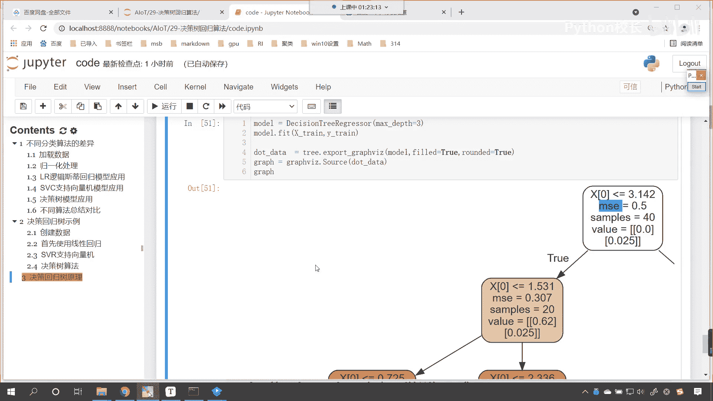

大家看啊，对应着这个公式，你就会发现这个值是不是看这个值是不是有呀，看到了吧，这个值是有，你要注意啊，此时的这个yi它表示的是谁，此时的yi我们在描述这个yi的时候。

你看此时的这个yi是对应着咱们的目标值呀，还是对应着咱们的特征值呀，这个地方大家呢哎得需要想清楚，看咱们的yy是吧，这个y它代表它代表哪个值，看ya虽然我们给的这个公式，咱们用yi来表示。

但是呢这个yi它代表哪个值，是不是代表我们的属性值呀，那属性值咱们在代码当中用什么来表示，是不是用的x来表示呀，看到了吧，咱们是不是用的x来表示，你看什么叫看决策树，决策树。

看决策树是不是根据我们的属性进行的列分呀，你想一想是不是看决策树是根据属性进行列分，那这里的属性，看这里的属性是不是就对应着咱们的x，所以说大家注意啊，符号你用x表示，y表示z表示这个有所谓吗。

这个都无所谓好，那么我们现在呢就计算一下是吧，在这儿呢咱们来一个四级标题，这个呢就叫做未位列分时，咱们的m一值是多少，好那么我们就算一下吧，你看咱们的x数据是x下划线train。

这个是我们模型训练的数据，对不对，那么嗯有这个数据，那么他的预测值该怎么表示呢，预测值我们一般用它的平均值来进行表示，所以说呢就是x x减去x乘点米啊，一般用它的平均值来表示，第一次预测的这个这个对应。

因为你第一次我们也不知道它是多少，那我们就干脆用它的平均值来表示，你想一下是吧，我们这个北上广深是中国的一线城市，很多时候呢，统计出来是多少，一般是不是都会统计一下平均薪资呀，对不对。

你看各行各业是不是都有平均薪资，互联网行业，码农程序员平均薪资是不是要高一些呀是吧，很多人都很羡慕啊是吧，一线城市他的薪资呢比二线城市，三线城市那就要高很多，所以说我们在这里。

咱们也使用平均值来表示咱们它的一个这个，它的它的一个这个标准好，那么大家看我现在做了一个什么情况，咱们现在是不是求了一个平均值，求完平均值之后，咱们紧接着干嘛，是不是来一个平方呀。

那这个时候呢咱们就来一个平方，那就是星号，星号二，你看这个时候是不是就平方了，这平方之后咱们紧接着再干嘛，平方之后你看是不是还有一个求和呀，那小括号括起来，咱们来一个sum，这个求和之后再除以一个什么。

看是不是除以样本的数量呀，咱们的样本数量，你还记得我创建的时候是不是40呀，这个时候你看我一执行嗯，嗯大家看一下，咱们所求得的这个结果是3。4587是吧，这个结果和咱们嗯，这个结果和咱们m s10。5。

这个是严重对不上的是吧，那我们看一下啊，看看哪个地方出现了一点。

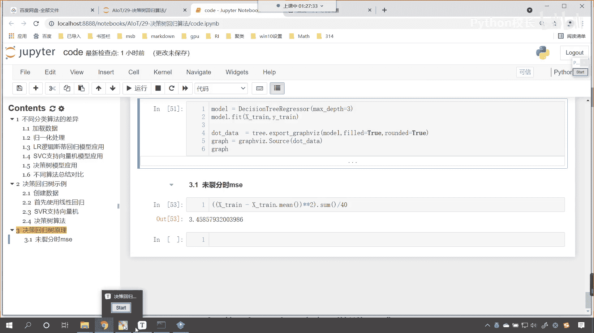

这个不一样啊，啊咱们呢依然得使用这个哦，明白了，咱们刚才在讲解的时候呢，一些概念给弄错了啊。

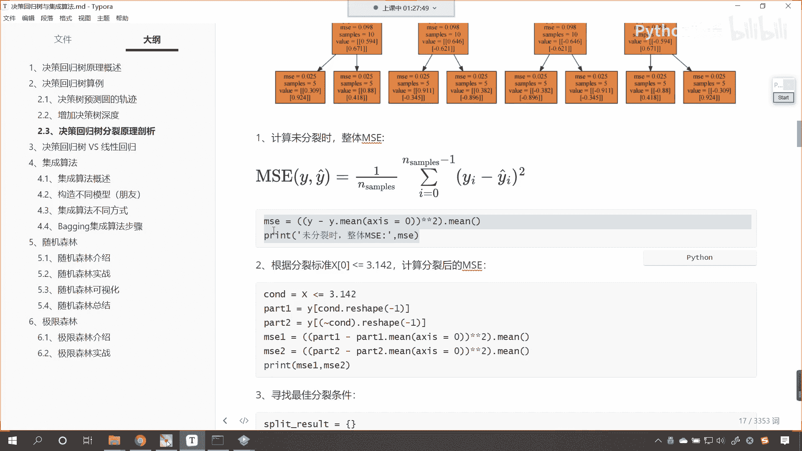

一些概念给弄错了，我们依然得使用y来进行操作，大家注意啊，咱们刚才得把这个纠正一下啊，啊咱们这个yi和咱们的yi上面戴一个帽子，你看这个是不是咱们的目标值呀，看大家注意啊，这个是目标值。

而我们图形当中的这个x0 ，你看图形当中的这个x0 ，是不是咱们的列分条件呀，啊x0 这个是我们的力分条件，那我们希望找到一个合适的裂分条件，使咱们的ms越小越好看，x中括号零啊。

x中括号零这个呢就表示列分条件啊，这个就表示列分条件，而这个m s e m s e表示它的均方误差，我们希望呢找到合适的裂分条件啊，找到合适条件使m s e越小越好，你看是不是这样的一个逻辑呀。

找到一个合适的条件，使m s e越小越好，回顾咱们嗯之前课堂当中讲决策分类数的时候，那么决策分类数，你看决策分类数它是怎么找的，这个列分条件呀，或者说根据啥呀，and roy对不对。

他其实也是找到合适的裂分条件，对不对，是不是根据咱们的目标值嗯进行了计算呀，对不对，所以说它呢根据目标值进行了一个计算，哎那所以这个时候呢咱们在计算ms的时候。

那我们呃得使用咱们的x train所对应的y，它所对应的y下划线春，然后呢外衬咱们呢对它求一个密星号，星号平方sum除以40÷40，这个时候哎我们执行一下啊，看这个时候咱们执行一下。

那我们的这个咱们的外衬呢，呃大家看看咱们的外衬，我们求得的结果是0。9996，是不是啊，那这个时候呢呃我们得看一下，其实咱们的这个外衬呢它是一个二维的数据，对不对啊，看一下咱们的外传啊。

看咱们的外传是不是这样的一个数据啊，看它是一个二维的，对不对好，那么对于这个二维的数据呢，咱们再去减这个平均值的时候，这个时候呢我们给一个轴啊，零表示行是吧，来咱们先去求一下它的平均值啊。

m e a n来我们给一个轴，让它等于零，啊让它等于零，这个时候我们求的是每一列的平均值，对不对，好，那么我们让它等于零来，这个时候你看咱们一执行呃，一执行之后呢。

呃咱们先把其中的这一部分我们给它拿出来啊，啊ctrl c在这呢来一个ctrl v，哎我们少一个小括号来，再给他来一个小括号，嗯这是我们所求解出来的每一列的，那这个时候如果我们要直接求sum除以40。

你想是不是咱们把每一列都求了呀，对不对，你看这个时候其实咱们求了第一列，求了第二列，那其实呢嗯因为是外衬呢是两列，所以说咱们求了和之后呢，我们是求了两列的和，那求着两列的和，那咱们在进行这个除法的时候。

看我们在进行除法的时候，咱们呢其实也得这个进行一个操作啊，这个时候也得进行一个操作，除以40，这个地方呢啊咱们来一个40x2，哎这个时候你看我一直行，咱们所得到的结果，那就是0。4996875。

我们四舍五入一下，咱们得到的结果，看np。raven啊，咱们这个时候呢四舍五入一下，咱们得到的结果，你看我一执行是不是就刚好是0。5呀，啊所以说咱们在未分裂的时候，咱们这个数据如何计算呢，各位小伙伴。

你就能够看到是不是通过这种方式计算的呀，对吧好，那么这种方式呢咱们计算的时候呢，呃这个时候大家要注意需要注意的点呢，是因为呢我们的y下划线tra，它呢是有两列数据，所以说咱们在进行除法操作的时候啊。

咱们在进行除法操作时是吧，我们得需要注意一下，那我们除法咱们除了40x2好，那么咱们在未分裂的时候看。

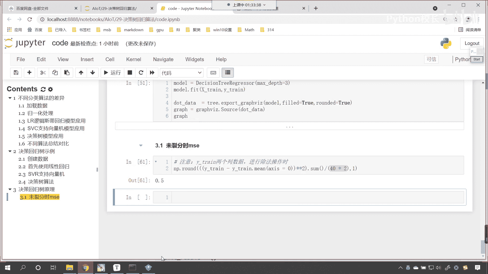

在未未分裂的时候，你现在还能够看到咱们是不是可以可以怎么样，我们是不是可以直接来一个求平均值呀，看到了吧，我们直接来一个求平均值，看到了吧，直接求平均值也是可以的，现在呢咱们就回到代码当中。

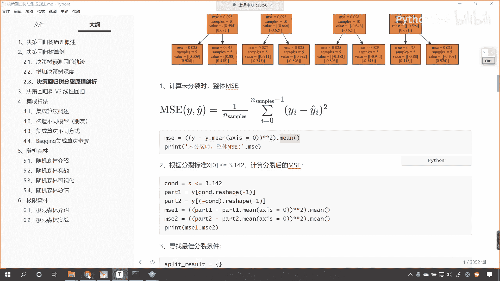

我们操作一下啊，那就是小括号，那你想我求和除以40，是不是就相当于求平均值，那咱们现在呢来一个y下划线，乘咱们减法减去y下划线train。me，看点密，我们让它等于零，然后呢对它来一个星号。

星号平方是吧，小括号把它括起来，原来我们是求总和，然后呃除了个40，这个时候咱们直接来求一个me，你看我一运行，现在你来看我得到的结果是不是，0。4996875，那如果我要调用一个np。rain的。

保留一位小数，和咱们上面计算的结果是不是就一模一样了，看到了吧，唉现在得到的结果是这样的，你看你想一下这个公式，看到了吧，这个公式求和又除以它的样本，是不是就相当于求平均呀，你看看咱们这个公式啊。

咱们首先来了一个求和，又来了一个除法除以n sample，这个是不是就相当于看它就相当于什么，是不是就相当于求平均啊，就相当于求平均，对不对，是不是就相当于求平均呀，那你既然是相当于求平均，那么是吧。

那么我在进行计算的时候，你看算出来不刚好是0。5吗，对不对好，那么我们在求平均的时候，咱们也做一个这个尝试啊，你看我们这个除法除的是不是40，这个乘以二啊，啊咱们现在呢给这个嗯做一个操作啊。

那就是40-1好，咱们来一个40-1，这个时候看一下我们的结果怎么样啊，咱们就不调用run了是吧，不调用round嗯，看40-1，这个时候你看求得的结果是0。512是吧，那我们这样啊。

这个除的是一个40x2，其实呢它是一个80，咱们减一个一啊，大家看这个时候是零点点506是吧，其实啊之前呃咱们在进行这个标准差的时候，有的时候这个分母上是减去一对不对，分母上减去一，它表示样本的标准差。

分母上不减一不减一，它表示总体的标准差，而我们这个地方咱们计算的跟那个总体标准差，跟那个是不相关的啊，跟那个是不相关的，所以说这个地方呢咱们不需要减，一直接进行计算，那你看我们这个时候。

咱们得到的结果就是0。499，是不是就是0。499，你看它的万分位上是不是有个六呀，我们四舍五入是不是这个六得入上去呀，所以说他得到的结果是0。5啊，好那么这个呢就是咱们决策树回嗯。

决策回归数原理未分裂时。

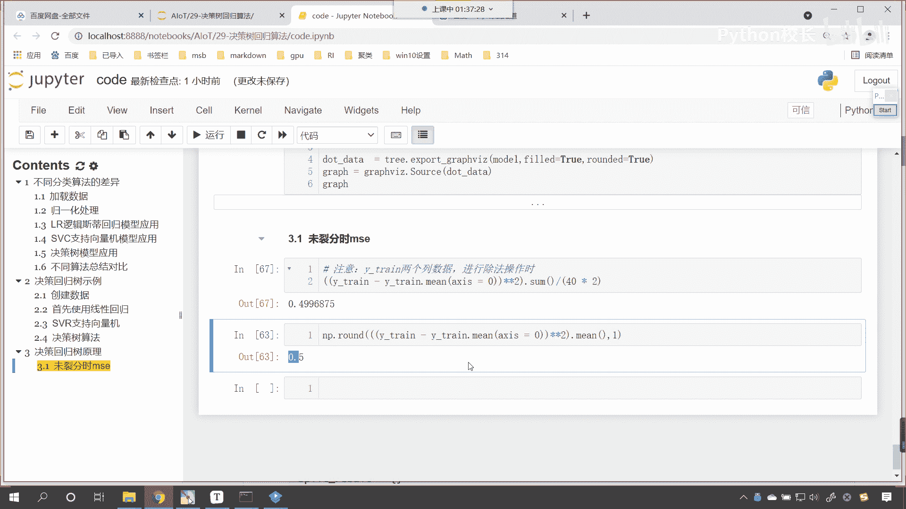