# P19：4.1.3-可视化模块获取数据 - 程序大本营 - BV1KL411z7WA

这一节我们介绍一下可视化模块，获取平台金融数据。

首先我们介绍一下，通过数据源模块来获取金融数据，我们需要在一个空白的可视化策略模板中，拖入三个模块，分别为数据源模块，正确代码列表模块和输入特征列表模块，我们在数据源模块中设置，我们所要抽取的数据表。

表明，通过证券代码列表模块设置，我们要抽取的股票范围和起止时间范围，通过输入特征列表模块来设置，我们所需要获取的表格的数据字段。

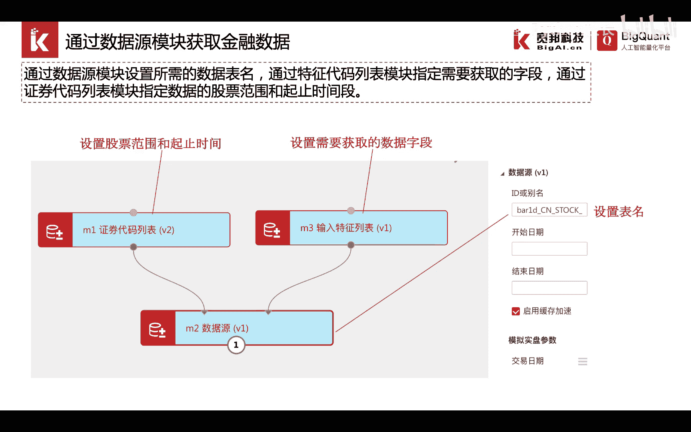

我们来看一下具体的操作。

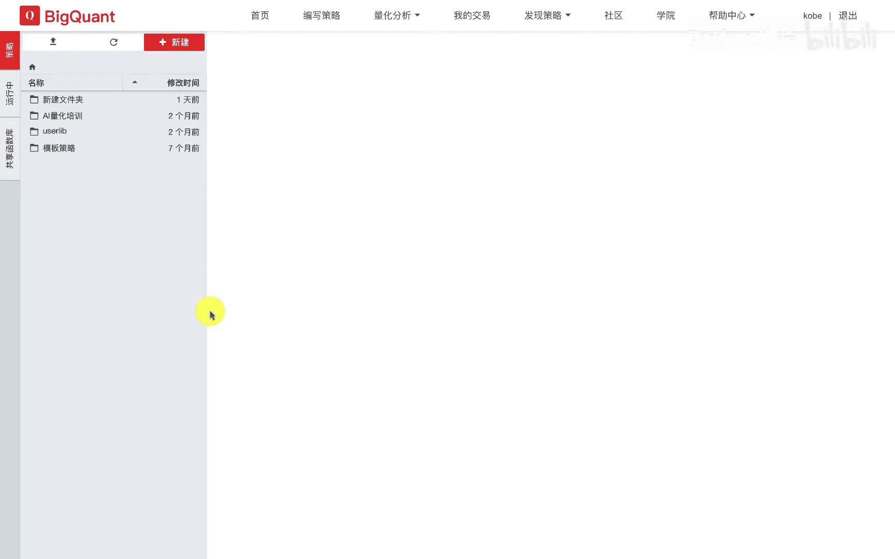

我们进入编写策略界面，然后点击新建。

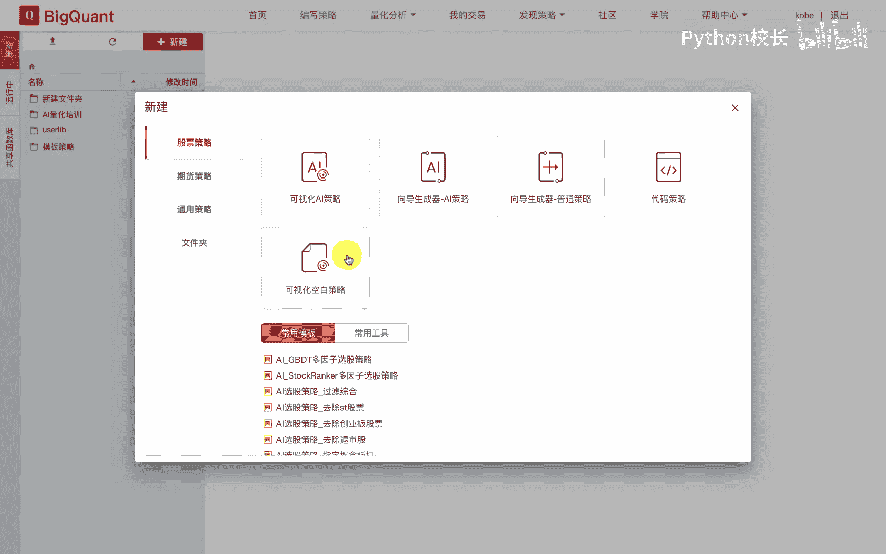

我们点击一个可视化空白策略，在弹出的窗口中，我们填入我们新建的策略名称，这里可以采用默认的可视化策略。

空白点击新建按钮，构建了一个空白的可视化策略，我们可以看到左侧为模块列表，中间呢是我们的画布区域，右侧呢是模块的属性栏，我们在左侧的数据输入输出列表中，拖入数据源模块。

证券代码列表模块以及数特征列表模块，我们可以通过点击自适应按钮，将其在画布中自适应显示，我们将鼠标移动到证券代码列表，模块的输入节点上，可以看到，此时它提示我们需要连接证券代码列表模块。

我们将鼠标移动到正确代码列表，模块的输出节点，单击左键，并拖拽到数据源模块的对应输入节点上，就实现了两个模块的连接，同样的道理，我们可以连接输入特征列表的输出节点，到数据源模块的另一个输入节点。

这样就实现了工作流的搭建，模块连接后，我们需要设置模块的参数，我们首先点击正确代码列表模块，我们在右侧的属性栏中填入，我们所需要获取金融数据的时间范围，这里我们填入2019年1月一日。

到2019年6月一日，股票代码列表，如果不添，则默认为起止时间范围内的所有股票，如果填写对应的股票，我们可以采用分行风格来指定，我们所要抽取的股票范围，例如我们可以设置股票代码列表为。

000001点s z a，和600004点s h a，代表我们需要抽取这两只股票的历史金融数据，紧接着我们可以设置数据源，在数据源的id或别名输入框中，我们需要输入我们所要抽取的数据表。

表明我们通过文档数据字典数据表，可以查看到对应的表类型，我们点击行情数据，可以看到a股行情日线数据的表，表名为8e d cn stock a，我们复制这个表明并切换回来。

在数据源模块的i d或别名参数表中，输入这个表明，这样就完成了数据源模块的参数填写，开始日期和结束日期会继承m2 模块，也就是证券代码列表模块，的开始日期和结束日期，最后我们在m3 模块中。

填入我们所需要的数据表字段，我们可以看到8d cn stock a a股日线行情数据，该表中的字段包括了open close，我们这里取出开盘价open以及收盘价clothes，这两个数据字段。

并填入到输入特征列表中，这样我们就完成了工作流的编制。

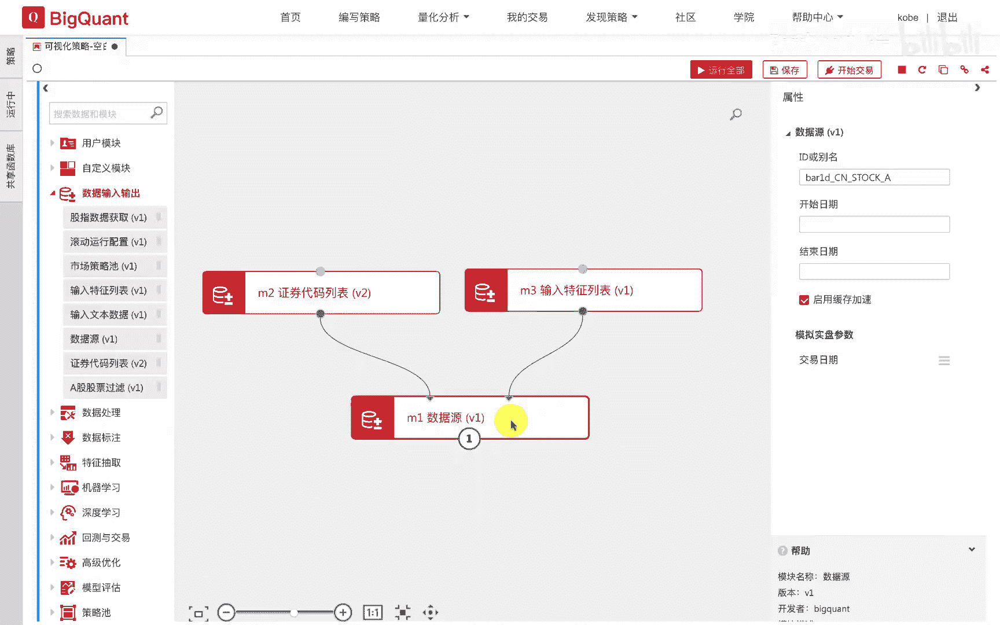

下面我们介绍一下如何通过基础特征抽取模块，获取因子库数据，我们可以通过证券代码列表模块，输入特征列表模块和基础特征抽取模块，来实现因子库数据的抽取，我们在输入特征列表模块中。

添入我们所需要抽取的因子名称，通过证券代码列表模块指定我们需要抽取的，因此数据股票范围和起止时间，即可以通过基础特征抽取模块实现，因此数据的抽取，在基础特征抽取模块中，我们在向前取天数中。

可以设置向前抽取的因子数据天数，来获取更多的历史数据。

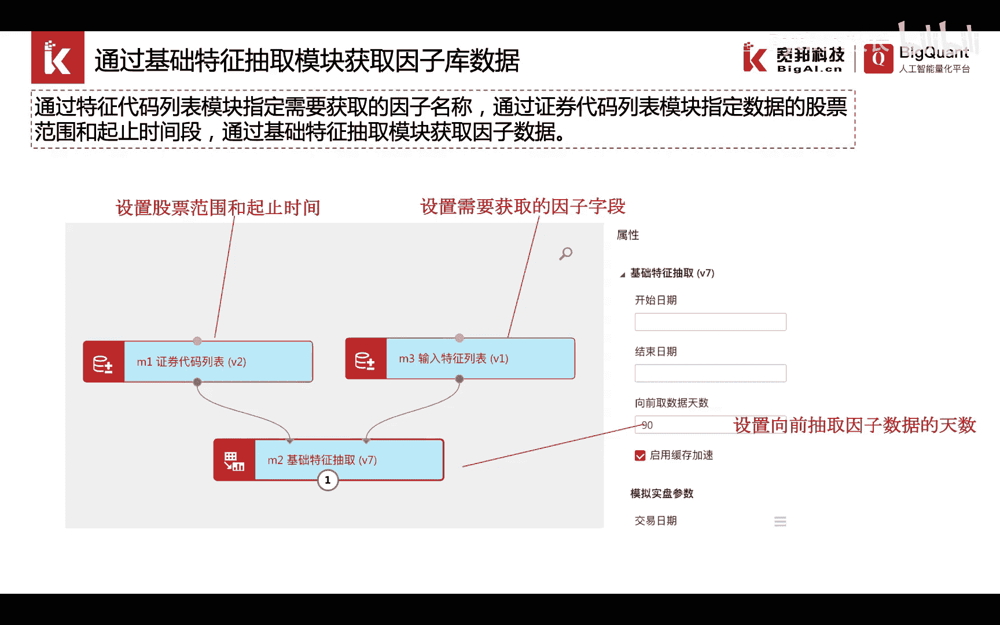

在实际操作中，我们可以用类似的方法，在可视化策略画布中拖入证券代码列表，输入特征列表以及特征抽取的基础，特征抽取列模块，我们通过连线将三个模块连接在一起，在证券代码列表模块中，我们填入所需的时间范围。

和抽取的股票代码范围，这里我们依然填写，2019年1月一日到2019年6月一日，这里我们默认采用抽取全市场的股票范围数据，因此股票代码列表中我们不填入任何信息，我们在输入特征列表中。

填入我们所需要抽取的因子数据，我们可以在文档中，在因子表，在因子库的文档说明中来查看，我们可以获取到的，因此字段名，例如我们需要获取每只股票的上市天数，list day 0，我们可以填入对应的字段名。

假如我们需要抽取对应的复权因子，那么我们可以填入对应的复权因子，因子的名称，当我们在输入的时候，系统会自动提示进行因子的补全，并告诉我们每个因子的真实含义。

例如adjust factor一代表了前一日的复权因子，填入输入特征列表后，我们就完成了，因此数据抽取的流程。

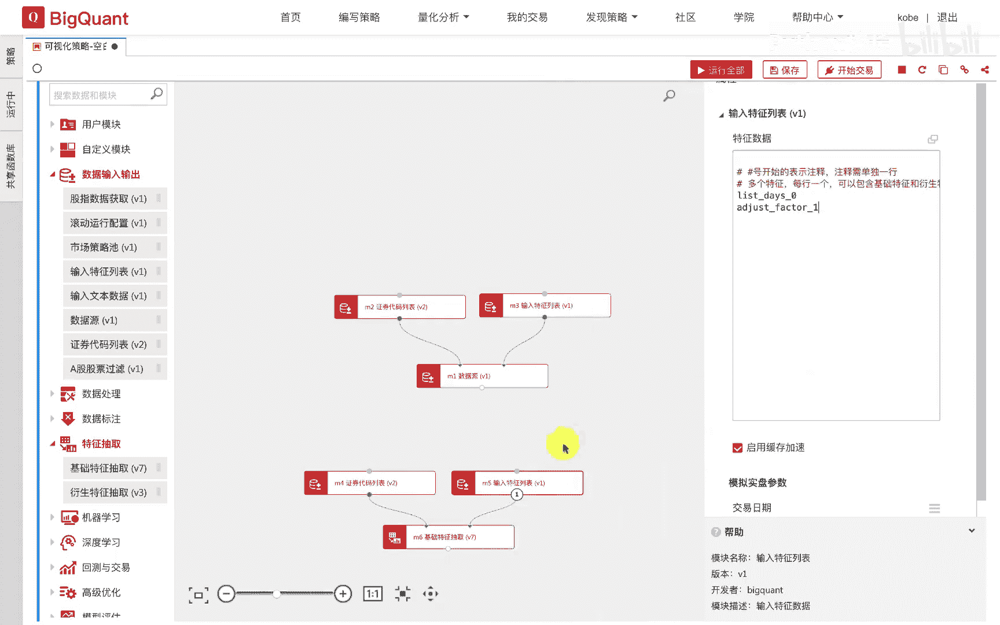

我们通过右键数据源模块或基础特征抽取模块，点击运行，选中模块就可以进行模块或工作流的运行。

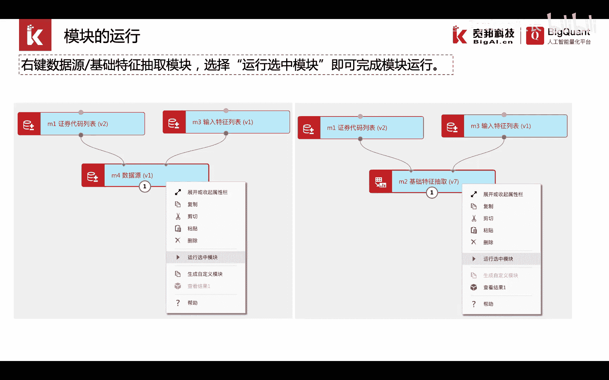

在画布中我们右键选中数据源模块，点击运行，选中模块，可以看到，该策略的左上角会显示一个星号，并启动运行状态，在下方的日志中，会打印出每个模块运行的时间范围，运行的结果完成与否等日志。

同样的操作我们选择右键单击基础特征，抽取模块，并选择运行，选中模块，同样也可以看到每个模块的运行，对应的时间以及运行的过程日志，当模块全全部运行完毕后，会显示运行完成并左上角的圆圈停止旋转。

表示相应的模块已经运行完成。

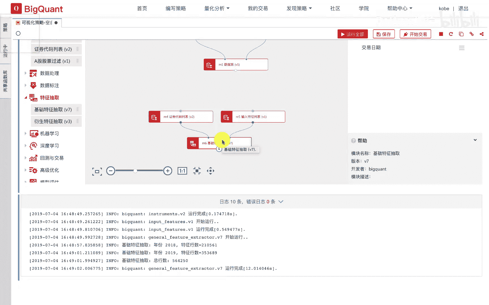

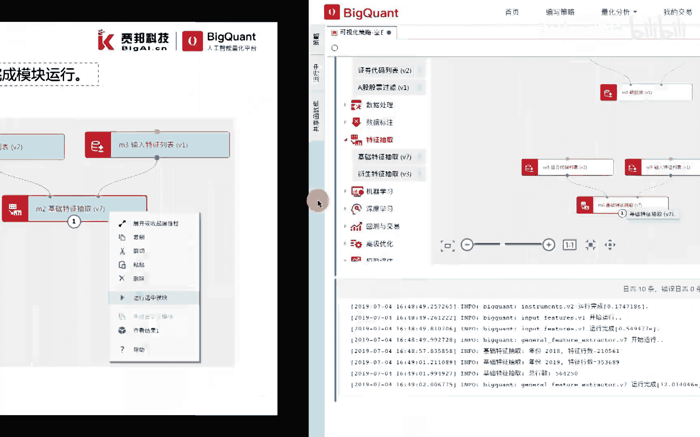

如果我们想查看抽取的数据，也就是模块运行的结果，我们有两种方式，可以通过右键选中一个模块来选择查看结果，来实现模块运行结果的可视化查看，也可以通过代码的方式进行交互式，获取模块的运行结果。

模块的运行结果存放在缓存data source中，我们可以通过模块号，点data这样一个方法获取数据存储的缓存地址，再通过点read方法或redf方法来实现data frame。

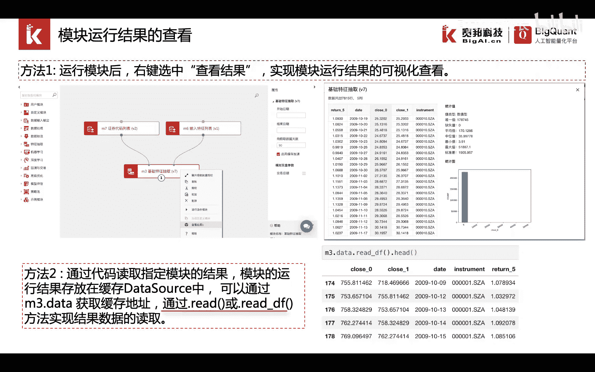

结果数据的读取，例如我们右键m一数据源模块，选择生查看结果。

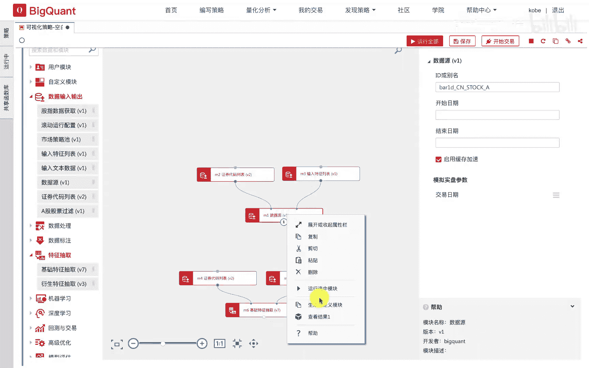

一，我们可以看到在屏幕上弹出一个窗口，并显示该模块的运行结果，左侧为生成的数据，我们抽取的open和clothes开盘价，收盘价两列数据展示在这里，这里展示了我们选取的时间范围内。

所选取的股票的对应每日的开盘价和收盘价格，当我们点击某一列的时候，可以看到该列数据的统计值结果包括唯一值，数量缺失值，该列的平均值，中位数，最小值，最大值，标准差等统计信息，以及统计分布图。

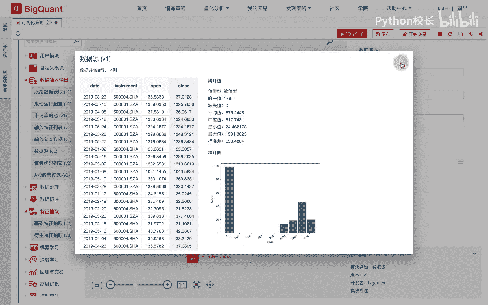

同样的道理，我们点击右键基础特征抽取模块。

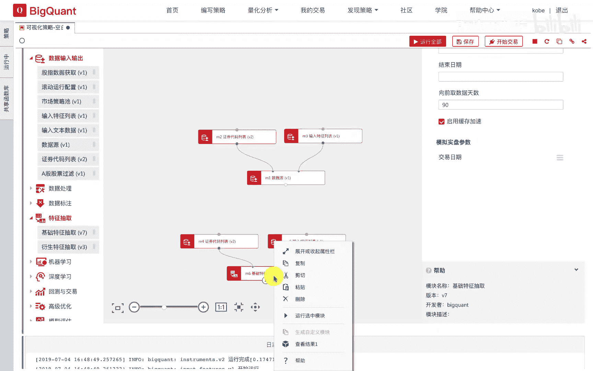

选择查看结果，一会弹出一个对话框，并显示我们所抽取的因子，list day，零上市天数和just factor一前一日的复权因子，我们点击对应的列，可以查看该列的数据统计值。

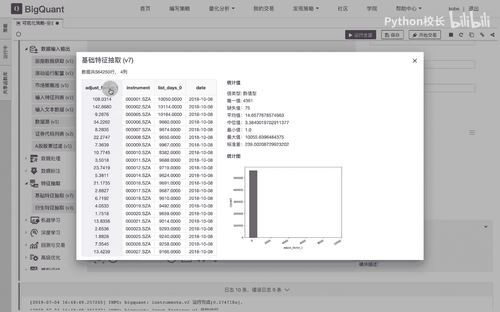

我们同样可以采取第二种方式，交互式的方法来查看模块的运行结果，例如我们要查看m一数据源模块的运算结果，可以输入m一点data。rate或read df，并点击运行。

可以看到这是我们模块的返回的数据运行结果，与前端展示的是完全一致的，如果我们只查看数据的前几行，我们可以加一个had，同样的道理，我们可以选择查看m6 模块，也就是基础特征抽取模块的运行结果。

此时我们可以输输入m6 点data，点read或read df，可以查看到我们所抽取的因子库。

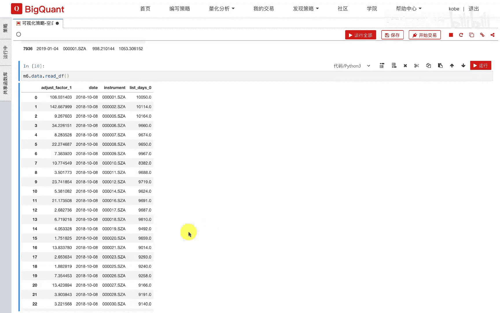